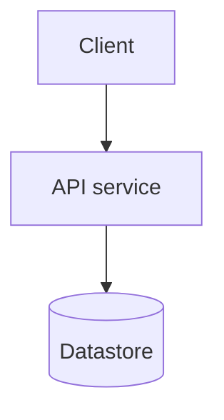
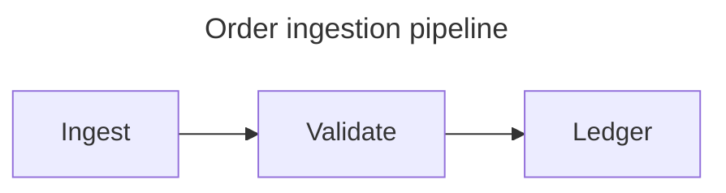
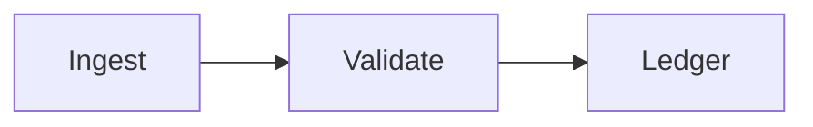
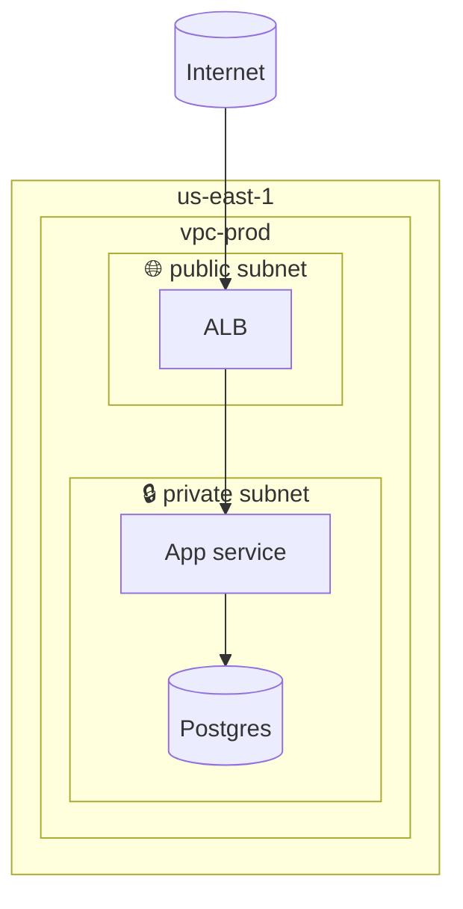
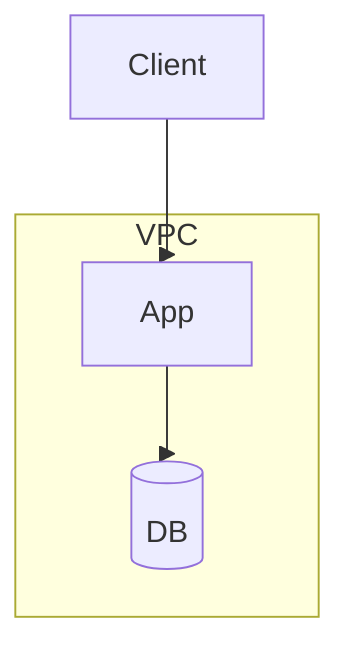

# Mermaid flowchart — the architecture workhorse

The right default for *deployment*, *infrastructure*, *integration*, and
*topology* diagrams. Renders cleanly in GitHub, Confluence, Azure DevOps
Wiki, and GitLab.

## Skeleton

````

````

`flowchart TB` is top-to-bottom — best for deployment hierarchies.
`flowchart LR` is left-to-right — best for anything with a reading
order: request flows, and **pipelines / ETL / CI-CD stages /
data-flow** where the eye should track stages start-to-finish. Pick one
and stick with it within a diagram.

## Title and accessibility metadata

Give the diagram an in-source title with Mermaid's **config frontmatter**
(a YAML block fenced by `---` at the very top of the Mermaid source,
Mermaid ≥ 10.5) — it renders as a heading above the diagram:

````

````

This is the portable version of a diagram title — it renders in current
Mermaid (`mmdc` and the repo's `render-proof` / `markdown-to-html`
renderers pin `mermaid@11`). It is still a version-dependent feature, so
carry the same venue caveat the skill applies to `architecture-beta` /
`timeline` and friends: **the prose scope sentence above the diagram
stays the always-portable baseline** — the frontmatter title augments it,
it doesn't replace it. Do **not** reach for a `%% title:` comment: `%%`
is Mermaid's comment marker and is dropped by every renderer.

For screen-reader accessibility, add `accTitle` (short) and `accDescr`
(longer) inside the diagram body — they emit to the SVG's `<title>` /
`<desc>` and are supported across diagram types (flowchart, sequence,
state, er, …), not just flowcharts:

````

````

Recommended for any diagram that will ship in a docs page or wiki; it is
the diagram analogue of alt text. Renderers vary in whether they expose
it, so treat it as reinforcement, never the sole carrier of meaning.

## Node shapes (architecture-relevant)

| Shape | Mermaid | Use for |
| --- | --- | --- |
| Rectangle | `A[Label]` | Service, component, generic |
| Rounded | `A(Label)` | External actor, person |
| Stadium | `A([Label])` | Start / end / boundary marker |
| Subroutine | `A[[Label]]` | Queue, topic, channel |
| Cylinder | `A[(Label)]` | Database, persistent store |
| Trapezoid | `A[/Label/]` or `A[\Label\]` | Object store, blob, file system |
| Diamond | `A{Label}` | Decision, conditional routing |
| Hexagon | `A{{Label}}` | External system, third-party |
| Circle | `A((Label))` | Junction, fan-in / fan-out |
| Flag / banner | `A>Label]` | Annotation or event marker (use sparingly) |

Be consistent across the diagram — pick one shape per *category* of
thing and never mix.

## Edges

| Mermaid | Meaning |
| --- | --- |
| `A --> B` | Synchronous call, A initiates |
| `A -.-> B` | Asynchronous call, fire-and-forget |
| `A --o B` | Observation / read-only |
| `A --x B` | Failure path / terminates |
| `A === B` | Strong / heavy coupling (used sparingly) |
| `A -->|"label"| B` | Labeled edge — name the protocol or payload |
| `A --- B` | Undirected link — dependency or association without direction |
| `A ==> B` | Thick arrow — critical path or primary data flow |
| `A ==Label==> B` | Labeled thick arrow |

**Always label edges** that cross a trust boundary or carry data.
"HTTPS" alone is fine; "gRPC orders.v2" is better; "uses" is wrong.

### Edge semantic conventions

Use these shapes consistently across diagrams in the same workspace so
reviewers can read new diagrams without a legend:

| Shape | Semantic |
| --- | --- |
| `-->` | Primary synchronous call / main data flow |
| `-.->` | Asynchronous, optional, or out-of-band |
| `==>` | Critical path — highlight the hot route |
| `---` | Association or dependency (no direction implied) |

### Multi-target shorthand

Fan-out from a single source to several targets in one line:

```
A --> B & C & D
```

Equivalent to `A --> B`, `A --> C`, `A --> D`. Use when the edge carries
the same label to all targets; create separate edges for different labels.

## Subgraphs — for boundaries

Subgraphs are the workhorse for cloud boundary nesting. Nest them
inside-out for visual clarity.

````

````

Use a dashed border for *trust* boundaries — Mermaid renders this via
the `classDef` mechanism:

```
classDef trust stroke-dasharray: 5 5
class accountA,accountB trust
```

## Styling — use sparingly

Stick to defaults. The exception is the trust-boundary `classDef`
above. Heavy theming rots fast and doesn't reproduce across wiki
renderers.

## Edge routing — curve style

Mermaid's default edge curve is `basis` — smooth Bézier paths. For
architecture diagrams, orthogonal routing removes visual clutter inside
nested subgraphs:

| Value | Route shape | When to use |
| --- | --- | --- |
| `basis` (default) | Smooth Bézier | Informal diagrams, general use |
| `step` | Right-angle bends at midpoint | **Architecture default** — deployment, cloud topology, boundary diagrams |
| `stepBefore` | Right angle near the source | Flow enters node laterally |
| `stepAfter` | Right angle near the target | Flow leaves node laterally |
| `linear` | Straight lines | Compact diagrams with many parallel edges |

Set it with the `%%{init}%%` directive at the top of the diagram:

````

````

The `%%{init}%%` directive is Mermaid's original configuration path and is
still fully supported. The YAML `---` frontmatter block (Mermaid ≥ 10.5) is
the more readable alternative when setting two or more keys; both produce
identical output.

## Layout control

### Subgraph direction override

A subgraph may declare its own layout direction as its first statement:

```
subgraph pipeline["Pipeline"]
    direction LR
    Ingest --> Transform --> Load
end
```

**Critical constraint**: the direction override is silently ignored when any
node inside the subgraph has an edge to a node *outside* that subgraph.
Mermaid's dagre engine must resolve all ranks globally in that case and
cannot honour the local override. Keep the override only on self-contained
subgraphs with no external edges.

Set `inheritDir: true` to make subgraphs without an explicit `direction`
statement inherit the diagram's top-level direction:

```
%%{init: {'flowchart': {'inheritDir': true}}}%%
flowchart LR
    subgraph A ... end
    subgraph B ... end
    A --> B
```

### Spacing

Three keys under the `flowchart` init key control spacing. All three are
**diagram-global** — Mermaid applies one value across the whole canvas,
not per-subgraph:

| Key | Default | Effect |
| --- | --- | --- |
| `nodeSpacing` | 50 | Horizontal gap between nodes on the same rank |
| `rankSpacing` | 50 | Vertical gap between ranks |
| `diagramPadding` | 8 | Outer margin around the diagram canvas |
| `padding` | 15 | Inner padding inside each node shape |

```
%%{init: {'flowchart': {'nodeSpacing': 80, 'rankSpacing': 100, 'diagramPadding': 30}}}%%
```

When the subgraph title collides with its first child node, `subGraphTitleMargin`
is the targeted fix — it adds padding specifically below the title without
stretching all inter-rank gaps:

```
%%{init: {'flowchart': {'subGraphTitleMargin': {'top': 5}}}}%%
```

Increase `rankSpacing` when ranks themselves are too close; `subGraphTitleMargin`
is the right lever when only the title is crowding its children.

**Placement bug**: spacing directives placed at the root of the `%%{init}%%`
object are silently ignored. Always nest them under `'flowchart': {}`.

### Label wrapping

Mermaid auto-wraps node labels at `wrappingWidth` characters (default 200).
Lower it when long labels are clipping:

```
%%{init: {'flowchart': {'wrappingWidth': 120}}}%%
```

Text-drives-layout: Mermaid derives node dimensions from label content —
there is no per-node size override. Use `\n` to force a line break in a label
(plain text output); use `<br/>` when the output is HTML or SVG.

## ELK renderer — for complex graphs

Mermaid ships a second optional layout engine, **ELK** (Eclipse Layout
Kernel), available as the npm package `@mermaid-js/layout-elk`. Where dagre
uses a barycentric Sugiyama rank assignment, ELK's default strategy
(`BRANDES_KOEPF`) implements the Brandes-Köpf 2002 coordinate-assignment
algorithm — minimises edge bends and produces more compact, visually balanced
graphs at the cost of an extra npm dependency.

Enable it with YAML frontmatter:

````

````

| ELK option | Values | Effect |
| --- | --- | --- |
| `mergeEdges` | `true` / `false` (default) | Bundle parallel edges — reduces clutter for hub-and-spoke graphs |
| `nodePlacementStrategy` | `BRANDES_KOEPF` (default) · `LINEAR_SEGMENTS` · `NETWORK_SIMPLEX` · `SIMPLE` | `BRANDES_KOEPF`: compact + balanced (Brandes-Köpf 2002); `LINEAR_SEGMENTS`: consistent row alignment; `NETWORK_SIMPLEX`: stronger crossing minimisation at higher cost; `SIMPLE`: fast, lower quality |

**Venue caveat — ELK availability varies by environment.** The ELK engine
requires `@mermaid-js/layout-elk` to be loaded. When absent, the renderer
silently falls back to dagre. Confirmed availability:

| Venue | ELK available |
| --- | --- |
| `mmdc` (Mermaid CLI) v11+ | Yes — bundled as a required dependency |
| Mermaid Live Editor | Yes |
| Mermaid Chart platform | Yes |
| GitHub, Quarto, Joplin, Obsidian core | No — not bundled in their Mermaid build |
| Self-hosted / custom installs | Depends — check whether `@mermaid-js/layout-elk` is installed |

In venues where ELK is unavailable, tune `nodeSpacing` and `rankSpacing` instead.

## Common architecture pitfalls

- **Top-down flowchart used as a request flow.** Switch to
  `flowchart LR` or use a `sequenceDiagram`.
- **One mega-flowchart with 30 nodes.** Split by scope sentence.
- **All edges unlabeled.** A diagram without labeled edges is
  abstract art.
- **Mixing shapes inconsistently** — `[Service A]` and `(Service B)`
  for two services that play the same role. Pick one.
- **Invisible links (`A ~~~ B`) as a layout crutch.** Invisible links
  force node positioning by adding a hidden dependency. Their presence
  signals the diagram has more nodes than the layout engine can place
  sensibly — the right fix is to split the diagram, not add invisible
  scaffolding.
- **Edge labels that are not grammatical.** Labels like `"uses"` or
  `"calls"` are meaningless. Use noun phrases naming the protocol or
  payload (`"HTTPS"`, `"orders.v1 Kafka topic"`) or verb phrases naming
  the action (`"submits pick request"`). Vague labels actively mislead.
- **Edge label overlap.** When two edges cross or share a path segment,
  their labels stack illegibly. Fix by increasing `rankSpacing` or
  `nodeSpacing`, switching to `curve: step` for orthogonal routing, or
  restructuring the diagram so the crossing doesn't occur.
