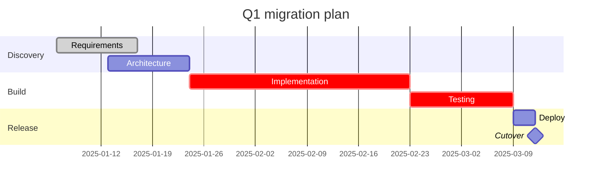

# Mermaid gantt — project schedule with durations

The right notation for *when does each task happen, what depends on what*
— a project schedule, a sprint plan, a migration timeline where task
duration and sequencing matter. Has a time axis; models start dates,
durations, and `after` dependencies.

Use `gantt` for **illustrative schedules** — to communicate a plan or a
constraint to a team. It does not update itself; it is a static diagram,
not a live PM tool.

When the question is purely chronological (what happened when, no
durations), prefer `timeline` instead — gantt is overkill when you only
need "what happened when."

## Skeleton



## Required header

```
gantt
    title <text>           %% optional but recommended
    dateFormat YYYY-MM-DD  %% required — tells Mermaid how to parse dates
```

Common `dateFormat` values: `YYYY-MM-DD`, `DD/MM/YYYY`, `MM-DD-YYYY`.
The format must match every date string in the diagram exactly.

## Sections

```
section <name>
```

Groups tasks visually into rows with a label on the left. All tasks below
a `section` belong to it until the next `section`.

## Task syntax

```
<Label>  :<modifiers>,  <id>,  <start>,  <end>
```

| Part | Notes |
| --- | --- |
| `<Label>` | Display name — keep ≤ 20 chars; long labels overflow the bar |
| `<modifiers>` | Any combination of: `done`, `active`, `crit`, `milestone` |
| `<id>` | Optional identifier — referenced by `after <id>` dependencies |
| `<start>` | A date (`2025-01-06`) or `after <id>` |
| `<end>` | A date, a duration (`30d`, `2w`), or another task id |

### Status modifiers

| Modifier | Rendering | Meaning |
| --- | --- | --- |
| `done` | Grey | Completed |
| `active` | Blue | In progress |
| `crit` | Red | Critical path |
| `milestone` | Diamond | Key event — set duration to `0d` |
| *(none)* | Teal | Default / planned |

Modifiers combine: `crit, active` renders a red in-progress bar.

### Dependencies with `after`

```
Implementation :impl, after arch, 30d
```

`after arch` starts the task immediately after the task with `id: arch`
ends. The upstream task must be declared **before** the `after` reference.
Chain multiple: `after arch req` starts after both finish.

## Axis control

```
    axisFormat  %m/%d
    tickInterval 1week
    excludes weekends
    excludes monday, tuesday
```

| Directive | Effect |
| --- | --- |
| `axisFormat %m/%d` | Date format on the X axis (strftime-like) |
| `tickInterval 1week` | Spacing between ticks (`1day`, `1week`, `1month`) |
| `excludes weekends` | Skip Saturday and Sunday from the axis |
| `excludes <day>` | Skip a specific named day |

## When `gantt` is the right choice

- Sprint or quarter plan where task durations and blockers matter.
- Migration schedule with sequential dependencies (step B can't start
  until step A ships).
- Communicating a deadline constraint to stakeholders.

## When to use something else

- **Pure chronology / roadmap (no durations)** → `timeline`; gantt adds
  complexity without value when you only need order.
- **More than ~20 tasks** → break into multiple diagrams by phase, or use
  a proper PM tool. Dense gantt diagrams lose the "at a glance" value.
- **Live project tracking** → gantt is a static artifact; it does not
  update as work progresses.

## Common pitfalls

- **`after <id>` references an undefined id.** Mermaid renders blank.
  Declare the upstream task with an explicit `id` before the `after`
  reference.
- **`dateFormat` missing.** Without it, date strings are unparsed and the
  axis is wrong or empty.
- **Long labels.** Mermaid clips labels at the bar width. Use ≤ 20
  characters or abbreviate.
- **Milestone with non-zero duration.** A milestone with a duration renders
  as a bar, not a diamond — set it to `0d` explicitly.
- **`after` chain not in declaration order.** If task B depends on task A
  via `after A`, task A must appear in the diagram source before task B.
