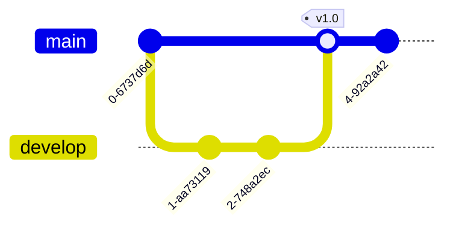
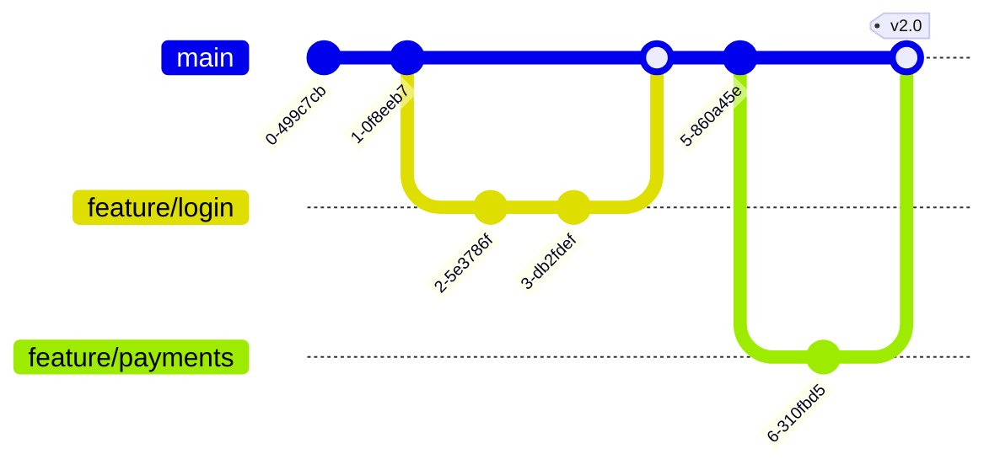
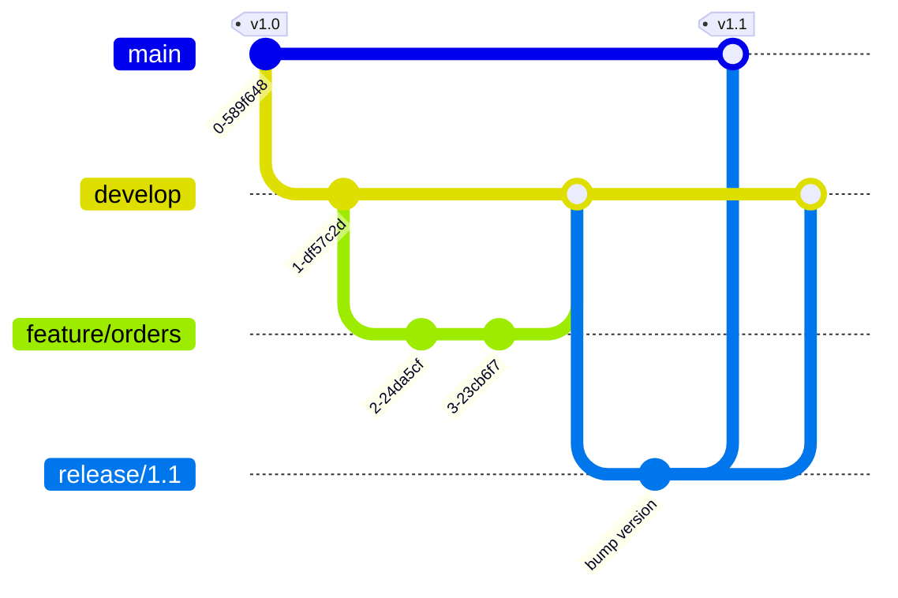

# Mermaid gitGraph — branching strategy and merge workflow

The right notation for *how is version control structured* — a branching
strategy, a release workflow, a rebase or cherry-pick pattern. Shows
commits and branches as a communication artifact, not as an authoritative
history.

Use `gitGraph` to explain a strategy to a team or document a workflow
decision. Do **not** use it to represent the real repository history —
`git log --graph` is authoritative for that; a generated diagram is always
out of date.

## Skeleton



## Vocabulary

| Statement | Effect |
| --- | --- |
| `commit` | Adds a commit to the current branch |
| `commit id: "label"` | Named commit — the label appears on the node |
| `commit type: HIGHLIGHT` | Visually accents the commit (also `REVERSE`, `NORMAL` default) |
| `commit tag: "v1.0"` | Attaches a tag marker to the commit |
| `branch <name>` | Creates a new branch and checks it out |
| `checkout <name>` | Switches to an existing branch |
| `merge <name>` | Merges the named branch into the current branch |
| `merge <name> tag: "v1.0"` | Merge commit with a tag |
| `cherry-pick id: "label"` | Cherry-picks the commit with that `id` onto the current branch |

`cherry-pick` requires the source commit to have been declared with an
explicit `id` earlier in the diagram — gitGraph does not know the real
repository history.

## Examples

### Trunk-based development



### Git flow (abridged)



## Configuration

Control rendering with frontmatter (Mermaid ≥ 10.5):

```
---
config:
  gitGraph:
    mainBranchName: main
    showBranches: true
    showCommitLabel: true
    rotateCommitLabel: true
    parallelCommits: false
---
gitGraph
    commit
    ...
```

| Key | Default | Effect |
| --- | --- | --- |
| `mainBranchName` | `main` | Renames the default branch label in the diagram |
| `showBranches` | `true` | Show / hide branch lane lines |
| `showCommitLabel` | `true` | Show / hide commit id labels |
| `rotateCommitLabel` | `true` | Rotate labels 45° — prevents crowding on dense diagrams |
| `parallelCommits` | `false` | Align commits at the same depth across parallel branches |

## When `gitGraph` is the right choice

- Explaining a branching strategy to a team ("here is how trunk-based
  works for us").
- Documenting a release or hotfix workflow decision in a design doc or PR.
- Showing a cherry-pick or rebase pattern as a teaching aid.

## When to use something else

- **Project schedule / timeline** → use `gantt` or `timeline`; gitGraph
  has no time axis and no duration concept.
- **Actual commit history** → run `git log --graph --oneline` or use a GUI;
  any generated diagram is already stale.
- **Code or request flow** → use `sequenceDiagram` or `flowchart`.

## Common pitfalls

- **Committing on the wrong branch.** `branch x` creates *and* checks out
  `x`. If you then do `commit` without `checkout main` first, those commits
  go on `x`, not `main`. Be explicit about `checkout` before every run of
  commits.
- **`cherry-pick` references an unnamed commit.** The `id` in
  `cherry-pick id: "label"` must match a `commit id: "label"` declared
  earlier. Without the matching `id`, Mermaid renders a broken diagram.
- **More than 6–8 branches.** The diagram becomes unreadable. Split into
  two: one showing the main branching strategy, one showing the
  release / hotfix flow.
- **Treating the diagram as authoritative.** It is a design artifact. Update
  it as the strategy changes; never generate it from the real history.
