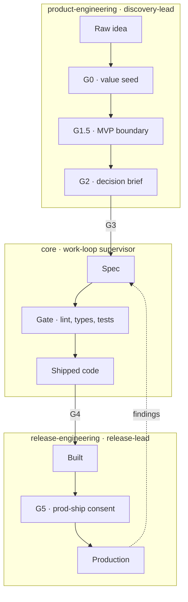

The three loops form the **company operating model** — peer supervisors spanning the full software lifecycle. No loop is a mode of another; each is independent with its own agent, skill doctrine, and consent gates.

Each loop is **autonomous where the work is reversible** and surfaces to a human where it isn't.

---

## The Discovery Loop — `product-engineering`

`discovery-lead` takes a raw product idea and walks it through a structured diverge/converge cycle:

1. Five candidate product shapes explored in parallel
2. Collapsed through product, UX, architecture, and safety lenses simultaneously
3. Results written to a shared blackboard — no chat relay between lenses
4. A ratified **decision brief** exits at G2
5. A decomposed feature-level plan exits at G3 into `work-loop`

The result isn't a validated solution — it's a **connected hypothesis with validation hooks**: the riskiest bets named explicitly, the MVP boundary set by a human, the decision log append-only and hash-chained.

**Three human consent gates:** G0 (ratify the value seed), G1.5 (ratify the MVP boundary), G2 (ratify the decision). The loop never auto-advances past an irreversible gate.

[Discovery loop deep dive](/agent-ready-repo/docs/guides/product-engineering/explanation/the-discovery-loop/)

---

## The Build Loop — `core`

Every change goes through:

| Phase | What happens |
|---|---|
| **Plan** | Name the assumptions, files to touch, tests to write, what won't change |
| **Execute** | Red-green-refactor (TDD) or goal-based, matched to the task's verification mode |
| **Gate** | Lint, typecheck, tests — no path through the loop passes on red |
| **Review** | Adversarial reviewer in a fresh session, specialist reviewers when warranted |
| **Decide** | Fix blockers, defer nits with backlog entries, ship |

The loop scales by risk: **light mode** for low-risk work — a session-local plan and adversarial review, with no durable planning artifact; **full mode** when any risk trigger fires — unfamiliar territory, new dependency, compliance surface, multi-person work.

**Three specialist reviewers:**

| Reviewer | Lens | When |
|---|---|---|
| `adversarial-reviewer` | Spec/plan/impl drift, scope creep, missing edge cases | Every diff |
| `security-reviewer` | OWASP 2025 + ASVS, STRIDE + LINDDUN — depth pulled per boundary | Security-boundary work, at spec stage *and* on the diff |
| `quality-engineer` | Testability, observability, reliability — "cost to live with this code" | Logic and interfaces worth maintaining |

The security lens **shifts left**: on security-boundary work it also runs at spec stage, catching a missing control as a one-sentence acceptance criterion instead of a post-implementation round-trip.

[Core pack deep dive](/agent-ready-repo/docs/guides/core/explanation/core-pack/)

---

## The Release Loop — `release-engineering`

`release-lead` takes the locally built, deploy-ready artifact and validates it deployed:

1. **Deploy** to an ephemeral environment (no real data, isolated from prod, teardownable)
2. **Run e2e** against the real artifact
3. **Observe** telemetry
4. **Feed findings back** to `work-loop` as build tasks — no human relay
5. **Redeploy** and iterate until the deployed whole converges by policy
6. **Surface** a release-readiness record for the G5 prod-ship consent gate

**Autonomy carved by minimum-regret:**

- Reversible operations (deploy to ephemeral, e2e, observe, iterate, teardown) → run unattended
- Irreversible operations (first real users, data migrations, spend over threshold, prod ship) → always surface to a human
- **G5 is never autonomous**

Deploy credentials are broker-mediated and scoped to the ephemeral tier only. No credential can reach prod.

[Release loop deep dive](/agent-ready-repo/docs/guides/release-engineering/explanation/the-release-loop/)

---

## How the loops connect

The loops are **peers, not a hierarchy**. G3 is the handoff from discovery to build; G4 is the handoff from build to release. Each loop can run independently — a team can use `core` without `product-engineering`; a repo can use `release-engineering` without `core` (though it hard-depends on `core`).

*Three peer loops, each ending at a consent gate no agent passes alone. `discovery-lead` hands a decision brief to `core` at G3 and `core` hands shipped code to `release-engineering` at G4 — but released findings return inward to `core` as build tasks, so the shape is a cycle rather than a line.*

The inner/outer split:
- **Inner loop** (build) — runs many times per day, per engineer
- **Outer loops** (discovery, release) — run per feature or release cycle
- **Feedback flows inward** — released findings return as build tasks; discovered constraints shape specs

[The three loops as a system](/agent-ready-repo/docs/guides/_shared/explanation/the-three-loops/)
