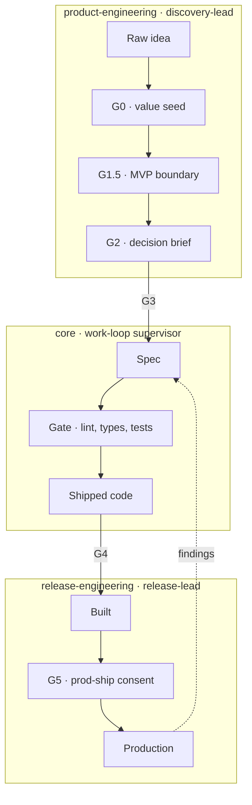

Every piece of work moves through the same four stages on its way to
production. Each stage ends when a person on your team makes a decision, and
most work skips a stage or two. Find the stage your work is in and start there.

The gold, pointed tags are where the agent stops and waits for you. For every
route, step, skill, and decision, see [the full map and the step-by-step
list](/agent-ready-repo/docs/guides/_shared/explanation/the-three-loops/#the-handoff-chain).

## Three loops, each with its own agent

Shipping software is three jobs: working out what to build, building it, and
getting it into production. They go wrong in different ways, and some of their
mistakes can't be undone. So each job gets its own loop, run by its own agent.

### Discovery: `product-engineering`

`discovery-lead` takes a raw product idea and shapes it before anyone writes
code. It compares candidate product shapes side by side, brings in product,
design, architecture, and safety views at the same time, and ends with a
decision brief you approved. You decide when the problem is worth a bet (G0),
what's in the first version (G1.5), and whether the brief is good enough to
build from (G2).

[The discovery loop explained](/agent-ready-repo/docs/guides/product-engineering/explanation/the-discovery-loop/)

### Build: `core`

The work loop runs every change through plan, execute, gate, review, and
decide. Lint, type checks, and tests are real gates: the agent can't report
success while one is red. Three reviewers read each change cold, looking for
drift from the spec, security problems, and code that will be costly to live
with. Small, low-risk work skips the saved spec. Riskier work gets a spec and
plan you approve before any code is written. The merge is always yours.

[The `core` pack as a system](/agent-ready-repo/docs/guides/core/explanation/core-pack/)

### Release: `release-engineering`

`release-lead` takes the merged build and tests it deployed. It uses throwaway
environments that hold no real data and can't reach production. It runs
end-to-end tests, watches telemetry, and sends any deployed failure back to the
build loop as a build task. When the evidence says the release is ready, it
hands you a readiness record. Nothing reaches production until you approve the
ship (G5), and no setting removes that step.

[The release loop explained](/agent-ready-repo/docs/guides/release-engineering/explanation/the-release-loop/)

## How the loops connect

None of the loops runs inside another. Discovery hands work to build at G3,
when you commit to build. Build hands it to release at G4, when you merge.
Findings from a deployed release come back to build as new tasks, so the shape
is a cycle, not a line.

```mermaid
flowchart TB
  accTitle: The three loops, their consent gates, and the handoffs between them
  accDescr: Three peer loops, each ending at a gate. product-engineering runs discovery-lead from a raw idea through G0, G1.5 and G2 to a decision brief, then hands off to core at G3. core runs the work-loop supervisor from a spec through its lint, typecheck and test gate to shipped code, then hands off to release-engineering at G4. release-engineering runs release-lead from a built artifact through the G5 prod-ship gate to production. Findings from production return inward to core as build tasks, closing the cycle.

  subgraph PE["product-engineering · discovery-lead"]
    direction TB
    PE1["Raw idea"] --> PE2["G0 · value seed"]
    PE2 --> PE3["G1.5 · MVP boundary"]
    PE3 --> PE4["G2 · decision brief"]
  end
  subgraph CO["core · work-loop supervisor"]
    direction TB
    CO1["Spec"] --> CO2["Gate · lint, types, tests"]
    CO2 --> CO3["Shipped code"]
  end
  subgraph RE["release-engineering · release-lead"]
    direction TB
    RE1["Built"] --> RE2["G5 · prod-ship consent"]
    RE2 --> RE3["Production"]
  end
  PE4 -->|G3| CO1
  CO3 -->|G4| RE1
  RE3 -.->|findings| CO1
```

*Three peer loops, each ending at a consent gate no agent passes alone. `discovery-lead` hands a decision brief to `core` at G3 and `core` hands shipped code to `release-engineering` at G4 — but released findings return inward to `core` as build tasks, so the shape is a cycle rather than a line.*

You only need the loops your team uses. Most teams start with `core`. Product
Engineering works without it, and Release Engineering needs `core` installed in
the same repository.

[The three loops, with the full map](/agent-ready-repo/docs/guides/_shared/explanation/the-three-loops/)
