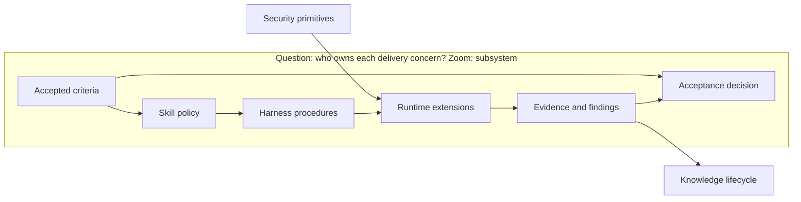

# Architecture Change — Acceptance-centered work loop

**Decision sought:** Refactor `work-loop` in place: keep its public skill,
center policy on acceptance criteria, upgrade its bundled engine into the
procedural supervisor, and retire phase/cohort state as semantic authority.
**Author:** Platform Core
**Status:** Draft
**Last updated:** 2026-10-01
**Reviewers:** Core and `agentbundle`

**Baseline:** [Repository architecture](../../ARCHITECTURE.md),
[loop infrastructure](loop-infrastructure.md), [loop contract](loop-contract.md),
[parallelism](loop-parallelism.md), [security](security.md), and
[knowledge capture](knowledge-capture.md).

**Baseline pin:** `a35680860b04`. Compatibility is reviewed against all six
canonical sources at this revision. Ratification does not supersede their
accepted decisions; [authority migration](work-loop-authority-migration.md)
names the governance records required before each writer cutover.

## 1. Scope and Baseline

| Delta | Owner after the change | Detailed design |
| --- | --- | --- |
| Authority, governance, and legacy-record cutovers | Explicit compatibility and supersession gates | [Authority migration](work-loop-authority-migration.md) |
| Acceptance criteria and evidence | Delivery policy plus a pure evaluator | [Acceptance and evidence](work-loop-acceptance-evidence.md) |
| Tasks, execution, recovery, and parallelism | Bundled supervisor engine and optional extensions | [Execution supervisor](work-loop-execution-supervisor.md) |
| Runtime-specific agent, session, workspace, and terminal mechanisms | Neutral adapter ports | [Runtime adapter crosswalk](runtime-adapter-crosswalk.md) |
| Canonical product-tree updates and merge conflicts | Result-integration boundary | [Product result integration](work-loop-result-integration.md) |
| Reviewer selection, reports, findings, and disposition | Review policy plus opaque reviewer implementations | [Review and disposition](work-loop-review-disposition.md) |
| Filesystem and process confinement | Shared infrastructure primitives | [Runtime security primitives](runtime-security-primitives.md) |
| Classification, redaction, and inert persisted content | Shared semantic boundary | [Delivery content safety](delivery-content-safety.md) |
| Reusable observations | Stateless projection into a separate knowledge lifecycle | [Knowledge projection](work-loop-knowledge-handoff.md) |

Success means one verdict across runtimes and one owner per mechanism.

### Implementation order

| Slice | Shippable change | Exit proof | Owning designs |
| --- | --- | --- | --- |
| 1. Acceptance authority, security foundation, and plan revision | Criteria become authoritative; current approved spec and plan pins import as separate atomic decisions; shared capability, confinement, containment-refusal, control-plane denial, evidence, and content-safety services ship without moving orchestration | Atomic-import, subject/verdict, evidence-recovery, capability-intersection, containment-refusal, control-plane-forgery, protected-ref-denial, and content-safety conformance pass | [Acceptance and evidence](work-loop-acceptance-evidence.md), [authority migration](work-loop-authority-migration.md), [security primitives](runtime-security-primitives.md), [content safety](delivery-content-safety.md) |
| 2. Review simplification | Opaque reports, actual-failure assessments, and dispositions replace reviewer orchestration | Synthetic reviewer integrates without work-loop changes | [Review and disposition](work-loop-review-disposition.md) |
| 3. Knowledge separation | A stateless projector derives observations from existing facts; knowledge owns cursor, retry, and admission | Dropped notifications recover by pull scan; unavailable intake never blocks readiness | [Knowledge projection](work-loop-knowledge-handoff.md) |
| 4. FSM strangler and engine inversion | Existing facade launches the supervisor; legacy result adapter retains current worktree application | Current commands, readiness rehydration, acknowledged-result parity, and slice-1 security conformance pass | [Execution supervisor](work-loop-execution-supervisor.md), [security primitives](runtime-security-primitives.md) |
| 5. Canonical result integration | Results advance the protected product ref; the subject provider switches after parity | Both providers yield the same manifest; sequential crash recovery passes | [Product result integration](work-loop-result-integration.md) |
| 6. Native runtime provider | Pi implements the provider protocol behind the unchanged skill facade | Shared sequential, recovery, interruption, containment, and control-plane-forgery suite passes | [Execution supervisor](work-loop-execution-supervisor.md), [security primitives](runtime-security-primitives.md) |
| 7. Parallel read coverage and concurrency | After explicit ADR supersession, enforced read allowlisting or complete tracing enables concurrency | Missing governance or read coverage serializes; undeclared reads deny/trace; permutations equal sequential results | [Authority migration](work-loop-authority-migration.md), [execution supervisor](work-loop-execution-supervisor.md), [security primitives](runtime-security-primitives.md) |
| 8. Cutover and removal | New semantic paths become authoritative; old FSM writers retire | Parity, cache deletion, provenance-backed reversal, and engine-removal rehearsal pass | This parent design and all child quality suites |

Slices 1–3 add shared security/delivery, review, and stateless knowledge
services without moving orchestration. Slice 4 inverts control. Only review persists
acceptance-critical delivery records; knowledge waits for neither scheduler nor
protected ref and stores nothing in delivery.

## 2. Structural Change

| Element | Change | Responsibility |
| --- | --- | --- |
| Work-loop skill | Preserved and narrowed | Public progressive-mode facade; declare acceptance, authority, and stop policy |
| Bundled engine | Upgraded in place | Slices 1–3 expose services to the current engine; slice 4 takes procedure ownership |
| Runtime extensions | Added | Implement host agent, process, workspace, and journal capabilities |
| Semantic artifacts | Centered | Preserve criteria, decisions, findings, and proof |
| Mechanical journal | Reduced | Preserve attempts, leases, checkpoints, and recovery receipts |
| Engine and cohort FSMs | Retired | Stop acting as workflow authorities |

This split is not a second installation. `SKILL.md` states what must hold; its
bundled script owns procedure, recovery, persistence, and typed skill calls.

## 3. Runtime Change

| Step | Stable fact or decision | Procedure owner |
| --- | --- | --- |
| Plan | Accepted criteria and temporary task projection | Skill policy requests, harness projects |
| Execute | Isolated results, integrated changes, observations, and effect receipts | Supervisor, integration boundary, and runtime extensions |
| Establish support | Evidence supports, contradicts, or is insufficient for each criterion | Acceptance evaluator |
| Review | Mandatory reviewer obligations have current structured reports | Review subsystem |
| Decide | Criteria are supported and material findings are disposed | Work-loop policy |

| Baseline scenario | Target delta | Untouched behavior | Owning design | Compatibility behavior | Parity fixture |
| --- | --- | --- | --- | --- | --- |
| Spec and plan approval | Criteria stay spec-owned; separate `approval-record.v1` decisions select the spec-policy fingerprint and plan revision | Named authorities still approve spec and plan changes | [Acceptance and evidence](work-loop-acceptance-evidence.md) | Current canonical approved spec and plan digests import atomically; the plan becomes revision 1 | Canonicalization, criterion coverage, atomic import, revision, and lineage corpus |
| Spec-plan terminal mode | Stop after approved plan without projecting execution | No repository implementation or test artifact is written | Parent policy | Existing `plan-locked` terminal remains | No-dispatch fixture |
| TDD stub boundary | Projector materializes approved bytes only in code mode | PLAN validates in scratch; spec-plan stays artifact-free | [Execution supervisor](work-loop-execution-supervisor.md) | Existing phase boundary remains authoritative | Scratch, byte-identity, red-to-green corpus |
| Plan scheduling | Disposable task contracts replace cohort waves | Plan dependencies and isolation intent remain inputs | [Execution supervisor](work-loop-execution-supervisor.md) | Cohort v2 remains authoritative during shadow projection | Schedule and sequential-degradation parity |
| Post-approval plan revision | New approval supersedes plan guidance, cancels unintegrated tasks, and reprojects work | Integrated history and fresh evidence remain | Acceptance and execution designs | Old plan lock stays authoritative until slice 1 cutover | Revision and evidence-freshness corpus |
| Wrong-plan recovery | Revise the plan in the same lineage by default; start a new lineage only for explicit abandonment or new base | Criteria remain authoritative | Parent policy and execution supervisor | Old engine reset is an expected pre-cutover divergence | Wrong-plan revision and explicit-abandon corpus |
| Execute | Supervisor selects one declared provider | Agents still edit, run tools, and return observations | [Execution supervisor](work-loop-execution-supervisor.md) | Current engine runs behind the compatibility adapter | Result, effect, and authority-intersection corpus |
| Result application | Protected Git ref serializes sequential and isolated results | Conflicts still require rework; Git history remains durable | [Product result integration](work-loop-result-integration.md) | Current worktree stays authoritative in shadow mode | Permutation, conflict, cancellation, and crash corpus |
| Gate or verification step | Mechanism emits normalized evidence during execution | Repository commands and test frameworks remain repository choices | [Acceptance and evidence](work-loop-acceptance-evidence.md) | Gate events dual-emit evidence receipts | Truth-table and stale-subject corpus |
| Attempt recovery | Journal reconciliation uses stable operation keys and durable effect resolutions | Unknown effects still fail closed | [Execution supervisor](work-loop-execution-supervisor.md) | Current replay markers remain authoritative during dual-read | Crash-after-effect and delete-journal corpus |
| Review and adjudication | Opaque reports feed assessment then resolution | Mandatory role policy still follows repository risk | [Review and disposition](work-loop-review-disposition.md) | Existing reports and verdicts pass through validation adapters | Role, reachability, privacy, and replacement-subject corpus |
| Indeterminate finding | Leave review unsatisfied and stop for owner direction | Baseline stop behavior remains | [Review and disposition](work-loop-review-disposition.md) | Existing `STOP` remains authoritative | Indeterminate-stop parity fixture |
| Backward review or rework | Open contradiction projects repair work; changed product requires fresh evidence and review | Rework remains mandatory before readiness | Acceptance, execution, and review designs | Existing wave reopen and backward edge remain authoritative | Gates-failed, findings-remain, and blocker-applied corpus |
| Human gate and decision | Readiness derives from approval, evidence, review closure, and accepted risk | Named humans retain amendment and risk authority | Parent policy plus acceptance and review designs | Old human gate remains authoritative before cutover | Derived-readiness parity corpus |
| Closeout | No change | `close-work` retains lifecycle and archival authority | Existing closeout subsystem | Reads old state before cutover and derived readiness after cutover | Existing closeout suite plus adapter fixture |
| Knowledge capture | Delivery projects observations from existing facts and may notify | Project-knowledge owns scan cursor, retry, admission, distillation, and enquiry | [Knowledge projection](work-loop-knowledge-handoff.md) | Pull projection shadows current capture gates | Drop-and-rescan, disabled-provider, privacy corpus |

`Plan → Execute → Establish support → Review → Decide` is a query, not a stored
FSM. It rehydrates from criteria, plan revision, approvals, Git, evidence,
review facts, and effect resolutions. Work-loop asks only whether properties,
review obligations, and material-finding dispositions are complete.

## 4. Contract and Invariant Change

| Invariant | Enforcement |
| --- | --- |
| Acceptance criteria are the durable center of gravity | Tasks and evidence reference stable criterion IDs |
| Tasks are temporary means, not product truth | Task projections can be regenerated without changing accepted scope |
| Evidence is bound to what it supports | Exact-subject receipts stale on change; path-set receipts require unchanged complete input, policy, toolchain, and environment fingerprints within one lineage |
| Control writes do not mutate product or acceptance identity | `delivery-subject.v1` excludes delivery records; plan hash is execution provenance |
| Runtime sophistication cannot change meaning | Adapters pass one contract suite and degrade to sequential execution |
| Reviewer internals are opaque to work-loop | Only obligations, reports, findings, assessments, and dispositions cross the boundary |
| A finding names an actual failure | Unsupported preferences cannot block acceptance |
| A supported finding cannot hide behind disposition | Current assessment lineage owns its contradictory receipt; accept-risk changes review closure only |
| Security policy is implemented once | Runtime code receives a primitive capability instead of reimplementing confinement |
| Persisted untrusted content follows one policy | Every semantic port uses `content-safety-policy.v1` and typed inert-data framing |
| Knowledge capture cannot block delivery | Delivery projects observations from durable facts and owns no capture state |
| Mechanical state is repairable | Deleting projections cannot change accepted scope or durable proof |
| Contract fields have one authority | `contracts/delivery/` schemas alone define fields and identity; prose states local invariants |
| Deployment cannot supersede accepted authority | [Authority migration](work-loop-authority-migration.md) gates each writer switch on parity, reversal, and its accepted governance record |

## 5. Data and State Migration

| Semantic fact | Authoritative path and schema | Writer | Fingerprint | Retention and precedence |
| --- | --- | --- | --- | --- |
| Delivery subject | Derived `delivery-subject.v1`, never a source file | Subject-source port and pure projector | Product, spec, evidence policy, exclusions, lineage; plan is execution provenance | Legacy snapshot precedes protected-ref provider; plan-only changes preserve acceptance identity |
| Canonical product tree | Protected `refs/agentbundle/delivery/<delivery-id>/product` plus integration commits | Result-integration port | Integration operation, parent commit, tree | CAS advances one lineage; worktree files are a repairable projection |
| Accepted criteria | `docs/specs/<feature>/spec.md`, stable criterion IDs projected as `acceptance-property.v1` | Spec author through accepted amendment policy | Spec path, criterion ID, normalized claim hash | Only the fingerprint named by the current approval record is accepted; criteria override every task projection |
| Plan guidance | `docs/specs/<feature>/plan.md`, revisioned task and criterion references | Plan author through plan-approval policy | Revision, predecessor, plan hash | Latest approved revision guides new tasks; supersession never rewrites criteria or completed facts |
| Approval authority | `docs/specs/<feature>/delivery/approvals.jsonl`, `approval-record.v1` | Named approval authority through the approval port | Scoped spec-policy or plan decision per canonical schema | Plan approval changes guidance only; base change starts a new lineage |
| Evidence, assessments, and supersessions | `docs/specs/<feature>/delivery/evidence.jsonl`, framed by `semantic-evidence-transaction.v1` | Harness evidence port after producer validation | Transaction and embedded record IDs plus subject | One checksummed transaction is authoritative; disposable receipt and assessment indexes rebuild from it |
| Reviewer reports | `docs/specs/<feature>/delivery/reviews/<role>/<report-id>.yaml`, `review-report.v1` | Reviewer-report port | Role, subject, sequence, report and superseded IDs | The unique safe lineage tip wins; forks leave the obligation unsatisfied |
| Finding assessments | `finding-assessment.v1` inside `evidence.jsonl`; any YAML view is derived | Mechanical evaluator or named independent assessment authority through the evidence port | Finding, report tip, subject, revision, predicate or authority | Current indeterminate assessment leaves review unsatisfied; index deletion changes no fact |
| Finding dispositions | `docs/specs/<feature>/delivery/dispositions.yaml`, `finding-disposition.v1` | Decision authority through the disposition port | Finding, subject, decision and authority per canonical schema | Accept-risk binds the subject; fixed-by names a fresh report |
| External-effect resolutions | `docs/specs/<feature>/delivery/effect-resolutions.jsonl`, `effect-resolution.v1` | Named human authority through a locked CAS port | Subject, operation, attempt, per-key revision, authority | One durable retry claim survives journal deletion and concurrent reconciliation |
| Acceptance verdict | Derived `acceptance-verdict.v1`, never a source file | Pure evaluator | Criteria and admissible-record set fingerprint | Recomputed on demand; no stored verdict overrides its inputs |

The complete old/new artifact, trigger, residue, rollback, and cutover-proof
matrix lives in [authority migration](work-loop-authority-migration.md#3-data-transition-inventory).

The old engine remains authoritative during dual-read. Each slice cutover
requires parity and cache deletion.

Post-cutover reversal deploys that slice's retained reverse reader, which reads
every plan revision and projects the latest without deleting facts. A lossy
projection refuses and requires forward repair.

At each slice removal gate, release engineering writes
`supervisor-build-manifest.v1` and references it from `release-handoff.yaml`.
It pins the prior wheel, Core pack, slice-specific reverse reader, digests,
immutable locators, provenance/verifier policy, and schema compatibility.

The `agentbundle` cutover reader validates the manifest and derives the
delivery's `reversal-bundle.yaml` without other inputs; schemas live in
`contracts/delivery/`. Missing or invalid material blocks removal under the
[release-loop provenance policy](../../packs/release-engineering/.apm/skills/release-loop/SKILL.md#artifact-provenance-verification).
The artifact store verifies 180-day and two-release retention monthly; rehearsal
covers derivation, read-only preflight, writer lease, and a new-state write.

## 6. Quality Regression and Verification

| Attribute | Mechanism | Measurable target | Verification |
| --- | --- | --- | --- |
| Runtime neutrality | Adapter contract, pure acceptance evaluator, and execution-supervisor conformance matrix | Identical verdict and invariant behavior for every runtime declared supported | Shared semantic, recovery, review, and control-plane-forgery suite |
| Acceptance integrity | Subject-bound receipts and satisfaction invariant | Zero accepted criteria without fresh admissible support | Missing, stale, irrelevant, and contradictory evidence fixtures |
| Recovery and reversal | Semantic state, journal reconciliation, verified reversal bundle | Cache deletion preserves readiness; retained release reads and writes a post-cutover snapshot | Crash, reconstruction, provenance-failure, and full reversal rehearsal |
| Review simplicity | Opaque `review-report.v1` boundary | A synthetic reviewer integrates without a work-loop change | Reviewer conformance fixture |
| Security | Capability-only API plus verified host sandbox or restricted principal for untrusted code | Zero worker writes reach semantic control-plane paths | Cross-adapter control-plane forgery fixtures |
| Knowledge isolation | Stateless projection from durable facts | Delivery completes with capture unavailable and owns no capture state | Disabled, dropped-notification, and rescan fixtures |
| Semantic scale | Disposable indexes | At 1,000 criteria, 100,000 evidence records, and 10,000 review records: p95 readiness ≤2 s and cold rehydration ≤10 s on the CI reference worker | Indexed and index-deleted stress fixtures |
| Infrastructure scale | Bounded subsystem inputs | Child maxima cover product paths, result bytes, tasks, edges, journal, and candidates | Traversal, scheduling, merge, rebuild, diff, and intake stress fixtures |

## 7. Build Mapping

| Element | Source owner | Verification |
| --- | --- | --- |
| Delivery policy | `packs/core/.apm/skills/work-loop/` | Skill evals |
| Portable contracts | Authoritative `contracts/delivery/`; builders project all copies | Field, identity, and byte/schema parity |
| Work-loop facade and bundled supervisor | `packs/core/.apm/skills/work-loop/`; manifest-built single script embeds schemas and standard-library-only runtime modules | Deterministic digest, clean-environment import fence, and provider tests |
| Runtime adapters | Proposed `packages/agentbundle/agentbundle/work_supervisor/adapters/` plus host projections | Adapter conformance |
| Result integration | Proposed `work_supervisor/result_integration.py` and `git_integration.py` | Merge, CAS, conflict, cancellation, and crash suite |
| Security primitive | `packages/agentbundle/agentbundle/catalogue_tooling/file_safety.py` plus proposed process and capability modules beside it | Security boundary suite |
| Content safety | `contracts/delivery/` policy plus proposed `catalogue_tooling/content_safety.py` | Shared boundary corpus |
| Knowledge projection | Proposed stateless projector plus `packs/core/.apm/skills/project-knowledge/` collector/intake | Determinism, rescan, dedupe, and independent-admission tests |
| Reversal manifest and bundle | `contracts/delivery/` schemas; release-loop slice-gate writer; `agentbundle` cutover reader | Manifest-only derivation, latest-plan reverse read, retention, and rehearsal |
| Authority and baseline cutovers | [Authority migration](work-loop-authority-migration.md); `ARCHITECTURE.md`, `loop-infrastructure.md`, `loop-contract.md`, `loop-parallelism.md`, and `knowledge-capture.md` update with their owning cutover | Missing-governance refusal, writer-switch CAS, baseline-link, and reversal fixtures |
