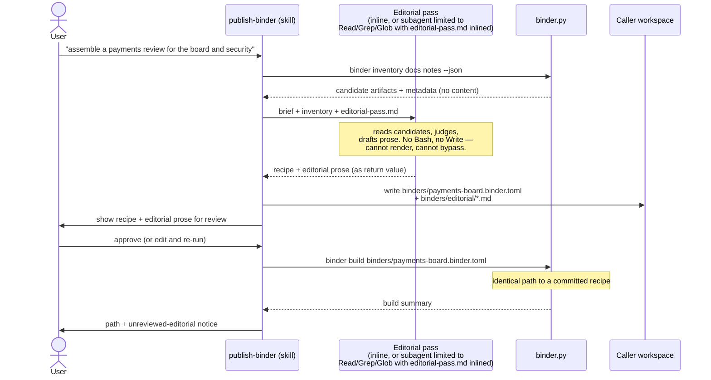

# Editorial model

> The chief-editor procedure and the three content classes.
> Part of [binder publishing architecture](README.md).

## Pack and skill shape

### The constraint that decides it

Skills are strictly self-contained: no cross-skill reads or imports, including
between siblings in the same pack, and `.apm/shared-libs/` is not available for
skill code. Therefore **any design with two skills sharing the resolver is
impossible without either duplicating it or introducing a new pip package.**

The brief offered four shapes. Evaluated against that constraint:

| Shape | Verdict |
|---|---|
| One workflow skill | **Selected.** |
| `assemble-binder` + `publish-binder` | Rejected — forces duplicated core or a new pip package, and buys nothing that script verbs of one skill do not already provide. |
| Deterministic skill + chief-editor subagent | **Partially adopted** — see below. |
| Other repository-native composition | A `binderkit` pip package alongside a thin skill (the `credbroker` pattern). Rejected for v1 — it adds a PyPI release channel, a version-skew surface, and an install step, to solve a code-sharing problem that only exists if there are two skills. Recorded as the escape hatch if a second skill is ever genuinely required. |

```
packs/binder-publishing/
├── pack.toml
├── README.md
├── .claude-plugin/plugin.json
├── .apm/skills/publish-binder/
│   ├── SKILL.md
│   ├── scripts/
│   │   └── binder.py                    # single entry point, all verbs, stdlib only
│   ├── references/
│   │   ├── editorial-pass.md            # THE editorial procedure
│   │   ├── binder-schema.md             # authoring reference
│   │   ├── security-profile.md          # what strict rejects and why
│   │   ├── invocation.md                # per-adapter script paths for CI/scripts
│   │   └── agentbundle-layout.md        # the [binder] section
│   ├── assets/
│   │   ├── binder.schema.json
│   │   ├── binder-index.schema.json
│   │   ├── quarto-releases.json         # pinned versions + SHA-256 per platform
│   │   ├── theme/binder.scss
│   │   └── examples/*.binder.toml
│   └── evals/eval_queries.json
├── tests/skills/publish-binder/
│   ├── unit/ · integration/ · fixtures/
└── (guides/binder-publishing/{tutorials,how-to,reference,explanation}/ in the
     repository's shipped guide tree, per the two-tree convention)
```

### Sizing `binder.py`, and where the v1 cut-line is

"One stdlib-only file" understates what is being asked for, and the comparison
table already scores this option ○ on both maintenance burden and new machinery
without ever putting a number on it. The v1 surface is: a hand-written TOML
validator with edit-distance suggestions, a JSON-Schema parity harness, the
resolver with Kahn ordering and cycle detection, the trust lattice, the source
scanner, an eight-step Markdown transformer with line mapping, link rewriting,
the Quarto adapter and its YAML emitter, a digest-verified downloader with tar and
zip extraction, three lock protocols, near-atomic publication, and seven verbs.

So the decomposition is stated up front rather than discovered. `scripts/` holds
sibling modules at one level — permitted, since the depth rule is about *nesting*,
not file count, and none of them is a cross-skill import:

```
scripts/binder.py        # argv, verb dispatch, exit codes
scripts/schema.py        # validation, unknown/not-yet-implemented classes, params
scripts/discover.py      # content root, bounded scan, identity, metadata, sidecars
scripts/scan.py          # the trust profile: all mechanical source controls
scripts/resolve.py       # selection, ordering, supersession, diagnostics, index
scripts/render_zensical.py        # staging, transformation, _quarto.yml, invocation, plan
scripts/toolchain.py     # detection, version range, the install ladder
scripts/fsutil.py        # confinement, locks, near-atomic publish
```

**Two things move out of v1 outright**, because the earlier draft protected every
optional mechanism while scoring itself ○ on new machinery — which is not a
trade-off, just a preference:

- **`[[sections.items.figures]]` and caption binding → Phase 2.** Captions are the
  only reason `fence-sha256`, the ordinal-plus-hash protocol, and the drift
  warning exist. Level-0 diagrams render uncaptioned and unnumbered, which is a
  complete v1 story; captions arrive with the rest of the metadata layer.
- **`--if-stale` → Phase 2.** Incremental rebuild is an optimisation for a build
  nobody has yet found slow.

That leaves `check --published` as the **single** consumer of source hashes — and
it is the CI contract, so the hashes stay and their justification is no longer
circular. D13's earlier "two named consumers" framing invented one of them.

**The v1 cut-line, if Phase 1 still overruns:**

1. `install-quarto` (rung 2) — already contingent on U5, and `pip` covers the
   common case without it.
2. `explain` — the index is readable JSON and `explain` is a presentation layer
   over `selection.reason` and `selection.rule`, which are recorded regardless.
   The brief's explainability requirement is met by those fields with or without
   the verb; cutting it costs ergonomics, not a contract.

Neither cut changes a contract, which is the property that makes them safe.
`resolve`, `build`, `check`, and the scanner are not cuttable: they are the
phase's reason for existing.

**Canonical schema publication — from the pack, not from `contracts/`.** The two
schema files ship in the skill's `assets/`, and that copy is canonical. The public
URL an external tool fetches is the raw path to it on the default branch:

```
https://raw.githubusercontent.com/eugenelim/agent-ready-repo/<tag>/packs/binder-publishing/.apm/skills/publish-binder/assets/binder.schema.v1.json
```

The filename carries the major version and the URL carries a **release tag, not
`main`** — a contract that promises stability cannot be published from a mutable
branch. A `v1` URL keeps resolving after v2 ships; it is retired only when v1
itself is, with the deprecation notice going in the pack's changelog one minor
release ahead.

An earlier draft mirrored them into `contracts/`. That is wrong on this
repository's own terms: `contracts/README.md` states the directory holds "the
published interface this catalogue exposes to consumers" and is "*not* per-feature
specs" — eleven contracts today, spanning adapter, catalogue, pack, plugin
manifest, profile, skill, skill-manifest, guide, and target vocabulary, and **RFC-0076 D1 makes `contracts/` the canonical authored source with
D2 installing a byte-parity CI gate against
`packages/agentbundle/agentbundle/_data/`** — so mirroring a pack-payload schema
there would make the pack's copy the derivative *and* pull a binder schema into
the CLI's bundled data, which has no reason to carry it.

Publishing from the pack keeps the schema beside the validator that enforces it,
which is the property that actually matters: a build-check test asserts
`binder.py`'s hand-written validator and the shipped JSON Schema accept and reject
the same corpus. If the catalogue later decides binder recipes *are* a
catalogue-level interface, promoting them into `contracts/` with a README row and
a governing RFC is an additive move — but that is an RFC decision, not a
directory choice this design gets to make.

### The editorial model: why the editor is not an agent in v1

Six properties decide agent-versus-skill:

| Property | Skill | Agent | This case |
|---|---|---|---|
| Who invokes it | user | orchestrator dispatches | "build a binder for the review board" is a user utterance → **skill** |
| Can it reach other capabilities? | can invoke skills and scripts | a subagent has no Skill tool | the editorial pass must end in resolve+build → **skill** |
| Context economics | input ≈ output | reads many, returns little | reads N candidates, returns one recipe → **agent** |
| Independence from the author | — | must not mark its own homework | authoring, not reviewing → neutral |
| Tool restriction as a control | — | tool set is declarable | **usable here** — see below |
| Charter pressure | — | *"Not a marketplace of specialized agents"* | → **skill** |

Skill wins four of six. The one the agent wins — context economics — is real at
scale, and the repository already has the resolution for exactly this split. The
`work-loop` orchestrator inlines `security-checklists` modules into the
`security-reviewer` brief precisely because *"subagent has no Skill tool."*

**Decision.** The editorial pass is a *procedure*, owned by the skill, living in
`references/editorial-pass.md`. The skill runs it inline by default. When the
candidate set is large, the skill dispatches a subagent **restricted to `Read`,
`Grep`, and `Glob`** — no `Bash`, no `Write`, no `Edit` — with that reference
inlined into the brief, and receives a recipe as its return value. One source of
truth; no duplication; the seam for a named `binder-editor` agent stays open at
zero cost, because the procedure already lives in a file that is inlined either
way.

**Withholding `Bash` matters, but it is a convention, not a mechanism.** Lacking a
Skill tool alone would not stop a subagent shelling out to
`python scripts/binder.py build`; withholding `Bash` does. So the restriction is
specified as part of the dispatch contract rather than left to the orchestrator's
discretion — but it is enforced by an orchestrating model reading `SKILL.md`, not
by `binder.py`, and the *editor prohibitions* table labels it accordingly. The
guarantee that does not depend on it is write confinement inside the script.

### `pack.toml`

```toml
[pack]
name         = "binder-publishing"
version      = "0.1.0"
description  = "Compile selected Markdown artifacts into a coherent, reader-oriented static HTML binder from a portable binder.toml recipe."
readme       = "README.md"
display_name = "Binder Publishing"
license      = "Apache-2.0 OR MIT"
categories   = ["documentation", "publishing"]
keywords     = ["binder", "quarto", "markdown", "publishing", "mermaid"]

# v0.17: the manifest uses enriched-pack-manifest fields (v0.14) and
# [pack.layout] (v0.16), and the skill primitive's shared-prefix routing for
# codex/cursor/gemini/copilot (v0.17) is load-bearing for the invocation contract.
[pack.adapter-contract]
version = "0.17"

[pack.install]
default-scope    = "user"
allowed-scopes   = ["user", "repo", "local"]
allowed-adapters = ["claude-code", "codex", "copilot", "kiro-ide", "kiro-cli", "cursor", "gemini"]

# Declared for parity with the five sibling output-writing packs and as
# machine-readable documentation of the default. It does NOT drive an
# install-time append: `_append_layout_section` reads `[pack.layout.<scope>].parent`,
# not `output_dir`. The `[binder]` section is adopter-hand-written. See U12.
[pack.layout.repo]
output_dir = "build/binders"

[pack.evals]
skills = ["publish-binder"]

# The schema has carried `[[pack.runtime-dependencies]]` (ecosystem ∈ pypi/npm/
# cargo/go/homebrew/apt/system, plus version/optional/skills/install/note) since
# the enriched manifest, and no shipped pack uses it yet. Quarto is exactly what
# it describes, so this pack is the one that should: a machine-readable external
# dependency is worth more than a prose prerequisite when an adopter is deciding
# whether a pack will work in their environment.
[[pack.runtime-dependencies]]
ecosystem = "system"
package   = "quarto"
version   = ">=1.10.0,<1.11.0"
optional  = false   # required to *render*; see note
skills    = ["publish-binder"]
install   = "python -m pip install --no-deps quarto-cli==1.10.18"
note      = "External CLI, ~236 MB. Required only by `build`: `resolve`, `explain`, `inventory` and `check --published` all work without it. Never installed silently. The `install` line is the minimal form — run `python scripts/binder.py check --renderer=quarto` for the hash-pinned command and the --user/virtualenv guidance."

[pack.links]
homepage      = "https://github.com/eugenelim/agent-ready-repo"
repository    = "https://github.com/eugenelim/agent-ready-repo"
documentation = "https://github.com/eugenelim/agent-ready-repo/tree/main/guides/binder-publishing/"

[[pack.maintainers]]
name  = "eugenelim"
email = "eugenelim@users.noreply.github.com"

[pack.first-value]
audience-posture = "mixed"
surfaces         = ["claude-code"]
prerequisites    = ["Python >= 3.11 (tomllib)", "Quarto >= 1.10.0, < 1.11.0 (the skill detects it and offers a pip or digest-verified install)"]
verification     = "Ask the agent to publish two Markdown files as a binder; confirm an index.html is produced and neither source file changed."
recovery         = "If rendering reports a missing Quarto, the resolved binder-index.json is still written — accept the offered install, or install Quarto from quarto.org and re-run the build."
level-b          = true
starter-task     = "Publish two related Markdown notes as one navigable document"
starter-prompt   = "Create a binder.toml listing my two Markdown notes in reading order and publish it as an HTML binder."
expected-result  = "A build/binders/<id>/index.html with sidebar navigation, search, and both documents as chapters."
next-action      = "Add a third document and re-run the build to see the ordering hold."
```

No `[pack.layout.user]` default: there is no sensible absolute user-scope
publication root, and inventing one would write into a location the user did not
choose. At user scope in a directory with no configuration, publication defaults
to `./build/binders/` relative to the resolved content root, and the resolved
absolute path is surfaced before the first write.

Skill frontmatter declares, under the `metadata:` escape hatch rather than as a
bespoke top-level key (`docs/architecture/skill-and-pack-format.md`: *"Frontmatter
uses only the agentskills.io keys"*):

```yaml
metadata:
  boundaries: [filesystem_read_untrusted, filesystem_write, network_fetch]
```

 — the vocabulary is defined in `docs/architecture/security.md` § *Security metadata
convention*, which carries all five values including `network_fetch`;
`converters`' `file-to-markdown` and `msg-to-markdown` are the shipped precedent
for the `filesystem_read_untrusted` token — `filesystem_read_untrusted` because source
Markdown is untrusted by construction, and `network_fetch` because the consented
toolchain install downloads.

---

## Chief-editor interaction model

### What the editor may do

Interpret audience and purpose; choose or extend a publication profile; choose
artifact classes; disambiguate among candidates; identify gaps; surface
contradictions between artifacts; produce a recipe or overlay; draft an executive
summary, section introductions, transitions, and alternative comparisons;
annotate unresolved questions.

### What the editor may not do — and how each is prevented

| Prohibition | Enforcement |
|---|---|
| Bypass validation | The only route to a rendered binder is `binder build`, which always validates. |
| Silently select exact files without recording them | An editorial selection *is* an exact reference written into the recipe; the recipe is the record. |
| Mutate canonical source artifacts | **Mechanical.** `binder.py` refuses any write outside *the complete write set* (below) — so no route, agentic or otherwise, edits a source. |
| Improvise renderer configuration | **Mechanical.** `[renderers.*]` is allowlisted per adapter; anything else fails validation. |
| Render without producing the index | **Mechanical:** `build` writes the index before staging and there is no code path that stages without one, so a rendered binder without a resolved index cannot exist. **Plus a dispatch convention:** the editorial subagent is briefed with `Read`, `Grep`, `Glob` and no `Bash`, so it has no route to the renderer at all. |

> **A note on the word "mechanical."** This document defines it as *implemented and
> unit-tested in `binder.py`*. A subagent's tool set is prose in `SKILL.md`
> interpreted by an orchestrating model — a good convention, not a mechanism, and
> labelling it mechanical would be the exact category error the brief warns about
> ("do not assume skill scanning provides runtime sandboxing"). So the dispatch
> restriction is named as a convention, and the load-bearing guarantee is moved
> into the script, where it holds regardless of how the editor is run.

### Three classes of content, distinguished everywhere

| Class | Origin | In the recipe | In the index | In the output |
|---|---|---|---|---|
| **Source-authored** | canonical artifact | `path` / `select` | `type: "source"` | badge showing kind, status, and source path |
| **Editor-generated** | executive summaries, intros, transitions, comparisons | `kind = "editorial"` items and `intro =` keys | `type: "editorial"`, `authored-by`, `review-state` | visually distinct block, labelled "Editorial — written for this binder" |
| **Compiler-generated** | cover, part pages, source inventory, provenance | `kind = "generated"` appendices; otherwise implicit | `type: "generated"`, `generator` | plain, unbadged; contains no substantive claims |

Badge and marker rendering uses Quarto callouts and fenced divs, **subject to
gate V3**; on V3 failure they degrade to a plain leading label string.

**Editor-generated prose is stored as separate Markdown files referenced by
path**, not embedded in the recipe. Four reasons: it is reviewable in a normal
diff; it can be commented on in a PR; it does not make TOML hold multi-paragraph
prose; and it can be edited by a human without touching the recipe. The recipe
holds the *reference and the role*; the file holds the words.

`review-state` is a two-value field (`unreviewed` | `reviewed`) set by a human
editing the recipe. It renders as a visible marker on unreviewed editorial
content. That is the entire review mechanism — no workflow, no state machine, no
approval ledger. Anything more is bureaucracy for a field whose only job is to
stop an unreviewed AI-written executive summary from looking identical to an
approved one.

### Sequence: committed recipe

```mermaid
sequenceDiagram
  actor U as User
  participant S as publish-binder (skill)
  participant B as binder.py
  participant Q as quarto (external CLI)
  participant W as Caller workspace

  U->>S: "publish the payments architecture-review binder"
  S->>B: binder check --renderer=quarto
  B-->>S: exit 0 (quarto 1.10.18, supported)
  S->>B: binder resolve binders/payments-review.binder.toml
  B->>B: validate → discover → resolve → order
  B->>W: write binder-index.json
  B-->>S: 12 nodes, 1 optional gap
  S->>U: summary + gap; proceed?
  U->>S: yes
  S->>B: binder build --from-index
  B->>B: scan sources (strict profile)
  B->>W: stage .qmd + _quarto.yml + theme
  B->>Q: quarto render <staging> --to html
  Q-->>B: exit 0
  B->>W: near-atomic publish → build/binders/payments-review/
  B-->>S: build summary
  S->>U: path, node count, gaps
```

### Sequence: editor-generated recipe



The two sequences converge at `binder build` and are byte-identical from there.
That convergence is the brief's "one compilation path" requirement, and it is
visible in the diagram rather than asserted in prose.

---
