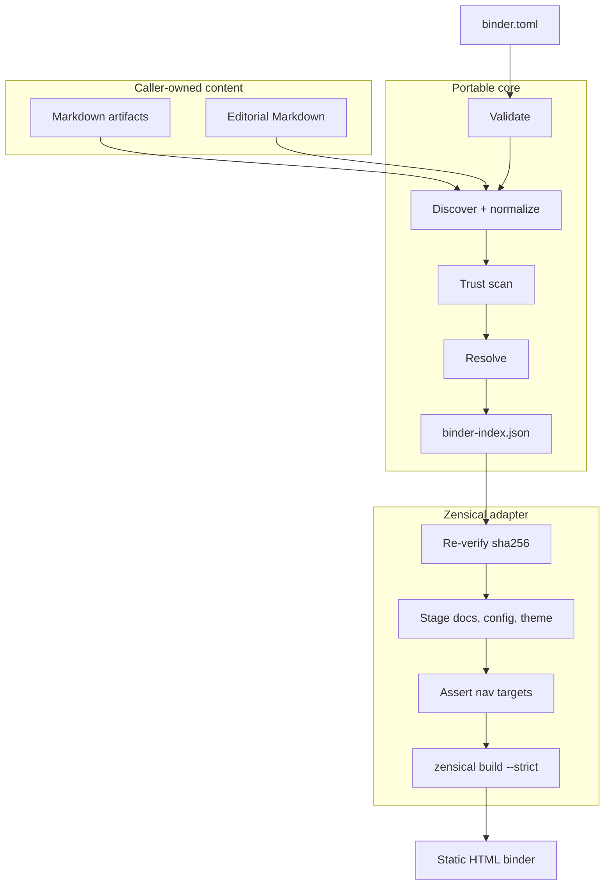

# Binder publishing architecture

> Implementation architecture for `binder-publishing`.
> Part of [binder publishing architecture](README.md).

## Scope

`binder-publishing` is a user-scope-default pack with one script-backed skill,
`publish-binder`. It resolves a portable `binder.toml` recipe into a deterministic
`binder-index.json` and renders the index as a static HTML binder through the
Zensical adapter.

`binder.toml` is the producer handoff format. `binder-index.json` is the public,
versioned renderer interface. Producers need only `tomllib` to emit a recipe;
they do not import this pack or select a renderer.

V1 excludes deployment and serving, executable documents, automatic dependency
installation, print-format correctness, figure and section cross-reference
syntax, source mutation, mandatory producer migration, a central content
inventory, and status parsing from Markdown prose. The adapter invokes
`python -m zensical build --strict`; it never invokes `serve`.

The resolver and runtime work without Git, `site.toml`, `pack.toml`, a docs site,
source packs, frontmatter, or an agent-ready-repo checkout. `binder.py` uses the
standard library only. The Zensical dependency is explicit and never installed
silently.

## Runtime and ownership boundary

The pack installs at `user` scope by default. `repo` and `local` are allowed.
Scope changes pack location and default-configuration location only; it does not
change resolution, validation, staging, or renderer invocation.

| Scope | Defaults | Recipe location | Constraint |
| --- | --- | --- | --- |
| User | `~/.agentbundle/agentbundle-layout.toml` | caller-selected | Git-free runtime |
| Repo | `<root>/agentbundle-layout.toml` | `binders/` | shared capability |
| Local | repo defaults | uncommitted | Git working tree required |

Resolve the content root in this order:

1. `--root=<path>`, after confinement and refusal checks.
2. The nearest ancestor containing `binder.toml`, `binders/`, or `agentbundle-layout.toml`.
3. The nearest ancestor containing `.git`.
4. The current directory when it is outside the installed pack.

Rules 2–4 never run when the working directory is beneath the installed pack.
In that case the command exits 4 and names `--root`. `--root` remains
refusal-grade: node reads accept only `*.md`, `*.markdown`, and `*.mmd`; a root
equal to the user home or filesystem root, or an ancestor of `~/.agentbundle/` or
the pack, exits 6. D-A keeps the strict profile as the only profile and retains
no grants or policy file.

`binder.py` resolves its own directory at startup and refuses a write resolving
inside the installed pack.

| Artifact | Owner | Lifetime | Publication |
| --- | --- | --- | --- |
| `binder.toml`, `binders/*.binder.toml` | caller | durable | caller-controlled |
| `binders/editorial/*.md` | caller | durable | caller-controlled |
| `binder-index.json`, `renderer-plan.json` | caller workspace | per run | never published |
| `stage/`, including `site/` and `.cache/` | caller workspace | per run | never published |
| `binder-stamp.json` | published tree | until replacement | published |
| Rendered binder | caller | until replacement | beneath content root |

## Portability requirements

The portable core accepts explicit local Markdown paths in a directory with no
Git repository or metadata. Source Markdown is never modified. A published
binder makes no network request when read. Dependency resolution works when the
renderer is absent.

## Architectural invariants

Twenty-two invariants govern this design. Eight are restated below. The
originating brief containing the remaining fourteen is absent from this
repository and must be recovered before implementation. There is no invariant
23.

| # | Invariant |
| --- | --- |
| 3 | Renderers consume the index and never rediscover or reorder. Every adapter source read uses `read_node_source(node)`, which rejects a path absent from the index. |
| 8 | Build state is isolated per `(binder-id, content-key)` and the resolved publication directory has a separate lock. |
| 10 | No global mutable binder state file exists. |
| 12 | Pack-produced Markdown is content, not trusted renderer configuration. |
| 13 | The first renderer is not the canonical model. |
| 18 | The strict trust profile is mechanically enforced. |
| 21 | `binder-index.json` is byte-reproducible for identical inputs. It contains no timestamps, run IDs, host names, or absolute paths. |
| 22 | `binder build` writes no field of `binder-index.json`. Adapter-generated data belongs in its plan file. |

D-A removes origin classification and policy/grant inputs. D39 therefore leaves
no authority lattice to implement. Invariant 13 permits a renderer replacement
without changing the recipe, index, resolver, or scanner. D-B removes the
downloaded toolchain from the pack write set.

D34 requires renderer scanner rules to be declarative and available to `resolve`
and `inventory`. D45 fixes the pack boundary; the implementation is the
`binder-publishing` pack and its `publish-binder` skill.

## Component architecture



The core owns identity, source roots, sections, parts, artifact references,
selection, ordering, exclusions, conflicts, supersession, editorial
classification, provenance, publication profile, renderer selection, and
namespaced renderer options. The adapter owns staged paths, generated
`zensical.toml`, `nav`, theme assets, invocation, source-to-stage diagnostics,
ordinals, and staged link rewriting.

The adapter has no discovery or selection path. It reads a caller-owned source
only through `read_node_source(node)`. The accessor enforces invariant 3 by
rejecting a source path not enumerated by the index.

### Renderer options

```toml
[renderers.zensical]
mermaid-theme = "neutral"
toc-depth = 3
```

The core validates the selected renderer table as scalars or arrays of scalars,
copies it into the index, and does not interpret its contents. The Zensical
adapter owns a closed allowlist and rejects unknown keys. Every allowed key has
an emission point in [`zensical-adapter.md`](zensical-adapter.md); D15 forbids a
recipe key with no effect.

The allowlist excludes `custom_dir`, `extra_javascript`, `extra_css`,
`markdown_extensions`, `docs_dir`, `site_dir`, `site_url`, `hooks`, and
`plugins`. No recipe option can reach a security-relevant renderer setting.

## Existing-site and reader boundary

`docs-site/` remains separate. V1 supports links from that site to a separately
built binder. If a site later needs binder selection or ordering, it reads the
index rather than duplicating resolver behavior.

| Reader element | Owner |
| --- | --- |
| Cover metadata, source attribution, provenance, source inventory | compiler |
| Executive summary and transitions | editorial Markdown |
| Parts, chapters, cross-document targets, superseded-material handling | binder semantics |
| Chapter and appendix ordinals | compiler `data-ordinal`; never title text or search-index text (D44) |
| Navigation, search, responsive layout, print CSS | Zensical and pack theme |
| Artifact-kind and lifecycle badges | compiler metadata and pack theme |
| Decision, risk, and open-question callouts | recipe-assigned `admonition` blocks |
| Mermaid fence body | source bytes, unchanged |
| Mermaid accessible name | compiler attributes and theme lift into SVG (D46) |

Mermaid uses portable GitHub-style fences. The compiler does not transform a
fence body. It rejects Mermaid directives, click/callback forms, and unsupported
node-label syntax. The theme uses vendored `mermaid.min.js`; remote asset loading
is not permitted. A source attribution contains artifact kind and status, never
a repository-relative source path.
