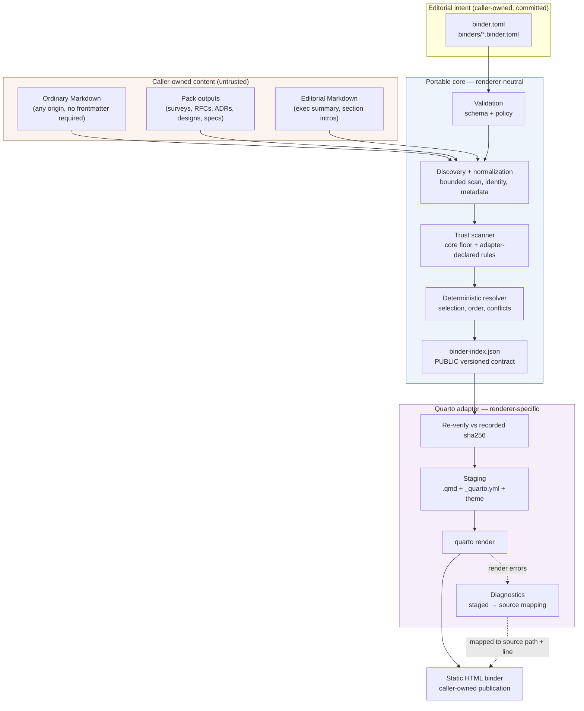
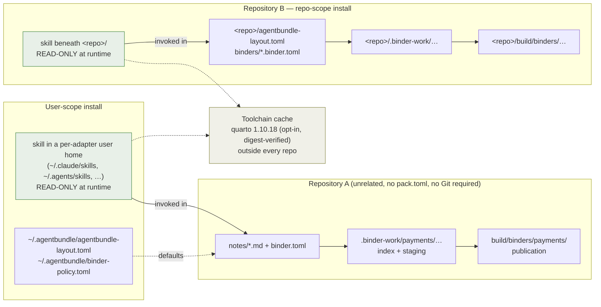

# Overview

> Problem, goals, product boundary, and why this shape won.
> Part of [binder publishing architecture](README.md).

## TL;DR and recommendation

Ship **one new user-scope-default pack, `binder-publishing`, carrying one
script-backed skill, `publish-binder`**, that compiles a portable
`binder.toml` recipe into a deterministic `binder-index.json` and renders that
index to a static HTML binder through a Quarto Book staging adapter.

The recommendation rests on one structural claim: **the resolved index, not the
renderer, is the interoperability contract.** A producing pack must be able to
emit a binder recipe with `tomllib` and nothing else — no import of this pack's
code, no knowledge of its install path, and no dependency on Quarto. That
requirement is what forces the two-artifact split, and everything else in this
design follows from it.

Quarto 1.10.x is recommended as the first renderer on verified behaviour, with
two findings that materially shape the design: Quarto's Mermaid support requires
`` ```{mermaid} `` executable-cell syntax rather than the portable GitHub fence
(so a staging transformation is mandatory, not optional), and **disabling
execution does not neutralize unsafe input** — body-level shortcodes such as
`` and `` are processed independently of the execution
engine. The strict trust profile is therefore enforced by a mechanical
source-scanner in the staging layer, not by Quarto configuration.

Seven claims were gated rather than assumed. **Three have now been run** — and
they changed the design: Mermaid does survive execution-off (Q10a confirmed), but
the `from: markdown-raw_html` toggle the security model used as a second layer
**destroys Mermaid output** (Q26), and the stock theme **fetches a typeface from
Google at read time** (Q27). Both are corrected below. The remaining four gates and
their fallbacks are in *Pre-implementation verification gates*.

---

## Context and problem statement

Skills, packs, humans, scripts, and external workflows in this catalogue and in
adopter repositories produce Markdown artifacts continuously: research surveys,
product intents, RFCs, ADRs, architecture designs, specs, plans, security
assessments, review records.

Each artifact is written where its producing workflow puts it. `desk-research`
writes `<topic-slug>-survey.md` under a configured `output_dir`;
`architect-design` writes `<output_dir>/<topic-slug>/design.md`;
`governance-extras` writes `docs/rfc/NNNN-*.md` and `docs/adr/NNNN-*.md`;
`new-spec` writes `docs/specs/<feature>/spec.md` and `plan.md`.

**The source hierarchy is not the reader hierarchy.** A reviewer preparing for an
architecture review board needs *Executive summary → Context and evidence →
Proposal → Alternatives → Decisions → Architecture → Implementation approach →
Verification → Risks → Appendices*. No directory tree in any repository is
organized that way, and no directory tree should be — the producing workflows
have their own, correct, reasons for their layout.

Today the only ways to close that gap are to hand-assemble a document (which
goes stale the moment a source changes), to point the reader at a list of file
paths (which is not a publication), or to build a one-off script per audience
(which is not reusable and not reviewable).

What is missing is a **portable, versioned way to declare a reading order over
artifacts that already exist**, and a deterministic compiler that turns that
declaration into a publication without touching the sources.

### Why now

Five packs in this catalogue already write durable Markdown to an
adopter-configured `output_dir` resolved through `agentbundle-layout.toml`
(`architect`, `desk-research`, `experience-design`, `product-engineering`,
`product-strategy`). The producer side of the problem is solved and growing. The
consumer side does not exist.

---

## Goals and non-goals

### Goals

1. A **minimal binder is publishable from explicit local Markdown paths alone** —
   in a directory with no Git repository, no `pack.toml`, no `site.toml`, no
   agent-ready-repo checkout, no installed source packs, and no frontmatter on
   any source file.
2. `binder.toml` is a **versioned, portable handoff format** that any producer
   can author, and that this pack validates and consumes without caring who
   wrote it.
3. `binder-index.json` is a **public, versioned renderer interface** sufficient
   for any renderer to produce a publication without rediscovering repository
   files.
4. **One compilation path** for committed recipes and dynamically generated
   recipes alike.
5. A **mechanically enforced strict trust profile** suitable for AI-produced,
   mixed-provenance, and externally supplied Markdown.
6. **The installed pack is read-only at runtime.** Every byte written goes to a
   caller-owned location.
7. **Source Markdown is never modified.**
8. **Mermaid diagrams render natively in the HTML binder** from portable
   GitHub-style fences in the source.
9. Dependency installation is **never silent**, and resolution works without the
   renderer installed at all.

### Non-goals for v1

Excluded, with the reasons that survive review:

| Excluded | Why |
|---|---|
| Replacing the Astro/Starlight docs site | Different job. That site is the catalogue and technical-documentation surface; a binder is a bounded, audience-targeted publication. Both persist. |
| Hosted service, daemon, database, control plane | Charter Principle 3. A binder build is a command, not a system. |
| Deployment; `quarto publish` | Rendering and publishing are different acts with different blast radii. The pack renders. |
| Notebooks, executable computational documents | The threat model treats source Markdown as untrusted content. Execution is the thing we are switching off. |
| Automatic dependency installation | Tier-3 banned (`author-a-skill.md`). Consented install is offered; silent install never is. |
| PDF/Typst/EPUB/DOCX correctness | Print formats have different diagram, pagination, and font requirements. Letting them shape v1 would distort the HTML design. Declared extension points. |
| Mutation of source Markdown | Invariant. The whole staging layer exists so this holds. |
| Mandatory migration of any pack | Level 0 must be sufficient forever, not just at launch. |
| A central maintained content inventory | Every pack updating one shared file is a merge-conflict engine and a coupling point. |
| Arbitrary frontend components, WYSIWYG editing, plugin marketplace | Not the problem. |
| Prose-parsing of status markers from document bodies | See *Artifact discovery* — a sidecar solves the same need without inventing a Markdown-prose schema. |

---

## Product boundary

### One product, three scopes

The pack installs at **`user`** scope by default, with `repo` and `local`
allowed. `local` scope exists as of RFC-0080 / ADR-0070 (Accepted 2026-08-04):
files land in the working tree exactly as `repo` scope does, but are excluded
from Git via `.git/info/exclude`. It is auto-allowed for any pack that allows
`repo`; the manifest below lists it anyway, for a reader who should not have to
know the auto-allow rule to know the pack supports it. **`--scope local` refuses to install
outside a Git working tree** (RFC-0080); the *runtime* remains Git-free at every
scope.

```toml
[pack.install]
default-scope  = "user"
allowed-scopes = ["user", "repo", "local"]
```

There is exactly **one implementation**. Scope changes where the *pack* lives
and which *configuration file* supplies defaults. It never changes the resolver,
the schema, the validator, the staging adapter, or the renderer invocation.

| | User scope | Repository scope | Local scope |
|---|---|---|---|
| Skill lands at | per-adapter user home — `~/.claude/skills/`, `~/.agents/skills/` (codex, cursor, gemini, copilot — the shared-prefix registry at contract v0.17), `~/.kiro/skills/` | the same per-adapter layout beneath `<repo>/` | as repo, Git-excluded |
| Defaults from | `~/.agentbundle/agentbundle-layout.toml` + `~/.agentbundle/binder-policy.toml` | `<root>/agentbundle-layout.toml` + `<root>/binder-policy.toml` | as repo |
| Recipes | wherever the caller points | committed under `binders/` | uncommitted |
| Typical use | one install, many unrelated directories | shared team capability, CI | trying it out without touching *tracked files* |

Because the skill has **no single install path** across seven adapters, the
invocation contract is skill-relative rather than absolute — see *Command and
invocation contract*.

### What "repository scope" means outside Git

The brief asks this directly. **Git presence is not the test.** The pack
resolves a **content root** by this order, and the term "repository scope" means
nothing more than "the content root supplied repo-style configuration":

1. `--root=<path>` on the command line → that path, resolved and confined —
   **subject to the refusal list below**, because `--root` chooses the confinement
   boundary and is itself part of the untrusted invocation string.
2. Otherwise, the nearest ancestor of the current directory containing
   `binder.toml`, `binders/`, or `agentbundle-layout.toml`.
3. Otherwise, the nearest ancestor containing `.git`.
4. Otherwise — only when the working directory is outside the installed pack —
   the current working directory.

**`--root` is guarded, because it selects the boundary every other control is
measured against.** The design closes `--quarto` (25a), `--profile` (D30),
`--out`, `--replace-foreign-dir` and `publication-dir` (D35) against a
repository-controlled invocation, and an unguarded `--root` would undo all of
them: a committed `Makefile` running `binder build binder.toml --root=$HOME` with
a recipe item `path = ".aws/credentials"` publishes that file into the HTML. Two
mechanical rules close it:

- **Every node read is extension-checked**, explicit `path` included — `*.md`,
  `*.markdown`, `*.mmd` only. The scan filter previously governed selectors alone
  (D33), which left explicit paths able to name any file at all. Any other
  extension is exit 4 naming the file.
- **A resolved content root that is the user home, a filesystem root, or an
  ancestor of `~/.agentbundle/` or the toolchain cache is exit 6.** These are the
  roots whose only purpose in a recipe would be to reach something that is not
  binder content.

**And a blacklist is not a lattice.** The two rules above stop the obvious abuses,
but they do not stop `--root=$HOME/Documents/other-client` with
`path = "engagements/acme-terms.md"` — a `.md` file beneath a root that is neither
home nor a filesystem root. Closing four flags through the grant lattice and the
fifth with a blacklist leaves the boundary itself attacker-selectable, which
falsifies the claim that the lattice is closed against repository content.

So **`--root` ships with a grant in v1**, not "when a use case asks":

```toml
# ~/.agentbundle/binder-policy.toml
[roots]
allowed = ["~/work", "~/clients"]
```

- **When `[roots] allowed` is present**, a `--root` outside every listed prefix is
  exit 6. Content-root resolution rules 2–4, which derive the root from the
  caller's own working directory rather than from the invocation string, are
  unaffected.
- **When the key is absent** — the common case, and the whole no-policy-file
  case — `--root` resolves as before, subject to the two refusal rules. That is a
  real residual and the design states it rather than implying otherwise: a user
  who has never written a policy file gets blacklist-grade protection, not
  lattice-grade. The remedy is one file, and the pack's guide says so at the point
  where a reader is deciding whether they need it.

**Rules 2–4 apply only when the process working directory is outside the installed
pack.** Whether an agent's working directory *is* the skill directory is an
**assumption, not a documented contract** — nothing in `author-a-skill.md`, the
skill-script conventions, or the adapter contract states it, and
`markdown-to-html`'s shipped interface (`node scripts/render.js <input.md>`) takes
a project-relative input, which only works if the CWD is the *project*. Both
cannot be true, so **gate V6** settles it by invoking the script from a live
session on each adapter and recording the CWD.

Until V6 returns, the behaviour is specified defensively so that either answer is
safe: `binder.py` resolves its own realpath (it already does, for control 22), and
skips rules 2–4 when the CWD is beneath the installed pack **or** when no
`binder.toml`, `binders/`, or `agentbundle-layout.toml` is found within twelve
ancestors. In both cases a missing `--root` is exit 4. `binder.py` already resolves its own realpath for control 22;
when the working directory is beneath it, rules 2–4 are skipped and a missing
`--root` is **exit 4**: *"running from a skill directory — pass `--root=<content
root>`"*. `--root` is therefore effectively required for `build`, `resolve`,
`explain`, `inventory`, and `check --published` on the agent surface, and optional
only for a human or CI caller invoking from inside the content root.

Rule 2 precedes rule 3 deliberately: a directory that carries repository-style
local configuration **is** a repository for this pack's purposes, whether or not
Git has ever been run in it. A plain directory with a `binder.toml` gets
repo-scope semantics; a Git repo with no configuration falls through to rule 3
and gets built-in defaults. Nothing about the pack's runtime requires Git.

### Ownership: what the pack owns, what the caller owns

The installed pack directory is **read-only at runtime**. This is a mechanical
control, not a convention: `binder.py` resolves the realpath of its own
directory at start-up and refuses any write whose resolved target is contained
within it, exiting with the security exit code. That check exists precisely
because "we won't write there" is the kind of promise that decays.

Everything else is caller-owned:

| Artifact | Owner | Lifetime | Git |
|---|---|---|---|
| `binder.toml`, `binders/*.binder.toml` | caller | durable | committed |
| Editorial Markdown (`binders/editorial/*.md`) | caller | durable | committed |
| `binder-index.json` | caller workspace | per run | ignored; **not** published |
| `binder-stamp.json` | published tree | until replaced | with the publication |
| `renderer-plan.json` | caller workspace | per run | ignored; never published |
| Quarto staging project | caller workspace | per run | ignored |
| Rendered publication | caller, configurable | until replaced | usually ignored |
| Downloaded Quarto toolchain | caller cache | until cleaned | outside the repo |

---

## Pack placement and charter fit

A new pack must clear all four Charter principles plus an additivity test against
existing packs — the bar `propose-catalogue-pack` applies. Testing one principle
and deferring the rest to the RFC would leave the most likely rejection reason
unexamined.

| Principle | Assessment |
|---|---|
| **1. Universal across tech stacks** | **Clears.** Markdown artifacts and reader-oriented publications are language- and framework-neutral. Quarto is stack-agnostic. Nothing in the design assumes a runtime, build system, or language. |
| **2. Substantive, not duplicative** | **Clears, but this is the contested one.** See below. |
| **3. A habit, not a tool** | **Contested.** See U1. |
| **4. Used often enough to stick** | **Clears if 3 clears.** Architecture review, release readiness, incident review, and implementation handoff each recur; a team running any two of them reaches for this monthly. If 3 fails, 4 is moot. |

### Why a new pack rather than a ninth `converters` skill

`converters` ships eight skills: `file-to-markdown`, `msg-to-markdown`,
`markdown-to-html`, `markdown-to-docx`, `markdown-to-pptx`, `markdown-to-xlsx`,
`mermaid-renderer`, and `render-proof`. `markdown-to-html` already produces a
sticky header, sidebar navigation, syntax highlighting, callout boxes, Mermaid
diagrams, and print-ready output — so the overlap is real and must be argued, not
waved past.

The distinguishing axis is **arity and selection**, not output format:

| | `converters` | `binder-publishing` |
|---|---|---|
| Input | one named file | a *recipe* naming or querying many files |
| Selection | none — the user names the file | resolution with ordering, exclusions, ambiguity, supersession |
| Intermediate contract | none | `binder-index.json`, a public renderer interface |
| Interop surface | none | `binder.toml` — other packs emit it |
| Trust model | per-file conversion | strict profile over mixed-provenance corpora |
| External dependency | `marked`/`highlight.js` (npm), `mmdc` | Quarto (236 MB external CLI) |

A pack is the ownership and test-execution boundary. Putting a two-schema
compiler with a 236 MB external dependency and its own trust lattice inside a
file-format-conversion pack would make `converters` mean two different things and
would attach that dependency to a pack most adopters install for `file-to-markdown`.

**RFC-0036 is the governing precedent, and it must be answered on both of its
axes.**

*Placement.* It faced "new dedicated Office pack vs. `converters`" and chose
`converters`. The difference is instructive: the Office skills are
one-file-in/one-file-out converters with no selection semantics, no intermediate
contract, and a pip dependency. They belong exactly where they went. This one does
not fit that mould on any of those four axes, which is why the same reasoning
produces the opposite answer.

*Dependency weight — the harder one.* RFC-0036 declared PDF export a **non-goal**
precisely on this ground: "PDF needs LibreOffice headless — a heavy system
dependency with documented font-substitution fidelity caveats". A 236 MB external
CLI is comparable in weight to a headless LibreOffice install, so the precedent appears to
condemn this design outright.

RFC-0036 is on point on **three** axes, not two — its Axis A rejected
"Convert-from-Markdown (Pandoc/Quarto)" precisely because "the converter owns the
output structure". That is the same concern invariant 3 and D27 exist to manage,
and it is answered by inverting the relationship: **the binder model owns
structure and hands it to the adapter**, which receives an explicit chapter list,
an explicit order, and an explicit part tree. Quarto is not choosing the shape
here; it is being told it. The reference-doc pattern RFC-0036 rejected is the one
where the converter decides — which is exactly what alternative 12 (author
`_quarto.yml` directly) would have reinstated, and why it is rejected here too.

On dependency weight, three differences carry the answer, and none of them is
"Quarto is nicer":

1. **The staged artifact is independently valuable and independently testable.**
   `resolve` produces a complete `binder-index.json` with no Quarto present, and
   that artifact has a named second consumer. The parallel to LibreOffice is not
   "ours is optional and theirs was not" — LibreOffice was equally required for
   *its* one output — but that this design's pipeline has a useful, contract-bearing
   stopping point before the heavy dependency, and RFC-0036's did not.
2. **The pack is opt-in at user scope, and the dependency is scoped to one skill.**
   RFC-0036 was weighing whether to add LibreOffice to `converters` — a pack many
   adopters install for `file-to-markdown` and would then be carrying a heavy
   dependency they never invoke. Nobody installs `binder-publishing` except to
   publish binders. This is the strongest reason the answer differs, and it is
   also an argument *for* the separate pack rather than the `converters` skill.
3. **The fidelity caveat does not transfer.** LibreOffice's problem was
   font-substitution changing the output; Quarto's HTML output is deterministic
   text and its failure mode is a clear error, not a silently wrong document.

If reviewers weigh (1) and (2) as insufficient, the honest consequence is not a
different pack boundary — it is alternative 5 (MkDocs/Zensical), which trades the
binary for a pip dependency tree and a weaker Mermaid story. That trade is
recorded in the decision log as D3's revisit condition.

If reviewers disagree, the fallback is a `converters` skill with the identical
internal design — the pack boundary is the only thing that changes, and no other
decision in this document depends on it. Recorded as U3.

---

## Portability requirements

The portable core must work in a directory that has **no** `site.toml`, **no**
documentation site, **no** `pack.toml`, **no** agent-ready-repo checkout, **no**
source packs installed, **no** Git, and **no** frontmatter on any source file.

Two facts from this repository make that requirement concrete rather than
theoretical:

- **This catalogue's own governance artifacts carry no YAML frontmatter.**
  `docs/rfc/0080-local-scope-install.md`, `docs/adr/0070-…md`,
  `docs/specs/adapt-to-project/spec.md`, and `docs/architecture/overview.md` all
  open with an H1 followed by a bold-label list (`- **Status:** Accepted`).
  Frontmatter appears only where `contracts/guide.schema.json` applies — the
  shipped guide trees carry `title`, `summary`, `pack`, `kind`, `status` — and not
  even everywhere under `guides/`: `guides/_shared/how-to/author-a-skill.md` has
  none. The correction strengthens the point rather than weakening it.
- Therefore **the dogfooding repository is itself a Level-0 consumer** for most
  of its artifacts. If Level 0 were second-class, this design would fail on the
  first repository it was tried in. That is the strongest available argument for
  making explicit paths the primary path rather than a fallback.

**The pack depends on no `npm`, no Node, no Astro, no Starlight, no
`site.toml`, and no `tools/build-site.py`.** Its Python surface is standard
library only, consistent with `agentbundle`'s stdlib-only posture.

---

## Architectural constraints and invariants

The brief proposed twenty invariants for pressure-testing. Each is adopted,
adopted-with-amendment, or rejected — with the reason.

| # | Invariant | Verdict |
|---|---|---|
| 1 | `binder.toml` captures editorial intent | **Adopted.** |
| 2 | `binder-index.json` captures exact deterministic resolution | **Adopted.** |
| 3 | Renderers consume the index and never rediscover or reorder | **Adopted**, mechanically: every adapter source read goes through a `read_node_source(node)` accessor that rejects any path not enumerated in the index, and no discovery module is linked from the adapter. |
| 4 | Ordinary Markdown with explicit paths is sufficient for baseline use | **Adopted**, and promoted from "sufficient" to *primary* — see *Portability requirements*. |
| 5 | Semantic metadata is an optional enhancement | **Adopted.** |
| 6 | Producing packs interoperate through files and schemas, not code | **Adopted.** |
| 7 | The installed pack is read-only | **Adopted**, and enforced by a self-path containment check rather than convention. |
| 8 | Build state is caller-owned and isolated per binder or run | **Adopted with amendment** — see below. |
| 9 | No global tracked content inventory is required | **Adopted.** |
| 10 | No global mutable binder state file | **Adopted.** |
| 11 | Source Markdown is never rewritten in place | **Adopted.** The staging layer exists for this. |
| 12 | Pack-produced Markdown is content, not trusted renderer configuration | **Adopted**, and it is the load-bearing security claim. |
| 13 | Quarto is the first renderer, not the canonical model | **Adopted.** |
| 14 | The Astro/Starlight site remains independent | **Adopted.** |
| 15 | Editorial material is distinguishable from canonical source artifacts | **Adopted**, with a stronger form: distinguishable in the recipe, in the index, *and* in the rendered output. |
| 16 | Dependency installation is never silent | **Adopted.** Consented installation is offered (see *Dependency contract*); silent installation never is. |
| 17 | Rendering never invokes deployment | **Adopted.** `quarto publish` is never in the argv. |
| 18 | The strict trust profile is mechanically enforced | **Adopted**, and it drove the design of the scanner. |
| 19 | Pre-built and generated recipes use one compilation path | **Adopted.** |
| 20 | Reviewer convergence is required before the design is complete | **Adopted** as process; see *Review-convergence summary*. |

**Amended, not rejected: #8.** "Isolated per binder *or* run" is too loose to be
testable. The design commits to *per (binder-id, content-key)* isolation for the
workspace **and a separate lock on the resolved publication directory**, because
those are two distinct shared resources — see *Concurrency*.

**One invariant added, not in the brief:**

> **21. `binder-index.json` is byte-reproducible for identical inputs** — where
> *inputs* includes the resolved trust profile, since the index records it and it
> derives from host policy. Two machines with different `binder-policy.toml` grants
> legitimately produce different indexes; the same machine always reproduces. No
> timestamps, no run IDs, no host names, no absolute paths in the index. Run
> metadata lives in a separate `run.json` in the workspace. This is what makes
> the index diffable in CI and testable without golden-file churn, and it is a
> harder anti-receipt-theatre constraint than "avoid audit fields" — it makes
> ceremonial fields structurally impossible.

**A second invariant added, for the same reason invariant 3 exists:**

> **22. `binder build` writes no field of `binder-index.json`.** The index is
> complete when `resolve` returns and carries no renderer-shaped field. Anything
> an adapter needs to invent — staged filenames, line maps, cross-reference
> syntax — goes in that adapter's own plan file. Invariant 3 stops the adapter
> reaching back into the sources; this one stops it reaching back into the
> contract.

---

## Current-state analysis

### What exists in this repository today

| Surface | State | Relevance |
|---|---|---|
| `packs/converters` | Eight skills: `file-to-markdown`, `msg-to-markdown`, `markdown-to-html`, `markdown-to-docx`, `markdown-to-pptx`, `markdown-to-xlsx`, `mermaid-renderer`, `render-proof`. `markdown-to-html` already emits sidebar nav, TOC, callouts, syntax highlighting, and rendered Mermaid from a **single** file. | **Overlapping on output, disjoint on arity.** See *Pack placement* — the argument is made there rather than asserted here. |
| `tools/build-site.py` + `docs-site/` | Astro/Starlight; aggregates `packs/*/README.md` and `guides/**` into a site, ordered by `site.toml` groups | The catalogue surface. Different audience, different lifecycle, npm-dependent. Untouched by this design. |
| `site.toml` | Sidebar grouping and pack ordering for the docs site | Repository-specific, Astro-specific. Not a binder format and must not become one. |
| `agentbundle-layout.toml` | Adopter-owned output-location file, read by five packs' skills | **The mechanism this pack uses — with one correction, below.** |
| `[pack.layout.<scope>]` in `pack.toml` | Schema permits `parent`, `template`, `output_dir` | See the correction below. |
| `.apm/skills/<name>/{scripts,references,assets,evals}` | The only four blessed skill subdirectories | Fixes the pack's shape. |
| Skill self-containment | *"Never read from, import from, or assume the presence of files in another skill's directory — including sibling skills in the same pack… `.apm/shared-libs/` … must not be used for skill code."* (`author-a-skill.md`) | **Decides the pack shape.** See *Pack and skill shape*. |
| Skill path discipline | *"Reference your own files skill-relative… never `.claude/skills/<name>/…` or `packs/<pack>/.apm/skills/<name>/…` install-path prefixes"* — linter-enforced | **Decides the invocation contract.** |
| Three-tier dependency policy | T1 declare/detect/fail-clean (mandatory default); T2 gated consented pinned install *using a package manager the user already has*; T3 banned | Fixes the dependency contract — and see D17/U5 for the deviation this design requests. |
| `safe_io.py` in `converters` | `confine()` — realpath + path-*component* containment, explicitly not a string-prefix check | The blessed path-confinement pattern to reproduce (not import — self-containment forbids that). |
| Adapter contract v0.17 | `skill` projects to a shared `.agents/skills/` home for codex, cursor, gemini, copilot; `agent` projects for every shipped adapter — seven canonical, plus the deprecated `kiro` alias | Fixes both the invocation contract and the manifest's contract version. |
| RFC-0080 / ADR-0070 | `--scope local`; install refuses outside a Git working tree | Third scope; auto-allowed with `repo`. |
| RFC-0036 | Chose `converters` over a new Office pack | The placement precedent, addressed head-on in *Pack placement*. |

### Correction: how `agentbundle-layout.toml` defaults actually work

The install-time append is **not** the mechanism a reader would infer from the
five sibling packs' `pack.toml` files, and this design initially described it
wrongly. Verified against
`packages/agentbundle/agentbundle/commands/install.py::_append_layout_section`:

- The appender reads **`[pack.layout.<scope>].parent`**, not `output_dir`.
- It appends a table named **`[<pack-name>]`**, not a semantic section name.
- With `parent` absent, it returns early — **a no-op**.

All five current consumers (`architect`, `desk-research`, `experience-design`,
`product-engineering`, `product-strategy`) declare `output_dir` and no `parent`,
so **the install-time append has never actually fired for any of them.** The
sections their skills read — `[architecture]`, `[research]`, and so on — are
**hand-written by adopters**, exactly as `architect`'s own
`references/agentbundle-layout.md` describes.

This design therefore states plainly: **`[binder]` is an adopter-hand-written
section**, and `[pack.layout.repo] output_dir` is declared for parity with the
five siblings and as machine-readable documentation of the default — not because
it causes an append. The divergence between the declared schema and the
appender's behaviour is a **pre-existing repository inconsistency**, recorded as
U12 and out of scope here.

### Documented drift found during this analysis

`guides/_shared/reference/skill-script-conventions.md` (line 62) tells authors to
put shared code in `.apm/shared-libs/`, while
`guides/_shared/how-to/author-a-skill.md` (line 77) says that path is a
credential-broker-specific rail that **must not** be used for skill code. These
two shipped guides contradict each other.

This design follows `author-a-skill.md` (the more specific and stricter
statement). **The drift is flagged, not worked around** — it belongs in a
separate documentation fix and is out of scope here. It is recorded because the
pack shape below would look arbitrary without it. See U11.

### `docs/architecture/reference.md`

**Absent in this repository.** The brief instructs its use "when present."
`docs/architecture/overview.md`, `pack-layout.md`, `pack-manifest.md`,
`security.md`, **`skill-and-pack-format.md`** (which carries the rule that
project-specific frontmatter goes under `metadata:` rather than a bespoke
top-level key), **`catalogue.md`**, and
`guides/_shared/reference/catalogue-authoring-standards.md` served as the
architecture knowledge surface instead.

---

## Alternatives and decision rationale

Twelve alternatives, each stated in the form a reasonable engineer would propose
it.

### 1. Renderer-independent binder compiler, Quarto Book first — **SELECTED**

Recipe → resolver → neutral index → renderer adapter. Two public schemas.

*Case for:* the only shape in which a producing pack can participate with
`tomllib` alone. Deterministic resolution is testable without any renderer
installed. A second renderer is an adapter, not a rewrite. Selection semantics
exist in exactly one place.

*Case against:* the largest v1 surface of any option — two versioned schemas plus
resolution semantics before a single page renders. Roughly 2–3× option 2.

*Why selected:* the brief's non-negotiable that no producing pack may depend on
Quarto to emit a recipe is not satisfiable by any option that makes renderer
configuration the interop surface. The cost is real and is mitigated by shipping
the *contract* complete and the *resolver* Level-0-only in v1.

### 2. Quarto-specific schema, no neutral resolved representation

*Case for:* genuinely half the work. Ships sooner. Fewer concepts. The schema
documents itself against Quarto's own reference.

*Case against:* every producing pack's integration point becomes Quarto
configuration; a second renderer means a second schema; and the resolver's
"why was this selected" record has nowhere to live.

*Rejected because* it fails the interop requirement, not because it is badly
designed. If that requirement were dropped, this would be the right answer — the
trade the RFC should re-examine if the ecosystem seam turns out unused.

### 3. Extend `site.toml` and `tools/build-site.py`

*Case for:* zero new packs. Reuses ordering and a site that already renders.

*Case against:* `site.toml` is a repository-specific Astro sidebar recipe with no
schema, no versioning, and no portability story; `build-site.py` is a
repository-internal tool, not a shipped pack; it requires npm, Astro, and
Starlight; and it cannot be installed into an adopter's unrelated directory at
user scope. It would also put binder selection semantics inside the site builder —
the one duplication the brief forbids.

*Rejected.*

### 4. Ship an Astro/Starlight application or template inside the pack

*Case for:* pixel-identical to the existing docs site; the team knows it.

*Case against:* ships `node_modules` or forces an npm install of hundreds of
transitive dependencies; the pack becomes a frontend application; npm and Node
are explicitly not assumed present.

*Rejected.*

### 5. Zensical / the MkDocs family

*Case for:* Python-native, pip-installable, mature navigation and search,
`mkdocs.yml` nav maps naturally onto sections, no 236 MB binary.

*Case against:* adds a **pip runtime dependency tree** to a catalogue whose
Python surface is deliberately stdlib-only; Mermaid support is plugin-mediated
rather than first-class with figure numbering and cross-references (Q6);
cross-document references and parts/appendices are weaker; and the security
surface (arbitrary plugins, Jinja templates, `extra_javascript`) is broader and
harder to close mechanically.

*Rejected, but the strongest runner-up*, and the one to reopen if the Quarto
binary weight blocks adoption — or if gate V1 fails in its worst form.

### 6. Custom Python static-site generator

*Case for:* no external dependency; total control of the security surface;
stdlib-only.

*Case against:* sidebar navigation, client-side search, previous/next, per-page
TOC, cross-document references, figure numbering, and responsive accessible
theming are individually modest and collectively a product. Note that
`markdown-to-html` already solves a real fraction of this for a *single* file
using npm `marked` + `highlight.js` — extending that to a multi-document binder
with search and cross-references is where the cost lives, not in the styling.

*Rejected.* This is where "prefer the boring solution" cuts *against* writing our
own.

### 7. Chief editor copies and orders files directly, no compiler

*Case for:* zero machinery. Available today with no pack at all.

*Case against:* non-deterministic, unreviewable, unrepeatable, and it either
mutates sources or produces copies that immediately go stale.

*Rejected*, and it is the status quo the design displaces.

### 8. `binder.toml` as a repository-specific format

*Case for:* no schema-evolution obligations; free to change.

*Case against:* forecloses the ecosystem seam permanently; and a format that
lands in adopter repositories is a public format whether or not it is documented
as one. The choice is between a versioned public format and an unversioned one.

*Rejected.*

### 9. Repository scope only

*Case for:* simpler configuration; recipes always beside their content.

*Case against:* the leading use case is publishing a binder in someone else's
repository or a scratch directory; requiring an install per repository defeats it.

*Rejected.*

### 10. User scope only

*Case for:* one install; simplest mental model.

*Case against:* a team cannot commit shared recipes, project defaults, trust
policy, or CI invocation without a repository-scoped presence.

*Rejected.* The shared-implementation rule makes supporting both nearly free.

### 11. `binder-index.json` as an internal implementation detail

*Case for:* total freedom to change the resolver's output; no stability
obligation.

*Case against:* invariant 3 requires renderers to consume the index rather than
rediscover sources; a renderer is by definition a second consumer; and a contract
with two consumers and no stability guarantee is a contract that breaks.

*Rejected.* The index is public and versioned.

### 12. Author `_quarto.yml` directly as the binder format

*Case for:* no schema to design, no compiler to write.

*Case against:* `_quarto.yml` is renderer configuration. Making it the authored
contract means source-adjacent files can set `filters`, `include-in-header`,
`css`, and `theme` — precisely the surfaces the trust model must own — and it
makes the format uneditable by any producer that does not know Quarto.

*Rejected*, and it is the specific failure mode invariant 12 exists to prevent.

### Comparison — two axes, not one

The twelve options are not comparable in one table, and an earlier draft's single
table let Quarto inherit credit the *architecture* earns. **Pack interoperability**
is a property of the neutral index — option 1 — and **mechanically closable
security** is a property of the staging scanner, which D34 makes renderer-agnostic
(a core floor plus adapter-declared rules). MkDocs *under architecture 1* would
score identically on both.

So the decision is two independent ones:

- **Axis A — architecture:** options 1, 2, 3, 7, 8, 11, 12.
- **Axis B — renderer under architecture 1:** Quarto, MkDocs/Zensical,
  Astro-in-pack, a custom SSG.

Options 9 and 10 (scope) are orthogonal to both and settled in *Product boundary*.

This split also bounds D3's revisit condition: if gate V1 fails in its worst form,
**only Axis B reopens**. The index, the resolver, the schema, the scanner, and the
trust lattice are all Axis A and survive a renderer change intact — which is the
whole point of having built them that way.

Legend: ● strong · ◐ partial · ○ weak

#### Axis A — architecture

| Criterion | 1 Selected | 2 Quarto-schema | 3 site.toml | 7 No compiler |
|---|---|---|---|---|
| Pack interoperability | ● | ○ | ○ | ○ |
| Deterministic composition | ● | ◐ | ○ | ○ |
| Mechanically closable security | ● | ◐ | ○ | ○ |
| Schema evolution | ● | ○ | ○ | ○ |
| Renderer flexibility | ● | ○ | ○ | ○ |
| Inspectability | ● | ◐ | ◐ | ○ |
| Existing-site integration | ● | ◐ | ● | ○ |
| Maintenance burden | ○ | ◐ | ◐ | ● |
| New machinery | ○ | ◐ | ◐ | ● |

Architecture 1 is chosen on rows 1–5, and pays for them on the last two. That is
the trade named in *The most consequential tradeoff*.

#### Axis B — renderer under architecture 1

| Criterion | Quarto | MkDocs / Zensical | Astro-in-pack | Custom SSG |
|---|---|---|---|---|
| Reading experience | ● | ● | ● | ○ |
| Mermaid as a first-class figure | ● | ◐ | ● | ○ |
| Cross-references, parts, appendices | ● | ◐ | ◐ | ○ |
| Dependency weight | ○ | ◐ | ○ | ● |
| Dependency *kind* | external CLI, 236 MB | pip tree | npm tree | none |
| Security surface to close | ◐ | ○ | ○ | ● |
| Offline / air-gapped | ◐ (V2) | ◐ | ○ | ● |
| Maintenance burden | ● | ● | ○ | ○ |

Quarto wins Axis B on the top three and loses on weight. MkDocs is the runner-up
and the named fallback. The full per-option arguments are above.

#### Retained combined view

| Criterion | 1 Selected | 2 Quarto-schema | 3 site.toml | 4 Astro-in-pack | 5 MkDocs | 6 Custom SSG | 7 No compiler |
|---|---|---|---|---|---|---|---|
| Reading experience | ● | ● | ◐ | ● | ● | ○ | ○ |
| Portability | ● | ● | ○ | ○ | ● | ● | ● |
| User-scope install | ● | ● | ○ | ○ | ● | ● | ● |
| Repo-scope install | ● | ● | ● | ◐ | ● | ● | ● |
| Deterministic composition | ● | ◐ | ○ | ○ | ◐ | ● | ○ |
| Pack interoperability | ● | ○ | ○ | ○ | ◐ | ◐ | ○ |
| Dependency weight | ○ | ○ | ○ | ○ | ◐ | ● | ● |
| Security (mechanically closable) | ● | ◐ | ○ | ○ | ○ | ● | ○ |
| Inspectability | ● | ◐ | ◐ | ○ | ◐ | ● | ○ |
| Renderer flexibility | ● | ○ | ○ | ○ | ○ | ○ | ○ |
| Existing-site integration | ● | ◐ | ● | ◐ | ◐ | ◐ | ○ |
| Source-file compatibility | ● | ● | ◐ | ◐ | ● | ● | ● |
| Concurrency | ● | ● | ○ | ○ | ● | ● | ○ |
| Maintenance burden | ○ | ◐ | ◐ | ○ | ◐ | ○ | ● |
| Schema evolution | ● | ○ | ○ | ○ | ○ | ● | ○ |
| New machinery | ○ | ◐ | ◐ | ○ | ◐ | ○ | ● |

Read on Axis A alone: **option 1 wins on pack interoperability and mechanically
closable security**, the two the brief made non-negotiable, and neither can be
retrofitted onto options 2, 3, or 7 without those becoming option 1. It is the
most expensive on maintenance burden and new machinery, and that is the trade.

Read on Axis B alone: **Quarto wins on reading experience, Mermaid, and
cross-references**, and loses on dependency weight — a loss real enough that
MkDocs stays the named fallback and D3's revisit condition points at it.

### Quarto suitability against the stated requirements

| Requirement | Met? | Note |
|---|---|---|
| Book structure (parts, chapters, appendices) | Yes | Q2 |
| Sidebar navigation · local search · previous/next · per-page TOC | Yes | native to the HTML book |
| Cross-references | Yes | `@fig-`, `@sec-` — with the Q4 caveat |
| Theming | Yes | Bootstrap SCSS + brand YAML; inspectable text assets |
| Markdown behaviour | Yes | pandoc, with per-extension control via `from:` (Q12) |
| Mermaid | Yes, after transformation | Q5, Q6, Q7 — subject to gate V1 |
| Execution controls | Partially, and insufficient alone | Q9, Q10; **Q11** is why |
| Extension model | Adequate, and unused | we emit no `_extensions/` |
| Static HTML output | Yes | no server needed |

**Material mismatches and mitigations:**

| Mismatch | Mitigation |
|---|---|
| Q3 — `index.qmd` is mandatory | The adapter always generates it as the cover page. Compiler-generated; never a source document. |
| Q4 — cannot cross-reference into unnumbered chapters | Editorial and appendix chapters are unnumbered by default; the index records `numbered: true\|false` per node so a recipe can opt in when a source needs inbound cross-references. Documented limitation. |
| Q5 — fence syntax mismatch | Deterministic staging transformation. |
| Q11 — shortcodes bypass execution controls | Mechanical scanner. |
| No "artifact kind" or "lifecycle status" concept in Quarto's model | Compiler-generated badge block per chapter, driven by the index — subject to gate V3 for its rendering mechanism. |
| `part:` supports one nesting level | The binder schema permits one level, matching. Deeper nesting is a validation error with a clear message, never a silent flattening. |

---

## Proposed component architecture



The prose claim this diagram carries, stated at the strength it actually holds:
**the adapter reads source files only through an index-derived path allowlist, and
links no discovery module.** It does read caller-owned sources — staging steps 2,
3, and 10 must — and the index does carry `content-root`, so the weaker claim that
it "is never given a source root" would be false.

What makes invariant 3 mechanical is narrower and testable: every source read in
the adapter goes through a single `read_node_source(node)` accessor that **rejects
any path not enumerated in the index**. There is no glob, no walk, and no
selection code reachable from `scripts/render_zensical.py`. An adapter cannot reorder or
re-select because it has no way to name a file the resolver did not choose — not
because it was denied a variable.

### Ownership and boundaries

| Owned by the **binder model** (renderer-neutral) | Owned by the **Quarto adapter** |
|---|---|
| identity, title, purpose, audience, subject, scope | staged file paths and names |
| source roots | generated `_quarto.yml` |
| sections, parts, exact artifact references | Quarto navigation config |
| semantic selection, ordering, exclusions | theme SCSS (system-font stack, per Q27) |
| conflict and supersession policy | `quarto render` invocation and argv |
| editorial material and its classification | Quarto diagnostics interpretation |
| provenance and publication profile | figure/cross-reference syntax emission |
| renderer selection | Mermaid cell-option emission |
| **namespaced** safe renderer options | everything under `_output/` |

### Namespacing renderer options without contaminating the core

```toml
[renderers.quarto]
mermaid-theme = "neutral"
code-copy     = false
toc-depth     = 3
```

Three rules keep this from becoming a leak:

1. **The core never reads inside `[renderers.*]`.** It validates that the
   selected renderer's sub-table is present and that every value is a scalar or
   array of scalars. It copies the sub-table into `binder-index.json` under
   `renderers.<name>` verbatim, and never interprets it.
2. **Each adapter owns a closed allowlist of its own option keys**, with types
   and permitted values. An unknown key under `[renderers.quarto]` is a
   validation error from the adapter, not a silent pass-through.
3. **No option may reach a security-relevant Quarto key.** The allowlist
   mechanically excludes `filters`, `include-in-header`, `include-before-body`,
   `include-after-body`, `css`, `theme`, `from`, `resources`, `execute`,
   `engine`, `pre-render`, `post-render`, and `publish`. Because the allowlist is
   positive, a new Quarto option cannot become reachable by accident — only by
   someone adding it deliberately.

### Installation and ownership view



The claim: **nothing ever writes back into a green box.** The toolchain cache is
shared across scopes and lives outside every repository, so a 236 MB download
happens at most once per machine per version regardless of how many repositories
use it.

---

## Existing-site integration boundary

The Astro/Starlight site at `docs-site/` remains the permanent catalogue and
technical-documentation surface. This design does not replace, modify, or depend
on it.

| Boundary | Assessment |
|---|---|
| **Link out** — the site links to a separately built binder | **Selected for v1.** Zero coupling, zero new code, works today. |
| Mount — copy a rendered binder into the site's static tree under a path prefix | Deferred. Needs base-path rewriting in Quarto output and a copy step in the site build. Small, but a second thing to keep working and nothing needs it yet. |
| Site builder consumes `binder-index.json` | Deferred, and **enabled by construction** — the index is a public versioned contract precisely so this is a later addition rather than a later redesign. |
| Shared content-graph layer serving both | Rejected for the foreseeable future. It would require the site and the compiler to agree on identity, metadata, and lifecycle semantics — a large shared abstraction justified by no current requirement. |

**Binder selection and ordering semantics are never duplicated inside
`build-site.py`.** If the site ever needs them, it reads the index.

---

## Binder reader experience

Which layer owns each aspect:

| Aspect | Owner |
|---|---|
| Cover page; purpose, audience, subject, scope, status | **Compiler-generated** from the index |
| Executive summary | **Editor-generated**, marked |
| Named parts, chapter ordering | **Binder semantics** → Quarto `part:` |
| Section introductions, transitions | **Editor-generated**, marked |
| Sidebar, search, previous/next, per-page TOC, responsive layout, keyboard navigation | **Quarto-native** |
| Artifact-kind and lifecycle-status badges | **Compiler-generated** from index metadata; **trusted theme** styles them; rendering mechanism gated by V3 |
| Source attribution | **Compiler-generated**, one restrained line per chapter — artifact kind and status only, **never the repository-relative path** |
| Decision / risk / open-question callouts | **Quarto-native** callouts, emitted where the recipe assigns a `role`; **not** inferred from prose |
| Cross-references | **Binder semantics** (link resolution) + **Quarto-native** rendering |
| Mermaid diagrams | **Binder semantics** (normalization, labels, accessible names) + **Quarto-native** (rendering) |
| Appendices; source inventory and provenance | **Compiler-generated**, and the inventory is **opt-in** — see *The provenance appendix* |
| Superseded material | **Binder semantics** — dropped, or gathered into an appendix |
| Conflicting material | **Editor-generated** commentary; the compiler surfaces both, never adjudicates |
| Semantic headings, visible focus, accessible diagram names, reduced motion, **system-font stack (no remote typeface — Q27)** | **Trusted theme** + compiler-emitted names |
| Print stylesheet | **Trusted theme**, best-effort — PDF correctness is a non-goal |

**Producer-pack implementation detail is deliberately not surfaced.** A reader sees
"Architecture design · Accepted", not "produced by `architect-design` v0.14.2 into
`docs/design/`" — and not the source path either, for the reason in
*The provenance appendix* below.

---
