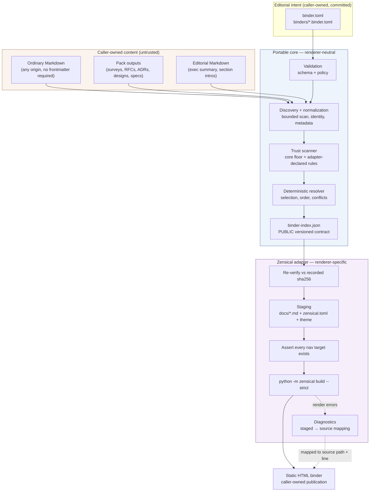

# Overview

> Problem, goals, product boundary, and why this shape won.
> Part of [binder publishing architecture](README.md).

## TL;DR

Ship **one new user-scope-default pack, `binder-publishing`, carrying one
script-backed skill, `publish-binder`**, that compiles a portable `binder.toml`
recipe into a deterministic `binder-index.json` and renders that index to a static
HTML binder through a Zensical staging adapter.

The recommendation rests on one structural claim: **the resolved index, not the
renderer, is the interoperability contract.** A producing pack must be able to
emit a binder recipe with `tomllib` and nothing else — no import of this pack's
code, no knowledge of its install path, and no dependency on the renderer. That
requirement forces the two-artifact split, and everything else follows from it.

Three things are settled and carried by other files:

- **The renderer is Zensical, pinned exactly** — chosen for foundation continuity
  rather than footprint. **[ADR-0073](../../adr/0073-zensical-as-the-v1-binder-renderer.md)**
  is the decision and its evidence.
- **The trust surface is collapsed, not routed.** Strict is the only profile,
  there is no policy file at any tier, there are no grants, and six flags are cut.
  [`security-profile.md`](security-profile.md) carries the model in one sentence.
- **Every renderer claim has been executed**, not inferred.
  [`verified-findings.md`](verified-findings.md) carries Z1–Z6 and V6 — all run —
  and they found several of the adapter's own assertions wrong — the last of them
  (Z6d/Z6e) a control that would have passed CI while the feature was broken, now
  replaced by D46.

---

## Context and problem statement

Skills, packs, humans, scripts, and external workflows produce Markdown artifacts
continuously: research surveys, product intents, RFCs, ADRs, architecture designs,
specs, plans, security assessments, review records.

Each is written where its producing workflow puts it. `desk-research` writes
`<topic-slug>-survey.md` under a configured `output_dir`; `architect-design` writes
`<output_dir>/<topic-slug>/design.md`; `governance-extras` writes
`docs/rfc/NNNN-*.md` and `docs/adr/NNNN-*.md`; `new-spec` writes
`docs/specs/<feature>/spec.md` and `plan.md`.

**The source hierarchy is not the reader hierarchy.** A reviewer preparing for an
architecture review board needs *Executive summary → Context and evidence →
Proposal → Alternatives → Decisions → Architecture → Implementation approach →
Verification → Risks → Appendices*. No directory tree is organized that way, and
none should be — the producing workflows have their own correct reasons for their
layout.

Today the only ways to close that gap are to hand-assemble a document (stale the
moment a source changes), to point the reader at a list of file paths (not a
publication), or to build a one-off script per audience (not reusable, not
reviewable).

What is missing is a **portable, versioned way to declare a reading order over
artifacts that already exist**, and a deterministic compiler that turns that
declaration into a publication without touching the sources.

**Why now.** Five packs already write durable Markdown to an adopter-configured
`output_dir` resolved through `agentbundle-layout.toml` (`architect`,
`desk-research`, `experience-design`, `product-engineering`, `product-strategy`).
The producer side is solved and growing. The consumer side does not exist.

---

## Goals and non-goals

### Goals

1. A **minimal binder is publishable from explicit local Markdown paths alone** —
   in a directory with no Git repository, no `pack.toml`, no `site.toml`, no
   agent-ready-repo checkout, no installed source packs, and no frontmatter.
2. `binder.toml` is a **versioned, portable handoff format** any producer can
   author, and that this pack validates and consumes without caring who wrote it.
3. `binder-index.json` is a **public, versioned renderer interface** sufficient for
   any renderer to produce a publication without rediscovering repository files.
4. **One compilation path** for committed and dynamically generated recipes alike.
5. A **mechanically enforced strict trust profile** suitable for AI-produced,
   mixed-provenance, and externally supplied Markdown.
6. **The installed pack is read-only at runtime.** Every byte written goes to a
   caller-owned location.
7. **Source Markdown is never modified.**
8. **Mermaid renders from portable GitHub-style fences**, and the staged fence
   *body* is byte-identical to the source's (Z3a) — the opening delimiter carries
   compiler-emitted accessibility attributes (D46), at no line-count cost. Under
   Quarto this goal needed the body rewritten; here it needs one same-line
   annotation, which is why the diagram source a reader copies out is the source
   the author wrote.
9. **A published binder makes no network request when read.** A *goal*, not a
   property inherited from the renderer — Zensical's defaults fetch from four
   CDNs, and Z4 is what closes them.
10. Dependency installation is **never silent**, and resolution works with no
    renderer installed at all.

### Non-goals for v1

| Excluded | Why |
|---|---|
| Replacing the Astro/Starlight docs site | Different job. That site is the catalogue and technical-documentation surface; a binder is a bounded, audience-targeted publication. Both persist. |
| Hosted service, daemon, database, control plane | Charter Principle 3. A binder build is a command, not a system. |
| Deployment; serving | Rendering and publishing are different acts with different blast radii. The argv contains `build`; Zensical's `serve` is never invoked. |
| Notebooks, executable computational documents | The threat model treats source Markdown as untrusted content. Execution is the thing we are switching off. |
| Automatic dependency installation | Tier-3 banned. Consented install is offered; silent install never is. |
| PDF/Typst/EPUB/DOCX correctness | Print formats have different diagram, pagination, and font requirements. Letting them shape v1 would distort the HTML design. Declared extension points — and that path goes through a Quarto adapter, not by replacing this one. |
| Figure and section cross-reference syntax | Zensical has no `@fig-`/`@sec-` equivalent. Document-level links resolve; ordinals arrive in Phase 2 with captions. |
| Mutation of source Markdown | Invariant. The whole staging layer exists so this holds. |
| Mandatory migration of any pack | Level 0 must be sufficient forever, not just at launch. |
| A central maintained content inventory | Every pack updating one shared file is a merge-conflict engine and a coupling point. |
| Prose-parsing of status markers from document bodies | A sidecar solves the same need without inventing a Markdown-prose schema. |

---

## Product boundary

### One product, three scopes

The pack installs at **`user`** scope by default, with `repo` and `local` allowed.
`local` scope (RFC-0080 / ADR-0070) lands files in the working tree exactly as
`repo` does but excludes them from Git via `.git/info/exclude`; it refuses to
install outside a Git working tree. The *runtime* remains Git-free at every scope.

There is exactly **one implementation**. Scope changes where the *pack* lives and
which *configuration file* supplies defaults. It never changes the resolver, the
schema, the validator, the staging adapter, or the renderer invocation.

| | User scope | Repository scope | Local scope |
|---|---|---|---|
| Skill lands at | per-adapter user home — `~/.claude/skills/`, `~/.agents/skills/` (codex, cursor, gemini, copilot), `~/.kiro/skills/` | the same per-adapter layout beneath `<repo>/` | as repo, Git-excluded |
| Defaults from | `~/.agentbundle/agentbundle-layout.toml` | `<root>/agentbundle-layout.toml` | as repo |
| Recipes | wherever the caller points | committed under `binders/` | uncommitted |
| Typical use | one install, many unrelated directories | shared team capability, CI | trying it out without touching *tracked files* |

Because the skill has **no single install path** across seven adapters, the
invocation contract is skill-relative rather than absolute — see
[`invocation.md`](invocation.md).

### What "repository scope" means outside Git

**Git presence is not the test.** The pack resolves a **content root** by this
order, and "repository scope" means only "the content root supplied repo-style
configuration":

1. `--root=<path>` → that path, resolved and confined, subject to the refusal
   rules below.
2. Otherwise, the nearest ancestor containing `binder.toml`, `binders/`, or
   `agentbundle-layout.toml`.
3. Otherwise, the nearest ancestor containing `.git`.
4. Otherwise — only when the working directory is outside the installed pack —
   the current working directory.

Rule 2 precedes rule 3 deliberately: a directory carrying repository-style local
configuration **is** a repository for this pack's purposes, whether or not Git has
ever been run in it. Nothing about the runtime requires Git.

**Rules 2–4 apply only when the process working directory is outside the installed
pack — and on both adapters gate V6 could measure, it is.** Measured 2026-08-07:
on `claude-code` and on `codex` an agent runs a script with the CWD of the
**session's project root**, which is the content root, not the skill directory. So rule 4
resolves correctly on the agent surface and **`--root` is not required** there; it
remains the recommended form because it makes the resolution explicit rather than
positional, which is what a `Makefile` or a CI step wants.

The guard stays anyway, and it is now cheap insurance rather than the load-bearing
rule: `binder.py` resolves its own realpath and skips rules 2–4 when its CWD is
beneath the installed pack, exiting 4 with the message naming `--root`. The
remaining adapters were not measured — `copilot`, `cursor`, and `gemini` were not
installed, and the `kiro` binary is the IDE launcher with no headless agent CLI, so
neither `kiro-ide` nor `kiro-cli` could be driven — so an adapter that does behave
differently degrades to a clear error naming its own fix, instead of resolving a
content root the caller did not intend.

> **The old text said `--root` was "effectively required", and V6 removed the
> premise.** It was written defensively because nothing in `author-a-skill.md`, the
> skill-script conventions, or the adapter contract documents the CWD, and
> `markdown-to-html`'s shipped interface implies the opposite. That reading of
> `markdown-to-html` turned out to be right about the *documentation* and wrong
> about the *behaviour*: its `node scripts/render.js` form does not resolve from an
> agent session at all. See [`verified-findings.md`](verified-findings.md) V6.

### `--root` is refusal-grade, and D-A withdrew the grant that would have changed that

Two mechanical rules guard it, both always on: **every node read is
extension-checked** (`*.md`, `*.markdown`, `*.mmd`, explicit paths included), and
**a resolved content root that is the user home, a filesystem root, or an ancestor
of `~/.agentbundle/` or the pack is exit 6.**

An earlier draft observed — correctly — that a blacklist is not a lattice. Those
rules do not stop `--root=$HOME/Documents/other-client` with
`path = "engagements/acme-terms.md"`. It concluded that `--root` needed a grant,
`[roots] allowed`, in a user policy file.

**D-A withdraws that grant, and the argument with it.** The argument ran: *four
flags are closed through the lattice, so the fifth must be too.* When that
conclusion arrives for the fifth time, the surface is the problem. The other four
were cut instead, and the premise dissolved — there is no lattice for `--root` to
be inconsistent with.

**The residual is real and stated:** a caller who points the tool at a directory
gets what they pointed it at, provided every named file is Markdown beneath it.
Two things make that acceptable here. The blast radius is *a read of Markdown the
invoking user can already read* — `binder.py` runs with the caller's privileges, so
`--root` grants nothing the caller lacks. And the proposed remedy was inert: it
protected only users who had written a policy file, which the design's own text
conceded was not the common case. **A grant the common case does not have is
documentation, not a control.**

### Ownership: what the pack owns, what the caller owns

The installed pack directory is **read-only at runtime** — a mechanical control,
not a convention: `binder.py` resolves the realpath of its own directory at
start-up and refuses any write resolving within it.

| Artifact | Owner | Lifetime | Git |
|---|---|---|---|
| `binder.toml`, `binders/*.binder.toml` | caller | durable | committed |
| Editorial Markdown (`binders/editorial/*.md`) | caller | durable | committed |
| `binder-index.json` | caller workspace | per run | ignored; **not** published |
| `binder-stamp.json` | published tree | until replaced | with the publication |
| `renderer-plan.json` | caller workspace | per run | ignored; never published |
| Staging project (`stage/`, incl. its `site/` and `.cache/`) | caller workspace | per run | ignored |
| Rendered publication | caller, configurable **beneath the content root** | until replaced | usually ignored |

**One row is gone: the downloaded toolchain.** ADR-0073 replaced it with a pip
package living wherever the user's Python environment lives — outside this table
entirely, because the pack neither downloads nor owns it. That also removed the
only thing the pack wrote outside a repository, which is why the write set is four
items rather than seven.

---

## Pack placement and charter fit

| Principle | Assessment |
|---|---|
| **1. Universal across tech stacks** | **Clears.** Markdown artifacts and reader-oriented publications are language- and framework-neutral. The renderer is a pip package with 12 platform wheels. |
| **2. Substantive, not duplicative** | **Clears** — argued below against `converters`. |
| **3. A habit, not a tool** | **Clears** — see below (D45). |
| **4. Used often enough to stick** | **Clears.** Architecture review, release readiness, incident review, and implementation handoff each recur; a team running any two reaches for this monthly. |

### Principle 3, resolved

The bar reads *"A habit, not a tool. Captures a way of working, not a piece of
infrastructure."* The "not" is doing work, so the test is which one the pack is
*about*.

**Its subject is a habit** — assembling a decision dossier for a review forum. The
machinery exists to make that habit reproducible and reviewable, exactly as
`work-loop` ships scripts, `new-spec` ships a validator, and `iac-terraform` ships
scaffolding. **Shipping a mechanism does not make the habit a tool**; a habit that
recurs at a team of fifty needs one.

The counter-reading is real and was weighed: two versioned schemas, a resolver, a
trust scanner, and a renderer adapter is infrastructure by any ordinary measure,
and the Charter's "does not" list opens by warning that most candidates fail at
least one principle. The decision (D45) is that the machinery serves the habit
rather than being the product.

Note that the Charter's **accelerator-pack carve-out does not apply**: those packs
clear the remaining three principles *instead of Principle 1*, not instead of
Principle 3. There is no side door, and none was used.

### Why a new pack rather than a ninth `converters` skill

`converters` ships eight skills, and `markdown-to-html` already produces sidebar
navigation, syntax highlighting, callouts, Mermaid, and print-ready output — so
the overlap is real and must be argued.

**The distinguishing axis is arity and selection, not output format:**

| | `converters` | `binder-publishing` |
|---|---|---|
| Input | one named file | a *recipe* naming or querying many files |
| Selection | none — the user names the file | resolution with ordering, exclusions, ambiguity, supersession |
| Intermediate contract | none | `binder-index.json`, a public renderer interface |
| Interop surface | none | `binder.toml` — other packs emit it |
| Trust model | per-file conversion | strict scan over mixed-provenance corpora |

**The dependency-weight half of this argument has evaporated, and saying so is
more useful than keeping it.** An earlier version leaned on "a 236 MB external
dependency" as a reason not to attach this to a pack most adopters install for
`file-to-markdown`. A 12.2 MB pip wheel is lighter than `converters`' own npm
surface. What survives is the table above — which is what the decision should have
rested on all along.

**RFC-0036 is the governing precedent** and chose `converters` over a new Office
pack. Its skills are one-file-in/one-file-out converters with no selection
semantics and no intermediate contract; they belong where they went. This design
differs on all four axes above. RFC-0036's Axis A also rejected
"Convert-from-Markdown (Pandoc/Quarto)" because *"the converter owns the output
structure"* — answered by inverting the relationship: **the binder model owns
structure and hands it to the adapter**, which receives an explicit chapter list,
order, and part tree.

If reviewers disagree, the fallback is a `converters` skill with the identical
internal design — only the pack boundary changes, and no other decision depends on
it. Recorded as U3.

---

## Portability requirements

The portable core must work in a directory with **no** `site.toml`, **no**
documentation site, **no** `pack.toml`, **no** agent-ready-repo checkout, **no**
source packs installed, **no** Git, and **no** frontmatter on any source file.

Two facts make that concrete rather than theoretical:

- **This catalogue's own governance artifacts carry no YAML frontmatter.** RFCs,
  ADRs, specs, and architecture docs all open with an H1 followed by a bold-label
  list. Frontmatter appears only where `contracts/guide.schema.json` applies — and
  not even everywhere under `guides/`.
- Therefore **the dogfooding repository is itself a Level-0 consumer** for most of
  its artifacts. If Level 0 were second-class, this design would fail on the first
  repository it was tried in. That is the strongest available argument for making
  explicit paths the primary path rather than a fallback.

**The pack depends on no npm, no Node, no Astro, no Starlight, no `site.toml`, and
no `tools/build-site.py`.** `binder.py` is standard library only, consistent with
`agentbundle`'s stdlib-only posture.

---

## Architectural invariants

The brief proposed twenty; all are adopted, three with amendment, and two were
added. The eight this tree restates normatively are listed here so they resolve
from inside it; the other twelve are adopted verbatim from the brief.

| # | Invariant |
|---|---|
| 3 | Renderers consume the index and never rediscover or reorder — enforced by a single `read_node_source(node)` accessor that rejects any path not in the index |
| 8 | Build state is caller-owned and isolated **per (binder-id, content-key)**, with a separate lock on the resolved publication directory — see the amendment below |
| 10 | No global mutable binder state file |
| 12 | Pack-produced Markdown is content, not trusted renderer configuration — the load-bearing security claim |
| 13 | The first renderer is not the canonical model |
| 18 | The strict trust profile is mechanically enforced |
| 21 | `binder-index.json` is byte-reproducible for identical inputs |
| 22 | `binder build` writes no field of `binder-index.json` |

**There is no invariant 23.** An earlier draft added *"every input is classified
by origin before it is trusted"* to serve the authority lattice; D39 deleted the
lattice and origin classification with it.

**Amended — #8.** "Isolated per binder *or* run" is too loose to be testable. The
design commits to *per (binder-id, content-key)* isolation for the workspace **and
a separate lock on the resolved publication directory**, because those are two
distinct shared resources.

**Amended — #13.** The brief wrote "Quarto is the first renderer, not the
canonical model". **Demonstrated rather than asserted:** the renderer then
changed, and the index, schema, resolver, and scanner did not.

**Amended — #18.** D-A made strict the *only* profile, so "mechanically enforced"
no longer needs the qualifier "at the level the policy file authorizes".

**Added — #21. `binder-index.json` is byte-reproducible for identical inputs.** No
timestamps, run IDs, host names, or absolute paths. Run metadata lives in a
separate `run.json`. This makes the index diffable in CI and testable without
golden-file churn, and it is a harder anti-receipt-theatre constraint than "avoid
audit fields" — it makes ceremonial fields structurally impossible.

> D-A strengthened this by deleting its exception. The previous version had to
> qualify *inputs* to include the resolved trust profile, so only "the same
> machine always reproduces" could be promised. With one profile and no policy
> file, **reproducibility is now machine-independent**.

**Added — #22. `binder build` writes no field of `binder-index.json`.** The index
is complete when `resolve` returns and carries no renderer-shaped field. Anything
an adapter must invent — staged filenames, line offsets, emitted ordinals — goes
in that adapter's own plan file. Invariant 3 stops the adapter reaching back into
the sources; this one stops it reaching back into the contract.

---

## Current-state analysis

| Surface | Relevance |
|---|---|
| `packs/converters` | Overlapping on output, disjoint on arity — argued above |
| `tools/build-site.py` + `docs-site/` | The catalogue surface. Different audience, different lifecycle, npm-dependent. Untouched |
| `site.toml` | Repository- and Astro-specific. Not a binder format and must not become one |
| `agentbundle-layout.toml` | **The mechanism this pack uses** — with one correction below |
| `.apm/skills/<name>/{scripts,references,assets,evals}` | The only four blessed skill subdirectories; fixes the pack's shape |
| Skill self-containment (`author-a-skill.md`) | **Decides the pack shape** *and* the template seam — see [`outline-and-templates.md`](outline-and-templates.md) |
| Skill path discipline (linter-enforced) | **Decides the invocation contract** |
| Three-tier dependency policy | Satisfied with no deviation: a pinned pip install is Tier 2 as written |
| `safe_io.py` in `converters` | The blessed path-confinement pattern to reproduce (not import — self-containment forbids that) |
| Adapter contract v0.17 (current contract v0.18) | Fixes both the invocation contract and the manifest's minimum version |
| RFC-0080 / ADR-0070 | `--scope local`; auto-allowed with `repo` |
| RFC-0036 | The placement precedent, addressed above |

**Correction: how `agentbundle-layout.toml` defaults actually work.** Verified
against `install.py::_append_layout_section`: the appender reads
**`[pack.layout.<scope>].parent`**, not `output_dir`; it appends a table named
`[<pack-name>]`, not a semantic section name; and with `parent` absent it returns
early — a no-op. All five current consumers declare `output_dir` and no `parent`,
so **the install-time append has never fired for any of them.** The sections their
skills read are hand-written by adopters.

So: **`[binder]` is an adopter-hand-written section**, and `[pack.layout.repo]
output_dir` is declared for parity and as machine-readable documentation of the
default — not because it causes an append. Recorded as U12.

**Documented drift found during this analysis.**
`guides/_shared/reference/skill-script-conventions.md` (line 62) tells authors to
put shared code in `.apm/shared-libs/`, while
`guides/_shared/how-to/author-a-skill.md` (line 77) says that path must **not** be
used for skill code. This design follows the stricter statement. Flagged, not
worked around — recorded as U11.

---

## Alternatives

Twelve were assessed. The architecture choice and the renderer choice are
independent axes, and separating them is what bounded the renderer reversal to one
of them.

- **Axis A — architecture:** renderer-independent compiler with a neutral index
  (**selected**), versus a renderer-specific schema, extending `site.toml`, or no
  compiler at all.
- **Axis B — renderer under architecture 1:** **[ADR-0073](../../adr/0073-zensical-as-the-v1-binder-renderer.md)**.

**Axis A, scored.** Legend: ● strong · ◐ partial · ○ weak.

| Criterion | 1 Selected | 2 Renderer-schema | 3 site.toml | 7 No compiler |
|---|---|---|---|---|
| Pack interoperability | ● | ○ | ○ | ○ |
| Deterministic composition | ● | ◐ | ○ | ○ |
| Mechanically closable security | ● | ◐ | ○ | ○ |
| Schema evolution | ● | ○ | ○ | ○ |
| Renderer flexibility | ● | ○ | ○ | ○ |
| Inspectability | ● | ◐ | ◐ | ○ |
| Existing-site integration | ● | ◐ | ● | ○ |
| Maintenance burden | ○ | ◐ | ◐ | ● |
| New machinery | ○ | ◐ | ◐ | ● |

Architecture 1 wins on **pack interoperability** and **mechanically closable
security** — the two the brief made non-negotiable, and neither retrofittable onto
options 2, 3, or 7 without those becoming option 1. It is the most expensive on
maintenance burden and new machinery. That is the trade.

**Axis A was predicted to survive a renderer change, and did.** The swap moved the
adapter, its plan file, the dependency contract, and the staged layout; the index,
schema, resolver, and scanner did not change. The remaining eight alternatives and
the reasons they lost are in [`history.md`](history.md).

---

## Proposed component architecture



**The claim this diagram carries, at the strength it holds:** the adapter reads
source files only through an index-derived path allowlist, and links no discovery
module. It *does* read caller-owned sources — staging must — and the index does
carry `content-root`, so the weaker claim that it "is never given a source root"
would be false.

What makes invariant 3 mechanical is narrower and testable: every source read in
the adapter goes through a single `read_node_source(node)` accessor that **rejects
any path not enumerated in the index**. There is no glob, no walk, and no selection
code reachable from `render_zensical.py`. An adapter cannot reorder or re-select
because it has no way to name a file the resolver did not choose — not because it
was denied a variable.

### Ownership and boundaries

| Owned by the **binder model** (renderer-neutral) | Owned by the **Zensical adapter** |
|---|---|
| identity, title, purpose, audience, subject, scope | staged file paths and names |
| source roots | generated `zensical.toml` |
| sections, parts, exact artifact references | the `nav` array and its nesting |
| semantic selection, ordering, exclusions | theme: `main.html`, CSS, vendored `mermaid.min.js` |
| conflict and supersession policy | the `build` invocation and argv |
| editorial material and its classification | diagnostics interpretation and ANSI stripping |
| provenance and publication profile | ordinal emission (Z2h) and its CSS rendering |
| renderer selection | link rewriting to staged filenames |
| **namespaced** safe renderer options | everything under `stage/` |

### Namespacing renderer options without contaminating the core

```toml
[renderers.zensical]
mermaid-theme = "neutral"
toc-depth     = 3
```

Three rules keep this from becoming a leak:

1. **The core never reads inside `[renderers.*]`.** It validates that the selected
   renderer's sub-table is present and that every value is a scalar or array of
   scalars, copies it into the index verbatim, and never interprets it.
2. **Each adapter owns a closed allowlist of its own option keys.** An unknown key
   is a validation error from the adapter, not a silent pass-through — and every
   allowlisted key has a named emission point in
   [`zensical-adapter.md`](zensical-adapter.md), because a recipe key with nowhere
   to land is the silently-ignored key D15 forbids.
3. **No option may reach a security-relevant renderer key.** The allowlist
   mechanically excludes `custom_dir`, `extra_javascript`, `extra_css`,
   `markdown_extensions`, `docs_dir`, `site_dir`, `site_url`, `hooks`, and
   `plugins`. Because the allowlist is positive, a new renderer option cannot
   become reachable by accident.

**The first two exclusions matter most and are excluded for a specific reason**,
not as part of a general sweep: `custom_dir` and `extra_javascript` are exactly
what the adapter uses for the offline hardening. **A recipe that could set either
could swap the vendored Mermaid for a remote one**, undoing Z4 from repository
content.

---

## Existing-site integration boundary

The Astro/Starlight site at `docs-site/` remains the permanent catalogue and
technical-documentation surface. This design does not replace, modify, or depend
on it.

| Boundary | Assessment |
|---|---|
| **Link out** — the site links to a separately built binder | **Selected for v1.** Zero coupling, zero new code, works today |
| Mount — copy a rendered binder into the site's static tree | Deferred, and **cheaper than it was**: Z4e found every asset reference document-relative, so it needs a copy step and a `site_url`, not the base-path rewriting Quarto's output required |
| Site builder consumes `binder-index.json` | Deferred, and **enabled by construction** — the index is a public versioned contract precisely so this is a later addition rather than a later redesign |
| Shared content-graph layer serving both | Rejected for the foreseeable future. It would require the site and the compiler to agree on identity, metadata, and lifecycle semantics — a large shared abstraction justified by no current requirement |

**Binder selection and ordering semantics are never duplicated inside
`build-site.py`.** If the site ever needs them, it reads the index.

---

## Binder reader experience

| Aspect | Owner |
|---|---|
| Cover page; purpose, audience, subject, scope, status | **Compiler-generated** from the index |
| Executive summary | **Editor-generated**, marked |
| Named parts, chapter ordering | **Binder semantics** → the emitted nested `nav` |
| Chapter numbers and appendix letters | **Compiler-generated as a `data-ordinal` attribute, rendered by theme CSS** — the renderer numbers nothing (Z2h), and the number stays out of the title text so it never reaches the search index or the browser tab (D44) |
| Section introductions, transitions | **Editor-generated**, marked |
| Sidebar, search, previous/next, per-page TOC, responsive layout | **Renderer-native** (Z2a, Z2e, Z4e) |
| Artifact-kind and lifecycle-status badges | **Compiler-generated** from index metadata, as `admonition` blocks and `attr_list` spans; the **pack theme** styles them. Verified (Z2b) — no gate outstanding |
| Source attribution | **Compiler-generated**, one restrained line per chapter — artifact kind and status only, **never the repository-relative path** |
| Decision / risk / open-question callouts | **`admonition` blocks**, emitted where the recipe assigns a `role`; **not** inferred from prose |
| Cross-document links | **Binder semantics** (target resolution) + **renderer-native** URL shaping (Z2b) |
| Mermaid diagrams | **Binder semantics** (constraints) + **compiler-generated** accessible naming, as allowlisted `attr_list` attributes on the fence delimiter that the **pack theme** lifts into the Mermaid source, so the SVG itself carries `<title>`/`<desc>` (D46 — Z6d found attributes left *on* the fence are destroyed at render time) + **the vendored bundle** rendering client-side (Z6a). The compiler performs **no transformation of the fence body** (Z3a) |
| Appendices; source inventory and provenance | **Compiler-generated**, and the inventory is **opt-in** |
| Superseded material | **Binder semantics** — dropped, or gathered into an appendix |
| Conflicting material | **Editor-generated** commentary; the compiler surfaces both, never adjudicates |
| Semantic headings, visible focus, accessible diagram names, reduced motion, system-font stack | **Pack theme** + compiler-emitted names |
| Print stylesheet | **Pack theme**, best-effort — PDF correctness is a non-goal |

**Producer-pack implementation detail is deliberately not surfaced.** A reader sees
"Architecture design · Accepted", not "produced by `architect-design` v0.14.2 into
`docs/design/`" — and not the source path either.
