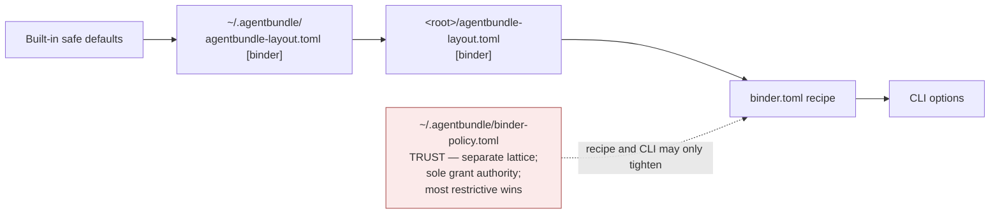

# Runtime

> Storage, locks, concurrency, publication, configuration.
> Part of [binder publishing architecture](README.md).

## Configuration precedence

Presentation, semantics, and paths — later wins:



Five distinct categories, kept separate on purpose:

| Category | Example | Ladder | May a recipe set it? |
|---|---|---|---|
| Presentation defaults | `toc-depth`, mermaid theme | ordinary | yes |
| Binder semantics | sections, order, exclusions | ordinary | yes — it *is* the recipe |
| Dependency configuration | Quarto path, toolchain cache | ordinary, **CLI/env/config only** | **no** — a recipe naming a binary is a code-execution channel |
| Trusted repository customization | theme path | trust lattice | request only; the policy file authorizes |
| Enforced trust policy | strict profile | trust lattice | tighten only |

### The `[binder]` section

```toml
# <root>/agentbundle-layout.toml   (adopter-owned, hand-written — see the
# current-state correction; the installer's append reads `parent`, not
# `output_dir`, so it does not create this section)
[binder]
output_dir    = "build/binders"   # publication root; per-binder folders beneath
workspace_dir = ".binder-work"    # index + staging; gitignored
recipes_dir   = "binders"         # where named recipes live
```

Anchoring follows the established convention: a repo-root file's values are
repo-root-relative (absolute permitted, warned as non-portable); a user-profile
file's values must be absolute (`~` fine), and a relative value there is an
ask-first deviation. Every value is `~`-expanded, realpath-resolved,
`..`-rejected, and **surfaced before the first write**.

---

## Storage, staging, and concurrency

### Layout

```
<content root>/
├── binder.toml                          # committed
├── binders/
│   ├── architecture-review.binder.toml  # committed, reusable
│   └── editorial/
│       └── payments-exec-summary.md     # committed, reviewable
├── .binder-work/                        # gitignored
│   └── payments-review/
│       └── 8f3a91c2/                    # content-key
│           ├── binder-index.json        # written by resolve; never published
│           ├── renderer-plan.json         # written by build; never published
│           ├── run.json                 # 4 fields; NOT in the index
│           ├── .lock
│           └── stage/
│               ├── index.qmd · NN-*.qmd · _quarto.yml · binder.scss
│               └── _output/             # + binder-stamp.json (staging step 14)
└── build/binders/payments-review/       # publication (configurable)
```

The skill offers to add `.binder-work/` to `.gitignore` on first run and never
edits it without consent. **This is a `.gitignore` write, deliberately** — ADR-0070
records "we will never write to `.gitignore`" for *local-scope installs*, whose
whole premise is leaving no git-visible trace; a durable ignore rule for a
workspace directory the team will see in `git status` on every machine is the
opposite case, and `.git/info/exclude` would be wrong for it because it is
per-clone and uncommitted.

### Three locks, because there are three shared resources

The **content-key** is `sha256(recipe realpath + resolved params + **resolved trust
profile** + schema version + pack version)[:8]`. The profile is in the hash because
invariant 21 calls it an input and the index records it: without it, a strict
build and an authorized `trusted` build of the same recipe would share one
workspace and one lock, each overwriting the other's index, plan, and staging.

| Resource | Lock | Why |
|---|---|---|
| Workspace | `<workspace>/<binder-id>/<content-key>/.lock` | two identical builds must not stage into one directory |
| **Publication directory** | `<publication-dir>/../.<name>.publish-lock`, keyed on the **realpath of the resolved publication directory** and taken *before* the rename sequence. This, the `<publication-name>.trash-<content-key>` staging name, and the cross-device `<publication-name>.incoming-<content-key>` are the **only three entries written outside the publication directory itself** — both siblings in its parent, both listed in the ownership table, both covered by control 21's extension below. The parent's writability is checked at validation alongside the `st_dev` comparison; an unwritable parent is exit 6 before Quarto runs, not after. | two *different* recipes — different content-keys, different workspace locks — can resolve to the same publication directory and would otherwise race through `os.replace` |
| **Toolchain cache** | `<cache>/quarto/.install-<version>.lock` | two concurrent builds on a fresh machine would otherwise both extract a 236 MB tarball into the same version directory. The cache is the one genuinely global mutable resource the design introduces, so the "no shared mutable state" claim has to account for it rather than exclude it. |

All three locks are created `O_CREAT|O_EXCL` holding PID and start time. A waiter
blocks for 60 s by default, then exits 8; `--no-wait` exits 8 immediately.

**Stale locks are never broken automatically.** PID-liveness plus an age threshold
is `os.kill(pid, 0)` on POSIX only, is unsafe under PID reuse, and is meaningless
on a network filesystem — three ways to silently delete another process's working
directory. On contention the error names the holding PID, the lock's age, and
`--force-unlock`, which the operator runs deliberately.

**The scan set for the two validation rules is defined, because recipes are not
required to live in `recipes_dir`:**

1. **`id` must be unique across the scan set**, which is exactly
   `recipes_dir/*.binder.{toml,json}` ∪ the content root's `binder.toml` or
   `binder.json` ∪ the recipe passed on the command line. Both serializations are
   globbed, since D21 admits JSON from machine producers. `binder.toml` at the root is the documented quick
   start and editor-generated recipes are written by the skill, so a rule scoped
   to `recipes_dir` alone would miss both.
2. **Two recipes in the scan set may not resolve to the same publication
   directory.** Error naming both recipes and the shared path.

A recipe outside the scan set — one passed by absolute path from elsewhere — can
still collide. That is what the publication lock is for: the validation rules
catch the common case loudly, the lock makes the uncatchable case safe.

Consequently `binder clean <binder-id>` is unambiguous **for recipes in the scan
set**. Outside it, `clean` lists every content-key directory it matched and asks
before removing, rather than assuming the binder-id means one thing.

**Two different binders build concurrently with no shared mutable state** — there
is no global file to contend over, which is invariant 10 doing real work rather
than being a slogan.

### Interruption and idempotence

`stage/` is rebuilt from scratch every run, so an interrupted build leaves no
state that can corrupt the next one. A rerun with unchanged inputs produces a
byte-identical index (invariant 21) and byte-identical staged files; whether
Quarto's HTML is byte-identical is not claimed. Incremental rebuild (`--if-stale`,
Phase 2) will compare recorded SHA-256 values and skip a no-op rebuild; v1 always
rebuilds, which is correct-but-slower and needs no cache-invalidation reasoning.

### Near-atomic publication

Render targets `stage/_output/`. Publication is a three-step rename, under the
publication lock:

1. `os.replace(publication, <publication-name>.trash-<content-key>)` if it exists
2. `os.replace(source, publication)`
3. `shutil.rmtree(<publication-name>.trash-<content-key>)`

Both renames target non-existent names, so this works on Windows.

**`source` is not always `stage/_output`, because a rename cannot cross
filesystems.** `workspace-dir` defaults inside the content root while
`publication-dir` may — with a user-policy grant — resolve to another filesystem;
a granted `~/Sites/` target or a mounted volume is the case, and `os.replace`
raises `EXDEV` across devices, which would turn a successful render into an unhandled crash at
the last step. So:

- The device check runs at **validation**, comparing `st_dev` of the workspace
  parent against the **nearest existing ancestor** of the publication path — the
  publication directory and often its parent do not exist yet on a first build, so
  comparing against the leaf would raise rather than answer. A cross-device
  configuration is therefore known before Quarto is invoked, not after.
- On a match, `source` is `stage/_output` and no copy happens.
- On a mismatch, the adapter copies `stage/_output` to
  `<publication-parent>/<publication-name>.incoming-<content-key>/` after the render
  and uses that as `source` — the third named sibling in control 21. Both renames are then intra-device by construction. The cost
  is one copy of the rendered output, paid only by cross-device configurations.

The non-existence window between steps 1 and 2 is milliseconds. **This is
near-atomic, not atomic**, and the design says so: a publication directory served
directly by a live web server can 404 briefly during replacement. Serving from a
copy or a symlink swap is the adopter's call and is documented, not solved here.

### The publication directory must be ours before we replace it

Step 1 renames the existing publication directory aside and step 3 deletes it.
Nothing above establishes that the directory was ever produced by this tool — so
`publication-dir = "~/Sites"`, which is the design's own motivating cross-device
example, would silently destroy the user's site on the first build.

**Ownership is therefore checked at validation, before Quarto is invoked**, and
the target must satisfy one of:

- it does not exist;
- it exists and is empty;
- it exists and contains a `binder-stamp.json` whose `binder.id` matches the
  recipe's — i.e. this tool produced it, for this binder.

Anything else is **exit 4**, naming the path and what was found.

**Overriding it is a grant, not a flag.** An earlier draft offered
`--replace-foreign-dir` as a plain per-invocation escape — which the threat model
forbids in its own words: the invocation string is repository content, so a
committed `Makefile` could pass it. The override therefore routes through the
trust lattice exactly as `--profile trusted` does:

```toml
# ~/.agentbundle/binder-policy.toml — the sole grant authority
[publication]
replaceable-paths = ["~/Sites/binders"]
```

`--replace-foreign-dir` *activates* that grant for one invocation and never
creates one. Without a matching entry it is the same exit-6 error as an
unauthorized `trusted` request.

**And `publication-dir` itself is confined.** It resolves beneath the content root
by default; an absolute or `..`-escaping value from `<root>/agentbundle-layout.toml`
or from the recipe is **exit 6** unless the user policy file names a containing
root in `[publication] roots = [...]`. Without this, repository content picks the
directory *and* the flag that deletes it, and the ownership check above guards
nothing — `~/Sites` is reachable from a committed layout file alone.

The user policy file is the only place either grant can live, for the reason D30
already gives: a knob repository content can turn is not a control.

The same rule closes the gap between this section and `clean --publication`,
which already refuses paths outside the configured publication root — replacement
is a delete too, and was the unguarded one.

`run.json` holds exactly four fields — `started`, `finished`, `quarto-version`,
`pack-version` — and exists so the build summary can report them without putting
a timestamp in the index (invariant 21). Nothing else reads it; if the summary
stops printing them, the file goes.

**Orphaned workspaces.** The content-key hashes the pack version, so every pack
upgrade strands one staging tree per binder. `binder clean --stale` sweeps them:
it removes content-key directories whose recipe no longer resolves, or whose
recorded pack version differs from the running one, listing what it will remove
first. Without it the workspace grows by one 200 MB-ish tree per binder per
upgrade, which is the kind of accumulation nobody notices until a disk fills.

`binder clean <binder-id>` removes the workspace entries; `--publication` also
removes the publication (confined, refusing any path not beneath the configured
publication root); `--toolchain` removes cached Quarto versions.

---

## Compatibility and migration

Nothing to migrate. No existing artifact changes; no pack changes; no source file
changes. A repository adopts the pack by adding one `binder.toml`.

| Change | Impact |
|---|---|
| Existing packs | None. Level 0 requires nothing of them. |
| Existing Markdown | None. Never modified, never required to carry metadata. |
| `tools/build-site.py`, `site.toml`, `docs-site/` | None. Not read, not written, not imported. |
| `.gitignore` | Offered, on consent: `.binder-work/`, and the publication dir if inside the repository. |
| `agentbundle-layout.toml` | An adopter adds a `[binder]` section by hand; the installer's append does not create it (see the current-state correction). |
| `contracts/` | **None.** The schemas ship in the skill's `assets/` and are published from there; see *Canonical schema publication* for why mirroring them into `contracts/` would invert RFC-0076 D1's authority model and pull a binder schema into the CLI's bundled `_data/`. |

A pack that later wants to participate does so by shipping a recipe template
under its own `assets/`, or documenting its frontmatter — both additive, neither
requiring a change to this pack.

---
