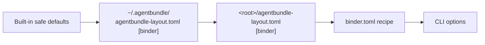

# Runtime

> Storage, locks, concurrency, publication, configuration.
> Written against D-A (strict-only, no policy file) and D-B (Zensical).
> Part of [binder publishing architecture](README.md).

## Configuration precedence

Presentation, semantics, and paths — later wins. **One ladder, no side channel:**



**The second lattice is gone.** The previous version of this diagram carried a red
`binder-policy.toml` node feeding sideways into the recipe as the "sole grant
authority", with "recipe and CLI may only tighten" on the edge. D-A deleted the
file, the grants, and the tightening rule — because with nothing to grant, an
authority has nothing to decide. What is left is an ordinary precedence chain of
the kind every other pack in this catalogue has.

Two distinct categories, kept separate on purpose:

| Category | Example | May a recipe set it? |
|---|---|---|
| Presentation defaults | `toc-depth`, mermaid theme | yes |
| Binder semantics | sections, order, exclusions | yes — it *is* the recipe |

Three categories from the previous version have no members any more:
**dependency configuration** (D-B — there is no binary path to name, and no
toolchain cache), **trusted repository customization**, and **enforced trust
policy** (both D-A). Naming them as deleted rather than dropping the rows is
deliberate: a reader arriving from an earlier draft needs to know the category
was removed, not that it moved somewhere they have not looked yet.

### The `[binder]` section

```toml
# <root>/agentbundle-layout.toml   (adopter-owned, hand-written — see the
# current-state correction; the installer's append reads `parent`, not
# `output_dir`, so it does not create this section)
[binder]
output_dir    = "build/binders"   # publication root; per-binder folders beneath
workspace_dir = ".binder-work"    # index + staging; gitignored
recipes_dir   = "binders"         # where named recipes live
```

Anchoring follows the established convention: a repo-root file's values are
repo-root-relative (absolute permitted, warned as non-portable); a user-profile
file's values must be absolute (`~` fine), and a relative value there is an
ask-first deviation. Every value is `~`-expanded, realpath-resolved,
`..`-rejected, and **surfaced before the first write**.

---

## Storage, staging, and concurrency

### Layout

```
<content root>/
├── binder.toml                          # committed
├── binders/
│   ├── architecture-review.binder.toml  # committed, reusable
│   └── editorial/
│       └── payments-exec-summary.md     # committed, reviewable
├── .binder-work/                        # gitignored
│   └── payments-review/
│       └── 8f3a91c2/                    # content-key
│           ├── binder-index.json        # written by resolve; never published
│           ├── renderer-plan.json       # written by build; never published
│           ├── run.json                 # 4 fields; NOT in the index
│           ├── .lock
│           └── stage/
│               ├── zensical.toml        # generated entirely from the index
│               ├── docs/                # index.md · NNN-*.md · assets/
│               ├── theme/               # main.html · vendored mermaid.min.js
│               ├── .cache/              # Zensical's, not ours
│               └── site/                # render output + binder-stamp.json
└── build/binders/payments-review/       # publication (configurable)
```

**`stage/site/` and `stage/.cache/` are Zensical's names, not ours, and their
location is a verified fact rather than an assumption.** Z1e established that both
are resolved relative to the **config file's directory**, not the process working
directory — so putting `zensical.toml` in `stage/` puts everything the renderer
writes inside the workspace, inside the write set, and inside what `--keep-stage`
retains and `clean` removes. Had they been CWD-relative, a build would have
scattered output next to whatever directory the agent happened to be in.

The skill offers to add `.binder-work/` to `.gitignore` on first run and never
edits it without consent. **This is a `.gitignore` write, deliberately** — ADR-0070
records "we will never write to `.gitignore`" for *local-scope installs*, whose
whole premise is leaving no git-visible trace; a durable ignore rule for a
workspace directory the team will see in `git status` on every machine is the
opposite case, and `.git/info/exclude` would be wrong for it because it is
per-clone and uncommitted.

### Two locks, because there are two shared resources

The **content-key** is
`sha256(recipe realpath + resolved params + schema version + pack version)[:8]`.

**Every input is available to `resolve`, and that is a requirement, not a
coincidence.** `resolve` runs with no renderer installed and writes
`binder-index.json` into `<workspace>/<binder-id>/<content-key>/`, so it must be
able to compute the key. Anything in the hash that only `build` knows would make
`resolve` print a path `build` then does not read.

Two changes from the previous version:

- **The resolved trust profile is out.** It was hashed in so that a strict build
  and an authorized `trusted` build of one recipe could not share a workspace and
  overwrite each other's index, plan, and staging. D-A left one profile, so there
  is nothing to separate, and a constant in a hash is noise.
- **The renderer version is out too**, and an intermediate draft had it in. The
  reasoning was that the staged tree is renderer-shaped — `docs/`, `zensical.toml`,
  `theme/main.html` — so an upgrade must not reuse a workspace staged by a
  different renderer build. **That hazard does not exist:** `stage/` is deleted
  and rebuilt from scratch on every run (see *Interruption and idempotence*), so
  there is nothing stale to reuse. Hashing the renderer version would have bought
  no isolation and cost `resolve` its ability to compute its own output path.

**Renderer staleness is recorded, not hashed.** `run.json` carries
`renderer-version`, and `clean --stale` reads it — which is where a "this tree was
staged by a different renderer" signal belongs, since it is a fact about a past
run rather than an input to the current one.

| Resource | Lock | Why |
|---|---|---|
| Workspace | `<workspace>/<binder-id>/<content-key>/.lock` | two identical builds must not stage into one directory |
| **Publication directory** | `<publication-dir>/../.<name>.publish-lock`, keyed on the **realpath of the resolved publication directory** and taken *before* the rename sequence. This, the `<publication-name>.trash-<content-key>` staging name, and the cross-device `<publication-name>.incoming-<content-key>` are the **only three entries written outside the publication directory itself** — all siblings in its parent, all listed in the write set. The parent's writability is checked at validation alongside the `st_dev` comparison; an unwritable parent is exit 6 before the renderer runs, not after. | two *different* recipes — different content-keys, different workspace locks — can resolve to the same publication directory and would otherwise race through `os.replace` |

**The third lock is gone with the thing it guarded.** It served the toolchain
cache, where two concurrent builds on a fresh machine would both extract a 236 MB
tarball into one version directory. D-B replaced that with a pip package the user
installs once, outside the pack, through a package manager that has its own
concurrency story. **The design no longer introduces any globally mutable
resource** — which upgrades invariant 10 from a claim needing a caveat to a claim
that simply holds.

Both locks are created `O_CREAT|O_EXCL` holding PID and start time. A waiter
blocks for 60 s by default, then exits 8; `--no-wait` exits 8 immediately.

**Stale locks are never broken automatically.** PID-liveness plus an age threshold
is `os.kill(pid, 0)` on POSIX only, is unsafe under PID reuse, and is meaningless
on a network filesystem — three ways to silently delete another process's working
directory. On contention the error names the holding PID and the lock's age, and
points at **`clean --stale`**, which the operator runs deliberately. D-A cut
`--force-unlock`: a flag that breaks another process's lock is reachable from a
committed `Makefile`, whereas `clean` is a verb whose whole subject is removing
state.

**The scan set for the two validation rules is defined, because recipes are not
required to live in `recipes_dir`:**

1. **`id` must be unique across the scan set**, which is exactly
   `recipes_dir/*.binder.{toml,json}` ∪ the content root's `binder.toml` or
   `binder.json` ∪ the recipe passed on the command line. Both serializations are
   globbed, since D21 admits JSON from machine producers. `binder.toml` at the root is the documented quick
   start and editor-generated recipes are written by the skill, so a rule scoped
   to `recipes_dir` alone would miss both.
2. **Two recipes in the scan set may not resolve to the same publication
   directory.** Error naming both recipes and the shared path.

A recipe outside the scan set — one passed by absolute path from elsewhere — can
still collide. That is what the publication lock is for: the validation rules
catch the common case loudly, the lock makes the uncatchable case safe.

Consequently `binder clean <binder-id>` is unambiguous **for recipes in the scan
set**. Outside it, `clean` lists every content-key directory it matched and asks
before removing, rather than assuming the binder-id means one thing.

**Two different binders build concurrently with no shared mutable state** — there
is no global file to contend over, which is invariant 10 doing real work rather
than being a slogan.

### Interruption and idempotence

`stage/` is rebuilt from scratch every run — including `stage/.cache/`, which is
Zensical's and is therefore never carried across — so an interrupted build leaves
no state that can corrupt the next one. A rerun with unchanged inputs produces a
byte-identical index (invariant 21) and byte-identical staged files; whether the
renderer's HTML is byte-identical is not claimed. Incremental rebuild (`--if-stale`,
Phase 2) will compare recorded SHA-256 values and skip a no-op rebuild; v1 always
rebuilds, which is correct-but-slower and needs no cache-invalidation reasoning.

### Near-atomic publication

Render targets `stage/site/`. Publication is a three-step rename, under the
publication lock:

1. `os.replace(publication, <publication-name>.trash-<content-key>)` if it exists
2. `os.replace(source, publication)`
3. `shutil.rmtree(<publication-name>.trash-<content-key>)`

Both renames target non-existent names, so this works on Windows.

**`source` is not always `stage/site`, because a rename cannot cross
filesystems.** `os.replace` raises `EXDEV` across devices, which would turn a
successful render into an unhandled crash at the last step.

D-A made this rarer without making it impossible, and the distinction matters.
The old motivating case was a *granted* `publication-dir = "~/Sites"` on another
volume; that grant is gone, and `publication-dir` is now confined beneath the
content root with no exception. But confinement is not a device guarantee: a
mount point, a bind mount, or a Docker volume beneath the content root all put the
publication on a different filesystem from the workspace. So the handling stays,
with an honest reason rather than an obsolete one:

- The device check runs at **validation**, comparing `st_dev` of the workspace
  parent against the **nearest existing ancestor** of the publication path — the
  publication directory and often its parent do not exist yet on a first build, so
  comparing against the leaf would raise rather than answer. A cross-device
  configuration is therefore known before the renderer is invoked, not after.
- On a match, `source` is `stage/site` and no copy happens.
- On a mismatch, the adapter copies `stage/site` to
  `<publication-parent>/<publication-name>.incoming-<content-key>/` after the render
  and uses that as `source` — the third named sibling in the write set. Both
  renames are then intra-device by construction. The cost is one copy of the
  rendered output, paid only by cross-device configurations.

The non-existence window between steps 1 and 2 is milliseconds. **This is
near-atomic, not atomic**, and the design says so: a publication directory served
directly by a live web server can 404 briefly during replacement. Serving from a
copy or a symlink swap is the adopter's call and is documented, not solved here.

### The publication directory must be ours before we replace it

Step 1 renames the existing publication directory aside and step 3 deletes it.
Nothing above establishes that the directory was ever produced by this tool — and
confinement does not help, because `publication-dir = "docs"` is confined and
would still destroy a documentation tree on the first build.

**Ownership is therefore checked at validation, before the renderer is invoked**,
and the target must satisfy one of:

- it does not exist;
- it exists and is empty;
- it exists and contains a `binder-stamp.json` whose `binder-id` matches the
  recipe's — i.e. this tool produced it, for this binder.

Anything else is **exit 4**, naming the path and what was found.

**There is no override.** An earlier draft offered `--replace-foreign-dir`, first
as a plain flag and then — after round 4 observed that the invocation string is
repository content — as a grant in a user policy file. D-A cut both. A caller who
genuinely means to publish over a directory they own empties it themselves, which
is one `rm -rf` they type rather than a `rmtree` this tool performs on their
behalf.

That is the whole of the trade and it is a small one: the flag existed for a case
nobody had reported, and the two rounds of design it consumed are exactly the
pattern D-A was cutting.

**And `publication-dir` itself is confined, with no exception.** It resolves
beneath the content root; an absolute or `..`-escaping value from
`<root>/agentbundle-layout.toml` or from the recipe is **exit 6**. The
`[publication] roots` grant that used to admit one is gone with the policy file.

Together these close what round 4 identified as the sharpest write-side hole:
repository content could previously pick the directory *and* the flag that deletes
it. Now it can do neither. `clean --publication` already refused paths outside the
configured publication root; replacement is a delete too, and was the unguarded
one.

`run.json` holds exactly four fields — `started`, `finished`, `renderer-version`,
`pack-version` — and exists so the build summary can report them without putting
a timestamp in the index (invariant 21). Nothing else reads it; if the summary
stops printing them, the file goes.

**Orphaned workspaces.** The content-key hashes the pack version, so every pack
upgrade strands one staging tree per binder. `binder clean --stale` sweeps them:
it removes content-key directories whose recipe no longer resolves, or whose
`run.json` records a pack or renderer version differing from the running one,
listing what it will remove first. Without it the workspace grows by one tree per
binder per upgrade, which is the kind of accumulation nobody notices until a disk
fills.

A renderer upgrade does not strand anything — the key does not hash it — but
`--stale` still reports those directories, because a tree last staged by a
different renderer build is worth telling the operator about even when the next
build would have rebuilt it anyway.

`clean --stale` is also where `--force-unlock`'s job went: a lock inside a
content-key directory that `--stale` is removing goes with it, deliberately and
with the directory listed first.

`binder clean <binder-id>` removes the workspace entries; `--publication` also
removes the publication (confined, refusing any path not beneath the configured
publication root). There is no `--toolchain`: D-B removed the cache it swept.

---

## Compatibility and migration

Nothing to migrate. No existing artifact changes; no pack changes; no source file
changes. A repository adopts the pack by adding one `binder.toml`.

| Change | Impact |
|---|---|
| Existing packs | None. Level 0 requires nothing of them. |
| Existing Markdown | None. Never modified, never required to carry metadata. |
| `tools/build-site.py`, `site.toml`, `docs-site/` | None. Not read, not written, not imported. |
| `.gitignore` | Offered, on consent: `.binder-work/`, and the publication dir if inside the repository. |
| `agentbundle-layout.toml` | An adopter adds a `[binder]` section by hand; the installer's append does not create it (see the current-state correction). |
| `contracts/` | **None.** The schemas ship in the skill's `assets/` and are published from there; see *Canonical schema publication* for why mirroring them into `contracts/` would invert RFC-0076 D1's authority model and pull a binder schema into the CLI's bundled `_data/`. |

A pack that later wants to participate does so by shipping a recipe template
under its own `assets/`, or documenting its frontmatter — both additive, neither
requiring a change to this pack.

---
