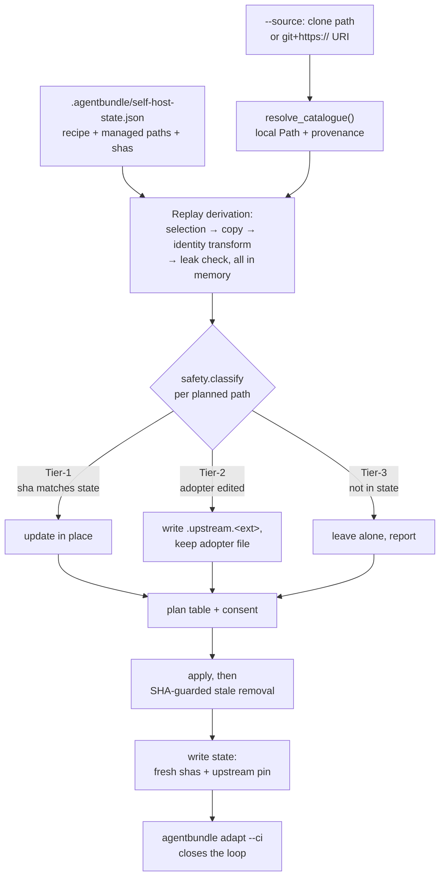

# Upstream sync for a derived catalogue

> **STATUS: PLANNED.** Nothing in this document is implemented. It records the
> designed architecture for `agentbundle catalogue sync` so the spec and plan
> that build it have one place to disagree with.
>
> Current-state context: [`derived-catalogue.md`](derived-catalogue.md) and
> [`state.md`](state.md).

## The problem

A derived catalogue is a living tree — copied from upstream, then edited by the
adopter. Upstream moves. Nothing brings the two together.

Re-running `catalogue init` is the only path that exists, and it destroys
adopter edits or refuses outright. `derived-catalogue.md` § What a re-run does
today names all five failures. This document designs one verb that replaces
them.

## Shape

`agentbundle catalogue sync` is four stages over existing components. It
introduces no new file-safety mechanism, no new fetch path, and no new plan
format.



### Stage 1 — resolve the source

Delegate to `resolve_catalogue()` verbatim. It already dispatches three forms,
and sync gains all three by delegating rather than by adding cases:

| Form | Integrity available | Pin recorded |
| --- | --- | --- |
| Local clone path | none beyond the filesystem | path only |
| `git+https://github.com/<owner>/<repo>[@<ref>]` | TLS only | resolved ref |
| `catalogue+https://…` descriptor | verified `sha256` | `archive_sha256` + `source_revision` |

The fidelity difference is real and the plan prints which one applies. A
force-pushed tag changes what a `git+https://` sync delivers with no digest to
compare against.

### Stage 2 — replay the derivation

State moves to schema 3, adding two groups to the fields in
[`state.md`](state.md):

```
recipe   packs, profiles, guides, attribution, tooling, identity fields
pin      source_uri, source_revision, archive_sha256, synced_at
```

The pin field names match `PackState`'s existing provenance trio deliberately —
one vocabulary for "which upstream is this", not two. Under
`--attribution white-label` the pin is recorded in opaque form — see
§ White-label pins carry no upstream identity.

The recipe is a **filter, not a floor**. A bare `sync` refreshes exactly the
selection the adopter made; it never adds a pack that appeared upstream later.
`--pack <new-name>` both syncs that pack and amends the recipe.

Stages 8 and 9 of `init_self_hosted` — identity transform, then in-memory leak
check — run unchanged over the replayed byte map. White-label safety is
therefore preserved by reuse, not by a parallel implementation.

### Stage 3 — classify, never overwrite

The unconditional write at `initialise_self_hosted.py:1059` is replaced by
`safety.classify(relpath, root, state)`:

| Tier | Condition | Action |
| --- | --- | --- |
| Tier-1 | on-disk `sha256` matches state, or file absent | update in place |
| Tier-2 | on-disk `sha256` differs — adopter edited it | `safety.write_companion` → `<name>.upstream.<ext>` |
| Tier-3 | path absent from state | leave untouched, report |

The `CONFLICT` abort at `:1051` becomes a Tier-3 row in the plan. Every write
goes through `safety.write_jailed`, so the path jail is not optional; source
reads keep using the confined helpers in `catalogue_tooling.file_safety`.

### Stage 4 — plan, consent, apply, pin

Reuse `upgrade`'s `_print_plan_table`, `_confirm_or_abort`, `--dry-run`, and
`--format json`. Apply order is fixed: packs, profiles, guides, then **packages
last**. Stale removal runs after writes land, keeping its `sha256` guard. State
is written last, with fresh hashes and the pin.

`--check` resolves the source, compares the pin, writes nothing, and exits
non-zero on a difference. `agentbundle adapt --ci` already exits non-zero while
any `.upstream.*` companion is unresolved, so the loop closes with no new
mechanism.

### Granularity

`--pack <name>` (repeatable), `--profile <name>`, `--guides`, and
`--package <name>` each restrict the run to that subtree. Absent all four, the
run covers the recorded recipe. `catalogue.toml`, `tests/conformance/`, and the
identity fields are derivation-wide and move only with a full sync.

## Compatibility is warn-only

Sync **never refuses on a version signal it introduces**. It reports three
advisory rows from metadata the repository already maintains:

| Signal | Source | Declared by |
| --- | --- | --- |
| Pack version moved | `[pack] version` | all 25 default-selected packs |
| Adapter-contract version moved | `[pack.adapter-contract] version` vs `SPEC_VERSION` | 24 of 28 packs |
| Declared dependency violated | `[pack.dependencies] required` / `conflicts` | 8 of 28 packs |

This is a deliberate decision against a maintained compatibility matrix.
Creating a signal strong enough to refuse safely means carrying versioned packs
in this repository, which is a cost the project has declined.

Two consequences are accepted openly:

- **The existing gate that looks like a backstop is inert.**
  `check_spec_version_gate` compares major components only
  (`commands/_common.py:252`). The CLI ships `SPEC_VERSION = 0.18`; the 24
  declaring packs spread across `0.7`–`0.13`. Every one has major `0`, so the
  gate has passed for all of them since it was written. Sync still invokes it,
  because the gate's uniform-refusal contract is repository-wide and warn-only
  governs only the signals sync adds. The first pack to declare major `1` will
  therefore be refused by sync, by design.
- **credbroker compatibility has no machine-readable signal at all.** The
  detection hook is the adopter's own `tests/conformance/`, which init already
  copies into the derived tree.

## Trust boundaries

Four, which makes this security-boundary work:

1. **Remote fetch into a local tree.** Handled by `https_catalogue` —
   origin-locked redirects, size caps, member caps, safe extraction, digest
   verification where the source form offers one.
2. **Writes into an adopter-owned tree.** Path jail via `safety.write_jailed`;
   confined reads raise `UnsafeContentError`.
3. **The white-label identity boundary.** In-memory transform plus leak check
   before any write. The state file sits outside that check, which is why the
   pin it carries must be opaque — see § White-label pins carry no upstream
   identity.
4. **Self-replacement.** In vendored mode, sync rewrites the `agentbundle`
   source that is executing it.

## Known risks

- **Companion flood.** A broadly-edited tree produces many `.upstream.*` files
  in one run, and `adapt --ci` blocks until each is resolved. The plan table
  shows the count before consent, and `--pack` lets an adopter take one pack at
  a time. Not eliminated.
- **A real break ships silently.** Accepted, per the warn-only decision above.
- **Self-replacement mid-run.** Packages apply last, after every other write has
  landed; a failed package write triggers `rollback`; and sync refuses a
  vendored package sync when the target supplies the running `agentbundle`,
  detectable through the editable-install check `source_defaults` already
  performs.
- **`git+https://` carries no content integrity.** Record whatever pin the
  source form affords and print which fidelity was obtained.
- **Schema-1 states cannot self-heal.** Their `sha256: None` entries support
  neither Tier classification nor the removal guard. Sync reports them as a
  named count with a recovery instruction rather than skipping silently.

## Rollout

Additive. `catalogue init`, `install`, `upgrade`, and `adapt` keep their
contracts unchanged; removing the new verb restores the status quo exactly.

0. **credbroker source follows its pack** — the prerequisite above. It changes
   `init`, not `sync`, and stands alone: it restores the drift gate in derived
   catalogues whether or not `sync` ever ships.
1. **State schema 3** — recipe and pin fields, written by `init`, read by
   `sync`. Schema-2 states stay readable; such a target syncs by supplying the
   recipe flags once, which then persist.
2. **`sync` with `--dry-run` and `--check` only** — resolve, replay, classify,
   and plan, with no write path.
3. **The apply path**, plus the scoping flags.
4. **Vendored package sync**, last, because it carries the self-replacement
   risk.

## Prerequisite: credbroker source follows its pack

Sync cannot manage what the derivation never copied, so this is a prerequisite
to phase 3 rather than a part of it.

`packages/credbroker/` is absent from a derived catalogue in both tooling modes,
which silently disables the `user-libs` build primitive — the pack copy is a
generated, drift-gated projection upstream and frozen, unverifiable content
downstream. [`derived-catalogue.md`](derived-catalogue.md) § Gap has the
mechanism.

**Decision:** copy `packages/credbroker/` to `packages/credbroker/` in the
target whenever the `credential-brokers` pack is selected, independent of
`--tooling`. That is the path `user_libs._package_source_dir` already resolves,
so projection and drift gate come back live with no code change, and an
external-tooling adopter gets the same guarantee as a vendored one.

This differs from agentbundle's vendored target
(`.agentbundle/tooling/agentbundle/`) on purpose: agentbundle is vendored as an
*install source* the adopter `pip install -e`s, while credbroker is a *build
input resolved by relative path*. Same principle, different mechanics.

Once the source is present, `packages/` becomes a sync-scopable subtree and
`--package credbroker` means what it says.

## White-label pins carry no upstream identity

The leak check scans only the planned byte map, and the state file is written
after it. So `.agentbundle/self-host-state.json` is never scanned — while
already recording `source_pack_identity` from the upstream catalogue's `name`,
the exact string white-label mode bans everywhere else. The adopter commits and
ships that file. This is a live defect, not a documented carve-out.

Adding `source_uri` would make it materially worse. A bare name is a string
someone might dismiss as coincidence; `git+https://github.com/<owner>/<repo>@<ref>`
is a working pointer that names owner, repository, and ref.

**Decision — under `--attribution white-label`, the pin is opaque:**

| Field | `attributed` | `white-label` |
| --- | --- | --- |
| `source_uri` | recorded | omitted |
| `source_revision` | recorded | recorded — a ref such as `v1.2.3` identifies nothing |
| `archive_sha256` | recorded | recorded — a digest identifies nothing |
| `source_pack_identity` | upstream name | the **derived** catalogue's name |

`--check` is unaffected: it compares digests, not URIs. The only loss is that a
bare `sync` cannot re-resolve its source under white-label, so the adopter
passes `--source` each run — which the command takes anyway.

The last row closes the existing defect rather than documenting it. Under
`attributed`, upstream identity stays permitted, consistent with the two
declared attribution surfaces.

## Alternatives rejected

- **Make `init` re-run safe, with no new verb.** A two-function change that
  removes the destructive behaviour immediately. Rejected because without a
  persisted recipe a bare re-run still rewrites the adopter's `catalogue.toml`,
  and without scoping flags there is no pack-by-pack sync.
- **Git-native: fork upstream and merge.** Rejected because the derived tree is
  not a fork. White-label rewrites identity anchors throughout, so upstream
  bytes never match derived bytes and every touched file conflicts — noise
  proportional to the transform, not to the change. The tree is also a filtered
  subset, and which filter produced it lives in the recipe, which git cannot
  see.
- **Upstream as a submodule, regenerate on update.** Rejected because
  regeneration is the current overwrite problem with extra ceremony: it assumes
  the derived tree is a pure function of upstream plus recipe, which stops being
  true the moment the adopter edits a skill.
