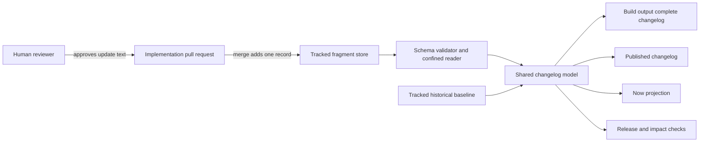
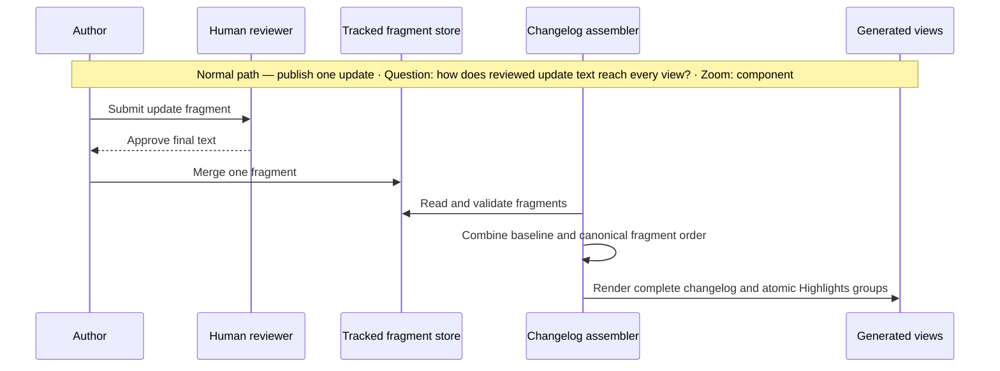
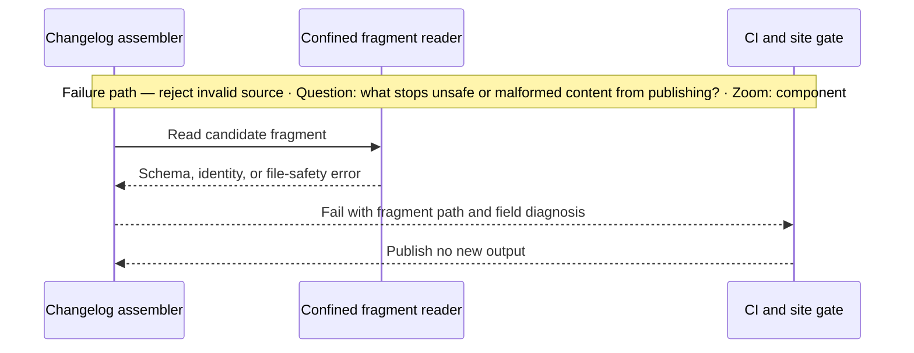

# Architecture Change — Per-update changelog sources

**Decision sought:** Adopt one human-reviewed fragment per product update as
the authoritative source for new changelog content, retain the current file as
frozen history, and render the complete changelog as a deterministic build
projection.
**Author(s):** Platform Core maintainers
**Status:** Draft
**Last updated:** 2026-09-23
**Reviewers:** Platform Core maintainers

**Baseline — current architecture:** [Repository architecture](../../ARCHITECTURE.md),
at the state that includes the bounded and indexed `/now/` surface — pagination,
an archive, a per-release permalink and an Atom feed — merged on 2026-09-23.
That surface turned the `/now/` anchor into a published URL segment and a feed
identity, which narrows what this delta may choose for it.

This document is a delta from the repository architecture. The whole design
stays inside this repository and its existing CI and site build.

## 1. Scope and Baseline

What is changing, and what baseline artifact does this delta assume?

| Delta item | In scope | Why it's changing |
| --- | --- | --- |
| New product changelog entries | Yes | Concurrent pull requests insert at the same top-of-file anchor in [`docs/product/changelog.md`](../product/changelog.md). A repository spike reproduced conflicts in 39 of 43 exposed rebases. |
| Per-update Highlights | Yes | Each implementation update owns its final, reviewed Highlights. Assembly preserves each one as an atomic update record. |
| Complete product changelog | Yes | The current path remains tracked history, while a combined current view becomes generated output rather than a shared authoring surface. |
| Full changelog and `/now/` inputs | Yes | One parsed model feeds the complete changelog and the five `/now/` surfaces — index, paginated pages, archive, per-release permalink and Atom feed — so content, ordering and identity cannot drift between them. |
| Existing changelog history | Migration only | Historical release sections remain at the current tracked path and are not split. |
| Package-local changelogs | No | Their ownership and release flows are separate from the product changelog. |
| Merge queue policy and CI trigger coverage | No | This change removes a common content conflict but does not enable or configure a merge queue. |
| Cross-repository or hosted infrastructure | No | No service, database, queue, bot writer, external store, or runtime model endpoint is added. |

| Unchanged context | Link |
| --- | --- |
| Repository systems, ownership, allowed edges, and publication flow | [Repository architecture](../../ARCHITECTURE.md) |
| Documentation area and generated-site boundary | [Architecture overview](overview.md) |
| `/now/` purpose and editorial authority | [`/now/` surface specification](../specs/site-now-surface/spec.md) — released highlights only, no in-progress work. That spec predates the permalink, pagination, archive and feed, which shipped without a durable spec, so the routes under `web/src/pages/now/` are the only description of those. |

The change is limited to the high-contention product changelog path and its
direct consumers. The [fragmentation spike](../product/research/changelog-fragmentation-spike.md)
shows that independent paths remove the observed same-anchor conflict, while
the [generator-quality spike](../product/research/changelog-generator-quality-spike.md)
shows that reconstructing entries from commits loses reviewed intent.

The architecture changes the unit of authorship, not the source of editorial
judgment. An LLM may help an author draft one update inside its implementation
pull request, but a human reviewer remains the authority and no model takes
part in validation, assembly, release, or publication.

## 2. Structural Change

Which elements and relationships are added, removed, or modified from the
baseline, and which are simply linked because they don't change?

| Element or relationship | Change type | Responsibility | Baseline reference |
| --- | --- | --- | --- |
| Fragment store at `docs/product/changelog.d/<id>.md` | Added | Own each reviewed update as an independent tracked record | New |
| Historical baseline at `docs/product/changelog.md` | Modified | Preserve historical release sections and existing GitHub links at the current tracked path | The current [product changelog](../product/changelog.md) becomes read-only after a migration notice is added |
| Fragment schema and confined reader | Added | Admit only safe, well-formed records into the model | New |
| Shared changelog model and deterministic assembler | Added | Own identity, ordering, diagnostics, and rendering | New |
| Complete changelog projection at `build/product-changelog.md` | Added | Provide a regenerable local view without entering the Git merge surface | Existing ignored build-output boundary |
| Git index relationship | Modified | Keep the historical path tracked, add only fragments for updates, and keep combined outputs outside the index | No `merge=regen` rule is added for the changelog |
| Site changelog and `/now/` source relationship | Modified | Render both views from the same model, at an unchanged payload shape the five `/now/` consumers already guard | [Documentation/site publishing](../../ARCHITECTURE.md#systems) |
| Core release and release-impact checks | Modified | Validate changed fragments against release metadata | [Repository validation flow](../../ARCHITECTURE.md#major-flows) |

This diagram answers which repository component owns each step from update
authorship to publication. Its zoom level is the documentation subsystem.

Each fragment is an independently mergeable, reviewable source record. Its
path is `docs/product/changelog.d/<id>.md`, where `<id>` is the lowercase UUIDv4
created by `python3 tools/changelog.py new`; validation requires the filename
stem and envelope `id` to match.

The fragment contains metadata plus that update's section bodies, including
its own Highlights. The assembler never combines, summarizes, or rewords
Highlights across fragments.

Pull-request-authored fragments are untrusted build input until the confined
reader and schema validator accept them. This adds a repository file boundary,
not a network or data-residency boundary.

The tracked `docs/product/changelog.md` remains the durable compatibility
surface for historical repository links. Its migration notice points to the
public `/changelog/` view and to
`python3 tools/changelog.py render --output build/product-changelog.md` for a
complete local view.

No build treats either complete projection as input. The site builder renders
the public changelog from the model, preserving the rule that generated output
is not an authoring dependency.

## 3. Runtime Change

How do runtime paths differ from the baseline, including any temporary
dual-run or migration behavior?

| Journey or scenario | Change type | Baseline reference |
| --- | --- | --- |
| Author a product update | Modified | One pull request adds one tracked fragment and does not edit the aggregate |
| Review an update | Modified | The reviewer approves that fragment's final Highlights and detailed sections in the implementation pull request |
| Validate a release | Modified | Release checks match a changed fragment to release metadata instead of inspecting the aggregate's top entry |
| Build documentation | Modified | The build reads the baseline and fragments once, then renders the site changelog and `/now/` from one model |
| Inspect a complete local changelog | Modified | A maintainer renders `build/product-changelog.md`; the historical file's migration notice points to that command and the public `/changelog/` view |
| Handle invalid or colliding input | New | Validation fails before any view is published |
| Transition an old in-flight branch | New | A gate rejects an attempted aggregate edit and directs the author to extract its new entry into a fragment |

The common path has no service call, model call, clock read, Git-history lookup,
or write to another repository. File enumeration order is irrelevant because
the assembler applies a canonical sort before constructing any view.

There is no steady-state dual write. At cutover, fragments become the only
source for new entries; the historical file is frozen and every complete-view
consumer switches to the model in the same change.

## 4. Contract and Invariant Change

Which contracts or invariants are introduced, changed, or retired by this
change, and how does that affect every existing party?

| Semantic name | Change type | Baseline reference | Compatibility during transition | Enforcement | Verification |
| --- | --- | --- | --- | --- | --- |
| Fragment identity and path | New | New | A lowercase UUIDv4 is present in both `changelog.d/<id>.md` and the envelope `id` | `new` command creates the ID; validator rejects mismatches and duplicates | Creation, mismatch, duplicate, and case fixtures |
| Fragment envelope | New | New | The file starts with `+++`, contains TOML fields `schema`, `id`, `anchor`, `date`, and one or more `packages` records with `name` and `version`, then closes front matter with a second `+++` line | Standard-library TOML parser plus explicit field and type validation | Valid, delimiter, missing-field, unknown-field, malformed, and version fixtures |
| Fragment body | New | New | The body accepts established changelog section names; each fragment has a non-empty `Highlights` section | Parser rejects unknown or duplicate sections and release-level headings | Round-trip fixtures and exact-body assertions |
| Atomic Highlights | New | [`/now/` content contract](../specs/site-now-surface/spec.md), as the five payload consumers implement it | Each fragment's Highlights remains a distinct update group in `/now/`, and therefore one permalink page and one feed entry | Shared model exposes Highlights by fragment identity | Every source Highlights item appears exactly once and byte-for-byte in `/now/` data |
| Canonical identity and order | New | New | `id` is globally unique; output order is `date` descending then `id` ascending, and same-date order carries no editorial meaning | Duplicate checks and canonical sort | Shuffled-input and duplicate-identity tests |
| Stable links | New | Current generated heading slugs, now also the `/now/<anchor>/` URL segment and the Atom `<id>` | Historical anchors are unchanged. A new update's anchor is the package-and-date slug the existing slugger produces, a hyphen, and the fragment's own UUID as 32 lowercase hexadecimal digits — readable at its head, and unique on the same basis as the fragment's own path, which ADR-0123 D2 already rests on | `new` composes and writes `anchor`; the validator recomputes it from `packages`, `date` and `id` and rejects a mismatch, a duplicate, or an edit; the renderer emits `<a id="<anchor>"></a>` immediately before the update heading | Rendered-DOM and local-Markdown tests over repeated package, version and date labels, plus a fixture where two fragments share a slug and receive distinct anchors |
| Published identity permanence | New | `/now/<anchor>/` and the Atom `<id>` the feed emits | A merged fragment's `packages`, `date` and `id` are immutable, so its anchor is too; a page URL and a syndication identity cannot move once published | Validator recomputes the anchor from those three fields, and a merge-base comparison rejects an edit to any of them in an already-merged fragment | A fixture editing each of the three fields in a merged fragment and requiring refusal |
| Projection schema version | Unchanged | `now-highlights.generated.json` at `schemaVersion` 1 | Fragment-backed groups carry the same fields as history-backed ones, so the version does not move | Five importers each throw on a version other than 1, and `NowHighlights.astro` owns the group type they share | An assembled payload validates against the existing consumer guards without editing them |
| Immutable historical baseline | Narrowed | [Current product changelog](../product/changelog.md) | Existing release sections and anchor-producing headings stay at the same tracked path | Migration notice plus a gate rejecting later release-section edits | Historical-section digest and full-corpus parse test |
| Generated complete view | New | [Current product changelog](../product/changelog.md) | Complete local and public views contain frozen history plus every fragment | Existing ignored `build/` boundary, source-only gate, and generator ownership check | Clean-index regeneration and end-to-end render test |
| Deterministic assembly | New | [Generated publication flow](../../ARCHITECTURE.md#major-flows) | Each consumer produces byte-identical output across runs from the same baseline and fragment set | No volatile fields and canonical sort | Repeated and shuffled builds are byte-identical |
| Human editorial authority | Narrowed | [`/now/` authoring boundary](../specs/site-now-surface/spec.md), unchanged by the surfaces added since | Drafting assistance remains optional inside a pull request; only reviewed fragment text enters the model | Normal code review and required Highlights validation | Offline build and dependency check prove no model or network dependency |

The anchor carries UUID material so that it is unique without a lookup. A slug
drawn from packages and date alone is readable but not free: two authors on
separate branches can compose the same slug, and neither `new` invocation can
see the other's fragment. Resolving that collision after both merge would move
one published URL and one Atom `<id>`, and refusing the second merge would
reinstate the cross-branch contention this whole design removes. Appending the
fragment's whole UUID gives the anchor the uniqueness the fragment path already
has, on the same basis and with the same standing. The cost is a
long tail on the URL, paid so the uniqueness claim holds without a qualifier. A
historical anchor ends in a date and can never take this shape, so the two
generations cannot collide either.

Fragment identity and published anchor stay two different things. The UUID in
the filename and the envelope `id` is the fragment's identity, and ADR-0123 D2
owns it. The `anchor` is what the published surfaces address: it carries
that identity whole for uniqueness, and leads with the slug so a reader sees
the package, version and date first.

The payload's `schemaVersion` stays at 1. Five importers throw on any other
value, and a fragment-backed group carries the same fields as a history-backed
one, so a bump would fail five builds and buy nothing.

The envelope uses TOML because the repository's supported Python versions
include the standard-library `tomllib`, so the change adds no parser
dependency. The body keeps familiar Markdown while the parser owns
release-level structure and the renderer owns output headings and separators.

A tracked `merge=regen` aggregate is not the merge-queue contract. This
repository's driver deliberately keeps one stale side and requires local
regeneration plus commit amendment; the [Git contract](https://git-scm.com/docs/gitattributes#_defining_a_custom_merge_driver)
also places custom-driver commands in clone-local configuration, while a
[GitHub merge queue](https://docs.github.com/en/enterprise-cloud@latest/repositories/configuring-branches-and-merges-in-your-repository/configuring-pull-request-merges/managing-a-merge-queue)
tests GitHub-created temporary branches and removes entries that conflict.

The complete aggregate is therefore written only to the existing ignored
`build/` boundary and site-build output. The tracked historical file never
changes after cutover, so no generated aggregate enters the queue's merge
surface and no bot commit or protected-branch bypass is needed.

## 5. Data/State Migration

How does existing data or state move from its old shape to its new shape, and
what happens if migration fails partway through?

| Data element | Old shape | New shape | Migration mechanism | Rollback |
| --- | --- | --- | --- | --- |
| Historical product changelog | One authored `changelog.md` | The same tracked path as read-only history | Add a migration notice without changing release sections or heading text, then record their digest | Remove the notice only after fragment entries are materialized and parity passes |
| New product updates | Sections prepended to the shared file | One tracked `changelog.d/<id>.md` per update | Cutover gate requires fragments for release-impacting changes | Keep fragment reads active until every post-cutover entry exists in the rollback aggregate |
| Complete changelog | Tracked authored file | Deterministic `build/product-changelog.md` plus site output | Freeze the historical source and render complete views from history plus fragments | Switch consumers only in the commit that restores a parity-checked aggregate as source |
| `/now/` build input | Highlights parsed from the aggregate | Atomic Highlights grouped by fragment | Compare current-corpus output before cutover | Retain fragment projection until the rollback aggregate produces identical `/now/` data |

History stays opaque because the survey found duplicate `(package, version)`
pairs and ordering that cannot be reconstructed from dates and fields. The
first generated aggregate must preserve every pre-cutover release section and
anchor before any new fragment is admitted.

Rollback is ordered and atomic: keep all fragment readers active, render every
post-cutover fragment into a candidate aggregate, prove full changelog and
`/now/` parity, then commit the source and consumer switch together. A partial
rollback therefore leaves the fragment path serving all published entries.

## 6. Deployment/Operational Change

What changes in how this is deployed, operated, or observed, relative to the
baseline?

| Deployment unit | Change type | Baseline reference |
| --- | --- | --- |
| Repository validation | Modified | [Source change to validation flow](../../ARCHITECTURE.md#major-flows) adds fragment schema, source-only, and deterministic-render checks |
| Documentation site build | Modified | [Documentation/site publishing](../../ARCHITECTURE.md#systems) consumes the shared model and emits both public views |
| Release tooling | Modified | [`check-core-release.py`](../../tools/check-core-release.py) and release-impact detection recognize fragments |
| Local Git worktree | Modified | The complete aggregate is regenerated under existing ignored `build/`; no custom driver is required for it |
| Runtime infrastructure | Unchanged | No service, database, queue, scheduled writer, model endpoint, or cross-repository process is added |

Validation, release checks, and site rendering each scan fragments linearly
and remain inside their existing CI or site-build job. Operators watch those
job results; there is no runtime process, capacity pool, or on-call signal.

Each diagnostic names the fragment path, invalid field or invariant, and
expected correction. Successful builds report fragment, release, and
Highlights counts for parity checks.

The assembler performs one bounded scan of regular files under the fragment
directory. It rejects links and non-regular files through the repository's
confined file helpers, and it never executes fragment content.

## 7. Quality Regression and Verification

Which quality attributes could regress because of this change, and how do we
verify they didn't?

| Attribute at risk | Baseline target | Stimulus that could regress it | Verification |
| --- | --- | --- | --- |
| Mergeability | Concurrent updates share one path today | Two queued changes add updates at once | Create a synthetic merge-group commit from representative branches and require no changelog-path conflict when fragment IDs differ |
| Content integrity | Reviewed changelog content is the publication source | Parsing or projection drops, duplicates, or rewrites an update | Assert every fragment and Highlights item appears exactly once and that Highlights bytes are unchanged |
| Historical compatibility | Existing changelog and `/now/` output parse successfully | New parsing changes history, order, or links | Require identical historical release sections, model payloads, and anchors at the original tracked path and in generated views |
| Determinism | Site projections are clock-free and generated at build time | Filesystem order or volatile metadata changes output | Build from at least five shuffled enumerations and require byte-identical outputs |
| Git cleanliness | Authored source is reviewable in ordinary diffs | A generator accidentally stages or depends on the aggregate | Regenerate from a clean checkout and require no tracked diff; verify outputs stay under ignored build boundaries |
| Build performance | Existing `make site-build` duration at an equal release count | Many small files increase scan and parse cost | Time three arms, interleaved, each discarding one warm-up: today's corpus, a monolith carrying ten times the released entries, and the same corpus as fragments. The two large arms are generated from one canonical set of records and differ only in physical layout — identical entries, bytes, Highlights, dates and package fan-out — so their difference cannot be content. The fragment arm's median minus the monolith arm's, over the monolith arm's, must stay under 10%. The monolith-versus-today difference is recorded separately as release-growth cost this design does not own |
| Published page count | 216 pages at 157 release groups | `/now/[release].astro` emits one page per release group, so page count tracks release count however entries are stored | Record page count per arm beside each duration, and require the fragment arm and the monolith arm at equal release count to emit the same number of pages |
| Failure diagnosability | Existing gates identify a failing source | Fragment validation adds failure modes | Fixture-test every diagnostic class and require a source path plus actionable field or invariant |
| Dependency and privacy posture | Publication has no model or network dependency and contains public release text | Automated synthesis or remote validation enters the path | Static dependency check plus an offline end-to-end build |

These checks focus on source multiplicity, assembly order, migration
compatibility, and accidental editorial transformation. The same-content
assertions make the per-update Highlights rule executable.

The Git cleanliness check is also a merge-queue gate: only tracked fragment
sources enter a merge group. CI regenerates outputs for verification and
publication, but it never needs to amend the temporary branch.

## 8. Build Mapping

Where does each changed element map to in source, build, and deployment, and
how does that differ from the baseline mapping?

| Semantic element | Change type | Source owner | Build unit | Deployable | Verification |
| --- | --- | --- | --- | --- | --- |
| Fragment store | New | `docs/product/changelog.d/<id>.md` | Authored Markdown and TOML-front-matter records | Repository source | Contract fixtures and changed-path merge replay |
| Historical baseline | Modified | `docs/product/changelog.md` | Read-only source input and historical compatibility surface | Repository source | Historical-section digest, inbound-link, and full-corpus tests |
| Complete local changelog | New | `build/product-changelog.md` | Output of `tools/changelog.py render` | Local build output | Ignored-output, clean-index, and content-equivalence tests |
| Git index boundary | Modified | Existing `build/` ignore rule and changelog source gate | Source ownership rule | Repository source | `git check-ignore build/product-changelog.md` and tracked-source assertions |
| Shared changelog model and assembler | New | `tools/changelog.py` | Python tooling module | Validation and site-build jobs | Parser, ordering, identity, golden-output, and offline tests |
| Site changelog adapter | Modified | `tools/build-site.py` | Documentation builder | Documentation site | Existing routing tests plus assembled-changelog golden test |
| `/now/` adapter | Modified | `tools/build-site.py` and the five payload consumers — `web/src/pages/now/index.astro`, `page/[page].astro`, `archive/index.astro`, `[release].astro`, `feed.xml.ts` — and `web/src/components/now/NowHighlights.astro`, where the anchor becomes the date index key, the DOM id, the permalink href and the changelog link | Documentation builder and web pages | Documentation site | Exact per-fragment Highlights correspondence test, plus the existing assertion that every `/now/` anchor resolves to an element of that id in the emitted changelog |
| Core release validator | Modified | `tools/check-core-release.py` | Release validation tool | Repository validation job | Fragment-to-release match tests |
| Release-impact detector | Modified | `tools/repo/check_release_impact.py` | Repository validation tool | Repository validation job | Added and changed fragment path tests |
| Documentation workflow filters | Modified | `.github/workflows/pages.yml` | GitHub Actions workflow | Documentation build job | Path-trigger test for `docs/product/changelog.d/**` and the baseline |
| Author guidance | Modified | `docs/product/AGENTS.md`, `packs/AGENTS.local.md`, baseline header, and fragment template | Repository guidance | Repository source | Guidance search, documentation review, and lint |

One shared Python owner prevents fragment logic from diverging across
consumers. Source records remain authoritative, and every combined view is
rebuildable without becoming an authoring dependency.

No new package, service, or top-level directory is introduced. The fragment
contract, assembler, consumers, and cutover gate share one failure boundary
and ship together to avoid split authority.
