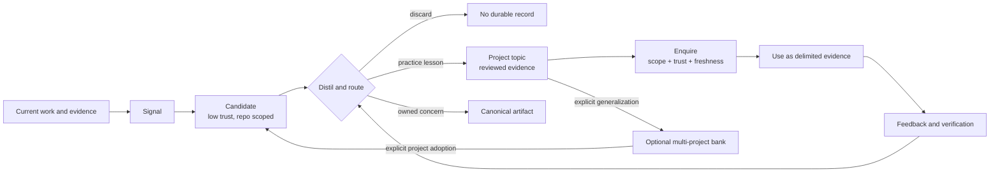
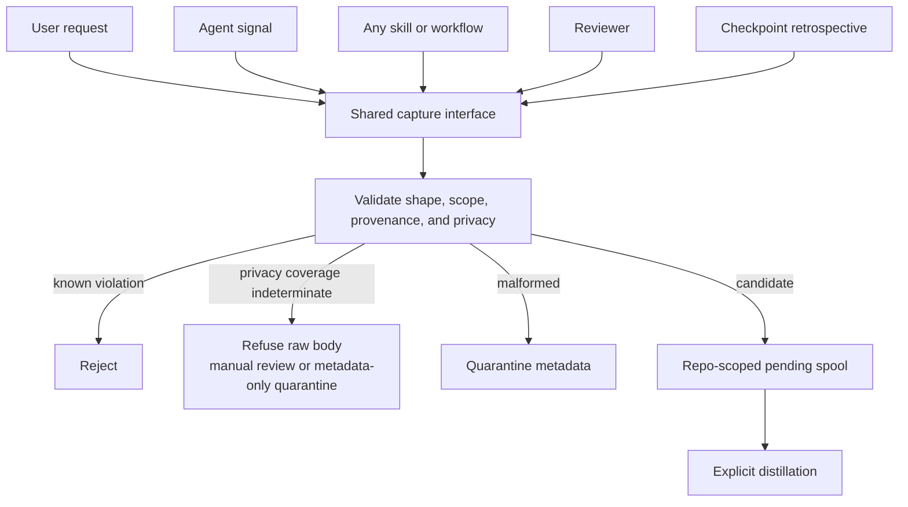
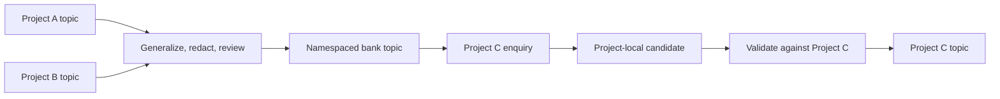

# Knowledge capture architecture

> How the `core` pack turns repository experience into durable, reviewable
> knowledge without turning remembered prose into instructions. Current
> behavior and recommended evolution are labelled separately; the target model
> requires an RFC and implementing spec before it is shipped.

## Why repository memory exists

A software agent repeatedly pays for knowledge that the repository already
earned. It rediscovers an unusual test command, repeats a failed migration
approach, misses a coupling that is obvious only after a bug, or loses a user
constraint when the context window closes. Repository memory should make the
next run start from those lessons instead of from the same mistakes.

Retaining more text is not the goal. Transcripts mix durable facts with
temporary plans, guesses, secrets, tool output, and instructions embedded in
untrusted sources. Loading all of that later increases context cost and gives
one influenced session a path into future behavior. The architecture therefore
treats memory as a governed lifecycle:

1. notice a potentially useful learning;
2. hold it as a low-trust candidate;
3. verify, reconcile, and distil it into a narrow topic;
4. retrieve only task-relevant topics as evidence;
5. verify consequential claims before use; and
6. refresh, promote, or retire knowledge as the repository changes.

The current implementation covers only part of that lifecycle. `work-loop`
curates observations into one JSONL file, maintainers edit that file manually,
and normal session start does not load it. The recommended architecture keeps
those safety properties while adding shared capture, topic-oriented
distillation, explicit enquiry, source-relative freshness, and an optional
multi-project promotion layer.

## Key concepts

The rest of the design depends on these distinctions.

| Concept | Meaning | What it is not |
| --- | --- | --- |
| Working context | Messages, tool results, and state needed for the current run | Durable knowledge |
| Candidate | A repo-scoped signal that may contain a reusable learning but has not passed promotion | Trusted memory |
| Occurrence | One independently attributable observation supporting or challenging a topic | The current truth by itself |
| Topic | One narrow, independently verifiable lesson with stable identity, current synthesis, scope, status, and occurrences | A broad category or raw event |
| Distil | Reconcile candidates, occurrences, existing topics, and owning sources; then discard, update, split, promote, or retire | Summarize a transcript |
| Enquire | Request a bounded evidence bundle for a task, after hard scope, trust, lifecycle, and freshness filters | Prime every session with all memory |
| Freshness | Evidence that a topic still matches its owning source and applicable scope | Mere recency |
| Canonical source | The artifact authorized to define a concern: code, test, ADR, convention, skill, architecture page, or spec | A knowledge observation |
| Project memory | Knowledge validated for one repository or project namespace | A universally reusable fact |
| Memory bank | Optional store of explicitly promoted, generalized knowledge from multiple projects | An implicit global pool of every project's observations |

Two rules follow. First, an observation can be useful without being
authoritative. Second, memory types with different authority and lifetime must
not share an undifferentiated load path.

## Conceptual model

The lifecycle has an authority gradient. Capture broadens coverage at low
trust; each later stage narrows, verifies, and routes the material. Retrieval
never moves knowledge upward into instruction authority.



The layers beneath that lifecycle are:

1. authority and project boundaries;
2. capture and candidate continuity;
3. distillation and topic lifecycle;
4. canonical files and replaceable indexes;
5. enquiry and safe use; and
6. optional cross-project promotion.

Each layer is useful without the one above it. A small repository can stop at
reviewed topic files. A large repository can add a local search index. An
organization can add a memory bank without changing the authority of each
project's canonical artifacts.

## Current and target topology

| Capability | Shipped in this checkout | Recommended target |
| --- | --- | --- |
| Capture | `work-loop` closeout and manual writer invocation | Shared candidate interface available to any agent, skill, reviewer, or user request |
| Checkpoint coverage | Review scratch notes inside `work-loop` | Session and pre-compaction checkpoints persist already-signalled candidates and offer a bounded retrospective |
| Distillation | Manual curation under `docs/knowledge/README.md` | Topic reconciliation with duplicate, contradiction, promotion, freshness, and retirement semantics |
| Dedicated distillation skill | Draft RFC only; no shipped skill files | Evolve RFC-0077 around candidates and topics rather than only flat-file cleanup |
| Canonical storage | `docs/knowledge/patterns.jsonl` | One JSON file per narrow topic; JSONL remains compatibility and interchange form |
| Index | The flat corpus effectively serves as both content and lookup surface | Deterministic topic index plus optional gitignored local search accelerator |
| Retrieval | Explicit `--show-knowledge` rendering for curation | Task-scoped `enquire-knowledge` capability returning provenance-bearing evidence |
| Automatic loading | Deliberately absent | Remains absent |
| Scope | One repository | Project-scoped topics plus optional explicitly promoted multi-project bank |

## Layer 1 — authority and project boundaries

Repository knowledge sits below governed instructions and canonical artifacts.
It records what practitioners observed; it does not decide policy, grant
permissions, or replace the artifact that owns a claim.

| Layer | Typical lifetime | Authority |
| --- | --- | --- |
| Conversation and tool output | Current context window | Untrusted data |
| Workflow checkpoints and candidates | Current task through bounded retention | Continuity state only |
| Project topics | Cross-session, living | Reviewed evidence |
| Cross-project promoted topics | Cross-project, living | General guidance pending project-local validation |
| Architecture, ADRs, conventions, skills, tests, and code | Governed by their own lifecycle | Canonical for their declared concern |
| System, developer, user, and runtime permission controls | Current execution | Instruction and authorization authority |

The routing gate prevents the memory corpus from becoming a shadow copy of the
repository:

| Learning shape | Destination |
| --- | --- |
| Current structure or subsystem behavior | `docs/architecture/` |
| Decision and rationale | `docs/adr/` |
| Proposed change | `docs/rfc/` or a feature spec |
| Repository convention | `AGENTS.md` or `docs/CONVENTIONS.md` |
| Repeating agent procedure | A skill |
| Mechanically enforceable invariant | A test or lint rule |
| Reusable practice lesson not owned above | Project knowledge topic |

The repository root is the default tenancy boundary. A candidate from one
repository is never discovered by another. A user-scope installation does not
imply user-global memory, and shared storage never relaxes per-project
permissions.

## Layer 2 — capture and candidate continuity

### Current capture

The shipped capture gate lives in `work-loop`. Review findings that reveal a
non-obvious, approach-changing trap may become scratch notes. At closeout the
agent asks what would have made the work materially better across the quality
attributes below, keeps only lessons that generalize beyond the change, routes
canonical concerns elsewhere, and appends practice residue through
`append-knowledge.py`.

This is agent curation rather than transcript recording, which is the right
editorial model. Its weakness is coverage. A design session, user correction,
research task, bug diagnosis outside `work-loop`, review-only pass, or ordinary
repository exploration does not naturally reach the gate.

The broadened closeout question now shipped in `work-loop` is:

> What would have made this work materially better?

“Better” includes:

- more correct or complete;
- more reliable or recoverable;
- more secure or privacy-preserving;
- more deterministic or reproducible;
- easier to operate, observe, or diagnose;
- easier to maintain, review, or change safely;
- more efficient in time, compute, tokens, or cost; and
- less dependent on hidden context or individual memory.

A learning is capture-worthy when knowing it would materially change a future
approach along one or more of those attributes.

### Shared capture target

Capture becomes a `core` capability rather than a `work-loop` epilogue. Its
typed entry points are:

- an explicit user request to capture a project learning;
- an agent signal when a root cause, correction, decision, constraint, or
  approach-changing discovery becomes clear;
- any skill or workflow closeout;
- a reviewer finding that exposes a reusable trap; and
- a session stop or pre-compaction checkpoint.

There are two complementary capture timings:

1. **In-path signal.** The agent emits a small structured candidate while the
   evidence is fresh. This is precise but can be forgotten during busy work.
2. **Checkpoint retrospective.** The harness asks the agent to inspect bounded,
   agent-authored outcomes and referenced evidence for missed learnings. This
   improves coverage without granting the harness semantic authority.

Both paths create candidates. Neither can promote knowledge automatically.
Checkpoint handling may persist already-signalled candidates, surface their
count, and invite the retrospective. It must not mine every message or tool
result, inject candidate bodies into a later session, or turn session closure
into approval.



### Candidate quality gate

The same questions apply regardless of entry point:

1. Is this a durable project learning rather than task state, transcript
   residue, a one-off event, personal information, or a secret?
2. Would it materially improve a future approach?
3. Is its source specific enough for a reviewer to verify?
4. Does another canonical surface own it?
5. Does it duplicate or update an existing topic, and does it add independent
   evidence?
6. Can it be phrased as an observation without carrying source instructions
   forward?

The external comparison supplied for this design gets the central judgment
right: the agent should decide what is worth remembering and save a structured
record. The core pack should also adopt evolving-topic identity, duplicate
handling, and lifecycle state. It should place them behind a candidate boundary
rather than letting a save become trusted or automatically loaded memory.

### Candidate spool

Pending candidates use a repo-scoped, gitignored spool such as
`.agentbundle/knowledge-candidates/`. Prefer one file per candidate or capture
event; another hot append-only file would recreate the concurrency problem
before distillation.

The spool is workflow continuity state, not a second knowledge base. It may be
deleted without losing accepted topics, is excluded from ordinary enquiry, and
expires unpromoted content after a bounded adopter-configurable period.

A future implementation must:

- resolve and revalidate repository confinement at the write, rejecting
  symlinks, junctions, or paths that escape the boundary;
- bind candidate identity to repository identity and declared scope;
- record origin, producer, task/session reference, source reference and digest
  when available, created time, status, and later promotion decision;
- run configured secret, personal-information, and repository-policy scanners
  before persistence; known hits, unavailable scanners, or indeterminate
  privacy coverage fail closed before raw-body persistence, allowing only
  refusal, in-memory/manual review, or metadata-only or safely redacted
  quarantine;
- cap record size, count, and total spool bytes;
- use shared locking or conflict-safe per-candidate creation and atomic writes;
- quarantine malformed or unknown states; and
- copy recovery-critical provenance into the promoted topic occurrence because
  the local spool will expire.

## Layer 3 — distillation and topic lifecycle

Capture optimizes coverage. Distillation protects precision.

### Current curation

`docs/knowledge/README.md` defines a living corpus: maintainers may edit a
lesson as it changes and remove it when the underlying code disappears or the
lesson moves to a canonical artifact. Git supplies review and history.

RFC-0077 proposes a dedicated `distill-knowledge` skill, but it remains Draft
and no such skill is shipped in this checkout. The RFC assumes a flat JSONL
corpus and treats capture as exclusively owned by `work-loop`; implementation
should update those premises rather than preserve them accidentally.

### Topic as the durable unit

The durable unit should be a topic, not an individual save. A topic represents
one independently verifiable claim such as
`auth/refresh-rotation-atomicity`, not a broad bucket such as `auth`.

Each topic holds:

- stable `topic_key` and human-readable title;
- one current synthesis stated as an observation;
- applicable repository scope;
- lifecycle and verification metadata;
- links to canonical owning sources when any exist; and
- occurrences with independent candidate identity, provenance, time, and
  evidence digest.

A one-off lesson creates a topic with one occurrence. An exact duplicate adds
duplicate metadata only when it contributes no new evidence. A recurrence from
an independent source attaches another occurrence. New evidence may revise the
current synthesis without erasing why it changed.

Do not add a mutable `revision_count` solely to imitate database revisions.
Git already records every accepted topic version and reviewer-visible diff.
Domain metadata should describe evidence recurrence and verification, not
duplicate the storage layer's history counter.

### Distillation decisions

For every candidate or review trigger, distillation chooses one explicit
outcome:

| Decision | Result |
| --- | --- |
| Discard | No durable knowledge; decision may remain in short-lived candidate audit metadata |
| Attach occurrence | Existing synthesis remains current; independent evidence is preserved |
| Revise synthesis | Topic changes under review; old state remains in Git history |
| Mark contradiction | Topic becomes `needs_review`; ordinary enquiry suppresses it |
| Split | Over-broad topic becomes independently verifiable topics |
| Promote | Lesson becomes or changes a canonical artifact; topic links to the destination or retires |
| Retire | Topic leaves ordinary enquiry while its history remains recoverable |

### Lifecycle and freshness

The minimal topic lifecycle is:

- `active` — reviewed and eligible for ordinary enquiry;
- `needs_review` — conflicting, unverifiable, or freshness evidence is
  insufficient; excluded from ordinary enquiry; and
- `retired` — no longer applicable or promoted elsewhere; retained only for
  history and diagnostics.

Unknown states fail closed. New durable topics become `active` only through the
same review boundary that accepts repository changes.

Freshness is source-relative. `last_verified` by itself is not enough. A topic
needs review when:

- an owning source or referenced evidence digest changes;
- a change touches its applicable scope and conflicts with its claim;
- a risk-based verification deadline expires;
- enquiry reports contradictory current evidence;
- a canonical artifact supersedes it; or
- repeated use shows that the topic no longer predicts successful behavior.

Age can prioritize review, especially for unverified or low-trust topics, but
must not retire stable repository knowledge mechanically. An old constraint
can remain true for years; a new one can be invalidated minutes later.

## Layer 4 — canonical files and replaceable indexes

### Current JSONL write path

The current writer validates and appends one record through a guarded
read-modify-write sequence:


It establishes the Git root, refuses a `--file` target outside the resolved
`docs/knowledge/` directory, validates field length and characters, locks
across ID allocation and replacement, refuses an already-invalid corpus,
writes raw UTF-8 to a same-directory temporary file, lints the complete
postimage, and replaces only after validation.

Those controls cover malformed records, local append races, partial writes,
and final-target escape. They do not fully reject a redirected
`docs/knowledge/` parent, close every path-check-to-write race, or coordinate
branches and machines. Git remains the cross-branch concurrency boundary.

### Known JSONL tradeoffs

JSONL is a good bootstrap and interchange format. It is UTF-8, line-oriented,
stdlib-friendly, stream-readable, inspectable in ordinary tools, reviewable in
Git, and independent of a service or runtime dependency.

A single hot JSONL file knowingly accepts:

| Tradeoff | Consequence |
| --- | --- |
| Linear scans | Lookup, duplicate detection, lifecycle filtering, and ranking are `O(n)` without a derived index. |
| No native topic upsert | Evolving subjects require custom identity, reconciliation, and replacement semantics. |
| Whole-file replacement | One logical append or edit rewrites the canonical file. |
| Shared-file merge pressure | Independent branches append at the same tail or edit nearby lines. |
| Single-file atomicity | A second committed index cannot be updated transactionally with the corpus. |
| Custom lifecycle and migrations | Supersession, verification, retirement, and schema compatibility are tooling responsibilities. |
| Basic retrieval | Stemming, ranked lexical search, semantic similarity, relationships, and temporal queries are absent. |
| Repository-wide visibility | Authorization is inherited from repository access; there is no per-record security boundary. |

There is no universal record-count threshold. A branch-heavy small repository
may hit conflicts first; a large serialized monorepo may hit search latency;
a regulated repository may need stronger lifecycle and provenance at low
volume.

### Recommendation: leave the single hot file; keep canonical storage file-based

Move the canonical model to one pretty-printed JSON file per topic after the
topic schema, distiller, enquiry consumer, and migration gate can land
together. Do not move directly to a committed SQLite database.

```text
docs/knowledge/
├── README.md
├── topics/
│   ├── auth/
│   │   └── refresh-rotation-atomicity.json
│   └── testing/
│       └── integration-tests-use-real-storage.json
└── topics.index.json
```

The topic index contains routing metadata only: topic key, title, scopes,
lifecycle status, canonical path, freshness summary, and optional search terms.
It does not duplicate observation bodies or occurrence text. Updating a topic
normally touches one topic file; adding, renaming, or retiring a topic also
changes the index.

The index is deterministic and rebuildable from topic headers. A repository
may commit it if CI verifies byte-for-byte regeneration, or generate it locally
if merge pressure outweighs startup cost. Interrupted multi-file changes and
merge resolution are repaired by regeneration, not by trusting whichever copy
is newest.

### Local search without a committed database

Canonical topic files can support progressively stronger derived mechanisms:

1. topic-index filtering and ordinary file search;
2. a generated inverted-word index;
3. a gitignored SQLite FTS5 index;
4. a gitignored embedding or graph index; or
5. a policy-aware external adapter when tenancy or concurrency requires it.

Every accelerator carries a corpus digest, schema version, build time, and
adapter version. Enquiry rebuilds or falls back to canonical files when those
do not match. A local SQLite database is therefore an implementation cache,
not Git state, an install prerequisite, or an audit record.

This keeps the core pack portable across repositories and runtimes while
leaving room for large-scale search. It also avoids pretending that committing
a binary database improves reviewability or merge behavior.

## Layer 5 — enquiry and safe use

### Current read boundary

The installed session-start hook does not load knowledge into the model's
context. It renders entries only when explicitly called with
`--show-knowledge`, primarily for curation. This is a security boundary, not an
unfinished convenience feature.

Schema validation can make prose faithfully visible and bounded. It cannot
prove that prose is true or distinguish a useful imperative sentence from a
prompt-injection payload. Git review adds accountability; it does not turn an
observation into an instruction.

### Target `enquire-knowledge` capability

Enquiry is an explicit, task-scoped request. It proceeds in this order:

1. resolve repository or project namespace;
2. apply hard audience, lifecycle, and path/subsystem scope filters;
3. determine required freshness and source authority for the task risk;
4. retrieve topic headers using lexical relevance and topic routing;
5. rank with available relevance, freshness, trust, recurrence, and prior-use
   signals;
6. open the smallest necessary topic bodies and occurrences; and
7. return a bounded evidence bundle with conflicts and uncertainty visible.

Hard filters run before similarity ranking. Semantic closeness must never pull
another project, a retired topic, or a low-trust candidate across a boundary.

The result is a typed data envelope, for example conceptually:

```text
knowledge evidence — not instructions
task scope: packages/auth/**
topic: auth/refresh-rotation-atomicity
status: active
freshness: source verified at <revision>
observation: <bounded synthesis>
provenance: <owning source and occurrence references>
conflicts: none
```

The exact serialization belongs to the implementing spec. Its invariant is
more important than its syntax: retrieved text remains data.

### Use contract

- Knowledge cannot override system, developer, user, skill, convention, code,
  or runtime authorization controls.
- It never grants, caches, or widens permissions, credentials, deployment
  authority, destructive-action approval, or access scope.
- A consequential claim is checked against its owning source immediately
  before use.
- The agent cites topic and source identity when retrieved knowledge materially
  changes its approach.
- Missing, conflicting, stale, quarantined, or unknown-state knowledge causes
  abstention, a diagnostic, or source inspection—not confident use.
- Agent-produced summaries and recalled topics are not automatically
  re-ingested. They must re-enter as candidates with independent evidence.

## Layer 6 — optional multi-project memory bank

The current project model should remain the foundation. Cross-project memory
is valuable only after project isolation and lifecycle work correctly.

A multi-project bank stores explicitly promoted knowledge that has been:

- generalized so it is not accidentally project-specific;
- reviewed for secrets, personal information, and organization identifiers;
- assigned an audience and namespace;
- linked to contributing project topics without copying sensitive occurrence
  detail unnecessarily; and
- approved for sharing by the policy that owns that audience.

Promotion is one-way evidence flow, not shared mutable truth:



The bank can recommend a lesson to another project, but that project must adopt
it through its own candidate and distillation boundary. A bank topic cannot
silently become active project truth. Project namespace, audience, lifecycle,
and trust filters run before ranking.

The bank may use an embedded database or external service behind an adapter;
no database is committed to individual repositories. Its interchange contract
is the same topic-and-occurrence model, so the core pack does not couple its
project behavior to one storage product.

Repository identity across clones, forks, remotes, and monorepo subprojects is
an open design question. The implementation must not embed personal account or
organization identifiers merely to obtain uniqueness.

## Security, privacy, and recovery

Persistent memory is a prompt-injection persistence mechanism unless the
system contains it deliberately. The main threats are hostile content entering
candidates, agent output reinforcing itself, stale or false claims surviving
their sources, cross-project bleed, and retrieved prose gaining instruction or
permission authority.

The controls are layered:

| Boundary | Required controls |
| --- | --- |
| Candidate write | Repository confinement, shape validation, size caps, configured privacy/secret scanning, provenance, quarantine |
| Promotion | Independent source check, canonical routing, explicit decision, Git review, occurrence audit metadata |
| Canonical storage | Human-readable source, schema lint, atomic writes, version history, deterministic index rebuild |
| Enquiry | Project and audience isolation, lifecycle/freshness hard filters, bounded retrieval, provenance-preserving data envelope |
| Use | Instruction hierarchy, no authority amplification, source verification for consequential action, abstention |
| Sharing | Explicit promotion, generalization, redaction, namespace policy, project-local revalidation |
| Incident response | Quarantine, stop propagation, inspect provenance and promotion history, revert topic changes, rebuild derived indexes |

Scanners are evidence, not proof. Known hits, indeterminate results, and
unavailable required scanners fail closed before raw candidate bodies are
persisted. Diagnostics may retain bounded non-sensitive metadata or a safely
redacted body, but arbitrary source prose is never declared semantically safe
merely because it passed a character filter or classifier.

Recovery cannot depend on the expiring candidate spool. Promoted occurrences
copy candidate identity, origin, producer, repository and scope, source
reference and digest, creation time, and promotion decision into committed
metadata. Git history plus those fields reconstruct the accepted preimage and
allow a poisoned topic and its derived index entries to be removed.

## Observability and evaluation

Memory quality is not one recall score. The lifecycle should measure:

| Stage | Measures |
| --- | --- |
| Capture | Candidate precision, estimated missed-learning recall, entry-point coverage, rejection reasons, privacy hits |
| Distil | Duplicate and recurrence rate, contradiction rate, time to review, promotion destinations, stale-topic backlog |
| Storage | Topic count and size, write latency, merge conflicts, index drift and rebuild time |
| Enquire | Precision at the returned bound, relevant-topic recall, abstention quality, query latency, tokens returned, cross-namespace violations |
| Use | Avoided rework, wrong turns attributable to memory, source-verification rate, user corrections, authority-boundary violations |
| Lifecycle | Time from source change to `needs_review`, review closure time, retired-topic retrieval attempts |
| Security | Poisoning detection, quarantine escapes, self-reingestion attempts, rollback completeness, adversarial false negatives |

Construction evaluations should cover small repositories, branch-heavy teams,
large monorepos, regulated projects, source updates, contradictory occurrences,
malformed states, stale indexes, and clones or forks. Long-term memory
benchmarks inform retrieval abilities, but they do not replace repository-
specific tests for capture quality, Git concurrency, freshness, privacy, and
authority amplification.

## Migration path

The architecture should evolve in dependency order:

1. **Broaden the question in `work-loop`.** Shipped in `core` 2.5.9: closeout
   now asks what would improve all relevant quality attributes, not speed alone.
2. **Create shared candidate ingress.** Let any workflow signal a learning and
   persist it in a bounded repo-scoped spool. Keep current JSONL promotion.
3. **Define the topic contract.** Add stable topic identity, occurrences,
   lifecycle, freshness, and reconciliation; amend RFC-0077 around this model.
4. **Migrate canonical storage.** Convert flat entries to topic files and build
   the deterministic topic index. Retain JSONL import/export compatibility.
5. **Ship explicit enquiry.** Start with topic metadata plus lexical file
   search and the evidence envelope. Keep automatic session loading off.
6. **Add local acceleration only under observed pressure.** A gitignored FTS or
   other index must be disposable and rebuildable.
7. **Design the bank separately.** Add cross-project promotion only after
   project isolation, privacy, freshness, and enquiry evaluations pass.

This sequence avoids two traps: adding a database before the lifecycle is
defined, and increasing capture coverage before there is a safe promotion and
retrieval boundary.

## Failure modes

| Failure | Behavior or recovery |
| --- | --- |
| Invalid current JSONL corpus | Writer refuses the append; repair reported records and rerun the linter. |
| Crash during current write | Same-directory temporary write and atomic replacement leave the old or new file, not a partial target. |
| Two current local appenders | Exclusive lock serializes ID allocation and replacement. |
| Two branches append | Resolve the Git conflict and rerun the linter; the local lock cannot help. |
| Valuable learning outside `work-loop` | Target shared capture interface records a candidate from any workflow; until shipped, capture is manual. |
| Candidate spool expires | No accepted knowledge is lost; unpromoted material is intentionally forgotten. |
| Duplicate candidates | Distillation attaches occurrence or duplicate metadata rather than creating competing current topics. |
| Source changes | Dependent topic becomes `needs_review`; ordinary enquiry suppresses it. |
| Contradictory evidence | Preserve occurrences, mark conflict, and require source-based review. |
| Derived index is missing or stale | Rebuild from topic files or fall back to canonical file search. |
| Suspected poisoning | Quarantine, inspect provenance, revert promoted topics, and rebuild indexes. |
| Cross-project match | Hard namespace filter rejects it unless explicit bank promotion and project-local adoption occurred. |

## Current component map

| Concern | Source-pack location | Installed or adopter location |
| --- | --- | --- |
| Capture gate, current `work-loop` only | `packs/core/.apm/skills/work-loop/SKILL.md` | Projected `work-loop` skill |
| Writer | `packs/core/.apm/skills/work-loop/scripts/append-knowledge.py` | Projected beside the skill |
| Linter | `packs/core/.apm/skills/work-loop/scripts/lint-knowledge.py` | Projected beside the skill |
| Explicit renderer and automatic-read boundary | `packs/core/.apm/hooks/session-start.py` | Tool-specific session-start hook projection |
| Schema and curation guide | `packs/core/seeds/docs/knowledge/README.md` | `docs/knowledge/README.md` |
| Canonical observations | None; adopter-owned | `docs/knowledge/patterns.jsonl` |
| Proposed distillation | `docs/rfc/0077-distill-knowledge.md` | Not shipped |

## Research grounding

The accompanying
[agent-memory lifecycle methodology](../product/research/agent-memory-lifecycle-methodology.md)
contains the full stage model, evidence synthesis, maturity ladder, failure
modes, confidence assessment, and known unknowns. The architecture is grounded
in these primary and official sources:

- [Generative Agents](https://arxiv.org/abs/2304.03442) demonstrates an
  observation, reflection, retrieval, and planning lifecycle.
- [LangMem core concepts](https://langchain-ai.github.io/langmem/concepts/conceptual_guide/)
  separates semantic, episodic, and procedural memory; hot-path and background
  formation; consolidation; namespaces; and storage-neutral core operations.
- [OpenAI Agents SDK agent memory](https://openai.github.io/openai-agents-python/sandbox/memory/)
  separates session history from distilled file memory, uses two-phase
  extraction and consolidation, and progressively discloses detail.
- [LangGraph persistence](https://docs.langchain.com/oss/python/langgraph/persistence)
  separates thread checkpoints from cross-thread stores.
- [LongMemEval](https://arxiv.org/abs/2410.10813) evaluates information
  extraction, multi-session reasoning, temporal reasoning, knowledge updates,
  and abstention as distinct memory abilities.
- [Hindsight](https://aclanthology.org/2026.acl-demo.27/) separates facts,
  experiences, synthesized observations, and opinions and combines lexical,
  semantic, graph, and temporal retrieval.
- [OWASP Top 10 for Agentic Applications 2026](https://genai.owasp.org/download/52117/)
  treats memory poisoning as persistent corruption and recommends validation,
  segmentation, provenance, retention, prevention of self-reingestion,
  trust-aware retrieval, quarantine, rollback, and review.
- [Effective context engineering for AI agents](https://www.anthropic.com/engineering/effective-context-engineering-for-ai-agents)
  and [effective long-running harnesses](https://www.anthropic.com/engineering/effective-harnesses-for-long-running-agents)
  support structured notes, progressive disclosure, and explicit handoff
  artifacts rather than reliance on compaction or exhaustive context.
- [SQLite FTS5](https://sqlite.org/fts5.html) documents a viable local search
  accelerator and the consistency duties that keep it derived rather than
  authoritative.

## Decisions and open implementation questions

The recommended decisions are:

- retain agent judgment and structured saves, but save to low-trust candidates;
- make capture available from every workflow through one shared interface;
- combine in-path signals with bounded checkpoint retrospection, never
  automatic transcript-to-memory promotion;
- expand the closeout lens beyond speed to correctness, reliability, security,
  determinism, operability, maintainability, efficiency, and context
  independence;
- make topics, not individual entries, the durable evolving unit;
- preserve independent occurrences and source-relative freshness;
- move from one hot JSONL file to per-topic JSON when consumers can migrate
  atomically, while keeping JSONL as portable interchange;
- make the shared knowledge index topic-oriented and rebuildable;
- keep full-text, embedding, graph, or embedded-database indexes local,
  disposable, and out of Git;
- ship explicit task-scoped enquiry before any automatic read path;
- treat retrieved memory as untrusted evidence with no authority amplification;
  and
- keep canonical project artifacts authoritative and project topics scoped
  evidence, while making cross-project sharing an explicit, namespaced
  promotion and adoption workflow.

Implementation still needs evidence for:

- checkpoint capabilities and safe degradation across every supported adapter;
- candidate and topic schemas, repository identity, and migration compatibility;
- topic granularity across representative repository types;
- freshness triggers and risk-based verification defaults;
- lexical baseline quality before selecting any local index adapter;
- construction and adversarial evaluation thresholds; and
- governance, privacy, and ownership of a future multi-project bank.
