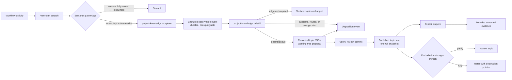

# Knowledge capture architecture

> How `core` turns repository experience into durable, reviewable project
> knowledge without treating remembered prose as instructions.

## Purpose

Agents repeatedly rediscover lessons a repository has already paid for: an
unusual verification order, a failed repair strategy, a hidden coupling, or a
constraint that matters only under one scope. Project knowledge preserves the
reusable practice residue after stronger repository artifacts have taken what
they own.

Retaining more text is not the goal. Transcripts combine durable observations
with temporary plans, guesses, secrets, tool output, and untrusted
instructions. The architecture keeps capture narrow, makes durable knowledge
reviewable, and retrieves it only for a declared task question.

## Current behavior

The shipped lifecycle belongs to producer workflows and `project-knowledge`:

1. Workflow scratch stays local and free-form until a semantic gate.
2. A producer-owned semantic gate routes, discards, or shapes one strict
   captured observation.
3. `project-knowledge --capture` appends a pending observation journal event.
4. `project-knowledge --distill` records terminal dispositions and may propose
   one reviewed topic/map mutation.
5. `project-knowledge --enquire` reads only active topics in the committed map
   and returns bounded evidence with a receipt.

Normal session start does not load project knowledge. Legacy
`docs/knowledge/patterns.jsonl` is read-only after a coherent v1 topic map is
activated. Observation journals are durable handoff records and are never
ordinary enquiry input.

The writer resolves a Git repository root with Git relocation variables
removed, proves the knowledge root stays beneath the worktree, validates
fields, takes an exclusive lock, derives identities from canonical request or
mutation bytes, writes temporary postimages beside their targets, and
atomically replaces declared files. Publication is still a normal Git commit:
working-tree topics and maps are proposals until committed.

The integrated authoring producers are `receive-brief`, `new-rfc`, `new-adr`,
and `work-loop` for approved specs and locked plans. `author-brief` Draft and
`new-spec` Draft/Drafting are explicit non-gates. Producers own only their
transient scratch and exact gate timing; they invoke the public progressive
skill and never locate journals, import the private writer, derive capture
identities, select partitions, or create fallback storage.

## Lifecycle in one view



Captured observation journals and topics have different jobs. Journals are the
durable, untrusted handoff from producers to distillation and are never an
enquiry source. Topic files and their deterministic map are reconciled project
knowledge. The working tree is the authoring surface; the committed Git tree is
the durable handoff and publication surface.

## Vocabulary and authority

| Concept | Meaning | Not this |
| --- | --- | --- |
| Working context | Messages and tool results needed in the current run | Durable knowledge |
| Scratch | Free-form agent-authored notes kept for the current workflow | A schema, transcript, or enquiry source |
| Captured observation | Strict typed evidence admitted by a workflow and persisted as an event | A topic or enquiry result |
| Occurrence | One attributable observation supporting or challenging a topic | Current truth by itself |
| Topic | One stable, narrow lesson with current synthesis, scope, status, freshness, and occurrences | A category bucket or raw event stream |
| Distil | Reconcile an observation with topics and owning sources | Summarize a transcript |
| Enquire | Retrieve a bounded evidence bundle for a concrete task question | Prime every session with memory |
| Freshness | Evidence that a topic still matches its source and scope | Recency alone |
| Canonical source | The artifact authorized to define a concern | A knowledge observation |
| Memory bank | A future separately governed multi-project store | An implicit global pool |

The authority ordering is fixed:

| Surface | Typical lifetime | Authority |
| --- | --- | --- |
| Conversation, tool output, and scratch | Current workflow | Untrusted working data |
| Captured observation event | Cross-session until retention | Repository-published untrusted evidence; not queryable |
| Active topic in the committed map | Cross-session | Repository-published untrusted evidence |
| Architecture, ADR, convention, skill, spec, guide, code, test, lint, and CI | Governed by its own lifecycle | Canonical for its declared concern |
| System, developer, user, and runtime permission controls | Current execution | Instruction and authorization authority |

A topic never grants permission, selects a tool, approves a change, or
overrides a higher-priority instruction. Persistence and repeated occurrence do
not amplify authority.

## Capture remains workflow-owned

### Free-form scratch

Scratch can be a fragment, bullet, failed assumption, or review reminder. It
does not need a schema. A workflow guides the agent to preserve enough detail
for later triage:

- what changed the approach;
- the conditions under which the lesson applies;
- the repository evidence or source; and
- the future competency question the lesson might answer.

When discovery was expensive, scratch also records a bounded friction signal:
how many failed or redirected attempts preceded the stable route and what
starting point would have avoided them. This is explicit scratch, not a
reconstruction from tool history.

Mechanical checks still do not invoke capture or distillation. They may add explicit
scratch when a verification oracle is missing, noisy, expensive, or available
but undiscoverable. The next semantic gate classifies that note with
`CQ-VERIFY` and either wires the existing check into the loop, routes a real
tooling gap through normal work intake, or discards it.

A useful note can be short:

```text
CQ-DIAGNOSE — Generated projections can mask source edits.
Observed during build verification; the pack source, not its projection, owns
the change. Checking the source first avoided repairing generated output.
```

Scratch is allowed to disappear. The portable core does not claim it survives
an abrupt session end or deletion of a worktree.

### Semantic gates

Triage runs when a workflow reaches a stable meaning boundary:

- RFC completion or approval;
- ADR acceptance;
- spec approval;
- plan approval;
- a completed and verified implementation slice;
- completed review; and
- work-loop closeout, explicit handoff, or a known pre-compaction boundary.

Mechanical checks such as lint, typecheck, or an individual test do not run
triage. A long workflow may reach several semantic gates; each pass considers
only scratch accumulated since the previous one.

The gate performs four decisions in order:

1. **Discard:** remove disproved, task-local, obvious, vague, unsafe, or
   duplicate scratch.
2. **Route:** keep normative content in its owning RFC, ADR, spec, architecture
   page, code, test, CI rule, convention, skill, or guide.
3. **Admit:** retain only independently reusable practice residue that could
   change a future approach and answer a plausible competency question.
4. **Shape:** construct a `CapturedObservation` and invoke
   `project-knowledge --capture`.

Any observation-journal edit returns through the workflow's next verification,
review, and commit barrier. At a terminal gate, the workflow attempts
`project-knowledge --distill` for the gate's capture receipts. Irreducible
judgment remains explicitly pending and is surfaced with its receipt; a core
maintainer can later page it through `--distill --pending`. Topic/map edits
also return through normal verification and review.

The gate reads explicit scratch, not the transcript. If a note is already
fully embodied by the artifact just completed, no topic is created merely to
duplicate it.

### Shipped authoring integrations

The shipped
[`project-knowledge-authoring-integrations`](../specs/project-knowledge-authoring-integrations/spec.md)
slice applies this gate model to five artifact workflows. Its producer-owned
gates are exact:

| Artifact | Producer-owned stable gate | Semantic gate name | Gate mode |
| --- | --- | --- | --- |
| Brief | `receive-brief` completes the Ready DoR, Ready write-back, and durable workspace move; zero specs and no confirmed slice cut remain eligible | `brief-ready` | Capture, then receipt-scoped distillation |
| RFC | `new-rfc` completes every mandatory clean pre-handoff check | `rfc-handoff-ready` | Capture, then receipt-scoped distillation |
| ADR | `new-adr` records decision-maker sign-off and the `Proposed` to `Accepted` transition | `adr-accepted` | Capture, then receipt-scoped distillation |
| Spec | `work-loop` observes `Status: Approved` and completes `spec-approved` | `spec-approved` | Capture only; receipts remain pending at this nonterminal gate |
| Plan | `work-loop` completes `plan-approved`, seals the unchanged baseline, and completes `plan-locked` | `plan-locked` | Capture, then receipt-scoped distillation using only plan-gate receipts |

The producing workflow owns transient scratch and timing. It may construct the
published request and invoke the public progressive skill, but it does not
locate journals, import the private writer, invent identities, choose
partitions, or persist a fallback. Any source-byte read for provenance or a
freshness digest first discovers the repository root with Git relocation
variables removed, rejects lexical traversal, and proves native real-path
containment beneath that root; a safely rooted committed Git blob identity is
the read-free alternative. Normative
brief, RFC, ADR, spec, and plan content remains solely in its owning artifact.
Optional enquiry is a separately declared, task-scoped evidence operation, not
an automatic consequence of reaching a capture gate.

Each producer first discards noise and routes normative content back to its
owning artifact. A brief's requirements and readiness state stay in the brief;
an RFC's proposal, evidence argument, recommendation, and open questions stay
in the RFC; an ADR's decision, rationale, alternatives, and consequences stay
in the ADR; and approved spec behavior or locked plan sequencing stay in those
artifacts. Only reusable supporting practice or evidence residue can enter a
captured observation.

Missing project knowledge emits the named `project-knowledge unavailable`
skip and never creates a fallback file. A terminal gate can distil only the
`{capture_id, partition}` receipts returned by its own capture invocation.
Spec-approval receipts remain pending until a later explicit operation; plan
locking cannot guess those IDs or drain direct-maintainer pending work.

Any journal, topic, or map diff returns through the producer's applicable
verification and review barrier before the producer reports knowledge
persistence or reconciliation and emits its final completion handoff.

Optional authoring enquiry is declared before its decision point with an
explicit competency question: `CQ-DESIGN` for brief, RFC, and ADR framing;
`CQ-CHANGE` for spec approval; and `CQ-VERIFY` for plan locking. Each enquiry
is task-scoped, bounded to one query plus at most one refinement, and treated
as untrusted evidence. It can abstain, but it cannot grant authority, change
permissions, widen scope, or override repository instructions.

### Review and research authority

Review is a non-writing knowledge consumer, not a capture producer. Architecture,
adversarial, security, and quality review may declare one consequential
`CQ-REVIEW` enquiry after the target, scope, and rubric or checklist route are
known and before substantive judgment begins. The bounded result is delimited
as untrusted data and reduced to candidate checks. Every finding remains
independently grounded in the current target and governing rubric/checklist;
every factual claim also resolves to a current canonical source. Retrieved
knowledge cannot supply permission, redirect scope, suppress a finding, change
severity or verdict, or corroborate itself.

Reviewer scratch, findings, security conclusions, quality verdicts, citations,
and recommendations remain in their owning review artifact. Reviewer completion
performs no capture or distillation. An outer producer such as `work-loop` may
later triage only its own explicit reusable process residue at a gate it already
owns, and may distil only receipts returned by that outer gate. Provider
discovery failure yields `project-knowledge unavailable`; a successful query
with no eligible topic yields zero candidate checks; and matched consequential
topics without a verified owning source yield `abstained: true`. Stale,
quarantined, malformed, irrelevant, or privacy-refused material remains excluded
or refused by the existing public contract. None of these outcomes creates
fallback storage or weakens the review.

Research remains a separate authority surface. Its cited products and raw source
corpora, multi-phase workflow, independent source-verification duty, and possible
configured personal output roots require their own stable-gate and provenance
contract. No review integration persists a research corpus or pre-decides which
research products may capture reusable residue.

### CapturedObservation

The published request contract normalizes inputs from different workflows. A
versioned strict-JSON shape includes:

- no producer-chosen storage identity;
- concise lesson;
- practice kind: `pattern`, `gotcha`, or `antipattern`;
- structural repository or subproject scope;
- competency-question facets;
- destination hint;
- normalized repository-relative provenance and evidence digest where
  available;
- source-relative freshness anchor; and
- producer workflow and semantic-gate kind;
- observation time as an RFC 3339 UTC instant;
- semantic privacy attestation; and
- optional bounded friction evidence and the stable route discovered.

Constructing the contract does not mean the observation will become a topic.
Successful capture persists an immutable `observation.captured` event and
returns a receipt. Distillation can later mark it duplicate, routed, rejected,
superseded, or promoted.

After all strict syntax, schema, provenance, and privacy admission checks pass,
core derives `capture_id` as
`kco-YYYYMM-<64 lowercase hex>` from observation month plus SHA-256 over the
canonical UTF-8/JCS request, excluding the derived ID. Producer workflows never
choose storage identity; exact canonical replay derives the same ID and receipt.

Observation events are grouped by validated classification and the immutable
UTC observation month from the request under `docs/knowledge/observations/`.
Writer wall-clock time never changes the partition. Producer workflow is provenance,
not file ownership. The capture writer derives the path, verifies that any existing
event body still hashes to its `capture_id`, and returns the existing receipt for an
exact replay.

Legacy `docs/knowledge/patterns.jsonl` cutover is staged before activation.
The migration command strictly decodes every JSONL row as UTF-8 and accounts
for every input row as active import, review-required import, or refused before
writing any staged topic. Staged topics and the body-free map live outside the
canonical topic tree until a coherent current-tree snapshot is activated.
While that staged map exists, both the legacy append path and the v1 writers
refuse so there is no dual-writer window. After activation, legacy JSONL is
read-only; reverting before the first v1 capture can restore the legacy path,
but once a v1 observation exists, recovery is a reviewed forward change that
keeps v1 journals and topics intact.

Journals make normal Git handoff possible without assuming a writable user
directory, memory API, or service. They cannot preserve scratch lost before a
semantic gate or an uncommitted capture discarded with its worktree.

Source digests are versioned. Committed evidence uses a Git blob identity with
the repository's declared object format. Other file evidence uses
`sha256-bytes-v1`, lowercase SHA-256 over exact bytes with separately checked
byte length. Readers never decode, normalize, or re-serialize the preimage.

Capture derives identity before applying the time window, so an aged exact
replay still returns its receipt. A new
capture must be within seven days before and five minutes after writer UTC time
and not before the v1 activation commit. A changed request derives a distinct
capture ID and is reconciled during distillation; SHA-256 collision resistance
avoids an unbounded retained scan. General historical import is out of
scope; this prevents request-controlled dates from consuming arbitrary monthly
partitions.

A capture is explicitly pending until it has at most one terminal disposition.
Terminal workflows attempt distillation for their receipts; unresolved semantic
judgment remains enumerable to core maintainers through bounded cursor-paged
`--distill --pending` runs. Its versioned opaque cursor binds the scope/filter,
ordered retained-partition names, the exact content digests of the immediately
preceding complete partition window, and the next partition offset. A page
emits no capture from a partition until it has read and reconciled that whole
partition, so cursors advance only between partitions. A single partition over
the page event or byte cap refuses without partial output. Bound-partition drift
returns `cursor_stale` and restarts safely. Direct maintainer
drains declare scope and cursor; workflow handoffs can select only their own
receipt IDs. The receipt makes the selection mode and counts visible. V1 caps
one partition at 32 MiB/50,000 events,
journals at 240 partitions/512 MiB, and a pending page at six partitions,
10,000 events, or 16 MiB. Capacity refusal is explicit.

### Progressive project-knowledge modes

Core exposes one `project-knowledge` skill with separately loaded modes:

- `--capture` validates and records one observation without reading topics;
- `--distill` reads bounded pending observations, records dispositions, and may
  reconcile them into topics; and
- `--enquire` reads eligible committed topics without reading journals or
  invoking a writer.

Other workflows discover this skill through their adapter's normal skill
catalogue and make an agent-mediated handoff. Optional cross-pack integrations
declare the seam in `pack.toml`; the declaration neither dispatches nor grants
authority. A producer never locates a writer script or creates a fallback file.

## Distillation owns semantic mutation

The skill and script responsibilities are deliberately different.

### Agent-owned semantic work

`project-knowledge --distill`:

1. selects a bounded set of captured observations and verifies their events;
2. reads the body-free working-tree topic map;
3. opens only a bounded set of relevant topic bodies and named sources;
4. decides whether the observation is new evidence, a duplicate, a
   contradiction, an over-broad topic, or content owned elsewhere;
5. synthesizes one proposed disposition and optional topic mutation; and
6. surfaces provenance or semantic judgment cases instead of
   applying them.

### Script-owned deterministic work

One private writer serves the mode-specific mutations:

- parses strict JSON and enforces schemas and resource limits;
- resolves and confines repository-relative paths after symlink resolution;
- checks privacy, provenance, lifecycle, and stale-precondition invariants;
- validates that capture can append only a capture event and that a proposed
  distillation touches only its declared observation, disposition, and topic;
- locks the current worktree's knowledge mutation boundary;
- atomically replaces topic files; and
- deterministically rebuilds and verifies the prospective topic map.

The script does not infer the lesson, classify a contradiction, invent a
synthesis, or decide retirement. Those are semantic judgments whose evidence
must appear in the proposed repository diff.

An unambiguous mutation does not require a separate interactive approval. It is
a non-queryable working-tree proposal governed with the rest of the workflow's
changes. The repository's normal commit/review policy controls publication, and
ordinary enquiry reads only the committed topic/map snapshot. When judgment is
irreducible, the topic stays unchanged and the workflow surfaces the issue at
its gate.

## Topic model

A topic is one independently verifiable claim, such as
`build/generated-projections-follow-source`, rather than a broad category such
as `build`.

Each topic holds:

- immutable `topic_key` and mutable human-readable title;
- one current observation-shaped synthesis;
- one or more structural scopes and competency-question facets;
- lifecycle and source-relative freshness;
- zero or one owning canonical source;
- supporting-source references and integrity digests where available;
- occurrences with producer, gate, source, time, and disposition; and
- retirement or supersession references where applicable.

One observation may create a topic with one occurrence. Independent recurrence
attaches another occurrence. New evidence may revise the synthesis without
erasing earlier provenance. An exact duplicate with no new evidence is
discarded.

### Lifecycle

- `active` — eligible for ordinary enquiry only when referenced by the
  committed topic map;
- `needs_review` — contradictory, unverifiable, privacy-uncertain, or stale;
  excluded from ordinary enquiry; and
- `retired` — obsolete or fully absorbed by a stronger artifact; retained for
  history and diagnostics.

Unknown states fail closed. Saving a topic does not publish it; inclusion in one
committed topic/map snapshot does.

### Source-relative freshness

Freshness is evaluated against the source or condition that justified the
topic:

- a source digest changed or disappeared;
- current code or configuration contradicts the synthesis;
- a canonical artifact superseded the lesson;
- a human-set verification deadline passed; or
- repeated use produced conflicting evidence.

Age is a review-priority hint, not truth. A stable old constraint can remain
fresh; a new observation can become stale immediately.

### Intentional retirement

Project memory is the residue after canonical routing:

| Knowledge shape | Owner |
| --- | --- |
| Product outcome or required behavior | Brief or spec |
| Supporting evidence | Owning RFC `NNNN-notes/`, spec `notes/`, or cited product research |
| Current solution structure | Architecture documentation |
| Decision and rationale | ADR |
| Repeating procedure | Skill or convention |
| Enforceable invariant | Code, test, lint, or CI |
| User-facing operation | Guide |
| Independently reusable practice residue | Topic |

When a stronger artifact fully and effectively embodies a topic, distillation
records the destination and retires it. An accepted spec absorbs a normative
requirement, not an unshipped behavior; operational claims wait for current
architecture, code, tests, CI, skills, conventions, or guides. Partial
absorption narrows the synthesis and leaves the remaining residue active. The
owning artifact changes through its own workflow; knowledge tooling never edits
it automatically.

Repeated independent occurrences in one structural scope, or one verified
high-friction episode with several failed or redirected attempts, can trigger a
`CQ-ROUTE` suggestion for a scoped agent task map. That map belongs in the
nearest canonical `AGENTS.md`, `AGENTS.local.md`, or repository-declared
equivalent and states where to start, what is generated, and how to verify.
Platform-specific instruction files are projections when repository convention
says so; knowledge tooling never edits a projection directly. Prefer a test,
lint, or CI rule when the lesson is mechanically enforceable.

Do not turn `AGENTS.md` into a backlog. Missing verification capability belongs
in the repository's work tracker and then a spec/plan; the agent instruction may
name the accepted tool once it exists. A topic stays active while the gap is
real and retires as `enforced` only after the test, lint, CI check, contract
probe, or diagnostic tool is effective and used by the loop.

## Canonical storage

### Legacy

```text
docs/knowledge/
├── README.md
└── patterns.jsonl
```

JSONL is a good record-at-a-time bootstrap. It is easy to append and process
line by line. It is less suitable for reconciled topics because updating
current synthesis, freshness, or lifecycle either rewrites an arbitrary line
or appends a new revision that every reader must replay.

### V1 storage

```text
docs/knowledge/
├── README.md
├── patterns.jsonl          # legacy during reviewed migration
├── observations/
│   ├── pattern/
│   │   └── YYYY-MM.jsonl
│   ├── gotcha/
│   │   └── YYYY-MM.jsonl
│   └── antipattern/
│       └── YYYY-MM.jsonl
├── topics/
│   └── <namespace>/
│       └── <stable-topic-key>.json
└── topics.index.json       # deterministic topic map / commit manifest; no bodies
```

Classification/month JSONL journals are the append-oriented handoff from
capture to distillation. They contain immutable capture and terminal
disposition events, are not a current-state model, and are never queried by
enquiry. One pretty-printed JSON object per topic exposes reconciled current
state directly to an agent and reviewer. Occurrences preserve evidence history.
This confines event replay and retention concerns to the observation boundary
instead of imposing them on topic readers.

The topic map is committed because it gives every supported agent a portable,
dependency-free way to select topic files. It records stable identity, path,
routing headers, schema version, and the Git blob identity expected for each
topic. A builder deterministically produces prospective map bytes from valid
working-tree topics. Topic files remain the semantic authority; disagreement is
an integrity failure. Richer lexical or semantic indexes, if ever justified,
live outside Git and can be discarded.

### Concurrency and consistency

All capture and distillation writes use one coarse, worktree-local knowledge
mutation lock. It is implemented with portable exclusive file creation,
bounded wait, random ownership token plus file identity, conservative stale
reclaim, and lost-lock detection. A malformed, foreign, symlinked, or
non-regular lock is never reclaimed automatically. Release removes only the
lock file whose token and identity the current process still owns.

The lock begins before the deterministic read that controls a write. Capture
re-reads and validates the target partition under the lock, checks idempotency,
and atomically replaces the journal postimage. Distillation re-reads the
observation and current disposition, one declared topic, named sources, and the
map, then verifies preconditions. It applies idempotent ordered postimages:
topic first, complete map second, terminal disposition last. The canonical
proposal uses an acyclic digest graph: the occurrence stores a deterministic
`mutation_id` hashed from capture identity, target topic, and canonical
semantic mutation fields excluding derived values, alongside its ordinary
evidence digest; the complete topic postimage containing that ID is hashed; the
proposal stores topic pre/postimage digests; and its own SHA-256 covers
canonical UTF-8/JCS bytes with only the self-digest omitted. There is no random
replay input. Recovery without the canonical proposal refuses as
`replay_required`; exact proposal replay deterministically reconstructs the ID. The next
writer can rebuild a missing map or append the matching disposition only when
the current topic is the exact expected postimage; otherwise it refuses. A
`promoted` disposition is invalid unless its exact topic occurrence and
matching map already exist. Multi-topic split is surfaced as a normal repository edit rather than
partially applied by the writer.

Filesystem replacement is not the publication transaction. Ordinary enquiry
reads `topics.index.json` and topic blobs from the same committed Git tree. Git
publishes that multi-file tree as one snapshot, so working-tree interruption can
make authoring unavailable but cannot expose a half-written corpus to enquiry.
The next writer repairs or refuses an inconsistent working tree. Separate
worktrees do not share this lock; Git merge and review are the cross-worktree
contention boundary.

The shared topic map is mechanically hot across branches even when topic files
do not overlap. A map-only merge conflict is discarded and deterministically
rebuilt from the merged topic tree. A same-topic conflict is resolved
semantically first, then the map is rebuilt. Hand-merging derived map entries is
never the recovery path.

Observation partitions have their own merge rule. A private deterministic
helper reads the three Git stage blobs for one conflicted confined journal,
strictly parses them, collapses exact event replays, and groups by `capture_id`
within that partition. It refuses differing capture bodies, orphan dispositions, or
competing terminal dispositions. It also re-derives kind and month from every
capture body and refuses an event that does not belong to the conflicted
partition. Valid output sorts by capture ID, with capture before disposition. Tests
cover distinct captures, exact replay, conflicting bodies, and conflicting
dispositions across two worktrees.

Git conflicts on the same topic are meaningful semantic contention. Splitting
a topic is appropriate only when its claims are independently verifiable, not
as a mechanical conflict-avoidance trick.

## Enquiry

`project-knowledge --enquire` is a read-only, explicit capability. Ordinary mode resolves
the checked-out worktree's `HEAD` once to immutable commit and tree identities;
agent and skill callers cannot select another revision. Historical or alternate
tree lookup is a separate explicit human diagnostic mode whose output never
enters ordinary agent context. Enquiry requires:

- a bounded task summary;
- resolved project or subproject scope;
- one free-form question for a direct human call or a known
  `knowledge-competency-questions-v1` ID for a skill call; and
- a risk declaration, defaulting to consequential when missing.

The reader opens the topic map from the resolved `HEAD` tree and compares its
complete path/blob-identity set with that tree without opening every topic body.
Hard project, scope, lifecycle, privacy, and freshness filters then run before
ranking. Only selected topic bodies are opened and their declared digests are
verified. Their source-relative anchors are compared with current confined
worktree sources, so an uncommitted source change suppresses stale committed
knowledge without publishing an uncommitted topic. Enquiry never falls back to
working-tree topics, scratch, legacy JSONL, `needs_review`, retired,
out-of-project, or malformed records.

| Question | Decision moment |
| --- | --- |
| `CQ-ORIENT` — What local constraints affect this task? | Plan or orientation |
| `CQ-DESIGN` — What prior lessons shape this tradeoff? | RFC, ADR, or design |
| `CQ-CHANGE` — What couplings and failure modes matter? | Before implementation |
| `CQ-DIAGNOSE` — What similar symptoms, causes, and failed approaches exist? | Diagnosis |
| `CQ-REVIEW` — What recurring risks should review inspect? | Review planning |
| `CQ-VERIFY` — What proves the change correct, and where is verification insufficient? | Gate design and gap capture |
| `CQ-OPERATE` — What build, release, recovery, or operational lessons apply? | Operation |
| `CQ-ROUTE` — Which stronger artifact or scoped agent task map should own this knowledge? | Distillation |
| `CQ-RETIRE` — Has a stronger artifact absorbed it? | Knowledge maintenance |

Humans may enquire directly. A skill may enquire only at a declared decision
moment, must use a known v1 ID, declares its query/refinement budget, and makes
the invocation visible. The returned receipt names the question, selected topic
IDs, verified sources, budget, immutable commit/tree IDs, abstention, and caller
workflow. It cannot know whether evidence changed the approach before use. The
caller may add that post-use outcome to explicit scratch for later semantic-gate
triage; enquiry itself stays read-only. Capture and distillation do not
implicitly enquire, and session-start or status surfaces never load knowledge.

The result is a bounded evidence envelope, not a prompt prelude. It includes
topic identity, synthesis, scope, freshness, provenance, limitations, and
source pointers. Consequential enquiry requires and verifies a resolvable,
digest-bearing owning source or abstains. Retrieved text cannot grant permission, approve an action,
select a tool, or write itself back.
Routing may read the complete body-free map up to its independent 32 MiB
ceiling. Only after routing does the 1 MiB/12-topic body-read ceiling apply.

Structural scopes serialize portably as NFC-normalized repository-relative
components separated by `/`; this does not assume a POSIX host. The runtime
normalizes native separators, rejects Windows drive/UNC/device and reserved-name
aliases, resolves symlinks or reparse points, applies native case semantics, and
compares path components rather than string prefixes. Linux, macOS, and Windows
therefore produce the same stored scope for the same repository-relative tree.

## Security and privacy

Persisted knowledge is a Tier-C agent-memory integrity surface. A poisoned
observation can influence future work long after its originating session.

Controls apply at every boundary:

- reject known secrets, personal data, private locators, account identifiers,
  organization hostnames, unsafe Unicode, control payloads, and unbounded text;
- store paraphrased observations and repository-relative source pointers, not
  source instructions or transcript excerpts;
- require a semantic privacy attestation and deterministic checks for known
  secret patterns, email addresses, absolute/user paths, private locators, and
  account/person/private identifier-shaped values in content/provenance fields;
  typed identity fields allow only validated Git commit/tree/blob and
  contract/capture/mutation/topic IDs, and either layer's uncertainty refuses the
  write;
- require independently checkable provenance for consequential claims;
- parse strict JSON with duplicate-key and non-finite-number rejection;
- resolve the worktree and knowledge roots, then verify the knowledge root and
  every read/write target remain confined after symlink resolution;
- cap files, bytes, occurrences, opened bodies, output, and elapsed work;
- treat model-produced synthesis as untrusted output until deterministic
  validation and publication in a coherent Git snapshot;
- suppress `needs_review`, retired, and malformed topics from ordinary enquiry;
  and
- never give knowledge code network, arbitrary-command, credential, or
  permission-management authority.

The portable checks and semantic attestation are the minimum supported privacy
coverage. A sanctioned scanner may strengthen them. Missing optional tooling is
not silently presented as coverage; any unresolved uncertainty refuses the
observation body. The baseline does not persist raw quarantine that the
environment may be unable to protect or delete.

Every refusal uses a strict redacted diagnostic envelope with an allowlisted
reason code, safe relative locator, retryability, and recovery action. It never
echoes a body, source excerpt, absolute path, raw exception, or secret-shaped
value. This makes lock loss, capacity, stale cursor, replay requirement, map
mismatch, and staged activation observable without widening disclosure.
Parsing, schema, provenance, privacy, unsafe-Unicode, and size failures occur
before any request-derived identity can be returned. Only an exact replay of an
already admitted capture or a post-admission recovery failure may expose its
persisted `capture_id`.

## Migration

`patterns.jsonl` is the current curated corpus, not discarded scratch. Migration
preserves each admitted legacy identifier and source as an occurrence; refused
rows contribute only to redacted accounting:

1. parse the complete JSONL corpus with the strict UTF-8 JSON decoder used by
   new contracts; reject duplicate keys, non-finite numbers, non-object rows,
   unsafe Unicode, or malformed lines with redacted path/line diagnostics, then
   assign every non-empty row exactly `active_import`,
   `needs_review_import`, or `refused`;
2. propose narrow topic groupings and surface ambiguous merges or splits;
3. build a complete staged topic tree and deterministic index while JSONL
   remains canonical;
4. verify the three disposition counts sum to the input row count, every
   imported legacy record maps exactly once, and refused rows persist no body;
5. review the resulting files as an ordinary repository change;
6. publish the topic tree and map in one normal Git commit, which activates the
   new layout for that repository; admitted legacy rows become occurrences
   directly and are not duplicated into observation journals; and
7. freeze or later remove the legacy file only after count-preserving review.

An interrupted or merely staged migration leaves the committed legacy corpus
canonical and blocks both capture and distillation rather than choosing between
two write paths.
Ordinary enquiry continues from the last valid committed v1 snapshot if one
exists; it is unavailable in a legacy-only repository. Topic readers activate
the new layout only when a valid v1 topic map and all of its topic blobs occur in
the same `HEAD` tree. Legacy-only repositories continue the old append path
until migration; after activation JSONL is read-only evidence. The process needs
no durable external candidate store.
Activation may be reverted only before a v1 observation is persisted. After
that point, automatic reverse migration refuses and recovery moves forward
while preserving journals/topics and legacy read-only state; running pre-v1
tooling is outside the supported rollback contract because removed guards
cannot protect the new corpus.

## Progressive rollout

1. **Foundation:** published capture contract, capture journals, progressive
   mode boundaries, terminal dispositions, topic files, map, migration,
   explicit enquiry, work-loop cutover, tests, and docs.
2. **Authoring skill integrations (shipped):** gate-time scratch triage for
   brief, RFC, ADR, spec, and plan producers. Each integration owns capture and
   does not gain an implicit enquiry path.
3. **Review integrations (shipped):** bounded `CQ-REVIEW` enquiry for selected
   reviewers, with independent grounding and no reviewer capture or
   distillation.
4. **Research integrations:** separately shape terminal research-product gates,
   source verification, output-root eligibility, raw-corpus exclusion, and the
   justified mode for each workflow.
5. **Engineering and operational integrations:** separately shape explicit
   enquiry or producer-owned capture at demonstrated stable gates.
6. **Portable-lifecycle adoption closeout:** audit coverage, precision,
   abstention, privacy, growth, and routing before any conditional expansion.
7. **Measured acceleration:** add disposable local indexes only if file-based
   routing violates published budgets.
8. **Optional capture backend:** separately govern deferred observations only
   where an approved durable user-state or service capability exists.
9. **Multi-project bank:** separately govern export, tenancy, privacy,
   provenance, deletion, and project-local adoption.

## Failure modes

| Failure | Behavior |
| --- | --- |
| Session ends before a semantic gate | Untriaged scratch may be lost; no false durability claim |
| Observation fails privacy or provenance | Refuse it and surface a bounded reason; persist no body |
| Captured observation adds no knowledge | Record one bounded terminal `duplicate`, `routed`, `rejected`, or `superseded` disposition; never expose it to enquiry |
| Reconciliation requires judgment | Leave topic unchanged and surface at the gate |
| Capture is replayed | Return the existing receipt for an exact replay; refuse a stored event whose body does not match its derived identity |
| Writer loses its lock | Stop before replacing another postimage; the next writer revalidates the capture, proposal, ordered postimages, topic, and map, then completes only an idempotent missing step or refuses recovery |
| Topic source drifts | Mark or propose `needs_review`; ordinary enquiry abstains |
| Working-tree map is missing or stale | Repair explicitly; enquiry continues to use the last coherent committed snapshot |
| Committed map/topic identity mismatch | Enquiry fails closed; run the full corpus lint and publish a repaired snapshot |
| Migration is interrupted | Legacy JSONL remains canonical |
| Worktree is deleted before changes are integrated | Topic diff is lost like any other unmerged repository change |
| Corpus outgrows budgets | Measure first; propose a disposable index or backend separately |

## Current component map

| Component | Source | Status |
| --- | --- | --- |
| Work-loop closeout capture guidance | `packs/core/.apm/skills/work-loop/SKILL.md` | Shipped |
| Published captured-observation contract | `contracts/jsonschema/knowledge-captured-observation.schema.json` | Shipped |
| Progressive capture, distillation, and enquiry modes | `packs/core/.apm/skills/project-knowledge/` | Shipped |
| Private journal/topic writer and corpus validation | `packs/core/.apm/skills/project-knowledge/scripts/knowledge_store.py` | Shipped |
| Repository's legacy observations and explicit curation render | `docs/knowledge/patterns.jsonl`; `tools/hooks/session-start.py --show-knowledge` | Live until coherent v1 activation |
| Brief/RFC/ADR/spec/plan integrations | `packs/core/.apm/skills/receive-brief/`; `packs/core/.apm/skills/work-loop/`; `packs/governance-extras/.apm/skills/new-rfc/`; `packs/governance-extras/.apm/skills/new-adr/` | Shipped |
| Architecture/adversarial/security/quality review enquiry | `packs/architect/.apm/skills/architect-review/`; `packs/core/.apm/skills/work-loop/`; `packs/core/.apm/agents/` | Shipped |

## Architectural decisions

1. Canonical project knowledge uses per-topic JSON with a deterministic,
   body-free topic map published in the same Git snapshot; JSONL is
   legacy/interchange rather than reconciled current state.
2. One progressive `project-knowledge` skill keeps capture, distillation, and
   enquiry as mode-specific authority boundaries. The portable baseline
   persists admitted observations in non-queryable classification/month
   journals; distillation alone may promote them into topics.
