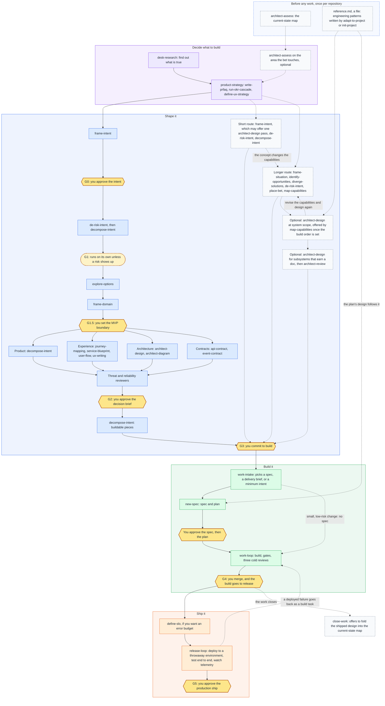

# Lifecycle flow across the packs

How one piece of work moves through the packs from idea to production, and
where a person decides. This is the maintainer map. The public explanation is
[`guides/_shared/explanation/the-operating-model.md`](../../guides/_shared/explanation/the-operating-model.md).

## Flow

A hexagon is a human decision. G1 is round because it passes automatically
unless a risk trigger fires. Dashed edges are optional routes or shortcuts.

## Gates and their owners

| Gate | Decision | Owner | Source |
| --- | --- | --- | --- |
| G0 | Ratify the value seed | `discovery-lead` | `packs/product-engineering/.apm/skills/discovery-loop/SKILL.md` |
| G1 | Strategy: automatic unless a risk trigger fires | `discovery-lead` | same |
| G1.5 | Ratify the altitude and MVP boundary | `discovery-lead` | same |
| G2 | Ratify the decision brief after the discovery reviewers reconcile | `discovery-lead` | same |
| G3 | Confirm the hand-off through `work-intake` | `discovery-lead` | same |
| G4 | Merge; the deploy-ready build passes to release | `work-loop` supervisor, `release-lead` | `packs/release-engineering/.apm/agents/release-lead.md` |
| G5 | Ratify the production ship | `release-lead` | same |

The short and longer shaping routes are not supervised by `discovery-lead`.
They are the light path and the six-step shaping sequence that P2 in
[`guides/README.md`](../../guides/README.md) walks, and they reach the same
G3 hand-off.

Architecture runs on two rhythms: documents set up once per repository, then
architecture steps at set points in each piece of work. Which skill offers
each step, and how a design reaches a spec, is owned by the "Where
architecture comes in" section of the operating-model guide. No stage gate
waits on any of it.

## Public projections

Three public artifacts restate this flow. Change them together with this page:

- The step-by-step list and the "Where architecture comes in" timeline in the
  operating-model guide, which are the text alternative for both graphics.
- `guides/_shared/explanation/the-operating-model-overview.svg` and
  `the-operating-model-full-map.svg`, generated by
  `python3 tools/render-lifecycle-graphics.py`. Edit the step content in that
  script, not in the SVG files.
- The four-stage strip in `guides/README.md` and the "Where this fits"
  sections in the eight stage-owning pack READMEs.
