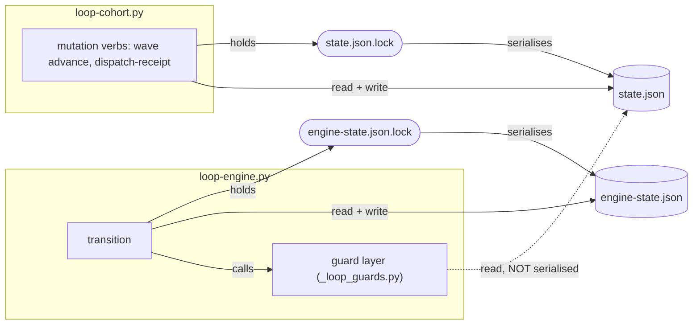
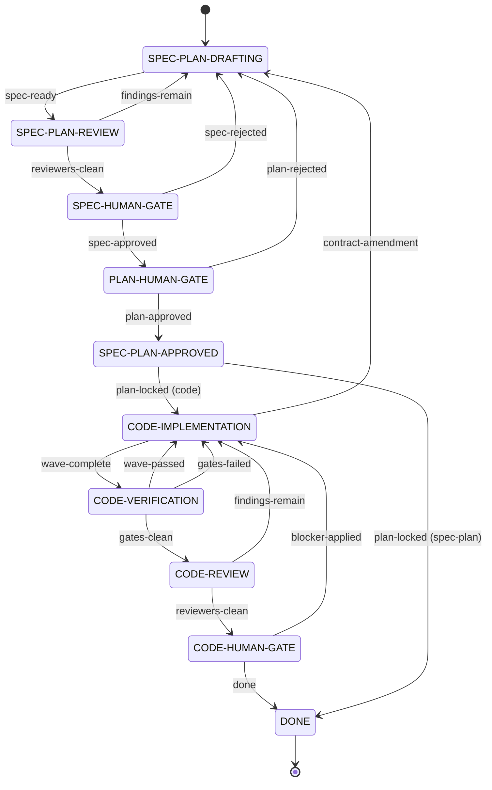
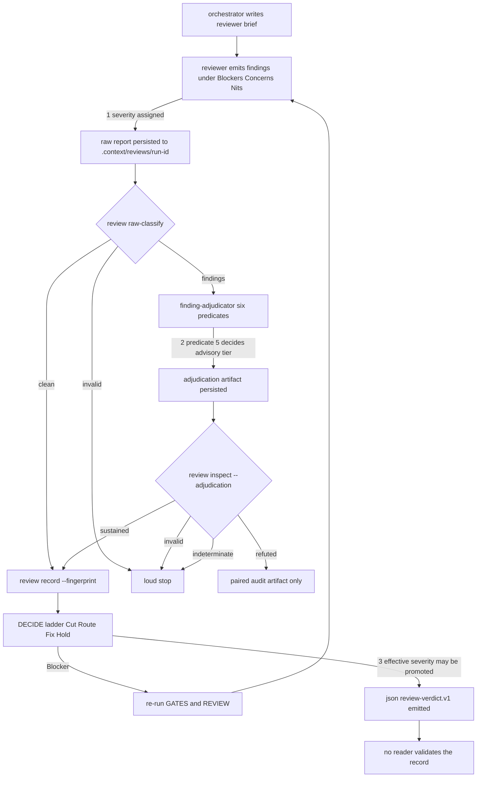
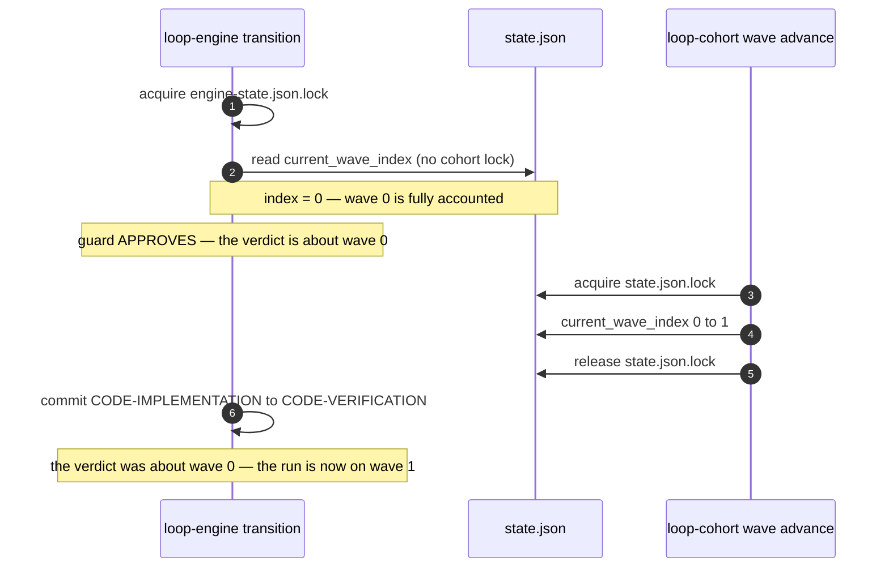

# Loop infrastructure

## 1. Purpose and boundary

The execution harness tracks work-loop phases and cohort state for one spec
directory. `loop-engine.py` advances the finite-state machine.
`loop-cohort.py` records cohort execution state.

The harness does not create requirements or implement work. It consumes approved
specification and plan artifacts.

The boundary runs the other way too, and it splits by **policy versus
mechanism** rather than by topic. `work-loop` decides *which* reviewers a change
warrants, when light or full mode applies, whether a simplify pass runs, and how
a session manages its context. The harness owns the machinery those decisions
feed: `loop-cohort.py` parses and classifies reviewer reports
(`review raw-classify`, `review inspect --adjudication`) and records the
resulting state.

So a reviewer-selection rule belongs in the `work-loop` skill and this page does
not restate it, while the classification contract that consumes the report
belongs here. A second copy of the selection rules would be falsified by the
next edit to the skill with nothing comparing the two.

### Sibling loops, and why only this one has an engine

`work-loop` is one of three loops, not the whole of the lifecycle.
`discovery-loop` sits upstream in `product-engineering` and `release-loop`
downstream in `release-engineering`, each run by its own supervisor agent —
`discovery-lead` and `release-lead` — that is a **peer** of `work-loop`'s
supervisor rather than a mode of it. They meet at numbered gates: discovery
hands off at **G3**, and the build hands off to release at **G4**, the point
where the build is locally done and deploy-ready.
[The three loops](../../guides/_shared/explanation/the-three-loops.md) is the
guide that reconciles the numbering across all three.

Neither sibling has an engine. `discovery-loop`'s transitions are file edits on
a typed sidecar; `release-loop` ships no executable engine. Both still have an orchestrating
agent and both keep state on disk; what neither has is a program that advances
it.
Everything on this page — the phase machine, the cohort state, the locks, the
replay markers — is `work-loop`'s alone. They also differ in install scope:
discovery ships at user scope, while build and release are repo-scoped.

## 2. Entrypoints

- `loop-engine.py`: `init`, `transition`, `status`, and `reset`.
- `loop-cohort.py`: `init`, `identity`, `status`, `approve-plan`,
  `schedule`, `check`, `reset`, wave, and review commands.
- `check-spec-status.py`: validates a requested status in `spec.md` or
  `plan.md`.

The parallel-execution verbs — `dispatch-decision`, `auto-parallel`, and
`worktree {preflight, add, record, list, merge, cleanup}` — are present in
`loop-cohort.py` but disabled: each exits non-zero with
`<verb> is disabled in Phase 1` and touches no state. ADR-0061 D5 defers
parallel-wave orchestration, so the verb surface is carved out and inert.

### How these scripts are invoked

`<skill-dir>` is the installer- or harness-supplied directory holding the active
`SKILL.md`. It is not a fixed repository path — an adopter's install location
differs from this repository's, and a harness may supply its own. So every
invocation resolves it and passes the script as one quoted argument from the
repository root:

```
python '<skill-dir>/scripts/loop-engine.py' …
python '<skill-dir>/scripts/lint-spec-status.py' --root .
```

A bare-relative `python scripts/loop-engine.py` is rejected by the work-loop
evaluation contract, because it silently resolves against the caller's working
directory rather than the installed skill.

These instructions are byte-identical across the generated Codex and Claude
projections; they are one source projected twice, not two copies to keep in
step.

### Three linters ship here, reached three different ways

A skill's `scripts/` directory is a first-class projecting surface, so
everything here reaches an adopter's tree. Three of these files are
linters — `lint-knowledge.py`, `lint-spec-status.py` and
`lint-traceability.py` — and the directory listing makes them look like peers.
They are not: each is reached by a different route, no route is discoverable
from the tree, and the routes disagree with the files' own headers in at least
one case.

Resolve the question per linter against the routes themselves — the shipped
`pre-pr.py` hook, the `work-loop` skill's finish-time checklist, other packs'
skills, and `tools/repo/build_gate_chain.py` for what this catalogue's CI
runs. Do not infer a linter's route from a sibling's, and do not infer it from
the linter's own module docstring.

Two facts do hold across all three. CI runs the **projected** copy rather than
the pack source. And none of it is a literal Makefile line, so grepping the
Makefile and finding nothing is not evidence that a linter is ungated.

## 3. Owned state and write authority

| State | Location | Write authority | Readers |
| --- | --- | --- | --- |
| FSM phase state | `docs/specs/**/engine-state.json` (gitignored) | `loop-engine.py` | Harness operators |
| Cohort state | `docs/specs/**/state.json` (gitignored) | `loop-cohort.py`, and `loop-engine.py` in-process on `contract-amendment` (see § 4) | Harness operators and engine guards |
| Transition events | `.loop-run/events.jsonl` (ephemeral) | `loop-engine.py` | Harness operators and workspace MCP |

### Concurrency control

Each state file has exactly one writer and its own advisory lockfile, taken
through `_statelock.py` (ADR-0074). The two locks are distinct files and know
nothing of each other: holding one says nothing about the other.

`loop-engine.py` holds `engine-state.json.lock` across a whole `transition` —
the state-machine table lookup, the plan-hash pre-guard, the event guard, and
the outbox finalisation — so the read-decide-write section is atomic against a
second engine process. `loop-cohort.py` holds `state.json.lock` for the body of
each mutation verb.

The engine's guard layer reads cohort state without taking the cohort lock, and
the diagram marks those reads as unserialised. Since the cohort-state identity
check, the engine does take the cohort lock once per non-exempt transition — not
for the guard reads, but around the commit, where it re-reads cohort state and
refuses if it moved since the transition's first read. The diagram below shows
the guard reads only.



The two domains **are** nested, on two paths now. Four acquisition sites exist
in the skill's scripts: two in `loop-cohort.py` (`:270` and `:992`) and two in
`loop-engine.py` (the engine-state lock, and the cohort lock the commit takes). On the
`contract-amendment` transition the engine loads `loop-cohort.py` as a module and
calls `apply_contract_amendment`, which takes the cohort lock at
`loop-cohort.py:992` while the engine still holds its own — so the engine-then-cohort
order is live in shipped code.

The order is fixed and acyclic. `loop-cohort.py` never reads `engine-state.json`,
so no site takes the pair the other way, and engine-then-cohort is the only
ordered pair that exists.

## 4. Dependencies and allowed edges

`loop-engine.py` reads spec and plan status, then invokes `loop-cohort.py`
identity and schedule checks before guarded transitions. `check-spec-status.py`
imports the canonical status parser from `lint-spec-status.py`.

The engine reads cohort state but does not write it — with one qualification
the identity check introduced: `exclusive()` creates and unlinks the
`state.json.lock` sibling, so the engine is now a writer in the cohort
*directory* for the first time. ADR-0061 **D3** governs state content, not the
directory. The cohort tool does not advance FSM phase state.

This split is ADR-0061's **Option A**, the pure phase tracker: a transition
*permits* a change and never *causes* one. The engine is a referee, so every
state mutation is invoked explicitly by the skill rather than as a side effect of
a transition.

Both halves of that decision have drifted. ADR-0061 D3 says the engine never
writes cohort state and "reads it only through the designated read-only verbs".
The guard layer now reads `state.json` directly in-process through
`_loop_guards.read_state`, having previously shelled out to `loop-cohort.py`; that
direct read is the unserialised read in section 6. And the `contract-amendment`
transition writes cohort state through `apply_contract_amendment`, so the engine
is not read-only with respect to cohort state on every path.

The rest of the split holds: the other fourteen events invoke no cohort mutation
from the engine, and every cohort write they need is invoked explicitly by the
skill.

## 5. Primary flows

1. `loop-engine.py init` creates FSM state and emits a run identifier.
   `loop-cohort.py init` adopts that identifier.
2. A guarded engine transition verifies required artifact status and cohort
   identity. Code transitions also verify the scheduled plan remains current.
3. `loop-cohort.py` records plan approval, scheduling, attempts, waves, and
   review evidence. `loop-engine.py` records phase transitions and events.

### The phase machine

Ten states and eighteen transitions. Ten edges move forward; **eight move
backward**, so rework is not an exception path but nearly half the machine —
`contract-amendment` alone returns a run five phases, from implementation to
drafting. `loop-engine.py`'s transition tables are the authority; this diagram
renders them.



`plan-locked` is the one event whose target depends on mode: it seals the
baseline and hands off to implementation in `code` mode, and terminates the run
in `spec-plan` mode. The three `*-HUMAN-GATE` states are where the run waits on
a person; every other state is agent work.

### The review and classification sequence

Severity is assigned in three places and validated in none. `loop-cohort.py`
parses a report's shape and computes fingerprints. Nothing reads the emitted
`review-verdict.v1` block.



Full mode iterates `adversarial-reviewer` until no unresolved Blocker **or
Concern** remains, so both return the loop to GATES. The rungs differ in
disposition rather than in whether they iterate: a Concern may be applied only
when the accepted contract and the bundled-fixes carve-out authorise it, and
required work that cannot share the unit moves to the next. Nits are deferred
with their citation.

The adjudicator may **lower** a reviewer's severity and may not raise it. Its
fifth predicate is what lowers a consequence to advisory: a defect nothing
external establishes, or a citation whose every surface the target marks as
working material rather than contract. A disposition-changing severity conflict
returns `indeterminate` for owner direction.

That first test reads the defect, not the remedy. A finding several defensible
repairs could fix is still established, and stays eligible for blocking
severity.

That ceiling is honoured in practice. Across 2,062 adjudicator entries declaring
a consequence advisory, 98% sustained at Concern or Nit; per run, 13 of 15 runs
with at least 20 such entries were perfectly compliant. No entry in that corpus
records which reading of the test its adjudicator applied, so how consistently
runtimes apply it can only be measured by re-labelling a sample, not read off
the entries.
[`review-loop-nonconvergence-survey.md`](../product/research/review-loop-nonconvergence-survey.md)
holds both re-labelling runs and what each established.

### TDD stub artifact boundary

For a full-mode TDD task, `plan.md` owns the exact stub code and its validation
result before approval. PLAN compiles and exercises that code from
disposable scratch, so the proof participates in the approved plan hash without creating a
repository test file. In `spec-plan` mode, `plan-locked` is terminal and no
implementation artifact is written.

In code mode, `plan-locked` advances the engine to `CODE-IMPLEMENTATION`.
EXECUTE then materializes the approved block unchanged at the repository's real
test path, verifies byte identity, observes the intended red, and continues to
green. The engine owns the phase boundary; the plan and test tree own different
representations on either side of it.

## 6. Failure and recovery behavior

A failed guard blocks the transition. A run-identifier mismatch blocks cohort
mutation. A changed plan blocks code transitions until scheduling is current.

Both state writers use `tempfile.mkstemp` and `os.replace` in the target
directory. A crash leaves either the previous JSON or the replacement JSON.
`reset` is the explicit recovery action.

### Re-planning after plan approval

Three situations arise once `approved_plan_hash` is written, and they take three
different routes.

| Situation | Route | Preserves completed work |
| --- | --- | --- |
| An accepted criterion proves genuinely separable | `contract-amendment` from `CODE-IMPLEMENTATION`, with scope-owner authority, a reason reference, and per-task completed evidence | yes, via the evidence payload |
| Execution produces an observation the plan predicted | the work-loop's verification ledger, which is not hash-pinned and needs no amendment | n/a — the plan does not change |
| The plan's approach is wrong | `reset`, then a new run | **no** |

**The third row is enforced, not merely advised.**
`validate_completed_task_sections` returns a refusal "when an amended plan
rewrites completed work": `completed_task_section_hashes` holds an exact SHA-256
per completed task section, and both `approve-plan` and `schedule` refuse an
amended plan that edits, removes, or renames one. So an approach change that
reaches completed work cannot be amended in place — the pin refuses it — and an
amendment that leaves those sections untouched has not changed the approach for
them. In-place re-planning is therefore closed by construction, which is the
mechanism behind ADR-0061's *Tradeoff accepted*: "any post-approval plan change
requires a full reset."

**What reset costs** is recorded as an invariant in
[§ 8](#8-mechanical-invariants): the recovery is correct and the run record does
not survive it.

**Editing `plan.md` outside these routes strands the run.** The schedule guard
compares against the pinned `plan_hash` on every `CODE-*` transition, so a direct
edit leaves every subsequent transition refusing with no forward edge; reset is
then the only exit, at the cost above.

### Replay markers close two crash windows, and a protocol closes four more

Two durable markers already make an interrupted transition recoverable.

| Marker | Where | Window it closes |
| --- | --- | --- |
| `amendment_pending` | cohort `state.json` | the cohort write landed but engine-state did not |
| `events.pending` | `.loop-run/` | engine-state was written but the `events.jsonl` append did not happen |

`cmd_transition` mutates the cohort first and writes engine-state last, so an
ordinary crash always leaves the cohort ahead and never behind. The reverse
direction means the two untracked files diverged by some other means, and it
takes a separate recovery branch that re-checks the schedule before completing
the missing cohort write.

`amendment_pending` outlives the transition that opens it. `begin_contract_amendment`
sets it and `complete_contract_amendment_reapproval` clears it, at a fresh plan
approval many transitions later, so the marker spans the amendment cycle rather
than one critical section. `_recover_pending` replays the outbox entry only when
`to`, `seq` and `run_id` all match the owning engine state, and
`contract_amendment_replay_status` classifies the cohort side as `absent`,
`applied` or `conflict` — where `applied` additionally re-reads `plan.md` and
re-runs `validate_completed_task_sections`, because a marker match alone would
launder an edit to an already-completed task section into the baseline.

Four further events pair a transition with a cohort mutation that no marker
covers: `wave-passed` with `wave advance`, `gates-failed` with `record-attempt`,
and `findings-remain` and `reviewers-clean` with `review record`. Their crash
windows are closed by a documented recovery protocol a person or agent executes
by hand — see
[`references/session-resumption.md`](../../packs/core/.apm/skills/work-loop/references/session-resumption.md).
Three of the four key on `<run_id>:<transition_sequence>`; `wave-passed` keys on
`last_event_context.completed_wave_index` instead. The `reviewers-clean` replay
requires explicit human authorization, because without a matching
`--operation-id` it can double-count a review round and overwrite one level of
fingerprint audit history.

### A wave-exit verdict is not serialised against the wave pointer

The `wave-complete` guard decides whether every task in the **current** wave
carries a dispatch receipt. It learns which wave is current by reading
`current_wave_index` from cohort state, unlocked. `loop-cohort wave advance`
moves that same field under the cohort lock. Nothing orders the two, so a
verdict reached about wave `n` can be committed after the pointer has left
wave `n`.



The consequence lands one transition later, not here. `gates-clean` asks only
whether the current wave is the last one; wave 1 is, so it passes. Wave 1 is
entered and exited with no guard ever reading its receipts, using sanctioned
verbs alone and no direct state write.

The interleaving needs two concurrent processes against one spec directory, so
it is unreachable from the sequential single-controller flow that Phase 1
supports.

**This is now serialised, and the diagram above shows the pre-serialisation
behaviour.** `cmd_transition` fingerprints cohort `state.json` before its first
cohort read and re-reads it under the cohort lock before committing, refusing
when it moved; the mutator above can no longer land in that window undetected.
The check covers every event except `contract-amendment`, whose own effect
writes cohort state. See
[`loop-parallelism.md` § 2](loop-parallelism.md#2-serialising-a-transition-against-cohort-state)
for the mechanism and, importantly, for the residuals it does not close.

Two of those residuals bear on this section directly. `contract-amendment` is
exempt, so the transition that rewrites the approved baseline keeps the window
described above. And the consequence this section names — `gates-clean` asking
only whether the current wave is the last, so a wave is entered and exited with
no guard reading its receipts — is **not** closed by serialisation: it needs no
interleaving at all. An advance that lands before the `gates-clean` guard runs
produces it with every read consistent. That is a missing check rather than a
lost race, and it remains open.

## 7. Observability and evidence

Both tools expose `status --json`. `engine-state.json` and `state.json` record
phase and cohort state; `loop-engine transition` appends one line per
transition to `.loop-run/events.jsonl` (ephemeral, gitignored). Workspace MCP
reads that stream.

The event line and the cohort's round payloads join on `<run_id>:<seq>`: the
engine writes the run identifier and sequence, and `loop-cohort` records a
round under `--operation-id <run_id>:<seq>`. So finding counts and
round-recurrence are read from cohort state through that join rather than
duplicated onto the line.

The envelope's field set, its export posture, its configuration route and what
a backend can do with it are a cross-cutting concern: see
[telemetry](telemetry.md).

## 8. Mechanical invariants

- `check-spec-status.py` blocks guarded transitions unless the requested
  `spec.md` or `plan.md` status is present.
- `loop-engine.py` checks cohort identity before every transition.
- `loop-engine.py` checks the current schedule before code transitions except
  `done`.
- `loop-cohort.py` requires `--expect-run-id` for cohort mutations.
- Each state file is written under its own advisory lock, so a read-modify-write
  on one file is atomic against another process running the same tool.
- The `spec-plan` `findings-remain` edge is guarded, but by a counter nothing
  on that path increments. `loop-engine.py` maps
  `("spec-plan", "findings-remain")` to the same `_guard_check_phase_review`
  the code path uses, and that guard refuses at
  `review_retry_count >= max_review_retries`. `review_retry_count` is
  incremented in exactly one place — `loop-cohort.py` `review record
  --fingerprint` — which an ordinary pre-EXECUTE round does not call; the
  work-loop skill's `references/pre-execute-review.md` states that separation
  deliberately, reserving the call for the bounded evidence-replacement path.
  So an ordinary spec/plan revision cycle reads `0/5` on every round and the
  cap never fires. Whether such a loop stops is therefore an orchestrator
  judgement, not a mechanical refusal. Reproduced directly: twelve consecutive
  `findings-remain` transitions in `mode=code` all succeeded with
  `review_retry_count` at `0`. ADR-0061's *Revisit if* clause names a bounded
  round cap for unattended `spec-plan` runs (D5); no such change is designed.
- **`reset` destroys the run record.** `loop-cohort reset` is `path.unlink()` on
  `state.json` with no archive, so `completed_task_ids`,
  `completed_task_section_hashes`, `review_round_count`, `review_retry_count`,
  `amendment_history` and `dispatch_receipts` are lost rather than set aside.
  Because in-place re-planning is closed by construction (§ 6), reset is the only
  recovery from a wrong plan approach, so this loss is on the sole exit from that
  situation. Known defect.
- No invariant spans the two lock domains. A guard verdict derived from cohort
  state is not revalidated before the engine commits, so an invariant whose
  terms live in both files — the wave-exit verdict and `current_wave_index`
  above — has no mechanical protection.

## 9. Relevant ADRs

Measured behaviour of the review loop — round depth, cap firings, repair-origin
rate, and what does and does not bound a loop — is recorded in
[the review-loop non-convergence survey](../product/research/review-loop-nonconvergence-survey.md).
Consult it before proposing a new bound; it records eleven mechanisms tested and
not shipped.


- [ADR-0061 — Loop infrastructure](../adr/0061-loop-infrastructure-phase-1.md)
- [ADR-0064 — Events JSONL as FSM event source](../adr/0064-events-jsonl-as-fsm-event-source.md)
- [ADR-0074 — Work loop owns its state lock](../adr/0074-the-work-loop-owns-its-state-lock.md)

## 10. Last verified against commit

`8d30c6f6c` for the whole page. §§ 3, 4 and 6 were re-verified against the
change that added the cohort-state identity check they now describe; the rest
of the page has not been re-audited since `8d30c6f6c`, so that is what this
marker records.
