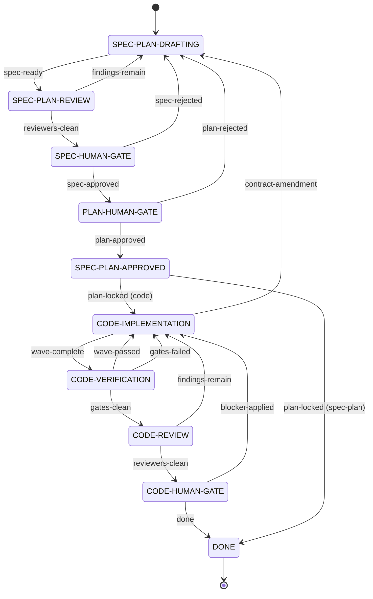

# Loop infrastructure

## 1. Purpose and boundary

The execution harness tracks work-loop phases and cohort state for one spec
directory. `loop-engine.py` advances the finite-state machine.
`loop-cohort.py` records cohort execution state.

The harness does not create requirements or implement work. It consumes approved
specification and plan artifacts.

## 2. Entrypoints

- `loop-engine.py`: `init`, `transition`, `status`, and `reset`.
- `loop-cohort.py`: `init`, `identity`, `status`, `approve-plan`,
  `schedule`, `check`, wave, and review commands.
- `check-spec-status.py`: validates a requested status in `spec.md` or
  `plan.md`.

## 3. Owned state and write authority

| State | Location | Write authority | Readers |
| --- | --- | --- | --- |
| FSM phase state | `docs/specs/**/engine-state.json` (gitignored) | `loop-engine.py` | Harness operators |
| Cohort state | `docs/specs/**/state.json` (gitignored) | `loop-cohort.py` | Harness operators and engine guards |
| Transition events | `.loop-run/events.jsonl` (ephemeral) | `loop-engine.py` | Harness operators and workspace MCP |

## 4. Dependencies and allowed edges

`loop-engine.py` reads spec and plan status, then invokes `loop-cohort.py`
identity and schedule checks before guarded transitions. `check-spec-status.py`
imports the canonical status parser from `lint-spec-status.py`.

The engine reads cohort state but does not write it. The cohort tool does not
advance FSM phase state.

## 5. Primary flows

1. `loop-engine.py init` creates FSM state and emits a run identifier.
   `loop-cohort.py init` adopts that identifier.
2. A guarded engine transition verifies required artifact status and cohort
   identity. Code transitions also verify the scheduled plan remains current.
3. `loop-cohort.py` records plan approval, scheduling, attempts, waves, and
   review evidence. `loop-engine.py` records phase transitions and events.

### The phase machine

Ten states and eighteen transitions. Ten edges move forward; **eight move
backward**, so rework is not an exception path but nearly half the machine —
`contract-amendment` alone returns a run five phases, from implementation to
drafting. `loop-engine.py`'s transition tables are the authority; this diagram
renders them.

`plan-locked` is the one event whose target depends on mode: it seals the
baseline and hands off to implementation in `code` mode, and terminates the run
in `spec-plan` mode. The three `*-HUMAN-GATE` states are where the run waits on
a person; every other state is agent work.

### TDD stub artifact boundary

For a full-mode TDD task, `plan.md` owns the exact stub code and its validation
result before approval. PLAN compiles and exercises that code from
disposable scratch, so the proof participates in the approved plan hash without creating a
repository test file. In `spec-plan` mode, `plan-locked` is terminal and no
implementation artifact is written.

In code mode, `plan-locked` advances the engine to `CODE-IMPLEMENTATION`.
EXECUTE then materializes the approved block unchanged at the repository's real
test path, verifies byte identity, observes the intended red, and continues to
green. The engine owns the phase boundary; the plan and test tree own different
representations on either side of it.

## 6. Failure and recovery behavior

A failed guard blocks the transition. A run-identifier mismatch blocks cohort
mutation. A changed plan blocks code transitions until scheduling is current.

Both state writers use `tempfile.mkstemp` and `os.replace` in the target
directory. A crash leaves either the previous JSON or the replacement JSON.
`reset` is the explicit recovery action.

## 7. Observability and evidence

Both tools expose `status --json`. `engine-state.json` and `state.json` record
phase and cohort state; `loop-engine transition` appends one line per
transition to `.loop-run/events.jsonl` (ephemeral, gitignored). Workspace MCP
reads that stream.

The event line and the cohort's round payloads join on `<run_id>:<seq>`: the
engine writes the run identifier and sequence, and `loop-cohort` records a
round under `--operation-id <run_id>:<seq>`. So finding counts and
round-recurrence are read from cohort state through that join rather than
duplicated onto the line.

The envelope's field set, its export posture, its configuration route and what
a backend can do with it are a cross-cutting concern: see
[telemetry](telemetry.md).

## 8. Mechanical invariants

- `check-spec-status.py` blocks guarded transitions unless the requested
  `spec.md` or `plan.md` status is present.
- `loop-engine.py` checks cohort identity before every transition.
- `loop-engine.py` checks the current schedule before code transitions except
  `done`.
- `loop-cohort.py` requires `--expect-run-id` for cohort mutations.

## 9. Relevant ADRs

- [ADR-0061 — Loop infrastructure](../adr/0061-loop-infrastructure-phase-1.md)
- [ADR-0064 — Events JSONL as FSM event source](../adr/0064-events-jsonl-as-fsm-event-source.md)
- [ADR-0074 — Work loop owns its state lock](../adr/0074-the-work-loop-owns-its-state-lock.md)

## 10. Last verified against commit

`831f8e92f`
