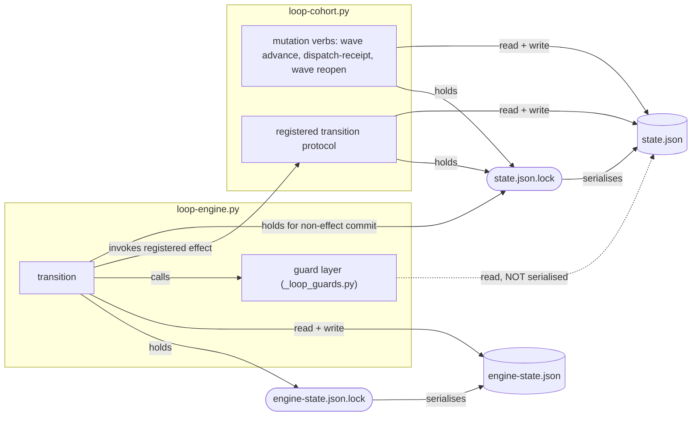
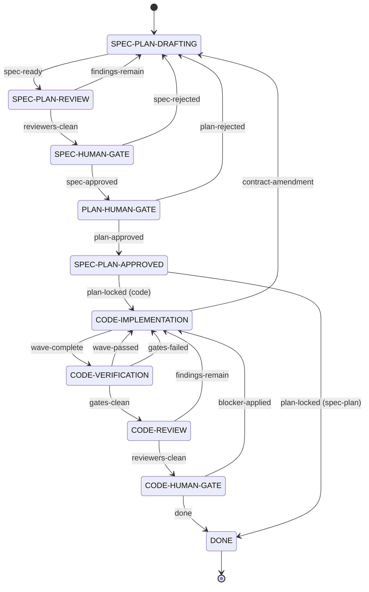
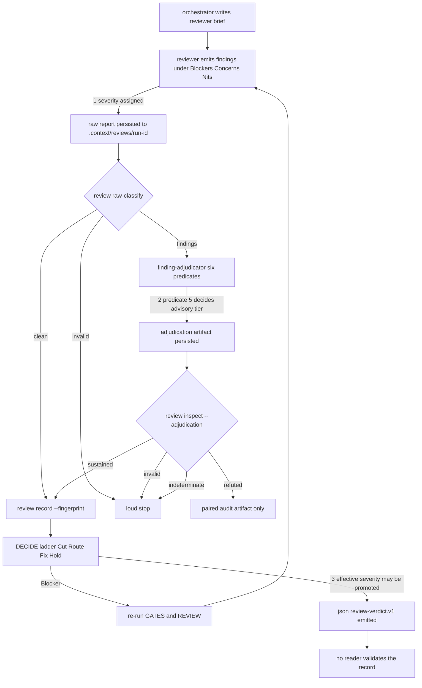
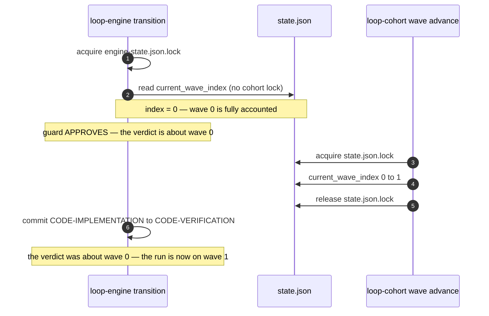

# Loop infrastructure

## 1. Purpose and boundary

The execution harness tracks work-loop phases and cohort state for one spec
directory. `loop-engine.py` advances the finite-state machine.
`loop-cohort.py` records cohort execution state.

The harness does not create requirements or implement work. It consumes approved
specification and plan artifacts.

The boundary runs the other way too, and it splits by **policy versus
mechanism** rather than by topic. `work-loop` decides *which* reviewers a change
warrants, when light or full mode applies, whether a simplify pass runs, and how
a session manages its context. The harness owns the machinery those decisions
feed: `loop-cohort.py` parses and classifies reviewer reports
(`review raw-classify`, `review inspect --adjudication`) and records the
resulting state.

So a reviewer-selection rule belongs in the `work-loop` skill and this page does
not restate it, while the classification contract that consumes the report
belongs here. A second copy of the selection rules would be falsified by the
next edit to the skill with nothing comparing the two.

### Sibling loops, and why only this one has an engine

`work-loop` is one of three loops, not the whole of the lifecycle.
`discovery-loop` sits upstream in `product-engineering` and `release-loop`
downstream in `release-engineering`, each run by its own supervisor agent —
`discovery-lead` and `release-lead` — that is a **peer** of `work-loop`'s
supervisor rather than a mode of it. They meet at numbered gates: discovery
hands off at **G3**, and the build hands off to release at **G4**, the point
where the build is locally done and deploy-ready.
[The three loops](../../guides/_shared/explanation/the-three-loops.md) is the
guide that reconciles the numbering across all three.

Neither sibling has an engine. `discovery-loop`'s transitions are file edits on
a typed sidecar; `release-loop` ships no executable engine. Both still have an orchestrating
agent and both keep state on disk; what neither has is a program that advances
it.
Everything on this page — the phase machine, the cohort state, the locks, the
replay markers — is `work-loop`'s alone. They also differ in install scope:
discovery ships at user scope, while build and release are repo-scoped.

## 2. Entrypoints

- `loop-engine.py`: `init`, `transition`, `status`, and `reset`.
- `loop-cohort.py`: `init`, `identity`, `status`, `approve-plan`,
  `schedule`, `check`, `reset`, wave, and review commands.
- `check-spec-status.py`: validates a requested status in `spec.md` or
  `plan.md`.

The parallel-execution verbs — `dispatch-decision`, `auto-parallel`, and
`worktree {preflight, add, record, list, merge, cleanup}` — are present in
`loop-cohort.py` but disabled: each exits non-zero with
`<verb> is disabled in Phase 1` and touches no state. ADR-0061 D5 defers
parallel-wave orchestration, so the verb surface is carved out and inert.

### How these scripts are invoked

`<skill-dir>` is the installer- or harness-supplied directory holding the active
`SKILL.md`. It is not a fixed repository path — an adopter's install location
differs from this repository's, and a harness may supply its own. So every
invocation resolves it and passes the script as one quoted argument from the
repository root:

```
python '<skill-dir>/scripts/loop-engine.py' …
python '<skill-dir>/scripts/lint-spec-status.py' --root .
```

A bare-relative `python scripts/loop-engine.py` is rejected by the work-loop
evaluation contract, because it silently resolves against the caller's working
directory rather than the installed skill.

These instructions are byte-identical across the generated Codex and Claude
projections; they are one source projected twice, not two copies to keep in
step.

### Three linters ship here, reached three different ways

A skill's `scripts/` directory is a first-class projecting surface, so
everything here reaches an adopter's tree. Three of these files are
linters — `lint-knowledge.py`, `lint-spec-status.py` and
`lint-traceability.py` — and the directory listing makes them look like peers.
They are not: each is reached by a different route, no route is discoverable
from the tree, and the routes disagree with the files' own headers in at least
one case.

Resolve the question per linter against the routes themselves — the shipped
`pre-pr.py` hook, the `work-loop` skill's finish-time checklist, other packs'
skills, and `tools/repo/build_gate_chain.py` for what this catalogue's CI
runs. Do not infer a linter's route from a sibling's, and do not infer it from
the linter's own module docstring.

Two facts do hold across all three. CI runs the **projected** copy rather than
the pack source. And none of it is a literal Makefile line, so grepping the
Makefile and finding nothing is not evidence that a linter is ungated.

## 3. Owned state and write authority

| State | Location | Write authority | Readers |
| --- | --- | --- | --- |
| FSM phase state | `docs/specs/**/engine-state.json` (gitignored) | `loop-engine.py` | Harness operators |
| Cohort state | `docs/specs/**/state.json` (gitignored) | `loop-cohort.py`; the engine invokes that module in-process for registered effects (see § 4) | Harness operators and engine guards |
| Transition events | `.loop-run/events.jsonl` (ephemeral) | `loop-engine.py` | Harness operators and workspace MCP |

### Concurrency control

Each state file has exactly one writer and its own advisory lockfile, taken
through `_statelock.py` (ADR-0074). The two locks are distinct files and know
nothing of each other: holding one says nothing about the other.

`loop-engine.py` holds `engine-state.json.lock` across a whole `transition` —
the state-machine table lookup, the plan-hash pre-guard, the event guard, the
registered cohort effect, and the outbox finalisation — so the
read-decide-write section is atomic against a second engine process.
`loop-cohort.py` holds `state.json.lock` for each mutation verb and for each
marker/effect commit in the registered-transition protocol.

The engine's guard layer reads cohort state without taking the cohort lock, and
the diagram marks those reads as unserialised. For a registered effect, the
engine calls `loop-cohort.py` while still holding the engine lock. The cohort
module acquires its own lock to persist the marker, releases it, and later
acquires it again to reclassify and commit the effect, history entry, and marker
clear together. The diagram shows both the unlocked guard read and the
engine-invoked writer path.


```mermaid
flowchart LR
  subgraph EP["loop-engine.py"]
    ET["transition"]
    EG["guard layer (_loop_guards.py)"]
  end
  subgraph CP["loop-cohort.py"]
    CV["mutation verbs: wave advance, dispatch-receipt, wave reopen"]
    CT["registered transition protocol"]
  end

  EL(["engine-state.json.lock"])
  CL(["state.json.lock"])
  ES[("engine-state.json")]
  CS[("state.json")]

  ET -- holds --> EL
  EL -- serialises --> ES
  ET -- "read + write" --> ES
  ET -- calls --> EG
  ET -- "invokes registered effect" --> CT
  ET -- "holds for non-effect commit" --> CL

  CV -- holds --> CL
  CL -- serialises --> CS
  CV -- "read + write" --> CS
  CT -- holds --> CL
  CT -- "read + write" --> CS

  EG -. "read, NOT serialised" .-> CS
```

The two domains **are** nested on two paths. For a registered effect, the engine
loads `loop-cohort.py` as a module and calls its transition functions while the
engine lock is held; those functions take the cohort lock. For a non-effect
transition, the engine takes the cohort lock directly across fingerprint
revalidation and the engine-state commit. Neither path holds the cohort lock
across a subprocess.

The order is fixed and acyclic. `loop-cohort.py` never reads `engine-state.json`,
so no site takes the pair the other way, and engine-then-cohort is the only
ordered pair that exists.

## 4. Dependencies and allowed edges

`loop-engine.py` reads spec and plan status, then invokes `loop-cohort.py`
identity and schedule checks before guarded transitions. `check-spec-status.py`
imports the canonical status parser from `lint-spec-status.py`.

The engine does not write or unlink cohort `state.json` directly. ADR-0125 D3
keeps `loop-cohort.py` as its writer of record; the cohort tool likewise does
not advance FSM phase state. The engine guard layer may read cohort state
directly in-process through `_loop_guards.read_state`, which is the unserialised
read shown in § 3.

ADR-0125 D1 departs from ADR-0061's pure-referee split: an eligible engine event
now causes its cohort effect as part of the transition by invoking
`loop-cohort.py`. ADR-0125 D2 closes that authority to five events:
`contract-amendment`, `wave-passed`, `gates-failed`, `findings-remain`, and
`reviewers-clean`. The two review events have effects only on their
`CODE-REVIEW` edges; the same event names on `SPEC-PLAN-REVIEW` remain
effect-free. Every other event gains no cohort-write authority and skips the
registered-transition protocol.

### Reopen obligation on three backward edges

Three backward edges require a skill-invoked wave reopen before they can fire:
`gates-failed` from `CODE-VERIFICATION`, `findings-remain` from `CODE-REVIEW`,
and `blocker-applied` from `CODE-HUMAN-GATE`. The controller runs
`loop-cohort wave reopen` before firing any of these; the guard refuses while
the current wave holds a live dispatch record, so the wave exit cannot be
discharged twice from one set of records.

## 5. Primary flows

1. `loop-engine.py init` creates FSM state and emits a run identifier.
   `loop-cohort.py init` adopts that identifier.
2. A guarded engine transition verifies required artifact status and cohort
   identity. Code transitions also verify the scheduled plan remains current.
3. `loop-cohort.py` records plan approval, scheduling, attempts, waves, and
   review evidence. `loop-engine.py` records phase transitions and events.

### The phase machine

Ten states and eighteen transitions. Ten edges move forward; **eight move
backward**, so rework is not an exception path but nearly half the machine —
`contract-amendment` alone returns a run five phases, from implementation to
drafting. `loop-engine.py`'s transition tables are the authority; this diagram
renders them.


```mermaid
stateDiagram-v2
  direction TB
  SP_DRAFTING : SPEC-PLAN-DRAFTING
  SP_REVIEW : SPEC-PLAN-REVIEW
  S_HUMAN_GATE : SPEC-HUMAN-GATE
  P_HUMAN_GATE : PLAN-HUMAN-GATE
  SP_APPROVED : SPEC-PLAN-APPROVED
  C_IMPLEMENTATION : CODE-IMPLEMENTATION
  C_VERIFICATION : CODE-VERIFICATION
  C_REVIEW : CODE-REVIEW
  C_HUMAN_GATE : CODE-HUMAN-GATE

  [*] --> SP_DRAFTING

  SP_DRAFTING --> SP_REVIEW : spec-ready
  SP_REVIEW --> S_HUMAN_GATE : reviewers-clean
  S_HUMAN_GATE --> P_HUMAN_GATE : spec-approved
  P_HUMAN_GATE --> SP_APPROVED : plan-approved
  SP_APPROVED --> C_IMPLEMENTATION : plan-locked (code)
  C_IMPLEMENTATION --> C_VERIFICATION : wave-complete
  C_VERIFICATION --> C_REVIEW : gates-clean
  C_REVIEW --> C_HUMAN_GATE : reviewers-clean
  C_HUMAN_GATE --> DONE : done
  SP_APPROVED --> DONE : plan-locked (spec-plan)

  SP_REVIEW --> SP_DRAFTING : findings-remain
  S_HUMAN_GATE --> SP_DRAFTING : spec-rejected
  P_HUMAN_GATE --> SP_DRAFTING : plan-rejected
  C_IMPLEMENTATION --> SP_DRAFTING : contract-amendment
  C_VERIFICATION --> C_IMPLEMENTATION : wave-passed
  C_VERIFICATION --> C_IMPLEMENTATION : gates-failed
  C_REVIEW --> C_IMPLEMENTATION : findings-remain
  C_HUMAN_GATE --> C_IMPLEMENTATION : blocker-applied

  DONE --> [*]
```

`plan-locked` is the one event whose target depends on mode: it seals the
baseline and hands off to implementation in `code` mode, and terminates the run
in `spec-plan` mode. The three `*-HUMAN-GATE` states are where the run waits on
a person; every other state is agent work.

### The review and classification sequence

Severity is assigned in three places and validated in none. `loop-cohort.py`
parses a report's shape and computes fingerprints. Nothing reads the emitted
`review-verdict.v1` block.


```mermaid
flowchart TD
  BRIEF[orchestrator writes reviewer brief]
  REV[reviewer emits findings under Blockers Concerns Nits]
  RAW[raw report persisted to .context/reviews/run-id]
  CLS{review raw-classify}
  ADJ[finding-adjudicator six predicates]
  ADJART[adjudication artifact persisted]
  INSP{review inspect --adjudication}
  REC[review record --fingerprint]
  DEC[DECIDE ladder Cut Route Fix Hold]
  GATES[re-run GATES and REVIEW]
  VERD[json review-verdict.v1 emitted]
  NOVAL[no reader validates the record]

  BRIEF --> REV
  REV -->|1 severity assigned| RAW
  RAW --> CLS
  CLS -->|clean| REC
  CLS -->|invalid| STOP[loud stop]
  CLS -->|findings| ADJ
  ADJ -->|2 predicate 5 decides advisory tier| ADJART
  ADJART --> INSP
  INSP -->|refuted| AUDIT[paired audit artifact only]
  INSP -->|invalid| STOP
  INSP -->|indeterminate| STOP
  INSP -->|sustained| REC
  REC --> DEC
  DEC -->|3 effective severity may be promoted| VERD
  DEC -->|Blocker| GATES
  GATES --> REV
  VERD --> NOVAL
```

Full mode iterates `adversarial-reviewer` until no unresolved Blocker **or
Concern** remains, so both return the loop to GATES. The rungs differ in
disposition rather than in whether they iterate: a Concern may be applied only
when the accepted contract and the bundled-fixes carve-out authorise it, and
required work that cannot share the unit moves to the next. Nits are deferred
with their citation.

The adjudicator may **lower** a reviewer's severity and may not raise it. Its
fifth predicate is what lowers a consequence to advisory: a defect nothing
external establishes, or a citation whose every surface the target marks as
working material rather than contract. A disposition-changing severity conflict
returns `indeterminate` for owner direction.

That first test reads the defect, not the remedy. A finding several defensible
repairs could fix is still established, and stays eligible for blocking
severity.

That ceiling is honoured in practice. Across 2,062 adjudicator entries declaring
a consequence advisory, 98% sustained at Concern or Nit; per run, 13 of 15 runs
with at least 20 such entries were perfectly compliant. No entry in that corpus
records which reading of the test its adjudicator applied, so how consistently
runtimes apply it can only be measured by re-labelling a sample, not read off
the entries.
[`review-loop-nonconvergence-survey.md`](../product/research/review-loop-nonconvergence-survey.md)
holds both re-labelling runs and what each established.

### TDD stub artifact boundary

For a full-mode TDD task, `plan.md` owns the exact stub code and its validation
result before approval. PLAN compiles and exercises that code from
disposable scratch, so the proof participates in the approved plan hash without creating a
repository test file. In `spec-plan` mode, `plan-locked` is terminal and no
implementation artifact is written.

In code mode, `plan-locked` advances the engine to `CODE-IMPLEMENTATION`.
EXECUTE then materializes the approved block unchanged at the repository's real
test path, verifies byte identity, observes the intended red, and continues to
green. The engine owns the phase boundary; the plan and test tree own different
representations on either side of it.

## 6. Failure and recovery behavior

A failed guard blocks the transition. A run-identifier mismatch blocks cohort
mutation. A changed plan blocks code transitions until scheduling is current.

Both state writers use `tempfile.mkstemp` and `os.replace` in the target
directory. A crash leaves either the previous JSON or the replacement JSON.
`reset` is the explicit recovery action.

### Re-planning after plan approval

Three situations arise once `approved_plan_hash` is written, and they take three
different routes.

| Situation | Route | Preserves completed work |
| --- | --- | --- |
| An accepted criterion proves genuinely separable | `contract-amendment` from `CODE-IMPLEMENTATION`, with scope-owner authority, a reason reference, and per-task completed evidence | yes, via the evidence payload |
| Execution produces an observation the plan predicted | the work-loop's verification ledger, which is not hash-pinned and needs no amendment | n/a — the plan does not change |
| The plan's approach is wrong | `reset`, then a new run | **no** |

**The third row is enforced, not merely advised.**
`validate_completed_task_sections` returns a refusal "when an amended plan
rewrites completed work": `completed_task_section_hashes` holds an exact SHA-256
per completed task section, and both `approve-plan` and `schedule` refuse an
amended plan that edits, removes, or renames one. So an approach change that
reaches completed work cannot be amended in place — the pin refuses it — and an
amendment that leaves those sections untouched has not changed the approach for
them. In-place re-planning is therefore closed by construction, which is the
mechanism behind ADR-0061's *Tradeoff accepted*: "any post-approval plan change
requires a full reset."

**What reset costs** is recorded as an invariant in
[§ 8](#8-mechanical-invariants): the recovery is correct and the run record does
not survive it.

**Editing `plan.md` outside these routes strands the run.** The schedule guard
compares against the pinned `plan_hash` on every `CODE-*` transition, so a direct
edit leaves every subsequent transition refusing with no forward edge; reset is
then the only exit, at the cost above.

### Durable markers close the transition crash windows

Two durable records make an interrupted transition recoverable.

| Marker | Where | Window it closes |
| --- | --- | --- |
| `pending_transition` plus the last `transition_history` entry | cohort `state.json` | a registered marker or cohort effect landed but engine-state did not |
| `events.pending` | `.loop-run/` | engine-state was written but the `events.jsonl` append did not happen |

For a registered effect, `cmd_transition` commits the cohort side first and
writes engine state last. Replaying the same engine command therefore completes
an absent effect or recognizes the last matching history entry without applying
the effect twice. A legacy or manually-created engine-first divergence uses the
same registered protocol after re-checking the schedule.

`pending_transition` is the short-lived durable marker for the registered
cohort-effect transition in progress. `transition_history` is the single replay
ledger and replaces `amendment_history`; `contract-amendment` keeps the same
artifact pin by re-reading `plan.md` and re-running
`validate_completed_task_sections`, while the other registered effects reduce
`applied` to the last history match. History retention drops oldest entries
only when the whole cohort state would exceed 1 MiB, and this is safe because
the replay predicate reads the last entry only.

The closed registry is `contract-amendment`, `wave-passed`, `gates-failed`,
`findings-remain`, and `reviewers-clean`. The two review events own cohort
effects only on their `CODE-REVIEW` edges; their `SPEC-PLAN-REVIEW`
pre-execute edges remain legal engine transitions with no cohort review effect
and no review-counter increment. For CODE-review effects, the engine passes the
durable transition id as the cohort review `operation_id`, so replay repeats the
same `loop-engine transition` command rather than a separate
`loop-cohort review record` or a manual authorization gate.

Cohort state is schema 2 and engine state remains schema 1. A run crossing the
boundary is refused rather than migrated; the authorized recovery is the
destructive pair `loop-cohort reset` then `loop-engine reset`.

### A wave-exit verdict is not serialised against the wave pointer

The `wave-complete` guard decides whether every task in the **current** wave
carries a dispatch receipt. It learns which wave is current by reading
`current_wave_index` from cohort state, unlocked. `loop-cohort wave advance`
moves that same field under the cohort lock. Nothing orders the two, so a
verdict reached about wave `n` can be committed after the pointer has left
wave `n`.


```mermaid
sequenceDiagram
  autonumber
  participant E as loop-engine transition
  participant S as state.json
  participant C as loop-cohort wave advance

  E->>E: acquire engine-state.json.lock
  E->>S: read current_wave_index (no cohort lock)
  Note over E,S: index = 0 — wave 0 is fully accounted
  Note over E: guard APPROVES — the verdict is about wave 0
  C->>S: acquire state.json.lock
  C->>S: current_wave_index 0 to 1
  C->>S: release state.json.lock
  E->>E: commit CODE-IMPLEMENTATION to CODE-VERIFICATION
  Note over E: the verdict was about wave 0 — the run is now on wave 1
```

The consequence lands one transition later, not here. `gates-clean` asks only
whether the current wave is the last one; wave 1 is, so it passes. Wave 1 is
entered and exited with no guard ever reading its receipts, using sanctioned
verbs alone and no direct state write.

The interleaving needs two concurrent processes against one spec directory, so
it is unreachable from the sequential single-controller flow that Phase 1
supports.

**This is now serialised, and the diagram above shows the pre-serialisation
behaviour.** For a non-effect transition, `cmd_transition` fingerprints cohort
`state.json` before its first cohort read and re-reads it under the cohort lock
before committing, refusing when it moved; the mutator above can no longer land
in that window undetected. Registered effect edges skip that fingerprint rail
because they intentionally mutate cohort state, and instead reclassify marker
and history under the lock owned by `loop-cohort.py`. See
[`loop-parallelism.md` § 2](loop-parallelism.md#2-serialising-a-transition-against-cohort-state)
for the mechanism and, importantly, for the residuals it does not close.

One residual bears on this section directly. The consequence this section names
— `gates-clean` asking only whether the current wave is the last, so a wave is
entered and exited with no guard reading its receipts — is **not** closed by
serialisation: it needs no interleaving at all. An advance that lands before the
`gates-clean` guard runs produces it with every read consistent. That is a
missing check rather than a lost race, and it remains open.

## 7. Observability and evidence

Both tools expose `status --json`. `engine-state.json` and `state.json` record
phase and cohort state; `loop-engine transition` appends one line per
transition to `.loop-run/events.jsonl` (ephemeral, gitignored). Workspace MCP
reads that stream.

Review-round correlation has two forms. A direct or pre-EXECUTE `review record`
uses `<run_id>:<seq>`, which joins directly to the engine event carrying that
run and sequence. A registered CODE-REVIEW effect uses its SHA-256
`transition_id` as the review operation id. Its retained `transition_history`
entry carries that id, the event, and `pre_transition_sequence`; it correlates
to the engine event with the same run and event at sequence
`pre_transition_sequence + 1`. Finding counts and round recurrence remain on
the cohort side rather than being duplicated onto the event line. Because old
history entries may be truncated, that second correlation is available only
while the corresponding history entry is retained.

The envelope's field set, its export posture, its configuration route and what
a backend can do with it are a cross-cutting concern: see
[telemetry](telemetry.md).

## 8. Mechanical invariants

- `check-spec-status.py` blocks guarded transitions unless the requested
  `spec.md` or `plan.md` status is present.
- `loop-engine.py` checks cohort identity before every transition.
- `loop-engine.py` checks the current schedule before code transitions except
  `done`.
- `loop-cohort.py` requires `--expect-run-id` for cohort mutations.
- Each state file is written under its own advisory lock, so a read-modify-write
  on one file is atomic against another process running the same tool.
- The `spec-plan` `findings-remain` edge is guarded, but by a counter nothing
  on that path increments. `loop-engine.py` maps
  `("spec-plan", "findings-remain")` to the same `_guard_check_phase_review`
  the code path uses, and that guard refuses at
  `review_retry_count >= max_review_retries`. A registered CODE-REVIEW
  `findings-remain` effect increments `review_retry_count` through
  `loop-cohort.py`; direct `review record --fingerprint` does the same for the
  separate bounded evidence-replacement path. An ordinary pre-EXECUTE round
  uses neither writer. The work-loop skill's `references/pre-execute-review.md`
  states that separation deliberately.
  So an ordinary spec/plan revision cycle reads `0/5` on every round and the
  cap never fires. Whether such a loop stops is therefore an orchestrator
  judgement, not a mechanical refusal. Reproduced directly: twelve consecutive
  `findings-remain` transitions in `mode=code` all succeeded with
  `review_retry_count` at `0`. ADR-0061's *Revisit if* clause names a bounded
  round cap for unattended `spec-plan` runs (D5); no such change is designed.
- **`reset` destroys the run record.** `loop-cohort reset` is `path.unlink()` on
  `state.json` with no archive, so `completed_task_ids`,
  `completed_task_section_hashes`, `review_round_count`, `review_retry_count`,
  `pending_transition`, `transition_history`, and `dispatch_receipts` are lost
  rather than set aside.
  Because in-place re-planning is closed by construction (§ 6), reset is the only
  recovery from a wrong plan approach, so this loss is on the sole exit from that
  situation. Known defect.
- Cross-domain transition commits use one of two mechanical rails. Non-effect
  transitions revalidate the whole cohort fingerprint while holding the cohort
  lock; registered effect edges reclassify marker/history under the cohort
  module's lock before the engine-state commit. This prevents a concurrent
  cohort write from silently invalidating the transition's earlier reads, but
  it does not add a missing guard such as the `gates-clean` receipt check
  described in § 6.

## 9. Relevant ADRs

Measured behaviour of the review loop — round depth, cap firings, repair-origin
rate, and what does and does not bound a loop — is recorded in
[the review-loop non-convergence survey](../product/research/review-loop-nonconvergence-survey.md).
Consult it before proposing a new bound; it records eleven mechanisms tested and
not shipped.


- [ADR-0061 — Loop infrastructure](../adr/0061-loop-infrastructure-phase-1.md)
- [ADR-0064 — Events JSONL as FSM event source](../adr/0064-events-jsonl-as-fsm-event-source.md)
- [ADR-0074 — Work loop owns its state lock](../adr/0074-the-work-loop-owns-its-state-lock.md)
- [ADR-0125 — Durable transitions make four cohort mutations engine-invoked](../adr/0125-engine-invoked-cohort-mutations.md)

## 10. Maintainer Procedure — Acceptance Shadow Services

The following commands let maintainers verify parity, recovery, and reversal for
the Slice 1 callable shadow acceptance services without reading the delivery
spec. All commands run from the repository root.

### Enable shadow mode

Set `WORK_LOOP_SHADOW_SERVICES=1` before a `loop-engine transition` call to
activate shadow evaluation. The current engine keeps all authority; shadow
results write under `<spec-dir>/.shadow-acceptance/` and are not authoritative.

```bash
WORK_LOOP_SHADOW_SERVICES=1 python '<skill-dir>/scripts/loop-engine.py' transition …
```

### Policy import (approval and initial-plan-review)

Run the policy-import suite to verify that legacy canonicalization matches the
target, that atomic import exposes exactly zero or two records on failure, and
that protected-change classification works without dispatching task state:

```bash
python3 -m pytest packs/core/tests/skills/work-loop/test_policy_import.py -q
```

### Rehydration (cold-start verdict recovery)

Run the cold-rehydration benchmark to verify that deleting derived indexes and
replaying all evidence records from a fresh process reproduces the pre-interruption
verdict within 10 seconds for 1,000 criteria and 100,000 receipts:

```bash
python3 -m pytest packs/core/tests/skills/work-loop/test_cold_rehydration_benchmark.py -q
```

### Reversal (disable shadow services)

To restore the legacy-only path, unset the environment variable. No shadow facts
are deleted; the current engine resumes its authoritative path, and shadow records
remain for later reinspection:

```bash
unset WORK_LOOP_SHADOW_SERVICES
```

The compatibility facade suite verifies that disabling target calls restores the
legacy path and that a missing accepted governance record refuses every
authority-switch attempt:

```bash
python3 -m pytest packs/core/tests/skills/work-loop/test_compat_facade.py -q
```

### Cross-adapter conformance

Run the conformance roll-up to verify that projected Core pack copies are
byte-identical to source (so every pack-suite assertion covers the projected
copies) and that the cross-adapter corpora pass:

```bash
python3 -m pytest tests/roster/test_t9a_conformance_rollup.py -q
```

Run the clean-environment fence to verify that every work-loop runtime script
imports only the standard library or its own sibling modules, and that shadow
mode completes in a subprocess where `agentbundle` is not importable:

```bash
python3 -m pytest tests/roster/test_t9a_clean_env_fence.py -q
```

Run the full new-module suite for a complete Slice 1 evidence pass:

```bash
python3 -m pytest \
  packs/core/tests/skills/work-loop/test_policy_import.py \
  packs/core/tests/skills/work-loop/test_evidence_store.py \
  packs/core/tests/skills/work-loop/test_compat_facade.py \
  packs/core/tests/skills/work-loop/test_acceptance_benchmark.py \
  packs/core/tests/skills/work-loop/test_cold_rehydration_benchmark.py \
  tests/roster/test_t9a_conformance_rollup.py \
  tests/roster/test_t9a_clean_env_fence.py \
  -q
```

## 11. Last verified against commit

`8d30c6f6c` for the whole page. §§ 3, 4 and 6 were re-verified against the
change that added the cohort-state identity check they now describe; the rest
of the page has not been re-audited since `8d30c6f6c`, so that is what this
marker records.
