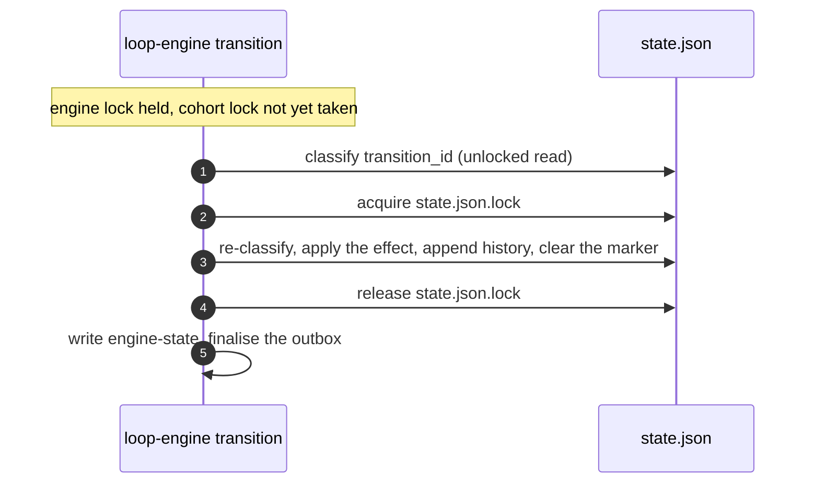

# Durable transitions and within-wave parallelism

**STATUS: § 2 implemented; §§ 1, 3 and 4 planned.**

This document states decisions and their costs. Shipped behaviour the baseline
records is cited from [`loop-infrastructure.md`](loop-infrastructure.md);
shipped behaviour it does not record is stated here with its source.

Four changes are scoped here. None switches concurrent execution on: lifting
ADR-0061 **D5** is a fifth change this document does not scope.

## 1. Durable transitions

**Decision.** Generalise the replay marker that `contract-amendment` carries
([§ 6](loop-infrastructure.md#6-failure-and-recovery-behavior)) to every event
with a cohort effect, so no crash window depends on a person executing a
recovery table.

```
transition_id      = H(run_id, pre_transition_sequence, event, canonical(event_args))
pending_transition = {transition_id, event, args, opened_at}   -- cohort state.json
status(spec_dir, transition_id) ->
    applied   iff the transition history's last entry is transition_id
              and the artifacts the effect derived from still match what it pinned
    conflict  iff the history's last entry carries this pre_transition_sequence
              under a different transition_id, or that artifact check fails
    absent    iff no history entry carries this pre_transition_sequence
```



An event with no cohort effect skips steps 2 to 4.

### Effect registry

| Event | Cohort verb | Args from | Artifacts pinned |
| --- | --- | --- | --- |
| `contract-amendment` | `apply_contract_amendment` | owner authority, reason, completed-task evidence | `plan.md`, via `validate_completed_task_sections` |
| `wave-passed` | `wave advance` | `last_event_context.completed_wave_index` | none |
| `gates-failed` | `record-attempt` | the pre-transition sequence | none |
| `findings-remain` | `review record` | the pre-transition sequence | none |
| `reviewers-clean` | `review record` | the pre-transition sequence | none |

Where nothing is pinned, `applied` reduces to the history match alone.

The other ten events need no effect.

### Three departures from shipped behaviour

Each is a deliberate change, not an inheritance.

**`absent` means no history entry, not no marker.** Shipped code short-circuits
on a `None` marker before reading history, so its classification depends on the
marker outliving the transition. Inverting that lets the marker be short-lived —
cleared inside the critical section, as the diagram shows — but only because
`absent` no longer reads it.

**The key is the pre-transition sequence, and it is persisted.** Shipped code
carries three conventions: the sequence of the transition itself — computed as
`transition_sequence + 1` before engine-state advances and unincremented after,
which is one convention read from two vantage points — plus
`<run_id>:<transition_sequence>` on the session-resumption verbs and
`completed_wave_index` on `wave-passed`.

Collapsing to a single reading would make the key unrecoverable once engine-state
has advanced, losing the divergence-direction recovery. The design therefore
stores `pre_transition_sequence` on the marker and on each history entry, and
reads it from there rather than re-deriving it. Engine-state is written last for
crash ordering **and** for key stability.

**One unified transition history replaces per-event records.** A per-verb
`applied` predicate is rejected: it makes classification differ by event, which
is the ambiguity the marker exists to remove.

### The schema change

`pending_transition` and the unified history are new keys in `state.json`.
`SCHEMA_VERSION` is triplicated across `loop-cohort.py`, `_loop_guards.py` and
`loop-engine.py` and stamped on both state files, so the design must say whether
one version moves or two — a cohort-only key addition bumped naively invalidates
every engine-state file too.

An in-flight run meeting the new engine is refused, not migrated. Recovery is the
destructive reset pair — `loop-cohort reset` then `loop-engine reset` — which
`references/session-resumption.md` gates on explicit human authorization and
which discards retry and review progress; `spec.md` and `plan.md` survive. That
reset deletes `state.json`, so no marker survives the upgrade and none needs
translating. Rolling the engine back after new state exists costs the same pair
in the other direction, and nothing preserves the run.

**Retention.** The shipped `amendment_history` bound is a hard refusal at
`MAX_AMENDMENT_HISTORY = 20` plus a 1 MiB aggregate ceiling. That bound cannot
carry over: `gates-failed` alone can fire repeatedly in one run, so refuse-at-20
would halt an ordinary retry-heavy run. The unified history truncates oldest
instead, which is safe only because `applied` reads the last entry alone. The
design must also say whether it replaces `amendment_history` or sits beside it,
since `contract_amendment_replay_status` and `cmd_status` both read the existing
one.

## 2. Serialising a transition against cohort state

**Decision.** `cmd_transition` fingerprints cohort `state.json` before its first
cohort read, re-reads it under the cohort lock before committing, and refuses
when it moved. The fingerprint is a sha256 over the canonical parsed form, read
through the guard layer's exported bounded reader. Every event takes the check
except `contract-amendment` ([§ 6](loop-infrastructure.md#6-failure-and-recovery-behavior)
describes the race this closes).

**Whole state, not a field subset.** Two earlier designs asked which cohort
facts a verdict depended on and answered per guard — first as pinned fields,
then as a guard re-evaluation over a derived set. Both shipped an answer that
looked complete. The pinned set missed the unsupported-schema and
absent-container rows of the wave-exit verdict, which approve without reading
the wave pointer at all. The derived set missed the `run_id` preflight and the
budget snapshot, neither of which is a `_GUARDS` entry. The set of cohort reads
a commit consumes is not something a rule over guard names can enumerate, so the
engine stops enumerating.

**Read through the bounded reader, never a raw open.** A raw read of a
non-regular `state.json` inside the hold blocks until both locks are judged
stale and a second writer is admitted — strictly worse than holding no lock at
all. `_loop_guards._read_managed_bytes` documents that hazard at exactly this
step, and the engine reaches it through the exported `read_state`. ADR-0061
**D3**'s read-channel clause already carries the
[2026-09-22 erratum](../adr/0061-loop-infrastructure-phase-1.md) recording that
the guard layer reads `state.json` directly rather than through the five
designated verbs; this read is a further instance of that recorded drift, not a
new class, so it opens no decision the erratum has not already parked.

**Unconditional, not gated on the parallelism flag.** Gating on `auto_parallel`
was considered and rejected on measurement. The race is reachable today only by
two hand-driven processes on one spec directory, and a flag that is always false
in Phase 1 would leave exactly that case unprotected. A conditional guard also
fails silently when the condition is misread.

**Cost, uncontended.** One acquire–release plus one bounded cohort read per
checked transition. The acquire–release measures 17.84 ms median with calls
spaced as in a real run. No ratio against a transition median is quoted here:
the published 738.6 ms figure rests on three `git rev-parse --show-toplevel`
calls per transition, and `_get_repo_root` memoises per working directory, so
re-derive the baseline on the tree in hand before quoting one.

**Cost, contended — the dominant case, and it is not the fingerprint.**
`_statelock`'s acquisition timeout is 10 s while a healthy cohort verb may hold
for `GIT_TIMEOUT_S` = 20 s per spawn edge. A non-exempt transition that overlaps
an ordinary cohort verb therefore waits the full 10 s and refuses on
*acquisition*, not on a fingerprint mismatch — and it waits inside the engine
lock, so every other engine verb for that spec stalls with it. Two orders of
magnitude above the uncontended figure, fail-closed and retryable, but the
figure to plan against.

The ordering is safe: the engine-then-cohort nested hold is already live
([§ 3](loop-infrastructure.md#3-owned-state-and-write-authority)).

### What this does not close

Eight residuals, each disclosed rather than fixed.

1. **Any concurrent cohort write refuses**, including a benign `dispatch-receipt`
   that would only have made a verdict more true. Fail-closed, retryable, and
   unreachable in a sequential single-controller run.
2. **`contract-amendment` is exempt**, because its own effect writes cohort
   state and its fingerprint therefore always differs. That exemption also keeps
   the hold from enclosing `apply_contract_amendment`, which takes the cohort
   lock itself on a lock that is not reentrant — but it means the transition
   that rewrites the approved baseline is the one this check does not cover.
3. **The hold serialises cohort `state.json` only.** Every other guard input in
   and under the spec directory — `spec.md` and `plan.md` status and hashes, any
   artifact `check_artifact_status` stats, the bundled retry-cap defaults —
   stays exactly as unserialised as before.
4. **The check is endpoint identity, not interval quiescence.** It compares two
   samples, so a write-and-revert inside the window would leave a guard having
   judged an intermediate state while the commit proceeds. No shipped cohort
   verb *appears able* to produce that reversion, which is why it is disclosed
   rather than closed.
5. **Two cohort-lock failure classes are not retryable.** A non-regular
   `state.json.lock` raises immediately, and a lock record this tool did not
   write is never reclaimed however old it is. Both need the file removed by
   hand, and they now block every non-exempt engine transition rather than only
   cohort verbs. The realistic trigger is a foreign or other-uid lock file.
6. **Any failure sentinel observed at both samples compares equal** and admits
   the commit. The four sentinels prevent a cross-class collision and do nothing
   about a same-class one: absent twice compares equal, as does non-regular
   twice. Reaching it needs a foreign writer to break, heal and re-break
   `state.json` inside one transition, because at least one intermediate guard
   read must succeed — and that load rests entirely on the `run_id` preflight's
   `check_identity`, since the budget snapshot swallows every exception.
7. **Acquisition timeout is the dominant contended refusal**, not the
   fingerprint mismatch, because the 10 s acquisition timeout is shorter than a
   cohort verb's own possible hold. The wait extends the engine-lock hold, so
   the whole spec's engine surface stalls for it. See the contended cost above.
8. **A cohort-lock reclaim mid-hold** is reported, and what it means depends on
   which exit the body took. If the engine-state write had landed, the
   transition is durable behind a non-zero exit and the skipped outbox
   finalisation leaves an `events.pending` that `_recover_pending` completes on
   the next run — do not re-run it. If the body had already refused before
   writing, nothing was committed and it should be re-run. The engine
   distinguishes the two in its refusal; bounding either absolutely needs a
   two-phase commit, which this phase forbids.

## 3. Plan width and mode selection

### What the scheduler already does

Two properties of the shipped scheduler are easy to get wrong, and both bound
the levers below.

**A cycle and a forward-reference are different defects, and only one is a
defect.** A cycle among the unfinished tasks refuses `schedule` outright. A
forward-reference — a task whose declared dependency is authored later in the
file — is a warning on stderr, and the layering reorders it so the dependency
runs first. Where the graph is acyclic a forward-reference is just an edge
written out of order, and refusing it would refuse plans that are fine. The
cycle check runs first, so a forward-reference that happens to sit inside a
cycle is neither warned about nor reordered — it is part of what the refusal
rejects. And the refusal has to be a refusal rather than a warning: the
layering places only zero-indegree tasks and stops, so letting it through would
persist a wave list with the cycle's members, and everything blocked behind
them, silently missing.

Both checks read the *unfinished* set, which bounds what they can say. The
refusal reports the tasks the layering could not place, which is not the same
as the cycle: a task merely blocked by one appears in that list too. And an
amended schedule drops completed tasks and prunes their edges before either
check runs, so a forward-reference with a completed endpoint is neither warned
about nor present in the layering.

**Two forms never become an intra-plan edge, and one expands asymmetrically.**
`_local_dep_ids` strips both cross-spec forms — `spec:<slug>/T<n>` and the
legacy backticked `` `<slug>` T<n> `` — before extracting local IDs, so a
cross-spec dependency is recorded but never scheduled against. What survives
yields a plain `T3`, a letter-suffixed `T1a`, or an inclusive `T1-T6` range.
Only a range's *first* endpoint has to be unsuffixed, and neither asymmetry is
announced: `T1a-T3` matches no range and falls through to its two endpoints,
while `T1-T3a` expands `T1-T3` and then adds `T3a` alongside.

### Mode selection comes first

Parallelism mode is offerable only when the plan DAG asks for it. A plan whose
every wave holds one task has no parallelism to enable, and 23.7% of the corpus
is that shape — for those, `auto_parallel` can never be turned on, and the wave
machinery is ceremony over a chain.

The planner already computes what decides this: the topological layering that
produces `schedule_waves`. If the widest wave is one task, the plan is a chain
and the mode is unavailable. This is a mechanical property of the DAG, not a
judgement, so it is a check rather than a recommendation.

Deciding the mode at planning time is what lets § 2's gate be trustworthy: a flag
nothing can set for a chain cannot be set by mistake for a chain.

### Two effects, often confused

Two different effects get confused here. `schedule_waves` comes only from a
topological layering of the `**Depends on:**` DAG; `**Touches:**` is read only to
print a `predicted-disjoint` line. A lever acts on **scheduled width** or on
**usable width**, never both.

### Scheduled width

**Report width during authoring.** An author sees their plan's shape only after
approval, when changing it is expensive. This needs a mechanism that does not
exist: `loop-cohort schedule` requires a run id, takes the cohort lock, and
persists state. A read-only `schedule --dry-run <plan.md>`, or a `new-spec` lint,
is a change this design owes and has not specified.

**Ask for a reason on each `Depends on:` edge.** The reason goes in the
parenthetical the parser already truncates at `(`, which the template blesses
today. An unparenthesised trailing reason is unsafe: the task-id pattern runs
over the surviving text, so a reason naming any `T<n>` invents an edge or trips
the unknown-dependency refusal. `Depends on: none` is not required to carry one,
though the parser accepts it.

This does not reverse RFC-0015's `Depends on:` grammar decision — Proposal
decision 5, which that RFC numbers 4 in its *Decisions requested* list. The
decision's axis is parser strictness, and a lint reading prose the parser
discards does not move along it. RFC-0015's 2026-09-25 erratum *"decision N is
ambiguous"* records that this RFC numbers two lists and that a citation must
name its own.
The obligation's home is the plan template plus a lint, not the grammar.

### Usable width

**Make `Touches:` mandatory.** This widens nothing. It makes the
`predicted-disjoint` screen able to run at all, which today it cannot for most
tasks.

Completing the field converts `unknown` to `yes` **or to `no`** —
`wave_touches_disjoint` returns `no` on any declared overlap. RFC-0015 measured
~45% file overlap among declared-independent waves, so a mandate is expected to
produce `no` on a substantial minority: a serialize-only verdict that *narrows*
usable width rather than widening it. That is the honest effect, and it is still
worth having, because a `no` found at authoring beats a collision found at merge.

It stays a serialize-only input and never a write authority: RFC-0015's overlap
rate is a lower bound, because tasks under-name what they touch.

The mandate binds a plan at `Drafting` when the lint runs. An approved plan is
exempt by construction — its text is pinned by the approved-plan hash. No
backfill; existing spec directories are historical records.

### Contracts this changes

| Contract | Owner | Change |
| --- | --- | --- |
| `Touches:` optionality | `packs/core/.apm/skills/new-spec/assets/plan.md` | optional becomes required at `Drafting` |
| Plan-authoring obligations | `packs/core/.apm/skills/work-loop/SKILL.md`, `new-spec/SKILL.md` | the width report becomes an authoring step |

No lever removes an edge automatically. A false "ordered" costs throughput; a
false "independent" ships a break.

### What this does not buy

A wider wave changes nothing until D5 is lifted: execution is sequential on every
adapter by RFC-0015 Proposal decision 1, and every dispatch verb is inert.

Inert at the *verb*, though, not deleted at the decision.
`dispatch_decision` survives in `loop-cohort.py` as a pure predicate: given a
merge-tree verdict and a list of category names, it answers `parallel` when the
verdict is clean and every name is a safe category, and `serial` otherwise.
Three things bound what that survival is worth. It never obtains the merge-tree
verdict — it is passed one, and no shipped script produces it. It takes
category *strings*, not a wave, so it answers `parallel` for an empty list. And
its two refusal reasons are indistinguishable in its output.

No CLI verb reaches it: `cmd_dispatch_decision` returns the disabled stub.
Read it as a decision written down and held in place by its unit tests, not as
something the loop does.

## 4. The wave decision contract

**Decision.** A new read-only verb, `loop-cohort wave-decision`, answers for one
wave which tasks are candidates for concurrent dispatch and why, in JSON. The
script decides; the agent reads the answer. Nothing it returns dispatches
anything.

**The verb is not called `dispatch-decision`.** That name is taken:
`references/supervisor-mode.md` binds it to the post-write gate's `--branch`
preview, and this section's entire safety argument is that the screen and the
gate must never share a word. `cmd_dispatch_decision`'s stub and its existing
parser stay exactly as they are.

Moving the decision out of the agent is not tidiness. Deciding it in the agent
means re-deriving a graph property from prose on every run, and graph reasoning
degrades as the graph grows — on a weaker model first. A property the layering
already computed should be read, not re-inferred.

### Two gates, two moments, two vocabularies

The one mistake this contract exists to prevent is reading a pre-dispatch
screen as permission to write in parallel. ADR-0005 admits a parallel write only
past **D3**, membership in a safe category, *and* **D4**, a `git merge-tree`
file-disjointness check.

**D4 alone settles it.** D4 reads a populated branch, which does not exist
before dispatch, so no pre-dispatch verdict can satisfy ADR-0005 however its
category is obtained.

D3 is a separate matter, and is not branch-bound in ADR-0005's words — it is
category membership. `supervisor-auto-classify` removed the *requirement* to
classify by hand while deliberately keeping `--category` as a human override,
so a human can still assert a category. The screen does not ask for one, and
that is a choice rather than a limit: a category asserted before any code is
written is a claim about work that does not exist yet.

| Gate | When | Reads | Says | Status |
| --- | --- | --- | --- | --- |
| `wave-decision` (§ 4) | before dispatch | `plan.md` `Touches:`, cohort state | `parallel-capable` / `sequential` | planned; screen only |
| `dispatch_decision()` | after the writes | category names and a merge-tree verdict, both passed in | `parallel` / `serial` | ADR-0005 D3 + D4; inert |

The second row is inert in both directions, which § 3 states for the predicate
and which holds equally for its inputs: `classify_task` is pure over
already-parsed `name-status` rows and has no non-test caller, and no shipped
script produces a merge-tree verdict. Read the row as a decision written down,
not as something the loop runs.

The vocabularies never share a word. A pre-dispatch verdict says
**`parallel-capable`**, never `parallel`. `supervisor-predict-disjointness`
binds today's screen as **serialize-only**: its roll-up prints `yes`, `no` and
`unknown`, and only `no` does anything — it is a reason to serialize early.
`yes` and `unknown` change nothing about the authoritative gate. The spec
reserves any change to that, including this one, to its Owner under the
*Ask first* row in § 4's contract table below. A contract that reused
`parallel` would put the greenlight one careless read away. Every payload
carries `"admission_pending": true` for the same reason — every *verdict*
payload, that is; a refusal envelope has no such field, because it asserts no
verdict to be pending against. Unlike
`dependency_relation` below, that constant earns its place: it is read by a
person rather than a program, and being present is its whole job.

### The payload

```json
{
  "schema_version": 1,
  "payload_version": 1,
  "run_id": "9f1c…",
  "plan_hash": "3a7e…",
  "wave_index": 1,
  "wave": ["T7", "T8", "T9"],
  "wave_disposition": "partially-parallel-capable",
  "cohort": ["T7", "T8"],
  "serialized": ["T9"],
  "admission_pending": true,
  "tasks": [
    {"task_id": "T7", "touches": ["src/api/*.py"], "disposition": "parallel-capable", "reasons": []},
    {"task_id": "T8", "touches": ["docs/api.md"], "disposition": "parallel-capable", "reasons": []},
    {"task_id": "T9", "touches": [], "disposition": "sequential",
     "reasons": [{"code": "touches-undeclared"}]}
  ],
  "pairs": [
    {"tasks": ["T7", "T8"], "touches_relation": "disjoint"},
    {"tasks": ["T7", "T9"], "touches_relation": "unknown"},
    {"tasks": ["T8", "T9"], "touches_relation": "unknown"}
  ]
}
```

Flat, one `json.dumps` to stdout, a human rendering otherwise — the shape
`loop-cohort status --json` already uses. `schema_version` is echoed from cohort
state exactly as `cmd_status` echoes it, and moves when § 1 moves that constant.
`payload_version` describes this envelope alone, so a reader can tell an
envelope change from a state-schema change; without it the two are one number
answering two questions.

`--wave <n>` selects the wave and defaults to `current_wave_index`. The wave is
`schedule_waves[wave_index]` **minus** `completed_task_ids`, so a retry decides
over what is left rather than over what the wave originally held.

`reasons` accumulates rather than stopping at the first match: the unary tests
all run, so a task can be both `touches-undeclared` and
`override-forced-sequential`. Only `touches-overlap` short-circuits, because
one proven collision is enough and the peer it names is the useful one.

`pairs` reports the pairwise relation, one of `disjoint`, `overlapping` or
`unknown`; `tasks` reports the admission outcome. The two intentionally
disagree whenever a task is refused for a unary reason while still being
pairwise disjoint: a task declaring `db/migrations/*.sql` is `disjoint` from
every peer that touches `src/`, and every one of its pair rows says so, while
the task itself is `sequential` under `danger-path-declared`. A pair row
describes the pair and never either member's admission.

**A pair row carries no disposition of its own**, for the reason
`dependency_relation` is absent below and one more. It would restate
`touches_relation` in different words; and on the migration example above it
would have to read `parallel-capable` for a pair whose member is refused,
which is the screen-as-greenlight misread this section exists to prevent.
Admission is a property of a task, and only `tasks` reports it.

A wave of *n* tasks emits *n(n−1)/2* pair rows. The corpus reports a median max
wave width of 2 but no measured maximum, so the bound is the width the plan
actually declares rather than anything the corpus fixes.

Explanation lives on the pair because no task overlaps on its own: it overlaps a
named peer. A `touches-overlap` reason therefore names both, as
`{"code": "touches-overlap", "with": "T7", "globs": ["src/api/*.py", "src/api/auth.py"]}`.

**There is no `dependency_relation` field.** Two tasks in one wave have no
dependency edge by construction — that is what the layering means — so a field
recording it would be a constant. What is *not* constant is whether the edge
was ever parsed, and that belongs with the parser limits in § 3, not in a
per-pair row that would report `none` for a dropped edge and a real one alike.

### Selecting the cohort

Walk the wave in plan order. A task is **refused** admission when any of these
holds, and admitted when none does:

1. it declares no `Touches:` — `touches-undeclared`;
2. one of its declared globs matches the danger-path set —
   `danger-path-declared`;
3. the override names it — `override-forced-sequential`;
4. `globs_overlap` holds between one of its globs and one belonging to a task
   already admitted — `touches-overlap`.

The first three are unary and the fourth is pairwise, and the order is
load-bearing rather than cosmetic. An empty glob set is *vacuously* disjoint
from everything, because `globs_overlap` is never consulted for it, so a purely
pairwise rule would admit an undeclared task. Rule 1 has to fire first. This is
the shipped roll-up's posture too: `wave_touches_disjoint` treats a missing
declaration as `unknown`, never as disjoint.

Greedy in plan order, not a maximum independent set. It can admit fewer tasks
than another selection would, and under-parallelising is the fail-safe
direction this design already takes everywhere else.

More importantly, the same plan must always yield the same cohort or nobody can
audit the decision, and plan order is the only ordering the plan itself fixes.

Admission takes two tasks. A task that passes every test above but has no
admitted peer is reported `sequential` with reason `no-admitted-peer`, and
lands in `serialized`; `cohort` never holds fewer than two task IDs, because a
cohort of one is a sequential dispatch under another name.

`wave_disposition` is `single-task` for a wave of width 1, where there is
nothing to decide. For width 2 or more it is `all-parallel-capable` when every
task is admitted, `all-sequential` when `cohort` is empty, and
`partially-parallel-capable` otherwise. The width-1 value exists so the ranges
never overlap: without it a one-task wave would satisfy "every task admitted"
and "no cohort" at once.

**One predicate, two presentations.** The verb and the `predicted-disjoint:`
line `loop-cohort schedule` already prints both read `globs_overlap`; the verb
adds the greedy walk, and `wave_touches_disjoint` stays the whole-wave roll-up.
That gives an invariant worth testing rather than assuming — but only where the
two sides read the same tasks, which is narrower than it first looks. It holds
for a wave of width **2 or more** that has **no completed tasks**: there, where
`wave_touches_disjoint` returns `yes` and no unary refusal fired, the verb
returns `all-parallel-capable`, and where the roll-up returns `no` or
`unknown`, the verb never does.

Two exclusions, both real rather than defensive. Below width 2 the roll-up is
not a comparable answer: it returns `yes` for a single declared task and for an
empty list alike, while the verb reports `single-task` and refuses `empty-wave`.
And once any task in the wave has completed, the two read different sets — the
verb subtracts `completed_task_ids` and the roll-up does not — so a wave whose
only undeclared or overlapping task has since completed rolls up `unknown` or
`no` while the verb correctly decides `all-parallel-capable` over what is left.

### The reason vocabulary is closed

The shipped predicate refuses without distinguishing its reasons (§ 3,
*What this does not buy*). Every refusal here carries a code from a fixed set,
and a code that needs a culprit carries one.

| Code | Fires when | Carries |
| --- | --- | --- |
| `touches-undeclared` | the task declares no `Touches:` | — |
| `danger-path-declared` | a declared glob matches `_DANGER_PATH_RE` | `glob` |
| `override-forced-sequential` | the override names the task | `source` |
| `touches-overlap` | `globs_overlap` holds against an admitted task | `with`, `globs` |
| `no-admitted-peer` | the task passed every test but nothing else was admitted | — |

The override is `--force-sequential <task-id>`, which refuses that task alone,
or bare `--force-sequential`, which refuses every task in the wave. `source` is
`cli`, the only value this phase defines.

`danger-path-declared` reuses the auto-classifier's existing path set —
lockfiles, `pyproject.toml`, `package.json`, `requirements.txt`, migrations,
`__init__.py`, barrels and registries, `mod.rs`, `Makefile`, `marketplace.json`,
CI workflows — as the one risk signal available before a branch exists. The
regex searches the declared glob as text, so it catches
`packages/api/pyproject.toml` and misses `src/**`, which expands onto danger
paths without naming one. That miss is acceptable only because the verdict is a
screen: missing a signal leaves a task parallel-*capable*, and the post-write
gate still has to admit it.

### Refusing to decide, versus deciding no

A `sequential` verdict is a decision and exits 0. Exiting non-zero means the
verb declined to decide at all. **Under `--json`** a refusal uses the same
channel as a verdict: `{"payload_version": 1, "refusal": "<code>", "detail":
"<guard reason>"}` to stdout, exit 1. Without `--json` it is a `stop()` line on
stderr, exit 1. The code is the contract; the prose is not. Emitting the codes
only as stderr text would reproduce the indistinguishable-refusal defect this
vocabulary exists to fix.

**That stdout refusal is a new convention, not the shipped one.** No current
verb emits a refusal on stdout — `cmd_status` refuses through `stop()` to
stderr even under `--json` — so a caller parsing stdout uniformly will meet two
envelope shapes from one CLI. The contract table below records it as a change
rather than leaving it to be discovered.

Every code names what decides it, because a vocabulary whose codes outrun their
deciders is the defect this section is repairing rather than repeating.

| Code | Decided by |
| --- | --- |
| `unsupported-state-schema-version` | `check_identity`, which the verb calls first — `check_schedule_current` does not inspect `schema_version` |
| `state-unreadable` | `_state_or_reason`, reached through that same first `check_identity` call. It also covers a missing or non-directory spec path, which `_require_spec_dir` refuses on the same edge — folded into one code by choice, not necessity |
| `no-schedule` | the verb, before calling the guard: `schedule_waves` absent or empty |
| `state-malformed` | the verb, before indexing: `schedule_waves` present but not a list of task-ID lists, `completed_task_ids` not a list, or `current_wave_index` not a non-negative integer. The guard layer already refuses the first shape on its own paths with `schedule_waves is malformed` and `schedule_waves[i] is malformed`; this verb must refuse all three, because it defaults `--wave` from the pointer, indexes the wave, and subtracts the completed set before any guard it calls would reach them |
| `plan-missing` | `check_schedule_current` — no `plan.md` at the spec directory |
| `plan-status-illegal` | every `assert_status_legal` refusal reached through that guard — which includes a `plan.md` that cannot be read at all, folded in by the same choice |
| `plan-hash-stale` | `check_schedule_current`'s hash comparison |
| `wave-index-out-of-range` | the verb, against `schedule_waves` |
| `empty-wave` | the verb, after subtracting `completed_task_ids` |

`no-schedule` and `state-malformed` are checked by the verb *before* the guard,
on purpose and for different reasons. A never-scheduled state carries no
`plan_hash`, so the guard's comparison would refuse it as `plan-hash-stale` and
report a stale plan where the real condition is that nothing was ever scheduled.
A malformed `schedule_waves` would not be reached by the staleness guard at all
before the verb had already tried to index it. The verb reads three state fields
the guard chain never validates for shape on this path — `schedule_waves`,
`current_wave_index` and `completed_task_ids` — and `current_wave_index` is the
easiest to miss, because `--wave` defaults from it and a malformed pointer
therefore fails before any explicit argument exists to blame. Closing the
vocabulary over all three is the verb's own obligation, not something it
inherits.

Two codes are deliberately coarser than the conditions beneath them, and both
are named above rather than left to be discovered: `state-unreadable` folds in
the spec-path failure, and `plan-status-illegal` folds in an unreadable
`plan.md`. The guard prose does differ between the folded cases, so splitting
them is possible — it is simply not *sound*, because it means parsing a
diagnostic string that no contract fixes. The fold is a choice with a reason,
and a code claiming a distinction that rests on prose would be the defect this
vocabulary exists to repair.

The verb passes no `expect_run_id` to `check_identity`, so that guard's
run-ID-mismatch exit is unreachable here and the closed set needs no code for
it. The `run_id` in the payload is echoed from state, never checked against an
argument.

`empty-wave` is the shipped predicate's empty-list defect, which answers
`parallel` for an empty category list: a wave with nothing left in it is
malformed input, not a parallel opportunity. It also covers a fully completed
wave, which is a refusal rather than a verdict.

The staleness guard is `check_schedule_current`, which compares the scheduled
`plan_hash` held in state against `plan.md` on disk — the condition
`plan-hash-stale` names. The sibling `check_plan_current(require_schedule=True)`
is not used: it decides the *approved* baseline and a wider set of conditions
this verb has no reason to re-decide. The verb parses `Touches:` from `plan.md`
on disk, and the `plan_hash` it echoes is the scheduled baseline read from
state, not a hash it recomputes. It reads the scheduled plan, never the approved
one.

Both reads go through the guard layer's exported `read_state` and the bundled
bounded reader, as every other verb's do. Holding no lock lowers the cost of a
bad read; it does not lower the requirement.

The verb takes no cohort lock, because it writes nothing. Its answer is a
snapshot and is advisory the moment it is printed; § 2 serialises a transition
commit against a concurrent cohort mutation, and nothing extends that to a
read-only report.

### What this does not decide

D3 is not asserted. The payload carries no category field and claims no
safe-category membership. `--category` remains available to a human on the
post-write gate, as `supervisor-auto-classify` kept it; the screen simply does
not ask, for the reason given above.

ADR-0061 **D3** is unaffected, despite the name collision, and the conclusion
survives either reading of it. As written, D3 fixes the channel through which
*`loop-engine`* reads cohort state; its 2026-09-22 erratum records that the
guard layer now reads `state.json` directly through `_loop_guards.read_state`
and that the five named verbs "are no longer the engine's read path". Either
way the subject is the engine. `wave-decision` is a skill-facing verb the agent
invokes, and its own reads go through that same `read_state`, so it joins no
engine read-channel under the original wording and adds no new channel under
the erratum's.

D5 is untouched. `all-parallel-capable` dispatches nothing, and execution stays
sequential on every adapter under RFC-0015 Proposal decision 1. What the
contract changes is that the loop can state, mechanically and with reasons,
what it is declining to do.

### Contracts this changes

| Contract | Owner | Change |
| --- | --- | --- |
| The documented verb set | `packs/core/.apm/skills/work-loop/references/supervisor-mode.md` | gains `wave-decision`; the existing `dispatch-decision` description is unchanged |
| The verb and its parser | `packs/core/.apm/skills/work-loop/scripts/loop-cohort.py` | one new read-only verb; `cmd_dispatch_decision` untouched |
| Refusal channel under `--json` | same file | first verb to emit a refusal on stdout; every shipped verb refuses to stderr through `stop()`, including under `--json` |
| `_DANGER_PATH_RE` | same file | gains a second consumer — a change to it now moves the post-write classifier *and* the pre-dispatch screen |
| AC5, screen-only | `docs/specs/supervisor-predict-disjointness/spec.md` | holds unamended, and for a narrower reason than it first appears: AC5 pins that the **`schedule`** prediction path "shares **no function call** with the gate path", so it constrains `cmd_schedule` and does not reach a new verb at all. That the verb also calls neither named function is true but is not what preserves AC5 |
| *Ask first* — "letting the prediction influence the parallel greenlight in any way … needs Owner sign-off" | same spec | § 4 **is** that request, and the sign-off is owed before implementation |

The last row is the one that gates the work. The shipped spec anticipated
exactly this move and reserved it to the Owner, so § 4 is a proposal to that
Owner rather than a decision already taken.

## Verification and risk

| Scenario | Measure |
| --- | --- |
| A crash mid-transition, replayed | zero duplicate cohort effects across N injected crashes |
| A concurrent `wave advance` during `wave-complete` | the transition refuses rather than commits |
| A mandated `Touches:` over the corpus | the `yes` / `no` / `unknown` split, before and after |
| The added acquisition against the transition it sits in | under 5% of `wave-complete` wall time at the median |
| The § 4 verb against `wave_touches_disjoint`, over waves of width 2 or more **with no completed tasks** | both directions: no wave where the roll-up says `yes`, no unary refusal fired, and the verb withholds `all-parallel-capable`; and none where it says `no` or `unknown` and the verb grants it. The completed-task exclusion is the invariant's own, not a convenience — without it the measure reports a failure the design calls correct |
| The § 4 verb over the 359 plans carrying a complete dependency declaration | the `all-parallel-capable` / `partially-parallel-capable` / `all-sequential` split, and the cohort width it would admit |
| Each of the nine § 4 **refusal-to-decide** codes, driven from a constructed cohort state | every code in that set is reachable, and each is distinguishable in `--json` output. `state-malformed` is driven three times — once per field it covers, including a malformed `current_wave_index` with no `--wave` supplied |
| Each of the five § 4 **admission-reason** codes, driven from a constructed plan | every code is reachable, and a task refused for two unary reasons carries both |

| Risk | Disposition |
| --- | --- |
| The reset pair fires on a live run at rollout, discarding retry and review progress | operational; needs a rollout gate refusing while any run is in flight |
| Truncating the unified history drops an entry a replay still needs | mitigated only if `applied` reads the last entry alone; that invariant is tested, not assumed |
| Normalising four id conventions changes the key every in-flight marker was written under | accepted: the reset pair deletes those markers |
| `parallel-capable` is read as permission to dispatch concurrently | disjoint vocabularies and `admission_pending` make the misreading visible, but nothing mechanical stops a caller who ignores both; D5 is what actually holds dispatch sequential |

## Records impact

ADR-0061 is Frozen: its body is immutable, and its `## Errata` section is
append-only for meaning-preserving clarifications.

- **D3, the drift that already exists** — "the engine never writes cohort state,
  and reads it only through the designated read-only verbs". Both halves are
  already untrue ([`loop-infrastructure.md` § 4](loop-infrastructure.md#4-dependencies-and-allowed-edges)).
  Recording that reverses nothing, so it routes to an erratum on ADR-0061, like
  the 2026-08-31 erratum already there.
- **D3 and D4, the extension** — the effect registry widens the breach from one
  event to five and moves four cohort mutations from skill-invoked to
  engine-invoked. D4 says "Every cohort mutation is invoked explicitly by the
  skill", so this is a reversal, not a clarification, and an erratum cannot carry
  it. It needs a record superseding ADR-0061 in part on D3 and D4 together, and a
  restated write-authority row against
  [§ 3](loop-infrastructure.md#3-owned-state-and-write-authority).
- **D8** and **D5** are deferrals a new decision would lift. Each needs a record
  that supersedes ADR-0061 in part.
- **D5 and § 4** — writing § 4 needs no record, as a design that ships nothing.
  Implementing it turns on the row in § Open questions. D5 itself defers "parallel-wave
  orchestration" without naming verbs; it is ADR-0061's *Modes in scope* field
  that lists `worktree`, `dispatch-decision` and `auto-parallel` as the deferred
  set. § 4's verb is not in that list and is not orchestration, which is the
  reading that would put it outside the deferral entirely. If instead the field
  is read as enumerating a category the new verb joins, implementing it needs a
  record superseding ADR-0061 in part on D5. This document takes neither
  reading; the Open questions row is where it is decided.
- **ADR-0005 D7 and the worktree layout** — RFC-0015's 2026-09-25 measurement
  erratum records the nested-worktree destruction path and deliberately binds no
  layout constraint, because doing so would narrow D7. A constraint requiring
  task worktrees to be peers needs a record superseding ADR-0005 in part.

## Open questions

| Question | Who decides |
| --- | --- |
| Whether the unified history replaces or sits beside `amendment_history` | loop-infrastructure owner |
| What a wave does when one task fails — task or wave blast radius | loop-infrastructure owner |
| Whether the measured nesting hazard reopens RFC-0015 open question 2, whose substrate choice is already resolved as delegate-to-driver | RFC-0015 approver |
| Whether task-cutting guidance belongs in the plan template | `new-spec` owner |
| Whether the `SCHEMA_VERSION` bump moves one constant or all three | loop-infrastructure owner |
| Where the read-only width report lives — `schedule --dry-run` or a `new-spec` lint | `new-spec` owner |
| Whether `reviewers-clean` keeps its human-authorization gate once the marker supplies idempotency | loop-infrastructure owner |
| Whether enabling a read-only § 4 verb falls inside D5's deferral of parallel-wave *orchestration*, given that the verb list naming `dispatch-decision` sits in ADR-0061's *Modes in scope* field rather than in D5 | loop-infrastructure owner |
| Whether the § 4 screen may influence the parallel greenlight at all — the *Ask first* clause `supervisor-predict-disjointness` reserved | that spec's Owner |

## Evidence

Facts the baseline already records — the nested lock hold, marker lifetime, the
sequence conventions, the event and effect counts — are cited from
[`loop-infrastructure.md`](loop-infrastructure.md) rather than repeated. What
follows is not in the baseline.

Probes against this repository on git 2.50.1 on 2026-09-22, none recorded as a
re-runnable harness:

**Lock nesting, corroboration.** Holding `state.json.lock` externally,
`apply_contract_amendment` raised `StateLockTimeout` after 10.1s.

**Worktree topology.** All worktrees are peers on one common `.git`. One
worktree measured 89 MB over 6,521 files.

The nested-worktree destruction path was re-measured on 2026-09-25 and is
recorded once, in RFC-0015's 2026-09-25 erratum *"a measurement on nested
worktrees"* — which carries the two-step removal behaviour, the main-working-tree
refusal, and the scoping. It is not restated here, so the two cannot drift.
Whether task worktrees must therefore be peers is a layout constraint no record
yet binds; that erratum states that binding it would narrow ADR-0005 D7.

**Dependency shape**, over 392 plans and 2,543 tasks: 1,083 tasks declare exactly
one dependency; 681 of those (62.9%) name the immediately preceding task in
authoring order, which is 26.8% of all tasks; 1,438 (56.5%) declare no
`Touches:`. These are historical plans, so the figures measure authoring habit
under the current template.

**Wave width**, over the 359 plans carrying a complete dependency declaration:

| | actual | if previous-task edges dropped |
| --- | ---: | ---: |
| median max wave width | 2 | 3 |
| median depth | 4 | 3 |
| plans that cannot parallelise at all | 23.7% | 0.8% |
| plans whose width would increase | — | 65.2% |

The second column is a ceiling, not a forecast: it assumes every previous-task
edge inside these 359 plans is spurious, and some are genuinely sequential work
written in order. The two cases produce identical text.
