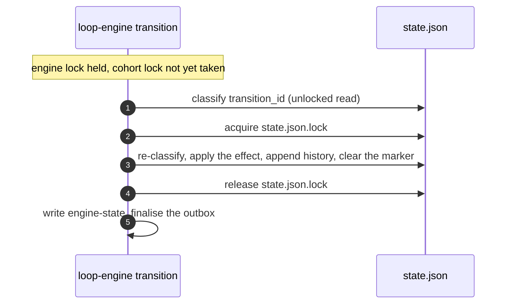

# Durable transitions and within-wave parallelism

**STATUS: § 2 implemented; §§ 1 and 3 planned.**

This document states decisions and their costs. Shipped behaviour the baseline
records is cited from [`loop-infrastructure.md`](loop-infrastructure.md);
shipped behaviour it does not record is stated here with its source.

Three changes are scoped here. None switches concurrent execution on: lifting
ADR-0061 **D5** is a fourth change this document does not scope.

## 1. Durable transitions

**Decision.** Generalise the replay marker that `contract-amendment` carries
([§ 6](loop-infrastructure.md#6-failure-and-recovery-behavior)) to every event
with a cohort effect, so no crash window depends on a person executing a
recovery table.

```
transition_id      = H(run_id, pre_transition_sequence, event, canonical(event_args))
pending_transition = {transition_id, event, args, opened_at}   -- cohort state.json
status(spec_dir, transition_id) ->
    applied   iff the transition history's last entry is transition_id
              and the artifacts the effect derived from still match what it pinned
    conflict  iff the history's last entry carries this pre_transition_sequence
              under a different transition_id, or that artifact check fails
    absent    iff no history entry carries this pre_transition_sequence
```



An event with no cohort effect skips steps 2 to 4.

### Effect registry

| Event | Cohort verb | Args from | Artifacts pinned |
| --- | --- | --- | --- |
| `contract-amendment` | `apply_contract_amendment` | owner authority, reason, completed-task evidence | `plan.md`, via `validate_completed_task_sections` |
| `wave-passed` | `wave advance` | `last_event_context.completed_wave_index` | none |
| `gates-failed` | `record-attempt` | the pre-transition sequence | none |
| `findings-remain` | `review record` | the pre-transition sequence | none |
| `reviewers-clean` | `review record` | the pre-transition sequence | none |

Where nothing is pinned, `applied` reduces to the history match alone.

The other ten events need no effect.

### Three departures from shipped behaviour

Each is a deliberate change, not an inheritance.

**`absent` means no history entry, not no marker.** Shipped code short-circuits
on a `None` marker before reading history, so its classification depends on the
marker outliving the transition. Inverting that lets the marker be short-lived —
cleared inside the critical section, as the diagram shows — but only because
`absent` no longer reads it.

**The key is the pre-transition sequence, and it is persisted.** Shipped code
carries three conventions: the sequence of the transition itself — computed as
`transition_sequence + 1` before engine-state advances and unincremented after,
which is one convention read from two vantage points — plus
`<run_id>:<transition_sequence>` on the session-resumption verbs and
`completed_wave_index` on `wave-passed`.

Collapsing to a single reading would make the key unrecoverable once engine-state
has advanced, losing the divergence-direction recovery. The design therefore
stores `pre_transition_sequence` on the marker and on each history entry, and
reads it from there rather than re-deriving it. Engine-state is written last for
crash ordering **and** for key stability.

**One unified transition history replaces per-event records.** A per-verb
`applied` predicate is rejected: it makes classification differ by event, which
is the ambiguity the marker exists to remove.

### The schema change

`pending_transition` and the unified history are new keys in `state.json`.
`SCHEMA_VERSION` is triplicated across `loop-cohort.py`, `_loop_guards.py` and
`loop-engine.py` and stamped on both state files, so the design must say whether
one version moves or two — a cohort-only key addition bumped naively invalidates
every engine-state file too.

An in-flight run meeting the new engine is refused, not migrated. Recovery is the
destructive reset pair — `loop-cohort reset` then `loop-engine reset` — which
`references/session-resumption.md` gates on explicit human authorization and
which discards retry and review progress; `spec.md` and `plan.md` survive. That
reset deletes `state.json`, so no marker survives the upgrade and none needs
translating. Rolling the engine back after new state exists costs the same pair
in the other direction, and nothing preserves the run.

**Retention.** The shipped `amendment_history` bound is a hard refusal at
`MAX_AMENDMENT_HISTORY = 20` plus a 1 MiB aggregate ceiling. That bound cannot
carry over: `gates-failed` alone can fire repeatedly in one run, so refuse-at-20
would halt an ordinary retry-heavy run. The unified history truncates oldest
instead, which is safe only because `applied` reads the last entry alone. The
design must also say whether it replaces `amendment_history` or sits beside it,
since `contract_amendment_replay_status` and `cmd_status` both read the existing
one.

## 2. Serialising a transition against cohort state

**Decision.** `cmd_transition` fingerprints cohort `state.json` before its first
cohort read, re-reads it under the cohort lock before committing, and refuses
when it moved. The fingerprint is a sha256 over the canonical parsed form, read
through the guard layer's exported bounded reader. Every event takes the check
except `contract-amendment` ([§ 6](loop-infrastructure.md#6-failure-and-recovery-behavior)
describes the race this closes).

**Whole state, not a field subset.** Two earlier designs asked which cohort
facts a verdict depended on and answered per guard — first as pinned fields,
then as a guard re-evaluation over a derived set. Both shipped an answer that
looked complete. The pinned set missed the unsupported-schema and
absent-container rows of the wave-exit verdict, which approve without reading
the wave pointer at all. The derived set missed the `run_id` preflight and the
budget snapshot, neither of which is a `_GUARDS` entry. The set of cohort reads
a commit consumes is not something a rule over guard names can enumerate, so the
engine stops enumerating.

**Read through the bounded reader, never a raw open.** A raw read of a
non-regular `state.json` inside the hold blocks until both locks are judged
stale and a second writer is admitted — strictly worse than holding no lock at
all. `_loop_guards._read_managed_bytes` documents that hazard at exactly this
step, and the engine reaches it through the exported `read_state`. ADR-0061
**D3**'s read-channel clause already carries the
[2026-09-22 erratum](../adr/0061-loop-infrastructure-phase-1.md) recording that
the guard layer reads `state.json` directly rather than through the five
designated verbs; this read is a further instance of that recorded drift, not a
new class, so it opens no decision the erratum has not already parked.

**Unconditional, not gated on the parallelism flag.** Gating on `auto_parallel`
was considered and rejected on measurement. The race is reachable today only by
two hand-driven processes on one spec directory, and a flag that is always false
in Phase 1 would leave exactly that case unprotected. A conditional guard also
fails silently when the condition is misread.

**Cost, uncontended.** One acquire–release plus one bounded cohort read per
checked transition. The acquire–release measures 17.84 ms median with calls
spaced as in a real run. No ratio against a transition median is quoted here:
the published 738.6 ms figure rests on three `git rev-parse --show-toplevel`
calls per transition, and `_get_repo_root` memoises per working directory, so
re-derive the baseline on the tree in hand before quoting one.

**Cost, contended — the dominant case, and it is not the fingerprint.**
`_statelock`'s acquisition timeout is 10 s while a healthy cohort verb may hold
for `GIT_TIMEOUT_S` = 20 s per spawn edge. A non-exempt transition that overlaps
an ordinary cohort verb therefore waits the full 10 s and refuses on
*acquisition*, not on a fingerprint mismatch — and it waits inside the engine
lock, so every other engine verb for that spec stalls with it. Two orders of
magnitude above the uncontended figure, fail-closed and retryable, but the
figure to plan against.

The ordering is safe: the engine-then-cohort nested hold is already live
([§ 3](loop-infrastructure.md#3-owned-state-and-write-authority)).

### What this does not close

Eight residuals, each disclosed rather than fixed.

1. **Any concurrent cohort write refuses**, including a benign `dispatch-receipt`
   that would only have made a verdict more true. Fail-closed, retryable, and
   unreachable in a sequential single-controller run.
2. **`contract-amendment` is exempt**, because its own effect writes cohort
   state and its fingerprint therefore always differs. That exemption also keeps
   the hold from enclosing `apply_contract_amendment`, which takes the cohort
   lock itself on a lock that is not reentrant — but it means the transition
   that rewrites the approved baseline is the one this check does not cover.
3. **The hold serialises cohort `state.json` only.** Every other guard input in
   and under the spec directory — `spec.md` and `plan.md` status and hashes, any
   artifact `check_artifact_status` stats, the bundled retry-cap defaults —
   stays exactly as unserialised as before.
4. **The check is endpoint identity, not interval quiescence.** It compares two
   samples, so a write-and-revert inside the window would leave a guard having
   judged an intermediate state while the commit proceeds. No shipped cohort
   verb *appears able* to produce that reversion, which is why it is disclosed
   rather than closed.
5. **Two cohort-lock failure classes are not retryable.** A non-regular
   `state.json.lock` raises immediately, and a lock record this tool did not
   write is never reclaimed however old it is. Both need the file removed by
   hand, and they now block every non-exempt engine transition rather than only
   cohort verbs. The realistic trigger is a foreign or other-uid lock file.
6. **Any failure sentinel observed at both samples compares equal** and admits
   the commit. The four sentinels prevent a cross-class collision and do nothing
   about a same-class one: absent twice compares equal, as does non-regular
   twice. Reaching it needs a foreign writer to break, heal and re-break
   `state.json` inside one transition, because at least one intermediate guard
   read must succeed — and that load rests entirely on the `run_id` preflight's
   `check_identity`, since the budget snapshot swallows every exception.
7. **Acquisition timeout is the dominant contended refusal**, not the
   fingerprint mismatch, because the 10 s acquisition timeout is shorter than a
   cohort verb's own possible hold. The wait extends the engine-lock hold, so
   the whole spec's engine surface stalls for it. See the contended cost above.
8. **A cohort-lock reclaim mid-hold** is reported, and what it means depends on
   which exit the body took. If the engine-state write had landed, the
   transition is durable behind a non-zero exit and the skipped outbox
   finalisation leaves an `events.pending` that `_recover_pending` completes on
   the next run — do not re-run it. If the body had already refused before
   writing, nothing was committed and it should be re-run. The engine
   distinguishes the two in its refusal; bounding either absolutely needs a
   two-phase commit, which this phase forbids.

## 3. Plan width and mode selection

### What the scheduler already does

Two properties of the shipped scheduler are easy to get wrong, and both bound
the levers below.

**A cycle and a forward-reference are different defects, and only one is a
defect.** A cycle among the unfinished tasks refuses `schedule` outright. A
forward-reference — a task whose declared dependency is authored later in the
file — is a warning on stderr, and the layering reorders it so the dependency
runs first. Where the graph is acyclic a forward-reference is just an edge
written out of order, and refusing it would refuse plans that are fine. The
cycle check runs first, so a forward-reference that happens to sit inside a
cycle is neither warned about nor reordered — it is part of what the refusal
rejects. And the refusal has to be a refusal rather than a warning: the
layering places only zero-indegree tasks and stops, so letting it through would
persist a wave list with the cycle's members, and everything blocked behind
them, silently missing.

Both checks read the *unfinished* set, which bounds what they can say. The
refusal reports the tasks the layering could not place, which is not the same
as the cycle: a task merely blocked by one appears in that list too. And an
amended schedule drops completed tasks and prunes their edges before either
check runs, so a forward-reference with a completed endpoint is neither warned
about nor present in the layering.

**Two forms never become an intra-plan edge, and one expands asymmetrically.**
`_local_dep_ids` strips both cross-spec forms — `spec:<slug>/T<n>` and the
legacy backticked `` `<slug>` T<n> `` — before extracting local IDs, so a
cross-spec dependency is recorded but never scheduled against. What survives
yields a plain `T3`, a letter-suffixed `T1a`, or an inclusive `T1-T6` range.
Only a range's *first* endpoint has to be unsuffixed, and neither asymmetry is
announced: `T1a-T3` matches no range and falls through to its two endpoints,
while `T1-T3a` expands `T1-T3` and then adds `T3a` alongside.

### Mode selection comes first

Parallelism mode is offerable only when the plan DAG asks for it. A plan whose
every wave holds one task has no parallelism to enable, and 23.7% of the corpus
is that shape — for those, `auto_parallel` can never be turned on, and the wave
machinery is ceremony over a chain.

The planner already computes what decides this: the topological layering that
produces `schedule_waves`. If the widest wave is one task, the plan is a chain
and the mode is unavailable. This is a mechanical property of the DAG, not a
judgement, so it is a check rather than a recommendation.

Deciding the mode at planning time is what lets § 2's gate be trustworthy: a flag
nothing can set for a chain cannot be set by mistake for a chain.

### Two effects, often confused

Two different effects get confused here. `schedule_waves` comes only from a
topological layering of the `**Depends on:**` DAG; `**Touches:**` is read only to
print a `predicted-disjoint` line. A lever acts on **scheduled width** or on
**usable width**, never both.

### Scheduled width

**Report width during authoring.** An author sees their plan's shape only after
approval, when changing it is expensive. This needs a mechanism that does not
exist: `loop-cohort schedule` requires a run id, takes the cohort lock, and
persists state. A read-only `schedule --dry-run <plan.md>`, or a `new-spec` lint,
is a change this design owes and has not specified.

**Ask for a reason on each `Depends on:` edge.** The reason goes in the
parenthetical the parser already truncates at `(`, which the template blesses
today. An unparenthesised trailing reason is unsafe: the task-id pattern runs
over the surviving text, so a reason naming any `T<n>` invents an edge or trips
the unknown-dependency refusal. `Depends on: none` is not required to carry one,
though the parser accepts it.

This does not reverse RFC-0015 decision 5, the `Depends on:` grammar. That
decision's axis is parser strictness, and a lint reading prose the parser
discards does not move along it. RFC-0015's Options section labels the grammar
sub-axis "decision 4" while its numbered decision 4 is substrates and isolation;
that mislabel needs an erratum on RFC-0015.
The obligation's home is the plan template plus a lint, not the grammar.

### Usable width

**Make `Touches:` mandatory.** This widens nothing. It makes the
`predicted-disjoint` screen able to run at all, which today it cannot for most
tasks.

Completing the field converts `unknown` to `yes` **or to `no`** —
`wave_touches_disjoint` returns `no` on any declared overlap. RFC-0015 measured
~45% file overlap among declared-independent waves, so a mandate is expected to
produce `no` on a substantial minority: a serialize-only verdict that *narrows*
usable width rather than widening it. That is the honest effect, and it is still
worth having, because a `no` found at authoring beats a collision found at merge.

It stays a serialize-only input and never a write authority: RFC-0015's overlap
rate is a lower bound, because tasks under-name what they touch.

The mandate binds a plan at `Drafting` when the lint runs. An approved plan is
exempt by construction — its text is pinned by the approved-plan hash. No
backfill; existing spec directories are historical records.

### Contracts this changes

| Contract | Owner | Change |
| --- | --- | --- |
| `Touches:` optionality | `packs/core/.apm/skills/new-spec/assets/plan.md` | optional becomes required at `Drafting` |
| Plan-authoring obligations | `packs/core/.apm/skills/work-loop/SKILL.md`, `new-spec/SKILL.md` | the width report becomes an authoring step |

No lever removes an edge automatically. A false "ordered" costs throughput; a
false "independent" ships a break.

### What this does not buy

A wider wave changes nothing until D5 is lifted: execution is sequential on every
adapter by RFC-0015 decision 1, and every dispatch verb is inert.

Inert at the *verb*, though, not deleted at the decision.
`dispatch_decision` survives in `loop-cohort.py` as a pure predicate: given a
merge-tree verdict and a list of category names, it answers `parallel` when the
verdict is clean and every name is a safe category, and `serial` otherwise.
Three things bound what that survival is worth. It never obtains the merge-tree
verdict — it is passed one, and no shipped script produces it. It takes
category *strings*, not a wave, so it answers `parallel` for an empty list. And
its two refusal reasons are indistinguishable in its output.

No CLI verb reaches it: `cmd_dispatch_decision` returns the disabled stub.
Read it as a decision written down and held in place by its unit tests, not as
something the loop does.

## Verification and risk

| Scenario | Measure |
| --- | --- |
| A crash mid-transition, replayed | zero duplicate cohort effects across N injected crashes |
| A concurrent `wave advance` during `wave-complete` | the transition refuses rather than commits |
| A mandated `Touches:` over the corpus | the `yes` / `no` / `unknown` split, before and after |
| The added acquisition against the transition it sits in | under 5% of `wave-complete` wall time at the median |

| Risk | Disposition |
| --- | --- |
| The reset pair fires on a live run at rollout, discarding retry and review progress | operational; needs a rollout gate refusing while any run is in flight |
| Truncating the unified history drops an entry a replay still needs | mitigated only if `applied` reads the last entry alone; that invariant is tested, not assumed |
| Normalising four id conventions changes the key every in-flight marker was written under | accepted: the reset pair deletes those markers |

## Records impact

ADR-0061 is Frozen: its body is immutable, and its `## Errata` section is
append-only for meaning-preserving clarifications.

- **D3, the drift that already exists** — "the engine never writes cohort state,
  and reads it only through the designated read-only verbs". Both halves are
  already untrue ([§ 4](loop-infrastructure.md#4-dependencies-and-allowed-edges)).
  Recording that reverses nothing, so it routes to an erratum on ADR-0061, like
  the 2026-08-31 erratum already there.
- **D3 and D4, the extension** — the effect registry widens the breach from one
  event to five and moves four cohort mutations from skill-invoked to
  engine-invoked. D4 says "Every cohort mutation is invoked explicitly by the
  skill", so this is a reversal, not a clarification, and an erratum cannot carry
  it. It needs a record superseding ADR-0061 in part on D3 and D4 together, and a
  restated write-authority row against
  [§ 3](loop-infrastructure.md#3-owned-state-and-write-authority).
- **D8** and **D5** are deferrals a new decision would lift. Each needs a record
  that supersedes ADR-0061 in part.

## Open questions

| Question | Who decides |
| --- | --- |
| Whether the unified history replaces or sits beside `amendment_history` | loop-infrastructure owner |
| What a wave does when one task fails — task or wave blast radius | loop-infrastructure owner |
| Whether the measured nesting hazard reopens RFC-0015 open question 2, whose substrate choice is already resolved as delegate-to-driver | RFC-0015 approver |
| Whether task-cutting guidance belongs in the plan template | `new-spec` owner |
| Whether the `SCHEMA_VERSION` bump moves one constant or all three | loop-infrastructure owner |
| Where the read-only width report lives — `schedule --dry-run` or a `new-spec` lint | `new-spec` owner |
| Whether `reviewers-clean` keeps its human-authorization gate once the marker supplies idempotency | loop-infrastructure owner |

## Evidence

Facts the baseline already records — the nested lock hold, marker lifetime, the
sequence conventions, the event and effect counts — are cited from
[`loop-infrastructure.md`](loop-infrastructure.md) rather than repeated. What
follows is not in the baseline.

Probes against this repository on git 2.50.1 on 2026-09-22, none recorded as a
re-runnable harness:

**Lock nesting, corroboration.** Holding `state.json.lock` externally,
`apply_contract_amendment` raised `StateLockTimeout` after 10.1s.

**Worktree topology.** All worktrees are peers on one common `.git`. Removing a
parent containing a nested worktree succeeds silently, deletes the nested working
directory including uncommitted work, and leaves it `prunable`. One worktree
measured 89 MB over 6,521 files. Task worktrees must therefore be peers, never
nested inside a session worktree — a constraint RFC-0015 does not state,
alongside the shared-`.git` stacking hazard it does.

**Dependency shape**, over 392 plans and 2,543 tasks: 1,083 tasks declare exactly
one dependency; 681 of those (62.9%) name the immediately preceding task in
authoring order, which is 26.8% of all tasks; 1,438 (56.5%) declare no
`Touches:`. These are historical plans, so the figures measure authoring habit
under the current template.

**Wave width**, over the 359 plans carrying a complete dependency declaration:

| | actual | if previous-task edges dropped |
| --- | ---: | ---: |
| median max wave width | 2 | 3 |
| median depth | 4 | 3 |
| plans that cannot parallelise at all | 23.7% | 0.8% |
| plans whose width would increase | — | 65.2% |

The second column is a ceiling, not a forecast: it assumes every previous-task
edge inside these 359 plans is spurious, and some are genuinely sequential work
written in order. The two cases produce identical text.
