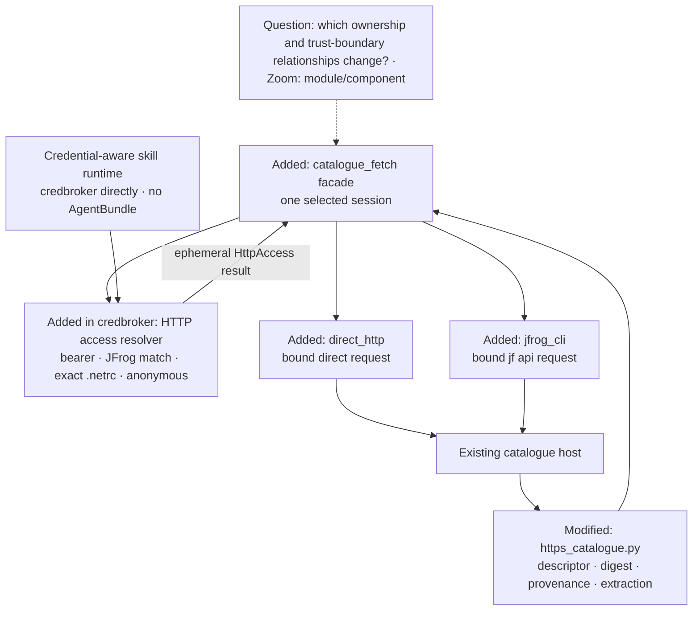
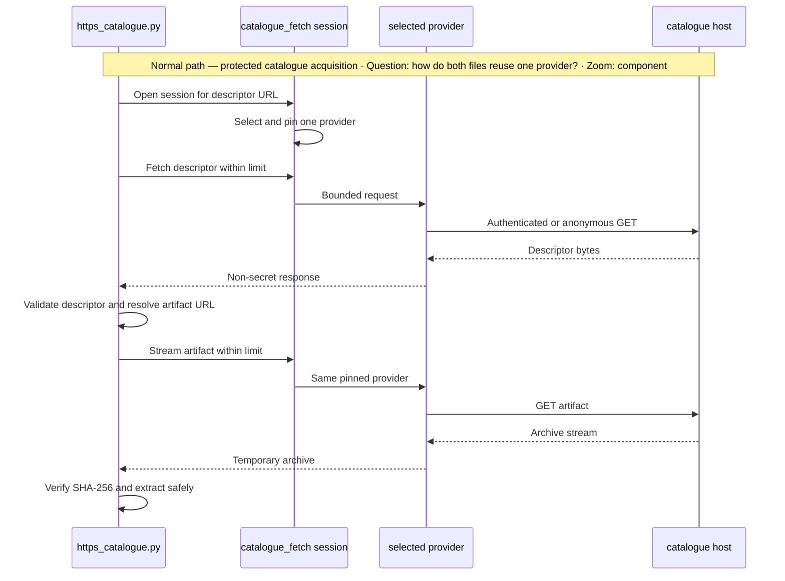

# Architecture Change — Portable Catalogue Authentication

**Decision sought:** Split remote catalogue acquisition from catalogue
interpretation, use the standalone `credbroker` package to resolve access, then
reuse credentials that users already manage through an exact-host `.netrc`
entry or a matching JFrog CLI profile. Retain the existing explicit AgentBundle
bearer-token path as a compatibility override without making AgentBundle a
runtime dependency of installed skills.

**Author(s):** AgentBundle maintainers

**Status:** Under review

**Last updated:** 2026-09-30

**Reviewers:** AgentBundle architecture and security maintainers

**Baseline — current architecture:** [AgentBundle design](../../packages/agentbundle/DESIGN.md),
especially [catalogue capability](../../packages/agentbundle/DESIGN.md#2-catalogue-capability),
[distribution mechanisms](../../packages/agentbundle/DESIGN.md#distribution-mechanisms),
and [Artifactory enterprise distribution](../../packages/agentbundle/DESIGN.md#artifactory-enterprise-distribution).

This document requires that baseline and records only the delta. It does not
implement the change, alter current credential behavior, or authorize a
credential in any tracked file.

## 1. Scope and Baseline

What is changing, and what baseline artifact does this delta assume?

| Delta item | In scope | Why it's changing |
| --- | --- | --- |
| Remote fetch ownership | Yes | [`https_catalogue.py`](../../packages/agentbundle/agentbundle/https_catalogue.py) combines authentication, HTTPS transport, descriptor handling, digest verification, and extraction |
| Consumer authentication | Yes | The current fetcher recognizes only `AGENTBUNDLE_HTTP_BEARER_TOKEN`; adopters already provision `.netrc` or [`jf login`](https://docs.jfrog.com/integrations/docs/jf-login) |
| Credential architecture edge | Yes | AgentBundle must consume a target-bound `credbroker` API rather than acquire a second direct credential exception under the repository [credential boundary](credentials.md#4-dependencies-and-allowed-edges) |
| Publisher CI credentials | No | CI secret stores continue to own upload identities such as `ARTIFACTORY_USER` and `ARTIFACTORY_TOKEN` |
| Catalogue source precedence | No | The baseline's five-layer source selection remains unchanged |
| Descriptor, digest, provenance, and extraction | Compatibility only | These catalogue semantics move behind no new provider-specific rules |
| AgentBundle credential storage | No | AgentBundle must not add a token store or copy credentials from user-owned tools |

| Unchanged context | Link |
| --- | --- |
| Catalogue and pack concepts | [AgentBundle design](../../packages/agentbundle/DESIGN.md#1-how-agentbundle-works) |
| Source selection and URI forms | [Catalogue capability](../../packages/agentbundle/DESIGN.md#2-catalogue-capability) |
| Current credential subsystem | [Credentials and trust boundaries](credentials.md) |
| Current HTTPS safety limits and extraction rules | [`https_catalogue.py`](../../packages/agentbundle/agentbundle/https_catalogue.py) |

The whole delta is the addition of provider-neutral acquisition plus two
user-local provider shapes. `catalogue.toml` may continue to hold non-secret
Artifactory publication coordinates, and an organization may distribute a
non-secret `catalogue+https://` source through existing defaults.

Consumer usernames, passwords, and tokens remain outside `catalogue.toml`,
AgentBundle config, install state, logs, and provenance. Browser SSO,
interactive login, generic helper commands, and a public provider-plugin API
remain out of scope.

The rejected shapes are credential fields in `catalogue.toml`, copying JFrog
tokens into AgentBundle, and keeping the AgentBundle-only bearer variable as
the sole protected-catalogue path. The two selected user shapes are both
required because `.netrc` covers standard HTTP authentication while JFrog CLI
owns organization-specific SSO, refresh, proxy, and platform behavior.

## 2. Structural Change

Which elements and relationships are added, removed, or modified from the
baseline, and which are simply linked because they do not change?

| Element or relationship | Change type | Baseline reference |
| --- | --- | --- |
| `agentbundle.catalogue_fetch` internal package | added | New |
| Fetch-session facade | added | New |
| `credbroker` target-bound HTTP access API | added | [Credential subsystem](credentials.md) |
| Deterministic provider selector | added in `credbroker` | New |
| Direct HTTP provider | added by extraction and extension | [`https_catalogue.py`](../../packages/agentbundle/agentbundle/https_catalogue.py) opener and request helpers |
| JFrog CLI provider | added | New |
| `https_catalogue.py` to fetch-session edge | modified | [Distribution mechanisms](../../packages/agentbundle/DESIGN.md#distribution-mechanisms) |
| AgentBundle to `credbroker` edge | added required package dependency | [Credential dependencies and allowed edges](credentials.md#4-dependencies-and-allowed-edges) |
| Descriptor, digest, provenance, and extraction ownership | linked unchanged | [`https_catalogue.py`](../../packages/agentbundle/agentbundle/https_catalogue.py) |



The internal source layout is:

```text
packages/agentbundle/agentbundle/
├── catalogue_fetch/
│   ├── __init__.py       # narrow fetch-session facade
│   ├── models.py         # request, response, provider, and failure types
│   ├── direct_http.py    # bound bearer, Basic, and anonymous HTTPS
│   └── jfrog_cli.py      # bounded `jf api` execution
└── https_catalogue.py    # descriptor, digest, provenance, and extraction

packages/credbroker/credbroker/
├── __init__.py           # public `resolve_http_access` export
└── _http_access.py       # selection, .netrc, and JFrog profile discovery
```

The facade accepts a validated HTTPS URL, byte limit, timeout, and output mode.
It returns bytes or a fully written temporary file plus non-secret response
metadata; it never returns credential material.

Provider implementations own authentication and network mechanics. They do
not parse catalogue descriptors, choose artifact URLs, verify catalogue
digests, or extract archives.

`https_catalogue.py` owns the descriptor-to-artifact transition. It gives the
same selected session both URLs, so the artifact cannot start a new provider
search or change the credential mechanism mid-install.

The new AgentBundle package imports the public `credbroker` API only through its
fetch-session facade. `credbroker.resolve_http_access` owns environment access,
exact-machine `.netrc` parsing, JFrog profile discovery, deterministic provider
selection, and the ephemeral typed result. That result returns to the facade; it
does not call back into AgentBundle. It carries a non-secret provider class and
target binding plus either derived in-process Authorization bytes for a direct
request, pinned non-secret JFrog server and URL fields, or no authentication for
anonymous access. AgentBundle owns bounded network acquisition from that
result. Its direct provider never opens `.netrc`, reads the bearer variable, or
receives raw username, password, or token fields. Its JFrog provider receives no
credential and only the pinned fields needed to invoke `jf api`.

`credbroker` remains independent of AgentBundle. Credential-aware skills import
`credbroker` directly, and ordinary skills import neither package. AgentBundle's
package-manager environment and the credential-brokers pack's user-library
floor are separate deployment paths even when they become physically
co-located in one Python environment.

The package-level gate is
`packages/agentbundle/tests/contracts/test_catalogue_fetch_credential_boundary.py`.
It AST-checks that catalogue-fetch code does not read the bearer variable,
import `netrc`, run JFrog profile discovery, or read a vendor credential file;
that only `jfrog_cli.py` invokes `jf api`; and that no raw credential source,
username, password, or token crosses the API. The direct provider may receive
only derived Authorization bytes through the in-process typed result, which
must never enter a URL, process argument, persistent state, log, or diagnostic.
Companion `credbroker` tests own resolver behavior and secret canaries.
Deployment tests cover isolated AgentBundle, isolated skill, and co-located
import paths.

## 3. Runtime Change

How do runtime paths differ from the baseline, including any temporary
dual-run or migration behavior?

| Journey or scenario | Change type | Baseline reference |
| --- | --- | --- |
| Explicit bearer catalogue fetch | modified internally, compatible externally | [`AGENTBUNDLE_HTTP_BEARER_TOKEN` path](../../packages/agentbundle/agentbundle/https_catalogue.py) |
| Matching JFrog profile fetch | new | New |
| Exact-machine `.netrc` fetch | new | New |
| Anonymous HTTPS fetch | modified internally, compatible externally | [Distribution mechanisms](../../packages/agentbundle/DESIGN.md#distribution-mechanisms) |
| Standalone `archive+https://` fetch | modified internally; all four providers apply | [Distribution mechanisms](../../packages/agentbundle/DESIGN.md#distribution-mechanisms) |
| Descriptor validation and artifact resolution | linked unchanged, with an added JFrog-base check | [`https_catalogue.py`](../../packages/agentbundle/agentbundle/https_catalogue.py) |
| Digest verification and safe extraction | linked unchanged | [`https_catalogue.py`](../../packages/agentbundle/agentbundle/https_catalogue.py) |
| Provider ambiguity or configured-provider failure | new fail-closed path | New |



```mermaid
sequenceDiagram
    participant C as https_catalogue.py
    participant S as catalogue_fetch selector
    participant J as JFrog discovery
    participant H as catalogue host
    Note over C,H: Failure path — ambiguous JFrog profiles · Question: what prevents an unbound authenticated request? · Zoom: component
    C->>S: Open session for descriptor URL
    S->>J: Discover URL-matching profiles
    J-->>S: Two equal longest-prefix matches
    S-->>C: provider_ambiguous
    Note over C,H: No catalogue GET occurs; lower-precedence providers are not tried
```

Provider precedence is highest-first and first-match:

1. `AGENTBUNDLE_HTTP_BEARER_TOKEN` as the explicit compatibility override;
2. one URL-matching JFrog CLI profile;
3. one exact-machine `.netrc` record; and
4. anonymous HTTPS.

Selection occurs once per acquisition. An HTTP 401/403, subprocess failure,
timeout, or other retrieval error from the selected provider is terminal; no
lower-precedence provider is tried.

An absent bearer variable; an absent `jf` executable when
`JFROG_CLI_SERVER_ID` is unset; successful JFrog discovery with no match; an
absent `.netrc`; or `.netrc` with no exact match means that provider is
unavailable. An absent `jf` executable when `JFROG_CLI_SERVER_ID` is set,
malformed discovery output, an ambiguous match, an explicit server mismatch,
or an unreadable or insecure `.netrc` is a configured-but-broken condition and
fails closed.

Both authenticated providers apply to `catalogue+https://` and standalone
`archive+https://`. The source fragment that pins an archive digest is removed
before provider selection and is never sent to a server or subprocess.

### Direct HTTP delta

The direct provider retains the baseline HTTPS-only, proxy, CA-bundle, and
original-request-origin redirect rules. Explicit bearer authorization remains
origin-locked for both HTTPS source forms.

For `.netrc`, `credbroker` uses Python's [standard user-file and POSIX
permission contract](https://docs.python.org/3.13/library/netrc.html). It reads
the exact machine map, checks `host:port` first for a non-default port and then
`host`, and ignores the ambient `default` record.

A match must supply login and password. `credbroker` builds an ephemeral HTTP
Basic access value in-process for the bound direct provider and never places
either input or the derived value in a URL, argument, state file, provenance
field, log, or diagnostic.

### JFrog CLI delta

Profile discovery runs
[`jf config show --format=json`](https://docs.jfrog.com/integrations/docs/jf-config-show)
without a shell under `credbroker`. Output is size-limited. Unmasked credentials
are never requested, and after bounded JSON parsing `credbroker` retains only
`serverId`, platform `url`, `artifactoryUrl`, and `isDefault`; every other field
is discarded immediately.

A profile matches when normalized `artifactoryUrl` is an origin-equal,
path-segment-aligned prefix of the initial fetch URL. The longest base
path wins; equal longest matches are ambiguous unless user-local
`JFROG_CLI_SERVER_ID` names one of those matches.

The session pins `{serverId, platformUrl, artifactoryUrl}`. The named server
must still URL-match, and neither its ID nor profile data is persisted by
AgentBundle.

A profile is eligible only when normalized `artifactoryUrl` is itself an
origin-equal, path-segment-aligned descendant of normalized `platformUrl`.
A matching profile with different origins or incompatible base paths fails
before selection as `unsupported_jfrog_topology`; no lower provider is tried.

Before each JFrog invocation, the descriptor or artifact URL must remain an
origin-equal, segment-aligned descendant of the pinned `artifactoryUrl`.
`credbroker` validates the initial target during resolution, and AgentBundle
revalidates each fetch URL before endpoint conversion. User-info, query,
fragment, literal dot segments, encoded dot segments, encoded path separators,
backslashes, and decoded control characters are rejected.

The [`jf api` contract](https://docs.jfrog.com/integrations/docs/use-api-endpoints-via-cli)
prepends the configured platform base. AgentBundle therefore derives the CLI
endpoint relative to pinned `platformUrl`, while the stricter
`artifactoryUrl` check remains the authorization boundary.

The endpoint and selected server ID are passed as an argument vector, never a
shell string. AgentBundle gives the process no credential, credential-bearing
URL, or unrelated full URL; the real-CLI contract test must ground the final
argument order before implementation.

Descriptor stdout is capped at 1 MiB. Archive stdout is streamed to a temporary
file and capped at 256 MiB; stderr is separately bounded and sanitized.

Standard input is closed. Discovery has a 10-second hard timeout, and each
`jf api` process has a 30-second hard timeout; expiry terminates the process,
waits for cleanup, and removes partial output.

JFrog CLI owns configured authentication, token refresh, proxy behavior, and
redirect handling. AgentBundle constrains the selected server and endpoint but
does not claim the direct provider's per-redirect hook inside another process.

After a URL-matching profile is found, `credbroker` checks the CLI version. A
version below the grounded minimum fails as `incompatible_jfrog_cli`; it is a
configured-but-unsupported provider, not an unavailable provider, so no lower
provider is tried.

The version probe is `jf --version`, invoked as an argument vector without a
shell. Standard input is closed, stdout and stderr are each capped at 8 KiB,
and a 5-second hard timeout terminates the process and sanitizes any reported
failure.

There is no dual-run window. Old bearer and anonymous callers traverse the new
facade with externally compatible behavior, while the two added providers are
available immediately when matching user-owned setup exists.

## 4. Contract and Invariant Change

Which contracts or invariants are introduced, changed, or retired by this
change, and how does that affect every existing party?

| Semantic name | Change type | Baseline reference | Compatibility during transition | Enforcement | Verification |
| --- | --- | --- | --- | --- | --- |
| Consumer credentials are user-owned | narrowed | [Credential boundary](credentials.md#4-dependencies-and-allowed-edges) | Existing bearer remains user-local; no caller migrates stored AgentBundle state | No credential fields in catalogue config, AgentBundle config, state, provenance, or docs | Schema/config negative tests and secret-pattern checks |
| Credential architecture edge | widened by required lower-level dependency | [Direct-read and `cli` rules](credentials.md#4-dependencies-and-allowed-edges) | Existing credential consumers are unchanged; skills never depend on AgentBundle | AgentBundle imports the public `credbroker` API and no direct credential source | Package-scoped credential-boundary test, security review, and architecture review |
| Skill-runtime independence | narrowed | [ADR-0003](../adr/0003-credential-broker-contract.md) | Credential-aware skills continue to import `credbroker` directly; ordinary skills import neither package | No skill import or subprocess edge to AgentBundle | Isolated skill test runs with AgentBundle absent |
| Co-located broker compatibility | new | [`user_libs.py`](../../packages/agentbundle/agentbundle/build/user_libs.py) | A `site-packages` broker may override the vendored user-library floor | `credbroker` 0.7 preserves the 0.6 skill-facing API during the supported co-location window | Old-skill/new-broker co-location fitness test |
| Provider precedence | new | New | Existing bearer wins; anonymous remains the final path | Closed selector order | Table-driven combination tests |
| No fallback after selection | new | New | Existing requests still make one authenticated or anonymous attempt | Selected session returns retrieval errors directly | 401, 403, timeout, and subprocess tests assert one provider attempt |
| JFrog profile binding | new | New | No effect when no matching JFrog profile exists | Pin server, platform base, and Artifactory base | Origin, port, prefix, tie, and explicit-ID tests |
| JFrog supported topology | new | New | Direct provider behavior is unchanged | Artifactory base must be a same-origin segment descendant of platform base | Split-origin and incompatible-base tests assert pre-request failure |
| JFrog CLI compatibility | new | New | Applies only after a matching profile is found | Version check against the grounded `jf api` minimum | Below-minimum fixture asserts typed failure and no fallback |
| JFrog endpoint confinement | new | New | Direct provider behavior is unchanged | Revalidate both URLs against pinned Artifactory base; derive endpoint from platform base | Escape, encoding, query, fragment, and second-fetch tests |
| `.netrc` exactness | new | New | No effect when no exact record exists | Check `host:port`, then `host`; ignore `default` | Port, host, default-only, malformed, and permission fixtures |
| Direct redirect lock | linked unchanged | [`_OriginLockingRedirectHandler`](../../packages/agentbundle/agentbundle/https_catalogue.py) | Existing bearer and anonymous callers retain the same rule | Original requested origin remains the anchor | Existing suite plus `.netrc` cases |
| Standalone archive redirect lock | baseline prose corrected; implementation linked unchanged | [Distribution mechanisms](../../packages/agentbundle/DESIGN.md#distribution-mechanisms) | Existing code already origin-locks redirects for this form | Original requested archive origin remains the anchor | Existing redirect-handler suite plus a new standalone-archive cross-origin test and provider cases |
| JFrog redirect policy | widened by delegation | New | Applies only when JFrog is selected | Provider and endpoint binding precede CLI delegation | Real-CLI contract test and security review |
| One provider per acquisition | new | New | Descriptor and artifact retain one credential mechanism | Fetch session is selected once | Integration tests assert one provider class |
| Descriptor and archive limits | linked unchanged | [`https_catalogue.py` limits](../../packages/agentbundle/agentbundle/https_catalogue.py) | All callers retain 1 MiB and 256 MiB maximums | Every provider enforces the supplied cap | Over-limit tests for both providers |
| Integrity and extraction | linked unchanged | [`https_catalogue.py`](../../packages/agentbundle/agentbundle/https_catalogue.py) | Existing SHA-256 and safe-extraction behavior remains | Catalogue layer retains verification and extraction | Existing mismatch, member, and expanded-size tests |
| Credential-free diagnostics | narrowed | [Credential observability](credentials.md#7-observability-and-evidence) | Existing diagnostics may become more structured, not more revealing | Typed failures plus bounded sanitized stderr | Secret-canary and hostile-output tests |

The catalogue compatibility rule is additive: callers do not change source
URIs, state, or command syntax. Existing bearer configuration still wins, and
anonymous catalogues still terminate the selector when no local credential
shape matches.

The package compatibility rule has three shapes. A package manager installs a
compatible `credbroker` automatically into AgentBundle's isolated tool
environment. The credential-brokers pack supplies its own user-library floor to
skill runtimes without requiring AgentBundle. When those paths are co-located,
Python prefers the `site-packages` distribution, so the 0.7 series retains the
0.6 skill-facing API until the supported co-location window ends or explicit
import isolation replaces that requirement.

AgentBundle adds no consumer `ARTIFACTORY_USER` or `ARTIFACTORY_TOKEN`
setting. Those names may remain in publisher CI, which is a separate trust
boundary from catalogue retrieval.

Users may already have a standard `.netrc` record or a JFrog profile created
through the organization's normal login flow. AgentBundle re-evaluates those
local settings on each run rather than copying them into its own settings.

## 5. Data/State Migration

How does existing data or state move from its old shape to its new shape, and
what happens if migration fails partway through?

| Data element | Old shape | New shape | Migration mechanism | Rollback |
| --- | --- | --- | --- | --- |
| AgentBundle config | Adapter and source settings; no catalogue credential | Unchanged | None | Nothing to undo |
| AgentBundle install state | Source and provenance; no catalogue credential | Unchanged | None | Nothing to undo |
| `catalogue.toml` | Non-secret distribution metadata | Unchanged | None | Nothing to undo |
| Existing bearer environment | Optional user-local token | Unchanged compatibility input | Selector recognizes it first | Old implementation continues to consume it |
| User `.netrc` | External user-owned file | Read-only optional provider | No import or rewrite | Stop using the provider; file is untouched |
| JFrog profile | External vendor-owned state | Read-only discovery plus delegated execution | No import or rewrite | Stop using the provider; profile is untouched |

There is no persistent migration and therefore no partial migrated state.
Rollout must not create, edit, import, or delete `.netrc` or JFrog profiles,
and must not persist a provider or server ID.

Rollback removes transparent `.netrc` and JFrog capability but does not lose
data. Bearer and anonymous behavior remain available through the old
implementation.

## 6. Deployment/Operational Change

What changes in how this is deployed, operated, or observed, relative to the
baseline?

| Deployment unit | Change type | Baseline reference |
| --- | --- | --- |
| AgentBundle wheel | modified; declares a required compatible `credbroker` dependency | [AgentBundle CLI and catalogue](../../packages/agentbundle/DESIGN.md) |
| `credbroker` package | modified with target-bound HTTP access API | [Credential subsystem](credentials.md) |
| Credential-brokers user-library floor | modified from the same `credbroker` source; remains independent of AgentBundle | [`user_libs.py`](../../packages/agentbundle/agentbundle/build/user_libs.py) |
| JFrog CLI executable and profile | new optional runtime dependency | New |
| `.netrc` user file | new optional runtime input | New |
| Catalogue host and package layout | linked unchanged | [Artifactory distribution](../../packages/agentbundle/DESIGN.md#artifactory-enterprise-distribution) |
| CI publisher workflow | linked unchanged | [Artifactory distribution](../../packages/agentbundle/DESIGN.md#artifactory-enterprise-distribution) |

Before code work, maintainers must ratify the AgentBundle-to-`credbroker`
dependency direction, provider precedence and failure classes, exact-host
`.netrc`, and JFrog delegation in decision records. A behavior-change spec and
pre-implementation security review then own the executable contract.

The JFrog spike must verify the installed CLI version, discovery JSON, platform
and Artifactory base fields, binary stdout, endpoint mapping, exit codes, and
process termination. Current JFrog documentation states that `jf api` requires
[JFrog CLI 2.100.0 or later](https://docs.jfrog.com/integrations/docs/use-api-endpoints-via-cli)
and that the required [`--format` output option is available from JFrog CLI
2.105.0](https://docs.jfrog.com/integrations/docs/jfrog-cli-command-reference).
The combined discovery and fetch contract therefore requires 2.105.0 or later.

Diagnostics may name the non-secret provider class (`bearer`, `jfrog`,
`.netrc`, or `anonymous`) and a stable failure code. They must not render a
provider-specific identifier such as a JFrog server ID, authorization values,
`.netrc` fields or contents, usernames, discovery payloads, credential-bearing
URLs, or unbounded stderr.

The provider portion has bounded subprocess time: at most 10 seconds for JFrog
discovery, 5 seconds for the version probe, and 30 seconds for each of two JFrog
fetches. Its maximum subprocess budget is therefore 75 seconds before local
digest verification and extraction.

Direct HTTP retains the baseline 30-second socket timeout per fetch, which is
an inactivity bound rather than a total deadline.

There is no binding front-door duration for the complete install. Direct
streaming can remain active while data arrives, and digest verification and
safe extraction are size-bounded rather than wall-clock-bounded.

No shared service, daemon, or deploy-time scaling unit is added. Work scales as
one local AgentBundle process plus at most one bounded JFrog subprocess at a
time per invocation.

Typed provider failures are the operator signal. Their stable code distinguishes
unavailable, ambiguous, unsupported topology, incompatible CLI, authentication,
timeout, response-size, integrity, and transport failures without emitting
credential material.

## 7. Quality Regression and Verification

Which quality attributes could regress because of this change, and how do we
verify they did not?

| Attribute at risk | Baseline target | Stimulus that could regress it | Verification |
| --- | --- | --- | --- |
| Credential safety | Bearer never crosses the original origin; no secret in logs or state ([current fetcher](../../packages/agentbundle/agentbundle/https_catalogue.py)) | Added `credbroker` access resolution and vendor subprocess | Secret-canary tests prove zero secret/profile-ID output; request fixtures prove authorization reaches only the bound origin/provider |
| Portability | No measurable protected-catalogue target exists; new target is success with either supported existing user setup | GitLab, non-GitHub CI, standard HTTP auth, or JFrog-managed auth | Construction tests install from fixtures using `.netrc` and a real compatible JFrog CLI profile without an AgentBundle-specific token |
| Skill-runtime independence | Credential-aware skills use broker code without AgentBundle ([ADR-0003](../adr/0003-credential-broker-contract.md)) | AgentBundle now depends on the same lower-level package | Run a credential-aware skill with `credbroker` present and AgentBundle absent |
| Co-located compatibility | The vendored user library is a `sys.path` floor | AgentBundle's `site-packages` dependency can override an older floor | Run an existing skill written against the 0.6 API with the newest compatible 0.7 package taking precedence |
| Compatibility | Current bearer, anonymous, descriptor, digest, provenance, and extraction suites pass unchanged | Fetch mechanics move behind a facade | Run all current HTTPS catalogue tests through the facade plus snapshot-equivalent provenance assertions |
| Operability | Current errors expose no bearer; new target is one stable failure class with zero sensitive fields | Discovery ambiguity, malformed config, timeout, or hostile stderr | Error-matrix tests assert failure code, one attempt, stderr cap, cleanup, and secret redaction |
| Resource safety | 1 MiB descriptor, 256 MiB archive, 20,000 members, 1 GiB expanded content, 30-second HTTP socket timeout | Subprocess output bypasses urllib limits | Boundary and over-limit tests for both providers; timeout tests verify termination and partial-file removal |
| Latency behavior | No total front-door SLO; two 30-second HTTP inactivity bounds | JFrog adds discovery, version probing, and process startup | Assert 10/5/30/30-second subprocess hard limits and 75-second aggregate subprocess budget; document that direct and complete-install totals remain unbounded |
| Maintainability | Catalogue semantics have one current owner | Provider code begins to parse descriptors or extraction rules | Import-boundary tests and review prove providers expose only bounded fetch operations |

The highest regression risk is credential safety because selection adds two
trust edges. The verification therefore uses canary values and request capture,
not only mock call-shape assertions.

The next risk is behavior drift during extraction from the existing module.
All old tests must exercise the new facade, while provider-specific tests stay
below the catalogue-semantic boundary.

## 8. Build Mapping

Where does each changed element map to in source, build, and deployment, and
how does that differ from the baseline mapping?

| Semantic element | Change type | Source owner | Build unit | Deployable | Verification |
| --- | --- | --- | --- | --- | --- |
| Fetch facade and types | new | `packages/agentbundle/agentbundle/catalogue_fetch/__init__.py`, `models.py` | `agentbundle` wheel | AgentBundle wheel | Facade contract and import-boundary tests |
| HTTP access resolution and provider selection | new | `packages/credbroker/credbroker/_http_access.py` exported by `credbroker.__init__` | `credbroker` wheel and user-library projection | AgentBundle environment and credential-aware skill runtime | Table-driven precedence, availability, configured-broken, ambiguity, and no-fallback tests |
| Direct HTTP provider | extracted and modified | `packages/agentbundle/agentbundle/catalogue_fetch/direct_http.py` | `agentbundle` wheel | AgentBundle wheel | Existing transport suite plus exact-machine `.netrc` construction tests |
| JFrog CLI provider | new | `packages/agentbundle/agentbundle/catalogue_fetch/jfrog_cli.py` | `agentbundle` wheel | AgentBundle wheel plus optional JFrog CLI | Real-CLI contract test and bounded subprocess suite |
| Catalogue integration | modified | `packages/agentbundle/agentbundle/https_catalogue.py` | `agentbundle` wheel | AgentBundle wheel | Existing descriptor, digest, provenance, and extraction suites |
| Required package dependency | modified | `packages/agentbundle/pyproject.toml` plus governing ADR | AgentBundle wheel metadata | AgentBundle environment | Clean-environment package installation and dependency-range assertion |
| Credential allowed edge | modified documentation and policy | `docs/architecture/credentials.md` plus governing ADR | Repository architecture | Review-time contract | Package-scoped credential-boundary contract test, security review, and architecture review |
| Credential-boundary enforcement | new | `packages/agentbundle/tests/contracts/test_catalogue_fetch_credential_boundary.py` | AgentBundle test suite | CI/local gate | AST assertions forbid direct credential reads and vendor-profile reads; only the JFrog provider may invoke `jf api` |
| Co-located compatibility | new | `packages/credbroker/tests/` plus credential-broker consumer fixtures | `credbroker` and AgentBundle test suites | CI/local gate | Old-skill/new-broker import-precedence fitness test |
| User and operator guidance | modified after implementation | Existing enterprise catalogue guides | Documentation site | Documentation | Secret-pattern checks and task-based guide review |

Implementation requires a behavior-change spec, the repository's
engine-change RFC association, and security review before code changes begin.
The spec must preserve the exact limits and trust edges defined here rather
than rediscover them task by task.

Four decisions are ADR-worthy: the AgentBundle-to-`credbroker` dependency and
skill-runtime direction; provider precedence and terminal failure classes;
exact-machine `.netrc`; and JFrog redirect/auth delegation after platform and
Artifactory base binding. The architecture index must not advertise this design
as planned until those governing decisions are accepted.
