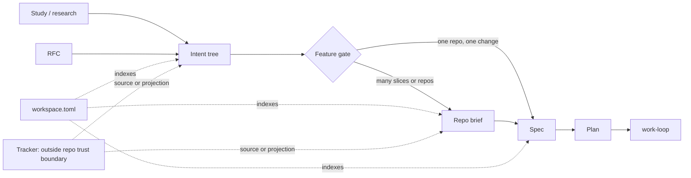
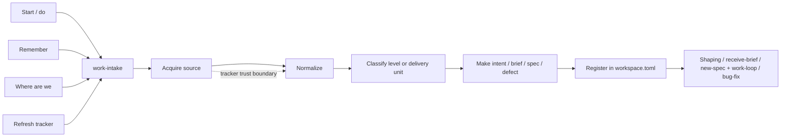
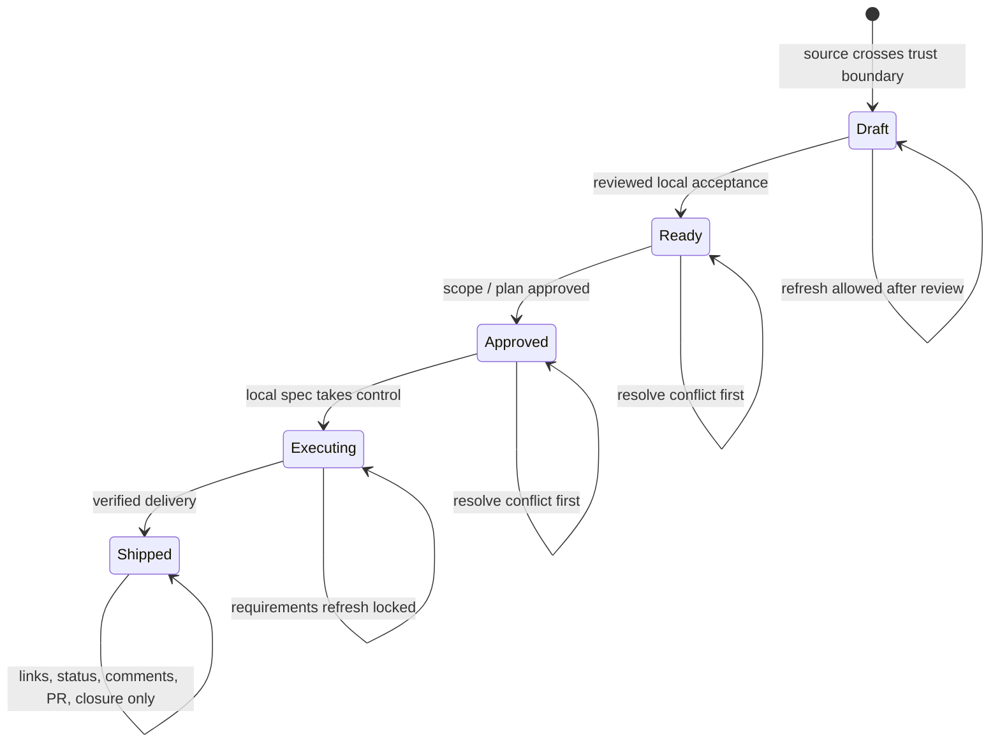
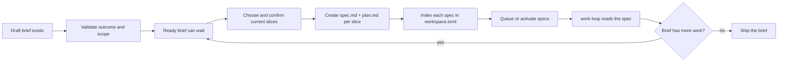

# Work intake and artifact routing

> **Proposed architecture.** This describes where the repository should go next. It is not a claim about what the current skills, parser, or `workspace.toml` already do.

We need one way to answer a basic question: given some work, what is the first local artifact worth creating? Today the answer varies by skill and tracker. That leaves us with a few awkward outcomes: a one-spec change wrapped in a brief, a tracker collection treated as a requirement, or a queue comment doing the job of a spec.

This paper sets a common model. It needs a new RFC before implementation and a new ADR refining part 2 of [ADR-0019](../adr/0019-product-intent-ontology-and-brief-projection.md): an app-scale feature no longer becomes a brief by default. [ADR-0033](../adr/0033-intent-level-open-recognized-set-decoupled-from-scale.md)'s decision on `Level` and `Scale` remains intact. So do [ADR-0009](../adr/0009-product-brief-layer-and-plan-owned-lld.md)'s brief layer and plan-owned LLD.

The decisions are straightforward: use `work-intake` as the single standalone front door; create briefs only when they earn their keep; index artifacts rather than requirements in `workspace.toml`; and say who owns tracker-imported fields at each lifecycle stage.

## Goals and boundaries

This design should let an adopter bring in work without knowing the local skill names or tracker vocabulary. It should leave a real artifact behind before anything becomes dispatchable. A later session should be able to see what is ready, what is blocked, and why, without guessing from old comments.

The result is testable: every dispatchable entry resolves to a spec and plan; deleting or rewriting comments does not change routing; and two sessions reading the same files report the same ready, blocked, active, and reconciliation sets.

It does not build a tracker replacement, a cross-repo control plane, or a new product-process mandate. It does not make every team create intents before writing a spec. It also does not change any skill, schema, parser, RFC, ADR, or `workspace.toml` in this change.

## The model

An **intent** is one recursive artifact. It is tagged with a `Level`. The recognized starting set is:

```text
product-vision → product-strategy → capability → feature
```

The set is open. An organization can add `initiative`, `epic`, `solution`, or another useful rung. Decompose one level at a time. `feature` is the last intent level.

A **spec** (or slice) is what a feature produces for delivery. It is not another intent level. A spec is one independently shippable, verifiable behavioural contract. Its plan says how to build and verify that one contract.

Do not blend the following ideas:

| Term | What it answers |
| --- | --- |
| `Level` | At what product altitude is this decision? |
| `Scale` | Does this concern one app or a business unit? |
| `Kind` | Is this an outcome or opportunity traceability role? |
| Workspace type | Which operating route should handle it? |
| Tracker object type | What does an external tool happen to call it? |

In particular, a workspace initiative is a coordination scope. It is not proof that an intent has `Level: initiative`.



The solid arrows are the requirements path. The dotted arrows are references, provenance, or a controlled import/export. A tracker can be the source of imported fields without becoming the repository's source of truth for everything.

## When a feature needs a brief

A brief earns its place when it holds something a spec cannot: the shared outcome and cut across several specs, or the local slice of a cross-repo effort.

| Situation | Create |
| --- | --- |
| One independently shippable change in one repo | A spec |
| Several independently shippable changes in one repo | A brief, then specs |
| One feature spanning component repos | One brief per affected repo, then specs |
| One spec with useful cross-repo coordination/provenance | A brief is allowed |

This is a deliberate refinement of the current “app-scale feature intent is a brief” rule in [ADR-0019](../adr/0019-product-intent-ontology-and-brief-projection.md) and [decompose-intent](../../packs/product-engineering/.apm/skills/decompose-intent/SKILL.md). A one-spec brief is not forbidden, but it needs a reason beyond “that is the usual shape.”

Start with shippability, not components. “The API” and “the screen” are not separate specs unless each can ship and be useful on its own. Likewise, a milestone, board, sprint, cycle, or JQL result is not a brief just because it contains several issues. It becomes one only when those issues serve one feature-level outcome and require several specs.

## What each artifact is for

| Artifact | Its job |
| --- | --- |
| Study/research | Hold evidence |
| RFC | Propose a cross-cutting change and its governance constraints |
| ADR | Record a durable architectural decision |
| Intent | Hold an outcome, opportunity, assumptions, and product decomposition |
| Brief | Hold a repo's multi-spec or cross-repo projection envelope |
| Spec | Define one shippable, verifiable behaviour |
| Plan | Explain how to implement and verify one spec |
| Tracker object | Represent upstream demand or external coordination |
| `workspace.toml` | Index artifacts, lifecycle, hard dependencies, provenance, and short display summaries |

Names from other methods do not decide this. A BRD, PRD, FRD, SRS, or Jira Story can contain different kinds of work. Route the content instead:

- A product outcome or opportunity becomes an intent at the right level.
- A repo outcome that needs several specs becomes a brief.
- One shippable contract becomes a spec.
- A cross-cutting proposal becomes an RFC.
- Evidence becomes study/research.

`workspace.toml` is not another requirements document. Its comments are for people reading the file. Routing ignores them, and a later agent must never have to reconstruct a full spec from a comment.

## Tracker profiles, not tracker ontology

Different tools cut work at different places. Their names are hints, not local truth.

| Local unit | Common tracker profiles |
| --- | --- |
| Product vision or strategy | Initiative, theme, strategy, roadmap item |
| Capability | Initiative or portfolio epic |
| Feature intent | Linear Project, Jira Align Feature, Jira Software Epic, GitHub Milestone |
| Spec/slice | Linear Issue, Jira Story/Task, GitHub Issue |
| Defect | A bug or defect workflow |

The profile still has to pass the coherence and shippability test. A board is usually a scheduling view. A sprint is usually a time box. Neither tells us whether we should write a brief.

## `work-intake`: one front door

`work-intake` is the proposed standalone core front door. It does not depend on another pack, a particular tracker, or a pre-existing intent tree. It works from the material in front of it:

- “Start/do this” creates or processes an intent, brief, spec, or defect.
- “Remember this for later” records a capture without pretending it is ready to build.
- “Where are we?” shows lifecycle, blocked work, broken references, and the next action.
- “Refresh this from the tracker” fetches source data and applies a permitted reviewed change.

If the input is a product outcome or opportunity, `work-intake` can route or materialize an intent. It does not need special installation state to do so. It also does not invent an intent when the direct answer is a brief, spec, defect, or capture.

This replaces `capture-work` in the target design. The RFC should decide whether to leave a short-lived alias for existing users or remove it directly. Either way, `work-intake` is the sole public intake surface.



The common path is simple: acquire the source, normalize it, decide whether it is an intent or a delivery unit, make the right local artifact, register that artifact, then call the processor that owns the next step. Status is usually read-only; its source is the workspace index and the artifacts it names.

## Who owns imported requirements?

There are two modes.

- **Repo-origin.** The local intent, brief, or spec is authoritative. The tracker is a projection.
- **Tracker-origin.** The tracker owns the fields imported from it until the local team accepts them.

Tracker-origin does not mean “the tracker overwrites the repository.” Ownership is per field and recorded as provenance. Refresh is always a reviewed delta, not a blind sync.

This lifecycle follows imported requirements through local acceptance and into a spec. A brief has its own, simpler lifecycle in the next section.



In Draft, source-owned fields can refresh after a reviewed delta. In Ready and Approved, a refresh needs explicit conflict resolution. In Executing, the spec is authoritative and requirement refresh is locked. After execution, tracker writes are limited to trace links, status, comments, PR links, and closure.

This explains [linear-brief-sync](../../packs/linear/.apm/skills/linear-brief-sync/SKILL.md): it is a tracker-origin refresh before execution, not a mysterious exception to “trackers are one-way renders.” Repo-origin remains useful when a team authors locally and only publishes a tracker view.

## What happens after a brief is received

A brief is a durable planning envelope, not a dispatchable work item. It may stay Ready for as long as the team wants, with no specs or plans yet. Only the slices chosen for delivery move into specs and plans.



That flow gives each stage a concrete result:

1. `work-intake` or `author-brief` writes the brief file and registers its path in `brief_queue.draft`.
2. `receive-brief` fills the load-bearing gaps. Once the brief itself is accepted, it moves to Ready. The flow may stop here without creating delivery work.
3. When the team chooses work from the brief, `receive-brief` shows the slice cut for that delivery and waits for confirmation.
4. `new-spec` creates a `spec.md` and `plan.md` for each selected slice. Each spec carries its `Brief:` back-link and source provenance.
5. Only then are structured work entries added to `workspace.toml`. Each entry names an existing `spec.md`, its brief as the source artifact, a display summary, and any hard `needs` edges.
6. The brief is Executing while a child spec is active. When the current batch finishes, it returns to Ready if the brief still has in-scope work. It moves to Shipped only when the brief is explicitly closed and every materialized child spec is shipped.

Deferred or future work stays in the brief's own scope and decomposition, where it can be reviewed. It does not need a placeholder work entry. If another slice is chosen later, create its spec and plan, then register it. Do not leave a proposed slice in a queue comment for a future session to interpret.

Brief lifecycle follows these conditions. If stored membership disagrees with them, `workspace-status` reports drift instead of guessing:

| Brief state | Condition |
| --- | --- |
| Draft | The brief exists, but its load-bearing fields or acceptance are incomplete. |
| Ready | The brief is accepted and has no active child spec. It may have zero, queued, or shipped child specs and may remain here indefinitely. |
| Executing | At least one child spec is active and not all children are shipped. |
| Shipped | The brief is explicitly closed, has no remaining in-scope work, and every materialized child spec is shipped. It moves to `brief_queue.shipped` so the workspace keeps a structured history. |

The children come from structured links: each derived spec's `Brief:` metadata and its workspace `source.artifact`. Remaining scope stays in the brief itself. Comments cannot add a child, change the cut, or move the brief between states.

The target shape looks like this. The exact TOML syntax belongs to the RFC, but the references and meanings do not:

```toml
["ini-002".brief_queue]
ready = [
  { path = "docs/product/briefs/account-recovery.md", kind = "brief", source = { mode = "tracker-origin", ref = "PROJ-123" }, summary = "Make account recovery self-service" },
]

["ini-002".work]
queue = [
  { path = "docs/specs/self-service-reset/spec.md", kind = "spec", source = { artifact = "docs/product/briefs/account-recovery.md", ref = "PROJ-123" }, summary = "Let a user reset access without support", needs = [] },
]
```

The brief holds the shared outcome, decomposition, and anything intentionally deferred. The spec holds a selected delivery contract. The plan holds its build strategy. `workspace.toml` holds only the index and lifecycle facts needed to find and sequence them. A Ready brief with no work entries is valid and non-dispatchable.

## What the existing skills should do

| Surface | Target responsibility |
| --- | --- |
| `work-intake` | Standalone entry point for start, capture, status, and refresh routing |
| `capture-work` | Removed or retained briefly as a compatibility alias |
| `author-brief` | Turn unstructured multi-spec input into a Draft brief |
| `receive-brief` | Validate an existing brief and leave it Ready; when delivery is chosen, confirm the current cut and produce specs |
| `new-spec` | Materialize one shippable contract, including provenance |
| `work-loop` | Execute an existing spec and plan; never rebuild requirements from workspace comments |
| `workspace-status` | Show lifecycle, next actions, and reconciliation failures |
| Tracker adapters | Read and normalize source data, then route by local unit |
| Tracker status/triage skills | Inspect or improve tracker state without creating repo artifacts by default |
| Linear sync | Refresh source-owned fields before execution |

The important boundary is between acquisition and routing. An adapter knows how to fetch a tracker object. It does not get to decide that every issue or collection deserves a brief. Defects stay on the defect route unless the input shows a different need.

## The `workspace.toml` contract

Every entry points to a real artifact. Queue membership is lifecycle state, not a substitute for the artifact. Given the same files and parsed TOML, two sessions must reach the same routing result.

```text
path:     artifact path
kind:     intent | research | design | brief | spec | defect
source:   origin, tracker identifier/URL when relevant, field ownership
summary:  display only
needs:    hard dependencies
```

Routing may use only the structured entry, whether the referenced file exists, machine-readable artifact status, and explicit `needs`. It must not depend on comment text, list order, nearby prose, or what a previous session happened to know.

The RFC will choose exact field names and migration details. It must preserve these rules:

- Dispatchable work points to an existing `spec.md`; its sibling `plan.md` must also exist before execution.
- A brief queue entry points to an existing brief.
- A shaping entry points to an intent, research artifact, or design artifact.
- A missing artifact is a reconciliation failure, or it is a non-dispatchable capture.
- Comments do not affect routing.
- A queue entry never authorizes an agent to infer the complete contract from surrounding comments.
- A spec derived from a brief has the same brief path in its `Brief:` metadata and workspace source index. A mismatch is a reconciliation failure.
- `needs` contains hard artifact dependencies only. Priority, affinity, suggested ordering, and rationale belong elsewhere.
- Unknown kinds, malformed entries, duplicate lifecycle membership, and impossible transitions fail closed as reconciliation findings. The parser never falls back to comments.

Provenance records identifiers and links, not credentials or a copied tracker payload. Refresh happens on an explicit request; this design does not add a polling service or webhook.

`workspace-status` should report broken references and inconsistent brief/spec links. A dispatcher should not start work until the referenced spec, plan, and hard dependencies exist. A capture without an artifact can remain visible; it cannot quietly become dispatchable work.

## Other shapes we could choose

We could keep the current rule that every feature becomes a brief. It is easy to explain, but it leaves a one-spec change with a wrapper that adds no useful information.

We could make tracker objects the local model. That would reduce translation at first, but a Jira Epic, a Jira Align Feature, a Linear Project, and a GitHub Milestone do not mean the same thing. The local model would change every time a team changed tools.

We could let `workspace.toml` comments carry enough detail for a later session to write a spec. That makes capture feel cheap, but it removes the acceptance criteria, provenance, and review point that make a spec safe to dispatch.

## Risks and how to contain them

The feature gate is a judgment call. A loose outcome can make unrelated tracker issues look coherent. The RFC should include routing examples and evaluations for one spec, many specs, cross-repo work, collections, and defects.

Tracker-origin refresh can create difficult conflicts. Keep the first version small: record field ownership, show the delta, require an explicit decision, and lock requirement refresh once execution starts.

Migration can leave old queue entries pointing nowhere. Treat each missing path as a visible reconciliation failure or an explicitly non-dispatchable capture. Do not silently promote it.

A Ready brief can sit untouched long enough for its source or assumptions to age. `workspace-status` should keep it visible without calling it build-ready, and tracker-origin refresh rules still apply before a deferred slice is materialized.

The operational failure to watch is a broken reference at session start. `workspace-status` needs to show it plainly, and dispatch needs to stop before an agent starts work from a comment.

## What conflicts today

This table separates evidence from the conclusion we should draw from it.

| Topic | Evidence | What it means | Proposed fix |
| --- | --- | --- | --- |
| Raw brief input | [receive-brief](../../packs/core/.apm/skills/receive-brief/SKILL.md) says it receives PRDs/packets and accepts pasted documents, links, and verbal sketches. Its anti-pattern says raw email or Linear input must first use `author-brief`. | The entry rule is unclear. | `author-brief` makes Draft briefs from unstructured multi-spec input; `receive-brief` processes an existing brief. |
| Captures | [capture-work](../../packs/core/.apm/skills/capture-work/SKILL.md) writes only `workspace.toml`, creates no spec, and asks for comments sufficient to write a full spec later. | Comments can become the real requirements store. | Replace it with `work-intake`; captures stay non-dispatchable until an artifact exists. |
| One issue | The [tracker guide](../../guides/_shared/how-to/choose-a-tracker-integration.md) says one issue is not a brief. The proposed [PM journey](../product/journeys/pm-intakes-from-tracker.md) and [RFC-0064](../rfc/0064-ini-001-ai-native-ecosystem.md) describe issue-to-brief intake. | Container names are doing too much routing work. | Use outcome coherence and shippability, not the object name. |
| Feature equals brief | [ADR-0019](../adr/0019-product-intent-ontology-and-brief-projection.md) and [decompose-intent](../../packs/product-engineering/.apm/skills/decompose-intent/SKILL.md) make an app-scale feature a brief. | A one-spec change gets an empty wrapper. | Adopt the feature gate through an ADR refinement. |
| Tracker authority | The [intent reference](../../guides/product-engineering/reference/intent-fields-and-modes.md) calls trackers one-way renders. [Linear sync](../../packs/linear/.apm/skills/linear-brief-sync/SKILL.md) imports reviewed deltas and locks at Executing. | “One-way” does not explain the Linear path. | Name repo-origin and tracker-origin modes. |
| Registration | `author-brief`, `receive-brief`, and [Linear intake](../../packs/linear/.apm/skills/linear-brief-intake/SKILL.md) explicitly update `brief_queue`; [Jira](../../packs/atlassian/.apm/skills/jira-brief-intake/SKILL.md), [Jira Align](../../packs/atlassian/.apm/skills/jira-align-brief-intake/SKILL.md), and [GitHub](../../packs/github/.apm/skills/github-brief-intake/SKILL.md) stress file creation and handoff. | Queue visibility depends on the adapter. | Routing registers every materialized artifact. |
| Collections | [Jira intake](../../packs/atlassian/.apm/skills/jira-brief-intake/SKILL.md) accepts a board, sprint, or JQL result as a brief story list without a confirmed common outcome. | A scheduling/query view can masquerade as one body of work. | Check shared outcome and multi-spec need before creating a brief. |

## Order the implementation this way

1. **RFC and ADR refinement.** Done when the RFC settles routing, provenance, authority, and compatibility, and a new ADR records the ADR-0019 refinement without editing its frozen body.
2. **Normalized intake and workspace contract.** Done when both have a versioned contract for path, kind, provenance, display summary, and hard `needs`.
3. **Parser, status, and work-loop checks.** Done when broken references are visible and no dispatcher or work-loop run can get a contract from comments.
4. **Standalone `work-intake` and core boundaries.** Done when it independently routes normalized input and the `capture-work` removal/alias decision is complete.
5. **Tracker adapters.** Jira, Jira Align, Linear, and GitHub can change in parallel once they all normalize input, run the feature gate, and register artifacts the same way.
6. **Refresh and write-back.** Done when reviewed deltas, conflicts, the execution lock, and allowed post-execution writes are implemented and tested.
7. **Migration and guides.** Done when old entries are reconciled or marked as captures, aliases are documented if kept, and routing evaluations cover one spec, many specs, cross-repo work, collections, and defects.

Roll this out in those phases, not as a big-bang rewrite. Each phase can be reverted by retaining the old reader or alias until the next contract is proven. The maintainer group that accepts the RFC owns the rollout window and decides when an old compatibility path can be removed.

The remaining judgment call is whether `capture-work` gets a temporary alias. Both choices are reasonable: an alias reduces upgrade friction; direct removal keeps one front door truly singular. The RFC author and core maintainers should decide it from adopter migration evidence.

## Checks before adopting it

An RFC based on this paper should challenge six things: did we give two artifacts the same job; did we skip an intent level; did a tracker label become canonical; did `workspace.toml` become a second requirements store; did we create a brief with no added value; and is refresh authority obvious at every lifecycle state?
