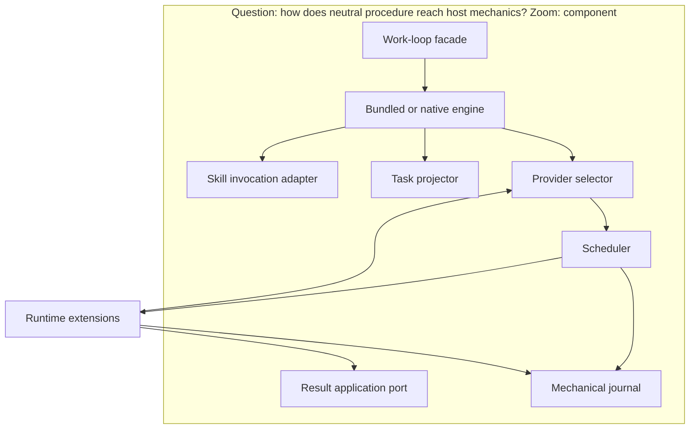

# Subsystem Design — Workspace execution supervisor

**Decision sought:** Keep `work-loop` as the public skill while a bundled,
replaceable supervisor engine owns procedure, mutable task projection,
recovery, and parallelism; Pi is an optional external compatibility target,
not a Core runtime dependency or replacement.
**Author:** Platform Core
**Status:** Draft
**Last updated:** 2026-10-01
**Reviewers:** `agentbundle` and Core pack maintainers

## 1. Scope and Context

| In scope | Out of scope | Why |
| --- | --- | --- |
| Task projection, capability selection, attempts, leases, recovery | Acceptance meaning | Infrastructure cannot redefine product truth |
| Sequential and parallel scheduling | Task priority policy | Skills own policy, tooling owns procedure |
| Agent, process, workspace, and journal adapters | Host UI | Presentation is an extension concern |
| Execution result production | Applying results to the canonical tree | [Product result integration](work-loop-result-integration.md) owns merge and commit |

The subsystem guarantees sequential execution and equivalent outcomes.

## 2. Structural Model

| Element | Type | Responsibility | State |
| --- | --- | --- | --- |
| Work-loop facade | Skill | Load policy, launch a provider, mediate decisions | Interaction |
| Bundled supervisor engine | Self-contained script | Default provider; invoke skills and mechanics without runtime `agentbundle` | Coordinator state |
| Task projector | Pure component | Derive tasks from criteria and plan guidance | Stateless |
| Replan guard | Pure component | Compare the reviewed and current execution-envelope fingerprints; admit task-only changes or route protected changes | Stateless |
| Terminal/stub guard | Pure component | Enforce `spec-plan` no-dispatch and code-mode current-task red-before-green proof | Stateless |
| Skill invocation adapter | Host port | Dispatch typed requests to installed skills | Attempts |
| Provider selector | Component | Validate one selected provider and its fixed capability declaration | Selected provider |
| Scheduler | Component | Derive ready tasks and choose execution mode | Active leases |
| Result-application port | Host port | Use legacy acknowledged-worktree adapter through slice 4, then protected-ref integration | Result receipts |
| Mechanical journal | Port | Store attempts, checkpoints, leases, and effect receipts | Mechanical facts |
| Effect-resolution port | Semantic port | Persist named human decisions for unknowable external effects | Resolution records |
| Runtime extensions | Adapters | Execute without control-plane writes | Private state |

Public choices stay orthogonal rather than becoming one larger mode enum:

| Input axis | Retained values | Effect |
| --- | --- | --- |
| Workflow policy | `light`, `full` | Select obligations and reviewer depth |
| Terminal intent | `code`, `spec-plan` | Permit implementation or stop after approval |
| Execution topology | `sequential`, `isolated`, `parallel` | Choose workspace and scheduling mechanics; degrade toward sequential |
| Invocation intent | `start`, `resume`, `recover` | Begin, rehydrate, or reconcile |

Combinations change procedure, never acceptance.

The [runtime adapter crosswalk](runtime-adapter-crosswalk.md) maps supported
hosts to these ports. Core exposes the neutral protocol and conformance kit;
Pi extensions install separately.

## 3. Runtime Model

| Scenario | Trigger | Path |
| --- | --- | --- |
| Execute ready tasks | Policy selects an operation from the current task projection under an accepted initial-plan review | Normal |
| Replan tasks | A working-plan revision stays inside the reviewed envelope | Cancel unintegrated predecessor attempts and reproject without approval |
| Cross a protected planning boundary | A replan changes the envelope or review-authorized terminal intent | Refuse and route to the owning amendment or plan-review authority |
| Recover an attempt | Lease expires or runtime disappears | Failure and recovery |

**Provider selection.** Policy names one installed `adapter-descriptor.v1`.
The selector rejects bad identity, version, capability, conformance, or trust.
Effective authority intersects policy, request, host, and provider grants.

The grant is journaled before dispatch. The scheduler derives ready tasks from
dependencies, isolation, capabilities, and leases; it never owns acceptance.
Multi-provider composition waits for a demonstrated need.

Before projection, the replan guard derives `reviewed-execution-envelope.v1`
from current owning approvals and compares its fingerprint with the accepted
`initial-plan-review.v1` and proposed working-plan references. Missing,
ambiguous, or changed protected inputs refuse; task-only changes pass. The
terminal/stub guard reads the separately authorized intent from initial review.
`spec-plan` emits a terminal receipt and refuses task projection,
execution requests, or repository test writes. In `code`, each current TDD task
names either its proposed stub bytes plus a confined scratch compile/red
receipt, or a current `no stub` disposition; missing or mismatched proof refuses
dispatch.

The first code operation materializes current task-contract bytes, verifies
identity, and records red before production edits. A pre-dispatch revision gets
new projection and operation identities without approval. Recovery repeats the
checks; unexpected bytes refuse. Compatibility reverse-reads terminal intent;
downgrade needs explicit approval of the current plan snapshot.

Unknown external effects fail closed pending a receipt or human decision.

**Normal sequence**

1. The projector derives task contracts, operation keys, access sets and proof,
   code trust, and write, network, child, and resource bounds. Omission denies.
2. The scheduler journals a lease before provider dispatch.
3. The adapter works inside containment and returns `access-attestation.v1`.
   External effects use a stable key; acknowledgement follows receipt storage.
4. The result port applies Product addition safety before acknowledgement.
   Slices 1–4 require `legacy-result-ack.v1`; slice 5 switches to the
   [integration boundary](work-loop-result-integration.md). Only its receipt
   admits observations and releases the lease.

**Failure and recovery sequence**

1. A missing heartbeat expires the lease; an unknown external effect remains
   non-retriable.
2. After journal loss, the projector regenerates the operation key.
3. Reconciliation queries the effect source. Presence restores the receipt;
   absence permits retry.
4. If unknowable, the supervisor reads `effect-resolution.v1`; without one it
   records `needs-decision` for named human authority.
5. `effect-confirmed` reconstructs; `do-not-retry` ends work; and
   `retry-authorized` names one attempt and duplicate risk. Lock plus CAS stores
   one claim before dispatch; a post-claim crash needs a new decision.
6. A successor projection cancels unintegrated attempts and leases. Integrated
   results remain facts. Protected changes require their owning amendment.

## 4. Contracts and Invariants

| Contract | Producer → consumer | Identity | Compatibility and change authority | Failure semantics | Invariant |
| --- | --- | --- | --- | --- | --- |
| `task-contract.v1` | Projector → replan guard, terminal guard, scheduler, and adapter | Subject, envelope fingerprint, initial-review lineage and authorized terminal intent, task-projection revision, work, task, operation; current stub fingerprint or `no stub` disposition | Contract owners approve schema; policy may replace in-envelope task revisions; unknown majors refuse | Invalid graph, envelope/intent mismatch, authority, scratch receipt, stub identity, or proof capability refuses | `spec-plan` produces no execution request; code-mode TDD dispatch follows byte-identical current-task red proof |
| `adapter-descriptor.v1` | Extension → selector | Provider, version, implementation, trust, capabilities, conformance | Contract owners approve; unknown majors refuse | Missing, duplicate, insufficient, or untrusted stays unavailable | Selection grants no authority |
| `runtime-capability.v1` | Provider → scheduler/coordinator | Capability, major, provider | Owners approve; majors match | Missing capability refuses | Grants intersect request, policy, host, provider |
| `skill-request.v1` | Engine → skill adapter | Subject, task, skill, request, attempt | Core policy owners approve; unknown skill or major refuses | Missing or interrupted skill leaves an incomplete attempt | Output is behavior or observation, never authority |
| `execution-request.v1` | Coordinator → runtime adapter | Request, attempt, operation, grant fingerprint | `agentbundle` owners approve; adapters negotiate | Unsupported restriction or capability refuses | Authority never exceeds task, policy, host, or adapter bounds |
| `execution-result.v1` | Runtime adapter → coordinator and result port | Subject, task-projection revision, task, attempt, operation, trees, change digest, access-attestation fingerprint | Canonical schema owns fields; readers precede writers | Partial, canceled, superseded, or unverifiable result stays isolated | Authority begins only at active-port acknowledgement |
| `access-attestation.v1` | Verified read allowlist or tracer → scheduler and result port | Attempt, source, mechanism/version, declared and observed sets, coverage, containment | Security owners approve mechanisms; unknown or unverifiable coverage becomes incomplete | Missing proof forbids parallel admission | Only enforced allowlist or complete trace is complete; otherwise serialize and require exact source |
| `legacy-result-ack.v1` | Slice-4 compatibility adapter → coordinator, subject source, evidence port | Subject, task-projection revision, task, attempt, operation, acknowledged worktree manifest | Canonical schema owns fields; valid only while legacy provider is active | Unsafe addition, stale projection, or ambiguous worktree refuses | Ack proves addition admission; slice 5 disables it after parity |
| `mechanical-journal.v1` | Scheduler/adapters → store/reconciler | Run and attempt IDs | `agentbundle` owners approve; stores advertise versions | Corruption or loss triggers operation-key reconciliation | Never owns completion or sole effect proof |
| `effect-resolution.v1` | Human authority via resolution port → reconciler | Subject, operation, attempt, decision, revision | Policy owners approve; records append only | Revision loss, duplicate claim, or bad authority refuses | Lock and CAS admit one durable retry claim |

Plans declare dependencies and isolation, not waves.

## 5. Data and State

| Element | State it owns | Lifecycle | Consistency requirement |
| --- | --- | --- | --- |
| Task projector | Stateless | n/a | Same inputs, same graph |
| Replan guard | None | Re-evaluated for every working-plan or task revision | Matching envelope permits reprojection; any protected-reference mismatch refuses before leases or writes |
| Provider selector | Descriptor/selection | Selected, rejected, retired | Explicit ID yields one provider or refusal |
| Scheduler | Leases | Acquired, renewed, expired, released | One live lease per task and execution scope |
| Journal | Attempts, sessions, checkpoints, cached effect receipts | Append, delete, rebuild, and reconcile | Loss triggers operation-key reconciliation before dispatch |
| Effect-resolution store | Checksummed `delivery/effect-resolutions.jsonl` | Locked revision CAS | Semantic, single-claim, journal-independent |
| Terminal/stub guard | None | Re-evaluated before projection and dispatch | Same initial-review terminal intent, current task contract, product tree, and scratch receipt produce the same refusal or materialization permission |
| Adapter | Opaque host handles | Created, observed, retired | Handles are never semantic authority |
| External effect source | Result keyed outside journal | Created, queried | Idempotent, queryable, or non-retriable |

## 6. Deployment and Operations

| Unit | Runs as | Scaling | Observability |
| --- | --- | --- | --- |
| Bundled provider | Self-contained script inside `work-loop`; no `agentbundle` install | Sequential floor | Provider, request, operation, result, duration |
| Optional external provider | Separately installed extension behind the same facade | Declared capacity | Capabilities, degradation, conformance digest, dependency isolation |
| Legacy result adapter | Bundled compatibility service calling current engine application | One result at a time through slice 4 | Operation, manifest, acknowledgement, refusal |
| Sequential adapter | Local adapter; containment for untrusted code | One task | Trust, roots, containment/refusal |
| Pi compatibility client | Separately installed trusted Pi extension; verified host containment for untrusted executable code | Session or child-session capacity | External conformance receipt plus Pi session and tool event references; no Core import or default selection |
| Workspace/process adapters | Contained local extensions | Host capacity | Workspace/process status |
| Mechanical journal | Local or adapter store | 1,000,000 records or 1 GiB; then refuse | Records, bytes, rebuild duration |
| Effect-resolution port | Semantic append store | One confined interprocess lock per operation key | Revision, claim winner, contention, recovery reason |

Same-process adapters are not sandboxes. Untrusted code requires verified host
containment or execution refuses. A named human classifies trusted code.

## 7. Quality Scenarios and Verification

| Stimulus | Mechanism and response | Target | Verification |
| --- | --- | --- | --- |
| Provider lacks parallelism | Selector uses the sequential scheduler | 100% semantic coverage retained | Capability-degradation fixture |
| Crash after external effect | Effect-receipt invariant refuses duplicate execution | Zero automatic repeats without receipt or idempotency key | Crash-point fixture |
| Parallel schedule changes order | Task graph plus protected-ref integration preserves both non-conflicting results | Same product tree and acceptance verdict as sequential run | Paired execution and integration-permutation fixture |
| Journal is deleted after an external effect | Stable operation key reconciles the external source before dispatch | Zero duplicated effects | Crash-after-effect, delete-journal, rebuild fixture |
| External effect remains unknowable after journal loss | Durable resolution reconstructs, stops, or authorizes one linked retry | Zero dispatches without a current resolution | One fixture per resolution outcome |
| Two reconcilers claim one authorized retry | Per-key lock and revision CAS admit one claim before either dispatches | Exactly one durable winner and at most one dispatch | Concurrent claim and crash-after-claim fixtures |
| Worker tries to modify a semantic record | Write-root containment denies the control-plane path | Zero forged criteria, evidence, reports, or dispositions across adapters | Cross-adapter negative conformance fixture |
| Provider is missing, duplicated, or under-capable | Refuse before dispatch | One provider or refusal | Identity, capability, conformance, authority fixtures |
| Host proposes broader network, child-process, or resource authority | Grant intersection narrows to requested policy bounds or refuses | Zero overgranted executions and deny-all omission behavior | Network, child-process, and resource-limit property fixtures |
| Task graph or journal reaches its bound | Refuse before partial scheduling | Scheduling p95 ≤2 s; cold rebuild ≤10 s on the CI worker | Bound stress fixtures |
| An in-envelope task revision supersedes active guidance | Replan guard admits it; scheduler cancels unintegrated predecessor attempts and reprojects; integrated facts remain | Zero approval prompts, zero superseded integrations after acknowledgement, and zero delivery resets | Reorder, split, replacement, revision-race, task-regeneration, and evidence-preservation fixtures |
| A task revision crosses a protected boundary | Replan guard refuses and identifies the owning spec, decision, or risk amendment | Zero leases or dispatches from boundary-changing replans | Criterion, scope, security, contract, durable-output, terminal-intent, and risk mutation fixtures |
| `spec-plan` or code-mode TDD reaches dispatch | Guard stops without product writes, or materializes exact current task-contract bytes and proves red first | Zero `spec-plan` test files and zero production edits before byte-identical red | Terminal, scratch, task-revision, crash, byte-mismatch, red-to-green, and reverse-reader fixtures |
| Slice-4 supervisor returns a result | Legacy adapter delegates application and binds the acknowledged manifest | Same tree/evidence boundary as current engine | Worktree application, crash, stale-ack, and slice-5 parity fixtures |
| B reads undeclared input changed by A | Enforcement denies the read or tracing expands B's attested set; otherwise B is incomplete | Zero stale parallel integration | Cross-adapter undeclared-read fixture |

| Runtime surface | Support status | Capability declaration | Required conformance |
| --- | --- | --- | --- |
| Sequential local | Reference floor | Coordinator, scheduler, process, journal, containment | Truth-table, crash, review, forgery |
| Pi | Optional compatibility target; external extension only | Agent/session plus process, journal, containment | Shared suite, session-loss recovery, and a clean Core environment with Pi absent |
| Claude Code | Target | Agent, hook, process, journal | Shared suite; hook/subagent interruption |
| Codex | Target | Agent, tool, process, journal | Shared suite; tool interruption/refusal |
| Conductor workspace | Composition, not agent loop | Workspace plus conforming agent adapter | Shared suite; archive, resume, branch isolation |
| tmux | Mechanics, never isolation | Terminal/process plus agent and containment adapters | Shared suite; detach, server loss, process recovery |

## 8. Implementation Mapping

`contracts/delivery/supervisor-bundle.toml` lists authoritative inputs.
`tools/build-work-supervisor.py` embeds schemas and standard-library modules
into `work-loop/scripts/work-supervisor.py`, records digests, and rejects other
imports. Tests run without repository packages; `agentbundle` is only the
builder and test host.

Slices 1–3 expose acceptance, review, and knowledge services to the current
engine. Slice 4 makes the artifact the procedure owner.

| Element | Source owner | Build unit | Verification |
| --- | --- | --- | --- |
| Bundle manifest and builder | `contracts/delivery/supervisor-bundle.toml`; proposed `tools/build-work-supervisor.py` | Build tooling | Reproducible digest, source parity, clean-environment import fence |
| Task projector/contracts and replan guard | Proposed `work_supervisor/projector.py`; `contracts/delivery/` schemas | Bundle source/contracts | Schema, graph, in-envelope mutation, protected-boundary, cancellation, and regeneration fixtures |
| Terminal/stub guard | Proposed `work_supervisor/terminal_guard.py`; current task stub fields in `task-contract.v1` | Supervisor bundle | No-dispatch, scratch receipt, task revision, byte identity, crash recovery, and reverse-read tests |
| Facade and engine | `work-loop/SKILL.md` plus `scripts/work-supervisor.py` | Core pack; `agentbundle` builds/tests | Import-fence, invocation, scheduling, recovery |
| Provider protocol and scheduler | `contracts/delivery/` plus proposed `work_supervisor/supervisor.py` | Contracts, build tooling, providers | Schema parity and conformance |
| Provider selector | Proposed `packages/agentbundle/agentbundle/work_supervisor/provider.py` | Bundle source | Identity, capability, trust, and refusal tests |
| Slice-4 legacy result adapter | Proposed `work_supervisor/legacy_result.py`; delegates current `loop-cohort.py` task completion and active legacy subject source | Supervisor bundle | Application, acknowledgement, crash, and protected-ref parity tests |
| Mechanical journal | Proposed `packages/agentbundle/agentbundle/work_supervisor/journal.py` | `agentbundle` | Crash and reconciliation fixtures |
| Effect-resolution port | Proposed `packages/agentbundle/agentbundle/work_supervisor/effect_resolutions.py` | `agentbundle` | Authority, journal-loss, and one-shot retry tests |
| Runtime extensions | Neutral protocol and conformance kit in Core; optional host-owned adapters outside the bundle | Host adapter artifacts; Pi remains separately installed | Cross-adapter conformance plus clean-environment proof that Core has no Pi import, package, or default selection |
| Result integration boundary | [Product result integration](work-loop-result-integration.md) | `agentbundle` | Merge, CAS, cancellation, and crash conformance |
| Compatibility extension | `packs/core/.apm/skills/work-loop/scripts/loop-engine.py` and `loop-cohort.py` behind the supervisor facade; `.claude/skills/work-loop/` is generated output | Core pack | [Quality scenarios](#7-quality-scenarios-and-verification) |

## 9. Decisions, Alternatives, and Risks

- **Decision:** Select one provider behind neutral capability contracts.
- **Decision:** Treat Pi as an optional external compatibility client; Core
  ships no Pi dependency, bundled adapter, or default selection.
- **Rejected:** Moving the FSM keeps mechanics portable; delegating to one host
  removes the sequential floor; multi-provider resolution lacks a first-release
  case.
- **Risk:** Adapter capability claims drift from behavior. **Mitigation:**
  conformance tests exercise every declared capability.
- **Risk:** A leaked lease stalls work. **Mitigation:** expiry and idempotent
  reconciliation restore state without changing acceptance.
- **Risk:** Parallel workers contend for files or services. **Mitigation:** task
  contracts carry isolation constraints and the scheduler serializes when it
  cannot prove separation.

## 10. Rollout, Migration, and Reversal

The `work-loop` invocation stays stable. Its facade first calls bundled
services, then launches the supervisor after slice-4 parity. Slice 6 validates
a separate Pi extension without changing Core dependencies or defaults.
[Authority migration](work-loop-authority-migration.md) imports the approved
spec and reviewed baseline.

Each cutover bundle
also retains a reverse reader for every semantic schema introduced so far. An
older engine requires a locked plan, so downgrade freezes the current working
snapshot only after explicit downgrade approval; it preserves task history and
refuses a lossy downgrade.

During slice 4, `legacy_result.py` remains the result port and the existing
engine applies worktree changes. Slice 5 shadow-integrates the same results,
compares manifests, then switches the port and subject provider together.

| Responsibility | Owner |
| --- | --- |
| Facade, bundled provider, and cutover | Core pack maintainers; `agentbundle` maintainers own build and conformance tooling |
| Runtime adapter operation | Owning adapter maintainer |
| Rollback authorization | `agentbundle` maintainer on call after parity or recovery failure |
