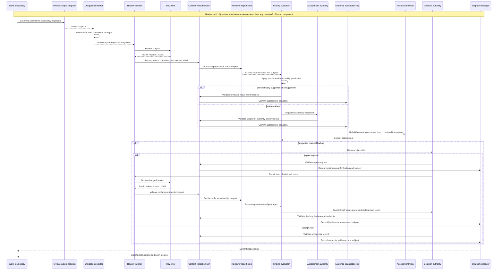

# Subsystem Design — Review and disposition

**Decision sought:** Reduce review to reviewer obligations, portable YAML
reports, actual-failure findings, and explicit dispositions.
**Author(s):** Platform Core maintainers
**Status:** Draft
**Last updated:** 2026-09-30
**Reviewers:** Core reviewer-role maintainers

## 1. Scope and Context

| In scope | Out of scope | Why |
| --- | --- | --- |
| Reviewer selection from a diff | Reviewer reasoning internals | Work-loop needs obligations, not reviewer implementation |
| Report and finding schemas | Model/session orchestration | Harness owns invocation procedure |
| Finding validity and disposition | Acceptance evidence evaluation | Acceptance subsystem owns property support |

**Goals**

- Adding a conforming reviewer requires no work-loop change.
- Every mandatory role has one current terminal report.
- A finding blocks only when it names an actual failure.

**Non-goals**

- Standardizing reviewer prompts, models, or internal checklists.

### Slice dependencies

Review simplification follows acceptance authority because it consumes the
approved `delivery-subject.v1`, `semantic-evidence-transaction.v1`, and shared
content-safety port. Until protected-ref integration exists, a compatibility
projector derives the same review subject from the current canonical result.
The current harness may keep invoking reviewers; neither the new supervisor,
parallel scheduler, nor knowledge intake is required.

Review and knowledge both expose typed producer boundaries, but only review
persists acceptance-critical delivery records. Knowledge observations are
derived from existing facts; optional notification and later capture can fail
without blocking delivery.

## 2. Structural Model

| Element | Type | Responsibility | State |
| --- | --- | --- | --- |
| Review-subject projector | Pure component | Derive one canonical changed-path set from the approved `delivery-subject.v1` | Stateless |
| Obligation selector | Policy function | Compute mandatory and optional roles from a canonical review subject and repository policy | Stateless |
| Review invoker | Harness procedure | Invoke an installed implementation for each selected role | Attempts |
| Content-validation port | Infrastructure component | Apply shared [`content-safety-policy.v1`](delivery-content-safety.md) before persistence | Stateless |
| Report validator | Infrastructure component | Validate schema and subject freshness after content normalization | Stateless |
| Reviewer-report store | Durable semantic store | Atomically retain validated reports and select the current report by role and subject | Reports |
| Finding evaluator | Policy function | Apply deterministic reachability predicates and classify unsupported cases | Stateless |
| Assessment authority | Independent role | Decide only reachability cases that tooling cannot determine | Judgment attempts |
| Assessment view | Disposable projection | Rebuild the current assessment of each finding and subject from the evidence transaction log | Rebuildable index |
| Disposition ledger | Durable fact store | Record accept-risk, repair-request, and fixed-by resolution for supported findings | Dispositions |
| Assessment/evidence bridge | Semantic boundary | Append one authoritative evidence transaction containing an assessment and its receipt delta | In-flight transaction |

## 3. Runtime Model



An invalid, stale, or unavailable mandatory report leaves its obligation
unsatisfied. Reviewer-specific retries and model calls remain inside the
invoker or adapter.

The content-validation port applies the shared boundary profile before the
report validator persists normalized data. Every accepted free-text field uses
typed inert-data framing; protected or unsafe structures never reach the store.

A repair changes the subject and therefore requires a fresh report. The old
finding closes through a `fixed-by` link to that replacement subject and report;
accept-risk binds the named authority, evidence, finding fingerprint, and exact
subject before the ledger acknowledges it.

The bridge keys each receipt to the report tip, finding, assessment revision,
criterion, and acceptance fingerprint. It writes the assessment and receipt or
supersession in one checksummed `semantic-evidence-transaction.v1`; the
assessment view is disposable and that log is its sole durable source.

Accepting risk can satisfy review, but
cannot assert that an acceptance property is true.

On restart, the invoker abandons incomplete attempts and reloads only validated
reports. A changed diff makes reports and dispositions stale, so policy returns
the obligation or finding to open rather than replaying a reviewer verdict.

## 4. Contracts and Invariants

| Contract | Producer → consumer | Identity | Compatibility and change authority | Failure semantics | Invariant |
| --- | --- | --- | --- | --- | --- |
| `review-subject.v1` | Review-subject projector → selector, reports, assessments, dispositions | Delivery acceptance fingerprint, normalized paths/statuses, diff and policy versions | Canonical schema owns fields; policy owners approve normalization; unknown majors leave review unsatisfied | Missing base/result manifest or ambiguous normalization refuses | Approved manifests produce one diff; plan-only revision does not stale it |
| `review-obligation.v1` | Obligation selector → invoker and policy | Role, review-subject fingerprint, policy fingerprint | Core policy owners approve role semantics; optional fields are additive; unknown major versions leave obligations unsatisfied | Missing mandatory implementation blocks review completion | Selection is deterministic for the same review subject and policy |
| `review-report.v1` | Reviewer through content and report validators → report store and finding evaluator | Role, subject fingerprint, port-issued sequence, report ID, superseded report ID | Reviewer-contract owners approve changes; readers deploy before writers; unknown major versions are unusable | Any content-safety refusal rejects the whole report and leaves its obligation unsatisfied | The unique safe lineage tip is current; ambiguity leaves the obligation unsatisfied |
| `finding.v1` | Reviewer through content and report validators → evaluator and assessment authority | Report plus finding ID | Reviewer-contract owners approve changes; blocking reachability fields are required in v1; unknown major versions cannot satisfy a mandatory report | Missing actual failure or unsupported reachability makes an otherwise safe claim non-blocking | Rule, observation, reachable path, actual failure, affected authority, subject, and controlled evidence are explicit |
| `finding-assessment.v1` | Mechanical evaluator or named independent assessment authority through content-validation port → evidence transaction log, assessment view, and policy | Finding, report tip, subject, revision, assessment mode, predicate version or judgment authority | Core review-policy owners approve predicates and authority rules; unknown major versions refuse review closure | Stale or indeterminate paths cannot enter disposition | One evidence transaction contains the assessment and deterministic review-failure receipt or supersession |
| `finding-disposition.v1` | Named decision authority through content-validation and disposition ports → ledger and policy | Supported finding, subject, and decision authority | Core policy owners approve authority rules; unknown major versions leave supported findings open; deprecation waits for dual-reader parity | Missing authority or unsafe content keeps a supported finding open | Only `accept-risk` or `repair-request` applies to a supported finding; `fixed-by` names its replacement subject and fresh report |

```yaml
role: adversarial-reviewer
status: findings
subject: review-subject-sha256:example
findings:
  - id: ADV-1
    rule_ref: AC-2
    observation: invalid output reaches durable state
    reachable_path: adapter output -> unvalidated writer -> accepted work record
    actual_failure: malformed adapter data can corrupt the accepted work record
    affected_acceptance_criteria: [AC-2]
    evidence_refs: [src/adapter.py:42]
```

The finding evaluator asks one central question: what actual failure does the
cited rule present here? Preference, style, speculative improvement, and a rule
with no reachable failure cannot block acceptance.

For a potentially blocking finding, mechanical predicates require a current subject, a
resolvable rule and authority, and evidence for every edge in `rule →
observation → reachable_path → actual_failure`. A present `actual_failure`
string with an unsupported path remains non-blocking.

When tooling cannot decide an edge, a named independent assessment authority
records `supported`, `unsupported`, or `indeterminate` with evidence and
rationale. Assessment alone owns `supported`, `unsupported`, or `indeterminate`;
unsupported is the refutation outcome, while indeterminate stops review for
owner direction. This is a reachability decision, not a second reviewer or
severity adjudication.

| Current report | Finding assessments | Supported material finding resolution | Obligation | Acceptance effect |
| --- | --- | --- | --- | --- |
| Missing, stale, invalid, forked, or `unable` | Any | Any | Unsatisfied | Blocked by missing mandatory review |
| `clean` | None | None | Satisfied | No review block |
| `findings` | One current supported or unsupported assessment per finding | Every supported material finding has current `accept-risk` or `fixed-by` to a fresh replacement report | Satisfied | No review block |
| `findings` | Missing or indeterminate assessment | Any | Unsatisfied | Stopped for assessment or owner direction |
| `findings` | Complete | A supported material finding has no resolution or only `repair-request` | Satisfied | Blocked by open actual failure |

Unsupported is the assessment-owned refutation outcome. Indeterminate leaves
the review obligation unsatisfied and stops for owner direction until a current
supported or unsupported assessment replaces it. Disposition cannot redefine
validity.

The example's `subject` fingerprints the complete canonical
`review-subject.v1`, not only a tree. In slices 1–4, base and result come from
the active `subject-source.v1` provider: `legacy-worktree-snapshot` at an
existing-engine acknowledged result boundary. From slice 5,
`protected-product-ref` supplies the result.

Host merge bases, default branches,
and unacknowledged checkouts never substitute for either manifest.

## 5. Data and State

| Element | State it owns | Lifecycle | Consistency requirement |
| --- | --- | --- | --- |
| Selector and evaluator | Stateless | n/a | Same facts produce same obligations and validity result |
| Invoker | Attempts and opaque session handles | Started, completed, abandoned | Never treated as reviewer verdict |
| Raw reviewer output | Optional adapter-private log outside Git | Retained for a declared bounded period, then deleted | Semantic review state never depends on raw output |
| Reviewer-report store | Validated reports under `docs/specs/<feature>/delivery/reviews/` | Port assigns the next per-role-and-subject sequence and supersedes the unique lineage tip atomically | Validator is sole writer; forks, duplicate sequences, and incomplete files never become current |
| Review subject | Base/result tree fingerprints and normalized changes embedded in obligations and reports | Derived, fingerprinted, retained with reports | Rehydration recomputes the same fingerprint or leaves obligations unsatisfied |
| Assessment view | Disposable index rebuilt from `semantic-evidence-transaction.v1` records in `evidence.jsonl` | Projected, replaced, deleted, rebuilt | Never authoritative; tooling or named authority remains recorded in each source record |
| Disposition ledger | Accept-risk, repair-request, and fixed-by records | Open, accepted, repair requested, linked to replacement subject | Only supported findings enter; fixed-by requires a fresh replacement report |

## 6. Deployment and Operations

| Unit | Runs as | Scaling | Observability |
| --- | --- | --- | --- |
| Review policy | Projected skill logic | Up to 100,000 changed paths; refuse larger or ambiguous subjects without truncation | Selected roles and reasons |
| Invoker | Harness adapter | One attempt per obligation, runtime-dependent concurrency | Role, attempt, latency, terminal status |
| Content-validation port | Harness boundary before every semantic review write | Per report, assessment, and disposition | Rejected size, privacy, secret, classification, and injection-shape counts |
| Reviewer-report store | Repository semantic-state port | One current report per role and subject, plus retained audit reports | Current, stale, invalid, and recovery counts |
| Finding assessment | Pure predicates, independent judgment adapter, and evidence transaction log | Per finding after report persistence | Mechanical, judgment, unsupported, indeterminate, and transaction-recovery counts |

## 7. Quality Scenarios and Verification

| Stimulus | Mechanism and response | Target | Verification |
| --- | --- | --- | --- |
| Synthetic reviewer is installed | Opaque report contract satisfies the selected role | Zero work-loop code changes | Conformance fixture |
| Reviewer states a preference | Actual-failure invariant makes it non-blocking | 100% findings without actual failure become non-blocking | Negative fixture |
| Reviewer names an actual failure with an unreachable path | Reachability predicate makes it non-blocking | Zero unsupported paths block acceptance | Unreachable-path negative fixture |
| Tooling cannot determine reachability | Independent assessment records judgment or indeterminate status | Zero indeterminate paths enter disposition | Judgment-authority and missing-authority fixtures |
| Current assessment is indeterminate | Obligation stays unsatisfied for owner direction | Zero indeterminate findings pass readiness | Stop-and-reassessment fixture |
| Diff changes after review | Subject fingerprint invalidates report and disposition | Zero stale reports satisfy obligations | Fingerprint mutation test |
| Rename, copy, or base selection varies by host | `review-subject.v1` normalization produces one subject or refuses | Identical reviewer obligations across adapters | Diff normalization corpus |
| Two reports race for the same role and subject | Port-issued sequence and supersession lineage reject a fork | One current lineage tip or an unsatisfied obligation | Concurrent persistence and rehydration fixture |
| Report contains protected data or executable or authority-shaped structure | Shared content policy rejects the whole report; accepted natural-language prose remains typed `UntrustedData` | Zero unsafe reports satisfy an obligation | Secret, privacy, oversize, structure, and inert-prose fixtures |
| Supported finding requests repair | Repair-request and fixed-by invariants require a replacement subject and fresh report | Zero old-subject repair records masquerade as current dispositions | Replacement-subject fixture |
| Supported finding receives `accept-risk` | Evidence port retains the contradictory receipt for each affected criterion | Zero dispositions convert contradiction into support | Review-to-evidence fixture |
| Host chooses a different default base | Projector uses the approved starting product tree or refuses | Identical subject across hosts | Dirty-tree and hostile-default-base fixtures |
| Legacy review output crosses the slice-2 adapter | Deterministic projection or closed refusal dual-writes before acknowledgement | Zero silent clean or split old/new acknowledgement | Clean, findings, paired-audit, invalid, and crash fixtures |
| Diff exceeds 100,000 changed paths | Projector refuses selection without truncating | Refusal within 5 s on the CI reference worker | Diff-volume stress fixture |

## 8. Implementation Mapping

| Element | Source owner | Build unit | Verification |
| --- | --- | --- | --- |
| Slice-2 compatibility adapter | Proposed `review-compat.py` bundle source consumes `review-artifact.py`, `loop-cohort.py` classifiers/audits, `loop-engine.py` events, and `review-verdict.v1`; manifest embeds content safety, evidence store, review store/evaluator/bridge/dispositions | `work-supervisor.py review-compat`; current invoker and slice-1 subject source | Deterministic projection, closed-refusal, dual-write, crash-reconcile, and no-`agentbundle` tests |
| Review-subject projector, obligation selector, and assessment/disposition policy | `packs/core/.apm/skills/work-loop/` plus proposed supervisor diff projector | Core pack and `agentbundle` | Diff normalization and policy evals |
| Review invoker, content-validation port, and report validator | Proposed `packages/agentbundle/agentbundle/work_supervisor/review.py` | Supervisor bundle source; `agentbundle` builds/tests | Content-boundary, adapter, and stale-subject tests |
| Reviewer-report store | Proposed `packages/agentbundle/agentbundle/work_supervisor/review_store.py` | Supervisor bundle source; `agentbundle` builds/tests | Atomic persistence, current-role, and recovery tests |
| Finding evaluator and assessment view | Proposed `packages/agentbundle/agentbundle/work_supervisor/finding_assessment.py` plus the evidence store | Supervisor bundle source | Predicate, authority, atomic-transaction, rebuild, and indeterminate-path tests |
| Disposition ledger | Proposed `packages/agentbundle/agentbundle/work_supervisor/dispositions.py` | Supervisor bundle source | Authority and replacement tests |
| Obligation, report, finding, and disposition schemas | Proposed authoritative `contracts/delivery/`, projected into package data | Contract source | Schema-parity suite |

## 9. Decisions, Alternatives, and Risks

- **Decision:** Reviewers are opaque report producers.
- **Alternative:** Keep raw classification and paired adjudication reports.
  **Rejected because:** work-loop remains coupled to reviewer prose and engine
  transitions.
- **Alternative:** Encode each reviewer workflow in work-loop. **Rejected
  because:** adding a role changes the portable loop and leaks model procedure
  into delivery policy.
- **Alternative:** Require a second adjudicator for every finding. **Rejected
  because:** actual-failure validation and explicit authority provide the needed
  boundary without another mandatory model call.
- **Risk:** A reviewer omits a real failure. **Mitigation:** mandatory role
  selection and reviewer quality tests remain separate from report transport.
- **Risk:** An authority accepts risk too broadly. **Mitigation:** dispositions
  bind one finding and subject fingerprint and name the deciding authority.
- **Risk:** A mandatory reviewer is unavailable at 3 a.m. **Mitigation:** the
  obligation remains visibly unsatisfied; an authorized policy amendment, not
  a fabricated clean report, is the only bypass.

## 10. Rollout, Migration, and Reversal

The slice-2 adapter writes validated new records first, invokes the old
`findings-remain` or `reviewers-clean` transition second, and acknowledges only
both. Source digest and producer event ID reconcile a crash. Exact direct-clean
maps to `clean`; conforming findings and paired audits map to reports and
assessments.

Ambiguous, unsafe, invalid, or unpaired input yields `unable` or
`indeterminate` and cannot close an obligation.

The adapter imports only slice-1
contracts and retains the current invoker and subject-source provider.
Classifiers retire role by role after parity; rollback replays preserved raw
reports through the adapter.

| Responsibility | Owner |
| --- | --- |
| Role cutover and policy observation | Core reviewer-role maintainers |
| Report and disposition store operation | `agentbundle` maintainers |
| Rollback authorization | Core reviewer-role maintainer after conformance or freshness failure |
