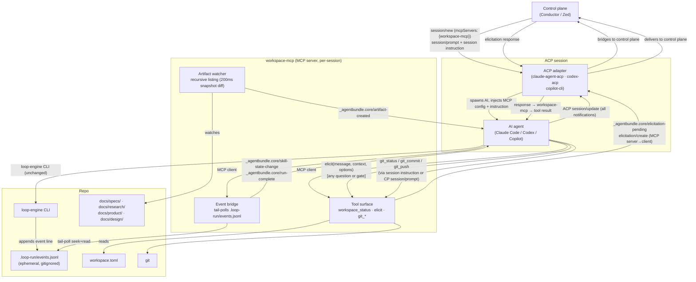
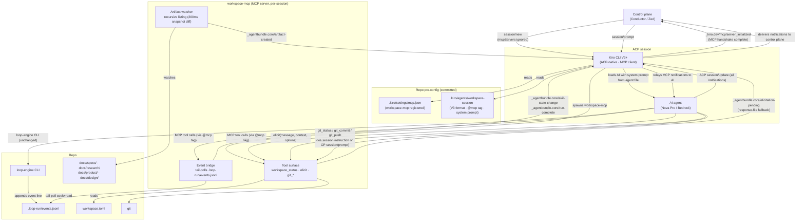

# workspace-mcp: ACP-observable skill runtime for any control plane

> **Previously drafted as `workspace-agent`.** Renamed to avoid collision with Claude Code subagents (adversarial-reviewer, quality-engineer, etc.) that live in `.claude/agents/`. `workspace-mcp` is an MCP server, not a Claude Code subagent.

**Status:** Draft
**Last updated:** 2026-08-03
**Reviewers:** TBD

## TL;DR

`workspace-mcp` is an optional MCP server, proposed to ship in the core pack (pending RFC acceptance — see Rollout § Stage 0 (d)), that makes any agentbundle-equipped repo observable and controllable by ACP-compliant control planes. It bridges loop-engine phase events, workspace queue state, and git lifecycle operations to the MCP/ACP surface — without changing how skills run when no control plane is present. The central insight is that all skills elicit from the user — not just formal gates — so elicitation interception can be universal via a session-level instruction injected at startup. Whether this instruction survives across turns in a single `session/new` injection is verified in Stage 0; if not, the control plane re-injects the instruction preamble on each `session/prompt`.

## Context

A control plane (Conductor, Zed) can already dispatch Claude Code via ACP — Claude Code has been in the ACP registry since August 2025. What it cannot do is observe structured progress: it receives free-form text, with no signal for phase transitions, human gate decisions, or artifact creation.

This gap is concrete across the pack surface:

- **work-loop** advances through a 10-state FSM managed by `loop-engine.py`. The control plane cannot distinguish `SPEC-HUMAN-GATE` (stop and ask a human) from normal text output.
- **desk-research** writes research briefs to the filesystem and ends the session. The control plane has no record of what files were produced, and nobody commits them.
- **product-engineering skills** (frame-intent, place-bet, diverge-solutions) write shaping artifacts and sometimes update workspace.toml. Same gap.
- **experience-design skills** (journey-mapping, interaction-design) produce markdown artifacts with no git lifecycle.

Non-obvious constraints:

1. **Adapter class split.** Three classes on MCP injection:
   - **Class A** (Claude Code, Codex, Copilot CLI): honour `session/new.mcpServers`; workspace-mcp is injected per session by the control plane. `elicitation/create` support is uneven — Codex does not list it; Copilot CLI is unconfirmed. Primary scope of this design.
   - **Class B** (Kiro CLI V3+): ACP-native but ignores `session/new.mcpServers`; reads MCP config from `{cwd}/.kiro/settings/mcp.json` only. workspace-mcp must be pre-configured per repo rather than injected per session. V3 agent format required for MCP tool injection (V2 has unresolved bug #5873). All workspace-mcp capabilities work once configured; harness cannot inject dynamically. Secondary scope — same workspace-mcp binary, different setup story.
   - **Deferred** (Gemini CLI, OpenCode): incompatible architectures. Out of scope.

   `elicitation/create` is MCP-native (MCP 2025-06-18), not an ACP primitive — ACP v1 adapts it. workspace-mcp uses it via MCP server→client direction (workspace-mcp → AI host).

2. **ADR-0061 — no engine, no daemon.** `workspace-mcp` must be an opt-in per-session process, not a persistent service. Any persistent mode requires an RFC amendment to ADR-0061 before implementation.

3. **MCP stdio transport — no port binding.** workspace-mcp uses the MCP stdio transport: it communicates over the stdin/stdout of the spawned child process, not HTTP or SSE. No TCP port is bound. Multiple concurrent workspace-mcp instances on the same developer machine — one per open Claude Code session — are fully isolated by process and never collide.

4. **All skills elicit from the user.** The gate problem is not limited to FSM states. Desk-research asks clarifying questions; place-bet asks for prioritization; journey-mapping asks about personas. Every interactive moment where the AI asks a question is an elicitation. A gate mechanism scoped to formal FSM states misses the majority of AI→user communication, leaving the control plane blind to most of what is happening in a session. The solve is a session-level instruction, not per-skill modification.

## Goals and Non-goals

### Goals

- A control plane that passes `workspace-mcp` in `session/new.mcpServers` receives a structured `_agentbundle.core/skill-state-change` notification for every loop-engine FSM transition within that session, with zero missed transitions (verified by comparing `seq` on consecutive events).
- A control plane receives `_agentbundle.core/human-gate-pending` carrying the spec path, reviewer findings, and gate question before the session suspends at any gate point; the gate is resolved and the session resumes in the same turn.
- `workspace_status()` MCP tool returns a DAG-resolved view of workspace.toml — ready items, blocked items with named unmet `needs:` edges, active items — parseable without repo knowledge. The control plane needs no prior knowledge of which skills are installed; `workspace_status()` is the capability discovery surface.
- The control plane can drive git operations (commit, push, branch) for any AI turn via `session/prompt`; the AI executes them through `git_*` MCP tools. Work-loop manages its own git lifecycle and PR opening at `CODE-HUMAN-GATE`; workspace-mcp surfaces the `pr_url` in `_agentbundle.core/gate-pr-ready` (emitted once the PR is opened, within seconds of `_agentbundle.core/human-gate-pending`) and again in `_agentbundle.core/run-complete`. See Component 4 for the git_* tool surface and Component 1 for `pr_url` handoff ordering.
- Work-loop, desk-research, and all other skills run identically when `workspace-mcp` is not configured — no behavior change, no startup error, no latency.
- The control plane is skill-agnostic: it dispatches based on what `workspace_status()` reports, not on hardcoded knowledge of this repo's skill stack. Swapping, upgrading, or adding skills requires no harness changes.

### Non-goals

- **Kiro IDE, Gemini CLI, OpenCode.** Kiro IDE cannot run headless. Gemini CLI inverts the MCP direction. OpenCode ignores `mcpServers` entirely. All deferred. Kiro CLI is Class B (see Context) — it works but requires per-repo pre-configuration rather than per-session injection; it is not the primary focus of this design.
- **workspace-types in pack.toml.** pack.toml is source-only and not projected to adopters. The type→lifecycle manifest cannot live there.
- **Convergence orchestration.** Rebase ordering, merge-queue management, and dependency-ordered PR merging across multiple concurrent sessions are Stage 4 scope.
- **Persistent daemon mode.** `workspace-mcp` spawns per session and exits on session end.
- **Replacing loop-engine's FSM.** `workspace-mcp` observes the FSM via an events file; it does not proxy or reimplement transitions.
- **Skills that modify remote state without git** (Jira write, Linear push). Those skills own their artifact lifecycle.

## Proposal

### Name rationale

`workspace-mcp` follows the repo's `workspace-*` naming convention (`workspace-status`, `workspace-status-engine`) and the common MCP ecosystem pattern of `<capability>-mcp` for MCP servers. The `-mcp` suffix signals "this is a server component, not a skill or subagent" — important because the repo's `.claude/agents/` directory already contains Claude Code subagents (adversarial-reviewer, quality-engineer, etc.) and `workspace-agent` would have collided with that mental model. It distinguishes clearly from `workspace-status` (read-only skill that queries workspace state for a human) and `loop-engine` (FSM CLI).

### Architecture



*Diagrams show primary notification flows. Additional contracted notifications not shown for legibility: `_agentbundle.core/human-gate-pending` (EB → CC when event bridge detects a `*-HUMAN-GATE` transition — enriched with reviewer output and gate question read from disk), `_agentbundle.core/skill-complete` (TS → CC after `git_push` returns for a non-FSM item, or after `git_commit` if no remote is configured), `_agentbundle.core/bridge-warning` (EB → CC on gap or buffer overflow). See Notification contract table for the full set.*

### Class A: Claude Code, Codex, Copilot CLI

The control plane injects workspace-mcp per session via `session/new.mcpServers`. On first launch, the control plane does not yet know which item to dispatch (it needs to call `workspace_status()` first). This creates a bootstrapping dependency — `workspace_status()` is only available inside a running session, but the session requires an item to start.

**Discovery mode (no env var):** The control plane opens a *discovery session* with neither env var set. In this mode, only `workspace_status()` and `git_status()` are available; all git-mutating tools (`git_branch`, `git_commit`, `git_push`) return an error. The control plane calls `workspace_status()`, receives the full ready/shaping/blocked queue with `ini_slug`, `type`, `slug`, and `dispatch_skill` for each item, then opens a *bound session* with the chosen item's env var. The discovery session is short-lived (one tool call); the AI simply calls `workspace_status()` and the control plane reads the response from the `session/update` stream.

After discovery, two mutually exclusive env vars identify the dispatched item in bound sessions — exactly one is set per bound session (zero → discovery mode):

- **`WORKSPACE_MCP_SPEC_PATH`** (`{spec-dir}`) — FSM (work) items only. Anchors `run_id` discovery to the correct spec directory.
- **`WORKSPACE_MCP_DISPATCHED_ITEM`** (`{ini_slug}/{type}:{slug}`) — non-FSM (shaping) items only. Tells the server which lifecycle-manifest entry to use for output-pattern scoping and artifact attribution. The `{ini_slug}` component is included because two active initiatives may legally contain shaping entries with the same slug (workspace engine preserves initiative identity for this reason); omitting it would make the env var ambiguous and produce identical branch names and artifact scopes for distinct items. Example: `initiative-a/shape:initiative-x`, `initiative-b/research:topic-x`. The server parses this as `ini_slug = "initiative-a"`, `type = "shape"`, `slug = "initiative-x"`. Branch naming: `{ini_slug}/{type}/{slug}` — ini_slug is included for the same reason it is included in the env var: two active initiatives may legally have entries with the same type+slug, and `{type}/{slug}` alone would produce identical local and remote refs for distinct items, causing branch creation failures or mixed artifact history. Example: `initiative-a/shape/initiative-x`.

**Per-session injection (control plane sends at dispatch time):**

The server path in `args` is adapter-dependent — each adapter projects the skill to a different root (from `adapter.toml`):
- **Claude Code**: `.claude/skills/workspace-status/scripts/workspace_mcp_server.py`
- **Codex, Copilot CLI**: `.agents/skills/workspace-status/scripts/workspace_mcp_server.py`

**Trusted-spawn requirement:** The projected script at `{adapter-root}/scripts/workspace_mcp_server.py` is under version control — a malicious or compromised checkout can replace it and achieve RCE in the control plane process. For ACP / CI deployments where the checkout is **untrusted** (the process owner doesn't own the repo), the control plane **must** launch the server from the installed agentbundle package using isolated module mode:

```bash
python3 -I -m agentbundle.workspace_mcp
```

The **`-I` (isolated) flag is non-negotiable**: without it, `python3 -m` adds the working directory (= repo root) to `sys.path`, so a checkout-provided `agentbundle/` package directory silently shadows the installed wheel and restores the RCE vector — defeating the intent of module mode entirely. With `-I`, `sys.path` is restricted to the standard install paths; the checkout cannot shadow the installed package. The projected path is **developer-use only** — valid when the developer owns and trusts the checkout (local workstation). For headless ACP sessions in CI or on shared hosts, isolated module mode is non-negotiable. Stage 0 validates that `python3 -I -m agentbundle.workspace_mcp` accepts the same env vars and produces the same MCP handshake as the projected script.

The control plane constructs the `args` based on the deployment context. The example below shows both forms:

```json
// ACP session/new — mcpServers field (control plane constructs this per dispatch)
// Trusted-checkout path (local developer, owns the repo):
// FSM (work) item (Claude Code adapter shown — swap args[0] for the dispatching adapter's path):
{
  "mcpServers": {
    "workspace-mcp": {
      "command": "python3",
      "args": [".claude/skills/workspace-status/scripts/workspace_mcp_server.py"],
      "env": { "WORKSPACE_MCP_SPEC_PATH": "docs/specs/my-feature" }
    }
  }
}
// Untrusted-checkout / CI / ACP headless — use module mode (package-resolved, not repo-path-resolved):
{
  "mcpServers": {
    "workspace-mcp": {
      "command": "python3",
      "args": ["-I", "-m", "agentbundle.workspace_mcp"],
      "env": { "WORKSPACE_MCP_SPEC_PATH": "docs/specs/my-feature" }
    }
  }
}
// Non-FSM (shaping) item — same two forms; module mode shown:
{
  "mcpServers": {
    "workspace-mcp": {
      "command": "python3",
      "args": ["-I", "-m", "agentbundle.workspace_mcp"],
      "env": { "WORKSPACE_MCP_DISPATCHED_ITEM": "initiative-a/shape:initiative-x" }
    }
  }
}
```

The control plane must spawn workspace-mcp with cwd set to the repo root; all paths (`args`, `WORKSPACE_MCP_SPEC_PATH`, and all git_* tool paths) are repo-root-relative. Pack install pre-approves workspace-mcp tools in `.claude/settings.json` (`permissions.allow`) so no interactive prompt appears in headless mode. The server exits with a clear diagnostic if the Python runtime is below 3.11. Rollback: omit from `session/new.mcpServers` — zero impact on skill behaviour.

### Class B: Kiro CLI

workspace-mcp works fully with Kiro CLI — the difference from Class A is setup location, not capability. Class A injects workspace-mcp per session via `session/new.mcpServers`. Kiro CLI ignores that parameter and reads MCP config from `{cwd}/.kiro/settings/mcp.json` instead. The adopter configures workspace-mcp once per repo; every Kiro CLI ACP session in that repo then has workspace-mcp available automatically.

**One-time repo setup (adopter or CI bootstrap):**

```json
// .kiro/settings/mcp.json — non-FSM (desk-research, PE, XD shaping items only)
{
  "mcpServers": {
    "workspace-mcp": {
      "command": "python3",
      "args": [".kiro/skills/workspace-status/scripts/workspace_mcp_server.py"],
      "env": {}
    }
  }
}

// .kiro/settings/mcp.json — FSM (work-loop sessions); WORKSPACE_MCP_SPEC_PATH required for
// gate resumption to work on non-manifest branches (see Class B bridge section below)
{
  "mcpServers": {
    "workspace-mcp": {
      "command": "python3",
      "args": [".kiro/skills/workspace-status/scripts/workspace_mcp_server.py"],
      "env": { "WORKSPACE_MCP_SPEC_PATH": "docs/specs/my-feature" }
    }
  }
}
```

*(The server path uses `.kiro/skills/` — the projection root for the `kiro-cli` adapter per `adapter.toml`. Class A adapters use their own projection roots: `.claude/skills/` for Claude Code, `.agents/skills/` for Codex and Copilot CLI.)*

**V3 agent format required** — Kiro CLI V2 agents (`.kiro/agents/*.json`) do not receive MCP tools in the LLM tool list (bug #5873, open). V3 agents (Markdown + YAML frontmatter, introduced v2.8.0 June 2026) resolve this via the `@mcp` tool tag:

```yaml
---
name: workspace-session
model: us.amazon.nova-pro-v1:0
tools:
  - "@mcp"
---
You are operating in a workspace managed by workspace-mcp. Follow these rules for this entire session.

1. Call workspace_status() at session start to understand the current queue before doing any work.
2. Do not call git commands (git commit, git push, git checkout, etc.) directly. Use the git_* tools provided by workspace-mcp. Exception: if you are running the work-loop skill and an active FSM run is underway, work-loop owns its git lifecycle directly — do not intercept or override its git operations via the git_* tools.
3. When you would ask the user a question, request approval, show options, or elicit any response — call elicit(message, context, options) and wait for the returned response.
4. The workspace-mcp tools remain available for the duration of the session.
5. Before writing artifacts for a non-FSM item (any item where work-loop is not managing the session), call git_branch(<ini_slug>/<type>/<slug>) if not already on the item's feature branch. Derive the three-component branch name from the ini_slug, type, and slug as reported by workspace_status() — `workspace_status().slug` and `workspace_status().ini_slug` are the canonical forms — workspace.toml item keys returned verbatim by `workspace_status_engine`; validity as git-ref path segments is a contract enforced at workspace.toml authoring time (`git check-ref-format` is the authoritative rule set). Skip if the current branch name equals `<ini_slug>/<type>/<slug>` exactly (byte-identical, using the same workspace_status() values).
6. When instructed to commit and push artifacts, call git_status() to identify uncommitted files, git_commit(paths, message) for the matching paths, then git_push(branch) if it is available. Do not skip steps that are available.
```

The `@mcp` tag grants all tools from `mcp.json` to this agent — including workspace-mcp's full tool surface. The session instruction is embedded in the agent system prompt. Intentional Class B differences from Component 3: rule 1 is unconditional (workspace.toml always exists in a configured Class B repo); rule 3 drops "check if the `elicit` workspace-mcp tool is available. If it is," and "instead of emitting text to the user" (elicit is always granted via `@mcp`); the preamble omits "they apply to every turn, including follow-up user messages" (system-prompt embedding makes cross-turn persistence implicit). Rules 2, 4, 5, and 6 are verbatim — the work-loop carve-out in rule 2 applies because Class B deployments do run work-loop FSM sessions (the single-active-run invariant governs run_id binding, not git routing).

**ACP session flow (Kiro CLI):**



**What differs from Class A:**
- `_kiro.dev/mcp/server_initialized` notification fires before the first `session/prompt` — a reliable readiness signal the control plane can wait for. Class A adapters don't have an equivalent; they rely on tool availability being synchronous after `session/new`.
- Session instruction goes in the agent system prompt (committed to `.kiro/agents/`), not in `session/new` params. This means it is the same instruction for every session rather than customisable per dispatch.
- `elicitation/create` support in Kiro CLI is unconfirmed — the same response-file fallback used for Codex applies here.
- Harness cannot inject workspace-mcp into a Kiro CLI session it didn't configure ahead of time. If the repo doesn't have `.kiro/settings/mcp.json`, workspace-mcp is unavailable.

**What is identical to Class A:** all notifications (`_agentbundle.core/skill-state-change`, `_agentbundle.core/artifact-created`, `_agentbundle.core/elicitation-pending`), all tools (`workspace_status`, `elicit`, `git_*`), the reactive git model, lifecycle manifest. The workspace-mcp binary itself does not change.

**Two bridge differences:** Class A passes `WORKSPACE_MCP_SPEC_PATH` (FSM) or `WORKSPACE_MCP_DISPATCHED_ITEM` (non-FSM) per session via the `mcpServers` env config. Class B's `mcp.json` is static — neither env var can vary per session. Class B has no explicit discriminator, so the server runs both detectors concurrently: the FSM detector polls for `engine-state.json` newer than the sentinel; the non-FSM detector reads the current branch at session start and binds on the first valid branch-parse. **Mode arbitration:** FSM mode wins — once an `engine-state.json` newer than the sentinel is found, the server tears down any non-FSM binding and stops its artifact watcher, then binds the FSM `run_id`; any further non-FSM branch binding is suppressed. A work-loop session that happens to sit on a manifest-type branch (e.g. `initiative-a/research/topic-x`) is classified as FSM after `cmd_init` writes `engine-state.json`; the null `output_pattern` for `work` type then causes `git_commit` to reject any non-FSM commit via the standard `unscoped-uncommitted-files` path. **FSM resume:** Before applying the mtime sentinel filter, the bridge scans `engine-state.json` files for a `state` value matching `*-HUMAN-GATE`. **Gate scan is scoped by `WORKSPACE_MCP_SPEC_PATH`:** if `WORKSPACE_MCP_SPEC_PATH` is set in the Class B static mcp.json env config, the gate scan checks only that spec's `engine-state.json` — regardless of the current branch name. This correctly handles work-loop sessions on non-manifest branches (e.g. `feature/my-feature`). If `WORKSPACE_MCP_SPEC_PATH` is absent, the gate scan is skipped entirely — the session is treated as non-FSM, protecting it from hijack by a parked gate from a prior FSM run. **Class B adopters who run FSM (work-loop) sessions must set `WORKSPACE_MCP_SPEC_PATH` in `.kiro/settings/mcp.json`; adopters who run only non-FSM sessions must omit it.** The prior branch-parse–based gate scoping is removed: it could not correctly distinguish a work-loop session on a non-manifest branch from a fresh session on the same branch, and it silently skipped gate resumption in that case. When a scoped gate is found, the bridge immediately enters FSM mode for that run and emits `_agentbundle.core/human-gate-pending` — the gate must be resolved before the session proceeds. For non-gate FSM states, the mtime sentinel filter applies as usual; a resumed mid-run FSM rebinds when `cmd_transition` next rewrites `engine-state.json` (updating its mtime past the sentinel); all buffered events replay against the newly read `run_id`, so no events are lost. For FSM sessions, Class B uses the single-active-run sentinel invariant (below). For non-FSM sessions, Class B derives the dispatched item from the current branch. **Branch-name parse rule:** split on `/`; if three components, the first is `ini_slug`, second is `type`, third is `slug` (new format: `{ini_slug}/{type}/{slug}`). If two components (legacy or work-loop branch), the first is `type` and the second is `slug` (Class B fallback — accepted for FSM sessions where ini_slug is irrelevant; non-FSM sessions should use the three-component form). If the resolved `type` segment is not a known manifest type, the parse fails → null `output_pattern` → `unscoped-uncommitted-files` rejection (not a crash). At session start the server reads the current branch via `git rev-parse --abbrev-ref HEAD`; if it parses as a known manifest type (two- or three-component), the dispatched item is bound immediately (resume-on-existing-branch case). Otherwise the server binds on the first `git_branch({ini_slug}/{type}/{slug})` call per rule 5 (fresh session). If `git_branch` is not called and the current branch does not resolve, `git_commit` emits `bridge-warning {reason: "unscoped-uncommitted-files"}` — same as a null output_pattern. **Known limitation:** if the previous session ended on a feature branch (e.g. `initiative-a/research/old-topic`) and the new session starts on that same branch intending a different item, the server binds the old slug. **Workaround:** check out the new item's branch before starting the session. The first-call binding is immutable for the session (no rebind) — this is intentional: allowing rebind makes the push-validation branch agent-controlled, which undermines the security guarantee at the git remote boundary. Class B constraint: `WORKSPACE_MCP_SPEC_PATH` cannot vary per session. The Class B bridge instead relies on the **single-active-run invariant**: Class B deployments run one work-loop session at a time per repo. At startup, the bridge creates a sentinel file (`$TMPDIR/workspace-mcp-{pid}.sentinel`) and records its `stat().st_mtime`. It then polls `docs/specs/**/engine-state.json` files, ignoring any whose `stat().st_mtime` is **less than or equal to** the sentinel's mtime (filesystem-sourced comparison — avoids wall-clock vs mtime clock-skew at 1s granularity; strict `<` allows ties to pass, which is unsafe on 1-second-resolution filesystems where a stale file written in the same second as the sentinel would bind). It binds to the first `engine-state.json` strictly newer than the sentinel, reads `run_id`, and proceeds identically to Class A. This avoids binding to a stale prior-run file during the pre-`cmd_init` buffering window. Class B constraint: concurrent FSM sessions are not supported.

### Component 1 — loop-engine events.jsonl

Loop-engine gains one new behaviour: on each successful `cmd_transition`, append a JSON line to **repo-root `.loop-run/events.jsonl`** (not inside the spec dir — one shared file for all active runs).

**Crash-consistent transition protocol (outbox pattern):** A naive implementation writes `engine-state.json` atomically then appends to `events.jsonl`. A crash between these two steps produces a state that has advanced (engine-state.json shows new state) with no corresponding event (events.jsonl has no matching line) — the bridge never emits `_agentbundle.core/skill-state-change` for that transition, leaving the control plane blind. Reversing the order (append event first) creates a phantom event if the state write then crashes. `cmd_transition` must use the outbox protocol:
1. Write the pending event JSON to `.loop-run/events.pending` (truncate-and-rewrite, not append)
2. Write the new engine state atomically (`engine-state.json.tmp` → rename to `engine-state.json`)
3. Read `.loop-run/events.pending`, append its content as a new line to `events.jsonl`
4. Delete `.loop-run/events.pending`

On startup (including crash recovery), if `.loop-run/events.pending` exists, the recovery protocol is:
1. Read the pending event's `run_id`, `seq`, and `to` (destination state).
2. Read the current `engine-state.json` (if it exists).
3. If `engine-state.json` shows `state == pending.to` AND `transition_sequence == pending.seq`, the state write completed before the crash — only the events.jsonl append failed. **Replay**: append the pending event to `events.jsonl`, then delete the pending file.
4. If `engine-state.json` is absent, or its `state` differs from `pending.to`, the state write never completed — the transition did NOT occur. **Discard**: delete the pending file without appending. The transition must be re-attempted by the skill.
5. If `engine-state.json.tmp` exists alongside, the atomic rename was interrupted — complete the rename, then re-evaluate from step 2.

Unconditional replay without this check would emit a phantom event for a transition that never occurred — the exact failure mode the outbox pattern claims to prevent. The bridge treats duplicate `seq` values as idempotent no-ops (already-seen seq → skip) for the case where replay appends a line that was already committed.

```json
{"seq": 3, "run_id": "abc123", "spec": "docs/specs/feature-X", "from": "SPEC-PLAN-REVIEW", "event": "reviewers-clean", "to": "SPEC-HUMAN-GATE", "at": "2026-08-03T..."}
```

The `run_id` field is generated by `cmd_init` and written to `engine-state.json` alongside the spec. Because `cmd_init` runs during the session (after the first `session/prompt`), `engine-state.json` may not exist at session start. The event bridge discovers `run_id` lazily: it buffers incoming event lines (capped at 1 000 lines; on overflow it emits `_agentbundle.core/bridge-warning {reason: "buffer-overflow"}` and stops buffering) until `engine-state.json` appears for the dispatched item. Separately, if no `engine-state.json` matching the session's anchor appears within 30 s, the bridge emits a transient `_agentbundle.core/bridge-warning {reason: "run-id-unresolved"}` (Class A anchor: `WORKSPACE_MCP_SPEC_PATH`; Class B FSM anchor: first `engine-state.json` newer than the sentinel file). `cmd_init` writes `engine-state.json` atomically (temp file + rename) so a first-sight read never sees a partial write. The bridge reads `run_id` on first sight, then replays the buffer against it. Only lines matching the session's `run_id` are forwarded; all others are discarded. The control plane passes the dispatched spec **directory** as an env var (`WORKSPACE_MCP_SPEC_PATH`) in the `mcpServers` config at `session/new` — workspace-mcp spawns with this value before the first `session/prompt` arrives. `engine-state.json` is resolved as `{WORKSPACE_MCP_SPEC_PATH}/engine-state.json`. The value must match the `spec` field emitted in events.jsonl (which is the directory, not the file path).

`.loop-run/` is gitignored. `cmd_init` creates the directory; `cmd_reset` removes it. The skill writes `question` (the gate prompt text) to engine-state.json before calling `loop-engine transition` to any `*-HUMAN-GATE` state. For `CODE-HUMAN-GATE` specifically: work-loop calls `loop-engine transition ... reviewers-clean` (entering the gate) and then, as part of the finish checklist that follows, opens the PR and writes `pr_url` to engine-state.json. This means `pr_url` is not yet present in engine-state.json when `_agentbundle.core/human-gate-pending` fires. workspace-mcp polls engine-state.json during the CODE-HUMAN-GATE window and emits `_agentbundle.core/gate-pr-ready {gate, pr_url}` as soon as `pr_url` appears — typically within seconds. The control plane uses this follow-up notification to display the PR to the human reviewer; it must not block on `pr_url` in `_agentbundle.core/human-gate-pending`. Loop-engine does not derive either value. **To survive the rewrite:** `cmd_transition`'s `_write_engine_state_atomic` reads the existing `engine-state.json` before writing; the new state dict is the existing state merged with the newly computed fields (`{**existing, **new_schema_fields}`), so any extra key written by the skill (`pr_url`, `question`, and any future extensions) is preserved through every subsequent transition. The schema-managed keys (`schema_version`, `run_id`, `feature`, `mode`, `state`, `last_event`, `last_event_context`, `transition_sequence`, `last_transition_at`) are always overwritten; all other keys survive. Workspace-mcp reads `pr_url` when emitting `_agentbundle.core/run-complete` at `DONE` or `ABANDONED`, and reads `question` when emitting `_agentbundle.core/human-gate-pending`. This is approximately 30 lines total in `cmd_transition` and `cmd_init`.

### Component 2 — Event bridge

`workspace-mcp`'s event bridge tail-polls `events.jsonl` using a position-based read (seek to last offset, read new bytes, parse complete lines). Position-based reads on append-only files never miss a line regardless of how many transitions occur between polls. Poll interval: 200ms.

**Inode/truncation detection (cmd_reset recovery):** `cmd_reset` removes `.loop-run/`; a subsequent `cmd_init` in the same MCP session recreates `events.jsonl` with a new `run_id`. On each poll, the bridge checks: if the current file size is less than the saved offset, or if the file's inode differs from the inode recorded at first-open, the bridge: (1) resets offset to 0; (2) clears the in-flight buffer; (3) **clears the active `run_id` binding** and re-enters the lazy-discovery state (same as session start). This causes the bridge to re-read `engine-state.json` and bind the new `run_id` on first sight. Without clearing the binding, events from the new run carry the new `run_id` and are discarded as non-matching against the old binding.

On each new event line whose `run_id` matches this session's active run: if the line's `seq` value equals the last emitted `seq`, skip it as a duplicate (idempotent replay from outbox recovery); otherwise emit `_agentbundle.core/skill-state-change` with the full event payload and update the last-seen `seq`. Lines with non-matching `run_id` are skipped. Note: Stages 1–3 are single-session-per-repo; concurrent session isolation via `run_id` is forward-compatible infrastructure for Stage 4 worktree mode, where each session works in a separate worktree and holds a distinct `run_id`. Git operations in Stages 1–3 are not concurrent-safe. The read offset advances only to the last complete newline — a partial final line (torn write on crash mid-append) is held at the current offset and re-read on the next poll cycle.

**Writer-side repair (loop-engine contract):** when loop-engine appends a new event, it first checks whether the last byte of `events.jsonl` is `\n`. If not, a crash left a partial record; loop-engine writes a bare `\n` before appending the new JSON line. This terminates the partial record as a newline-terminated but malformed line and places the new complete event on its own line. Without this repair, the new JSON object would be concatenated directly onto the partial fragment, making the resulting newline-terminated blob unrecoverable — quarantining it would discard the new transition, violating zero-missed-events.

**Reader-side quarantine (bridge contract):** if a newline-terminated line fails JSON parsing (partial record terminated by writer repair, or other corruption), the bridge emits `_agentbundle.core/bridge-warning {reason: "malformed-event-line", offset: N}`, advances the offset past the malformed line, and continues. This recovers without losing subsequent valid events.

### Notification contract

All `_agentbundle.core/*` notifications are emitted by workspace-mcp as MCP `notifications/message` frames. The naming convention follows the ACP extension pattern (`_<namespace>/method`) confirmed by Stage 0 spike (b) — `_claude/sdkMessage` in `claude-agent-acp@0.64.0` is the observed exemplar; `_agentbundle.core/` is the agentbundle namespace. **Stage 1 observability note (spike (c) result):** MCP `notifications/message` frames are NOT relayed to the ACP control plane by `claude-agent-acp@0.64.0`; the control plane polls `workspace_status()` instead. The notification definitions below remain the target contract; relay support is contingent on a future claude-agent-acp update.

| Notification | When emitted | Key payload fields |
|---|---|---|
| `_agentbundle.core/skill-state-change` | Each loop-engine FSM transition (run_id matches session) | `seq` (per-`run_id` counter maintained by `cmd_transition` in `engine-state.json` — gaps indicate missed transitions; not a file-global counter), `run_id`, `spec`, `from`, `event`, `to`, `at` |
| `_agentbundle.core/human-gate-pending` | FSM enters any `*-HUMAN-GATE` state | `gate`, `spec_path`, `review_findings` (from reviewer output file; null if no file exists yet), `question` (from `engine-state.json`). `pr_url` is intentionally absent: for `CODE-HUMAN-GATE`, the PR is opened after the gate transition (see Component 1 ordering note); the control plane must wait for `_agentbundle.core/gate-pr-ready`. |
| `_agentbundle.core/gate-pr-ready` | workspace-mcp detects `pr_url` in `engine-state.json` during a CODE-HUMAN-GATE window | `gate`, `spec_path`, `pr_url`. Emitted once per CODE-HUMAN-GATE entry, typically within seconds of `_agentbundle.core/human-gate-pending`. The control plane uses this to display the PR URL to the human reviewer. |
| `_agentbundle.core/run-complete` | FSM transitions to `DONE` or `ABANDONED` | `run_id`, `outcome`, `spec_path`, `pr_url` (read from `engine-state.json`; written there by the **work-loop skill** as part of the CODE-HUMAN-GATE finish checklist; null if no PR was opened; loop-engine does not derive it) |
| `_agentbundle.core/elicitation-pending` | AI calls `elicit()` (any question or gate) | `message`, `context`, `options`, `session_id`, `elicit_seq` (independent per-session counter, increments per elicitation), `correlation_id` (set to the gate id only when the gate's elicitation is pending and has not yet been resolved; null otherwise), `response_path` (absolute path of the session-scoped response file when the fallback is active; null when `elicitation/create` is used as the primary channel) |
| `_agentbundle.core/artifact-created` | Watched output dir receives a new file | `path`, `item_slug`, `item_type`, `session_id` |
| `_agentbundle.core/skill-complete` | Emitted after `git_push` returns for a non-FSM item, or after `git_commit` if `git_push` is unavailable (no remote configured); signals control plane to initiate PR creation. When emitted after `git_commit` only, `branch` is set and `pushed` is false. For external output paths, `branch` is null and `pushed` is false — monitoring-only, no PR creation. | `item_slug`, `item_type`, `committed_paths`, `branch` (nullable), `pushed` (bool), `session_id` |
| `_agentbundle.core/bridge-warning` | Event bridge or artifact watcher detects a problem | `reason` (one of: `no-events-after-30s`, `run-id-unresolved`, `unscoped-uncommitted-files`, `buffer-overflow`, `branch-base-unresolved`, `push-branch-mismatch`, `malformed-event-line`, `external-output-path`); reason-specific: `last_seq` for `no-events-after-30s`; `paths` for `unscoped-uncommitted-files`; `expected`, `actual` for `push-branch-mismatch`; `offset` for `malformed-event-line` |

`_agentbundle.core/human-gate-pending` and `_agentbundle.core/elicitation-pending` are distinct events — a gate blocks the FSM until resolved; an elicitation is an informal question the AI would normally direct to the user. Both are resolved via `elicit()`; the gate variant carries `review_findings` that an informal elicitation does not. The correlation join key: `elicitation-pending.correlation_id == human-gate-pending.gate` — the control plane uses this to match the elicitation response to the pending gate. Once the gate's elicitation has been consumed (response returned to the AI), `correlation_id` reverts to null for any subsequent elicitations in the same turn.

### Component 3 — Universal elicitation via session instruction

Every skill elicits from the user at points that are not formal FSM states: desk-research asks which angle to pursue, place-bet asks for prioritization, journey-mapping asks about personas. Scoping elicitation interception to declared gate states would miss the majority of AI→user communication and leave the control plane blind to most of a session.

The solve is a session-level instruction injected by the control plane in `session/new` (Class A) or embedded in the V3 agent system prompt (Class B).

**Instruction durability — confirmed by Stage 0 spike (a):** In `claude-agent-acp@0.64.0`, `systemPrompt` is set once from `session/new._meta.systemPrompt` and baked into the SDK `query()` at session creation; `query()` is long-running and handles all turns — it is not restarted per `session/prompt`. The instruction therefore persists for the session's lifetime without per-turn re-injection. The control plane injects the workspace-mcp session instruction once via `session/new._meta.systemPrompt` (as a string, or as an object with `append: true` to append to the `claude_code` preset). No per-turn re-injection is required.

**Full recommended session instruction:**

```
You are operating in a workspace managed by workspace-mcp. Follow these rules for this entire session — they apply to every turn, including follow-up user messages.

1. If the `workspace_status` tool is available, call workspace_status() at session start to understand the current queue before doing any work.

2. Do not call git commands (git commit, git push, git checkout, etc.) directly. Use the git_* tools provided by workspace-mcp. Exception: if you are running the work-loop skill and an active FSM run is underway, work-loop owns its git lifecycle directly — do not intercept or override its git operations via the git_* tools.

3. When you would ask the user a question, request approval, show options, or elicit any response — check if the `elicit` workspace-mcp tool is available. If it is, call elicit(message, context, options) and wait for the returned response instead of emitting text to the user.

4. The workspace-mcp tools remain available for the duration of the session.

5. Before writing artifacts for a non-FSM item (any item where work-loop is not managing the session), call git_branch(<ini_slug>/<type>/<slug>) if not already on the item's feature branch. Derive the three-component branch name from the ini_slug, type, and slug as reported by workspace_status() — `workspace_status().slug` and `workspace_status().ini_slug` are the canonical forms — workspace.toml item keys returned verbatim by `workspace_status_engine`; validity as git-ref path segments is a contract enforced at workspace.toml authoring time (`git check-ref-format` is the authoritative rule set). Skip if the current branch name equals `<ini_slug>/<type>/<slug>` exactly (byte-identical, using the same workspace_status() values).

6. When instructed to commit and push artifacts, call git_status() to identify uncommitted files, git_commit(paths, message) for the matching paths, then git_push(branch) if it is available. Do not skip steps that are available.
```

The AI follows this instruction universally. **No skill modification is needed.** For Class B (Kiro CLI), this instruction is embedded in the V3 agent file system prompt and is fixed per repo rather than customisable per dispatch (see Class B section above).

`elicit(message, context, options)` on workspace-mcp:
1. Emits `_agentbundle.core/elicitation-pending {message, context, options, session_id, elicit_seq, correlation_id}` notification to the control plane (`correlation_id` is set to the pending gate id when the gate's elicitation has not yet been consumed; null for informal questions)
2. Calls MCP `elicitation/create` in server→client direction (workspace-mcp → AI host) — the AI host bridges this through the ACP adapter to the control plane; the tool call blocks until the response arrives
3. Returns `{"response": "<decision or text>"}` to the AI as the tool result

**Interactive mode:** Session instruction is not present (control plane didn't inject it); `elicit` tool may not be in the session; the AI asks questions via text as normal. Zero behavior change.

**Codex gap — fallback path:** Codex's ACP adapter (`codex-acp`) does not list `elicitation/create` as a supported feature. For Codex, workspace-mcp cannot use the MCP server→client `elicitation/create` channel. Fallback: workspace-mcp emits `_agentbundle.core/elicitation-pending` with `response_path` set to a session-scoped file path, then polls that file. Security: workspace-mcp creates the response directory using `tempfile.mkdtemp()` with `0700` perms at startup (`$TMPDIR/workspace-mcp-{session_id}/`), creates each response file `O_EXCL` with `0600` perms, and rejects any pre-existing file — preventing a local process from pre-writing a response that would approve a gate the user never saw. The control plane, on receiving the notification, reads `response_path` from the payload and writes the user's response there.

**Response-file atomicity requirement:** The control plane **must not** write directly to `response_path` — a direct write can produce a partial file that workspace-mcp reads mid-write, yielding malformed JSON and a failed parse. The required protocol: write the response JSON to `response_path + ".tmp"` in the same directory (`$TMPDIR/workspace-mcp-{session_id}/`), then `os.replace()` (atomic on POSIX) to `response_path`. workspace-mcp's poller only accepts the file after it exists **and** parses as valid JSON with a `response` key; a missing key or parse error causes the poller to continue waiting (not fail). The `O_EXCL` guard on the **final** path remains: workspace-mcp creates the placeholder `response_path` file at `O_EXCL` at elicitation time and expects the control plane to overwrite it via rename — this preserves the race guard while allowing atomic delivery. This is structurally equivalent from the AI's perspective — it called `elicit`, it received a response.

**Capability detection:** In MCP, `elicitation` is a CLIENT capability — the client declares it in its `initialize` request to signal that it can service `elicitation/create` requests sent from the server. workspace-mcp does NOT advertise `elicitation` in its own `ServerCapabilities` (that field belongs to the client's `ClientCapabilities`; advertising it as a server capability produces an invalid MCP handshake). Instead, workspace-mcp inspects the received `initialize` params for `capabilities.elicitation`: present → use `elicitation/create` as the primary channel; absent → use response-file fallback with `response_path` in `_agentbundle.core/elicitation-pending`. A known bug in `claude-agent-acp` (issue #419) breaks MCP tool discovery at initialization if a server advertises unexpected capabilities; the correct fix is not to advertise `elicitation` at all. Stage 1 validates that tool discovery completes correctly under this conditional detection approach on known-affected `claude-agent-acp` builds.

### Component 4 — Tool surface

```python
workspace_status()
# Returns DAG-resolved workspace.toml view with lifecycle metadata per item:
# {
#   "ready": [{
#     "path": "spec/X", "description": "...", "type": "work",
#     "lifecycle": {"has_gates": true, "output_pattern": null}
#   }],
#   "blocked": [{"path": "spec/Y", "needs": ["work:spec/X"], "unmet": ["work:spec/X"]}],
#   "active":  [{"path": "spec/Z", "engine_state": "CODE-REVIEW"}],
#   "shaping": [{"slug": "...", "type": "research",
#     "lifecycle": {"has_gates": false, "output_pattern": "docs/research/{slug}/**"}}],
#   "workspace_toml_age_commits": 0
# }

git_status()                               # uncommitted files + current branch
git_branch(name, base=None)                # creates branch; base resolution order: (1) git symbolic-ref refs/remotes/origin/HEAD, (2) local HEAD if no remote; emits bridge-warning {reason: "branch-base-unresolved"} and returns an error if neither resolves (shallow clone, no remote, or detached HEAD). Class B non-FSM side-effect on FIRST call: parses `name` via the branch-parse rule, binds the dispatched item in session context, starts the artifact watcher on the new item's output dir, and records the session-bound push-validation branch. Subsequent calls in the same session may create git branches but do NOT rebind the dispatched item or change the push-validation branch — the first binding is immutable for the session. FSM-bound sessions ignore this side-effect entirely.
git_commit(paths, message)                 # server-side: intersects paths with the session's dispatched item's output_pattern (derived from the item's type in the lifecycle manifest, not from the workspace_status() "active" bucket); drops non-matching entries + emits bridge-warning; stages and commits the remainder. If the dispatched item has null output_pattern (work-loop items), rejects the call with bridge-warning {reason: "unscoped-uncommitted-files"}. Server ignores the caller's message parameter and derives the commit message from dispatched item slug and type; parameter retained for interface stability.
git_push(branch)                           # server-side: validates `branch` equals the immutable session-bound branch AND that HEAD matches that branch; rejects with bridge-warning {reason: "push-branch-mismatch", expected: <session-bound>, actual: branch} and returns an error if either check fails. The session-bound branch is derived at startup from the dispatched item: for Class A, from {ini_slug}/{type}/{slug} parsed from WORKSPACE_MCP_DISPATCHED_ITEM (non-FSM) or from the spec path slug (FSM); for Class B non-FSM, from the FIRST git_branch() call — subsequent git_branch() calls may update the git working tree but do NOT rebind the session-bound branch used for push validation. This two-sided check (argument + HEAD) prevents an agent from using a rebind to redirect the push to an unrelated or privileged branch.
git_worktree_create(branch)                # isolated worktree path (Stage 4)
git_worktree_cleanup(path)                 # teardown (Stage 4)
# PR creation is platform-specific (gh, glab, REST API, custom skill) — left to the control plane
elicit(message, context, options)          # see Component 3; routes all AI→user comm
```

`workspace_status()` delegates to `workspace_status_engine.analyze_bounded()` — no duplication.

**Known dependency-analysis gap (Stage 1 prerequisite):** `workspace_status_engine.analyze_bounded()` currently reports a missing `shape:` or `research:` target as satisfied rather than unsatisfied (see `workspace_status_engine.py:488-530`), while every `strategy:` item that depends on a missing target remains blocked permanently. This makes autonomous dispatch from `workspace_status()` unsafe for dependency-chained items: the bridge may start work early (missing dep treated as satisfied) or block it forever (dep never resolves). This gap must be closed before Stage 1 enables autonomous dispatch.

**Lifecycle manifest — how workspace-mcp knows what each type means:**

`pack.toml` is source-only and not projected to adopters, so lifecycle metadata cannot live there. workspace-mcp resolves type→lifecycle from two sources, merged:

1. **Built-in defaults** — the workspace.toml type taxonomy is a published contract; workspace-mcp ships with mappings for the known types. **These patterns assume default layout (no `agentbundle-layout.toml` override).**

   **Pack presence filter:** At startup, workspace-mcp checks whether each type's `dispatch_skill` is installed by probing known skill roots for the SKILL.md file. Non-FSM packs (desk-research, product-engineering, experience-design) are user-scoped by default and project their skills to the adapter's **user root**, not the repo-relative root. The probe checks all of the following paths (OR logic — any hit means the skill is present):
   - **Repo root** (core and repo-scoped packs): `.claude/skills/{dispatch_skill}/SKILL.md`, `.agents/skills/{dispatch_skill}/SKILL.md`, `.kiro/skills/{dispatch_skill}/SKILL.md`
   - **User root** (user-scoped packs): `~/.claude/skills/{dispatch_skill}/SKILL.md`, `~/.agents/skills/{dispatch_skill}/SKILL.md`, `~/.kiro/skills/{dispatch_skill}/SKILL.md`

   A type whose skill file is absent in **all** six locations is included in `workspace_status()` output with `"available": false` and `"required_pack": "<pack-name>"` metadata — **it is NOT excluded**. Excluding absent types produces a falsely empty queue that gives the control plane no actionable signal. Returning unavailable items with metadata allows the control plane to surface "Install pack X to work on this item" rather than hiding the item entirely. Items with `available: false` must not be dispatched; they are display-only until the pack is installed and the probe succeeds. The `workspace_status()` result shape for unavailable items: `{ini_slug, slug, type, dispatch_skill, blocked_by, available: false, required_pack: "<pack-name>"}`. Available items omit `available` and `required_pack` (presence implies available).

   **Layout resolution order (mirrors each skill's own resolution):**
   - **`research` type**: user-scope `~/.agentbundle/agentbundle-layout.toml [research] output_dir` takes priority (personal vault always wins regardless of which repo is active, per `desk-research-project-start` contract). Falls back to repo-scope `./agentbundle-layout.toml [research] output_dir`, then to install-default `docs/product/research/` (from `packs/desk-research/pack.toml [pack.layout.repo] output_dir`).
   - **`shape`, `strategy` types**: repo-scope `./agentbundle-layout.toml [product] output_dir` first (team convention wins), then user-scope, then default `docs/product/`.
   - **`design` type**: repo-scope `./agentbundle-layout.toml [design] output_dir` first, then user-scope, then default `docs/design/`.

   At startup workspace-mcp reads both layout files and resolves each `output_dir` per the skill-matching priority above.

   **Deferred layout resolution for all non-FSM types:** The non-FSM dispatch skills — `desk-research-project-start`, `frame-intent` (shape), `frame-situation` (strategy), and `journey-mapping` (design) — all perform a two-branch output_dir elicitation on first run when configuration is absent. This elicitation happens **after** the session starts but **before** the first artifact write (rule 5 ensures `git_branch` is called before writing). If workspace-mcp resolved layout at startup, it would read `agentbundle-layout.toml` files that may not yet have the relevant section, producing wrong watcher paths for the session's lifetime. Fix: for **all non-FSM dispatched items** (`research`, `shape`, `strategy`, `design`), **defer watcher binding** until the first `git_branch()` call. At `git_branch()` time, workspace-mcp re-reads `~/.agentbundle/agentbundle-layout.toml` and `./agentbundle-layout.toml` to resolve the final `output_dir` per the type's priority order, then starts the watcher. If the layout file is still absent at `git_branch()` time (first-run elicitation hasn't happened or the user declined to write config), fall back to the install-default and proceed. The `work` type (FSM) is not affected — it has no output_pattern and manages its own git lifecycle.

   **Non-git output paths:** If the resolved `output_dir` for any type falls outside the repo tree (e.g. a personal vault at `~/vault/research`), `git_commit` emits `bridge-warning {reason: "external-output-path"}` and skips the commit step. `_agentbundle.core/artifact-created` is still emitted (monitoring only). `_agentbundle.core/skill-complete` is emitted with `pushed: false` and `branch: null` — the control plane treats this as monitoring-only and does not attempt PR creation. (Note: `pushed` is always a boolean in the `skill-complete` payload; only `branch` is nullable.)

The manifest `output_pattern` field accepts a single pattern string or a **list of pattern strings** for types whose shaping sequence writes to multiple output directories. The watcher and `git_commit` union all listed patterns for the item's type.

| type | has_gates | dispatch_skill | Default output_patterns |
|---|---|---|---|
| `work` | `true` | `work-loop` | *(none — work-loop manages git itself)* |
| `research` | `false` | `desk-research-project-start` | `["docs/product/research/*-{slug}/**"]` ¹ |
| `shape` | `false` | `frame-intent` | `["docs/product/intents/{slug}.md", "docs/product/shaping/{slug}/**"]` ² |
| `design` | `false` | `journey-mapping` | `["docs/design/journeys/{slug}.md", "docs/design/blueprints/{slug}.md", "docs/design/screens/{slug}/**", "docs/design/screens/{slug}-flow.md"]` |
| `strategy` | `false` | `frame-situation` | `["docs/product/shaping/{slug}/**"]` |
| `signal` | `false` | *(none — monitoring only)* | *(none)* |

¹ `research` uses a date-prefixed project folder (`{YYYY-MM-DD}-{slug}/`). The `{date}` component is not known at dispatch time; the watcher watches the `output_dir` base (`docs/research/`) and attributes artifacts to this item when the discovered path matches `fnmatch("*-{slug}", first_component)`. `git_commit` includes all files under the matched folder.

² `dispatch_skill` is the **entry-point writing skill** — the first skill that creates artifacts. Subsequent skills in the sequence (`place-bet`, `diverge-solutions`) run after `frame-intent` in the same session; their outputs fall under the same multi-pattern union. `experience-status` is read-only (orientation) and is NOT the dispatch entry point.

A PE shaping session dispatches `frame-intent` first (→ `intents/{slug}.md`), then typically continues with `place-bet` and `diverge-solutions` (→ `shaping/{slug}/**`). Both patterns are needed so the watcher detects all artifacts and `git_commit` includes all PE skill outputs for this item in one commit.

`dispatch_skill` is returned by `workspace_status()` in the `shaping` item payload — the control plane constructs its session prompt from it without needing hardcoded pack knowledge. `workspace_status()` result shape for **available** items: `{ini_slug, slug, type, dispatch_skill, blocked_by}`. For **unavailable** items (pack not installed): `{ini_slug, slug, type, dispatch_skill, blocked_by, available: false, required_pack: "<pack-name>"}`. `ini_slug` is included so the control plane can construct the three-component feature branch name (`{ini_slug}/{type}/{slug}`) and the `WORKSPACE_MCP_DISPATCHED_ITEM` env var value without any additional lookup.

When `agentbundle-layout.toml [product] output_dir = P`, the `shape` patterns become `["P/intents/{slug}.md", "P/shaping/{slug}/**"]` and `strategy` becomes `["P/shaping/{slug}/**"]`. When `[research] output_dir = R` (either scope), `research` becomes `["R/*-{slug}/**"]` — note this overrides the install-default `docs/product/research/`. When `[design] output_dir = D`, `design` becomes `["D/journeys/{slug}.md", "D/blueprints/{slug}.md", "D/screens/{slug}/**", "D/screens/{slug}-flow.md"]` — slug-scoping is preserved under any layout override to prevent `git_commit` from including unrelated design artifacts from concurrent sessions. The `screens/{slug}-flow.md` entry is required because `user-flow` writes the flow document as a sibling of `screens/{slug}/` (not inside it), which the directory-recursive `**` pattern does not cover.

2. **Optional `workspace-types.d/*.toml`** directory at repo root — third-party packs each project a separate file (e.g. `workspace-types.d/mypack.toml`). workspace-mcp reads all files in the directory and merges with built-in defaults. One file per pack prevents projection clobber. Third-party files may add new type keys or override built-in patterns to accommodate non-default layout configurations — the startup-resolved `agentbundle-layout.toml` values take precedence over both the built-in defaults and `workspace-types.d` overrides for the affected types.

   **Projection mechanism status:** The current adapter contract has no primitive that projects an arbitrary `.toml` file to the repo root; introducing `workspace-types.d/` as a new top-level directory requires an RFC per `AGENTS.md § Check before acting`. **This is a future extension point, not implemented in the current design.** Stage 3 will determine whether workspace-types.d is needed for third-party packs or whether the built-in defaults plus `agentbundle-layout.toml` overrides are sufficient for the known type taxonomy. If implemented, each owning pack's lifecycle entry would be discovered beside its already-projected assets (e.g., next to the projected `SKILL.md`).

```toml
# workspace-types.d/mypack.toml (projected by third-party pack; optional)
[[types]]
type = "audit"
has_gates = true
output_pattern = "docs/audits/{slug}/**"
```

**Reactive git, not declarative:** No `git_managed` field in the manifest. Skills that manage their own git (work-loop commits and opens a PR at `CODE-HUMAN-GATE`) leave nothing uncommitted at turn end. For non-FSM skills, rule 5 of the session instruction directs the AI to call `git_branch(<ini_slug>/<type>/<slug>)` before writing artifacts; the control plane then sends a `session/prompt` at turn end instructing the AI to commit and push; the AI calls `git_status()`, `git_commit()`, and `git_push()` via the MCP tool surface. The control plane does not call these tools directly — it drives the AI via prompts.

Commit scoping: `git_commit(paths, message)` enforces output-pattern intersection **server-side** — the tool itself drops any path not matching the **session's dispatched item's** `output_pattern` (looked up from the lifecycle manifest by the dispatched item's type, not from the `active` bucket in `workspace_status()`) and emits `_agentbundle.core/bridge-warning {reason: "unscoped-uncommitted-files", paths: [...]}` for the dropped entries. This is not prompt-following; it is enforced in the tool implementation regardless of what paths the AI passes. The server always derives the commit message from the dispatched item slug and type (`"chore(workspace-mcp): commit artifacts for {type} {slug}"`) and ignores the caller-supplied `message` parameter. Rule #6 in the session instruction is advisory guidance — the server-side intersection is the actual safety boundary.

Push scoping: `git_push(branch)` enforces a **two-sided server-side check** — (1) the `branch` argument must equal the immutable session-bound branch (derived at startup from the dispatched item for Class A, or from the FIRST `git_branch()` call for Class B); and (2) the current HEAD must equal the same session-bound branch. Both must match; either mismatch rejects with `_agentbundle.core/bridge-warning {reason: "push-branch-mismatch"}` before any network operation. The two-sided check closes the agent-rebind attack: even if an agent calls `git_branch()` to move HEAD to another branch, the session-bound branch does not change after first binding, so the HEAD check fails. This prevents pushing to `main`, another team's feature branch, or any other unrelated ref regardless of what the AI passes.

**Runtime prerequisites:** Python 3.11+ (stdlib only — no third-party packages). `git` on `$PATH`. PR creation is platform-specific and not part of the MCP tool surface — the control plane implements it via `gh`, `glab`, a REST API call, or a custom skill.

**Tool contract rules:**
- `workspace_status()` is not advertised when `workspace.toml` does not exist; `git_push` is not advertised when no git remote is configured. Exposing uncallable tools causes session abandonment in some AI runtimes.
- Freshness is embedded in every `workspace_status()` response: `workspace_toml_age_commits`. The AI cannot otherwise know if its queue view is stale.
- Partial state is surfaced diagnostically: if `events.jsonl` is missing when expected, `workspace_status()` returns `{"warning": "EVENTS-FILE-MISSING", "engine_state": null}` rather than omitting engine state silently.

### Component 5 — Artifact watcher

For skills with no FSM (desk-research, PE, XD), completion is inferred from new files in declared output directories. `workspace-mcp` derives watched paths from the **lifecycle manifest's `output_pattern`** for the **session's dispatched item's** type — no hardcoded pack→path knowledge in the watcher.

```python
# Resolve watched dirs from the manifest for the dispatched item.
# Class A: item is known at startup from WORKSPACE_MCP_DISPATCHED_ITEM env var.
# Class B non-FSM: item may not be known at startup — deferred until branch-derived item
#   is bound (session-start branch read, or most-recent git_branch call). Watcher starts after
#   binding. Rule 5 (branch before write) guarantees binding before the first artifact write.
# All non-FSM types (research, shape, strategy, design): watcher binding is ALWAYS deferred
#   to the first git_branch() call. This is because all non-FSM dispatch skills (desk-research-
#   project-start, frame-intent, frame-situation, journey-mapping) perform a two-branch
#   output_dir elicitation on first run when configuration is absent. The elicitation happens
#   AFTER session start but BEFORE the first git_branch call (rule 5 guarantees branch before
#   write). At git_branch() time, layout files are re-read and the resolved output_dir is used
#   to set watched_dirs. If still absent at that point, fall back to install-default.
output_patterns = manifest[item["type"]]["output_pattern"]  # str or list[str]
if isinstance(output_patterns, str):
    output_patterns = [output_patterns]
# --- Slug safety guard ---
# Slugs come from workspace.toml via workspace_status_engine; git check-ref-format is the
# authoring gate for ref safety, but ref-safe slugs can still contain glob metacharacters
# (* ? [ ]) that would broaden the commit allowlist. Reject unsafe segments before formatting.
# A slug segment passes if it matches [a-zA-Z0-9._-]+ (safe for path components and globs).
import re as _re
_SAFE_SLUG_RE = _re.compile(r'^[a-zA-Z0-9._-]+$')
for seg in [item.get("ini_slug", ""), item["type"], item["slug"]]:
    if not _SAFE_SLUG_RE.match(seg):
        raise ValueError(f"Unsafe segment in dispatched item: {seg!r}; reject binding")
# Commit filter uses literal resolved paths (not glob expansion of user data) for final
# intersection: git status output paths are compared against resolved watched_dirs using
# startswith or os.path.commonpath — not fnmatch or glob.
# --- Derive watch roots ---
# Static prefix = longest prefix before the first wildcard; file patterns take parent dir.
# e.g. "docs/product/shaping/{slug}/**" → format → split("/*")[0] → "docs/product/shaping/my-topic"
# e.g. "docs/product/intents/{slug}.md" → has "." in final component → parent "docs/product/intents"
watched_dirs = []
for pat in output_patterns:
    formatted = pat.format(slug=item["slug"], ini_slug=item.get("ini_slug", ""))
    static = formatted.split("/*")[0]
    if "." in Path(static).name:    # file pattern — monitor the parent dir
        static = str(Path(static).parent)
    watched_dirs.append(static)
# Realpath-resolve and verify containment under repo root for all roots (packs/AGENTS.md security policy).
# Rejects slugs containing "..", absolute segments, or symlink chains escaping the repo root.
# Classify by containment under repo root, not by whether the source spelling is absolute.
# A repo-scope layout may use an absolute output_dir that still resolves inside the repo.
repo_root_resolved = str(Path(repo_root).resolve())
# expanduser() MUST precede is_absolute() and resolve():
# Path("~/vault/research").is_absolute() → False (tilde is not a slash)
# Path("~/vault/research").resolve() → <cwd>/~/vault/research (wrong)
# Path("~/vault/research").expanduser().resolve() → /home/user/vault/research (correct)
resolved_dirs = [str(Path(repo_root / d).expanduser().resolve()) if not Path(d).expanduser().is_absolute() else str(Path(d).expanduser().resolve()) for d in watched_dirs]
external_output = any(not r.startswith(repo_root_resolved + os.sep) for r in resolved_dirs)
watched_dirs = resolved_dirs
if external_output:
    # At least one pattern resolves outside the repo (e.g. user-scope personal vault).
    # Cross-workspace ownership risk: the same slug may exist in another repo sharing this vault.
    # Guards applied before emitting _agentbundle.core/artifact-created for external paths:
    # 1. Slug membership check — only attribute files whose path contains a slug-qualified component
    #    (research: fnmatch("*-{slug}", first_component); others: slug in path.parts).
    # 2. Workspace binding confirmation — if the user-scope layout file contains
    #    confirmed_workspace_root = <repo_root>, proceed silently; if absent, call
    #    elicit(message="Output path <path> is outside this repo. Confirm it belongs to this
    #           workspace?", context={repo_root, resolved_path}, options=["confirm","cancel"])
    #    BEFORE starting the watcher. If the user cancels, emit bridge-warning
    #    {reason: "external-output-path"} and do not start the watcher. If confirmed, start the
    #    watcher and write confirmed_workspace_root = <repo_root> to the user-scope layout file
    #    so future sessions in this repo skip the elicitation. This uses the existing elicitation
    #    channel (Component 3) — no new tool or notification is needed; the acknowledgment round-
    #    trip is the elicitation itself. elicit() is available because the control plane injected
    #    the session instruction before the first workspace_status() call.
    # git_commit is always skipped for external paths; _agentbundle.core/skill-complete carries pushed=false, branch=null.
else:
    # All paths are within repo root — containment already verified above via startswith check.
    pass
# Two snapshots captured at binding time across all watched_dirs (must not be aliased):
# - session_baseline: immutable; watcher uses this for startup-state comparison only (first poll).
#   git_commit does NOT use this — it uses `git status --short` for authoritative filtering.
# - watcher_snapshot: mutable copy; watcher updates this after each notification to deduplicate
def _snap(dirs):
    result = {}
    for d in dirs:
        result.update({p: (p.stat().st_mtime, p.stat().st_size) for p in Path(d).rglob("*") if p.is_file()} if Path(d).exists() else {})
    return result
session_baseline = _snap(watched_dirs)
watcher_snapshot = dict(session_baseline)   # mutable copy; updated after each emission
# For research type, watched_dirs = ["{research_base}/"]; fnmatch("*-{slug}", first_path_component) gates attribution.
# Research watcher is two-phase to avoid scanning the entire vault every 200ms:
# Phase 1 (slug dir not yet found): shallow-list only research_base/ direct children (depth=1)
#   watching for a directory matching "*-{slug}" to appear.
# Phase 2 (slug dir found): switch to recursive polling of the matched date-slug directory only.
# This scopes expensive recursive stat to only the active project folder once created.
# For shape type, watched_dirs = ["docs/product/intents", "docs/product/shaping/my-topic"]
# For design type, watched_dirs = ["docs/design/journeys", "docs/design/blueprints", "docs/design/screens/my-slug", "docs/design/screens"] (screens/ parent for the -flow.md file)
# Attribution to item_slug uses the dispatched item from session context, not filename heuristics
```

The watcher uses **unconditional recursive listing** at 200ms — no `inotify`, `fsevents`, or third-party dependency. At binding time the watcher captures two separate snapshots:

- **`session_baseline`** — immutable snapshot `{path: (mtime, size)}` of all files in the watched dir at the moment of binding. Never updated after capture. Used only by the watcher for notification deduplication at startup (first poll compares against `session_baseline` before the first `watcher_snapshot` tick runs). **`git_commit` does NOT use this baseline for filtering.** Instead, `git_commit` runs `git status --short -- <output_pattern_paths>` to determine which files git considers new or modified, then intersects that set with the output_pattern filter. This ensures files that were modified but have the same (mtime, size) as at binding time (coarse-timestamp same-size rewrite) are not silently omitted from commits; git's content identity check is authoritative.
- **`watcher_snapshot`** — mutable copy of `session_baseline` at binding time. On each 200ms poll, the watcher walks the watched dir at all depths, compares against `watcher_snapshot`, emits `_agentbundle.core/artifact-created` for any file that (a) did not exist in `watcher_snapshot`, or (b) has a different mtime or size than `watcher_snapshot[path]`, then **updates `watcher_snapshot`** with the current stat for each emitted file. This deduplicate mechanism prevents re-emitting the same change on every subsequent poll — each change is notified exactly once.

These two snapshots serve distinct purposes and must not be aliased: `session_baseline` is used only by the watcher for startup-state comparison; `watcher_snapshot` is updated per emission for dedup. `git_commit` uses `git status --short` (not either snapshot) for commit filtering, so it is immune to the coarse-timestamp same-size rewrite case.

**Same-size rewrite limitation (watcher notifications only):** on filesystems with coarse timestamp resolution (HFS+ Classic: 1-second; ext4 default: 1-second), overwriting a file with same-length content within one timestamp tick leaves `(mtime, size)` unchanged in the watcher snapshot — the rewrite is invisible to the watcher, so `_agentbundle.core/artifact-created` is not re-emitted. This affects notifications only; `git_commit` uses `git status` and will include the modified file regardless. A content-hash component (e.g. first 4 KB xxhash) in the watcher snapshot would eliminate the notification ambiguity but adds I/O on every poll. Deferred for Stage 3 validation — if the `place-bet` rewrite case is routinely missed in practice, promote to a fix. The root directory's mtime is not used as a gate — on POSIX/HFS+ a directory's mtime changes only when its direct children change, so a file created at `docs/research/{slug}/subdir/file.md` would not update the root mtime and would be silently missed. For `shape`-type patterns, `item_slug` on `_agentbundle.core/artifact-created` is derived from session context (the dispatched item), not from filename. The `shape` type watches `docs/product/intents/` (parent of `{slug}.md`) and cannot distinguish files from two concurrent same-type items in that parent dir; this is acceptable under the single-session-per-repo invariant in Stages 1–3. The `design` type now uses slug-qualified watched dirs and is not subject to this ambiguity. Stage 4 worktree isolation gives each session its own working tree, making this a non-issue for concurrent runs.

On artifact creation: emits `_agentbundle.core/artifact-created {path, item_slug, item_type, session_id}`. Work-loop items have `output_pattern: null`; their completion signal is the `DONE` FSM event, not the artifact watcher.

### Pressure test: three packs

**desk-research (no FSM, no gate):**
1. `workspace_status()` → `{shaping: [{ini_slug: "initiative-a", slug: "topic-x", type: "research", dispatch_skill: "desk-research-project-start"}]}`
2. Control plane sends `session/prompt("desk-research-project-start: topic X")` → AI calls `git_branch("initiative-a/research/topic-x")`
3. AI runs `desk-research-project-start`, creates `docs/product/research/2026-08-03-topic-x/` (date-prefixed folder, install-default `docs/product/research/` per `pack.toml`); artifact watcher detects new paths matching `*-topic-x/` under `docs/product/research/`; emits `_agentbundle.core/artifact-created` per file
4. TurnEnd → `git_commit` (includes all files under matched date-slug folder), `git_push`; `_agentbundle.core/skill-complete` emitted; control plane opens PR

**product-engineering / shaping sequence (elicitation variant):**
1. `workspace_status()` → `{shaping: [{ini_slug: "initiative-a", slug: "initiative-x", type: "shape", dispatch_skill: "frame-intent"}]}`
2. Control plane sends `session/prompt("frame-intent: initiative X")` → AI calls `git_branch("initiative-a/shape/initiative-x")` (rule 5)
3. AI runs `frame-intent`, writes `docs/product/intents/initiative-x.md`; watcher emits `_agentbundle.core/artifact-created`
4. AI continues with `place-bet`, writes `docs/product/shaping/initiative-x/bet.md`; second `_agentbundle.core/artifact-created`
5. AI would normally ask "Which option do you want to bet on?" — instead calls `elicit(message="Which option?", context={...}, options=["A","B","C"])`
6. workspace-mcp emits `_agentbundle.core/elicitation-pending`, calls `elicitation/create` on AI host — turn stays open
7. User selects; response flows back; AI continues to final bet document
8. TurnEnd → `git_commit` (includes both intents/ and shaping/ files per multi-pattern union), `git_push`; `_agentbundle.core/skill-complete` emitted; control plane opens PR

**experience-design / journey-mapping (no gate):**
1. `workspace_status()` → `{shaping: [{ini_slug: "initiative-a", slug: "x", type: "design", dispatch_skill: "journey-mapping"}]}`; control plane sends `session/prompt("create journey map for X")`
2. AI calls `git_branch("initiative-a/design/x")` (rule 5 — type is `design` for XD items)
3. AI writes `docs/design/journeys/x.md`, `docs/design/blueprints/x.md`, `docs/design/screens/x/`; `_agentbundle.core/artifact-created` emitted per file (slug-scoped patterns only)
4. TurnEnd → `git_commit`, `git_push`; `_agentbundle.core/skill-complete` emitted; control plane opens PR via its own platform integration
5. Design review gate, if needed, runs as a separate session

All three patterns use the same control plane logic: watch for `_agentbundle.core/artifact-created`, handle any `_agentbundle.core/human-gate-pending` via `elicit()` correlation, send a commit/push `session/prompt` at turn end (AI branches before writing per rule 5, commits and pushes per rule 6), then a PR-creation `session/prompt` on `_agentbundle.core/skill-complete`. No per-pack branching in the control plane.

## Alternatives Considered

### Option A — Per-skill gate_request modification

Each gate-capable skill (work-loop, new-spec, place-bet) checks if a `gate_request` tool is available and calls it at decision points; all other communication remains text.

**Why not chosen:** The user is right that this is too narrow — it covers declared gate states but not the many informal elicitations every skill makes (clarifying questions, option selection, preference gathering). Covering all of these via per-skill modification is the same problem as the session instruction, but multiplied across every skill, indefinitely. The session instruction is strictly less coupling.

**When session/prompt injection is correct (fallback):** For adapters that support neither `elicitation/create` nor the response-file fallback, the control plane falls back to sending `session/prompt` with the gate decision as text. The AI receives it in context and continues. This is best-effort — not the primary path.

### Call-chain proxy — workspace-mcp wraps loop-engine as MCP tools

The AI calls `loop_engine_transition` as an MCP tool rather than the CLI. The server holds event data synchronously; no events.jsonl needed.

**Why not chosen:** The work-loop skill would need to detect MCP tool availability on every transition call and change its call pattern. The skill becomes adapter-aware at the call level, not just at the gate level. Desk-research, PE, and XD skills don't use loop-engine at all — the approach only solves work-loop and still requires artifact watching for everything else. Two-surface complexity for a subset gain.

### Persistent watcher process (non-MCP)

A standalone process tails events.jsonl and emits ACP notifications. No MCP server.

**Why not chosen:** No standard injection path into a session, no `workspace_status` tool, no `elicit`, no git lifecycle surface. One-way emitter only. Violates the single-component principle; two processes where one does the same job more completely.

## Risks

- **events.jsonl write failure.** If loop-engine cannot write to `.loop-run/events.jsonl` (permissions, sandbox, disk full), workspace-mcp receives no events and the control plane sees no state changes. **Mitigation:** workspace-mcp emits `_agentbundle.core/bridge-warning {reason: "no-events-after-30s"}` if events are expected but do not arrive within the configured window.

- **ADR-0061 scope creep into a daemon.** Control plane operators may want `workspace-mcp` running across sessions for workspace discovery. **Mitigation:** persistent mode requires an RFC amendment before any implementation. The per-session exit is enforced in code.

- **Codex elicitation/create not supported.** `codex-acp` does not list `elicitation/create` as a feature. The response-file fallback must be validated in Stage 2a. If polling the response file introduces unacceptable latency or race conditions, the fallback degrades further to `session/prompt` injection (best-effort). **Mitigation:** Stage 2a runs the elicitation scenario on Codex and documents the actual behavior before Stage 3 depends on it.

- **Capability declaration bug in claude-agent-acp.** A known open bug (issue #419) in `claude-agent-acp` breaks MCP tool discovery at initialization if `elicitation` capability is declared but the host does not support the corresponding `elicitation/create` call. The failure is at init — not at the call site — so a try/except at `elicitation/create` is too late. **Mitigation:** workspace-mcp checks host capabilities during the MCP init handshake; if `elicitation` is absent, omit it from workspace-mcp's own init response and use the response-file fallback. Validated in Stage 1.

- **Kiro CLI Class B — V3 agent format required.** Kiro CLI reads MCP config from `{cwd}/.kiro/settings/mcp.json` by design; it does not honour `session/new.mcpServers`. This is a deliberate Class B architectural choice, not a workaround. V2 JSON agents (`.kiro/agents/*.json`) do not receive MCP tools in the LLM tool list (bug #5873, open, V2-specific); V3 Markdown agents with `@mcp` tag address this. If an adopter's Kiro CLI version predates V3 (introduced v2.8.0, June 2026) workspace-mcp is unavailable. **Mitigation:** document V3 as a prerequisite; `workspace-mcp` is not advertised in the Class B setup guide for earlier versions.

- **Background polling and `elicit` blocking in a synchronous MCP stdio server.** The event bridge and artifact watcher run on background threads — the MCP request handler is never blocked by polling. However, `elicit` is itself a blocking tool call: the handler must block until the AI host responds to the nested `elicitation/create` server→client request (or until the response file appears). A single-threaded handler cannot service the nested response while blocked. **Mitigation:** workspace-mcp dispatches each tool call to a bounded worker-thread pool; the main stdio loop continues reading MCP messages (including the `elicitation/create` response) while the `elicit` worker waits. Shared stdout is guarded by a write lock; the main loop maintains a `{request_id: Event/queue}` map to route responses to waiting workers without interleaving frames. See Decision 7.

- **Copilot CLI global tool filtering.** Copilot CLI's tool availability is per-server-instance. Multiple concurrent sessions sharing one workspace-mcp instance may not see consistent tool sets. **Mitigation:** Stage 2b confirms whether one-instance-per-session is required; Stage 4 worktree isolation naturally provides it.

- **Orphaned .loop-run/ directories.** Session crash leaves `.loop-run/` uncommitted. **Mitigation:** gitignored, harmless, cleared by `loop-engine reset`. Accepted residual risk.

- **Response-file fallback residual injection risk.** Even with `O_EXCL` creation and `mkdtemp()` isolation, a process running as the same OS user can still inject a response by racing `O_EXCL` creation before workspace-mcp does (at session start). Additionally, the control plane must use the temp-and-rename protocol described in Component 3 to ensure workspace-mcp never reads a partial response file. The response-file fallback is used only for adapters that do not support `elicitation/create`; when `elicitation/create` is available it is the primary path. **Mitigation:** prefer `elicitation/create`; use the response-file fallback only as a last resort on known-incapable adapters (Codex, Kiro CLI). Document that the response-file path is not a secure gate for multi-user or shared-machine deployments.

- **Session instruction compliance is prompt-following, not enforced.** The AI may not always call `elicit` when it should — particularly for very short one-word responses ("sure", "yes"). The control plane will miss those elicitations. **Mitigation:** Accepted for short responses; the instruction is strongest for questions with options or structured decisions. Long-term, this could be tightened via Claude Code system-prompt enforcement if Claude Code exposes that surface.

## Rollout

**Stage 0 — Spikes (gate before Stage 1 build).**
(a) *Instruction durability spike:* confirm whether ACP `session/new` exposes a `systemPrompt`/`instruction` field that survives across turns, or whether the control plane must re-inject the preamble on each `session/prompt`. Document the confirmed behaviour; update Component 3 and the session instruction accordingly.
(b) *Notification naming spike:* **CLOSED** — `x-core/` is NOT the ACP convention; observed form is `_<namespace>/method` (e.g. `_claude/sdkMessage` in `claude-agent-acp@0.64.0`). Renamed to `_agentbundle.core/` throughout. ADR-0068 updated.
(c) *Notification relay spike:* **CLOSED (fallback)** — MCP `notifications/message` frames are NOT relayed by `claude-agent-acp@0.64.0` (`case "notification": break` with TODO comment). Fallback adopted: control plane polls `workspace_status()` to observe FSM state; `workspace_status()` response extended to include `current_state`, `gate_pending`, `gate_question`, and `review_findings`. Notification definitions remain as the target contract for when relay support ships in claude-agent-acp.
(d) *Charter/RFC gate:* shipping executable runtime code in the core pack requires an RFC decision under `docs/CHARTER.md` — the charter distinguishes "habit" primitives (skills, agents) from infrastructure (persistent services, new deployment targets). This design doc is the precursor artifact; Stage 0 produces a companion RFC (`docs/rfc/NNNN-workspace-mcp.md`). Stage 1 does not start until the RFC is accepted. Alternatively, if the RFC review routes the runtime to a standalone package outside core, update this design accordingly before Stage 1 begins.
(e) *Module-mode spawn spike:* confirm that `python3 -I -m agentbundle.workspace_mcp` (the trusted-spawn path for untrusted/CI contexts — see Class A injection section) accepts the same env vars (`WORKSPACE_MCP_SPEC_PATH`, `WORKSPACE_MCP_DISPATCHED_ITEM`), performs the same MCP stdio handshake, and exposes the same tool surface as the projected script. Confirm the module entry point is installed by `pip install agentbundle`. Update the install guide to specify when module mode is required.
Rollback: Stage 1 does not start until all five spikes close.

**Stage 1 — Single adapter (Claude Code), work-loop, single session.**

*Headless permission prerequisite.* In an unattended session, Claude Code prompts for MCP tool approval before calling each workspace-mcp tool (`workspace_status`, `elicit`, `git_commit`, etc.). A prompt with no human present hangs the session. Claude Code reads `permissions.allow` from `.claude/settings.json` at startup — the MCP server startup and session hooks run after that and cannot retroactively expand permissions for the current session.

**The pack install step must handle this — but requires a new agentbundle projection capability (Stage 1 prerequisite).** The current agentbundle Claude adapter projection only merges the managed `hooks` key into `.claude/settings.local.json`; no current projection target can additively merge `permissions.allow` into `.claude/settings.json` (`packages/agentbundle/agentbundle/_data/adapter.toml`). A new additive-merge projection target for `permissions.allow` must be added to the agentbundle Claude adapter, with tests and a version bump per `packages/AGENTS.md`, before unattended Stage 1 sessions can run without hanging. Until this lands, adopters must add the entries manually or pass `--dangerously-skip-permissions`.

When the new projection lands, `agentbundle install core` will perform an additive merge of these entries into `.claude/settings.json`:

```json
{
  "permissions": {
    "allow": [
      "mcp__workspace-mcp__workspace_status",
      "mcp__workspace-mcp__elicit",
      "mcp__workspace-mcp__git_status",
      "mcp__workspace-mcp__git_branch",
      "mcp__workspace-mcp__git_commit",
      "mcp__workspace-mcp__git_push"
    ]
  }
}
```

This is additive — existing adopter permissions are preserved. For Kiro CLI (Class B), no per-tool allow-list is needed: the V3 `@mcp` tag grants all `mcp.json` tools, which is expected to bypass interactive approval in headless mode (confirmed in Stage 2c). For CI environments where permissions are not a concern, `--dangerously-skip-permissions` is also acceptable but not the recommended org default.

Build: `packs/core/.apm/skills/workspace-status/scripts/workspace_mcp_server.py` (event bridge + `workspace_status` + `elicit` + git tools; co-located with `workspace_status_engine.py`), loop-engine events.jsonl append (repo root, `run_id` filtered), session instruction with work-loop. Validate: FSM transition visibility with zero missed events (including rapid back-to-back transitions and torn-write recovery on partial last line), elicitation intercept at gate states, git commit and push via tools, FSM state observability via `workspace_status()` polling (spike (c) fallback — notification relay not available in claude-agent-acp 0.64.0). Validate capability-declaration bug fix (issue #419). Note: artifact creation detection is a build-only smoke test at this stage; real validation deferred to Stage 3 (first skill with a non-null `output_pattern`).

**Stage 2a — Codex CLI.**
Same scenarios on Codex. Validate `session/new.mcpServers` injection and elicitation response-file fallback. Document Codex's equivalent of `permissions.allow` for pre-approving workspace-mcp tools in headless mode. Document actual behavior of `elicit` on Codex before Stage 3 depends on elicitation for non-FSM skills.

**Stage 2b — Copilot CLI.**
Validate `session/new.mcpServers` injection, Copilot's global tool filtering (one instance per session may be required), Copilot's `elicitation/create` support (flagged as "unconfirmed" in Context), and Copilot's MCP tool pre-approval mechanism for headless mode.

**Stage 2c — Kiro CLI (Class B).**
**Prerequisite:** the `kiro-cli` adapter in `adapter.toml` currently projects agents as `.kiro/agents/*.json` in V1.0 JSON format. Class B requires V3 Markdown agents (with `@mcp` tag) that workspace-mcp's session instruction can be embedded in. Before Stage 2c can proceed, the `kiro-cli` adapter projection must be updated to emit V3 Markdown agents (or a new `kiro-cli-v3` adapter added). This is an adapter work item; Stage 2c cannot start until it ships. Validate `.kiro/settings/mcp.json` pre-config, V3 agent format + `@mcp` tag, and the `_kiro.dev/mcp/server_initialized` readiness signal. Validate `elicitation/create` support (likely falls back to response-file; confirm). Document Kiro CLI's tool pre-approval story — V3 `@mcp` tag grants all `mcp.json` tools, so no per-tool allow-list is needed; confirm this bypasses interactive approval in headless mode.

**Stage 3 — Non-FSM skills (desk-research, PE, XD).**
Artifact watcher active (manifest-derived output dirs, recursive listing snapshot diff every 200ms), session instruction used for desk-research clarifying questions and PE option-selection. Validate the three pressure-test scenarios above.

**Stage 4 — Multi-instance, worktrees, convergence (separate scope).**
`git_worktree_create/cleanup`. Convergence is a control-plane concern; it reads workspace.toml `needs:` edges. Not in scope for this doc.

## ADR-worthy decisions

Seven decisions in this doc warrant ADR capture — they are non-obvious, revisable, and have real alternatives:

1. **Session instruction over per-skill gate modification** — elicitation interception is injected once at session start; no skill is modified. Alternatives: per-skill `gate_request` tool checks (covered under Alternatives Considered), or a hook in the AI runtime.

2. **events.jsonl as event source** — append-only ephemeral file tailed by workspace-mcp with position-based reads. Alternative: loop-engine emits events over an in-process IPC channel; ruled out because it makes loop-engine adapter-aware.

3. **elicit() tool + elicitation/create (MCP server→client) + response-file fallback** — workspace-mcp implements both paths; falls back from the MCP channel to file-polling per adapter capability. Alternatives: webhook, SSE, or per-adapter branching in skills.

4. **Reactive git at TurnEnd** — harness calls `git_status()` after TurnEnd and commits any uncommitted artifacts; no `git_managed` declaration in the lifecycle manifest. Alternative: declarative `git_managed` flag per type with pre-committed semantics.

5. **Lifecycle manifest — built-in defaults + workspace-types.d/** — pack.toml is source-only and cannot carry the manifest. Built-in defaults for the known type taxonomy are embedded in workspace-mcp; third-party packs project files to `workspace-types.d/` to extend without clobbering each other. Alternative: manifest in a projected pack artifact (no viable location given pack.toml constraint).

6. **Notification namespace** — **CLOSED** by Stage 0 spike (b). `_agentbundle.core/` is the confirmed form, consistent with the observed `_claude/sdkMessage` convention in `claude-agent-acp@0.64.0`.

7. **Threading model for polling loops and blocking tool calls** — event bridge and artifact watcher run on Python daemon threads (main handler never blocked by polling). `elicit` and any other blocking tool calls are dispatched to a bounded worker-thread pool (pool size: 4 — per-session spawn means each instance serves one client; pool > 1 handles nested `elicitation/create` re-entrancy where the response arrives on a separate read-loop iteration while the original `elicit` worker is blocked waiting); main stdio loop keeps reading and dispatching while workers wait. Shared stdout is guarded by a single write lock; main loop maintains a `{request_id: Event/queue}` map to route incoming MCP responses to the correct waiting worker. On session end, outstanding `elicit` workers are cancelled via a shutdown event; response-file polling checks for cancellation on each cycle. Alternative: asyncio (async throughout — more complex for pure-stdlib); cooperative poll in request handler (blocks tool calls, deadlocks on nested `elicitation/create`).

## Open Questions

- **Kiro CLI `session/new.mcpServers` vs. Class A.** If Kiro CLI V4+ adds `session/new.mcpServers` support, it would move to Class A with no config required. Monitor Kiro CLI changelog. *(No action needed before Stage 2c)*

---

*Closed questions:*

- ~~workspace-mcp server install location~~ — **Decision: co-locate with `workspace_status_engine.py` in the workspace-status scripts folder** (`packs/core/.apm/skills/workspace-status/scripts/workspace_mcp_server.py`). The server imports the engine via relative path; no new projection convention needed. Pack install will add workspace-mcp tool entries to `permissions.allow` in `.claude/settings.json` once the agentbundle Claude adapter gains a new additive-merge projection target for that key (Stage 1 prerequisite — see Rollout); until then adopters add entries manually. The control plane injects the server per session via `session/new.mcpServers`; `.claude/settings.json` carries only the pre-approval, not a static server registration. For Class B, pack install registers `.kiro/skills/workspace-status/scripts/workspace_mcp_server.py` in `.kiro/settings/mcp.json` — the `kiro-cli` adapter projects skills to `.kiro/skills/`, not `.agents/skills/`. MCP stdio transport means no port binding and no collision between concurrent sessions. (2026-08-03)

- ~~shaping_queue in workspace_status()~~ — **Decision: include shaping items.** `workspace_status()` returns a `shaping` key alongside `ready`, `blocked`, and `active`. This lets the control plane dispatch any skill from a single call without prior knowledge of the repo's queue shape. (2026-08-03)

*(desk-research closed, 2026-08-03):*

- ~~Kiro CLI Class A~~ — Not viable for Class A; Kiro CLI reads MCP config from `{cwd}/.kiro/settings/mcp.json` by design, not from `session/new.mcpServers`. Intentionally Class B. V3 Markdown agent format + `@mcp` tag addresses MCP tool injection (bug #5873 is V2-only). ACP was built by Zed (JetBrains co-developed); Kiro adopted it later.
- ~~Codex elicitation/create~~ — `codex-acp` does not support `elicitation/create`. The `autoResolutionMs` field exists in Codex CLI core (PR #27256) but the client-side timer is not yet implemented; no auto-resolution is enforced. Response-file fallback is the correct path for Codex.
- ~~elicitation/create: ACP vs MCP~~ — `elicitation/create` is MCP-native (MCP 2025-06-18). ACP v1 adapts it from MCP. workspace-mcp calls it in MCP server→client direction; the AI host bridges it through the ACP adapter.
