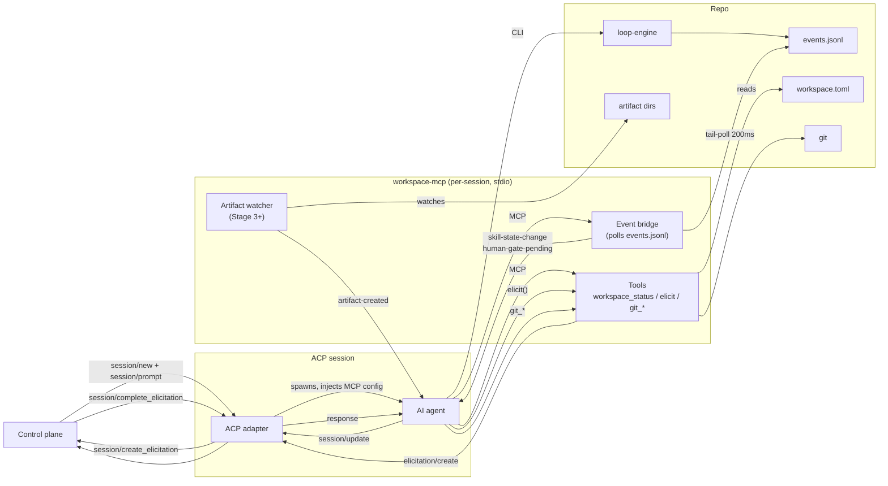

# workspace-mcp

**Status:** Stage 1 Shipped — `agentbundle` 0.28.0
**RFC:** [0078](../../rfc/0078-workspace-mcp.md) · Accepted
**Last updated:** 2026-08-04
**Reviewers:** TBD

> Renamed from `workspace-agent` to avoid collision with Claude Code subagents in `.claude/agents/`.

---

## What it is

`workspace-mcp` is a per-session MCP server that makes any agentbundle-equipped repo
observable and controllable by ACP-compliant control planes. It bridges loop-engine FSM
transitions, workspace queue state, human-gate events, and git operations to the MCP/ACP
surface — without changing how skills run when no control plane is present.

It runs as a sidecar to the AI agent process: one instance per session, stdio transport,
no port binding. It exits when the session ends.

---

## Why

A control plane dispatching Claude Code via ACP receives free-form text output. It cannot
distinguish a `SPEC-HUMAN-GATE` from normal output, a completed artifact write from a
failed run, or which item in the workspace queue is ready to dispatch next.

Three gaps block reliable unattended operation:

1. **No FSM visibility.** The control plane cannot observe work-loop phase transitions. It
   can't tell when a gate is pending, what the reviewer found, or whether the run succeeded
   or abandoned.

2. **No workspace discovery.** The control plane must know the repo's queue layout in
   advance to dispatch work. Without a structured query surface, it is tightly coupled to
   the repo's internal structure.

3. **No git scoping.** Without guardrails, the AI may commit or push files outside the
   dispatched item's scope — silently corrupting unrelated work.

Elicitation (routing mid-session questions to the human) is **not** the primary gap — a
control plane can receive questions through ACP's native `session/create_elicitation`
without workspace-mcp, via Claude Code's built-in `AskUserQuestion` tool or turn-based
HITL. workspace-mcp adds uniform elicitation across all skills via the session instruction,
but the channel itself exists independently.

---

## End-to-end flow



**Four primary flows:**

| Flow | Path |
|---|---|
| **Progress** | loop-engine appends to `events.jsonl` → event bridge tail-polls → emits `skill-state-change` |
| **Human gates** | Event bridge detects `*-HUMAN-GATE` → emits `human-gate-pending` with reviewer findings + gate question |
| **Elicitation** | `elicit()` → `elicitation/create` (MCP) → ACP `session/create_elicitation` → control plane → human → `session/complete_elicitation` → AI |
| **Git** | AI calls `git_*` tools → workspace-mcp validates against lifecycle manifest → subprocess |

> **Observability caveat — Stage 1:** `claude-agent-acp@0.64.x` does not relay MCP
> `notifications/message` frames (`case "notification": break`). The control plane observes
> FSM state by polling `workspace_status()`. The notification definitions below are the
> target contract; relay support requires a future adapter update.

---

## Adapter classes

| Class | Adapters | MCP injection | elicitation/create | Session instruction |
|---|---|---|---|---|
| **A** | Claude Code, Codex | Per-session via `session/new.mcpServers` | Claude Code: ✓. Codex: ✗ (fallback). | `session/new._meta.systemPrompt` |
| **B** | Kiro CLI (terminal binary) | Static `.kiro/settings/mcp.json` | Unconfirmed (fallback assumed) | Embedded in agent file |
| **Deferred** | Kiro IDE, Copilot CLI, Gemini CLI, OpenCode | Incompatible | — | — |

### Class A — Per-session injection

The control plane injects workspace-mcp at `session/new.mcpServers`. Two spawn forms:

```json
// Trusted checkout (local developer):
{
  "mcpServers": [
    {
      "name": "workspace-mcp",
      "command": "python3",
      "args": [".claude/skills/workspace-status/scripts/workspace_mcp_server.py"],
      "env": [{ "name": "WORKSPACE_MCP_SPEC_PATH", "value": "docs/specs/my-feature" }]
    }
  ]
}

// CI / untrusted checkout — module mode (-I flag, see Security):
// Note: isolated-mode engine lookup is deferred to Stage 2; the guard in
// _load_workspace_status_engine raises RuntimeError when sys.flags.isolated
// is True and the engine file is not found via package-relative paths.
{
  "mcpServers": [
    {
      "name": "workspace-mcp",
      "command": "python3",
      "args": ["-I", "-m", "agentbundle.workspace_mcp"],
      "env": [{ "name": "WORKSPACE_MCP_SPEC_PATH", "value": "docs/specs/my-feature" }]
    }
  ]
}
```

The projection root for `args[0]` varies by adapter: `.claude/skills/` (Claude Code),
`.agents/skills/` (Codex).

Because workspace-mcp is injected per-session by the control plane, it is absent from
every session the control plane did not create. Interactive editor sessions — a developer
using Claude Code directly, not through a harness — never see the MCP server or the
session instruction unless the user manually adds workspace-mcp to their global MCP
config (not the intended deployment model). The exception is Class B adapters (see
below): a Kiro CLI repo with workspace-mcp in `.kiro/settings/mcp.json` loads
workspace-mcp in every terminal session, including interactive ones.

**Session mode** is set by which env var is provided:

| Env var | Value | Mode |
|---|---|---|
| `WORKSPACE_MCP_SPEC_PATH` | `docs/specs/<dir>` | FSM (work-loop items) |
| `WORKSPACE_MCP_DISPATCHED_ITEM` | `{ini_slug}/{type}:{slug}` | Non-FSM (shaping, research, etc.) |
| *(neither)* | — | Discovery — read-only; mutating git tools disabled |

**Discovery mode** solves the bootstrapping problem: the control plane opens a short-lived
session with no env var, calls `workspace_status()` to get the ready queue, then opens a
bound session for the chosen item.

**`WORKSPACE_MCP_DISPATCHED_ITEM` format** includes `ini_slug` because two active
initiatives may legally have entries with the same `type` + `slug`. Omitting it would
produce identical branch names and artifact scopes for distinct items.
Example: `initiative-a/shape:initiative-x`.

**Headless permissions.** Claude Code prompts for MCP tool approval before calling each
tool. Pre-approve the six workspace-mcp tools so headless sessions don't hang:

```json
{
  "permissions": {
    "allow": [
      "mcp__workspace-mcp__workspace_status",
      "mcp__workspace-mcp__elicit",
      "mcp__workspace-mcp__git_status",
      "mcp__workspace-mcp__git_branch",
      "mcp__workspace-mcp__git_commit",
      "mcp__workspace-mcp__git_push"
    ]
  }
}
```

Add these manually to `.claude/settings.json` (repo-scope) or `.claude/settings.local.json`
(user-scope). `agentbundle install --pack core` will automate this once the additive-merge
projection target ships (open item).

### Class B — Kiro CLI (terminal binary)

Kiro CLI (terminal binary) ignores `session/new.mcpServers` and reads from
`.kiro/settings/mcp.json`. Configure once per repo; every session in that repo has
workspace-mcp automatically. Concurrent FSM sessions are not supported.

> **Note:** The installed `kiro` binary on most machines is Kiro IDE (GUI editor), not
> the Kiro CLI terminal binary — these are separate products. Kiro IDE has no headless
> ACP mode and is Deferred. Only the standalone Kiro CLI terminal binary is Class B.

```json
{
  "mcpServers": {
    "workspace-mcp": {
      "command": "python3",
      "args": [".kiro/skills/workspace-status/scripts/workspace_mcp_server.py"],
      "env": { "WORKSPACE_MCP_SPEC_PATH": "docs/specs/my-feature" }
    }
  }
}
```

Set `WORKSPACE_MCP_SPEC_PATH` for FSM (work-loop) sessions; omit it for non-FSM sessions.

**Agent format.** Kiro CLI terminal binary uses JSON agents (`.kiro/agents/<name>.json`).
Markdown agent support and `elicitation/create` capability depend on the installed CLI
version — unconfirmed; response-file fallback assumed.

**Mode detection.** Because the config is static, workspace-mcp runs two detectors
concurrently (no per-session env var to determine mode):

- **FSM detector:** polls for `engine-state.json` files strictly newer than the
  process-start sentinel file. Wins over the non-FSM detector.
- **Non-FSM detector:** reads the current branch at session start; binds on first
  `git_branch()` call.

If `WORKSPACE_MCP_SPEC_PATH` is set, gate-resume scanning is scoped to that spec.
If absent, the gate scan is skipped — preventing a stale gate from a prior run from
hijacking a new session.

**Known limitation.** If the prior session ended on a feature branch and the new session
starts on the same branch for a different item, workspace-mcp binds the old slug.
Workaround: check out the new item's branch before starting the session.

**What differs from Class A:**

- `_kiro.dev/mcp/server_initialized` fires before the first `session/prompt` — a reliable
  readiness signal Class A adapters don't provide.
- Session instruction is static (committed to the agent file), not per-dispatch.

**What is identical:** all notifications, all tools, the reactive git model, lifecycle
manifest. The workspace-mcp binary does not change between classes.

### Deferred

| Adapter | Reason |
|---|---|
| Kiro IDE | GUI editor — no headless ACP mode |
| Copilot CLI | MCP transport incompatibility: Copilot CLI only supports HTTP and SSE MCP transports; workspace-mcp is stdio-only (confirmed v1.0.78 `mcpCapabilities: {http: true, sse: true}`) |
| Gemini CLI | Inverts the MCP direction |
| OpenCode | Ignores `mcpServers` entirely |

---

## Components

### Event bridge

Tail-polls `.loop-run/events.jsonl` at 200ms using position-based reads (seek to last
offset). Never misses a line regardless of transition rate.

On each valid line whose `run_id` matches the session:

- Skips `seq ≤ last_emitted_seq` (idempotent replay guard).
- Emits `_agentbundle.core/skill-state-change`.
- If `to` ends in `*-HUMAN-GATE`, also emits `_agentbundle.core/human-gate-pending`
  enriched with reviewer output and gate question from `engine-state.json`.

**Crash recovery.** On each poll, if file size < saved offset or inode changed (from a
`cmd_reset` + `cmd_init` cycle), the bridge resets offset and re-enters lazy `run_id`
discovery.

**Torn-write recovery.** The bridge holds partial final lines at the current offset until
the next poll. loop-engine prepends a bare `\n` when appending a new event if the file
doesn't end with one — terminating the partial record without corrupting the new event.

**loop-engine outbox protocol.** A naive write-then-append loses events on crash between
the two writes. `cmd_transition` uses an outbox:

1. Write pending event to `.loop-run/events.pending` (truncate-and-rewrite)
2. Atomically rename `engine-state.json.tmp` → `engine-state.json`
3. Append the pending event to `events.jsonl`
4. Delete `.loop-run/events.pending`

On startup, if `events.pending` exists: if `engine-state.json` shows `state == pending.to`
AND `seq` matches, replay (append + delete). Otherwise discard.

### workspace_status()

Returns a DAG-resolved view of `workspace.toml`: ready items, shaping items, blocked items
(with named unmet `needs:` edges), and active items. Also returns FSM state fields:
`current_state`, `gate_pending`, `gate`, `gate_question`, `review_findings`.

The control plane uses `workspace_status()` to:

1. Discover which items to dispatch (discovery mode).
2. Poll FSM state, replacing push notifications while relay support is pending.

### Elicitation

Every skill elicits from the user at informal moments (clarifying questions, option
selection) as well as formal gate states. Restricting elicitation to gate states alone
leaves the control plane blind to most of a session.

**Delivery path** is chosen at MCP handshake time from the host's `capabilities.elicitation`:

| Host declares `elicitation` | Path | Notes |
|---|---|---|
| Yes | `elicitation/create` (MCP) → ACP `session/create_elicitation` | Confirmed for Claude Code via `claude-agent-acp@0.64.2` (`elicitation.ts`). ACP SDK uses `unstable_createElicitation()` / `unstable_completeElicitation()` — marked unstable. |
| No | Response-file fallback | workspace-mcp writes to a `O_EXCL 0600` temp file. Control plane reads `response_path` from `_agentbundle.core/elicitation-pending` and writes response via atomic rename. |

workspace-mcp never advertises `elicitation` in its own `ServerCapabilities` — that field
belongs to the client.

**Session instruction** tells the AI to call `elicit()` for all questions rather than
emitting text to the user. Injected once at `session/new._meta.systemPrompt` (Class A) or
embedded in the V3 agent file (Class B). Persists for the session lifetime — no per-turn
re-injection required.

```
You are operating in a workspace managed by workspace-mcp. Follow these rules for this
entire session — they apply to every turn, including follow-up user messages.

1. If the `workspace_status` tool is available, call workspace_status() at session start
   to understand the current queue before doing any work.
2. Do not call git commands directly. Use the git_* tools provided by workspace-mcp.
   Exception: if you are running the work-loop skill and an active FSM run is underway,
   work-loop owns its git lifecycle — do not intercept it via git_* tools.
3. When you would ask the user a question, request approval, show options, or elicit any
   response — check if the `elicit` workspace-mcp tool is available. If it is, call
   elicit(message, context, options) and wait for the returned response instead of emitting
   text to the user.
4. The workspace-mcp tools remain available for the duration of the session.
5. Before writing artifacts for a non-FSM item, call git_branch(<ini_slug>/<type>/<slug>)
   if not already on the item's feature branch.
6. When instructed to commit and push, call git_status() to identify uncommitted files,
   git_commit(message) to stage and commit matching paths, then git_push(branch).
```

### Git tools

`git_status`, `git_branch`, `git_commit`, `git_push` — executed via subprocess, scoped to
the dispatched item's `output_pattern` from the lifecycle manifest. `git_commit` intersects
the working tree against the item's output pattern: unrelated **unstaged** files are silently
excluded (not staged); **pre-staged** files outside the output paths cause a hard refusal (the
call returns an error; no bridge-warning notification is emitted in Stage 1).

Push target is validated against the dispatched item's manifest branch.
Discovery mode and FSM mode disable all mutating tools.

### Lifecycle manifest

Maps workspace item types to `output_pattern`, `dispatch_skill`, and git behaviour.
Built-in defaults cover the known type taxonomy. Third-party packs extend by projecting
files to `workspace-types.d/` (additive, no clobber).

### Artifact watcher *(Stage 3+)*

Polls each dispatched item's `output_pattern` directory at 200ms using recursive listing
snapshot diffs. Emits `_agentbundle.core/artifact-created` when a new file appears.

---

## Notification contract

All notifications are MCP `notifications/message` frames using the `_agentbundle.core/`
namespace.

| Notification | When | Key payload fields |
|---|---|---|
| `skill-state-change` | Each FSM transition | `seq`, `run_id`, `spec`, `from`, `event`, `to`, `at` |
| `human-gate-pending` | FSM enters `*-HUMAN-GATE` | `gate`, `spec_path`, `review_findings`, `question` |
| `gate-pr-ready` | `pr_url` appears in `engine-state.json` during `CODE-HUMAN-GATE` | `gate`, `spec_path`, `pr_url` |
| `run-complete` | FSM reaches `DONE` or `ABANDONED` | `run_id`, `outcome`, `spec_path`, `pr_url` |
| `elicitation-pending` | `elicit()` called — fallback path only | `message`, `context`, `options`, `session_id`, `elicit_seq`, `correlation_id`, `response_path` |
| `artifact-created` | New file in watched output dir *(Stage 3+)* | `path`, `item_slug`, `item_type`, `session_id` |
| `skill-complete` | `git_push` returns for non-FSM item | `item_slug`, `item_type`, `committed_paths`, `branch`, `pushed` |
| `bridge-warning` | Bridge or watcher detects a problem | `reason`, reason-specific fields |

**`pr_url` ordering.** work-loop opens the PR *after* the `CODE-HUMAN-GATE` transition.
`human-gate-pending` fires at the transition; `gate-pr-ready` fires seconds later when
`pr_url` appears in `engine-state.json`. The control plane must not block on `pr_url` in
`human-gate-pending`.

**Gate vs. elicitation.** `human-gate-pending` and `elicitation-pending` are distinct.
A gate blocks the FSM until resolved; an elicitation is an informal question. Both are
resolved via `elicit()`. The join key: `elicitation-pending.correlation_id ==
human-gate-pending.gate`.

---

## Security

| Constraint | Why |
|---|---|
| `-I` flag required for untrusted checkouts | Without it, a repo-provided `agentbundle/` directory shadows the installed wheel and achieves RCE in the control plane process. |
| Response-file: `mkdtemp(0700)` + `O_EXCL 0600` | Prevents pre-seeding by a same-uid process. |
| Response-file write: atomic rename only | Direct write risks workspace-mcp reading a partial file. |
| Git push validated against manifest branch | Rejects pushes to unexpected branches. Routing-only — not authentication. |
| Slug safety: `^[a-zA-Z0-9._-]+$`, rejects `.` / `..` / leading `-` | Prevents path traversal in output_pattern glob construction. |

---

## Decisions

Full rationale and alternatives in each ADR. Summary:

| Decision | ADR |
|---|---|
| Session instruction over per-skill gate modification | ADR-0063 |
| Per-session process, not a daemon | ADR-0062 |
| `events.jsonl` as event source (not in-process IPC) | ADR-0064 |
| `elicit()` + `elicitation/create` + response-file fallback | ADR-0065 |
| Reactive git at TurnEnd (not declarative `git_managed` flag) | ADR-0066 |
| Lifecycle manifest: built-in defaults + `workspace-types.d/` | ADR-0067 |
| Notification namespace: `_agentbundle.core/` | ADR-0068 |
| Threading: daemon threads + bounded pool (not asyncio) | ADR-0069 |

---

## Rollout

| Stage | Scope | Status |
|---|---|---|
| **0 — Spikes** | Five design spikes | **Closed** — see `docs/rfc/0078-notes/spike-results.md` |
| **1 — Claude Code, work-loop** | Single adapter, FSM sessions | **Shipped** — agentbundle 0.28.0, PR #860 |
| **2a — Codex** | Response-file elicitation fallback, headless permissions | Not started |
| **2b — Codex** | Response-file elicitation fallback, headless permissions | Not started |
| **2c — Kiro CLI (terminal)** | Static `.kiro/settings/mcp.json` config, agent format, `elicitation/create` | Not started |
| **3 — Non-FSM skills** | Artifact watcher, desk-research, PE, XD | Not started |
| **4 — Multi-instance, worktrees** | Concurrent sessions, convergence | Future scope |

---

## Open items

| Item | Blocking | Notes |
|---|---|---|
| Additive-merge `permissions.allow` projection in agentbundle Claude adapter | Automated install | Manual workaround: add entries to `.claude/settings.json` directly |
| Kiro CLI (terminal) Markdown agent + `elicitation/create` confirmation | Stage 2c | Depends on installed CLI version; response-file fallback assumed |
| Copilot CLI stdio transport | Deferred indefinitely | Confirmed incompatible (v1.0.78): HTTP/SSE only, no stdio |
| Behavioral test suite (`workspace-mcp-stage1-behavioral-tests`) | AC3–AC16, AC21–AC22 | Tracked in `workspace.toml` backlog |
| ACP notification relay (`case "notification": break` in `claude-agent-acp`) | Push-based FSM observability | Upstream `claude-agent-acp` |
