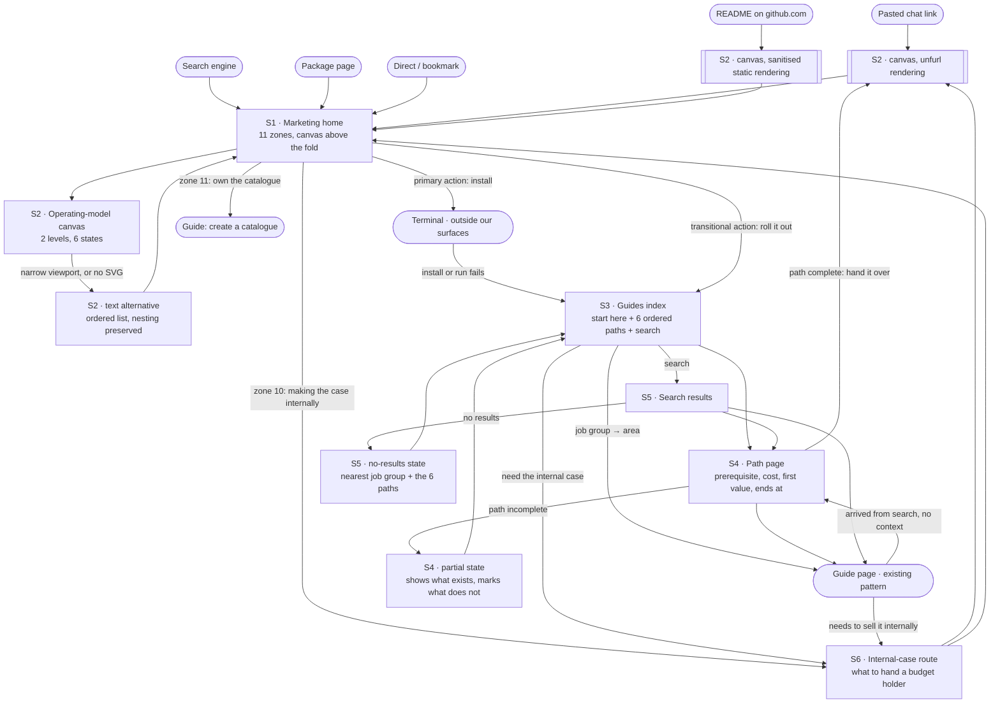

# Screen flow — team orientation

Six screens across two surfaces, sequenced, with the error and edge flows routed.
The inventory is the spine; the edges are the work.

**Surface:** responsive-web for both. The navigation model differs by surface and
must: marketing carries a short persistent header and a scroll story;
documentation carries a persistent sidebar, search, and breadcrumbs from
Starlight's own chrome. Platform conventions are pointed to, never reprinted —
MDN for responsive layout and typography.

**Path resolution.** `[design] output_dir` is unconfigured in this repository, so
the skill's two-branch elicitation would normally run. The owner's standing
instruction resolves it to `docs/design/`, and no `agentbundle-layout.toml` is
being written — that config affects every future design session here and is the
owner's call. Resolved path surfaced before writing: **`docs/design/screens/`**.

## The screen inventory

Six screens. Named by the job each does, not by a widget.

| ID | Screen | Surface | Genre | New or existing |
| --- | --- | --- | --- | --- |
| S1 | Marketing home | marketing | marketing | Restructured — 11 zones |
| S2 | Operating-model canvas | both, plus two non-web renderings | marketing | **New** |
| S3 | Guides index | documentation | documentation | Restructured |
| S4 | Path page | documentation | documentation | **New pattern**, six instances |
| S5 | Search results | documentation | documentation | Existing, raised in prominence |
| S6 | Internal-case route | marketing | marketing | **New** — the Crossing B destination |

**Not screens, and why.** The eleven marketing zones are zones of S1, not
separate screens — a reader scrolls, they do not navigate. `README.md` and the
chat link-unfurl are *renderings* of S2, not screens; they are specified as S2
states because they carry no navigation of their own. An individual guide page is
an existing pattern this engagement does not change, so it appears in the flow as
a terminus but gets no brief.

## The flow

## Transitions and edges

Every row is checked by the steel thread below. `→` is a normal transition;
`⚠` is an error or edge flow.

| From | Trigger | To | Kind |
| --- | --- | --- | --- |
| Pasted chat link | reader opens it | S2 unfurl rendering | → |
| S2 unfurl rendering | reader clicks through | S1 | → |
| README on github.com | reader reads the canvas | S2 sanitised static | → |
| S2 sanitised static | reader follows the link | S1 | → |
| S1 | reader reaches above the fold | S2 | → |
| S2 | narrow viewport, or SVG unavailable | S2 text alternative | ⚠ |
| S2 text alternative | reader continues | S1 | → |
| S1 | primary action | terminal, outside our surfaces | → |
| terminal | install or first run fails | S3 | ⚠ |
| S1 | transitional action | S3 | → |
| S1 | zone 10, for the reader who is not the installer | S6 | → |
| S1 | zone 11 closer | guide: create a catalogue | → |
| S3 | picks a path | S4 | → |
| S3 | searches | S5 | → |
| S3 | needs to make the internal case | S6 | → |
| S3 | job group to area | guide page | → |
| S4 | follows a step | guide page | → |
| S4 | path has unwritten steps | S4 partial | ⚠ |
| S4 partial | reader backs out | S3 | ⚠ |
| S4 | hands the path over | S2 unfurl rendering | → |
| S5 | opens a result | guide page | → |
| S5 | result is a path | S4 | → |
| S5 | no results | S5 no-results | ⚠ |
| S5 no-results | recovery | S3 | ⚠ |
| S6 | narrow viewport, or the canvas does not render | S2 text alternative | ⚠ |
| S6 | shares the artifact | S2 unfurl rendering | → |
| S6 | back to the whole model | S1 | → |
| guide page | arrived from search with no context | S4 | ⚠ |
| guide page | needs to sell it internally | S6 | → |

**The edge that matters most.** A reader who lands on a guide page from a search
engine has no context and no exit. That is the crossing this skill's own
wayfinding check calls a blocker, and it is routed twice above: up to the path
that contains the page, and across to the internal-case route.

**One edge deliberately not routed.** A failed install is a terminal condition on
a surface we do not own. It routes to S3 because that is where troubleshooting
lives, but the flow cannot guarantee the reader gets there — the terminal has its
own output. Named rather than papered over.

## Per-screen state matrix

Which states each screen handles. The state *set* is defined once in the shared
quality floor and is not restated here; the behaviour *between* states is
`interaction-design`'s.

| Screen | empty | loading | error | success/default | partial | disabled | permission |
| --- | --- | --- | --- | --- | --- | --- | --- |
| S1 Marketing home | n/a | n/a | n/a | ✓ | n/a | n/a | n/a |
| S2 Canvas | n/a | n/a | ⚠ see note | ✓ | n/a | n/a | n/a |
| S3 Guides index | n/a | ✓ | n/a | ✓ | n/a | n/a | n/a |
| S4 Path page | n/a | ✓ | n/a | ✓ | ✓ | n/a | n/a |
| S5 Search results | ✓ | ✓ | ✓ | ✓ | n/a | n/a | n/a |
| S6 Internal-case route | n/a | n/a | n/a | ✓ | n/a | n/a | n/a |

**No screen is gated,** so `permission/denied` does not apply anywhere. Stated so
the empty column is a decision rather than an oversight.

**S1, S2, and S6 have no data dependency,** so empty, loading, and partial do not
apply. This is unusual and worth stating: it is why the canvas's real state
burden falls on rendering context rather than on data.

**S2's error state is not a data error.** The canvas has four *rendering* states
beyond default — emphasis, reduced motion, narrow viewport, and sanitised static
— and the floor's `error` maps only to "the graphic did not render at all", whose
recovery is the same text alternative the narrow viewport uses. One artifact,
three jobs: mobile collapse, screen-reader equivalence, and render failure.

## The steel thread

No generative or prototyping design-tool connection is available in this
session, so the walk degrades to the **text-only steel thread** — and it runs,
because this step is non-droppable.

**Assertion 1 — every transition resolves to a screen or a named terminus.**
Walked against the transition table's **29 rows** — 21 normal transitions and 8 error or edge flows. Declared screens: S1, S2, S3, S4, S5, S6, plus the states S2
text alternative, S2 unfurl, S2 sanitised static, S4 partial, S5 no-results.
Declared termini outside our surfaces: terminal, guide page, guide: create a
catalogue. Declared entry points: pasted chat link, search engine, package page,
direct, README.

Result: **29 of 29 resolve** in both directions — every `To` and every `From` names a declared destination. Zero unresolved.

**Assertion 1b — every screen is reachable from a real entry point.** A flow can
resolve every edge and still contain a screen nothing routes to. Checked
separately: all six screens are reachable from the five entry points. Zero
orphans.

**Assertion 1c — every screen is reachable from the surface its journey stage
names.** Added after cold review, because 1b was too weak to catch a real defect:
S6 serves the journey's Stage 3, whose surface is the marketing home, and S6 was
reachable only through S3 — a Stage 4 surface. So a Stage 3 champion had to
complete a later stage to reach the screen built for their current one, and 1b
passed anyway because *something* routed there.

Result: S6 is now reachable directly from S1 zone 10. Checked, not assumed.

**Row count corrected twice.** An early draft claimed 28 rows against 27; the
table now has 29 after the S1→S6 and S6-canvas-failure rows were added.

**Assertion 2 — every action names a backing service.** No `service-blueprint`
was run for this engagement, so services are named textually, as the method
allows.

| Action | Backing service | Exists today |
| --- | --- | --- |
| Render the canvas on the web | Static site generation, marketing renderer | yes |
| Render the canvas in `README.md` | GitHub's Markdown pipeline, sanitising | yes, and it constrains us |
| Render the canvas in a chat unfurl | Link-preview metadata plus a raster export | **no — the raster export path does not exist** |
| Copy the install command | Client-side clipboard | yes |
| Navigate a job group to an area | Generated guide navigation | yes, and it needs a spec amendment for job grouping |
| Search the documentation | Documentation search index | yes |
| Open a path | Static page from the guides tree | pattern is new, generation exists |
| Reach the internal-case route | Static marketing page | **no — S6 does not exist** |

Result: **8 of 8 actions have a named service. Two do not exist yet** — the
canvas raster export and the S6 destination. Both are new build work, both are
named, and neither is assumed.

**What the steel thread did not verify.** It is a text walk, so it proves the
flow is internally complete, not that any screen works. It cannot catch a screen
that resolves correctly and reads badly. That is `experience-reviewer`'s job at
the Validate gate, and the rendered-surface pass with a browser that the
heuristic baseline defers to it.

## Cross-brief consistency pass

Checked across the set, not per brief.

- **Shared components reused, not reinvented.** S3, S4, and S5 sit inside
  Starlight's existing chrome and reuse it. S1 and S6 reuse the marketing
  header, section band, and CTA components. S6 is a new page reusing S1's
  components entirely — it introduces no new component.
- **States uniform.** Every screen with a data dependency handles loading; only
  S5 has a genuine empty state; only S4 has partial. No screen invents a state
  the floor does not name.
- **Copy voice aligned, and deliberately not uniform.** S1 and S6 follow the
  marketing copy direction; S3, S4, and S5 stay in the documentation register.
  That divergence is required by the fourth tech-site principle, not a
  consistency failure. What *is* uniform across all six is the vocabulary: the
  five station names and the human decision phrasing.
- **Navigation non-contradictory.** One route marketing into documentation
  (S1 → S3) and one route back (guide page or S3 → S6). No screen offers a
  route that another screen contradicts.
- **One invariant the whole set depends on:** the five station names appear in S2 and in S1's zones 4 and 5 — three places on the marketing surface. They are **not** S3's job groups; those are the seven existing job names, a different axis. What S1 and S3 share is the work-lifecycle decision phrasing and the seven job names. Recorded in every brief's consistency invariants.

## Verification note

The transition table was machine-checked, not eyeballed. The checker parses the
table out of this file, compares every `From` and `To` against a declared set
written from the inventory — **not derived from the table itself**, which would
make the comparison unfalsifiable — and separately walks reachability from the
five entry points.

**And the checker was proved capable of failing**, because a green check that
cannot go red proves nothing:

| Mutation | Expected | Observed |
| --- | --- | --- |
| none — the real table | 0 unresolved, 0 orphans | 0 unresolved, 0 orphans |
| add a row routing to an undeclared screen `S9` | reports 1 unresolved | reported `('S1', 'S9')` |
| declare a screen nothing routes to | reports it unreachable | reported the orphan |

Both mutations fired. The clean result on the real table is therefore a result
rather than a restatement of the conclusion.

The checker was re-run after the transition table changed, rather than trusting
the earlier green: 29 of 29 resolve, zero orphans, and the new assertion 1c
passes.

## Hand-off

Per-screen briefs are in `docs/design/screens/team-orientation/`. The canvas's
deep specification — metaphor, trace order, three renderings, responsive
collapse, screen-reader equivalence — lives at
`docs/design/screens/team-orientation-canvas.md` and is *referenced* by S2's
brief, not restated in it.

`creative-direction` and `design-system` enrich the shared contract.
`interaction-design` owns the in-screen behaviour for S2 and S5 — note that S2
resolves to **one image and one focusable control**, not a navigable graphic.
`ux-writing` writes copy per screen and state, keyed to the matrix above.
`experience-reviewer` reviews the flow and the briefs together.
