# Screen brief: operating-model-canvas · agent-ready-repo · surface: responsive-web

## Place in the whole

- **Type:** screen-brief
- Journey step(s): future-state Stage 1 (Evaluate), Stage 2 (Prove on real work), Stage 3 (Win buy-in)
- Enters from: S1 (embedded above the fold) · pasted chat link (unfurl rendering) · README on github.com (sanitised static rendering) · S4 (handed over) · S6 (shared)
- Exits to: S1 · S2 text alternative (narrow viewport or render failure)
- Traces to outcome: a champion can transfer the whole model without improvising
- Surface genre: marketing

**Its deep specification is a separate document and is referenced, not restated:**
`docs/design/screens/team-orientation-canvas.md` carries the metaphor and its
stated limits, the six-step trace order, the three renderings, the label-sourcing
rule, the responsive-collapse reasoning, the screen-reader equivalence pattern,
and the eight failure modes it must be reviewed against. That document exists
because no installed skill designs an explanatory information graphic — it is the
Gap C workaround, treating the canvas as a screen.

## Job

Make the whole operating model traceable in one glance, and survive leaving the
page.

## States

Five rendering states, none of them a data state — the burden is on rendering
context. They are listed once in `../team-orientation-canvas.md` §5 and are not
restated here. Mapped onto the quality floor's vocabulary:

- **success/default** — floor `success`; the canonical state 1.
- **error** — the graphic did not render at all. It has no presentation of its
  own; it recovers into canonical state 5's artifact.
- empty / loading / partial / disabled: **not applicable.** No data dependency.
- permission/denied: not applicable — not gated.

Rendering states 2 through 5 — emphasis, reduced motion, narrow viewport, and
sanitised static — are where the real work is; the floor's vocabulary does not
name them. Focus visibility and screen-reader equivalence are **requirements**
across those states rather than states of their own.

## Data & actions

- **Shows:** five named adoption stations in sequence; the work sequence nested
  inside station 2; the human decision points; the tracker as a one-way outbound
  branch that visibly terminates; the boundary between what travels with a person
  and what belongs to the repository.
- **Actions:**
  - Emphasise a station or work step → none. Client-side presentation only, and
    removing it must lose nothing.
  - Open the text alternative → none. The alternative is present in the document
    rather than fetched.
  - Render on the web → static site generation, marketing renderer. Exists.
  - Render in `README.md` → GitHub's Markdown pipeline. Exists, **and it
    constrains the design**: `<style>` blocks inside SVG, `class`, `id`,
    `<script>`, and `<foreignObject>` are stripped, and no animation plays.
  - Render in a chat unfurl → link-preview metadata plus a raster export.
    **The raster export path does not exist.** New build work, named.
  - ⚠ Any of the three renderings fails → the text alternative.

## Interaction & behavior

Enriched by `interaction-design`. The state *set* is owned by the shared quality
floor and enumerated once in `../team-orientation-flow.md`; this section is the
in-component behaviour on top of it.

### In-component state machine

```mermaid
stateDiagram-v2
    [*] --> Resolving
    Resolving --> Static: guard — no script, or no stylesheet<br/>(sanitised context, e.g. a README)
    Resolving --> Listed: guard — viewport below the collapse width
    Resolving --> Interactive: guard — script and stylesheet present,<br/>viewport at or above the collapse width

    Static --> [*]: terminal — the whole model is legible;<br/>no events are accepted

    Listed --> Interactive: viewport crosses above the collapse width
    Interactive --> Listed: viewport crosses below the collapse width

    state Interactive {
        [*] --> AtRest
        AtRest --> Emphasised: pointerenter, or focus
        Emphasised --> AtRest: pointerleave, or blur
        Emphasised --> Emphasised: focus moves to the next trace stop
    }

    Interactive --> TranscriptOpen: activate the transcript control
    TranscriptOpen --> Interactive: activate again, or Escape
    Listed --> [*]: terminal — the list IS the content
```

**Every guard named.** `Static` is entered when the rendering context supplies no
script or stylesheet — it is the binding context, and it is a **terminal state
that accepts no events**. `Listed` is entered below the collapse width and is
also terminal in the sense that the list is the content, not a degraded view of
it. `Interactive` is the only state with a nested machine, and its only nested
transition is emphasis.

**The critical property:** `Static` is not a fallback reached after failure. It is
a first-class entry state chosen by a guard, and it presents the complete model.
`Interactive` is `Static` plus emphasis. Deleting every transition inside
`Interactive` loses nothing but weight.

### Feedback and timing

**Emphasis is instant and motionless.** Hovering or focusing a station or step is
a frequent, repeatable, keyboard-initiated action, and motion on a high-frequency
interaction reads as a delay the reader pays every time. The response is
immediate — comfortably inside the threshold at which an interaction stops
feeling like a wait and starts feeling direct.

**No skeleton, no spinner, no optimistic update.** The canvas has no data
dependency and nothing is in flight, so none of these has anything to represent.
Named so their absence is a decision.

**No slow-connection path for the graphic itself**, because it is a single inline
asset with no fetch. The one degraded path that matters is the sanitised context,
and it is a guard rather than a failure.

**The transcript control gives a state change, not motion.** Its open and closed
states must be distinguishable without relying on an animated reveal, since the
information it carries is required, not decorative.

### Motion

**Decision: the canvas does not animate.** Applying the frequency test — a
frequent, repeated, or keyboard-initiated action gets no motion — rules out
emphasis, focus movement, and the transcript toggle. That is every interaction
the component has.

**The one exception already resolved upstream:** a single on-load entrance,
which the aesthetic direction permits and which continuous looping is refused
for, on cited comprehension grounds. It communicates arrival and nothing else, so
if the entrance is cut the canvas loses no information.

**Reduced-motion path:** the still state, which is also the default. The
information the entrance carried — that the canvas has arrived — is carried by
its presence. Nothing is stripped along with the movement.

This is not a case where the reduced-motion path is a lesser version. It is the
canonical state, and the binding rendering cannot animate at all, so designing
motion as essential would have been designing for the minority context.

### Gesture and pointer

Responsive-web. Pointer, keyboard, and touch, per MDN's guidance for pointer and
keyboard equivalence — pointed to, not reprinted.

**Touch carries no emphasis.** A hover-equivalent tap on a station would be a
tap that does nothing informational, which reads as a broken control. On touch
the canvas is the `Static` presentation plus the transcript control, and the
transcript control is the only touch target in the component.

**Target-size intent:** the transcript control is a genuine control and needs a
comfortable target; the stations and steps are not controls on touch and need
none. Sizing the stations as if they were tappable would promise an interaction
that does not exist.

### Focus: one tab stop, not fourteen

**Resolved against an earlier contradiction.** A previous draft specified
`role="img"` *and* a focus order across thirteen interior elements. Those are
mutually exclusive: `role="img"` collapses the subtree, so thirteen focusable
descendants become unnamed tab stops inside an image, and the reference SVG has
no `tabindex`, no interior roles, and no per-element accessible names for them to
attach to.

**The architecture is: one image, one control.** The canvas is a single graphic
with an accessible name and description, plus **one** focusable element — the
transcript disclosure. That is what `Portable whole` and the `Static` guard
already imply, and it is what the reference SVG actually is.

Consequences, stated so nobody reintroduces the other architecture:

- **Emphasis is pointer-only.** There are no focusable interior elements to
  receive keyboard focus, so emphasis cannot be keyboard-driven. That is
  acceptable *only* because emphasis carries no information — the moment it does,
  this architecture is wrong.
- **Keyboard and touch parity is achieved by the transcript**, not by making the
  graphic navigable. A keyboard reader gets the whole model in the transcript, in
  trace order, which is better than fourteen unnamed tab stops.
- The existing focus-ring system applies to that one control, including its
  documented scoped override for dark carriers. Do not re-derive it.

If a future requirement genuinely needs per-station interaction, the graphic
becomes `role="group"` with named interior nodes and a roving-focus model — a
different design, not an increment on this one.

### Cognitive-law fit

- **Miller / chunking** — the arc is five items and the enclosure eight, so
  neither exceeds what working memory holds as chunks, and the nesting means the
  reader holds one structure rather than two.
- **Hick** — the component offers one control. Emphasis is not a choice.
- **Doherty** — every response is instant; nothing is asynchronous.
- **Fitts** — the only target is the transcript control, and it is placed with the
  text it reveals rather than in a corner.
- **Jakob** — the deliberate trade-off. A diagram that responds to hover is a
  familiar web convention, and this canvas mostly does not. The trade is accepted
  because the binding context cannot support the convention, and a convention
  that works in one of three renderings is worse than a consistent absence.

### Accessibility, and where the full spec lives

The screen-reader equivalence pattern, the applicable success criteria, and the
text alternative are specified in `../team-orientation-canvas.md` §7 and in
`operating-model-canvas-composition.md`, which also records the measured contrast
results and the three non-text contrast breaches found and corrected. They are
not restated here.

Two behavioural additions this section owns:

- **The transcript is a disclosure, not a tooltip.** It must be reachable by
  keyboard, announce its expanded state, and stay open until dismissed. A
  hover-revealed long description would be unusable by the readers who need it.
- **Emphasis must not be the only indication of focus.** The focus ring is the
  focus indicator; emphasis is additional. If emphasis were the focus signal, a
  reader in the `Static` or `Listed` state would have no focus indication at all.

### Floor check

No behavioural choice here fights the quality floor. The one place it could have
— designing emphasis as information — is prevented by the additive-only rule,
which the sanitised rendering enforces anyway. Nothing to record as an open
question.

## Copy

Label sourcing is narrower than an earlier draft claimed. The three human-decision labels are **adapted from** the
existing guide paths' *first value* and *ends at* fields, which are already
published, already reviewed, and already carry zero gate codes. `ux-writing` owns
final wording, the decision-point questions, the one line stating that the route
is common rather than mandatory, and the transcript prose.

**No label may contain a gate code.** The canvas is the element that replaces
eleven of them; reintroducing one would defeat its purpose.

## Shared contract — REFERENCE, do not restate

- Design system: `web/src/styles/tokens.css`. Note the one token distinction that
  matters here — the display accent fails the body-text contrast requirement on
  light backgrounds and the text-safe accent is a different token. Any text
  inside the graphic on a light band uses the text-safe one.
- Aesthetic direction: `docs/specs/platform-site/aesthetic-direction.md`. It
  already resolved this element as a static SVG with accent on the decision
  nodes, with at most a one-shot entrance — a decision grounded in a cited
  comprehension study. That decision is honoured, not re-litigated.
- Navigation / chrome: none of its own. It sits inside S1's chrome on the web and
  inside no chrome at all in the other two renderings.
- Quality floor: WCAG at the level this context requires · reduced-motion ·
  handle-all-states.

## Consistency invariants

- **Reuse, never reinvent:** the existing focus-ring system, including its two
  documented scoped overrides. Do not re-derive focus treatment for this element.
- **Must stay consistent with:** S1 zones 4 and 5, which expand what the canvas
  shows. **Not S3's job groups** — those are the seven existing job names, a
  different axis from the five stations.
- **The load-bearing invariant:** five station names, three places — this canvas, and S1's zones 4 and 5. Not the documentation job groups, which are a different axis.
- **Two levels, never three.** The disclosure ceiling is two; a third level is
  the every-concept-in-one-panel failure mode.

## Done

- [ ] all six states designed
- [ ] every action wired to a named service, including the two that do not exist
- [ ] error/edge flows route to a real state
- [ ] copy in per state, labels derived from the published path fields
- [ ] WCAG + reduced-motion honored; text alternative conveys nesting and the
      one-way tracker edge, not a flattened summary
- [ ] uses the design system (no off-system components)
- [ ] interaction/behavior section enriched by `interaction-design`
- [ ] sanitiser probe run against a real README — **verification owed, not assumed**
- [ ] raster export path confirmed in scope or explicitly deferred
- [ ] reviewed against the eight named failure modes in the deep spec
- [ ] zero gate-code strings
- [ ] design-review clean

### If marketing

- **Hero approach:** narrative. The canvas *is* the above-fold narrative; it is
  not a decorative hero image and must not be treated as one.
- **Above-fold contract:** the canvas satisfies the proof-signal and orientation
  parts. Headline, subheadline, actions, and friction microcopy are S1's.
- **Scroll story:** zone 1. Zones 4 and 5 are its expansion.
- **IC-first check:** two things must complete within five seconds and without
  interaction — that this is about a team over time, and that one station
  contains the detail. If either needs an interaction, the design has failed its
  binding rendering.
