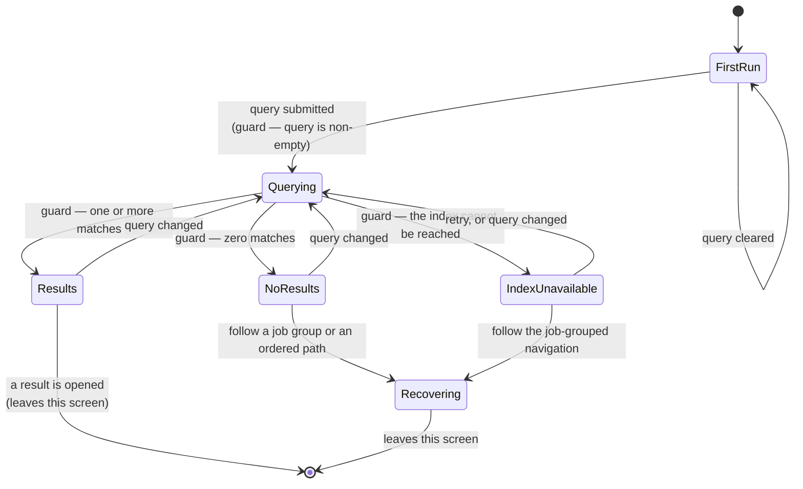

# Screen brief: search-results · agent-ready-repo · surface: responsive-web

## Place in the whole

- **Type:** screen-brief
- Journey step(s): future-state Stage 4 (Roll out a cohort), Stage 5 (Make it the default)
- Enters from: S3 (searches)
- Exits to: guide page (opens a result) · S4 (a result is a path) · S3 (⚠ recovery from no-results)
- Traces to outcome: a reader who knows what they want reaches it without browsing 229 pages
- Surface genre: documentation

**Why this screen has a brief at all.** It exists today and is unchanged in
mechanism. It gets a brief because roughly 229 published pages puts this surface
in the search-first tier, which makes search a primary route rather than a
convenience — and because its no-results state is the recovery path for the
navigation failure this engagement is fixing.

## Job

Take a reader from a term they know to the page they need.

## States

The only screen in this flow with a full data-state burden.

- **empty (first-run):** no query entered. Orients and invites — the placeholder
  names a real example query that actually returns results, not the word
  "Search".
- **empty (no-results):** the query matched nothing. **Distinct from first-run
  and the more important of the two.** Shows recovery: the nearest job group and
  the six ordered paths. Never a dead end.
- **loading:** progress indicated, layout preserved so results do not shift under
  a click.
- **error:** the index is unavailable. Says what happened in the reader's terms
  and offers the job-grouped navigation as the alternative route. Not a bare
  failure.
- **success/default:** results, each identifying which job group and which path
  contains it, so a reader arriving by search gets the context that search
  otherwise strips.
- partial / disabled: not applicable.
- permission/denied: not applicable — not gated.

## Data & actions

- **Shows:** the query; matching pages; for each result, its containing job group
  and path.
- **Actions:**
  - Open a result → guide page. Backing service: static page from the guides
    tree.
  - Open a result that is a path → S4.
  - ⚠ No results → the no-results state, recovering to S3.
  - ⚠ Index unavailable → the error state, recovering to the job-grouped
    navigation.
  - Submit a query → the documentation search index. Exists.

## Interaction & behavior

Enriched by `interaction-design`. The state set is owned by the shared quality
floor; this is the in-component behaviour.

### In-component state machine

**Guards named.** An empty query does not submit — it returns to first-run rather
than producing a zero-result state, because "you searched for nothing" is not a
finding. `NoResults` and `IndexUnavailable` are distinct states with distinct
recoveries: the first offers the nearest job group and the ordered paths, the
second offers the whole job-grouped navigation, because the index being down says
nothing about the query.

**`Recovering` is a real state, not a message.** It is the reason the no-results
case is designed rather than handled — for a reader at 229 pages who does not
know the right term, recovery into the paths is a good outcome.

### Feedback and timing

**Skeleton, not spinner.** The result list has a predictable shape, so a
placeholder that preserves the layout stops the page jumping when results land —
and layout stability matters more here than usual, because a shifting list under
a click sends the reader to the wrong page.

**Optimistic update: not eligible.** Search results cannot be predicted, so
showing anything before the index answers would be a guess presented as a
result.

**Degraded connectivity is a designed state, not an afterthought.** A slow index
holds the skeleton and keeps the query visible so the reader knows what is being
answered. It must not silently fall back to `NoResults` — a slow index reported
as "nothing found" is the failure mode that teaches readers not to trust search.

**Submit timing:** on explicit submit, not on every keystroke. Incremental
results at this corpus size make the list churn under the reader's eye, and the
churn costs more than the latency it saves.

### Input and validation flow

Single field, so sequence is trivial; what matters is what happens around it.

- **Focus lands in the field on arrival at this screen**, and only here — never on
  the index, where it would trap a reader who came to browse.
- **No inline validation.** There is nothing to validate: a query is either
  empty, which does not submit, or it is a query.
- **The query stays visible in every state**, including the error state, so the
  reader never has to remember what they asked.
- **Escape clears and returns to first-run** rather than leaving the screen,
  which keeps the search surface reversible.

### Motion

**Decision: no motion.** Search is a frequent, repeated, keyboard-initiated
action — the clearest case for a motionless, instant response. Animating the
results in would add a delay the reader pays on every query, and it would move
the target they are about to click.

The skeleton-to-results change is a substitution, not a transition. Reduced-motion
path is identical to the default, so nothing is lost.

### Gesture and pointer

Responsive-web, documentation surface. Keyboard operation is primary here in a
way it is not elsewhere: arrow keys move through results, Enter opens, Escape
clears. Pointer and touch follow the platform's list conventions.

**Documentation-surface mobile note:** results are list rows and need enough
vertical breathing room to be targeted reliably. And when the sidebar collapses,
search must remain reachable from the header — it is the primary route at this
corpus size, so losing it on mobile would be losing navigation.

### Pattern family

This is the **search-interaction** pattern family, invoked by name rather than
reinvented. The two elements this surface takes from it and currently lacks:
results that carry their containing context, and a no-results state that
recovers into browsable structure instead of apologising.

### Cognitive-law fit

- **Doherty** — the skeleton is what keeps a slow index inside the threshold
  where the reader still feels the system is responding.
- **Hick** — results are a ranked list, not a set of equally-weighted choices,
  so the ranking does the narrowing.
- **Recognition over recall** — every result names its job group and path, so
  the reader recognises where a page sits instead of remembering the taxonomy.
  This is the finding that closes the arrived-from-search-with-no-context edge.
- **Jakob** — conventional throughout. No deliberate trade-off; a search surface
  is the wrong place to be original.

### Floor check

Nothing here fights the quality floor. The one risk — a slow index rendering as
"nothing found" — is called out above as a designed state precisely because it
would otherwise be a silent failure rather than an error.

## Copy

`ux-writing` owns every string on this screen, and they are all UI-state copy:
the placeholder, the no-results recovery, and the error framing. Blame-free and
actionable — a no-results state that says the reader searched wrongly is the
failure mode.

The placeholder's example query must be checked against the real index. An
example that returns nothing is worse than a generic placeholder.

## Shared contract — REFERENCE, do not restate

- Design system: `docs-site/src/styles/tokens.css`.
- Aesthetic direction: `docs/specs/docs-site-design-refresh/creative-direction.md`.
- Navigation / chrome: Starlight's search and page frame.
- Quality floor: WCAG at the level this context requires · reduced-motion ·
  handle-all-states.

## Consistency invariants

- **Reuse, never reinvent:** Starlight's search component and result list. This
  screen adds context to results; it does not replace the search mechanism.
- **Must stay consistent with:** S3 (which launches it and whose job groups the
  no-results state recovers into), S4 (which some results are).
- **The load-bearing invariant:** a result must name its containing job group and
  path. This is what closes the "arrived from search with no context" edge, which
  is the blocker this skill's own wayfinding check names.

## Done

- [ ] all applicable states designed — both empty variants, distinctly
- [ ] every action wired to a named service
- [ ] error/edge flows route to a real screen or state
- [ ] copy in per state, blame-free
- [ ] the placeholder's example query verified against the real index
- [ ] WCAG + reduced-motion honored
- [ ] uses the docs design system
- [ ] interaction/behavior section enriched
- [ ] design-review clean

### If documentation

- **Diátaxis type:** none — this is a navigation surface, not content. Worth
  stating, because forcing a Diátaxis type onto it would be a mistyping of the
  kind the index already suffers from.
- **TTFV target:** first result opened is the value moment. A no-results state
  that recovers into the paths is the second-best outcome and must be designed as
  a real outcome rather than a failure message.
- **Navigation strategy:** search-first — this screen is that strategy's primary
  expression. At 229 pages it is not a convenience feature.
- **Machine-readability:** results carry their job group and path as structured
  context, not as prose appended to a title.
