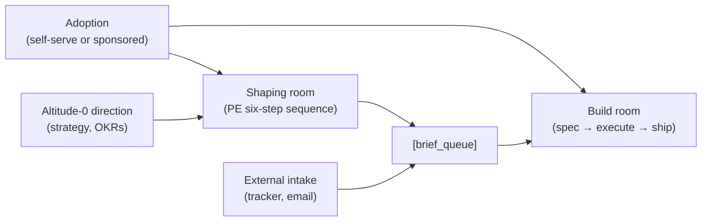
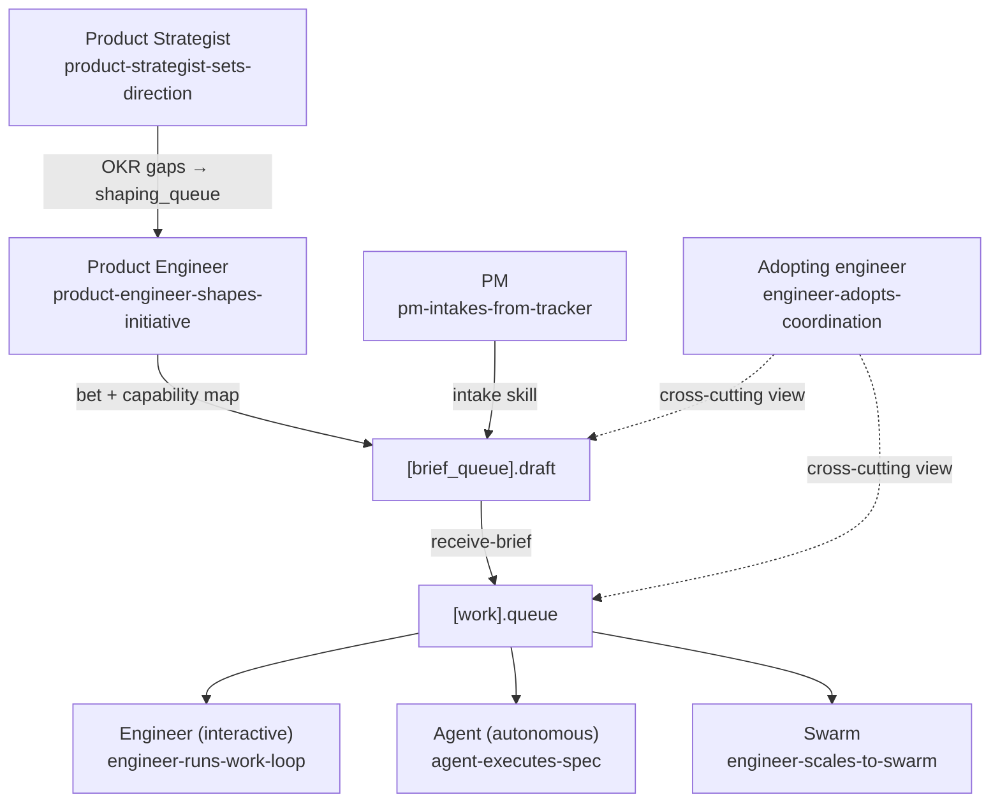

# Journey maps

Customer and agent journeys for the INI-001 AI-Native Ecosystem. Each map covers one persona moving through a meaningful outcome — showing the current state (how it works today) and the to-be state (what each initiative milestone delivers). Journeys are living documents: when a milestone ships, the relevant stage is updated to reflect the new current state and the to-be callout is removed or replaced.

## How adoption, shaping, and build relate

Work in this ecosystem moves through two rooms before it ships — and adoption is the prerequisite that must happen first:

**Shaping room** — where strategy, product thinking, and external signals are transformed into a shaped brief with a committed rationale. The output is a DoR-compliant brief in `[brief_queue]`. The personas here are the product strategist, the product engineer, and any PM bridging from a tracker.

**Build room** — where a brief becomes specs, then code. The work queue (`[work]`) holds specs; `work-loop` executes them; the engineer or agent is the actor. Headless agents (INI-003) are a scaling variant of the build room, not a separate room.

**The brief queue is the handoff point.** A brief passes the DoR gate (`Status: Ready`) and enters `[brief_queue].ready`. The build room picks it up via `receive-brief`, decomposes it into specs, and those land in `[work].queue`. From there, `check-workspace` drives the session.

Journeys below are grouped by room. The three shaping journeys are distinct personas who all write to the brief queue through different paths. The four build journeys are distinct execution modes for the same work-loop pattern.

---

## Status lifecycle

| Status | Meaning |
|---|---|
| `proposed` | Identified as a journey worth mapping; current state not yet fully captured |
| `shaping` | Current state mapped; future state design in progress |
| `planned` | Both states mapped; future-state stages tied to initiative milestones |
| `shipped` | To-be state is now current state; journey updated to reflect live product |

A journey can be partially shipped — some stages updated to current, others still showing to-be.

---

## Shaping room journeys

These journeys all converge on the brief queue — each persona takes a different path in but writes to the same `[brief_queue].draft` output.

| Journey | Persona | Status | Initiative links |
|---|---|---|---|
| [Product strategist sets direction](product-strategist-sets-direction.md) | Strategist / CPO anchoring initiative clusters in altitude-0 artifacts (PRFAQ, OKR cascade, market analysis) | proposed | INI-002 M4 (primary); M2 (prerequisite) |
| [Product engineer shapes initiative](product-engineer-shapes-initiative.md) | PE or PM running the six-step shaping sequence (situation → opportunities → diverge → validate → bet → brief) | proposed | INI-002 M2 (primary); M1 (prerequisite) |
| [PM intakes from tracker](pm-intakes-from-tracker.md) | PM bridging Linear / Jira / GitHub issues into the brief queue without manual reformatting | proposed | INI-002 M5 (primary); M1 (prerequisite) |

---

## Adoption journey

The adoption journey is the prerequisite for everything else. It covers two paths — self-serve (solo or startup) and sponsored (enterprise with a champion, live demo, and rollout playbook).

| Journey | Persona | Status | Initiative links |
|---|---|---|---|
| [Engineering team evaluates and adopts](team-evaluates-and-adopts.md) | Any team evaluating the platform — self-serve (senior engineer installs and ships first spec) or sponsored (enterprise champion demos to CTO, platform team rolls out) | planned | INI-002 M1 (what the team adopts); M6 (tutorial, rollout playbook, live-demo guide) |

---

## Build room journeys

All four journeys converge on the work queue — different actors, same `work-loop` infrastructure. The core loop (plan → build → verify → ship) is the same; what changes is the orientation source and the degree of human involvement.

| Journey | Persona | Status | Initiative links |
|---|---|---|---|
| [Engineer adopts AI-native coordination](engineer-adopts-coordination.md) | Engineer installing Platform Core and operating it end-to-end for the first time | planned | INI-002 M1–M6 (primary) |
| [Engineer runs the work-loop](engineer-runs-work-loop.md) | Interactive implementer using `work-loop` day-to-day; human in the loop for plan review and gate navigation | planned | INI-002 M1 (primary); M2–M6 (ongoing improvements) |
| [Agent executes spec autonomously](agent-executes-spec.md) | Headless agent cold-starting, orienting, executing, and shipping without human intervention | planned | INI-002 M1 (primary); INI-003 M1+ (extends) |
| [Engineer scales to coordinated agent swarm](engineer-scales-to-swarm.md) | Team with INI-002 M1 in place, scaling to headless CLI agent pipelines across multiple specs in parallel | shaping | INI-003 M1+ (primary); INI-002 M1 (prerequisite) |

---

---

## Specialist pack journeys

These journeys cover the end-to-end experience of a specific optional pack, including its integration with the loop arc (work-loop + release-loop) and day-2 operations. They sit inside the build room — they are specialised variants of the `engineer-runs-work-loop` path for a specific domain.

| Journey | Pack | Status | RFC |
|---|---|---|---|
| [Engineer provisions infrastructure](engineer-provisions-infrastructure.md) | `iac-terraform` — repo scope | planned | [RFC-0065](../../rfc/0065-iac-terraform-pack.md) |

---

## How the journeys tie together

The `engineer-adopts-coordination` journey is the cross-cutting adopter view — it covers install, shaping, brief, and build in sequence. The other journeys zoom in on specific personas and rooms. Use the specialised journeys for design input into sub-RFCs; use the adopter journey as the overall product narrative.

---

## Convention — updating a journey when a milestone ships

1. Open the journey file for the affected persona.
2. For each stage that changed, replace the **Now** section with what was previously the **With [Milestone]** section.
3. If the milestone introduced a new future state beyond what was mapped, add a new **With [Next milestone]** section.
4. Update the `status` frontmatter if appropriate (e.g., `shaping` → `planned` when future stages are tied to milestones; `planned` → `shipped` when all future-state stages reflect live product).
5. Update the `updated` date in frontmatter.
6. Update this README's status column if the journey's status changed.

---

## Relationship to initiatives

Initiative names are linkages inside each journey file — not journey names. A journey is named for the persona and outcome it represents, which stays stable even when the underlying initiative structure changes. Multiple initiatives may deliver changes to stages within one journey; a single initiative milestone may touch multiple journeys.

## Relationship to other shaping artifacts

Journey maps sit between product vision (why we're building this) and screen flows (how specific interactions are designed). A journey stage with a high-opportunity pain is the input for `map-screen-flow`. Backstage services implied by journey actions are the input for `blueprint-service`. Findings that surface across multiple stages are candidates for `docs/product/findings/`.
