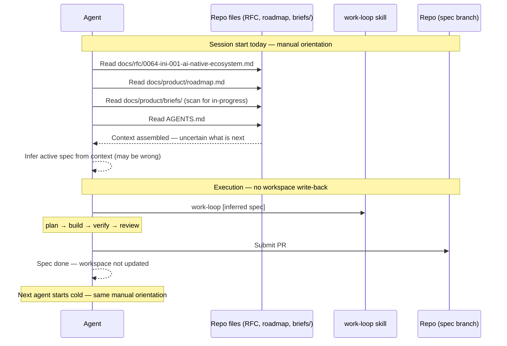
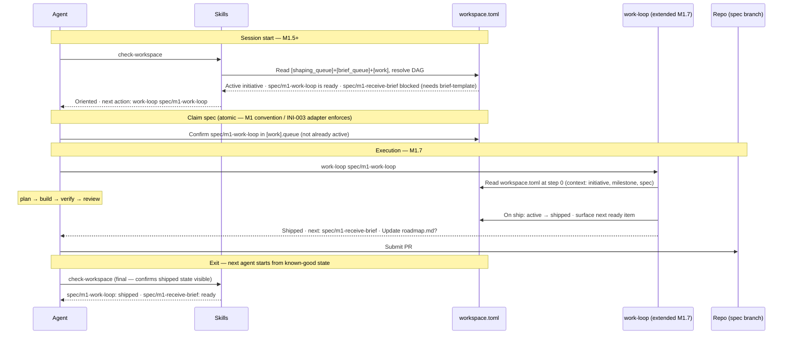

# Journey: Agent executes a spec autonomously

**Persona:** An AI agent — Claude Code, Codex CLI, Kiro CLI, or any headless harness — starting a fresh session with no persistent memory of prior sessions. The agent has no human in the loop for the execution phase. It must orient itself, pick up the right spec, execute it through the work-loop, navigate gates, submit a PR, mark the spec shipped, and exit cleanly.

**Outcome:** The spec is in `[work].shipped`. A PR is submitted and passing. `workspace.toml` reflects the new state. The next ready item is surfaced. The next agent starting a session can orient immediately without reading any prior session's context.

**Surface:** cross-platform — runs identically across Claude Code (`claude`), Codex CLI (`codex`), Kiro CLI (`kiro`), GitHub Copilot CLI, Gemini CLI. The skill surface (`check-workspace`, `work-loop`) is harness-agnostic; harness-specific conventions (MCP vs static `.md`, context window limits) are adapter concerns (INI-003).

**Trigger:** Agent session starts — invoked by a human running `claude`, by a CI/CD job dispatching a headless agent, or by a swarm supervisor allocating a spec.

**End state:** Spec shipped. PR submitted. `[work].active` updated to `[work].shipped`. Next ready item surfaced. Session exits cleanly with committed state — the next agent picks up from a known-good position.

---

## Prerequisites

| Pack | Scope | Status | Provides |
|---|---|---|---|
| core | repo | current | `check-workspace` (M1.5), `work-loop` (M1.7), `new-spec` |
| coding CLI adapter pack | user | planned (INI-003) | Harness-specific invocation, write-back contract implementation; one adapter per harness (Claude Code, Codex CLI, Kiro, etc.) |

**One-time setup:**
1. Install core pack at repo scope.
2. Install the harness-specific coding CLI adapter pack at user scope (when INI-003 ships).
3. `workspace.toml` must be committed to `main` and pre-populated (M1 Batch 2); no branch configuration needed — headless agents read it from the local working directory.
4. Agent must have write access to the spec branch — edits to `workspace.toml` commit with the spec PR (resolved write protocol; RFC-0064 Known Unknowns).

**Scale:** all harness shapes (interactive Claude Code, headless CI, remote agents via INI-004) use the same write protocol: edit `workspace.toml` locally in the working directory and commit in the same spec PR. Adapter-specific concerns (CLI invocation, tool surface, context window) are INI-003's scope.

---

## Interaction model

### Current state — before M1.5 / M1.7

### To-be state — M1.5 + M1.7 shipped

---

## Stage 1: Orient

### Now

| Row | Content |
|-----|---------|
| **Actions** | Reads RFC, roadmap, briefs directory, AGENTS.md. Assembles context from 4+ files. Infers what spec to work on. |
| **Emotions** | N/A (agent has no emotions). **Failure modes:** context assembled incorrectly (wrong spec inferred); context outdated (stale RFC or roadmap); spec already in progress by another agent (no visibility). |
| **Pains** | "Four files to read, and the answer is still uncertain." "If the RFC was updated since the last session, the agent may be working from stale context." "No way to know if another agent is already working on the same spec." "Reading 4+ files consumes significant context window before any work starts." |
| **Opportunities** | `check-workspace` as a single orientation command that surfaces active initiative, queued specs, DAG state, blocked reasons, and parallel candidates. Orientation in one command; context window preserved for actual work. |

> **With M1.5** — `check-workspace` ships: orientation is one command; DAG state surfaces parallel candidates and blocked items; context window saved for work.

---

## Stage 2: Validate Spec Context

### Now

| Row | Content |
|-----|---------|
| **Actions** | Reads the inferred spec file (if it exists). Reads the brief it decomposes. Tries to understand what is in scope and what has already been done. |
| **Emotions** | N/A. **Failure modes:** spec file doesn't exist yet (no new-spec has been run); brief is ambiguous; prior session's work is not committed (agent starts from scratch on uncommitted state). |
| **Pains** | "The spec file may not exist — I have to run new-spec first, but I don't know if that's been done." "The brief doesn't tell me what has already been implemented — I might redo work." "If a prior agent made decisions mid-session that weren't committed, I have no way to see them." |
| **Opportunities** | `work-loop` at step 0 reads `workspace.toml` to confirm the spec is in `[work].active` (or moves it there). Gate-boundary handoff notes committed by the prior session (post-M1 backlog — feeds INI-005). |

> **With M1.7** — `work-loop` reads `workspace.toml` at step 0 to confirm spec context; partial-progress capture (gate-boundary handoff) is a Known Unknown deferred to INI-005 design.

---

## Stage 3: Plan

### Now and to-be (unchanged — work-loop already handles this)

| Row | Content |
|-----|---------|
| **Actions** | Runs `new-spec` if spec file doesn't exist, or reads existing spec. Writes or validates plan. Surfaces assumptions. |
| **Emotions** | N/A. **Failure modes:** plan makes assumptions that conflict with prior decisions; spec AC is too vague to plan against. |
| **Pains** | "The spec AC doesn't tell me what 'done' looks like precisely enough — I have to make assumptions that may conflict with the reviewer's expectations." "If the plan has multiple parallel tasks, I have no way to know which can run in parallel and which must sequence." |
| **Opportunities** | Spec AC written precisely enough for an agent to plan without ambiguity; `work-loop` plan step surfaces assumptions explicitly before build starts. Already partially addressed by work-loop's plan gate. |

---

## Stage 4: Build & Verify

### Now and to-be (unchanged — work-loop already handles this)

| Row | Content |
|-----|---------|
| **Actions** | Executes plan tasks. Runs gates: lint, typecheck, tests, traceability lint. Iterates on failures. |
| **Emotions** | N/A. **Failure modes:** gate failure not diagnosed (agent retries blindly); budget exceeded (too many tokens spent on a failing gate); traceability lint fails because spec or brief is missing a marker. |
| **Pains** | "A gate fails and I retry the same approach three times before trying something different." "I don't know how much budget I've consumed or how close I am to the limit." "The traceability lint fails but the error message doesn't tell me which marker is missing where." |
| **Opportunities** | Gate failure diagnostics that name the specific cause and suggest a corrective action; budget tracking surfaced to the agent mid-execution; traceability lint error messages that name the missing marker and the file. |

---

## Stage 5: Ship & Exit

### Now

| Row | Content |
|-----|---------|
| **Actions** | Submits PR. Does not update `workspace.toml`. Exits. Next agent starts cold. |
| **Emotions** | N/A. **Failure modes:** PR submitted but workspace not updated; next agent re-picks the same spec (thinking it's not done); `roadmap.md` not updated (prompt never surfaced). |
| **Pains** | "I submitted the PR but `workspace.toml` still shows the spec as active — the next agent might pick it up again." "I have no way to surface the `roadmap.md` update reminder." "The next agent starts with the same uncertain orientation I had — nothing I did makes their session easier." |
| **Opportunities** | Post-ship automation: `workspace.toml` updated (active → shipped) on PR submission; next ready item surfaced; `roadmap.md` update prompted; exit state is a clean known-good `workspace.toml` that the next agent can orient from in one command. |

> **With M1.7** — `work-loop` moves spec active → shipped on ship; surfaces next ready item; prompts `roadmap.md` update. Exit state is committed to `workspace.toml` — next agent orients in one `check-workspace` call.

---

## Frontstage actions

- **Action:** run-check-workspace
- **Action:** validate-spec-in-active-queue
- **Action:** run-new-spec-if-needed
- **Action:** write-plan
- **Action:** execute-plan-tasks
- **Action:** run-gates
- **Action:** submit-pr
- **Action:** update-workspace-on-ship
- **Action:** run-check-workspace-exit-state

---

## Failure mode arc (replaces emotional arc for agent persona)

Most critical failure: **Stage 1 (Orient)** — wrong spec inferred, or spec already claimed by another agent. Everything downstream is wasted work if the orientation is wrong.

Second most critical: **Stage 5 (Ship & Exit)** — PR submitted but workspace not updated. The next agent re-picks the same spec, producing a duplicate PR or conflicting work.

Primary design response: M1.5 `check-workspace` (orientation accuracy) + M1.7 `work-loop` write-back (exit state integrity). The combination means orientation is reliable and exit state is committed — the two highest-risk failure points are both closed by M1.

Remaining failure modes (partial-progress capture, budget tracking, gate diagnostics) are post-M1 backlog items — some feed INI-005 design.

---

## Handoff notes

**For `blueprint-service`:** backstage services include `workspace.toml` on `main` (spec claiming — INI-003 adapter concern; write-back on ship via resolved write protocol: agent edits locally and commits with the spec PR), spec branch (plan and build), gates (lint, typecheck, tests, traceability lint), PR submission. Atomic claiming across concurrent headless agents is an open INI-003 design question.

**For INI-003:** the headless dispatch variant of this journey (agent invoked via `claude -p` or equivalent) adds the adapter layer between Stage 1 (Orient) and Stage 2 (Validate Spec Context). The adapter reads `workspace.toml`, formats the invocation, and handles write-back. Stages 3–5 are identical.
