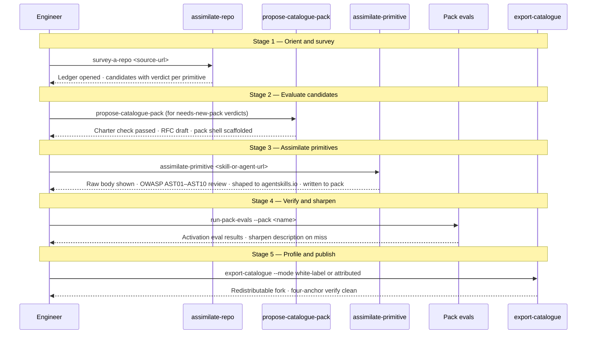

# Journey: Catalogue engineer converges skills

**Persona:** A platform engineer or catalogue maintainer who manages a derived catalogue or an org-stack pack.
They have an existing catalogue (or are starting one) and a set of external skills, subagents, or hooks they want to bring in safely.
They are not a solo adopter installing from the public catalogue — they are the person who decides what goes *into* a catalogue.

Two paths share this journey:

- **Single-primitive intake:** The engineer identifies one external skill or subagent they want in their org's kit and runs `assimilate-primitive` directly, without a survey or RFC.
  This is the org-stack engineer's path.
- **Full convergence:** The engineer surveys a whole external repo, evaluates candidates, proposes new packs, assimilates multiple primitives in sequence, and publishes a profile or fork.
  This is the catalogue maintainer's path.

**Outcome:** External skills and subagents are safely reviewed against the OWASP Agentic Skills Top 10 v1.0 (AST01–AST10), shaped to agentskills.io standard and catalogue craft, catalogued in an auditable pack inventory, and bundled into a profile or redistributable fork that teams can install in one command.

**Surface:** cross-platform — CLI/terminal, agent-assisted.
Assimilation outputs (shaped skills, pack shells, RFC drafts) are files committed to the repo under the pack's source directory.

**Trigger:**
- Single-primitive: an engineer finds an external skill or agent definition they want in their org's kit.
- Full convergence: a platform team wants to grow the catalogue from an external source, or evaluate whether a public catalogue contains skills worth adopting.

**End state:** Every adopted primitive is in `packs/<pack>/.apm/` in canonical form (skill under `skills/` or subagent under `agents/`), OWASP AST-reviewed, agentskills.io-compliant, activation evals authored, inventory entry present, and a clear revocation path established.
A profile or redistributable fork makes the adopted set installable by any team in one command.
The assimilation ledger records what was surveyed, what was adopted, and what was rejected.

---

## Prerequisites

| Pack | Scope | Status | Provides |
|---|---|---|---|
| core | repo | current | `work-loop`, `new-spec`, governance gate |
| governance-extras | repo | current | RFC tooling, spec mechanisms |
| catalogue-curation | repo | current | `assimilate-repo`, `assimilate-primitive`, `propose-catalogue-pack`, `export-catalogue` |

**Setup:**
1. Install core and governance-extras at repo scope first — catalogue-curation requires both.
2. Install catalogue-curation at repo scope: `agentbundle install catalogue-curation --scope repo`.
3. Verify: `agentbundle show catalogue-curation` lists all four skills with their activation phrases.

The catalogue-curation pack is repo-scope and off every default profile by design.
It is an operator's tool, not a builder's tool.

---

## Full convergence chain

---

## Stage 1: Orient and Survey

### Now

| Row | Content |
|-----|---------|
| **Actions** | Identifies a source (a repo URL, a known catalogue, a community project). Runs `assimilate-repo` pointing at the source. The skill fetches over an allowlisted scheme (HTTPS or git only), opens a ledger at a deterministic path (`~/.agentbundle/catalogue-curation/<run-id>/ledger.toml`), and inventories candidates with a verdict for each: `assimilate`, `reject`, or `needs-new-pack`. The engineer reviews the ledger — it is the audit record of what was seen and what decision was made. An interrupted survey resumes from the ledger without re-fetching. |
| **Emotions** | Oriented (neutral → positive). The ledger gives a structured view of a potentially large source without reading every file manually. |
| **Remaining pains** | No progress indicator during the survey beyond ledger entries being written. The survey correctly reads workspace context from the repo's own structure — the engineer does not need to supply file paths or configure input locations manually. |

---

## Stage 2: Evaluate Candidates

### Now

| Row | Content |
|-----|---------|
| **Actions** | Reviews ledger entries marked `needs-new-pack`. Runs `propose-catalogue-pack` — the skill tests the candidate set against four charter principles (universal across stacks, substantive not duplicative, a habit not a tool, used often enough to stick) and stops if any fails with the reason named. On pass: scaffolds a pack shell (`pack.toml`, `plugin.json`, `README.md`, empty `.apm/`), emits an RFC draft with per-primitive inventory. The RFC routes through the governance path before assimilation begins. |
| **Emotions** | Deliberate (neutral). The charter test is an explicit gate — the engineer either proceeds with a justified pack or stops. There is no accidental pack creation. |
| **Remaining pains** | The "used often enough to stick" principle is the hardest to evaluate mechanically — it requires Approver-level judgment about the org's actual habits. The skill offers its recommendation; the final call is human. |

---

## Stage 3: Assimilate Primitives

### Now

| Row | Content |
|-----|---------|
| **Actions** | For each approved candidate (skill or subagent), runs `assimilate-primitive`. The skill shows the raw fetched body **verbatim** — this is the primary security gate; no reformatting before review. For code (hooks, scripts): explicit confirmation required before landing. The OWASP Agentic Skills Top 10 v1.0 (AST01–AST10) review runs on every candidate. AST01 checks for malicious instruction prose; AST03 checks tool grant breadth; AST04 checks metadata parsing safety; AST05 checks external reference pinning; AST06 checks isolation declaration; AST07 checks version drift; AST09 checks governance traceability; AST10 checks cross-platform metadata survival. The skill reshapes the candidate — rewrites the description for activation, moves detail to `references/`, steers or rejects anti-patterns — and writes the result through the path-jail to the destination pack. The skill reads workspace structure and charter context automatically; the operator does not supply file paths. |
| **Emotions** | Careful then confident (neutral → positive). The raw-body review is deliberate friction; after it, the guardrail stack gives confidence the result is safe. |
| **Remaining pains** | Each primitive is assimilated individually. There is no batch mode for pre-approved sets from the same source. A pre-approval shortlist for highly-trusted sources is not yet supported. |

---

## Stage 4: Verify and Sharpen

### Now

| Row | Content |
|-----|---------|
| **Actions** | Runs `python tools/run-pack-evals.py --pack <name>` to verify activation coverage. Each skill declared in the pack's `[pack.evals].skills` list is tested against its `evals/eval_queries.json` — trigger queries and near-miss non-trigger queries. A miss is a signal to sharpen the skill's `description:` field; the eval runner names which queries are failing and the observed trigger rate. Tier-B output-quality evals are authored (`evals/evals.json` records what good output looks like) but automated grading of Tier B is a future mechanism. |
| **Emotions** | Methodical (neutral). Eval misses are actionable signals, not vague quality concerns. |
| **Remaining pains** | Tier-B LLM-judge grading and pass-rate deltas are deferred to a future mechanism. The engineer can author Tier-B evals now, but automated validation against them is not yet available. |

---

## Stage 5: Profile and Publish

### Now

| Row | Content |
|-----|---------|
| **Actions** | Decides the publication path. **Profile route:** update or propose a profile so the adopted set installs in one command via `agentbundle install --profile <name>`. A new profile requires an RFC (profiles are first-party and catalogue-owned today). **Export route:** `export-catalogue` produces a redistributable fork in white-label mode (all upstream identity stripped) or attributed mode (upstream credit preserved in the declared attribution surface). The export's verify step is fail-closed — any surviving identity anchor stops the export before it completes. |
| **Emotions** | Satisfied (positive). The adopted primitives are packaged for reuse and the work persists beyond this session. |
| **Remaining pains** | Adopter-authored profiles (where an org creates its own profile without an RFC) are deferred to a future design. Today, a new profile requires the RFC path. The export path produces a full catalogue fork — partial-pack export (shipping only a subset of packs) is not yet supported. |

---

## Workspace and queue arc

Catalogue curation work fits into the workspace's two-room model.

Survey and evaluation (Stages 1–2) are shaping work — the output is a bet (adopt this?) and a brief (here is what to build).
These live in `[shaping_queue]` before the RFC is accepted.
Once the RFC is accepted and a pack shell exists, individual primitive assimilations are build tasks: one spec per primitive or per pack, in `[work].queue`.

The assimilation ledger (at `~/.agentbundle/catalogue-curation/<run-id>/ledger.toml`) is the curation-specific state that complements `workspace.toml`.
`workspace.toml` tracks which specs are queued and shipped; the ledger tracks which primitives from the source have been reviewed and what verdict each received.

Running `workspace-status` after Stage 2 shows the scaffolded pack's spec tasks in `[work].queue`.
Each assimilation task (Stage 3) is one `work-loop` round — plan (which primitive?) → assimilate → verify activation evals → ship.
The pack arc — survey → scaffold → fill → ship — is the high-level arc; the workspace queue is how individual assimilation tasks are tracked and handed off between sessions or agents.

---

## Frontstage actions

- **Skill:** `assimilate-repo` — survey a source into a resumable ledger
- **Skill:** `propose-catalogue-pack` — charter test and RFC draft
- **Skill:** `assimilate-primitive` — bring in one skill or subagent
- **Tool:** `python tools/run-pack-evals.py --pack <name>` — activation eval run
- **Skill:** `export-catalogue` — produce a redistributable fork
- **Skill:** `workspace-status` — orient at session start; surface next assimilation task

---

## Handoff notes

**For `map-screen-flow`:** Stage 3 (raw-body review + OWASP AST check) and Stage 2 (charter test) carry the highest-opportunity friction.
The raw-body display (external prose shown verbatim before acceptance) and the charter-test interaction (four questions with a pass/fail gate and a named rejection reason) are the highest-priority screen-level inputs for any future web surface.

**For `blueprint-service`:** Backstage dependencies include the assimilation ledger at a deterministic run-id-keyed path, the path-jail (`agentbundle.safety.write_jailed`), the pack lint pipeline, and the OWASP AST review module in the `security-checklists` skill.
The ledger schema and the four-anchor export verify step are the state-carrying services the surface needs to read.
