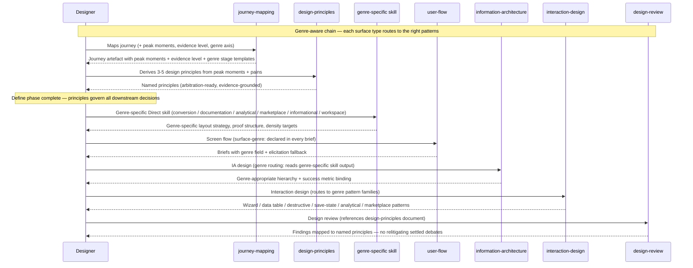

# Journey: Designer designs a surface

**Persona:** A designer or design-engineering hybrid authoring upstream design intent — a solo product designer at a startup, a design lead at an agency, or a design-eng hybrid who owns design through to build. They use the experience pack to move from raw brief through to a design-ready handoff artefact.

Two paths share this journey:

- **Feature design** (single surface): A designer takes one surface from journey map through to screen-flow briefs and delivers a handoff pack to engineering. The full chain runs in one session or across a few.
- **Product design** (multi-surface initiative): A design team maps multiple surfaces across a user journey (e.g. marketing → onboarding → workspace). Each surface runs the chain; the design-principles artefact is shared across all surfaces.

**Outcome:** A screen-flow brief with `surface-genre:` declared, genre-specific IA and interaction patterns applied, design principles produced and referenced in the design review, and a handoff artefact ready for `frontend-engineering`.

**Surface:** cross-platform — CLI/terminal, agent-assisted. The artefacts (screen briefs, design-principles document, conversion design document) are markdown files in the adopter's repo.

**Trigger:**
- Feature design: a product brief exists; the designer is asked to take it from brief to screen design.
- Product design: an initiative is kicked off; the designer owns the experience layer from discovery to delivery.

**End state:** `docs/design/` contains: a journey map with peak moments and evidence level declared; a design-principles document with 3–5 principles grounded in journey insights; a genre-specific design document (conversion / documentation / analytical / marketplace / informational / workspace); a screen-flow with `surface-genre:` and genre-specific notes in every brief; interaction-design patterns applied per genre; a design-review pass with design-principles mapped per finding and genre-specific rubric checks; handoff delivered to `frontend-engineering`.

---

## Prerequisites

| Pack | Scope | Status | Provides |
|---|---|---|---|
| experience | user | current (0.6.0) | 18 skills: 9 renamed to canonical vocabulary, 7 new (design-principles + 6 genre-specific Direct skills), 7 extensions across 6 existing skills, surface-genre contract |

**Setup:**
1. Install experience pack at user scope.
2. Begin with `journey-mapping` → `design-principles` → genre-specific Direct skill → `user-flow` → `interaction-design` → `design-review`.
3. Surface genre declared once at `user-flow` (or elicited inline); flows to all downstream skills automatically.

---

## Full design chain

---

## Lighter modes

Most design work does not start at Stage 1. The full journey (all six stages) is for new products or new user journeys where discovery evidence is needed before design decisions can be made. For everything else, enter at the stage that matches the available context:

| Mode | Entry | Skips | When to use |
|---|---|---|---|
| **Amend** | Stage 4 — `user-flow` | Stages 1–3 | Adding or revising a screen on an existing surface; genre and principles already established |
| **Feature** | Stage 2–3 — `design-principles` / genre skill | Stage 1 | New feature on a known product; journey is understood, brief exists |
| **Full journey** | Stage 1 — `journey-mapping` | — | New product or new user journey; discovery needed before design |

**Amend (3 skills):** Invoke `user-flow` with `surface-genre` known → `interaction-design` → `design-review`. Load `docs/design/principles/<slug>.md` before review. If no principles artefact exists, run `design-principles` first using the product context from the brief.

**Feature (4–5 skills):** Run the genre-specific Direct skill for the surface type (e.g. `conversion-design` for a landing page) → `user-flow` → `interaction-design` → `design-review`. Add `design-principles` at the start if no principles artefact exists. Add `information-architecture` before `interaction-design` when IA structure is open.

**Full journey (6 stages):** Start at Stage 1 when the product is new, the user journey has not been mapped, or design decisions need grounding in discovery evidence. The stage breakdown below describes each step.

---

## Stage 1: Discover

`journey-mapping` produces a journey artefact with peak moment identification (the 1–3 stages with the steepest negative dip + the single most-positive peak, explicit in the artefact), evidence-level declaration (`observational` / `survey-backed` / `assumption-based` in frontmatter), and surface-genre stage templates (canonical stage scaffolds for each of the 7 genres). `service-blueprint` produces an evidence-of-service row (physical/digital artefacts customers encounter at each frontstage touchpoint — notifications, receipts, error screens) and fail-point marking with design priority (critical / high / medium). Designer leaves Stage 1 knowing **where to focus** and **how confident to be**.

---

## Stage 2: Define

The `design-principles` skill fills the Define phase between discovery and screen design. Consumes `journey-mapping`'s peak moments and highest-opportunity pains; derives 3–5 named, actionable principles using the NNGroup four-step model (identify core values → articulate user impact → surface tradeoffs → draft + converge). Output: `docs/design/principles/<slug>.md`. Every downstream skill references these principles when making trade-off decisions. `design-review` maps each finding to the principle it was judged against. **This is the highest-leverage stage in the chain** — principles produced here prevent relitigating direction at every review.

---

## Stage 3: Direct

Six genre-specific Direct skills route each surface to the right patterns:

- **`conversion-design`** (marketing): hero approach selection (5 patterns), above-fold 6-element spec, IC-first principle for developer tools, scroll story 7-zone structure, social proof 6-tier hierarchy calibrated to maturity stage.
- **`documentation-design`** (documentation): Diátaxis type mapping + density calibration, nav-at-scale strategy selection (3 strategies by complexity tier), TTFV as design target, onboarding path as numbered Start Here spine, machine-readability requirements.
- **`analytical-design`** (analytical): domain-model-first approach, business-question anchoring (3–5 explicit questions), three-tier widget hierarchy, Shneiderman's mantra (overview → zoom/filter → details on demand), role-based views, spatial layout grammar, per-widget state handling.
- **`marketplace-design`** (marketplace): listing card IA, filter/facet architecture, comparison affordances, browse-first vs. search-first routing, cart/transaction bridge to interaction-design wizard patterns.
- **`informational-design`** (informational): typography as primary design tool (type scale, line length 45–75 chars, line height 1.4–1.6×), F/Z reading flow calibration (heavy headlines + pull quotes for scanners; body density for committed readers), editorial grid (asymmetric column), article page structure, "what's next" chain design, content entry point diversity.
- **`workspace-design`** (workspace): context-persistence patterns, session arc design (arrive → orient → work → persist → collaborate), collaboration state IA (presence indicators, live-editing, following mode), interrupt and notification design (low-interruption default), permission/sharing model IA, ambient vs. focal attention zones. **Agentic UI patterns** — task queue surface, agent status indicators, human-in-the-loop confirmation surfaces (impossible to accidentally bypass), output review and revision patterns, agent history and auditability, multi-agent coordination visibility.

`information-architecture` applies genre routing at step 1 (reads the genre-specific skill output for all six genres; applies progressive disclosure for `transactional-journey`) and success metric binding (before designing hierarchy, name the measurable outcome the surface serves). `creative-direction` carries genre canonical references: for each genre, the canonical aesthetic reference tier to study (developer tool marketing sites for `marketing`; Stripe/Vercel/Django Docs for `documentation`; Notion/Linear/Figma for `workspace`; etc.).

---

## Stage 4: Design

`user-flow` adds `surface-genre:` to every per-screen brief frontmatter, a confirmation step (confirm genre before drafting briefs; elicit inline when absent), and a `## Genre-specific notes` conditional section at the end of each brief template. Downstream skills read the field automatically. `interaction-design` carries five pattern families in `references/pattern-families.md`:

1. **Wizard and stepper**: linear stepper validation-on-exit, save-and-resume, conditional disclosure.
2. **Data table**: four filter types, bulk operations, row-detail disclosure (5 options), alignment rules.
3. **Destructive action 5-tier escalation**: inline confirmation → toast+undo → modal → typed confirmation → two-person/2FA.
4. **Save-state**: autosave with three indicator states, unsaved-changes guard (Save primary, Discard secondary), draft vs. published distinction.
5. **Analytical dashboard widgets**: KPI card anatomy (≤9 primary), alert/signal design (text-paired, timestamped), drill-down affordance (drawer = default).

The genre-specific brief sections cover all 7 genres: marketing (scroll zone, conversion goal, above-fold elements), documentation (Diátaxis type, density target), informational (content type, what's-next chain), analytical (business question, domain objects, widget-state contract), marketplace (entry path, filter state, comparison affordance), workspace (session arc position, collaboration state, agentic UI elements), transactional-journey (gate position, validation timing, save-state).

---

## Stage 5: Validate

`design-review` makes design-principles integration a mandatory first procedure step: load the design-principles artefact; map each finding to the principle it was judged against. Findings that can't be mapped either (a) identify a quality-floor violation, or (b) surface a new directional call. Genre-specific rubrics:

- **documentation:** density matches Diátaxis type, TTFV path navigable, sidebar ≤ 3 levels, unique page descriptions, semantic heading hierarchy.
- **marketing:** all six above-fold elements present, CTA hierarchy unambiguous, first proof signal above fold, hero matches product type.
- **analytical:** every primary widget has a drill-down destination, handles all four states independently, KPIs ≤9, every alert text-paired.
- **informational:** line length 45–75 chars, declared what's-next path, pull quotes at scan intervals.
- **marketplace:** listing cards consistent tier, filter state visible on load, zero-results state designed.
- **workspace:** session restoration present, collaboration state signals ambient not dominant, agentic actions recoverable or auditable.

Stage 5 closes the full Define→Validate chain: principles produced at Stage 2 are formally required at Stage 5 by procedure, and genre-specific validation replaces ad-hoc external checklists.

---

## Stage 6: Deliver

`user-flow` handover produces a design-tool handover template for `frontend-engineering`. Briefs carry `surface-genre:` and reference the interaction-design patterns applied per genre. Engineering reads the brief and knows which pattern families were selected — fewer "how does this wizard work?" conversations.

---

## What experience 0.6.0 added (RFC-0066)

| # | Capability | Stage |
|---|---|---|
| G1 | `workspace-design` skill — session arc, collaboration state IA, agentic UI patterns | Stage 3 |
| G2 | `design-review` mandatory design-principles integration at step 1 | Stage 5 |
| G3 | `informational-design` skill — typography, F/Z reading flow, editorial grid, what's-next chain | Stage 3 |
| G4 | `design-review` genre-specific rubrics for all six addressable genres | Stage 5 |
| G5 | `user-flow` `## Genre-specific notes` conditional section in every screen brief (all 7 genres) | Stage 4 |
| G6 | `creative-direction` genre canonical reference tier for all 7 genres | Stage 3 |

---

## Adoption metrics

Design quality signals that indicate the skill chain is working. These are process metrics (was the chain followed?) rather than output metrics (is the design good?).

### Surface-genre field coverage

**What it measures:** % of screen briefs produced by `user-flow` that carry a `surface-genre:` field. Low coverage = designers are not invoking the confirmation step.

| Target | How to measure |
|---|---|
| 100% of new screen briefs carry `surface-genre:` after 0.6.0 ships | `grep -r "surface-genre:" docs/design/` across adopter repos |

### Design-principles usage rate

**What it measures:** % of design sessions that produce a design-principles artefact before the IA/screen-design phase. The Define phase is the most consistently skipped in practice.

| Target | How to measure |
|---|---|
| ≥ 80% of feature design sessions produce a `docs/design/principles/` artefact | Count `docs/design/principles/` files relative to screen-flow artefacts in `docs/design/` |

### Peak moment identification rate

**What it measures:** % of journey maps that explicitly mark peak moments. Peak moments are the highest-leverage design investment; maps without them produce flat design decisions.

| Target | How to measure |
|---|---|
| 100% of journey maps created with `journey-mapping` after 0.6.0 mark ≥ 1 peak moment | Check journey artefact frontmatter or peak-moment section |

### Evidence level declaration rate

**What it measures:** % of journey maps with `evidence-level:` declared in frontmatter. Undeclared maps are treated as observational by downstream designers — a silent miscommunication.

| Target | How to measure |
|---|---|
| 100% of new journey maps carry `evidence-level:` | `grep -r "evidence-level:" docs/design/` |

### Design-review principle coverage

**What it measures:** % of design-review artefacts that cite at least one design principle per finding. D5(e) makes this a mandatory procedure step — the mechanism is in place; this metric tracks adoption rate.

| Target | How to measure |
|---|---|
| ≥ 1 principle citation per major design-review finding | Review artefact structure check — each finding references a principle slug |

---

## Frontstage actions

- **Skill:** `journey-mapping` — map the customer journey with peak moments, evidence level, and genre stage templates
- **Skill:** `service-blueprint` — map backstage + evidence-of-service + fail points
- **Skill:** `design-principles` — derive 3–5 arbitration-ready design principles from peak moments and pains
- **Skill:** `conversion-design` (marketing) / `documentation-design` (documentation) / `analytical-design` (analytical) / `marketplace-design` (marketplace) / `informational-design` (informational) / `workspace-design` (workspace + agentic UI) — genre-specific Direct design
- **Skill:** `creative-direction` — visual personality and aesthetic direction
- **Skill:** `information-architecture` — hierarchy design with genre routing + success metric binding
- **Skill:** `user-flow` — screen sequencing with `surface-genre:` in every brief
- **Skill:** `interaction-design` — interaction patterns (wizard, data table, destructive action, save-state, analytical widgets)
- **Skill:** `design-review` — gate review referenced against design principles
- **Skill:** `design-system` — token taxonomy and component grounding

---

## Emotional arc

**Feature design path:** The lowest point is Stage 1 (Discover) when the journey map has no peak moments — the designer knows there are problems but doesn't know which one to solve. The second lowest point is Stage 5 (Validate) when review findings have no criteria to anchor them to.

All genres now have dedicated Direct skills. The remaining friction for the first-time user is Stage 3 (Direct) cognitive load — six genre-specific skills mean more choices, more reading. The tradeoff is deliberate: depth over simplicity.

**Peak moment (shipped):** Stage 2 (Define) — the first time a designer derives design principles and runs the arbitration test ("given two wireframes, which does this principle prefer?"), the value of the Define phase becomes immediate. Designers who have run it once do not skip it.

**Highest-opportunity pain (current):** "Every design review turns into a debate about what we're optimising for. We all agree the design has problems but we can't agree on which direction to go. We had the conversation at the start of the project and then never wrote it down."

**Primary design response:** `design-principles` closes this pain directly. One session of principle derivation replaces repeated direction debates.

---

## Open design questions (feeds follow-on RFCs)

All original open design questions are resolved in RFC-0066. No open design questions remain for the 0.6.0 scope.

**Post-0.6.0 watch items** (not open questions — monitoring items for after the pack ships):

1. **Cognitive load at Stage 3 (Direct):** Six genre-specific Direct skills is a significant choice surface. If adopters report confusion about which skill to pick, a selection guide (single decision-tree doc) may be needed. Revisit after 0.6.0 has been in use for one quarter.

2. **agentic UI patterns depth:** workspace-design ships with foundational agentic UI patterns (task queue, agent status, HITL confirmation, output review). As the platform's own agent-augmented workspaces mature, these patterns may need a dedicated skill extension. Track via adopter feedback.

---

## Handoff notes

**Shipped in RFC-0066 implementation PR:** 7 new skills, 7 extensions across 6 existing skills, D1 genre-specific notes template added to the screen-brief, D5(e/f/g) design-review + creative-direction extensions, D7 rename sweep (9 skills to canonical vocabulary), D8 0.5.0 → 0.6.0 bump. Marketing site (`web/`) and docs guides (`docs/guides/experience/`) updated in the same PR.
