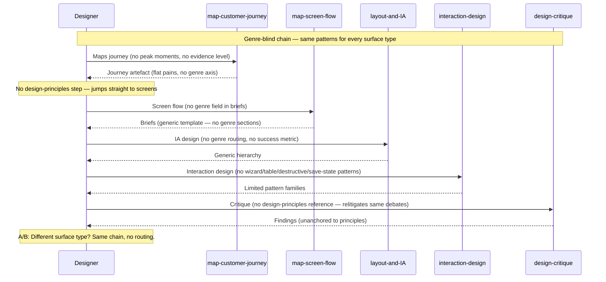
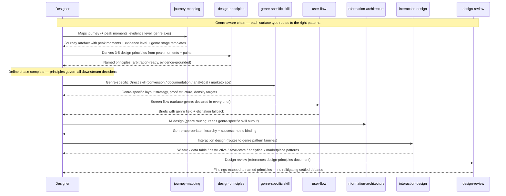

# Journey: Designer designs a surface

**Persona:** A designer or design-engineering hybrid authoring upstream design intent — a solo product designer at a startup, a design lead at an agency, or a design-eng hybrid who owns design through to build. They use the experience pack to move from raw brief through to a design-ready handoff artefact.

Two paths share this journey:

- **Feature design** (single surface): A designer takes one surface from journey map through to screen-flow briefs and delivers a handoff pack to engineering. The full chain runs in one session or across a few.
- **Product design** (multi-surface initiative): A design team maps multiple surfaces across a user journey (e.g. marketing → onboarding → workspace). Each surface runs the chain; the design-principles artefact is shared across all surfaces.

**Outcome:** A screen-flow brief with `surface-genre:` declared, genre-specific IA and interaction patterns applied, design principles produced and referenced in the design review, and a handoff artefact ready for `frontend-engineering`.

**Surface:** cross-platform — CLI/terminal, agent-assisted. The artefacts (screen briefs, design-principles document, conversion design document) are markdown files in the adopter's repo.

**Trigger:**
- Feature design: a product brief exists; the designer is asked to take it from brief to screen design.
- Product design: an initiative is kicked off; the designer owns the experience layer from discovery to delivery.

**End state:** `docs/design/` contains: a journey map with peak moments and evidence level declared; a design-principles document with 3–5 principles grounded in journey insights; a genre-specific design document (conversion / documentation / analytical / marketplace); a screen-flow with `surface-genre:` in every brief; interaction-design patterns applied per genre; a design-review pass referencing the principles; handoff delivered to `frontend-engineering`.

---

## Prerequisites

| Pack | Scope | Status | Provides |
|---|---|---|---|
| experience | user | current (0.5.0) | 11 skills covering the design chain |
| experience | user | planned (0.6.0 — RFC-0065) | + 5 new skills, 4 extended, 9 renames, surface-genre contract |

**As-is setup (experience 0.5.0):**
1. Install experience pack at user scope.
2. Begin with `map-customer-journey` or `map-screen-flow` depending on entry point.
3. No genre awareness in the chain; designer must manually route to relevant patterns.

**To-be setup (experience 0.6.0):**
1. Install experience pack at user scope.
2. Begin with `journey-mapping` → `design-principles` → genre-specific Direct skill → `user-flow` → `interaction-design` → `design-review`.
3. Surface genre declared once at `user-flow` (or elicited inline); flows to all downstream skills automatically.

---

## Interaction model

### Current state — experience 0.5.0 (before RFC-0065)

### To-be state — experience 0.6.0 (after RFC-0065)

---

## Stage 1: Discover

### Now (experience 0.5.0)

| Row | Content |
|-----|---------|
| **Actions** | Runs `map-customer-journey` (produces journey map) and `blueprint-service` (produces service blueprint). Populates frontstage actions, emotions, pains, opportunities. |
| **Emotions** | Methodical but uncertain (neutral). The artefact exists but pains are flat — no signal about where to invest design effort first. |
| **Pains** | "The journey map shows every pain equally. I don't know which one matters most." "There's no way to tell if this map is based on real research or assumptions." "The service blueprint doesn't show the artefacts customers actually receive — just the actors." |
| **Opportunities** | Mark peak moments (highest negative and highest positive) explicitly; carry Kahneman peak-end rule into the map. Declare evidence level so downstream designers know confidence. Add evidence-of-service row to the service blueprint. |

> **With RFC-0065 (D5a + D5c)** — `journey-mapping` gains: peak moment identification (the 1–3 stages with the steepest negative dip + the single most-positive peak, explicit in the artefact); evidence-level declaration (`observational` / `survey-backed` / `assumption-based` in frontmatter); surface-genre stage templates (canonical stage scaffolds for each of the 7 genres). `service-blueprint` gains: evidence-of-service row (physical/digital artefacts customers encounter at each frontstage touchpoint — notifications, receipts, error screens) and fail-point marking with design priority (critical / high / medium). Designer now leaves Stage 1 knowing **where to focus** and **how confident to be**.

---

## Stage 2: Define

### Now (experience 0.5.0)

| Row | Content |
|-----|---------|
| **Actions** | None. The chain jumps directly from journey map to screen flows. No intermediate synthesis step. |
| **Emotions** | Skipped (negative). The design team jumps from "we have research" to "let's make screens" without naming what should govern the screens. |
| **Pains** | "Every design review re-litigates the same trade-offs — we never agreed on what to optimise for." "We have twelve insights from the research but nothing that tells us which direction to go." "Design reviews turn into opinion sessions because we have no shared criteria." |
| **Opportunities** | A dedicated step that synthesises insights into 3–5 named design principles. These principles are decision arbiters: every later design choice is evaluated against them. One session of principle derivation replaces months of repeated debate. |

> **With RFC-0065 (D3)** — New `design-principles` skill fills the absent Define phase. Consumes journey-mapping's peak moments and highest-opportunity pains; derives 3–5 named, actionable principles using the NNGroup four-step model (identify core values → articulate user impact → surface tradeoffs → draft + converge). Output: `docs/design/principles/<slug>.md`. Every downstream skill references these principles when making trade-off decisions. `design-review` maps each finding to the principle it was judged against. **This is the single highest-leverage gap the RFC closes** — the Define phase prevents relitigating at every review.

---

## Stage 3: Direct

### Now (experience 0.5.0)

| Row | Content |
|-----|---------|
| **Actions** | Runs `aesthetic-direction` (visual personality), `layout-and-information-architecture` (hierarchy), `content-design` (copy strategy). No concept of surface genre — all three skills produce the same outputs regardless of whether the surface is a marketing page, a dashboard, or a documentation site. |
| **Emotions** | Competent but constrained (neutral → negative). The skills work but they don't tell the designer what's different about this kind of surface. Marketing-specific conversion patterns, documentation-specific density calibration, and analytical dashboard IA have to be sourced externally. |
| **Pains** | "IA for a marketing page is completely different from IA for a docs site, but the skill treats them the same." "I know our hero needs to demo the product but the skill doesn't have any guidance for how to structure a marketing hero." "I'm designing a dashboard — the skill gives me a generic hierarchy but nothing about three-tier widget IA or Shneiderman's mantra." |
| **Opportunities** | Genre-specific Direct skills for the four highest-gap genres. `information-architecture` with genre routing that reads the genre-specific skill output. |

> **With RFC-0065 (D4 + D5d)** — Four new genre-specific Direct skills ship:
> - **`conversion-design`** (marketing): hero approach selection (5 patterns), above-fold 6-element spec, IC-first principle for developer tools, scroll story 7-zone structure, social proof 6-tier hierarchy calibrated to maturity stage.
> - **`documentation-design`** (documentation): Diátaxis type mapping + density calibration, nav-at-scale strategy selection (3 strategies by complexity tier), TTFV as design target, onboarding path as numbered Start Here spine, machine-readability requirements.
> - **`analytical-design`** (analytical): domain-model-first approach, business-question anchoring (3–5 explicit questions), three-tier widget hierarchy, Shneiderman's mantra (overview → zoom/filter → details on demand), role-based views, spatial layout grammar, per-widget state handling.
> - **`marketplace-design`** (marketplace): listing card IA, filter/facet architecture, comparison affordances, browse-first vs. search-first routing, cart/transaction bridge to interaction-design wizard patterns.
> - **`information-architecture`** gains genre routing (step 1): reads the genre-specific skill output for `marketing` / `documentation` / `analytical` / `marketplace`; applies progressive disclosure for `transactional-journey`; context-persistence patterns for `workspace`; typography-dominant reading flow for `informational`. Also gains success metric binding (before designing hierarchy, name the measurable outcome the surface serves).
>
> **Remaining gap:** `creative-direction` is renamed but not extended — genre canonical references (docs-site aesthetic, analytical surface aesthetic, marketplace aesthetic) are not added in this RFC. `informational` has IA genre routing but no dedicated Direct skill. `workspace-design` is deferred to follow-on RFC.

---

## Stage 4: Design

### Now (experience 0.5.0)

| Row | Content |
|-----|---------|
| **Actions** | Runs `map-screen-flow` (screen sequencing + per-screen briefs) and `interaction-design` (pattern selection). Screen briefs have no genre field. Interaction-design has two pattern families (onboarding + search). No wizard/stepper, data table, destructive action, save-state, or analytical patterns. |
| **Emotions** | Constrained then resourceful (neutral → negative). The designer knows what patterns are needed but has to look them up outside the skill. Each new surface type requires external research. |
| **Pains** | "The screen brief template is the same for every surface — a marketplace brief needs different sections than a workspace brief." "Interaction-design has no guidance on multi-step wizards. I have to look it up every time." "There are no destructive action patterns in the skill — I'm re-deriving the 5-tier escalation from scratch for every project." "The analytical dashboard I'm designing needs widget-state patterns — the skill doesn't cover it." |
| **Opportunities** | Surface-genre field in the screen brief contract (declared once, flows to all downstream skills). Five new interaction-design pattern families covering the most-absent patterns. |

> **With RFC-0065 (D1 + D5b)** — `user-flow` (renamed from `map-screen-flow`) adds `surface-genre:` to every per-screen brief frontmatter and a new confirmation step (confirm genre before drafting briefs; elicit inline when absent). Downstream skills read the field automatically. `interaction-design` gains five new pattern families in `references/pattern-families.md`:
> 1. **Wizard and stepper**: linear stepper validation-on-exit, save-and-resume, conditional disclosure.
> 2. **Data table**: four filter types, bulk operations, row-detail disclosure (5 options), alignment rules.
> 3. **Destructive action 5-tier escalation**: inline confirmation → toast+undo → modal → typed confirmation → two-person/2FA.
> 4. **Save-state**: autosave with three indicator states, unsaved-changes guard (Save primary, Discard secondary), draft vs. published distinction.
> 5. **Analytical dashboard widgets**: KPI card anatomy (≤9 primary), alert/signal design (text-paired, timestamped), drill-down affordance (drawer = default).
>
> **Remaining gap:** `user-flow` only adds the surface-genre field. The journey-doc-proposed extensions — golden-path documentation, responsive breakpoint intent, genre-specific brief sections for analytical/marketplace/workspace — are not included in this RFC. Workspace interaction patterns (collaborative editing state, conflict resolution, presence indicators) are deferred with workspace-design.

---

## Stage 5: Validate

### Now (experience 0.5.0)

| Row | Content |
|-----|---------|
| **Actions** | Runs `design-critique` against the screens. Critique covers: handle-all-states, accessibility floor, reduced-motion, JTBD alignment. |
| **Emotions** | Exposed (neutral → negative). The critique is valuable but it cannot anchor findings to shared design principles — the team relitigates which direction to take on every finding. |
| **Pains** | "We produce a list of critique findings but half of them become debates about direction. We have no agreed criteria." "The critique doesn't check documentation-specific concerns — density, sidebar depth, heading hierarchy." "Design principles we agreed on at the start of the project aren't referenced anywhere in the review." |
| **Opportunities** | Design-review that explicitly references the design-principles artefact. Genre-specific review rubrics (documentation density targets, marketing conversion checks, analytical widget-state completeness). |

> **With RFC-0065 (D7 rename + RFC OQ2)** — `design-critique` is renamed to `design-review`. Open Question 2 (add one sentence: "Load the design-principles document; map each finding to the principle it was judged against") is decided at implementation PR. If OQ2 is resolved (recommended default: yes), Stage 5 closes the Define→Validate chain — principles produced at Stage 2 are formally referenced at Stage 5, and findings are anchored to criteria the team already agreed on.
>
> **Remaining gap:** `design-review` is not extended with genre-specific rubrics in this RFC. Documentation density pass (TTFV check, sidebar count, heading hierarchy, canonical URL), marketing conversion completeness (above-fold 6 elements, CTA hierarchy), and analytical widget-state completeness are not added as review checklist items. These belong in a `design-review` extension in a follow-on RFC.

---

## Stage 6: Deliver

### Now (experience 0.5.0)

| Row | Content |
|-----|---------|
| **Actions** | Runs `map-screen-flow` handover step — produces a design-tool handover template for `frontend-engineering`. |
| **Emotions** | Relieved (positive). The handoff is mechanical; the artefact exists. |
| **Pains** | "The handover template is generic — it doesn't tell engineering which patterns we decided on for the transactional flow." "Engineering asks me the same questions about interaction state that should already be in the briefs." |
| **Opportunities** | Handoff that references the surface-genre and interaction patterns used, reducing back-and-forth with engineering. |

> **With RFC-0065** — `user-flow` handover is unchanged in procedure but the briefs it produces now carry `surface-genre:` and reference the interaction-design patterns applied per genre. Engineering reads the brief and knows which pattern families were selected. Fewer "how does this wizard work?" conversations.

---

## Remaining gaps — to harden in follow-on RFCs

Walking the full agency lifecycle against RFC-0065 surfaces six hardening items that the RFC does not close:

| # | Gap | Stage | Severity | Notes |
|---|---|---|---|---|
| G1 | **workspace-design skill absent** | Direct + Design | High | workspace genre named in taxonomy (D2) and routed in IA (D5d), but no dedicated workspace-design skill and no workspace interaction patterns in interaction-design. Deferred explicitly in RFC OQ1. |
| G2 | **design-review → design-principles chain** | Validate | High | RFC OQ2 recommends adding one sentence to design-review at implementation PR time. Until resolved, the Define phase (Stage 2) is disconnected from Validate (Stage 5). Design principles risk being produced once and forgotten. |
| G3 | **informational genre: no dedicated Direct skill** | Direct | Medium | informational surfaces (editorial, news, knowledge bases) have IA genre routing but no conversion/documentation-design equivalent. Typography hierarchy and F/Z reading flow patterns are noted in the taxonomy but no skill delivers them. |
| G4 | **design-review not extended with genre rubrics** | Validate | Medium | Documentation density pass, marketing above-fold completeness check, and analytical widget-state review are not in design-review. Genre-specific validation requires external checklists. |
| G5 | **user-flow genre-specific brief sections absent** | Design | Medium | user-flow gets the surface-genre field (D1) but not genre-specific brief sections. An analytical brief needs a data-model section; a marketplace brief needs a filter-state section. These require a follow-on user-flow extension RFC. |
| G6 | **creative-direction not extended** | Direct | Low | creative-direction renamed but not extended with genre canonical references. Visual direction for docs sites, analytical surfaces, and marketplaces requires external research. |

---

## Adoption metrics

Design quality signals that indicate the skill chain is working. These are process metrics (was the chain followed?) rather than output metrics (is the design good?).

### Surface-genre field coverage

**What it measures:** % of screen briefs produced by `user-flow` that carry a `surface-genre:` field. Low coverage = designers are not invoking the confirmation step.

| Target | How to measure |
|---|---|
| 100% of new screen briefs carry `surface-genre:` after 0.6.0 ships | `grep -r "surface-genre:" docs/design/` across adopter repos |

### Design-principles usage rate

**What it measures:** % of design sessions that produce a design-principles artefact before the IA/screen-design phase. The Define phase is the most consistently skipped in practice.

| Target | How to measure |
|---|---|
| ≥ 80% of feature design sessions produce a `docs/design/principles/` artefact | Count `docs/design/principles/` files relative to screen-flow artefacts in `docs/design/` |

### Peak moment identification rate

**What it measures:** % of journey maps that explicitly mark peak moments. Peak moments are the highest-leverage design investment; maps without them produce flat design decisions.

| Target | How to measure |
|---|---|
| 100% of journey maps created with `journey-mapping` after 0.6.0 mark ≥ 1 peak moment | Check journey artefact frontmatter or peak-moment section |

### Evidence level declaration rate

**What it measures:** % of journey maps with `evidence-level:` declared in frontmatter. Undeclared maps are treated as observational by downstream designers — a silent miscommunication.

| Target | How to measure |
|---|---|
| 100% of new journey maps carry `evidence-level:` | `grep -r "evidence-level:" docs/design/` |

### Design-review principle coverage

**What it measures:** % of design-review artefacts that cite at least one design principle per finding. Requires OQ2 to be resolved at implementation PR.

| Target | How to measure |
|---|---|
| ≥ 1 principle citation per major design-review finding | Review artefact structure check — each finding references a principle slug |

---

## Frontstage actions

- **Skill:** `journey-mapping` — map the customer journey with peak moments, evidence level, and genre stage templates
- **Skill:** `service-blueprint` — map backstage + evidence-of-service + fail points
- **Skill:** `design-principles` — derive 3–5 arbitration-ready design principles from peak moments and pains
- **Skill:** `conversion-design` (marketing) / `documentation-design` (documentation) / `analytical-design` (analytical) / `marketplace-design` (marketplace) — genre-specific Direct design
- **Skill:** `creative-direction` — visual personality and aesthetic direction
- **Skill:** `information-architecture` — hierarchy design with genre routing + success metric binding
- **Skill:** `user-flow` — screen sequencing with `surface-genre:` in every brief
- **Skill:** `interaction-design` — interaction patterns (wizard, data table, destructive action, save-state, analytical widgets)
- **Skill:** `design-review` — gate review referenced against design principles
- **Skill:** `design-system` — token taxonomy and component grounding

---

## Emotional arc

**Feature design path:** The lowest point is Stage 1 (Discover) when the journey map has no peak moments — the designer knows there are problems but doesn't know which one to solve. The second lowest point is Stage 5 (Validate) when review findings have no criteria to anchor them to.

**With RFC-0065:** The lowest point shifts to Stage 3 (Direct) for the `informational` and `workspace` genres, where no dedicated skill exists. All other genres have substantial improvement across the chain.

**Peak moment (to-be):** Stage 2 (Define) — the first time a designer derives design principles and runs the arbitration test ("given two wireframes, which does this principle prefer?"), the value of the Define phase becomes immediate. Designers who have run it once do not skip it.

**Highest-opportunity pain (current):** "Every design review turns into a debate about what we're optimising for. We all agree the design has problems but we can't agree on which direction to go. We had the conversation at the start of the project and then never wrote it down."

**Primary design response:** `design-principles` closes this pain directly. One session of principle derivation replaces repeated direction debates.

---

## Open design questions (feeds follow-on RFCs)

1. **OQ2 from RFC-0065 (decide at implementation PR):** Should `design-review` add one sentence: "Load the design-principles document; map each finding to the principle it was judged against"? Recommended default: yes. If not resolved at implementation PR, the Define→Validate chain is broken.

2. **workspace-design skill scope:** What exactly does a workspace-design skill cover that `information-architecture` + `interaction-design` combined do not? The gap is: context-persistence navigation patterns, collaboration state IA (who sees what, when), presence indicators, and the periodic ambient re-orientation journey. These are interaction patterns, not just IA patterns. A workspace-design skill needs to span both Direct and Design phases.

3. **informational genre Direct skill:** Should there be a dedicated `informational-design` skill, or is informational adequately served by `information-architecture`'s genre routing? The distinction: informational surfaces (news, editorial, knowledge bases) optimise for reading flow and "what's next" chains — not density (as in docs) and not conversion (as in marketing). A dedicated skill vs. IA routing is a cost-vs-coverage question.

4. **design-review genre rubrics:** A single follow-on RFC or a set of small per-genre PRs? Documentation density pass is the highest priority (docs sites are the repo's second surface and the design-review has no docs-specific checks).

---

## Handoff notes

**For RFC-0065 implementation PR:** Resolve OQ2 (design-review → design-principles chain) before merging. This is the most impactful single sentence that can be added to the entire implementation.

**For workspace-design follow-on RFC:** Frame the workspace-design skill as spanning Direct through Design phases, not just Direct. Reference this journey's G1 gap analysis as context. The pattern set (collaboration state, conflict resolution, presence indicators, context-persistent nav) already exists in mature design systems (Notion, Figma, Linear) — the skill synthesises method from those precedents without naming them.

**For marketing site update (post RFC-0065 implementation):** The skill list in `web/` names skills by their current slugs. After the 9 renames land, the marketing site must be updated — old skill names in the site copy will mismatch the installed pack. See RFC-0065 follow-on artifacts.

**For docs site update (post RFC-0065 implementation):** `docs/guides/experience/` (4 files) contains user-facing guides that name skills by old slugs. These are explicitly in-scope for the D7 rename sweep but must also be verified as user-readable after the rename. Any guide that walks through a skill by name needs the new name; any guide that references a skill's trigger description needs the updated description.
