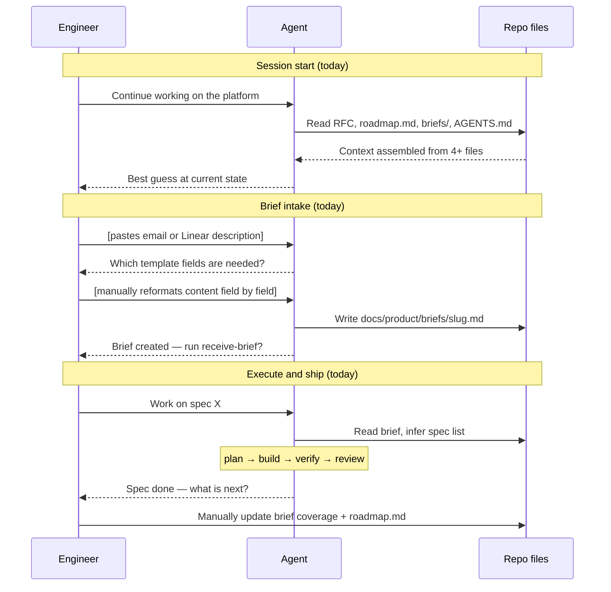
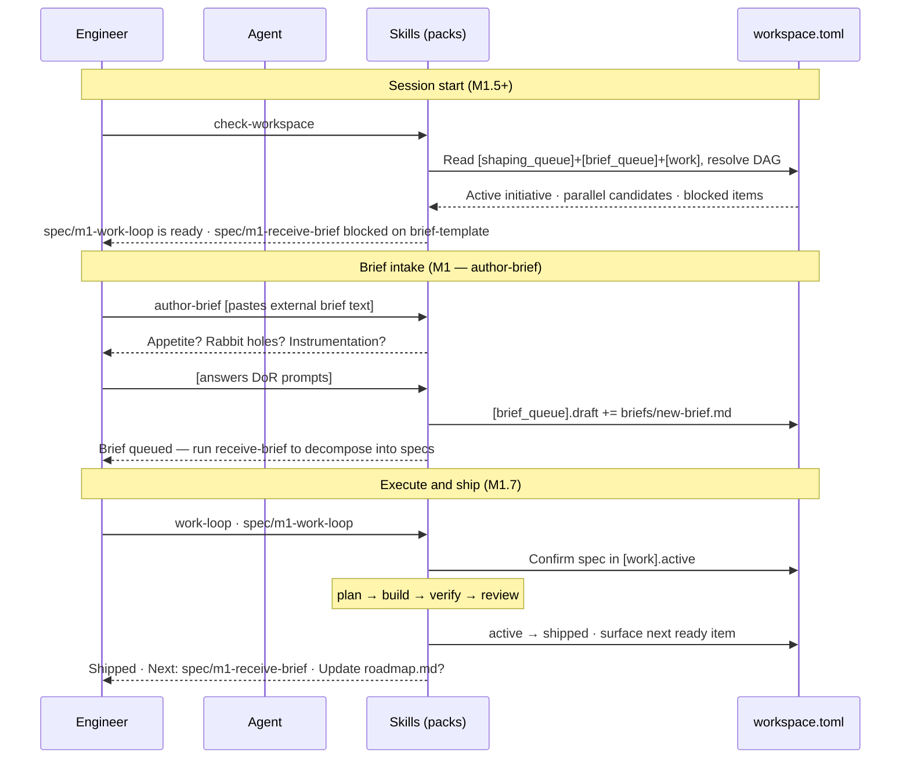

# Journey: Engineer adopts AI-native coordination

**Persona:** A platform-oriented engineering team — internal tooling, multi-component systems, or a developer platform group — that already runs one or two AI agents but has no coordination layer. Sessions expire and context is lost. A second agent knows nothing about the first. The team has no visibility into what is in flight.

**Outcome:** Any agent can cold-start a session, run `check-workspace`, know exactly what to work on, and the team lead only reviews what diverged. Multiple specs execute in parallel without collision. Shaping artifacts survive sessions. The team operates at Step 2 maturity reliably.

**Surface:** cross-platform — CLI/terminal, harness-agnostic.

**Trigger:** The team hits the coordination gap — session context lost, duplicate work, or a colleague joins and has no idea what is in flight.

**End state:** `check-workspace` is the standard session-start command. Briefs flow through the queue from any source. Specs are coordinated via `workspace.toml`. The team lead reviews exceptions, not every action.

---

## Prerequisites

| Pack | Scope | Status | Provides |
|---|---|---|---|
| core | repo | current | `work-loop`, `new-spec`, `receive-brief`, `check-workspace` (M1.5), `author-brief` (M1 Batch 4) |

**One-time setup:**
1. Install core pack at repo scope.
2. After M1 Batch 2 ships: `workspace.toml` is committed to `main` pre-populated with the INI-002 queue — no branch setup needed. Run `check-workspace` to verify.

**Scale:** the full journey (shaping + brief + build) requires all M1 ACs. If the team only needs build-room coordination (Stages 3–5), core pack + `work-loop` alone is sufficient; `workspace.toml` and `check-workspace` add queue visibility.

---

## Interaction model

### Current state — before INI-002 M1

### To-be state — INI-002 M1 shipped

---

## Stage 1: Install & Orient

### Now

| Row | Content |
|-----|---------|
| **Actions** | Discovers the platform. Installs agentbundle. Reads AGENTS.md. Tries to run something and asks "where do I start?" |
| **Emotions** | Curious then disoriented (neutral → negative). Many skills, no obvious first action. |
| **Pains** | "I installed the pack but nothing changed." "I don't understand the vocabulary — Brief vs Spec vs Project." "Skills are documented individually; I can't see how they connect." |
| **Opportunities** | A session-start path that makes the first action obvious. A vocabulary page that maps to the tracker terms the team already uses. |

> **With M1.5** — `check-workspace` ships: first action becomes `check-workspace`; it orients from `workspace.toml` and surfaces the next item without reading any other file.

---

## Stage 2: Shape Work

### Now

| Row | Content |
|-----|---------|
| **Actions** | Uses `frame-intent` and `de-risk-intent` to scope an initiative. Produces framing artifacts in-session. Tries to figure out when shaping is done enough to write a brief. |
| **Emotions** | Engaged but uncertain (neutral). Output lives in session context, not the repo. |
| **Pains** | "My shaping output doesn't survive the session." "I don't know when shaping is done enough to graduate to a brief." "I have no artifact I can hand to someone else." |
| **Opportunities** | Committed shaping artifacts in `docs/product/shaping/` with a visible graduation criterion (Outcome + Appetite + ≥1 Rabbit hole = ready to brief). |

> **With M2** — `frame-situation`, `place-bet`, `map-capabilities` ship: skills write committed artifacts to `docs/product/shaping/`; `[shaping_queue]` items move through the six-step sequence with write-back; graduation criterion: `author-brief` creates the brief from the bet + capability map and writes to `[brief_queue].draft`.

---

## Stage 3: Brief & Queue

### Now

| Row | Content |
|-----|---------|
| **Actions** | Receives a brief externally (email, Linear Issue, verbal). Manually reformats it into the brief template. Runs `receive-brief` to decompose into specs. Tracks which spec is next in their head. |
| **Emotions** | Frustrated (negative). Conversion is manual. DoR criteria are not signposted. Post-decomposition specs are not in any queue. |
| **Pains** | "I have a brief in my inbox but have to manually reformat it." "I don't know which DoR fields are mandatory for Ready." "After decomposition my specs exist but aren't in any queue." "If someone else picks this up in a new session, they won't know where I left off." |
| **Opportunities** | `author-brief` elicits DoR fields interactively and queues the brief. `receive-brief` writes specs into `[work].queue`. Visible DoR checklist on the brief template. |

> **With M1** — `author-brief` + `receive-brief` extension ship: external input → DoR elicitation → brief file → `[brief_queue].draft` in one skill invocation; `receive-brief` moves brief to ready and writes specs into `[work].queue`.

---

## Stage 4: Execute & Ship

### Now

| Row | Content |
|-----|---------|
| **Actions** | Picks up a spec (from memory or re-reading the brief). Runs `work-loop`. Completes the spec. Submits PR. Asks "what is next?" by re-reading. |
| **Emotions** | Satisfied then adrift (positive → neutral). Spec shipped cleanly but post-ship orientation is manual. |
| **Pains** | "After the spec ships I don't know what's next without re-reading the brief." "Brief coverage doesn't update when I ship." "`roadmap.md` needs updating but nothing surfaces that." "No explicit DAG — I decide priority on the fly." |
| **Opportunities** | Post-ship automation: spec marked shipped in `workspace.toml`, next ready item surfaced, `roadmap.md` update prompted. DAG makes priority explicit. |

> **With M1.7** — `work-loop` extension ships: on ship, moves spec `active → shipped` in `workspace.toml`; surfaces next ready item from the DAG; prompts `roadmap.md` update (edit goes through a PR per CONVENTIONS — not auto-written).

---

## Stage 5: Session Continuity

### Now

| Row | Content |
|-----|---------|
| **Actions** | Session ends. New session — next day, a colleague, or a new agent. Reads RFC, roadmap, briefs directory to re-orient. Resumes. |
| **Emotions** | Anxious then uncertain (negative). Re-reading four files takes time and still leaves gaps. |
| **Pains** | "I have to read four files to know where I am — and still feel uncertain." "A blocked item shows up but I don't know which dep is the blocker." "An agent starting fresh has no context about mid-session decisions." |
| **Opportunities** | `check-workspace` as the single cold-start command. Reads `workspace.toml` from the local working directory — consistent on any branch after M1 Batch 2 (file lives on `main`). Rich blocked-reason explanations. |

> **With M1.5** — `check-workspace` ships: one command surfaces active initiative, queued specs, DAG state, blocked reasons. Reads `workspace.toml` from the local working directory (file lives on `main`; always present after M1 Batch 2).

---

## Frontstage actions

- **Skill:** install-agentbundle
- **Skill:** read-agents-md
- **Skill:** run-frame-intent
- **Skill:** run-de-risk-intent
- **Skill:** receive-external-brief
- **Skill:** run-author-brief
- **Skill:** run-receive-brief
- **Skill:** pick-spec-from-queue
- **Skill:** run-work-loop
- **Skill:** submit-pr
- **Skill:** run-check-workspace
- **Skill:** resume-from-session-start

---

## Emotional arc

Lowest point: **Stage 3 (Brief & Queue)** — frustrated — because the gap between an external brief and a queued, system-readable work item is entirely manual. Every field requires translation and the result is not connected to anything the system can orient from.

Highest-opportunity pain: "I have a brief in my inbox but I have to manually reformat it, decompose it, and track it in my head — the system doesn't hold any of it for me."

Primary design response: `author-brief` (M1) closes the creation gap. `receive-brief` extension (M1.8) closes the queue write-back gap. Together they make brief intake a one-skill operation that ends with the queue updated.

---

## Handoff notes

**For `map-screen-flow`:** Stage 3 (Brief & Queue) and Stage 5 (Session Continuity) carry the highest-opportunity pains. The `author-brief` flow (external input → DoR elicitation → queue write) and the `check-workspace` output view are the highest-priority screen-level inputs for any future web surface.

**For `blueprint-service`:** backstage dependencies include `workspace.toml` on `main` (skills edit locally and commit in the same spec PR per the resolved write protocol — RFC-0064 Known Unknowns), `docs/product/briefs/` (brief file store), `docs/product/shaping/` (shaping artifact store), agentbundle skill loader.
