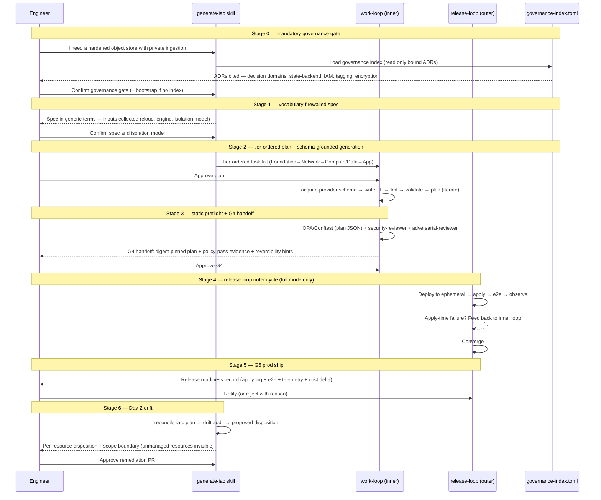

# Journey: Engineer provisions infrastructure with iac-terraform

**Persona:** A software engineer or platform engineer who needs to provision cloud infrastructure for a feature or service. They are comfortable with Terraform concepts but want to avoid re-deriving best practices (layered state, OIDC, policy-as-code, least-privilege IAM) from scratch. They operate inside a repo that has `core` installed and follows the work-loop / release-loop conventions.

**Outcome:** Governed, schema-grounded Terraform is authored, verified with policy-as-code and security review, and shipped through the loop arc (G4 inner handoff → release-loop outer loop → G5 prod ship). Day-2 drift is audited and dispositioned without autonomous apply. The engineer never runs `terraform apply` directly — the loop arc owns it.

**Surface:** cross-platform — CLI/terminal inside the work-loop + release-loop cycle.

**Trigger:** Engineer needs to provision infrastructure — a new service environment, a data store, an ingestion pipeline, a secrets backend — and wants to do it governed and without re-deriving the scaffolding by hand.

**End state:** Terraform merged and applied to prod (G5 ratified). Plan digest and release readiness record in the PR. Day-2 `reconcile-iac` running on schedule. Engineer exits with a governed, auditable infrastructure footprint.

**Related RFC:** [RFC-0065 — the `iac-terraform` pack](../../rfc/0065-iac-terraform-pack.md)

---

## Prerequisites

| Pack | Scope | Provides |
|---|---|---|
| `core` | repo | `work-loop`, `infra-verification`, `operational-safety`, `security-checklists`, reviewers |
| `governance-extras` | repo | `new-adr`, governance-index template |
| `iac-terraform` | repo | `generate-iac`, `reconcile-iac` |

**Optional:** `release-engineering` (repo) — `release-loop` drives the outer deploy/apply/converge cycle (Stage 4). Without it, the generated human-gated pipeline is the apply path (degraded mode).

**One-time setup (first time only):**
1. Install `iac-terraform` at repo scope.
2. Create or confirm `governance-index.toml` at the repo root (if none exists, `generate-iac` offers to bootstrap it).

---

## Interaction model

---

## Stage 0: Governance Gate (mandatory pre-work)

**RFC anchor:** [§2 Hard rules — Stage 0 is mandatory](../../rfc/0065-iac-terraform-pack.md#stage-0-is-mandatory)

`generate-iac` makes Stage 0 mandatory and non-bypassable: before any authoring, the governance index is loaded and the intent is mapped to decision records. If a domain is uncovered, the skill stops and surfaces it. First-time use: if no `governance-index.toml` exists, the skill bootstraps one from existing ADRs and confirms with the human before proceeding.

---

## Stage 1: Specify with Vocabulary Firewall

**RFC anchor:** [§2 Hard rules — Vocabulary firewall at SPECIFY](../../rfc/0065-iac-terraform-pack.md#vocabulary-firewall)

`generate-iac` enforces the vocabulary firewall: spec uses generic terms (`managed database`, `object storage`); cloud-specific service names appear only from PLAN onward. The agent also collects the account/tenant isolation model as an input (shared workspaces vs. separate account per environment) and records the decision, since it drives OIDC trust-policy scoping and the state backend key structure.

---

## Stage 2: Generate Terraform (Inner Authoring Loop)

**RFC anchor:** [§2 — It is a loop, not a straight line](../../rfc/0065-iac-terraform-pack.md#inner-authoring-loop) · [§2 Hard rules — Ground every resource in the live provider schema](../../rfc/0065-iac-terraform-pack.md#ground-every-resource)

`generate-iac` acquires the live provider schema via `core`'s `contract-acquisition` oracle (`terraform providers schema -json`) before emitting any resource block. No resource type, argument, or attribute is guessed. Tasks are tier-ordered (Foundation → Network → Compute/Data → App → Polish) to prevent apply-time dependency failures. `.terraform.lock.hcl` is committed by default. Parallel tasks are marked `[P]` only where resources have no shared dependency.

---

## Stage 3: Static Preflight and G4 Handoff

**RFC anchor:** [§2 — Loop diagram (step 6, plan CLEAN = G4 hand-off)](../../rfc/0065-iac-terraform-pack.md#loop-diagram) · [§2a — Verification modes](../../rfc/0065-iac-terraform-pack.md#verification-modes) · [§7 — Policy companions](../../rfc/0065-iac-terraform-pack.md#policy-companions)

The inner loop runs a full static preflight before G4: OPA/Conftest evaluates the plan JSON (checked resource types, tags, encryption, no hardcoded credentials), `security-reviewer` runs with `security-checklists/config-misconfig` inlined, `adversarial-reviewer` reads the diff cold. Optional: Infracost produces a cost delta. The G4 handoff artifact is explicit: deploy-ready Terraform + pinned plan digest + policy-pass evidence + security review summary + reversibility hints.

**G4 handoff artifacts (explicit):** deploy-ready Terraform directory · pinned plan file (`terraform plan -out=tfplan` + digest) · OPA/Conftest exit-0 log · Trivy/Checkov exit-0 log · reversibility hints on stateful resources · (optional) Infracost cost delta JSON.

---

## Stage 4: Release Loop — Deploy, Apply, Converge

**RFC anchor:** [§1b — Loop integration (outer deploy loop)](../../rfc/0065-iac-terraform-pack.md#loop-integration) · [§2 — Two operating modes](../../rfc/0065-iac-terraform-pack.md#two-operating-modes)

### Degraded mode (no release-loop)

| Row | Content |
|-----|---------|
| **Actions** | Engineer manually triggers the CI pipeline (the generated human-gated pipeline). A human reviewer approves the apply step in GitHub Environments. Apply runs against the target account. Apply-time failures land in the CI log. Engineer reads them and creates follow-on PRs. |
| **Emotions** | Manageable but slow (neutral). Each apply-time failure is a full round-trip. |
| **Pains** | "IAM propagation took 30 seconds — the pipeline timed out and left a partial state." "The dependency ordering was wrong — the subnet referenced the VPC before it was created." "Each apply failure needed a new PR and a new CI run." |
| **Opportunities** | A release-loop outer cycle that iterates autonomously on apply-time failures against ephemeral envs, feeds them back to the inner loop, and converges before surfacing for G5. |

### Full mode (with release-loop)

| Row | Content |
|-----|---------|
| **Actions** | `release-lead` deploys to an ephemeral env, runs `terraform apply` against the pinned plan, reads apply-time failures from the real environment, translates them to inner-loop build tasks, corrects the plan, and redeploys. Iterates until convergence (apply clean, e2e clean, telemetry stable). |
| **Emotions** | Monitored (positive). The engineer is watching the outer loop converge, not debugging CI manually. |
| **Pains** | "Apply-time AWS failures are slow to appear — quota checks take 2+ minutes." "The agent sometimes marks a telemetry anomaly as noise when it isn't." |
| **Opportunities** | Outer-loop convergence criteria that are service-specific (not generic "e2e passed"); anomaly-detection thresholds the engineer can calibrate per service. Post-M1 backlog. |

> **Full mode requires:** `release-engineering` installed + an ephemeral-env harness + the release-loop conformance canary (see RFC-0065 §1b). Without these, degraded mode is the supported path in v1.

---

## Stage 5: G5 — Release Readiness Record and Prod Ship

**RFC anchor:** [§1b — G5 + minimum-regret consent gates](../../rfc/0065-iac-terraform-pack.md#minimum-regret-consent)

| Row | Content |
|-----|---------|
| **Actions** | In degraded mode: Engineer reviews the CI apply log and approves the GitHub Environments protection. In full mode: `release-loop` produces the release readiness record; engineer reads it and ratifies. |
| **Emotions** | Decisive (positive). G5 is the clear prod-ship gate. |
| **Pains** | "The release readiness record doesn't show the actual cost vs. Infracost estimate — I need to check CloudWatch Cost Explorer separately." "Borderline gates aren't grouped — I have to read the full log to find them." |
| **Opportunities** | An IaC-specific RRR template that includes: plan digest, policy-pass evidence, apply log summary, e2e results, telemetry snapshot, actual cost vs. Infracost estimate delta, borderline gates grouped. |

> **IaC-specific release readiness record (what to expect):** plan digest · policy-pass evidence · apply log (created/modified/destroyed count per resource type) · e2e smoke results · telemetry snapshot (key metrics) · cost delta (Infracost estimated vs. actual billed, if available) · borderline gates grouped.

---

## Stage 6: Day-2 — Drift and reconcile-iac

**RFC anchor:** [§2 — Two skills (generate-iac + reconcile-iac)](../../rfc/0065-iac-terraform-pack.md#two-skills) · [§2 Known blind spot: unmanaged resources](../../rfc/0065-iac-terraform-pack.md#unmanaged-resources)

`reconcile-iac` runs on three triggers: (1) **before every follow-on change** (mandatory preflight), (2) **weekly minimum** on a scheduled basis, and (3) **immediately after a known out-of-band event** (break-glass, console action, provider-managed service update). Each run produces a drift audit with per-resource disposition proposals and an explicit scope boundary notice (resources with no state entry are outside the audit). The skill never applies autonomously — every disposition requires human approval.

**reconcile-iac scope boundary (honesty):** `terraform plan` sees only state-tracked resources. Resources created entirely outside Terraform (ClickOps, console actions, auto-provisioned resources) are invisible. The skill documents this limit explicitly in its output rather than implying full drift coverage.

---

## Frontstage actions

- **Skill:** generate-iac (Stage 0–3)
- **Skill:** reconcile-iac (Stage 6)
- **Loop:** work-loop inner loop (Stage 2–3)
- **Loop:** release-loop outer loop (Stage 4–5, full mode only)
- **Gate:** G-governance (Stage 0)
- **Gate:** G-plan (Stage 2 entry)
- **Gate:** G4 (Stage 3 exit)
- **Gate:** G5 (Stage 5 exit)

---

## Emotional arc

Highest point: **Stage 3 (G4 handoff review)** — the engineer sees a complete, policy-verified, digest-pinned artifact and knows exactly what will be applied. The governance record, policy-pass evidence, and reversibility hints together give a level of confidence that manually derived Terraform never does.

Lowest point (without iac-terraform): **Stage 6 (drift discovery)** — drift is found accidentally, with no structured way to disposition it. The engineer is reactive to something that could have been proactive.

Highest-opportunity pain: "I provisioned the infra correctly. But six weeks later there's drift I didn't know about, I can't tell if it's intentional, and the follow-on change might reverse a break-glass fix that someone else made deliberately."

Primary design response: `reconcile-iac` as a first-class skill on a scheduled + event-triggered basis, with a per-resource drift audit that includes cause class and explicit scope boundary. The engineer exits each `reconcile-iac` run knowing exactly what drifted, why, and what the proposed disposition is.

---

## What the iac-terraform pack provides

| Stage | Capability |
|---|---|
| **0 — Governance** | Mandatory governance-index load before any authoring; uncovered decision domains stop the skill |
| **1 — Specify** | Vocabulary firewall; cloud-specific names deferred to PLAN; isolation model recorded |
| **2 — Generate** | Live provider schema acquired before every resource block; tier-ordered tasks; lockfile committed |
| **3 — Preflight** | OPA/Conftest + security reviewer + adversarial reviewer + digest pin |
| **4 — Deploy** | Degraded: generated human-gated pipeline. Full: `release-loop` outer cycle on ephemeral envs |
| **5 — G5** | IaC-specific release readiness record (plan digest, policy-pass evidence, apply log, cost delta) |
| **6 — Drift** | `reconcile-iac` on schedule + preflight + event-triggered; per-resource disposition; explicit scope boundary |

---

## Handoff notes

**For `engineer-runs-work-loop` journey:** `iac-terraform` is IaC-flavored authoring inside `work-loop`. The plan review gate (Stage 3 in that journey) maps to Stages 2–3 here. The work-loop journey's M1.7 workspace integration applies to IaC specs exactly as to application specs.

**For `release` journey:** the release-loop journey covers Stage 4 from the loop's perspective. The iac-terraform journey extends it with IaC-specific inputs (the G4 handoff artifact set, reversibility hints, the IaC-flavored release readiness record fields).

**For future INI:** if `iac-terraform` becomes part of a platform-engineering initiative, this journey maps to its build-room stages. The shaping room journeys (product-engineer-shapes-initiative) are upstream prerequisites — the infrastructure intent flows from a brief into this journey's Stage 0.
