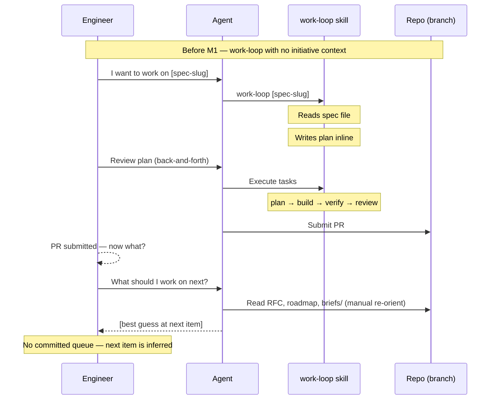

# Journey: Engineer runs the work-loop

**Persona:** A software engineer who uses the `work-loop` skill day-to-day to implement specs. They may or may not be on the RFC path — this journey covers anyone running the core build cycle: plan → build → verify → review. In smaller orgs this is the same person as the product engineer; in larger orgs it is a distinct implementer role. They are always in the loop — reviewing plans, handling gate failures, making judgment calls — unlike the agent-executes-spec journey where execution is headless.

**Outcome:** The spec is shipped. A PR is submitted and passing gates. The spec is marked done. The engineer knows exactly what to pick up next.

**Surface:** cross-platform — CLI/terminal. The engineer invokes skills; the agent handles the structured work under the engineer's direction.

**Trigger:** Engineer wants to pick up a unit of work — from a GitHub issue, a Linear ticket, a brief, a team discussion, or from `check-workspace` surfacing the next ready spec.

**End state:** Spec in `[work].shipped` (or equivalent for non-initiative work). PR submitted and passing. Next item surfaced. Engineer exits with a clear picture of what comes next.

---

## Prerequisites

| Pack | Scope | Status | Provides |
|---|---|---|---|
| core | repo | current | `work-loop`, `new-spec`, `check-workspace` (M1.5+) |

**One-time setup:**
1. Install core pack at repo scope.
2. For initiative work (M1.5+): `workspace.toml` must be committed to `main` (M1 Batch 2); no branch configuration needed — `check-workspace` reads it from the local working directory.

**Scale:** this journey is the same at all team sizes. At scale, `check-workspace` surfaces parallel candidates so multiple engineers can pick different specs without collision — no additional packs needed.

---

## Interaction model

### Current state — before M1.5 / M1.7

### To-be state — M1.7 shipped (initiative work)

---

## Stage 1: Orient — What Should I Work On?

### Now

| Row | Content |
|-----|---------|
| **Actions** | Decides what to work on from memory, a Linear ticket, a GitHub issue, or a message from a teammate. May read the RFC or roadmap to orient. Knows roughly what's next but has no structured queue. |
| **Emotions** | Confident but contextually thin (neutral). The engineer knows what they need to do but their orientation is brittle — it depends on memory of the last session and on no one else having claimed the same spec. |
| **Pains** | "I have to remember where I left off." "I don't know if someone else has started the spec I want." "The roadmap and RFC aren't structured enough to answer 'what's next in priority order with no dependencies blocked'." "If I've been away for a few days, re-orientation takes 10 minutes of reading." |
| **Opportunities** | `check-workspace` as a single command that surfaces the active initiative, ready specs in DAG order, blocked reasons, and parallel candidates — and that answers "is this spec already claimed?" |

> **With M1.5** — `check-workspace` ships: orientation in one command; DAG-resolved queue shows ready vs. blocked; parallel candidates visible for swarm dispatch.

---

## Stage 2: Start the Work-Loop

### Now

| Row | Content |
|-----|---------|
| **Actions** | Runs `work-loop [spec-slug]`. The skill reads the spec file and produces a plan. The engineer is already in the right context — they just typed it. |
| **Emotions** | Immediately productive (positive). The work-loop is already the right tool. |
| **Pains** | "work-loop doesn't know which initiative or milestone this spec belongs to." "The plan doesn't include workspace context — it just reads the spec file in isolation." "If the spec has dependencies I don't know about, work-loop doesn't surface them." |
| **Opportunities** | `work-loop` at step 0 reads `workspace.toml` to load initiative context — the plan is now contextualised against the milestone, other active specs, and DAG constraints. |

> **With M1.7** — `work-loop` reads `workspace.toml` at step 0; plan is contextualised against initiative milestone and DAG state; dependency violations surfaced before build begins.

---

## Stage 3: Plan Review

### Now (unchanged — work-loop already handles this as a human gate)

| Row | Content |
|-----|---------|
| **Actions** | Reads the proposed plan. Pushes back on tasks that are out of scope, too large, or sequenced wrong. Approves the plan and signals build start. |
| **Emotions** | Engaged (positive). The plan gate is already a strong interaction point — the engineer is visibly in control of what the agent builds. |
| **Pains** | "Some plan tasks reference functions or APIs that don't exist — the agent assumed they were there." "The plan sometimes decomposes the spec more finely than I want, leading to unnecessary back-and-forth." "No structured way to approve a partial plan (approve tasks 1–3, defer task 4 to a follow-on)." |
| **Opportunities** | API verification at plan time (grep before proposing a task that imports a function); partial-plan approval; task-level deferral notation. These are work-loop improvements, not M1 scope — they go to the post-M1 work-loop backlog. |

---

## Stage 4: Build and Gate Navigation

### Now (unchanged — work-loop already handles build; human handles gate failures)

| Row | Content |
|-----|---------|
| **Actions** | Monitors build progress. Intervenes on gate failures — reads the error, identifies the cause, provides the corrective direction. For complex failures, takes over temporarily and hands back. |
| **Emotions** | Actively engaged on gate failures (positive when they catch something real; frustrated when failures are environment-specific noise). |
| **Pains** | "Gate failures are often false positives — flaky tests, CI environment differences, test-order sensitivity." "The agent retries the same approach on a failing gate before trying something new." "Traceability lint error messages don't point to the specific missing marker — I have to grep for it myself." |
| **Opportunities** | Gate failure diagnostics that distinguish between real failures (broken code) and environment noise (flaky test, missing dep, wrong branch). Traceability lint errors that name the missing marker and the file line. These are post-M1 backlog items. |

---

## Stage 5: Ship and Hand Off

### Now

| Row | Content |
|-----|---------|
| **Actions** | Reviews the final diff before PR submission. Approves PR creation. Realises workspace.toml has not been updated — does it manually, or skips it because it's not yet wired. |
| **Emotions** | Relieved but incomplete (positive → neutral). The spec is shipped but the queue doesn't reflect it. The engineer has to remember to update things. |
| **Pains** | "The PR is submitted but nothing tells the next person (or agent) this spec is done." "`workspace.toml` isn't updated — I have to do it manually if I remember." "No prompt to update `roadmap.md` — I always forget, and it drifts." "I don't know what to pick up next without re-reading the RFC." |
| **Opportunities** | Post-ship automation: work-loop marks spec active → shipped in `workspace.toml`; surfaces next ready item; prompts `roadmap.md` update. The engineer ends the session knowing exactly what comes next. |

> **With M1.7** — work-loop moves spec to shipped on PR creation; next ready item surfaced; `roadmap.md` update prompted. Engineer exits with committed state visible to the next person or agent.

---

## Stage 6: Non-Initiative Work (no workspace.toml)

### Now and to-be (this path unchanged)

| Row | Content |
|-----|---------|
| **Actions** | Engineer has a task that's not part of an initiative — a one-off bug fix, a quick feature, a housekeeping task. Runs `work-loop [description]` directly. No `workspace.toml` involved. |
| **Emotions** | Comfortable (positive). This path is already clean — work-loop is designed to handle it. |
| **Pains** | "Nothing changes here. work-loop works fine for non-initiative work. The only missing piece is knowing whether a task should be in the queue versus an ad-hoc invocation — and check-workspace can help surface that distinction." |
| **Opportunities** | `check-workspace` surfacing whether the task overlaps with a queued spec (preventing duplicate work); non-initiative tasks as a first-class concept (ad-hoc vs. queued). Post-M1 design question. |

---

## Frontstage actions

- **Skill:** run-check-workspace
- **Skill:** run-work-loop
- **Skill:** review-plan
- **Skill:** approve-plan
- **Skill:** handle-gate-failure
- **Skill:** review-final-diff
- **Skill:** approve-pr-submission
- **Skill:** check-workspace-exit-state

---

## Emotional arc

Highest point: **Stage 3 (Plan Review)** — engaged — the engineer is visibly in control and the agent is doing the structured work under their direction. This gate is already working well.

Lowest point: **Stage 5 (Ship and Hand Off)** — incomplete — the spec is done but the system doesn't reflect it. The engineer has to manually update state, and they often don't. This is the friction that breaks coordination across sessions and across engineers.

Highest-opportunity pain: "I shipped the spec. But the next person who opens the repo doesn't know that. The roadmap doesn't know. The queue doesn't know. I have to remember to tell everything, and I usually don't."

Primary design response: M1.7 post-ship automation — work-loop marks shipped, surfaces next, prompts roadmap update. The engineer's last action becomes the system's source of truth automatically.

---

## How this journey changes with M1

The core `work-loop` experience — plan gate, build, gate navigation, PR — is **unchanged**. M1 adds two integration points that change the start and end of the session:

| Session point | Before M1 | After M1.7 |
|---|---|---|
| **Start — orient** | Read RFC, roadmap, briefs manually (10+ min) | `check-workspace` → oriented in one command |
| **Start — work-loop step 0** | Reads spec file in isolation | Reads spec file + workspace.toml initiative context |
| **End — mark shipped** | Manual (often skipped) | Automatic on PR creation |
| **End — what's next** | Inferred from memory or re-reading | Surfaced by work-loop post-ship |

Everything in between (Stage 3 plan review, Stage 4 build and gate navigation) is unaffected.

---

## Handoff notes

**For `agent-executes-spec` journey:** that journey covers the same stages from the agent's perspective — no human in the loop. The failure modes are different (the agent can't make judgment calls on gate failures; the human can), but the infrastructure changes (M1.5, M1.7) are identical. The two journeys share the same before/after at Stages 1, 2, and 5; they diverge at Stages 3 and 4.

**For INI-003:** headless dispatch (agent-executes-spec) is a specialised variant of this journey with the human loop removed and an adapter layer added between Orient and work-loop. The core work-loop stages (3, 4) are identical.
