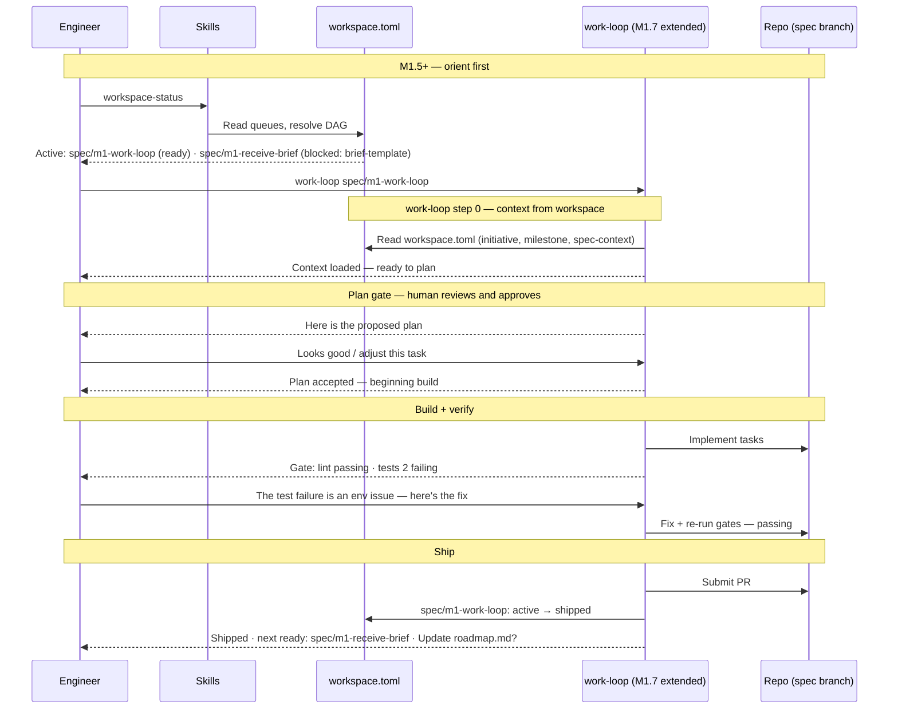

# Journey: Engineer runs the work-loop

**Use it when:** you're picking up a unit of work — a spec, ticket, issue, or the next ready item from `workspace-status`.
**You provide:** the spec or task to implement, and your judgment at the plan and gate-failure moments.
**You receive:** a shipped spec, a PR passing its gates, and the next ready item surfaced.
**Your decisions:** approve the plan; handle gate failures; approve PR submission.

**Persona:** A software engineer who uses the `work-loop` skill day-to-day to implement specs. They may or may not be on the RFC path — this journey covers anyone running the core build cycle: plan → build → verify → review. In smaller orgs this is the same person as the product engineer; in larger orgs it is a distinct implementer role. They are always in the loop — reviewing plans, handling gate failures, making judgment calls — unlike the agent-executes-spec journey where execution is headless.

**Outcome:** The spec is shipped. A PR is submitted and passing gates. The spec is marked done. The engineer knows exactly what to pick up next.

**Surface:** cross-platform — CLI/terminal. The engineer invokes skills; the agent handles the structured work under the engineer's direction.

**Trigger:** Engineer wants to pick up a unit of work — from a GitHub issue, a Linear ticket, a brief, a team discussion, or from `workspace-status` surfacing the next ready spec.

**End state:** Spec in `[work].shipped` (or equivalent for non-initiative work). PR submitted and passing. Next item surfaced. Engineer exits with a clear picture of what comes next.

---

## Prerequisites

| Pack | Scope | Status | Provides |
|---|---|---|---|
| core | repo | current | `work-loop`, `new-spec`, `workspace-status` (M1.5+) |

**One-time setup:**
1. Install core pack at repo scope.
2. For initiative work (M1.5+): `workspace.toml` must be committed to `main` (M1 Batch 2); no branch configuration needed — `workspace-status` reads it from the local working directory.

**Scale:** this journey is the same at all team sizes. At scale, `workspace-status` surfaces parallel candidates so multiple engineers can pick different specs without collision — no additional packs needed.

---

## Two approaches

`work-loop` supports two usage patterns that differ in how the engineer orients and what state is updated on ship:

| | Initiative path | Ad-hoc path |
|---|---|---|
| **Orient** | `workspace-status` — DAG-resolved queue, parallel candidates, blocked reasons | Memory, ticket, issue, or team message |
| **Step 0** | `work-loop` reads `workspace.toml` for initiative context, milestone, DAG constraints | `work-loop` reads spec file in isolation |
| **Ship** | Spec marked `active → shipped` in `workspace.toml`; next item surfaced; `roadmap.md` prompt | PR submitted; no queue state updated |
| **When to use** | Coordinated initiative work; multiple engineers or agents on same queue | One-off tasks — bug fixes, quick features, housekeeping |

Both paths share the same plan → build → verify → review loop (Stages 3–4). The paths diverge at Orient, Start, and Ship.

## Interaction model — initiative path

---

## Stage 1: Orient — What Should I Work On?

### Initiative path

| Row | Content |
|-----|---------|
| **Actions** | Runs `workspace-status`. DAG-resolved queue surfaces the active initiative, ready specs in priority order, blocked items with reasons, and parallel candidates. Answers "is this spec already claimed?" |
| **Emotions** | Oriented immediately (positive). One command, committed state. |
| **Remaining pains** | "I see a parallel candidate but if another engineer also runs workspace-status at the same time, we might both pick it up." Atomic claiming is an INI-003 design concern. |

### Ad-hoc path

| Row | Content |
|-----|---------|
| **Actions** | Decides what to work on from memory, a Linear ticket, a GitHub issue, or a message from a teammate. |
| **Emotions** | Comfortable (neutral). For a well-defined one-off task, memory and tickets are sufficient. |

---

## Stage 2: Start the Work-Loop

### Initiative path

| Row | Content |
|-----|---------|
| **Actions** | Runs `work-loop [spec-slug]`. At step 0, `work-loop` reads `workspace.toml` — loads initiative context, milestone, and DAG constraints. Plan is contextualised; dependency violations surfaced before build begins. |
| **Emotions** | Immediately productive (positive). The plan knows what this spec is part of. |

### Ad-hoc path

| Row | Content |
|-----|---------|
| **Actions** | Runs `work-loop [description]` or `work-loop [spec-slug]`. The skill reads the spec file in isolation. No initiative context loaded. |
| **Emotions** | Immediately productive (positive). For a one-off task, isolation is fine. |

---

## Stage 3: Plan Review

### Both paths (human gate — unchanged)

| Row | Content |
|-----|---------|
| **Actions** | Reads the proposed plan. Pushes back on tasks that are out of scope, too large, or sequenced wrong. Approves the plan and signals build start. |
| **Emotions** | Engaged (positive). The plan gate is already a strong interaction point — the engineer is visibly in control of what the agent builds. |
| **Pains** | "Some plan tasks reference functions or APIs that don't exist — the agent assumed they were there." "The plan sometimes decomposes the spec more finely than I want, leading to unnecessary back-and-forth." "No structured way to approve a partial plan (approve tasks 1–3, defer task 4 to a follow-on)." |
| **Opportunities** | API verification at plan time (grep before proposing a task that imports a function); partial-plan approval; task-level deferral notation. These are work-loop improvements, not M1 scope — they go to the post-M1 work-loop backlog. |

---

## Stage 4: Build and Gate Navigation

### Both paths (human handles gate failures — unchanged)

| Row | Content |
|-----|---------|
| **Actions** | Monitors build progress. Intervenes on gate failures — reads the error, identifies the cause, provides the corrective direction. For complex failures, takes over temporarily and hands back. |
| **Emotions** | Actively engaged on gate failures (positive when they catch something real; frustrated when failures are environment-specific noise). |
| **Pains** | "Gate failures are often false positives — flaky tests, CI environment differences, test-order sensitivity." "The agent retries the same approach on a failing gate before trying something new." "Traceability lint error messages don't point to the specific missing marker — I have to grep for it myself." |
| **Opportunities** | Gate failure diagnostics that distinguish between real failures (broken code) and environment noise (flaky test, missing dep, wrong branch). Traceability lint errors that name the missing marker and the file line. These are post-M1 backlog items. |

---

## Stage 5: Ship and Hand Off

### Initiative path

| Row | Content |
|-----|---------|
| **Actions** | Reviews the final diff. Approves PR creation. `work-loop` moves spec `active → shipped` in `workspace.toml`; surfaces the next ready item; prompts `roadmap.md` update. |
| **Emotions** | Complete (positive). The spec is shipped and the queue reflects it. The next person or agent can orient in one `workspace-status` call. |

### Ad-hoc path

| Row | Content |
|-----|---------|
| **Actions** | Reviews the final diff. Approves PR creation. No queue state is updated. |
| **Emotions** | Relieved (positive). The task is done; there is no queue to update. |

---

---

## Frontstage actions

- **Skill:** run-workspace-status
- **Skill:** run-work-loop
- **Skill:** review-plan
- **Skill:** approve-plan
- **Skill:** handle-gate-failure
- **Skill:** review-final-diff
- **Skill:** approve-pr-submission
- **Skill:** workspace-status-exit-state

---

## Emotional arc

Highest point: **Stage 3 (Plan Review)** — engaged — the engineer is visibly in control and the agent is doing the structured work under their direction.

**Initiative path:** Stage 5 (Ship and Hand Off) is now complete — spec ships, queue updates, next item surfaces. The engineer ends the session with committed state visible to whoever comes next.

**Ad-hoc path:** Stage 5 is lighter — PR submitted, done. No queue to update. The tradeoff is that the next session has no committed record of what shipped.

---

## Choosing between paths

Use the initiative path any time a spec lives in `[work].queue` — the coordination overhead is near-zero and the post-ship write-back makes the next session (by you, a colleague, or an agent) free. Use the ad-hoc path for tasks that are genuinely standalone — one-off fixes, experiments, housekeeping that would never appear in a brief.

If you're unsure, run `workspace-status` first. If the task overlaps a queued spec, use the initiative path. If it's not in the queue and wouldn't belong there, go ad-hoc.

---

## Handoff notes

**For `agent-executes-spec` journey:** that journey covers the same stages from the agent's perspective — no human in the loop. The failure modes are different (the agent can't make judgment calls on gate failures; the human can), but the infrastructure changes (M1.5, M1.7) are identical. The two journeys share the same before/after at Stages 1, 2, and 5; they diverge at Stages 3 and 4.

**For INI-003:** headless dispatch (agent-executes-spec) is a specialised variant of this journey with the human loop removed and an adapter layer added between Orient and work-loop. The core work-loop stages (3, 4) are identical.
