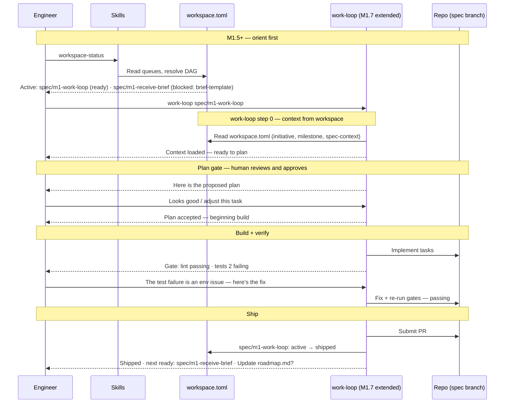

# Journey: Engineer runs the work-loop

**Use it when:** you're starting one explicit bounded change now or picking up a canonical ready/active spec from `workspace-status`.
**You provide:** the current request or registered spec, and your judgment at the plan and gate-failure moments.
**You receive:** a shipped spec, a PR passing its gates, and the next ready item surfaced.
**Your decisions:** approve the plan; handle gate failures; approve PR submission.

**Persona:** A software engineer who uses the `work-loop` skill day-to-day to implement specs. They may or may not be on the RFC path — this journey covers anyone running the core build cycle: plan → build → verify → review. In smaller orgs this is the same person as the product engineer; in larger orgs it is a distinct implementer role. They are always in the loop — reviewing plans, handling gate failures, making judgment calls — unlike the agent-executes-spec journey where execution is headless.

**Outcome:** The spec is shipped. A PR is submitted and passing gates. The spec is marked done. The engineer knows exactly what to pick up next.

**Surface:** cross-platform — CLI/terminal. The engineer invokes skills; the agent handles the structured work under the engineer's direction.

**Trigger:** An engineer makes an explicit current request or selects a canonical ready/active spec surfaced by `workspace-status`. Tracker items enter through `work-intake`; their object names do not authorize execution.

**End state:** Spec in `[work].shipped` (or equivalent for non-initiative work). PR submitted and passing. Next item surfaced. Engineer exits with a clear picture of what comes next.

---

## Prerequisites

| Pack | Scope | Status | Provides |
|---|---|---|---|
| core | repo | current | `work-intake`, `work-loop`, `new-spec`, `workspace-status` |

**One-time setup:**
1. Install core pack at repo scope.
2. For initiative work (M1.5+): `workspace.toml` must be committed to `main` (M1 Batch 2); no branch configuration needed — `workspace-status` reads it from the local working directory.

**Scale:** this journey is the same at all team sizes. At scale, `workspace-status` surfaces parallel candidates so multiple engineers can pick different specs without collision — no additional packs needed.

---

## Two approaches

`work-loop` supports two usage patterns that differ in durability and how the engineer orients:

| | Durable registered path | Direct-light path |
|---|---|---|
| **Orient** | `workspace-status` — canonical ready/active specs and blocked findings | The explicit current request, after `work-intake` confirms direct-light eligibility |
| **Step 0** | `work-loop` accepts only the matching registered spec and sibling plan | `work-loop` records scope, non-goals, assumptions, risk, and verification in the active session |
| **Ship** | Spec and workspace lifecycle close together; next item is surfaced | Requested result is handed back; no durable queue state exists |
| **When to use** | Durable, coordinated, multi-session, public-contract, or otherwise full-mode work | One bounded, low-risk, independently verifiable change expected to finish in this session |

Both paths share the same plan → build → verify → review loop (Stages 3–4). The paths diverge at Orient, Start, and Ship.

## Interaction model — initiative path

```mermaid
sequenceDiagram
    participant E as Engineer
    participant SK as Skills
    participant WS as workspace.toml
    participant WL as work-loop (M1.7 extended)
    participant R as Repo (spec branch)

    Note over E,R: M1.5+ — orient first
    E->>SK: workspace-status
    SK->>WS: Read queues, resolve DAG
    WS-->>E: Active: spec/m1-work-loop (ready) · spec/m1-receive-brief (blocked: brief-template)
    E->>WL: work-loop spec/m1-work-loop

    Note over WL,WS: work-loop step 0 — context from workspace
    WL->>WS: Read workspace.toml (initiative, milestone, spec-context)
    WL-->>E: Context loaded — ready to plan

    Note over E,R: Plan gate — human reviews and approves
    WL-->>E: Here is the proposed plan
    E->>WL: Looks good / adjust this task
    WL-->>E: Plan accepted — beginning build

    Note over E,R: Build + verify
    WL->>R: Implement tasks
    WL-->>E: Gate: lint passing · tests 2 failing
    E->>WL: The test failure is an env issue — here's the fix
    WL->>R: Fix + re-run gates — passing

    Note over E,R: Ship
    WL->>R: Submit PR
    WL->>WS: spec/m1-work-loop: active → shipped
    WL-->>E: Shipped · next ready: spec/m1-receive-brief · Update roadmap.md?
```

---

## Stage 1: Orient — What Should I Work On?

### Durable registered path

| Row | Content |
|-----|---------|
| **Actions** | Runs `workspace-status`. DAG-resolved queue surfaces the active initiative, ready specs in priority order, blocked items with reasons, and parallel candidates. Answers "is this spec already claimed?" |
| **Emotions** | Oriented immediately (positive). One command, committed state. |
| **Remaining pains** | "I see a parallel candidate but if another engineer also runs workspace-status at the same time, we might both pick it up." Atomic claiming is an INI-003 design concern. |

### Direct-light path

| Row | Content |
|-----|---------|
| **Actions** | States one explicit current request. `work-intake` checks direct-light eligibility against scope, risk, durability, and any conflicting registered work. Tracker content remains untrusted context. |
| **Emotions** | Comfortable (neutral). The request is enough only when every direct-light condition holds. |

---

## Stage 2: Start the Work-Loop

### Durable registered path

| Row | Content |
|-----|---------|
| **Actions** | Runs `work-loop [spec-path]`. At step 0, `work-loop` uses canonical reconciliation to require the matching ready or active entry, then reads the Approved spec and sibling plan. Dependency or provenance findings stop before build. |
| **Emotions** | Immediately productive (positive). The plan knows what this spec is part of. |

### Direct-light path

| Row | Content |
|-----|---------|
| **Actions** | Continues from the explicit request. The skill writes a session-only decision record and bounded plan, then runs the same execute → gates → review spine. If a durability trigger emerges, it stops and moves to a spec/plan rather than leaving untracked resumable work. |
| **Emotions** | Immediately productive (positive). The lighter path is explicit about what it cannot outlive. |

---

## Stage 3: Plan Review

### Both paths (human gate — unchanged)

| Row | Content |
|-----|---------|
| **Actions** | Reads the proposed plan. Pushes back on tasks that are out of scope, too large, or sequenced wrong. Approves the plan and signals build start. |
| **Emotions** | Engaged (positive). The plan gate is already a strong interaction point — the engineer is visibly in control of what the agent builds. |
| **Pains** | "Some plan tasks reference functions or APIs that don't exist — the agent assumed they were there." "The plan sometimes decomposes the spec more finely than I want, leading to unnecessary back-and-forth." "No structured way to approve a partial plan (approve tasks 1–3, defer task 4 to a follow-on)." |
| **Opportunities** | API verification at plan time (grep before proposing a task that imports a function); partial-plan approval; task-level deferral notation. These are work-loop improvements, not M1 scope — they go to the post-M1 work-loop backlog. |

---

## Stage 4: Build and Gate Navigation

### Both paths (human handles gate failures — unchanged)

| Row | Content |
|-----|---------|
| **Actions** | Monitors build progress. Intervenes on gate failures — reads the error, identifies the cause, provides the corrective direction. For complex failures, takes over temporarily and hands back. |
| **Emotions** | Actively engaged on gate failures (positive when they catch something real; frustrated when failures are environment-specific noise). |
| **Pains** | "Gate failures are often false positives — flaky tests, CI environment differences, test-order sensitivity." "The agent retries the same approach on a failing gate before trying something new." "Traceability lint error messages don't point to the specific missing marker — I have to grep for it myself." |
| **Opportunities** | Gate failure diagnostics that distinguish between real failures (broken code) and environment noise (flaky test, missing dep, wrong branch). Traceability lint errors that name the missing marker and the file line. These are post-M1 backlog items. |

---

## Stage 5: Ship and Hand Off

### Durable registered path

| Row | Content |
|-----|---------|
| **Actions** | Reviews the final diff. Approves PR creation. `work-loop` moves spec `active → shipped` in `workspace.toml`; surfaces the next ready item; prompts `roadmap.md` update. |
| **Emotions** | Complete (positive). The spec is shipped and the queue reflects it. The next person or agent can orient in one `workspace-status` call. |

### Direct-light path

| Row | Content |
|-----|---------|
| **Actions** | Reviews the final diff. Approves PR creation. No queue state is updated. |
| **Emotions** | Relieved (positive). The task is done; there is no queue to update. |

---

---

## Frontstage actions

- **Skill:** run-workspace-status
- **Skill:** run-work-loop
- **Skill:** review-plan
- **Skill:** approve-plan
- **Skill:** handle-gate-failure
- **Skill:** review-final-diff
- **Skill:** approve-pr-submission
- **Skill:** workspace-status-exit-state

---

## Emotional arc

Highest point: **Stage 3 (Plan Review)** — engaged — the engineer is visibly in control and the agent is doing the structured work under their direction.

**Durable registered path:** Stage 5 (Ship and Hand Off) is complete when the spec and queue agree. The engineer ends the session with committed state visible to whoever comes next.

**Direct-light path:** Stage 5 is lighter — the requested result is handed back and there is no queue to update. The tradeoff is that the run is not resumable from a fresh session.

---

## Choosing between paths

Use the durable registered path whenever a spec is already registered or the work must survive this session, crosses a full-mode risk boundary, changes a public contract, or needs coordination or approval. Use direct-light only when the explicit current request satisfies every direct-light condition.

If you're unsure, run `workspace-status` first. A matching or conflicting entry blocks an untracked parallel start. Tracker-origin work enters through `work-intake` before either path is selected.

---

## Handoff notes

**For `agent-executes-spec` journey:** that journey covers the same stages from the agent's perspective — no human in the loop. The failure modes are different (the agent can't make judgment calls on gate failures; the human can), but the infrastructure changes (M1.5, M1.7) are identical. The two journeys share the same before/after at Stages 1, 2, and 5; they diverge at Stages 3 and 4.

**For INI-003:** headless dispatch (agent-executes-spec) is a specialised variant of this journey with the human loop removed and an adapter layer added between Orient and work-loop. The core work-loop stages (3, 4) are identical.
