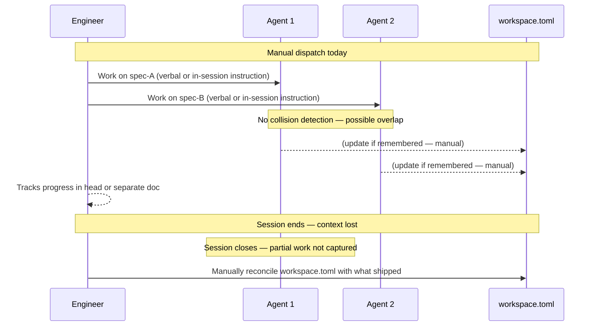
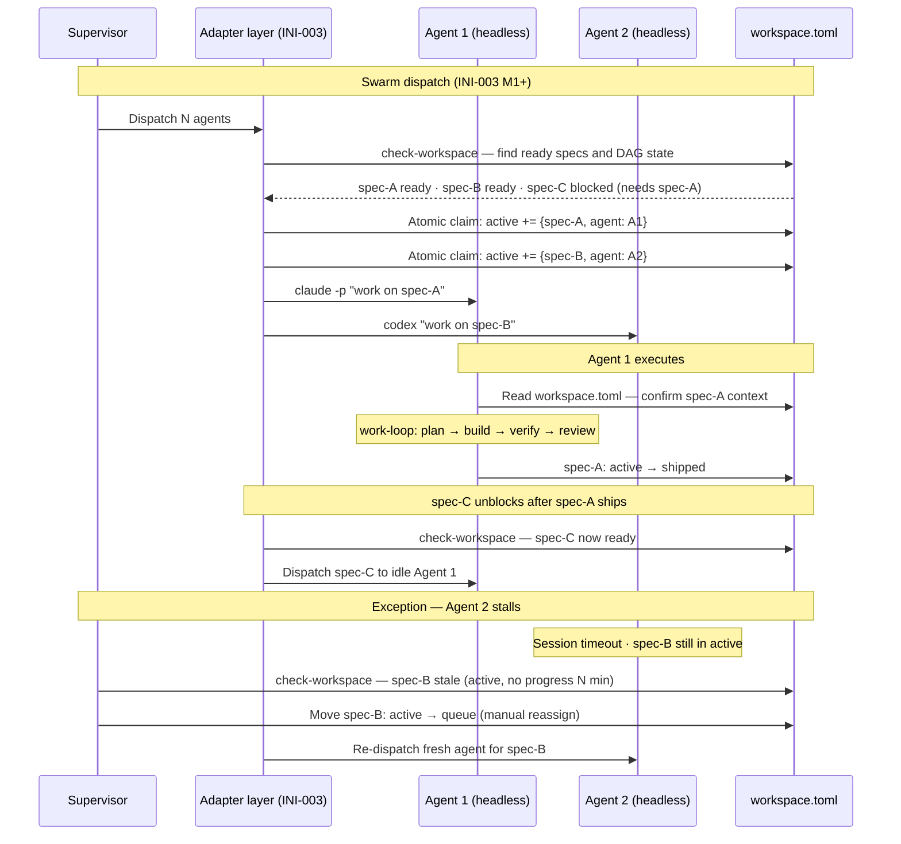

# Journey: Engineer scales to coordinated agent swarm

**Persona:** An engineering team that has INI-002 M1 installed — `workspace.toml` is their session-start artifact, briefs flow through the queue, work-loop is their execution pattern. They want to scale from 1–2 manually dispatched agent sessions to N headless CLI agents running in CI/CD, each claiming specs from the queue and executing without collision.

**Outcome:** A CI/CD job dispatches N headless CLI agents. Each reads `workspace.toml`, claims an unblocked spec, executes via work-loop, marks it shipped, and exits. The team lead monitors via `check-workspace` and only intervenes when a spec stalls or fails. Throughput scales with agents, not with engineers watching.

**Surface:** cross-platform — CI/CD pipelines and CLI invocation across multiple harnesses (Claude Code `-p`, Codex CLI, Kiro CLI, GitHub Copilot CLI, Gemini CLI).

**Trigger:** INI-002 M1 ships — `workspace.toml` schema is the stable contract. The team has more ready specs than engineers to manually dispatch.

**End state:** The queue drains autonomously. Blocked specs stay blocked. Stalled specs surface to the team lead within a threshold. The team's time shifts from dispatch and monitoring to brief authoring and exception review.

---

## Prerequisites

| Pack | Scope | Status | Provides |
|---|---|---|---|
| core | repo | current | `check-workspace`, `work-loop`, `new-spec` |
| coding CLI adapter pack | user | planned (INI-003) | Harness-specific invocation, atomic claiming, write-back; one adapter per harness type (Claude Code, Codex CLI, Kiro, etc.) |

**One-time setup:**
1. Install core pack at repo scope.
2. Install the adapter pack for each harness in the swarm at user scope (when INI-003 ships). Mixed-harness swarms need one adapter per harness type — adapters come in different shapes.
3. `workspace.toml` must be committed to `main` and pre-populated (M1 Batch 2); no branch configuration needed — headless agents read it from the local working directory.
4. Atomic claiming protocol configured via adapter — prevents two agents picking the same spec; exact mechanism is adapter-specific and is an open design question for the INI-003 sub-RFC.

**Scale:** adapters are the scaling surface. A Claude Code swarm uses one adapter shape; a Codex CLI swarm uses another; a mixed swarm needs both. Core skills (`work-loop`, `check-workspace`) are identical across adapter shapes.

---

## Interaction model

### Current state — INI-002 M1, no swarm adapter

### To-be state — INI-003 M1 shipped

---

## Stage 1: Adapter Setup

### Now (INI-002 M1, no adapter)

| Row | Content |
|-----|---------|
| **Actions** | Wants to run headless agents but has no adapter. Each agent is dispatched manually with a bespoke prompt. Skill loading must be verified per harness by trial and error. |
| **Emotions** | Determined but frustrated (neutral → negative). Each harness is its own setup problem. |
| **Pains** | "Skill discovery path differs by harness — `.claude/` for Claude Code, `.kiro/` for Kiro, different for Codex. I verify each separately." "MCP-capable harnesses need registered tool definitions; others need static `.md` files. I don't know which without reading adapter source." "No dry-run mode — I can only verify adapter wiring by running a real job." |
| **Opportunities** | An adapter capability matrix: one row per harness, columns for skill-discovery path, tool surface (MCP vs static), context window, known quirks. A dry-run mode that verifies skill loading and workspace resolution without executing any spec work. |

> **With INI-003 M1** — adapter pack ships: capability matrix is a first-class deliverable; dry-run mode validates harness wiring before first live dispatch.

---

## Stage 2: First Dispatch

### Now

| Row | Content |
|-----|---------|
| **Actions** | Manually triggers N agent sessions. Each told verbally which spec to work on. No coordination layer. |
| **Emotions** | Anxious (negative). No way to know if two agents claim the same spec until one comes back with a conflict or duplicate work. |
| **Pains** | "Two agents might both pick up the same spec — nothing prevents it." "I don't know which spec each agent claimed until I read their output." "Agents need repo read credentials in CI — credential management is undefined." "If the queue has one ready spec and three agents, two agents need to exit cleanly — currently undefined." |
| **Opportunities** | Atomic spec-claiming protocol: claim = move spec from `queue` to `active` with agent identity tag in one commit; second agent reads the updated file and sees it is taken. Clear credential contract for CI reads of `workspace.toml` on `main`. Agent idle-and-exit behaviour when no ready spec is available. |

> **With INI-003 M1** — atomic claim protocol defined in adapter contract; agent identity written to `[work].active` entries; CI credential requirements documented; idle-and-exit behaviour specified.

---

## Stage 3: Parallel Execution

### Now

| Row | Content |
|-----|---------|
| **Actions** | Agents execute in parallel. Each does its work, submits PR. Updates to `workspace.toml` happen if the engineer remembers after the session. |
| **Emotions** | Satisfied at throughput (positive) but uncertain about coordination (neutral). |
| **Pains** | "The queue shrinks but I can't tell which agent shipped which spec." "DAG is display-only — an agent could pick a blocked spec." "If an agent times out mid-spec, the spec stays in `active` with no stale detection." "Gate outcomes are in each agent's logs, not in `workspace.toml`." |
| **Opportunities** | Agent identity on `[work].active` entries. Enforced DAG: adapter reads check-workspace output before claiming, only claims ready items. Stale-active detection: spec in `active` with no commit activity for N minutes flagged. Gate outcome summary written to `workspace.toml` on ship. |

> **With INI-003 M1** — agent identity on active entries; adapter enforces DAG at claim time; stale-active threshold configurable; gate outcome summary on ship.

---

## Stage 4: Coordination & Handoff

### Now

| Row | Content |
|-----|---------|
| **Actions** | A spec ships. Its dependents are now unblocked. The team lead manually checks and re-dispatches. Cross-queue unblocking (work ships → shaping item unblocks) is invisible. |
| **Emotions** | Uncertain (neutral). Coordination requires constant manual checking. |
| **Pains** | "A newly unblocked spec doesn't get picked up automatically — agents have finished and someone has to trigger a new dispatch." "Cross-queue unblocking is invisible without explicitly running check-workspace." "No event signal when DAG state changes." "Mixed human + headless agent concurrency on the same workspace.toml is undefined — a human running work-loop and a headless agent could conflict." |
| **Opportunities** | Dispatcher re-evaluates DAG on each ship event and triggers fresh agents for newly unblocked specs. Cross-queue DAG visibility in a single check-workspace call. Protocol for mixed human + agent concurrency. |

> **To-be state not yet fully shaped.** DAG-reactive dispatch feeds INI-005 (telemetry events) and INI-006 (dispatch UI). Mixed-concurrency protocol is a Known Unknown for the INI-003 sub-RFC.

---

## Stage 5: Exception & Recovery

### Now

| Row | Content |
|-----|---------|
| **Actions** | An agent stalls. Team lead finds out by chance or periodic manual check. Manually edits `workspace.toml` to move spec back to queue. Re-dispatches. |
| **Emotions** | Concerned then relieved (negative → neutral). Recovery works but is lossy and manual. |
| **Pains** | "check-workspace shows active specs but not how long they have been active." "Recovery requires manually editing workspace.toml — there is no reassign skill." "The new agent starts the spec from scratch — no handoff from the stalled agent." "If the stalled agent committed bad decisions, the next agent builds on a corrupted state." |
| **Opportunities** | Stale-active detection with configurable threshold. A `reassign-spec` skill: moves spec active → queue, optionally captures handoff note. Partial-progress capture committed by work-loop at each gate — readable by next agent. |

> **To-be state not yet shaped.** Stale-active detection and partial-progress capture are direct INI-005 (state persistence) requirements surfaced here. Exception surfacing feeds INI-006 (control plane). Feeds the INI-003 sub-RFC as explicit open design questions.

---

## Frontstage actions

- **Skill:** install-ini-003-adapter-pack
- **Skill:** configure-adapter-per-harness
- **Skill:** verify-skill-loading-dry-run
- **Skill:** trigger-dispatch-job
- **Skill:** claim-spec-atomically
- **Skill:** execute-work-loop-headless
- **Skill:** write-completion-to-workspace
- **Skill:** run-check-workspace-as-supervisor
- **Skill:** detect-stalled-spec
- **Skill:** reassign-spec-to-new-agent

---

## Emotional arc

Lowest point: **Stage 5 (Exception & Recovery)** — concerned — because a stalled agent is invisible until someone manually checks, recovery is lossy (partial work not preserved), and the next agent starts cold with no context from the previous one.

Highest-opportunity pain: "An agent stalled mid-spec and I only found out by chance. When I reassigned it, the new agent started from scratch and may have made conflicting decisions."

Primary design response: stale-active detection (INI-003 M1), `reassign-spec` skill (INI-003 M1), partial-progress capture (INI-005). The exception surface (INI-006) is where the team lead receives the alert without polling.

---

## Open design questions (feeds INI-003 sub-RFC)

- **Atomic claiming over git:** `workspace.toml` is a git-committed file. Two agents claiming simultaneously could produce a merge conflict on the active list. What is the atomic claim protocol — optimistic locking with retry, a claim lock file, or a sidecar claim registry?
- **Mixed human + headless concurrency:** what prevents a human running `work-loop` interactively and a headless agent picking the same spec from `[work].active`?
- **Stale-active threshold:** what is the right default N for stale detection — 30 minutes, 2 hours? Is it per-spec or per-project?
- **Partial-progress capture format:** what does a work-loop gate-boundary handoff artifact look like? Where does it live — `workspace.toml` inline, a sidecar file, or a branch-committed note?

---

## Handoff notes

**For `map-screen-flow`:** Stage 2 (First Dispatch) and Stage 5 (Exception & Recovery) carry the highest-opportunity pains. The supervisor's view of `check-workspace` output — showing agent identity on active items, stale-active flags, and DAG state — is the primary screen-level input for INI-006's control plane.

**For `blueprint-service`:** backstage services include `workspace.toml` on `main` (atomic read/write for spec claiming per INI-003 sub-RFC), CI/CD dispatch trigger, per-harness adapter layer (skill loading, CLI invocation, output parsing), gate-outcome log capture. Atomic claiming and stale-active detection are unresolved backstage design decisions — both feed INI-005 (telemetry) and INI-006 (exception surfacing).
