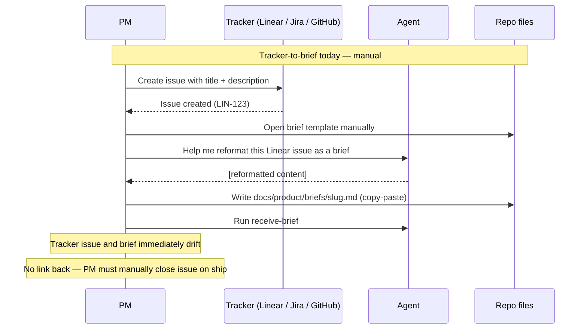
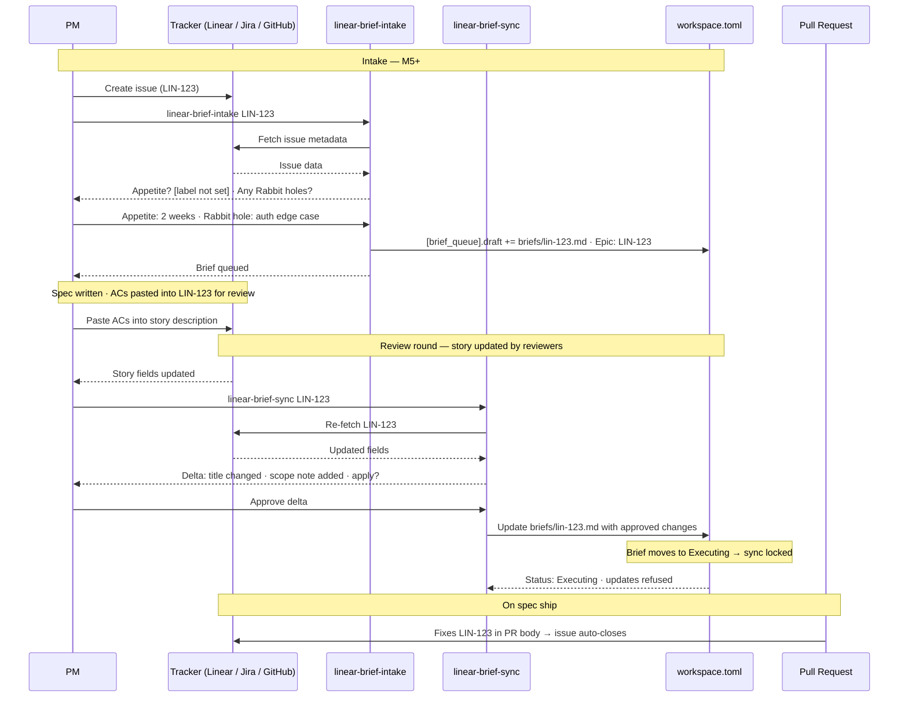

# Journey: PM intakes work from tracker

**Persona:** A PM who lives in Linear, Jira, or GitHub Issues. They create and manage issues in their tracker of choice and need them to flow into the platform's brief queue without manual reformatting. They are not primarily a terminal user — they think in tracker terms (Linear Issue, Jira Story, Epic, Sprint) and want the platform to speak their language, not the other way around.

**Outcome:** An issue or story in the PM's tracker of choice becomes a DoR-compliant brief in `[brief_queue].draft`, with all fields populated and the tracker issue linked bidirectionally. When the spec ships, the tracker issue closes automatically via PR convention. The PM never needs to leave their tracker to manage the brief lifecycle.

**Surface:** cross-platform — tracker UI → CLI intake skill → `workspace.toml`.

**Trigger:** PM marks an issue as ready for engineering work in their tracker, or reaches a sprint/cycle planning session where issues need to become specs.

**End state:** Brief in `[brief_queue].ready` (passed DoR gate), linked back to tracker issue via `Epic:` field. When the spec ships: "Fixes LIN-123" / "Closes #456" in the PR body auto-closes the tracker issue.

---

## Prerequisites

| Pack | Scope | Status | Provides |
|---|---|---|---|
| core | repo | M1 required | Brief template (M1 Batch 4), `receive-brief`, `[brief_queue]` schema; `github-brief-intake` (M5 first delivery, ships before linear pack) |
| linear pack | user | planned (M5) | `linear-brief-intake`; requires Linear API key at user scope (per personal Linear account) |
| atlassian pack | user | planned (M5) | `jira-align-brief-intake`; requires Jira credentials at user scope; org-specific field mapping configured per repo |

**One-time setup:**
1. Install core pack at repo scope — brief template and `[brief_queue]` must be in place before any intake skill writes to the queue.
2. For Linear: install linear pack at user scope + configure Linear API key in credential broker.
3. For Jira Align: install atlassian pack at user scope + configure Jira credentials + set configuration-guided field mapping for org-specific workflow states and PI cadences.
4. `workspace.toml` must be committed to `main` (M1 Batch 2 of the target repo) — no branch configuration needed; brief queue writes commit with the intake skill PR.

**Scale:** tracker packs are always user-scoped (personal credentials). The brief queue they write to is repo-scoped. Multiple PMs with different tracker accounts can all write to the same repo's brief queue — pack install is per-person, queue is per-repo.

---

## Interaction model

### Current state — before M5

### To-be state — M5 shipped

---

## Stage 1: Issue Authoring (in Tracker)

### Now (and to-be — tracker-side unchanged)

| Row | Content |
|-----|---------|
| **Actions** | Creates or updates an issue in Linear / Jira / GitHub. Writes a title, description, labels. Assigns to a milestone or sprint. |
| **Emotions** | Natural and comfortable (positive). This is the PM's native environment. |
| **Pains** | None at this stage — this is where the PM lives. |
| **Opportunities** | None needed here — the PM should stay in their tracker. The platform adapts to the tracker, not the other way around. |

---

## Stage 2: Intake

### Now

| Row | Content |
|-----|---------|
| **Actions** | Opens the brief template in the repo. Copy-pastes the issue title and description. Reformats fields manually. Runs `receive-brief` to decompose. |
| **Emotions** | Frustrated (negative). This is pure translation work — same content, different format, with no automation. |
| **Pains** | "I've already written this in Linear — why am I writing it again?" "The template fields (Appetite, Rabbit holes, Instrumentation) don't map cleanly to Linear fields — I have to guess." "I lose context between the Linear issue and the brief the moment I close the window." "If the Linear issue is updated after I create the brief, the brief is immediately stale." |
| **Opportunities** | `github-brief-intake` / `linear-brief-intake`: fetch issue metadata, map to brief fields, present a gap-fill prompt for DoR fields not in the tracker, and write the brief file in one invocation. |

> **With M5 (github-brief-intake)** — ships first, independently: GitHub Issue → brief with `Epic:` pointer; DoR gap-fill prompt for Appetite, Rabbit holes, Instrumentation. Pattern established before Linear pack.
>
> **With M5 (linear-brief-intake)** — ships after linear-pack sub-RFC accepted: Linear Issue / Project → brief; same DoR gap-fill pattern; `Epic: LIN-123` recorded on brief.

---

## Stage 3: DoR Gap Fill

### Now

| Row | Content |
|-----|---------|
| **Actions** | Realises the tracker issue doesn't have an Appetite or Rabbit holes field. Adds them to the brief manually from memory. |
| **Emotions** | Annoyed then resigned (negative → neutral). The DoR fields are valuable but require extra work that feels disconnected from how the PM normally thinks. |
| **Pains** | "Appetite isn't a Jira field — I have to remember to add it every time." "Rabbit holes require me to think about what could go wrong, but the tracker issue was written before that conversation happened." "Different PMs fill in DoR fields differently — no consistency." |
| **Opportunities** | Intake skill prompts specifically for missing DoR fields, with context from the tracker issue to make the prompts meaningful ("Based on this issue's scope, what is the Appetite? 1 week / 2 weeks / 1 month?"). DoR gap-fill becomes a lightweight conversation, not a blank-form exercise. |

> **With M5** — intake skills prompt interactively for missing DoR fields using issue context; consistent DoR format enforced across all intake sources.

---

## Stage 4: Queue & Track

### Now

| Row | Content |
|-----|---------|
| **Actions** | Brief is written but not connected to the tracker issue. PM manually closes the tracker issue when the spec ships. Discovers a month later that the brief and issue have drifted. |
| **Emotions** | Disconnected (neutral → negative). Two systems, neither authoritative, both incomplete. |
| **Pains** | "My Linear issue and the brief are two separate things — they drift immediately." "I have to remember to close the Linear issue when the PR ships — it's a manual step that gets forgotten." "If someone updates the Linear issue, the brief doesn't update. If someone updates the brief, the Linear issue doesn't update." "I can't see brief queue status from Linear — I have to open the repo to check." |
| **Opportunities** | `Epic:` field on brief links back to tracker; "Fixes LIN-123" in PR body auto-closes the issue on ship (write direction). Read direction is a PE-triggered delta re-sync (`linear-brief-sync`) — no webhook infrastructure (resolved: RFC-0064 Known Unknowns). Brief DoR status surfaced as a tracker label or comment if API permits. |

> **With M5** — iterative delta model: (1) first intake via `linear-brief-intake`; (2) `receive-brief` → spec with ACs; (3) ACs pasted back into Linear story for review (manual; `push-acs-to-linear` is a sub-RFC stretch goal); (4) review changes story → `linear-brief-sync` re-fetches, presents delta for PM/PE approval, updates brief; (5) brief locks at `Status: Executing` — no further tracker updates flow in. PR body "Fixes LIN-123" closes story on ship. Zero infrastructure — all PE-triggered.

---

## Frontstage actions

- **Action:** create-or-update-tracker-issue
- **Action:** run-github-brief-intake
- **Action:** run-linear-brief-intake
- **Action:** run-jira-align-brief-intake
- **Action:** answer-dor-gap-fill-prompts
- **Action:** confirm-brief-queued
- **Action:** verify-tracker-issue-closes-on-ship

---

## Emotional arc

Lowest point: **Stage 2 (Intake)** — frustrated — because the PM has already done the work of writing the issue in the tracker and is now doing it a second time in a different format. This is pure translation labour with no added value.

Highest-opportunity pain: "I've already written this in Linear. I shouldn't have to write it again. And once I have, it immediately falls out of sync."

Primary design response: brief-intake skills that treat the tracker as the authoritative source, map its metadata to DoR fields, and interactively elicit only what is genuinely missing — reducing the PM's work from a full rewrite to answering 2–3 prompts.

---

## Open design questions (feeds M5 sub-RFC)

- **Read direction (Linear → brief):** resolved as PE-triggered delta re-sync (no webhook, no running infrastructure). Sub-RFC governs: delta diff model details, AC export scope (`push-acs-to-linear` stretch goal), and field mapping between Linear fields and brief DoR fields.
- **Jira field mapping:** `jira-align-brief-intake` requires configuration-guided field mapping for org-specific workflow state names and PI cadences. How is the mapping configured — a config file per org, a one-time elicitation, or a TOML section in `agentbundle-layout.toml [jira]`?
- **Brief-to-tracker status push:** should brief `Status: Ready` be reflected as a tracker label or comment? Requires tracker write permissions and API rate-limit consideration.

---

## Handoff notes

**For `map-screen-flow`:** Stage 2 (Intake) and Stage 4 (Queue & Track) carry the highest-opportunity pains. The intake flow (issue URL → DoR gap-fill → brief queued) and the tracker-linked brief status view are the highest-priority screen-level inputs for any future PM-facing surface.

**For `blueprint-service`:** backstage services include tracker API (Linear / Jira / GitHub — read for intake, write for status push), `workspace.toml` brief queue, `docs/product/briefs/` (brief file store). The write-direction settlement (PR convention) and the read-direction open question (webhook vs. polling) are the primary backstage design decisions for the M5 sub-RFC.
