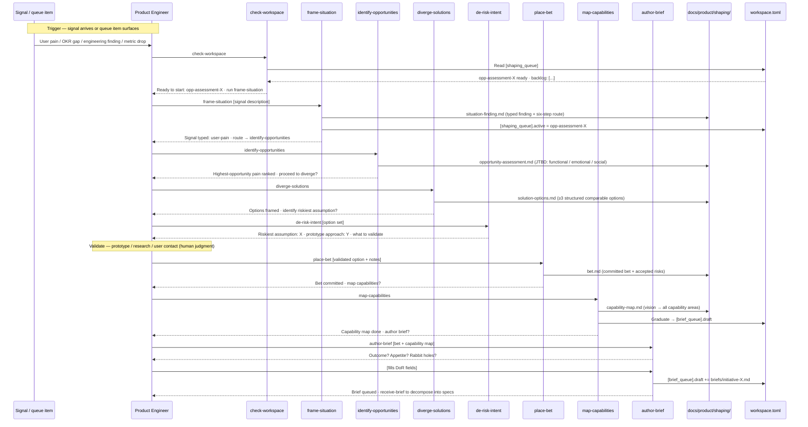

# Journey: Product engineer shapes an initiative

**Persona:** A product engineer (or PM with technical depth) responsible for shaping an initiative — moving from a raw signal or strategic gap through the six-step sequence (Outcome → Problem → Diverge → Validate → Bet → Spec) to produce a shaped brief that can enter the build queue. In smaller orgs this is one person; in larger orgs this role is distinct from both the product strategist (altitude-0) and the engineer executing specs (build room).

**Outcome:** A shaped brief — with Outcome, Appetite, Rabbit holes, and Instrumentation — committed to `docs/product/briefs/` and queued in `[brief_queue].draft`. Backed by a chain of committed shaping artifacts (situation finding → opportunity assessment → solution options → capability map → bet) that any agent or reviewer can trace.

**Surface:** cross-platform — CLI/terminal, agent-assisted. The PE does the judgment calls; the agent does the structured artifact generation under the PE's direction.

**Trigger:** A signal arrives — a user pain, a market observation, an engineering finding surfaced by `work-loop`, or a shaping queue item becoming active. Alternatively: a strategic gap identified by the altitude-0 layer (product-strategist journey) routes into frame-situation.

**End state:** Brief passes the DoR gate (`Status: Ready`), enters `[brief_queue].ready`, and is assigned to an engineer or agent for spec decomposition via `receive-brief`.

---

## Prerequisites

| Pack | Scope | Status | Provides |
|---|---|---|---|
| PE pack | user | current (M1 skills); M2 skills planned | `frame-intent`, `de-risk-intent` (current); `frame-situation`, `identify-opportunities`, `diverge-solutions`, `place-bet`, `map-capabilities` (M2) |
| core | repo | M1 required for queue write-back | `check-workspace`, `author-brief`, `receive-brief`; `[shaping_queue]` and `[brief_queue]` schema |

**One-time setup:**
1. Install PE pack at user scope — PEs shape across repos, so user scope is the right level.
2. Install core pack at repo scope for the repo where briefs will be committed.
3. `workspace.toml` is committed to `main` as part of M1 Batch 2 — no branch configuration needed; core pack install at repo scope is sufficient.

**Scale:** PE pack is user-scoped because the PE shapes across multiple repos. Core pack is repo-scoped because queue state is per-repo. In orgs where the same person does PE and engineering work, both scopes are needed — this is the common small-team case.

---

## Interaction model

### Current state — PE pack M1 skills only (before M2)

```mermaid
sequenceDiagram
    participant PE as Product Engineer
    participant A as Agent
    participant SK as Skills (frame-intent, de-risk-intent)
    participant F as Repo files

    Note over PE,F: Shaping today — session-bound
    PE->>A: Shape the X initiative
    A->>SK: frame-intent [intent description]
    SK-->>A: Intent framed — altitude 1
    A->>SK: de-risk-intent
    SK-->>A: Risks surfaced
    A-->>PE: Here is the framing and risk register
    Note over A: Session closes — artifacts in context only
    PE->>F: Manually write brief from memory
    PE-->>PE: No committed shaping chain; no graduation signal
```

### To-be state — M2 shipped



---

## Stage 1: Signal → Situation

### Now (frame-intent only)

| Row | Content |
|-----|---------|
| **Actions** | Receives a signal (user pain, metric drop, strategic gap). Runs `frame-intent` to articulate the intent. Produces a session-bound framing. |
| **Emotions** | Engaged but uncertain (neutral). The framing is useful but ephemeral — it doesn't survive the session and has no structured route to next steps. |
| **Pains** | "I've framed the intent but I don't know what kind of problem this is or which step of the six-step sequence to run next." "The framing lives in session context — if I close the terminal, it's gone." "No structured way to classify signals (user pain vs. market gap vs. strategic gap vs. engineering finding)." |
| **Opportunities** | A situation-framing skill that classifies the signal type, produces a typed finding, and routes to the right next step. Committed output that survives the session. |

> **With M2** — `frame-situation` ships: typed finding committed to `docs/product/shaping/`; signal classification routes directly to the next six-step skill; `[shaping_queue]` updated with the active item.

---

## Stage 2: Opportunity Assessment

### Now

| Row | Content |
|-----|---------|
| **Actions** | Tries to articulate what job-to-be-done or opportunity underlies the signal. Runs `frame-intent` for framing, but it doesn't surface JTBD structure. Works it out manually. |
| **Emotions** | Frustrated (negative). Without a structured opportunity-assessment skill, the work is ad-hoc and the output varies wildly in quality and structure. |
| **Pains** | "I know there's an opportunity here but I can't structure it consistently." "No JTBD framing — I miss the emotional and social jobs behind the functional one." "Different PEs produce incomparable opportunity assessments." |
| **Opportunities** | `identify-opportunities` producing a structured assessment with functional / emotional / social job framing. Committed artifact that any reviewer can compare across initiatives. |

> **With M2** — `identify-opportunities` ships: JTBD-structured opportunity assessment committed to `docs/product/shaping/`; highest-opportunity pain ranked and handed to diverge.

---

## Stage 3: Diverge Solutions

### Now

| Row | Content |
|-----|---------|
| **Actions** | Brainstorms solution options mentally or in a doc. May reach for `explore-options` but it produces freeform output — no structured comparison, no forcing function. |
| **Emotions** | Creative but unstructured (neutral). No clear signal about when divergence is "enough" or whether the options are comparable. |
| **Pains** | "I don't know if I've diverged enough or if I've just listed variations of the same idea." "My solution options aren't structured enough to compare — no forcing function." "I often skip this step and jump to a preferred solution." |
| **Opportunities** | `diverge-solutions`: step-3 of the six-step sequence, produces ≥3 structured comparable options that `place-bet` can reason against. Distinct from `explore-options` (freeform, any context) — different output contracts, both stay. |

> **With M2** — `diverge-solutions` ships as a distinct structured skill (not a wrapper over `explore-options`): forces ≥3 comparable options with a structured format that `place-bet` can reason against; committed to `docs/product/shaping/`. Use `explore-options` for freeform brainstorming outside the six-step sequence; use `diverge-solutions` when you're in step-3.

---

## Stage 4: Validate

### Now

| Row | Content |
|-----|---------|
| **Actions** | Selects a preferred option from the brainstorm. Runs `de-risk-intent` to surface the riskiest assumption. Validates through research, user contact, or internal review — with no structured handoff from the options artifact. |
| **Emotions** | Uncertain (neutral). No clear signal about what specifically to validate or when enough is enough. |
| **Pains** | "I know I should validate but I'm not sure what the riskiest assumption actually is." "Validation findings live in email threads or Notion — the next person picking this up doesn't know what was checked." "No minimum bar for 'validated enough' — I commit when I feel ready, not when I've hit a defined threshold." |
| **Opportunities** | `de-risk-intent` as structured validate-step entry: identifies the riskiest assumption in the option set and suggests a prototype approach — gives the PE a concrete thing to go test rather than validating blindly. A `validation-notes.md` seed (convention, not a skill) captures findings for the next person. |

> **With M2** — `de-risk-intent` positions as step-3.5: called after `diverge-solutions`, before the human validation work; surfaces riskiest assumption + prototype approach so the PE knows exactly what to test. The actual validation (prototype, research, user contact) remains human-judgment territory. `validation-notes.md` convention decision (M2 or M3) is deferred to the M2 sub-RFC.

---

## Stage 5: Place Bet

### Now

| Row | Content |
|-----|---------|
| **Actions** | Makes a gut-feel decision on which solution to pursue after validation. No structured betting table — rationale stays in the PE's head. |
| **Emotions** | Decisive but unaccountable (positive surface / neutral underneath). The decision is made but not committed — there is no artifact that forces the PE to write down the rationale. |
| **Pains** | "My bet is in my head — I can't hand it to someone else to review." "No betting table forcing me to weigh options explicitly." "When the initiative ships and someone asks 'why did we pick this solution?', there's no committed answer." |
| **Opportunities** | `place-bet` producing a committed bet artifact with a betting table (option, confidence, rationale, risks accepted). The human gate is explicit and committed; the next agent reading it knows exactly what was decided and why. |

> **With M2** — `place-bet` ships: betting table committed to `docs/product/shaping/`; rationale and accepted risks recorded; bet links to option that was validated.

---

## Stage 6: Brief

### Now

| Row | Content |
|-----|---------|
| **Actions** | Writes a brief from memory (the framing, options, and bet all lived in sessions). Runs `receive-brief` to decompose into specs. Brief is created but not traceable to any committed shaping chain. |
| **Emotions** | Relieved to be done (positive) but aware the brief has no provenance — it can't be reviewed against the original signal. |
| **Pains** | "My brief is not traceable to the shaping work — someone reviewing it can't check whether the bet was well-reasoned." "I had to reconstruct the context from memory — the brief may miss something from the shaping chain." "No capability map — I don't know if the brief covers all the relevant capability areas." |
| **Opportunities** | `map-capabilities` producing a capability map before brief authoring; `author-brief` creating the brief from the bet + capability map with full provenance; `[brief_queue]` updated automatically. |

> **With M2** — `map-capabilities` ships first, then `author-brief` creates the brief from the committed shaping chain; traceability lint links brief → bet → situation finding; brief enters `[brief_queue].draft` with full provenance.

---

## Frontstage actions

- **Action:** receive-signal-or-gap
- **Action:** run-frame-situation
- **Action:** run-identify-opportunities
- **Action:** run-diverge-solutions
- **Action:** validate-preferred-option
- **Action:** run-place-bet
- **Action:** run-map-capabilities
- **Action:** run-author-brief
- **Action:** run-receive-brief

---

## Emotional arc

Lowest point: **Stage 4 (Validate)** — uncertain — because there is no structured handoff into or out of validation. The PE is making a judgment call with no committed artifact capturing what was checked and what was not.

Highest-opportunity pain: "My shaping work lives in session context. When the brief is written, its provenance is gone — the reviewer can't trace the bet back to the original signal, and neither can the agent picking up the spec six weeks later."

Primary design response: committed shaping artifact chain (situation → opportunity → options → bet → capability map → brief) that survives sessions and gives reviewers and future agents a traceable line from signal to shipped spec.

---

## Handoff notes

**For `map-screen-flow`:** Stage 5 (Place Bet) and Stage 6 (Brief) carry the highest-opportunity pains. The betting table view and the brief-with-provenance view are the highest-priority screen-level inputs for any future PM-facing web surface (INI-006).

**For `blueprint-service`:** backstage services implied by the shaping chain include `docs/product/shaping/` (artifact store per initiative), `workspace.toml` (shaping queue state), and the traceability lint (brief → bet → situation link enforcement). The validation-notes gap (Stage 4) is an unresolved design question for the M2 sub-RFC.
