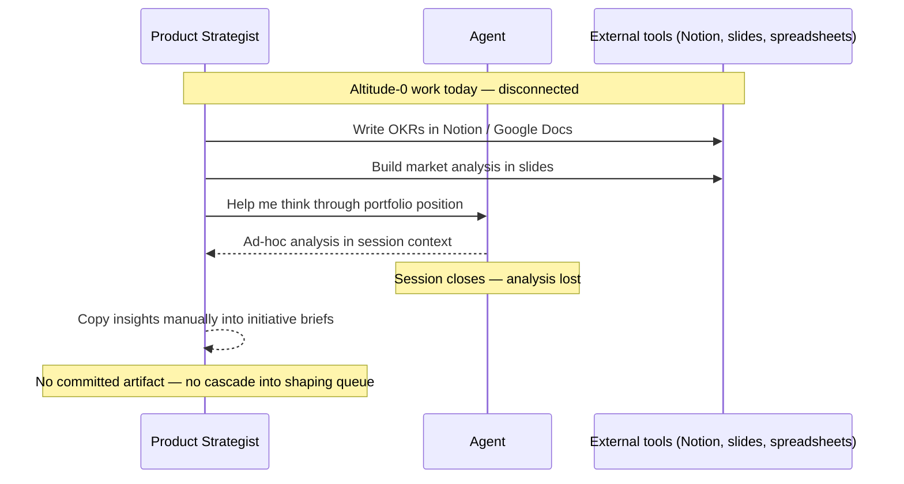
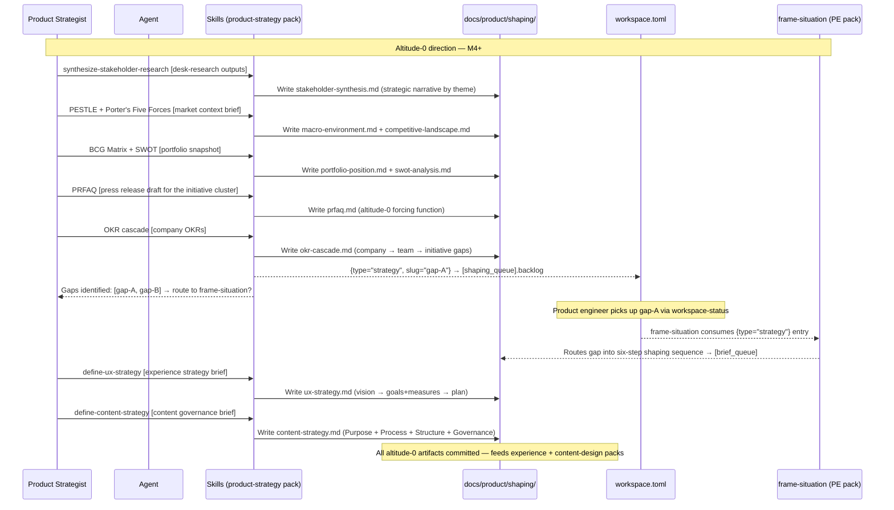

# Journey: Product strategist sets altitude-0 direction

**Persona:** A product strategist, CPO, or senior PM working at altitude-0 — company or multi-product level. They set the strategic direction that all initiatives must align to. Their time horizon is years, not quarters. In smaller orgs this may be the same person as the product engineer; in larger orgs it is a distinct role with a distinct artifact vocabulary (OKRs, PRFAQs, market analysis, portfolio position).

**Outcome:** A set of committed altitude-0 artifacts — stakeholder synthesis, PRFAQ, OKR cascade, market context, portfolio position, UX strategy, and content strategy — that translate company direction into initiative-level shaping inputs. Gaps identified by the OKR cascade feed directly into `frame-situation` as `{type = "strategy"}` shaping items, closing the loop between altitude-0 direction and altitude-1 shaping.

**Surface:** cross-platform — CLI/terminal, agent-assisted.

**Trigger:** Annual or quarterly planning cycle; a significant market event requiring strategic re-evaluation; or a new initiative cluster being scoped and the strategist needs to anchor it in altitude-0 thinking.

**End state:** Altitude-0 artifacts committed to `docs/product/shaping/`. OKR gaps routed to `[shaping_queue]` as `{type = "strategy"}` items for the product engineer to pick up via `frame-situation`. The initiative portfolio has a visible, justified strategic rationale that any team member can read.

---

## Prerequisites

| Pack | Scope | Status | Provides |
|---|---|---|---|
| product-strategy pack | user | M4 (RFC-0063 Accepted) | 9 skills: SWOT, Porter's Five Forces, PESTLE, BCG Matrix, OKR cascade, PRFAQ, stakeholder research synthesis, UX strategy, content strategy |
| PE pack | user | M2 required for cascade routing | `frame-situation` — target of the OKR cascade cross-pack routing contract |
| desk-research pack | user | shipped | Research briefs + synthesis memos consumed by `synthesize-stakeholder-research` |

**One-time setup (when M4 ships):**
1. Install product-strategy pack at user scope — altitude-0 direction applies across repos and orgs.
2. Install PE pack at user scope as a co-install — required for OKR cascade routing to `frame-situation`; absent PE pack produces a "frame-situation not found — install PE pack" diagnostic rather than a silent failure.
3. Install desk-research pack at user scope if stakeholder research synthesis is needed — `synthesize-stakeholder-research` requires prior desk-research project outputs; absent inputs → surfaces "run desk-research project first."
4. For each repo where OKR gaps will be routed to the shaping queue: install core pack at repo scope — `workspace.toml` is committed to `main` as part of M1 Batch 2; no branch configuration needed.

**Scale:** both packs are user-scoped. In smaller orgs the strategist and PE may be the same person with both packs already installed. The cross-pack dependency (OKR cascade → `frame-situation`) is agent-mediated — the strategist invokes both in sequence; no mechanical cross-pack wiring is assumed.

---

## Interaction model

### Current state — before M4

### To-be state — M4 shipped

---

## Stage 0: Stakeholder Research Synthesis

### Now

| Row | Content |
|-----|---------|
| **Actions** | Collects stakeholder research outputs from meetings, Notion pages, slide decks, and user interview notes. Synthesises manually before a planning cycle. The synthesis lives in a doc or stays in their head. |
| **Emotions** | Knowledgeable but time-pressed (neutral). Stakeholder research is valuable but hard to convert into structured strategic direction quickly. |
| **Pains** | "I have research outputs across three Notion workspaces and two Figma files — there's no structured way to synthesise them into strategic themes before I start the market analysis." "Each planning cycle I re-read the same research and reconstruct the same synthesis." "My stakeholder research is invisible to the agent when I run market analysis." |
| **Opportunities** | `synthesize-stakeholder-research` consumes desk-research project outputs and produces a committed `stakeholder-synthesis.md` — a strategic narrative by theme that feeds into SWOT, PESTLE, and Porter's Five Forces analysis as grounded evidence rather than ad-hoc recall. |

> **With M4** — `synthesize-stakeholder-research` ships: structured synthesis committed to `docs/product/shaping/`; desk-research project outputs are located if present — if no research inputs are found, the skill surfaces "run desk-research project first" before proceeding; the synthesis is immediately available as context when the strategist starts market analysis in the same session.

---

## Stage 1: Market Context

### Now

| Row | Content |
|-----|---------|
| **Actions** | Gathers market signals manually from news, analyst reports, competitors. Synthesises in slides or Notion. Shares in planning meetings. |
| **Emotions** | Informed but scattered (neutral). The synthesis is good but lives outside the platform — it can't be referenced by shape-room skills. |
| **Pains** | "My market analysis is in a Notion page that no one else in the team reads." "No structured format — each strategist does it differently." "The agent running `frame-situation` has no way to access the market context I've already done." |
| **Opportunities** | Committed market-context artifact in `docs/product/shaping/` that `frame-situation` can reference when routing a signal; PESTLE and Porter's Five Forces as the structuring framework, grounded by the stakeholder synthesis from Stage 0. |

> **With M4** — PESTLE + Porter's Five Forces skills ship: structured market-context artifact set committed (`macro-environment.md`, `competitive-landscape.md`); feeds directly into `frame-situation`'s situational-awareness input; `stakeholder-synthesis.md` (Stage 0) is available as grounded evidence throughout. SWOT synthesises the full picture in Stage 2.

---

## Stage 2: Portfolio Position

### Now

| Row | Content |
|-----|---------|
| **Actions** | Assesses where each initiative sits in the portfolio relative to market position and growth. Uses BCG Matrix and SWOT mentally or in slides. |
| **Emotions** | Strategic but isolated (neutral). The portfolio view is valuable but disconnected from what teams are actually building. |
| **Pains** | "My BCG Matrix is a static slide — it doesn't update when initiatives ship." "No link between portfolio position and which shaping items get prioritised." "SWOT lives in planning decks, not in the committed tree — teams building the product can't access it." |
| **Opportunities** | Committed portfolio-position artifact that updates alongside the initiative structure; SWOT as the synthesising capstone that brings macro (Stage 1) + stakeholder (Stage 0) + portfolio inputs together into a committed situation picture; strategic position drives what gets shaped next. |

> **With M4** — BCG Matrix + SWOT skills ship: `portfolio-position.md` and `swot-analysis.md` committed; `swot-analysis.md` synthesises macro environment, competitive landscape, and portfolio data into a single committed situation picture; links to `[shaping_queue]` backlog priority (higher portfolio urgency → moves higher in backlog).

---

## Stage 3: Direction Setting (PRFAQ)

### Now

| Row | Content |
|-----|---------|
| **Actions** | Writes a press release or product narrative for major bets in slide decks or documents. Shares in leadership reviews. Rarely committed to the repo. |
| **Emotions** | Purposeful but aware of the gap (positive → neutral). The PRFAQ discipline is valuable but exists only in meetings — it doesn't anchor the shaping room. |
| **Pains** | "I write a great press release in PowerPoint and then it disappears. Six months later no one knows what the original vision was." "The shaping room has no altitude-0 anchor — PEs shape without knowing what the company is trying to achieve." "PRFAQ is an Amazon thing — no structured tool for it here." |
| **Opportunities** | PRFAQ template committed to `docs/product/shaping/` as the altitude-0 forcing function; linked from initiative briefs as the "why this initiative?" artifact; any agent or reviewer can trace a brief back to the PRFAQ that motivated it. |

> **With M4** — PRFAQ template ships: strategist writes press release, commits it to `docs/product/shaping/`; initiative briefs link to PRFAQ via `## Design artifacts`; traceability lint can enforce the link.

---

## Stage 4: OKR Cascade

### Now

| Row | Content |
|-----|---------|
| **Actions** | Sets company OKRs in Notion / Google Sheets. Cascades to team OKRs in planning meetings. Hopes the cascade reaches the product team's shaping backlog. Rarely does. |
| **Emotions** | Resigned (negative). The cascade is a planning ritual, not a live connection. By the time an engineer writes a spec, the OKR that motivated it is invisible. |
| **Pains** | "Company OKRs are in Notion; team OKRs are in a spreadsheet; the shaping queue has no idea either exists." "Gaps between current state and OKR targets are identified in planning meetings and then lost." "No mechanism for OKR gaps to flow into `frame-situation` as shaping inputs." |
| **Opportunities** | OKR cascade skill that (a) takes company OKRs, derives team-level OKRs, and identifies gaps; (b) routes each gap as a `{type = "strategy"}` entry into `[shaping_queue].backlog` for `frame-situation` to pick up; (c) writes the cascade as a committed artifact. The altitude-0 → altitude-1 handoff becomes a skill invocation, not a meeting. |

> **With M4** — OKR cascade skill ships: company OKRs → gap analysis → `{type = "strategy"}` entries in `[shaping_queue].backlog`; product engineer picks them up via `workspace-status` and routes each through `frame-situation`. Cross-pack dependency: PE pack (`frame-situation`, M2) must be installed.

---

## Stage 5: Experience & Content Strategy

### Now

| Row | Content |
|-----|---------|
| **Actions** | Sets experience goals and content governance in planning meetings and slide decks. Shares with design and content teams informally. No committed artifact — design teams infer the experience intent from product briefs; content teams work without an organizational governance doc. |
| **Emotions** | Frustrated by the gap (negative). The strategist has a clear experience vision and content governance intent, but design and content teams are working from incomplete inference. |
| **Pains** | "My experience strategy lives in a Figma file and a planning doc — neither is accessible to the agent building the screen flows." "Content governance rules exist in my head and a style guide — but the content-design team doesn't know the strategic intent behind them." "When a designer uses `journey-mapping`, they have no committed UX strategy to anchor the journey's strategic rationale." |
| **Opportunities** | `define-ux-strategy` produces a committed `ux-strategy.md` (vision → goals+measures → plan) that `journey-mapping` and `user-flow` can reference as the strategic anchor. `define-content-strategy` produces a committed `content-strategy.md` (Halvorson quad: Purpose + Process + Structure + Governance) that content-design skills consume downstream. |

> **With M4** — UX strategy and content strategy skills ship: `ux-strategy.md` and `content-strategy.md` committed to `docs/product/shaping/`; experience-design pack skills reference `ux-strategy.md` as the strategic input; content-design skill references `content-strategy.md` for governance intent. The altitude-0 experience and content direction is now traceable from shaping artifacts to screen-level design.

---

## Stage 6: Initiative Prioritisation

### Now

| Row | Content |
|-----|---------|
| **Actions** | Decides which initiatives get resourced in the planning cycle. Decision is made in meetings with no committed rationale. |
| **Emotions** | Confident in the room (positive) but aware the rationale will be lost (neutral). Six months later the team doesn't know why initiative X was picked over initiative Y. |
| **Pains** | "Initiative prioritisation is a meeting outcome — it's not committed anywhere." "No structured betting table at altitude-0 — I can't show stakeholders the trade-offs I considered." "The shaping queue doesn't reflect strategic priority — PEs pick whatever is interesting, not whatever is most urgent." |
| **Opportunities** | Initiative prioritisation rationale committed in `portfolio-position.md` (BCG-derived) and `okr-cascade.md` (gap-derived); shaping queue backlog ordered by strategic priority; stakeholders can read the trade-offs the strategist weighed directly from the committed artifact tree. |

> **With M4** — No separate skill: initiative prioritisation is the natural output of `run-bcg-matrix` (portfolio urgency by quadrant) and `run-okr-cascade` (gaps ranked by OKR weight); the committed rationale lives in `portfolio-position.md` + `okr-cascade.md`; `[shaping_queue].backlog` ordering reflects strategic priority set by the OKR cascade routing.

---

## Frontstage actions

**product-strategy pack (M4):**

- **Skill:** synthesize-stakeholder-research — Stage 0 (research-to-strategy bridge; consumes desk-research outputs)
- **Skill:** run-pestle-analysis — Stage 1 (macro environment)
- **Skill:** run-porters-five-forces — Stage 1 (competitive landscape)
- **Skill:** run-bcg-matrix — Stage 2 (portfolio position)
- **Skill:** run-swot — Stage 2 (situation synthesis; synthesises macro + portfolio + stakeholder inputs)
- **Skill:** write-prfaq — Stage 3 (altitude-0 forcing function)
- **Skill:** run-okr-cascade — Stage 4 (OKR cascade + `{type="strategy"}` routing to shaping queue)
- **Skill:** define-ux-strategy — Stage 5 (experience strategy)
- **Skill:** define-content-strategy — Stage 5 (content governance)
- *Stage 6 (Initiative Prioritisation) is not a separate skill invocation — portfolio ordering is the strategic output of `run-bcg-matrix` + `run-okr-cascade` working together; the committed prioritisation rationale is recorded in `portfolio-position.md` and `okr-cascade.md`.*

---

## Emotional arc

Lowest point: **Stage 4 (OKR Cascade)** — resigned — because the altitude-0 → altitude-1 handoff is a ritual that does not produce a committed artifact or a live connection to the shaping queue. OKR gaps identified in planning disappear before they reach a product engineer's workspace.

Second lowest: **Stage 5 (Experience & Content Strategy)** — frustrated — because the strategist's experience vision and content governance intent are invisible to the design and content teams operating the experience-design pack.

Highest-opportunity pain: "I set company OKRs and cascade them to team OKRs. By the time an engineer is writing a spec, neither exists in their context. There is no committed handoff — just hope."

Primary design response: OKR cascade skill routing gaps to `[shaping_queue]` as `{type = "strategy"}` items; PRFAQ and portfolio-position committed to `docs/product/shaping/` as traceable altitude-0 anchors; UX strategy and content strategy committed as the experience-design pack's altitude-0 reference input.

---

## Handoff notes

**For `user-flow`:** Stage 4 (OKR Cascade) and Stage 6 (Initiative Prioritisation) carry the highest-opportunity pains. A portfolio-level dashboard showing which initiatives are resourced and why — with links to the committed altitude-0 artifacts — is the highest-priority screen-level input for INI-006 (control plane). Stage 5's `ux-strategy.md` is the strategic anchor for screen-flow design.

**For `service-blueprint`:** backstage services include `docs/product/shaping/` (altitude-0 artifact store), `workspace.toml` (shaping queue state), PE pack's `frame-situation` (cross-pack routing target), desk-research pack (primary research inputs for Stage 0). The cross-pack dependency (OKR cascade → frame-situation) is the primary integration point — agent-mediated, not a mechanical cross-pack call. See RFC-0063 § Cross-pack routing contract for the full contract specification.

**For content-design skill (experience-design pack):** `content-strategy.md` (Stage 5) is the organizational governance input that content-design consumes. Content-design is execution-layer (per-surface); content strategy is governance-layer (organizational intent). The two do not overlap — content-design reads from content strategy, does not replace it.
