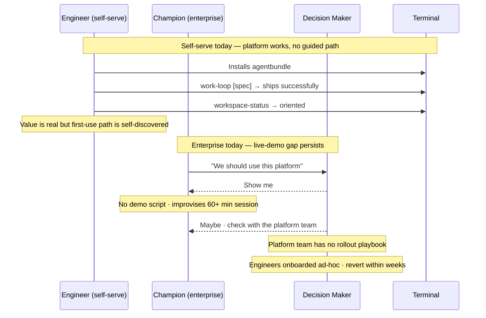
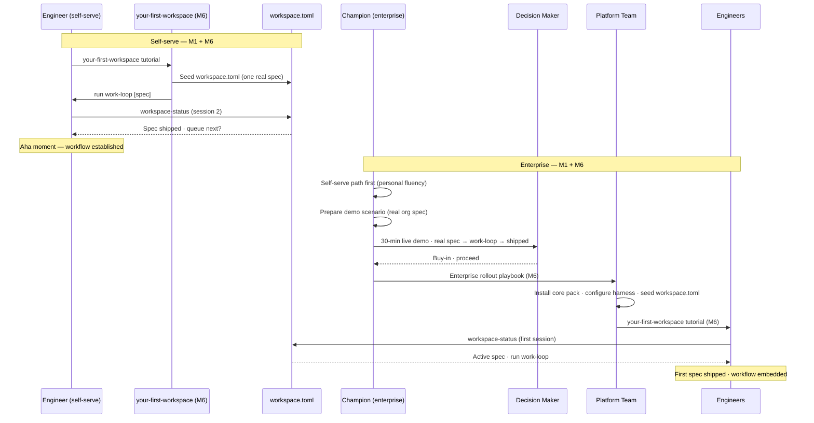

# Journey: Engineering team evaluates and adopts

**Use it when:** your team is ready to move from ad-hoc AI-assisted coding to a structured, coordinated build workflow — whether self-serve on a single repo or a sponsored enterprise rollout.
**You provide:** a real pending spec to use as the first proof-of-value, and (for enterprise) a demo scenario on your org's own codebase.
**You receive:** a shipped first spec, a seeded `workspace.toml`, and engineers with `workspace-status` as their session-start habit.
**Your decisions:** select the first real spec (not a toy example); choose self-serve or rollout path; (enterprise) prepare and deliver the live demo; execute the rollout playbook.

**Persona:** An engineering team evaluating the platform for adoption — ranging from a solo senior engineer at a startup trying it on a real spec, to an enterprise champion building an internal case for a CTO before a platform team rolls it out across multiple teams.

Two distinct paths share this journey:

- **Self-serve** (solo / startup / small team): The evaluator is the installer. Value is demonstrated by running the tool on a real spec. No gatekeepers, no live demo required. The tool sells itself once it runs.
- **Sponsored** (enterprise / AI adoption programme): The evaluator is not the installer. An internal champion must demonstrate value to a decision maker (CTO, engineering director, AI CoE lead), coordinate with a platform team, then onboard engineers at scale. Live demonstration on the org's own codebase is the critical gate — documentation alone does not move enterprise decisions.

**Outcome:** The team ships their first spec using `work-loop`. `workspace.toml` is seeded on `main`. Engineers open sessions with `workspace-status`. The platform is the default workflow, not a pilot.

**Surface:** cross-platform — CLI/terminal, agent-assisted. Enterprise path includes a live-demo session in front of decision makers.

**Trigger:**
- Self-serve: Peer recommendation, blog post, conference mention, or GitHub discovery. Engineer has already been using Claude Code or similar and wants more structure.
- Sponsored: Organisation has an AI adoption initiative. A champion is tasked with evaluating tools. Platform is identified as a candidate and escalated for a buy-in conversation.

**End state:** `workspace.toml` seeded on `main`. At least one spec shipped via `work-loop`. Engineers run `workspace-status` at session start without being told to. For the sponsored path: rollout playbook executed, platform team owns the install, engineers have completed a guided first-use tutorial.

---

## Prerequisites

| Pack | Scope | Status | Provides |
|---|---|---|---|
| core | repo | current | `work-loop`, `workspace-status`, `new-spec`, `receive-brief`, `workspace.toml` schema |
| PE pack | user | optional for evaluation | `frame-intent`, `de-risk-intent` — not needed to evaluate or demonstrate the build room |

**Self-serve setup:**
1. Install core pack at repo scope.
2. Seed `workspace.toml` with one real spec entry (not a toy example — use an actual pending task).
3. Run `work-loop` on that spec. Ship it.

**Enterprise setup (platform team):**
1. Champion completes the self-serve path first on their own repo — live demo requires personal fluency, not familiarity.
2. Champion selects demo scenario: a real pending spec from the org's own codebase, sized to ship in 30 minutes.
3. Champion prepares live-demo guide (M6) for the specific codebase and harness.
4. After buy-in: platform team runs rollout playbook (M6); engineers complete `your-first-workspace` tutorial.

**Scale:** Core pack is repo-scoped — one install per repo. Enterprise rollout requires a platform team decision on harness (Claude Code, Codex CLI, Kiro, etc.) and which repos/teams roll out first. Mixed-harness orgs need one adapter pack per harness type (INI-003).

---

## Interaction model

### Current state — M1 shipped, M6 pending

### To-be state — M6 shipped

---

## Stage 1: Awareness

### Now

| Row | Content |
|-----|---------|
| **Actions** | Engineer discovers via peer recommendation, blog, or GitHub. Champion is assigned by an AI adoption lead. Both read README and documentation. |
| **Emotions** | Curious but cautious (neutral). The platform exists and works — but the entry point is not obvious from the README. |
| **Pains** | "The README explains what it does but not how to get started on a real project." "Every team member will ask me what this is before they try it — I need a one-sentence answer." |

> **With M6** — `your-first-workspace` tutorial ships: guided path from install to first shipped spec; one-sentence positioning in README; clear separation of "try it yourself" (self-serve) from "roll it out to your team" (rollout playbook).

---

## Stage 2: Proof of Value

### Now

| Row | Content |
|-----|---------|
| **Actions** | Engineer installs manually, following README. Seeds `workspace.toml` (or uses the existing one if the repo already has it). Runs `work-loop` on a real spec. Runs `workspace-status` to confirm state. |
| **Emotions** | Determined (neutral → positive once the spec ships). The tool works and the confirmation is concrete — `workspace-status` shows "shipped" and what's next. |
| **Pains** | "I installed it but I'm not sure if skills are loading correctly." "I don't know if I should use an existing spec or create a new one — there's no tutorial to guide me." "The value was visible but I can't reproduce it reliably yet because I'm self-discovering the path." |

> **With M6** — `your-first-workspace` tutorial ships: guided path from install to first shipped spec; no self-discovery needed; first session is explicitly confirmed via `workspace-status`.

---

## Stage 3: Internal Case / Live Demo Gap

### Now (enterprise path only — highest-pain stage)

| Row | Content |
|-----|---------|
| **Actions** | Champion is asked to demonstrate value to decision makers. Has no demo script. Improvises a live session using their own knowledge of the platform. Session runs 60–90 minutes, outcome is uncertain. Decision maker is unconvinced or asks to see it on their own codebase. |
| **Emotions** | Anxious then exhausted (negative). The platform is genuinely good but the champion cannot reliably transfer that conviction to a decision maker who hasn't used it. |
| **Pains** | "I can demonstrate it but I need 90 minutes and it might not go right." "Decision makers want to see it on our code, not a toy example." "If the demo goes wrong — wrong spec, environment issue, unclear output — I lose the room." "I've done three of these live sessions and every one felt like starting from scratch." |
| **Opportunities** | A live-demo guide (M6): a prepared scenario using a real pending spec from the org's own codebase, sized to ship in under 30 minutes; a script of what to narrate at each step; a pre-flight checklist (harness installed, skills loading, spec ready); a fallback if something goes wrong. The champion needs to be able to run this reliably without improvising. |

> **With M6** — Live-demo guide ships as part of M6: scenario selection criteria (what makes a good demo spec), pre-flight checklist, narration script, 30-minute target. Champion who has completed the self-serve path can deliver this reliably. Decision maker sees real work on their codebase, not a toy.

---

## Stage 4: Rollout

### Now

| Row | Content |
|-----|---------|
| **Actions** | After buy-in (enterprise) or after personal success (self-serve), tries to extend to the team. No rollout playbook. Each engineer re-encounters the same config friction the champion did. |
| **Emotions** | Optimistic then managing (positive → neutral). The champion is excited but the onboarding experience does not carry the excitement forward to team members. |
| **Pains** | "Every engineer asks the same setup questions I already answered for myself." "No way to share my workspace.toml setup — each person starts from scratch." "The platform team wants a rollout plan but I don't have one." "Some engineers tried it once, hit friction, and went back to their old workflow." |
| **Opportunities** | Enterprise rollout playbook (M6): install core pack at org scope, pre-seed `workspace.toml` for the first pilot project, configure harness, run `your-first-workspace` tutorial with each engineer. Self-serve: shareable `workspace.toml` template so team members start from a known-good state, not from blank. |

> **With M6** — Rollout playbook ships: step-by-step platform team guide; pre-seeded `workspace.toml` template for the pilot project; guided first-use session for each engineer using the tutorial. Rollout friction drops from "re-discover everything" to "follow the playbook."

---

## Stage 5: Embedding

### Now

| Row | Content |
|-----|---------|
| **Actions** | After initial success, engineers continue using `work-loop` and `workspace-status` — or revert to old workflow when they hit friction on a non-standard case. |
| **Emotions** | Building toward habitual (neutral). `workspace-status` is a real tool they can form a habit around. Reversion happens when a new case (no spec, ambiguous brief, unfamiliar harness) is encountered and there is no guidance. |
| **Pains** | "It works well when I know what spec to run. When I don't, I go back to winging it." "New engineers joining the team don't know about `workspace-status` — they discover it weeks in." |

> **Embedded state (M6)** — `workspace-status` is the first command every engineer runs. `workspace.toml` is the team's source of truth for what's in flight. New engineers are onboarded to it on day one via the `your-first-workspace` tutorial. Reversion stops because the habit is established before friction arises.

---

## Adoption metrics

The metrics that matter — and how to measure them at each adoption stage. Source of truth is `workspace.toml` where possible; champion reporting for enterprise-path qualitative gates. INI-005 (Infra & Observability) is the future home for automated instrumentation; until then, these are measured manually.

### Time to first value (TTFV)

**What it measures:** How long from install to first shipped spec. The single most important leading indicator of whether adoption will stick.

| Path | Target | How to measure |
|---|---|---|
| Self-serve | < 1 hour (install → first spec shipped) | Timestamp: pack install → first `shipped` entry in `workspace.toml` |
| Enterprise live demo | < 30 min (demo start → spec shipped in front of decision maker) | Champion reports: did the spec ship within the window? |
| Enterprise rollout | < 2 weeks (CTO buy-in → first engineer ships a spec) | Champion reports: date of buy-in, date of first team spec shipped |

### Activation rate

**What it measures:** What % of engineers who install actually ship a spec within the first 7 days. Low activation = onboarding friction or unclear first step.

| Target | How to measure |
|---|---|
| > 80% of installed engineers ship ≥1 spec within 7 days | Count engineers with ≥1 `shipped` entry in `workspace.toml` within 7 days of install |

### Session-start habit

**What it measures:** Are engineers running `workspace-status` at the start of sessions? This is the embedding metric — once it's habitual, reversion is unlikely.

| Target | How to measure |
|---|---|
| `workspace-status` is the first command in > 70% of sessions by week 4 | Self-reported (survey) until INI-005 session instrumentation ships; proxy: `workspace.toml` `active` entries moving to `shipped` within single sessions |

### 30-day retention

**What it measures:** Are engineers still using `work-loop` 30 days after their first spec? Reversion is the dominant failure mode — engineers try it, hit friction on a non-standard case, and go back to winging it.

| Target | How to measure |
|---|---|
| > 70% of engineers who shipped a first spec are still shipping specs at day 30 | Count engineers with ≥1 `shipped` entry in weeks 3–4 who also had one in week 1 |

### Spec throughput lift

**What it measures:** How many specs ship per engineer per week, before vs. after adoption. This is the productivity metric decision makers care about — and the one that builds the internal case for broader rollout.

| Target | How to measure |
|---|---|
| ≥ 2× specs shipped per engineer per week within 60 days of rollout | `workspace.toml` `shipped` count per engineer, compared to prior sprint velocity in tracker |

### Brief queue flow rate

**What it measures:** Time from brief `draft` to `executing`. A stalling brief queue means the shaping → build handoff is broken — briefs are being written but not acted on.

| Target | How to measure |
|---|---|
| Median < 5 days from `brief_queue.draft` to `work.active` | Timestamp delta: brief queued date → first spec enters `active` |

### Enterprise demo success rate

**What it measures:** Can the champion ship a spec reliably in the 30-minute live-demo window without improvising? Binary: yes (spec shipped on screen) / no.

| Target | How to measure |
|---|---|
| 100% — every demo attempt ships the spec in the window | Champion self-report post-demo; pre-flight checklist completion rate |

### Reversion rate (enterprise)

**What it measures:** What % of engineers who completed onboarding reverted to their old workflow within 30 days. Enterprise adoption fails here most often — not at buy-in, but at embedding.

| Target | How to measure |
|---|---|
| < 15% reversion at 30 days | `workspace.toml` activity: engineers with no `shipped` entry in weeks 3–4 despite having one in week 1 |

### Portfolio / org-level metrics — across many teams, value streams, and repos

At enterprise scale, adoption is not measured per-repo — it is measured across an entire engineering organisation: multiple teams, multiple value streams, multiple repos each with their own `workspace.toml`. The per-repo metrics above are necessary but not sufficient. A CTO or AI adoption lead needs an aggregated view.

| Metric | What it measures | How to measure |
|---|---|---|
| **Org activation rate** | % of repos with ≥1 spec shipped via `work-loop` out of all target repos | Count repos with non-empty `shipped` in `workspace.toml` / target repo count (manual until INI-006) |
| **Team adoption coverage** | % of teams / value streams running at least one active initiative in `workspace.toml` | Count teams with `status = "active"` section / total teams (manual until INI-006) |
| **Cross-repo throughput** | Total specs shipped per week, aggregated across all repos | Sum of `shipped` delta per `workspace.toml` per week — requires scraping or manual reporting |
| **Cross-repo brief queue health** | Aggregate count of briefs stalled in `draft` or `ready` > N days across all repos | Manual: each team reports; automated: INI-005 per-repo telemetry rolled up to INI-006 dashboard |
| **Initiative portfolio progress** | For orgs running parallel initiatives (each in separate repos), what % of specs are shipped vs. queued vs. blocked? | Requires a portfolio-level registry — not yet designed; feeds Unknown #8 (portfolio pack) |
| **Value stream latency** | End-to-end time from brief `draft` to spec `shipped`, aggregated per value stream | Timestamp delta aggregated across repos in one value stream — requires INI-005 |
| **30-day org-wide retention** | % of engineers across all teams who are still shipping specs at day 30 vs. day 7 | Per-engineer metric aggregated across repos — requires INI-005 instrumentation |

**The core gap:** `workspace.toml` is per-repo by design (D4). There is no native org-level view. Aggregation today requires either manual roll-up (each team reports to a shared tracker) or a portfolio registry (an "org workspace" at a higher level). Until INI-005 (telemetry) and INI-006 (control plane) ship, enterprise-scale measurement is a manual process.

**What this means for design:** the portfolio pack (Unknown #8) is not just about research bridging — it is also the mechanism for org-level `workspace.toml` aggregation and cross-repo initiative tracking. This is a design input to Unknown #8: a portfolio-level artifact (perhaps `portfolio.toml` or a lightweight registry) that aggregates per-repo `workspace.toml` status for the CTO dashboard. Feeds directly to INI-006 control plane scope.

---

### What INI-005 needs to automate

Currently all metrics above require manual measurement or champion reporting. The instrumentation needed:
- Timestamps on `workspace.toml` state transitions (draft, active, shipped) — enables TTFV, flow rate, and throughput without manual tracking per-repo
- Per-repo telemetry push to a central aggregator — enables org-level metrics without manual roll-up
- Session-start detection (first command per session) — enables session-start habit metric
- Per-engineer spec counts — enables activation rate and 30-day retention

Until INI-005 ships, measure manually via periodic `workspace-status` output, per-team reporting, and champion aggregation. Prioritise TTFV (leading indicator) and 30-day org-wide retention (lagging indicator) — they bracket the adoption arc.

---

## Frontstage actions

- **Skill:** discover-platform (peer / blog / GitHub)
- **Skill:** read-readme-and-assess-fit
- **Skill:** complete-your-first-workspace-tutorial
- **Skill:** seed-workspace-toml (first real spec)
- **Skill:** run-work-loop-first-spec
- **Skill:** prepare-demo-scenario (enterprise)
- **Skill:** deliver-live-demo (enterprise)
- **Skill:** execute-rollout-playbook (enterprise)
- **Skill:** run-workspace-status-at-session-start (habit)

---

## Emotional arc

**Self-serve path:** Lowest point is Stage 2 (proof of value) — friction before the first success. Highest point is the moment the first spec ships and `workspace-status` shows "shipped" — immediate, visible, concrete.

**Enterprise path:** Lowest point is Stage 3 (internal case / live demo) — the champion knows the platform is good but cannot transfer that conviction reliably to decision makers without a demo script. The platform is the best it has ever been and the champion is still losing rooms.

**Highest-opportunity pain (enterprise):** "I've done three live demos and every one felt like I was improvising. The platform is genuinely good — the demo isn't."

**Primary design response:** M6 live-demo guide closes Stage 3. The champion needs a 30-minute scripted scenario on real org code, not a toy example, with a pre-flight checklist and a narration script. Everything else in M6 (tutorial, rollout playbook) depends on Stage 3 being solved first — without decision-maker buy-in, there is no rollout.

---

## Open design questions (feeds M6)

- **Demo scenario selection:** what makes a spec a good demo candidate? Criteria: small enough to ship in 30 min, real enough to be credible, simple enough that environment issues don't derail it.
- **Pre-flight checklist:** what must be verified before a live demo? (Harness installed, skills loading, workspace.toml seeded, spec exists, no uncommitted changes that would confuse `work-loop`.)
- **Harness portability of the demo:** does the demo script need harness-specific variants, or is the work-loop experience uniform enough across Claude Code / Codex CLI / Kiro that one script covers all?
- **New-engineer onboarding integration:** should `your-first-workspace` be a standalone tutorial or embedded in a broader "new-engineer setup guide" that orgs already have?

---

## Handoff notes

**For M6 spec authoring:** Stage 3 (Live Demo Gap) is the highest-priority M6 design problem. The live-demo guide is a prerequisite for the rollout playbook — enterprise can't roll out without buy-in, and buy-in requires a reliable demo. Sequence: live-demo guide → rollout playbook → your-first-workspace tutorial.

**For `workspace-status` design (M1):** Stage 5 (Embedding) reveals that `workspace-status` is the session-start habit that prevents reversion. The M1 `workspace-status` AC should explicitly design for "first command in a session" UX — the output should answer "what do I work on next?" not just "what is in the queue?"

**For INI-003 (Coding CLI Adapter Pack):** Stage 4 (Rollout) in mixed-harness orgs requires one adapter per harness type. The rollout playbook must handle harness selection as its first decision — the platform team cannot onboard engineers until they know which CLI everyone is using.
