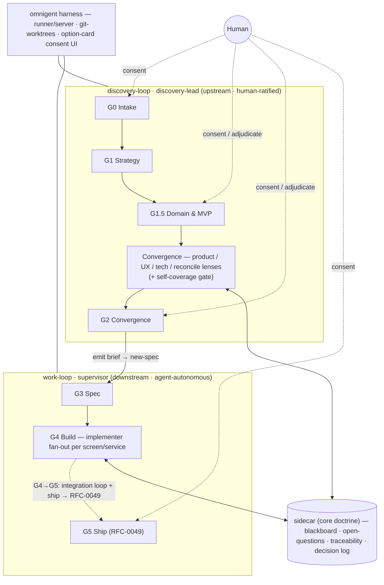

# RFC-0048: The autonomous product-team operating model — gate doctrine, the `experience` pack, and a child-effort roadmap

- **Status:** Open <!-- Draft | Open | Final Comment Period | Accepted | Rejected | Withdrawn | Experimental -->
- **Provisional foundation:** this is an umbrella/foundation RFC. **Even once Accepted it
  remains *provisional* — amendable, not frozen — until every child RFC has been modelled
  out and drift-aligned back to it.** Drift between a child effort and this foundation is a
  bug to reconcile *in this RFC* (a tracked amendment), not to absorb silently downstream.
  It reaches a terminal/frozen state only when the child set is complete and aligned. This
  intentionally diverges from the normal Accepted→Frozen lifecycle for this foundation RFC.
- **Author:** eugenelim
- **Approver:** eugenelim
- **Date opened:** 2026-06-25
- **Date closed:**
- **Related:** RFC-0043 (product rung — the `product-vision`/`product-strategy` altitudes this model's G0/G1 build on) · RFC-0030 (the `product-engineering` pack) · RFC-0041 (infra-aware `work-loop` — the *doctrine + reference-library + reuse-existing-reviewer, no new runtime* precedent this RFC mirrors) · RFC-0025 (`work-loop` light/full mode + risk triggers — the gate model this extends) · RFC-0019 (`receive-brief` — the brief→spec join, and its coverage-lint the traceability lint generalizes) · ADR-0019 (intent ontology) · `design-craft` pack (renamed by a follow-on ADR) · promoted research in [`0048-notes/`](0048-notes/)

## The ask

**Recommendation (BLUF).** Adopt an *operating model* that lets the catalogue act as
an **autonomous product team from vision → shipped code** — and deliver it the way
RFC-0041 and RFC-0043 delivered comparable cross-cutting capability: **as doctrine +
pure-markdown skills + reference libraries + reuse of the existing reviewers — no new
runtime engine.** This RFC *decides the model and the roadmap*; each artifact is built
by a named child effort, not here. Concretely it adopts (a) the **two-regime principle** + a
**judgment-decomposition→equipping map** + a **risk-calibrated gate ladder and
surfacing predicate** as `work-loop`/CONVENTIONS doctrine; (b) the rename
`design-craft → experience` plus its connective UX skills; (c) three primitives
(domain-anchor, self-coverage gate, traceability lint); and (d) a **coordinator
spike — not a build** — gating any orchestration RFC behind a design pass.

**Why now (SCQA).** *Situation:* the catalogue already has the product altitude
(RFC-0043), the brief→spec→`work-loop` spine (RFC-0019/0025), the architecture and
contract packs, the three reviewers, and a `design-craft` craft pack. *Complication:*
the **upstream** (vision → backlog → design) has no connective UX layer (no journey
map, service blueprint, or screen inventory), no mechanism that makes product/UX/tech
artifacts *answer each other*, and nothing that catches **domain-hallucination** and
**scope-creep** before agent errors compound and burn tokens — while the component
most at risk (an orchestrating "coordinator") is the *least* specified. *Question:*
can the catalogue become an autonomous product team without violating Principle 3
("a habit, not a tool")?

**Decisions requested.**

1. **Adopt the operating model as doctrine** — the two regimes (generative upstream =
   human-ratified; verifiable downstream = agent-autonomous), the judgment
   decomposition → equipping map, and the **gate placement (G0–G5) + surfacing
   predicate**. The **human boundary is three irreducible acts** — originate value ·
   accept irreversible risk · **adjudicate genuine value conflicts** (people, not facts,
   disagree, and no referent settles it); the predicate gains a condition for the third,
   protected by a **conflict artifact** (reuse `identify-perspectives`' tension map).
   **Human-gate density scales with stakes:** low/moderate-stakes work right-sizes
   *down* (light), regulated/safety-critical right-sizes *up* (more gates; audit trail
   and compliance grounding become first-class) — autonomy between gates is a
   low/moderate-stakes claim, not universal. The gate ladder's *rejection/recovery
   transitions and outer iteration cap* (O11/O12) are **resolved on paper** (note 09) and
   the Decision-7 spike confirms them empirically. · *why:* it is the spine every child
   effort hangs from. · decide-by: RFC accept · default: adopt (placement + predicate +
   three-act boundary + stakes-density; O11/O12 resolved on paper, spike-confirmed).
2. **Frame D1, D3–D6 as doctrine + pure-markdown skills + reference libraries + reuse
   of existing reviewers — no new runtime engine and no new reviewer** (the shared
   claim RFC-0041 and RFC-0043 both support; note this RFC *does* add four new skills,
   so the borrowed precedent is "no new runtime/reviewer", not RFC-0043's stricter "no
   new skill"). "No new reviewer" means no new reviewer *agent* — the existing
   `security-reviewer` + `quality-engineer` gain a **design-artifact review mode** for
   blackboard artifacts (O5), a mode, not a new agent. The coordinator's no-engine fit is
   **excepted** — it is the Decision-7 spike, not decided here. · decide-by: RFC accept ·
   default: adopt.
3. **Grow the design/UX seat:** add `map-journey`, `blueprint-service`,
   `inventory-screens` (states deferring to the existing handle-all-states floor; **emits
   a per-screen brief — a self-contained generation unit + references to the shared
   design contract — so one screen can be generated in isolation while the whole stays
   coherent**); enhance `aesthetic-direction` (grounded in persona+precedent+standards) and
   `design-critique` (evidence-grounded taste mode); wire `voice-and-microcopy` to
   consume the screen inventory. The journey, screen inventory, and `aesthetic-direction`
   carry a **platform/surface axis** (responsive web · iOS · Android · cross-platform),
   grounded in platform conventions (HIG / Material / responsive breakpoints / PWA).
   **Rename `design-craft` → `experience` — adopted** (more recognizable; v0.1.1 ⇒ low
   migration cost now). No pack-level rename/alias field exists (grep-confirmed), so
   migration follows the actual `contract-acquisition` precedent: rename the dirs + a
   governance erratum, no install-time alias. · *why:* the missing column is the design/UX
   seat; one pack = one seat, and `experience` names it better than `design-craft`. ·
   decide-by: RFC accept (records an ADR).
4. **Add the domain-anchor primitive** — a typed artifact (real-activity grounding +
   best practice + naive-failure modes + MVP/appetite **out-of-scope register**),
   produced via `research` applied mode. For **brownfield** it carries a **current-system
   half** (reverse-engineered from code/docs via `decision-archaeology` + architecture
   extraction) alongside the real-world-activity half, plus *reverse* traceability
   (code→artifacts). · *why:* the single biggest correctness lever against
   domain-hallucination. · decide-by: RFC accept · default: adopt.
5. **Add the self-coverage gate** — its content (domain-grounding table · pre-mortem ·
   taxonomy walk · saturation declaration · fresh-context adversarial · a
   **scenario-variation** step that re-runs the design against a varied domain /
   stakes-level / scale / platform / harness — orthogonal-axis modelling, so the gate
   catches stakes- and conflict-class gaps without the human · a **resolve-vs-surface
   pass** over every open item — solve referent-groundable items, surface only
   value/scope/conflict — calibrated by a **living sample-bank** that every effort in the
   series appends to, refining the loop's self-thought across situations
   ([`0048-notes/09`](0048-notes/09-gap-resolutions.md))), consumed by `work-loop`,
   **no new reviewer**. **Packaging resolved: a reference library + doctrine (the
   `operational-safety` shape) in `core`, loaded by both loop controllers, right-sized
   light/full — *not* a self-discovered skill**, because the gate must be non-skippable
   (a self-discovered skill could be skipped at the agent's discretion, defeating it); the
   sample-bank graduates into this library. · *why:* fixes the knowing-doing gap that lets
   errors compound between human gates. · decide-by: RFC accept · default: adopt.
6. **Add the traceability lint** — a tool that detects *structural* orphans (a node
   with no producer or consumer along the chain), generalizing `receive-brief`'s
   coverage lint. *Semantic* scope-creep detection (a node wrongly parented to an
   in-appetite outcome) is **not** mechanizable by this lint and is deferred to the
   coordinator spike (O10); MVP scope stays a human call at G1.5. · *why:*
   mechanizes the chain's structural integrity. · decide-by: RFC accept · default:
   adopt.
7. **Adopt `omnigent` as the harness (temporarily) and run a *sidecar + chief-loop*
   validation — not a from-scratch coordinator build.** `omnigent` (DAIS 2026) already
   provides the runner/server harness, gates-outside-the-prompt, worktree blackboard,
   YAML agent defs, and cross-vendor review — so "can a harness exist / is the no-engine
   framing real" is **answered**, and a bespoke harness is **deferred** (build our own
   one day, optional; the catalogue ships harness-neutral doctrine + skills + the sidecar
   *schema*, so it runs on omnigent now). What **remains to validate** is exactly what
   omnigent lacks and this doctrine adds:
   (a) the **typed state sidecar** — blackboard slots (= the artifact inventory), the
   **open-questions queue**, the **traceability matrix**, and the **gate-outcome /
   decision log** — *without which the "everything holds together" claim is an assertion,
   not a check* (omnigent's worktrees hold artifacts, not the typed convergence state);
   (b) the **chief shipped as an agent definition + a convergence-loop skill** (the
   *upstream* supervisor — see Decision 8); (c) the consent-gate **rejection/recovery
   transitions + outer cap**. These design blockers are now **resolved on paper** in
   [`0048-notes/09`](0048-notes/09-gap-resolutions.md) (descent, lint, live-lens,
   saturation, spec-linkage, rejection/recovery, outer cap, the harness seam — each
   settled by a named referent); the spike's job shrinks to **confirming those
   resolutions empirically** via a prototype on `omnigent` against the worked example —
   not a paper design. · *why:* the sidecar is the connectedness verifier. · decide-by:
   RFC accept · default: sidecar-prototype-first.
8. **Ship the chief — proposed `discovery-lead` — as an agent + the `discovery-loop`
   convergence-loop skill, in `product-engineering`** (an *opt-in product capability*, not
   `core`: unlike `work-loop` it is product-discipline-specific, so it ships in the
   product pack an adopter chooses, not the universal base). It depends **hard** on
   product-engineering's own intent skills + `core`'s sidecar schema + the G3 handoff to
   `work-loop`, and **optionally** (Tier-1 detect-and-degrade) on `research` / `experience`
   / `architect` — so it runs a product-only discovery with just product-engineering +
   core, and **lights up into full cross-discipline convergence as more packs are
   installed**. It is the human-facing **upstream supervisor** (peer of
   `work-loop` / `implementer`): it runs `discovery-loop` (intents → domain anchor →
   blackboard → decision package at consent gates → emits briefs/specs), holds the
   blackboard in **one reasoning context**, fans
   out only to disjoint workers, and talks to the human at the consent gates. It is a
   *peer* of `work-loop`'s supervisor, **not the same loop** — `work-loop` supervises the
   *downstream* spec→build loop; the chief supervises the *upstream* vision→brief loop;
   they **hand off at G3 and must not be conflated**. Shipping it as an agent def + skill
   (like `implementer`) does **not** violate Principle 3 — that constrains shipping a
   *runtime*, which is the harness, which we do not ship. · *why:* the user-facing
   orchestrator is content, not infra; the two-loop split keeps each loop honest. ·
   decide-by: RFC accept · default: adopt (shape confirmed by the Decision-7 prototype).
9. **Adopt a series-execution standard.** Every subsequent effort in this series — each
   child RFC, spec, subagent, and skill design — **automatically researches and models
   its own space as far as it can** (applying the resolve-vs-surface lens: solve
   referent-groundable items, surface only value/scope/conflict), **vigorously plans and
   runs its pressure test** (scenario-variation + a fresh-context adversarial pass), and
   **carries itself through the complete lifecycle** (the `new-rfc` research→de-risk→
   draft→adversarial→Draft→Open→Accepted→follow-ons gates, or the spec/skill equivalent).
   Each appends its sample reads to the living sample-bank (`0048-notes/09`), **and
   reconciles any drift it surfaces back into this foundation RFC** (a tracked amendment) —
   which is why RFC-0048 stays *provisional* until the child set is complete and aligned
   (see the Provisional-foundation note). · *why:* the discipline this RFC was built with
   becomes the standard the series runs by, not a one-off — and the foundation earns its
   frozen state only by surviving the children. · decide-by: RFC accept · default: adopt.
*(The integration/deploy **outer loop**, the minimum-regret deploy carve, and the
"company OS" composition are **split into the sibling [RFC-0049](0049-the-integration-loop-and-company-os.md)**,
which cites this RFC as its foundation. RFC-0048 scopes the **discovery + build**
foundation — vision → spec → locally-built, deploy-ready code; the deployed e2e loop is
0049's. This split keeps each RFC reviewable.)*

## Problem & goals

**Diagnosis.** The catalogue can already *build* (downstream of a spec), but it cannot
yet *act as a product team* upstream, for four concrete reasons surfaced by tracing a
worked example (a secure personal-assistant agent) end-to-end ([`0048-notes/02`](0048-notes/02-worked-example-flow-trace.md)):

1. **No connective UX layer.** Nothing turns outcomes into a journey, a journey into a
   screen inventory, or a screen into its backing service. `voice-and-microcopy` is
   words-only; `design-craft` designs a screen but doesn't enumerate or sequence them.
2. **No reconciliation.** Today's handoffs are one-directional file drops with
   non-interpreted `Parent intent:` pointers; nothing detects that a screen has no
   backing service or that an architecture decision invalidated a product assumption.
3. **No guard against the two ways an autonomous upstream goes wrong** — hallucinating
   a domain it doesn't know, and over-scoping past the MVP — *before* those errors
   compound into wasted spec and build tokens (the myopic-greedy-commitment failure
   mode, [`0048-notes/03`](0048-notes/03-autonomy-and-gate-economics.md)).
4. **The coordinator is a noun, not a design** — every orchestration step assumes an
   engine that isn't specified, and naively specified it risks Principle 3.

**Goals.**
- Vision → shipped code with **autonomy maximized between gates** and the human present
  only at irreducible points (value origination; risk acceptance).
- Deliver entirely as **doctrine + pure-markdown skills + reference libraries + reuse**,
  so the capability is a *way of working*, not a runtime.
- Make each child effort **shippable and useful standalone**, so value lands even if the
  coordinator never ships.

**Non-goals** (could-have-been-goals, deliberately dropped):
- A new orchestration **runtime engine / daemon / service** (Decision 2; Principle 3).
- **Building the coordinator** in this RFC (Decision 7 — spike first).
- PMM / go-to-market / data-instrumentation **seats**; a **1:1 agent-per-role org
  chart** (MAST: fewer agents win); **pixel/Figma comps** (agents author design
  *intent specs*); **sprint ceremony / RACI** (human-coordination overhead).
- **The deploy + e2e outer loop (the G4→G5 gap) and G5's deploy mechanics** — detailed in
  [RFC-0049](0049-the-integration-loop-and-company-os.md). 0048 defines the full gate arc
  (G0–G5) but *details* discovery→build (G0–G4); deploy-ready code is its hand-off.
- **Building the harness / desktop orchestration app** — it is a *tool*, not a habit
  (Principle 3); the catalogue ships the doctrine such a harness executes.
- **Between-gate autonomy for high-assurance / regulated work** — those domains
  right-size *up* (more human gates); the autonomy claim is scoped to low/moderate
  stakes.

## Proposal

The detail cascades under each decision; the model and artifact set are specified in
full in the notes ([`03`](0048-notes/03-autonomy-and-gate-economics.md),
[`04`](0048-notes/04-artifact-inventory.md),
[`05`](0048-notes/05-judgment-decomposition-and-phases.md)) and summarized here.

**D1 — operating model (doctrine).** *Two regimes:* the generative upstream
(vision→backlog→design) has no local verifier and is **human-ratified**; the verifiable
downstream (spec→code) has tests/lint/types and is **agent-autonomous**. *Judgment
decomposition:* the seven judgment types (empirical, normative, predictive, aesthetic,
trade-off, value, accountability) each map to an equipping mechanism (research,
behavior guide, simulation, grounded referent, objective function, elicitation,
decision-packaging); only **value** and **accountability** are irreducibly human.
*Gate ladder* G0 Intake · G1 Strategy · G1.5 Domain&MVP · G2 Convergence · G3 Spec ·
G4 Build · G5 Ship, with a single **surfacing predicate**: surface iff the judgment is
value/accountability, or a substitutable judgment's referent failed. Consent gates:
G0, G1.5, G2, G5; the rest auto-advance unless a risk trigger (RFC-0025) fires.
*(0048 details G0–G4; the **G4→G5 integration/deploy loop and the G5 ship gate's
mechanics are [RFC-0049](0049-the-integration-loop-and-company-os.md)** — shown here for
the full arc.)*
**The seam with `work-loop`:** G3–G5 *are* the existing `work-loop`/RFC-0025 gates
(named for the ladder's continuity); only G0–G2, G1.5, and the surfacing predicate are
net-new doctrine — the ladder extends the loop, it does not duplicate it.

**D3 — the `experience` pack.** `experience` becomes the design/UX seat: the existing
four `design-craft` skills + a content cross-link to `voice-and-microcopy` + three new
connective skills (`map-journey`, `blueprint-service`, `inventory-screens`) +
grounding/taste enhancements. The full producer→consumer artifact inventory (8 product
+ 10 design artifacts; 4 net-new) is in [`0048-notes/04`](0048-notes/04-artifact-inventory.md).

**D4–D6 — primitives.** Domain-anchor (typed artifact + `research` wiring); the
self-coverage gate (reference library + `work-loop` doctrine, no new reviewer);
the traceability/scope-creep lint (a tool).

**D7 / D8 — the two loops, the `discovery-lead`, and the sidecar (design proposal).**

*Two loops, one spine* (a **third — the integration/SRE outer loop — is added by
[RFC-0049](0049-the-integration-loop-and-company-os.md)**). `core`'s orchestration spine
gains a second, peer loop:
- **`work-loop`** — the *build* loop: spec → plan → implement → gate → review → code.
  Downstream, verifiable, agent-autonomous. (Exists.)
- **`discovery-loop`** — the *discovery* (shaping) loop (new): vision → intents → domain anchor → blackboard
  convergence (product / UX / tech / reconcile lenses) → decision package at consent
  gates → emits briefs/specs. Upstream, generative, human-ratified.

The names are the **dual-track** ontology a product org already speaks: `discovery-loop`
is the **discovery track** (what to build & why — Torres's continuous discovery), and
`work-loop` the **delivery track** (build it). They **hand off at G3** (`discovery-loop`
emits a brief → `new-spec` → `work-loop`) and **must not be conflated** — different
inputs, different verifier, different autonomy posture.

*The agent.* **`discovery-lead`** (proposed name) runs `discovery-loop` — the human-facing
upstream supervisor, a peer of `work-loop`'s supervisor and `implementer`, resident in
**`product-engineering`** (an opt-in product capability — `discovery-loop` is
product-discipline-specific, so it ships in the product pack, not the universal `core`).
It is a **supervisor of a discovery lens-team**, and it right-sizes between two modes:
- **Solo** (small discovery) — holds the blackboard in one context and switches lenses
  itself (cheap, no coordination cost).
- **Lens-team** (large, multi-discipline, multi-module discovery) — dispatches **parallel
  lens-agents** that each *supervise their own domain* (research/analyst · product · UX/
  design · architecture · **security/compliance**) and **bounce off each other through the
  blackboard** (the open-questions ripple), with `discovery-lead` as the **controller** —
  the proven supervisor + blackboard topology, not chat negotiation. This extends autonomy
  and parallelism: each lens runs deep and fresh-context in its domain at once. The MAST
  guardrail is preserved by *how* they coordinate — via the blackboard + controller, never
  agent-to-agent negotiation-to-consensus.

**The discovery lens-team is loop-scoped and distinct from `work-loop`'s reviewers.** The
discovery **security/compliance** lens is a *design-time* role (threat-modeling + regulated-
domain compliance over the journey/blueprint/architecture) — **a different agent from
`work-loop`'s code `security-reviewer`** (injection/authz in the diff). So the charter's
"three reviewers is the ceiling" is a **work-loop / code-review** constraint; the discovery
loop carries its own design-time lens roster (RFC-0048 amends the ceiling to be
loop-scoped, ~5 disciplines — disciplined, not a marketplace).

**Lens conflicts:** factual disagreement → `discovery-lead` arbitrates via referents on the
blackboard; *value* disagreement (security says no, product says ship) → the human at G2
(the conflict-adjudication act). **Progressive enhancement:** hard deps are
product-engineering's intent skills + `core`'s sidecar schema + the G3 handoff; the
`research` / `experience` / `architect` / security-compliance lenses are **optional
(detect-and-degrade)** — product-only discovery alone, lighting up into the full lens-team
as those packs install.

*The sidecar (catalogue doctrine).* The typed state the two loops share is shipped as
**schema in `core`** (harness-neutral); the *store* is the harness's. Four slots:
- **blackboard** — the typed artifact slots (= the artifact inventory), versioned;
- **open-questions queue** — `{raised-by, target-discipline, question, status, resolution}`;
- **traceability matrix** — the outcome→…→code edge set the lint checks (orphan = defect);
- **decision log** — `{gate, decision, ratified-by, rationale, reversibility-class, ts}`
  (doubles as the audit trail the high-stakes case needs).

The sidecar is the **connectedness verifier**: omnigent's worktrees hold the artifact
*files*, but only this typed state makes "everything holds together" *checkable*.

*The harness.* `omnigent` (DAIS 2026) runs all of the above now; the sidecar's
harness-neutral schema keeps a future bespoke harness open. The Decision-7 work is a
**prototype of the sidecar + `discovery-loop` on `omnigent`** against the worked example —
not a paper design.

*Artifact organization & the backlog bridge.* `discovery-loop` converges a
**decision-package** and decomposes it into a **backlog** — the bridge artifact: ordered,
dependency-aware **work items**, each a buildable slice scoped to one (or few) distributed
component(s). `work-loop` pulls them **one at a time** in topological order (`loop-cohort`),
so a multi-module discovery slices cleanly into per-component build runs — the **service
blueprint is the slicing instrument** (each journey step's backstage → a component;
cross-component edges become `depends-on`). In a single product monorepo: discovery
artifacts under `docs/discovery/<initiative>/` (sidecar in `_state/`), the backlog at
`…/backlog.md`, briefs/specs in the existing `docs/product/briefs/` + `docs/specs/` (each
spec naming its `Component:`), and built components in `packages/<component>/`. **These
paths are defaults, never hardcoded:** skills resolve in three tiers — `agentbundle-layout.toml`
config (RFC-0040) → designed default → **discover-by-marker** (search the workspace for the
artifact's canonical filename + frontmatter `type:` if the adopter chose a different layout).
`init-project`/`adapt-to-project` seed the config; each skill creates its dir lazily on
write. Full ontology + folder layout (incl. the establish-and-resolve doctrine) in
[`0048-notes/08`](0048-notes/08-artifact-layout-and-backlog.md).

*Diagram.*

*End-to-end, by skill · subagent · artifact · human* (anonymized `example-assistant`):

| # | Gate / phase | Driver | Skill(s) (pack) | Artifact | Human |
| --- | --- | --- | --- | --- | --- |
| 1 | **G0 Intake** | `discovery-lead` | `frame-intent` (product-engineering) | product-vision intent | **ratifies** the vision / scale / appetite read (consent) |
| 2 | **G1 Strategy** | `discovery-lead` | `de-risk-intent`, `decompose-intent` (PE); `research` (research) subroutine; `identify-perspectives` (research) if multi-stakeholder | capability intents · outcomes · de-risk record · tension map | none, unless a scope one-way-door or logged conflict |
| 3 | **G1.5 Domain & MVP** | `discovery-lead` | `domain-anchor` (PE) wrapping `research` applied + (brownfield) `decision-archaeology` (research) | domain anchor (+ out-of-scope register) · persona | **ratifies the MVP boundary** (consent) |
| 4a | Convergence — product | `discovery-lead` | `decompose-intent` (PE) | feature intents | — |
| 4b | Convergence — UX | `discovery-lead` | `map-journey` → `inventory-screens` (+ per-screen briefs) → `blueprint-service` (experience) | journey · screen inventory + briefs · service blueprint | — |
| 4c | Convergence — design | `discovery-lead` | `aesthetic-direction`, `design-critique` (experience); `voice-and-microcopy` (PE) | aesthetic direction · critiques · copy deck | — |
| 4d | Convergence — tech | `discovery-lead` | `architect-design`, `architect-diagram` (architect); `api`/`event-contract` (contracts) | C4 · domain model · contracts | — |
| 4e | Convergence — reconcile | `discovery-lead` | `security-reviewer` + `quality-engineer` as **live lenses**; traceability lint; self-coverage gate (pre-mortem · taxonomy · scenario-variation · fresh-context) | resolved open-questions · coverage record · updated traceability matrix | only if an **irreducible tension / value conflict** surfaces |
| 5 | **G2 Convergence** | `discovery-lead` | (renders the blackboard) | **decision package** (journey + screens + arch + tension/assumption ledger) | **ratifies the "what"**; **adjudicates conflicts** (consent) |
| 6 | Brief emit (per feature) | `discovery-lead` | `decompose-intent` (PE) | brief (`docs/product/briefs/`) | — |
| — | **G3 handoff** | → `work-loop` | `receive-brief` → `new-spec` (core); `security-reviewer` at spec stage | spec | none, unless a risk trigger fires |
| 7 | **G4 Build** | `work-loop` supervisor | `implementer` fan-out per screen/service (core); `contract-acquisition` + platform skill; `adversarial-reviewer` / `security-reviewer` / `quality-engineer` | code · tests | none (tests are the verifier) |
| — | **G4→G5: integration loop + G5 Ship** | → **RFC-0049** | `integration-lead` + deploy/e2e on ephemeral envs (detailed in RFC-0049) | deploy · e2e · prod ship | **ratifies prod ship** (consent, irreversible) |

Steps 1–6 are `discovery-loop` under `discovery-lead`; step 7 is `work-loop`; they meet at
the G3 brief→spec handoff. The G4→G5 integration/deploy loop + ship is **RFC-0049**'s. The
sidecar threads all of it — every artifact is a blackboard slot, every consent a
decision-log entry.

## Options considered

Axis: **how much new machinery** the capability is delivered as (this exhausts the
space — every delivery sits somewhere on "nothing → prose doctrine → new tool → new
engine → monolith").

| Option | Shape | Verdict |
| --- | --- | --- |
| **A. Do nothing** | upstream stays human-heavy; agents build only downstream | Cost of delay: the connective + guard gaps recur on every product; the team re-derives them by hand each time. Rejected. |
| **B. Doctrine + pure-markdown skills + reference libraries + reuse reviewers** ★ | the RFC-0041 / RFC-0043 idiom | **Recommended.** Fits Principle 3; primitives stand alone; precedent is Accepted. |
| **C. New orchestration runtime engine** (coordinator service/daemon) | MetaGPT/ChatDev-shape | Rejected for two distinct reasons: (i) Principle 3 forbids shipping runtime infrastructure; (ii) *separately*, where such an engine coordinates multiple agents, MAST measures 41–86% failure — though our convergence loop runs as single-context skill-lenses, so the primary objection is charter, not thrash. |
| **D. Single mega-pack / monolith** | one "autonomous-team" pack | Un-reviewable; couples standalone-useful primitives; blocks the parallel child-session plan. Rejected. |

Prior art grounds the axis: RFC-0041 explicitly chose the B-shape ("no executable
tooling, no new reviewer, no new runtime") over an engine for infra `work-loop`;
MetaGPT and ChatDev are C-shape and the MAST study measures their failure cost
([`0048-notes/01`](0048-notes/01-research-consolidation.md)); the charter forbids C.

## Risks & what would make this wrong

**Pre-mortem.**
- *The coordinator doctrine proves un-followable by a single agent* → the gate ladder
  becomes ceremony. **Mitigation:** Decision 7 spikes it first; the primitives (D3–D6)
  deliver value regardless.
- *Generative-upstream autonomy is over-claimed* → either the human drowns in surfaced
  decisions, or the agent runs off-domain. **Mitigation:** the surfacing predicate
  batches consent at four gates; the domain-anchor + self-coverage gate raise the floor.
- *The rename breaks adopters.* `design-craft` is `default-scope = user`, so a rename
  touches every repo an adopter opens — *wider* per-adopter surface, not narrower — and
  no pack-level rename/alias field exists today (grep-confirmed). **Mitigation:** the
  rename mechanism is OQ1; default to the *actual* `infra-contract-acquisition →
  contract-acquisition` precedent (rename the dirs, bridge frozen governance via an RFC
  § Errata — that rename shipped **no** install-time alias), unless child-1 designs a
  pack-alias mechanism. Its early stage (v0.1.1, pre-stable) limits blast radius
  regardless; version is a recency, not an install-count, signal.
- *The primitives degrade to checkbox ceremony* (the taxonomy-gate smell,
  [`0048-notes/03`](0048-notes/03-autonomy-and-gate-economics.md)). **Mitigation:**
  require a substantive paragraph per dimension, not a yes/no.

**Key assumptions (falsifiable).**
- *Judgment decomposes into referent-grounded labor + a small irreducible core*
  (Kahneman: valid intuition needs a regular environment with feedback). If most
  upstream judgment is *not* referent-groundable, the autonomy claim collapses to "do
  nothing."
- *Coding-autonomy evidence does NOT transfer to generative design* — so we **gate**
  the upstream, we don't automate it. If it did transfer, the gates are over-cautious.
- *The doctrine framing passes Principle 3* — see the spike result below.

**Drawbacks.** More skills to maintain; the rename's migration tail; added conceptual
surface in CONVENTIONS (the operating model); risk of over-process on a tiny product —
mitigated by right-sizing the ladder the way `work-loop` right-sizes light vs full.

## Evidence & prior art

**Spike / de-risk result.** The riskiest assumption is the coordinator's **Principle-3
fit** — if the only way to orchestrate is a runtime engine, the whole initiative is
out of charter. Spike (timeboxed repo sweep): RFC-0041 delivered an end-to-end infra
loop as *doctrine + a reference library + reuse of `quality-engineer`*, explicitly "no
engine, no new runtime, no new reviewer," and was Accepted in a day; RFC-0043 added two
product altitudes "prompt-only … no engine, hook, or new skill," also Accepted.
`work-loop`'s own supervisor mode is *doctrine + the `loop-cohort` script*, not a
service. **Conclusion:** the no-engine verdict is *demonstrated* for D1–D6 (they add
only markdown skills, a reference library, a typed artifact, and a structural lint — no
runtime). For the **coordinator** it is a *hypothesis*: `loop-cohort` covers none of
O1/O2/O3/O5/O7 today, so the doctrine-not-engine fit is exactly what the Decision-7
spike must confirm (is the convergence doctrine single-agent-followable without new
runtime?). The assumption survives for D1–D6; the coordinator is spiked, not built,
precisely because its fit is unproven.

**Repo precedent.** RFC-0043, RFC-0030, RFC-0041, RFC-0025, RFC-0019, ADR-0019,
`design-craft` pack, `work-loop` supervisor-mode + `loop-cohort`,
`receive-brief`'s `lint-brief-coverage.py`. **Dependency note:** RFC-0043's product-rung
spec is **Shipped** (`docs/specs/product-rung/`), so the `product-vision` /
`product-strategy` altitudes that G0/G1 build on are live — a satisfied dependency, not
an open risk.

**External prior art** (fetched; full citations in [`0048-notes/01`](0048-notes/01-research-consolidation.md)
and [`03`](0048-notes/03-autonomy-and-gate-economics.md)): MAST (multi-agent failure
41–86%; arXiv:2503.13657) · TheAgentCompany (best model 30.3%, *excludes* product
ideation; arXiv:2412.14161) · MetaGPT (arXiv:2308.00352) / ChatDev (arXiv:2307.07924)
as engine-shape role pipelines · Anthropic multi-agent research system + long-running-
harness posts (orchestrator-worker; harness-as-gate) · Claude Code plan mode (the
capability-constraint gate) · Reflexion (arXiv:2303.11366) / Self-Refine
(arXiv:2303.17651) · pre-mortem/prospective hindsight · Kahneman (valid intuition needs
a referent) · SVPG / Torres OST / Patton story mapping / NN-g service blueprints /
Shape Up (the product-team artifact ontology).

**Harness prior art — Databricks `omnigent`** (open-sourced DAIS 2026;
[blog](https://www.databricks.com/blog/introducing-omnigent-meta-harness-combine-control-and-share-your-agents),
[repo](https://github.com/omnigent-ai/omnigent)). A real **meta-harness** above headless
coding-agent CLIs (Claude Code / Codex / Cursor / Kiro / Pi) that *independently
validates this RFC's doctrine/harness split*: a persistent **runner/server** control
plane; **policy gates enforced outside the prompt** (the "capability-constraint, not
instruction" principle, made structural); **git-worktrees as the shared blackboard**;
declarative **YAML agent defs**; a three-level governance stack (server/agent/session)
with human-in-the-loop pauses; and **cross-vendor review** (Claude reviews Codex —
different blind spots). Its reference orchestrator **Polly** is a planner that writes no
code and fans work out to per-worktree workers — a working instance of this RFC's "chief
= a single planning context, parallel only for disjoint work." Its documented alpha gaps
(no general blackboard beyond worktrees, no cross-run memory, no agent registry /
team-topology) map exactly onto the state-sidecar this RFC's O2/O3 + team-composition
contract would supply. **Implication for Decision 7:** the coordinator spike should
target `omnigent` (or its patterns) as the reference runtime rather than design a harness
from scratch — strong evidence the no-engine framing holds.

**Promoted research.** The nine distilled documents in [`0048-notes/`](0048-notes/) —
research consolidation, the worked-example flow trace, the autonomy/gate economics, the
artifact inventory, the judgment decomposition, the per-pack delta + orchestration, the
per-screen brief format, the artifact layout + backlog, and the gap resolutions + lens
sample-bank. (The three-loops + company-OS note moved to [RFC-0049](0049-the-integration-loop-and-company-os.md).)

## Open questions

*All foundation-level questions are decided (folded into the body), each carrying a
recommendation the approver ratifies at acceptance:*
- `design-craft` → **`experience`** rename — adopted (Decision 3; migration via the
  `contract-acquisition` precedent).
- the chief's name **`discovery-lead`** — adopted (Decision 8).
- **self-coverage gate packaging** — resolved: reference library + doctrine in `core`,
  loaded by both loop controllers, non-skippable (Decision 5).
- **build→deploy boundary** — **delegated to [RFC-0049](0049-the-integration-loop-and-company-os.md)**
  (the integration loop + minimum-regret deploy carve); out of 0048's scope.

**No open questions remain at the foundation level.** Remaining unknowns are *delegated to
the child efforts* — and the RFC stays **provisional** until they are modelled and
drift-aligned (see the Provisional-foundation note at the top).

## Follow-on artifacts

Filled on acceptance — the child-effort roadmap (each a fresh-session brief naming its
`0048-notes/` reading and dependencies):

- **ADR:** rename `design-craft → experience`. · **ADR:** the two-regime gate model +
  surfacing predicate.
- **RFC (child 1):** the `experience` pack (rename + 3 connective skills + grounding/
  taste enhancements + voice wiring). *Wave 1, parallel.*
- **Spec (child 2):** the domain-anchor primitive. *Wave 1, parallel.*
- **RFC (child 3):** the self-coverage gate (doctrine + reference library). *Wave 1,
  parallel.*
- **Spec (child 4):** the traceability + scope-creep lint. *Wave 1, parallel.*
  *Drafted: [`docs/specs/traceability-lint/`](../specs/traceability-lint/spec.md)
  (structural orphans only; semantic scope-creep stays the human call at G1.5 per
  Decision 6 / O10).*
- **Spike → RFC (child 5):** the coordinator contract. *Wave 2; depends on 1–4.*
  *Drafted (Open): [`0053-the-coordinator-contract.md`](0053-the-coordinator-contract.md)
  — the spike ran (the typed sidecar + `discovery-loop` prototyped against the worked
  example; no-engine framing demonstrated on one example + a reproducible lint); the
  contract (sidecar schema · gate state machine · rejection/recovery + cascade-invalidation
  · outer cap · supervisor topology · security/integrity ACs) is specified. Spike artifacts
  in [`0053-notes/`](0053-notes/).*
- **[RFC-0049](0049-the-integration-loop-and-company-os.md) (child — deploy):** the
  integration (outer) loop + minimum-regret deploy carve + company-OS composition.
  *Already drafted; amends this RFC's gate arc / company-OS framing on landing.*
- **CONVENTIONS edit:** the operating model (two regimes, gate ladder, surfacing
  predicate). *(The minimum-regret deploy boundary — reversible ⇒ autonomous; irreversible
  ⇒ human — is RFC-0049's CONVENTIONS slice; the two land as one operating-model section.)*

## Amendments (provisional-foundation reconciliations)

Per the Provisional-foundation note, drift a child surfaces against this foundation is
reconciled **here**, as a tracked amendment, not absorbed silently downstream.

- **2026-06-25 — D7 sidecar authority, refined by child-4 (traceability lint).** D7
  frames the **traceability matrix as the connectedness verifier** ("only this typed
  state makes 'everything holds together' checkable"). Child-4's spec refines this:
  the matrix is **authoritative when present**, and when the harness sidecar is
  **absent** the lint **derives the edge set from the on-disk artifacts directly** (the
  standalone, `lint-brief-coverage`-style mode) — because the sidecar is harness state
  that is not always present, yet the lint must be useful standalone (the
  shippable-without-the-coordinator goal). This *extends* D7's claim rather than
  contradicting it (the matrix stays authoritative wherever it exists); recorded so the
  coordinator spike (Decision 7) builds the sidecar knowing the lint already has a
  no-sidecar fallback. See [`docs/specs/traceability-lint/spec.md`](../specs/traceability-lint/spec.md)
  § Assumptions.
- **2026-06-25 — note 08's single-monorepo scope, generalized by child-4 (traceability
  lint).** [`0048-notes/08`](0048-notes/08-artifact-layout-and-backlog.md) scopes the
  artifact ontology + sidecar to "a single product **monorepo**" and defers the
  discovery-repo / work-repo split. Child-4 generalizes this: the loops span repos
  (`work-loop` is **per-module**, one module ≈ one repo; `discovery-loop` and the
  integration loop are **same-or-cross-module/repo**), so the traceability chain
  crosses repo boundaries. The lint handles the crossing **by convention, not by
  path** — every node carries a stable, location-independent id (marker slug /
  Backstage `kind:namespace/name` / `contract@version`) in a conventional pointer
  field, and an edge endpoint resolves to one of three states (local /
  satisfied-by-reference / unresolvable). This **reuses the value-stream cross-repo
  mechanism already decided in [ADR-0022](../adr/0022-value-stream-meta-repo-cross-component-layer.md)**
  (reference-by-version + read-only courier snapshot, the rollup row schema,
  `unknown / not-yet-catalogued`) rather than inventing a parallel one, and aligns
  the discovery/build foundation with the integration loop's cross-repo reach
  ([RFC-0049](0049-the-integration-loop-and-company-os.md)). Note 08's single-repo
  layout remains the *minimum* case; the cross-repo model is the generalization.
  See [`docs/specs/traceability-lint/spec.md`](../specs/traceability-lint/spec.md) +
  its `notes/cross-repo-traceability-research.md`.
- **2026-06-26 — D7/D8 spike-confirmed by child-5 (the coordinator contract,
  [RFC-0053](0053-the-coordinator-contract.md)).** Decision 7 authorized a *spike, not a
  build*, and Decisions 7–8 wrote the coordinator's no-engine fit as a default to be
  *confirmed empirically*. Child-5 ran that prototype — the typed sidecar +
  `discovery-loop` against the worked example ([`02`](0048-notes/02-worked-example-flow-trace.md))
  on the form omnigent stores — and the result holds: every transition (descent, the
  answer-each-other ripple, gate rejection/recovery with cascade-invalidation, saturation,
  the cap *modelled*) ran as one reasoning context editing four plain files, with a
  ~60-line lint as the only executable. **D7/D8's no-engine framing for the coordinator
  moves from hypothesis to demonstrated-on-one-example** (single operator, not replicated;
  the O12 stall path modelled not run — honest limits carried into RFC-0053's spec as a
  second-example validation run). No contradiction with D7/D8; this *confirms* them.
  See [RFC-0053](0053-the-coordinator-contract.md) § Evidence + [`0053-notes/`](0053-notes/).
- **2026-06-26 — reviewer-ceiling scope clarified, by child-5.** D7/D8's body framed the
  discovery loop's design-time lens roster (~5 disciplines, incl. a security/compliance
  lens distinct from `work-loop`'s code `security-reviewer`) as carrying its own roster
  beyond the CHARTER's "three reviewers" ceiling. Recorded here as a tracked amendment so
  the scope is explicit: **the CHARTER reviewer ceiling stays a `work-loop`/code-review
  cap; the discovery loop is loop-scoped and carries its own design-time roster** — a
  loop-scoped reading, not a raise of the code-review ceiling. (Child-5 reworded its own
  citation from "RFC-0048's amendment" to this recorded entry per the
  cite-the-referent-don't-paraphrase note above.)
- **2026-06-26 — D7's sidecar/coordinator contract extended with a security/integrity
  surface, by child-5.** A spec-stage secure-design pass on RFC-0053 surfaced controls D7
  named only implicitly: verdict write-authority (no forged `ratified-by: human`), an
  append-only/attested decision-log so it is a real audit trail (not just a record),
  a non-degradable security lens on a crossed boundary, lens-write integrity against
  blackboard poisoning, a cascade-invalidation circuit-breaker, and a `reversibility-class`
  enumeration. These *extend* D7's "decision log doubles as the audit trail" and the O5
  live-lens claim rather than contradicting them, and land as acceptance criteria in
  RFC-0053's implementing spec. See [RFC-0053](0053-the-coordinator-contract.md)
  § Security &amp; integrity contract.
