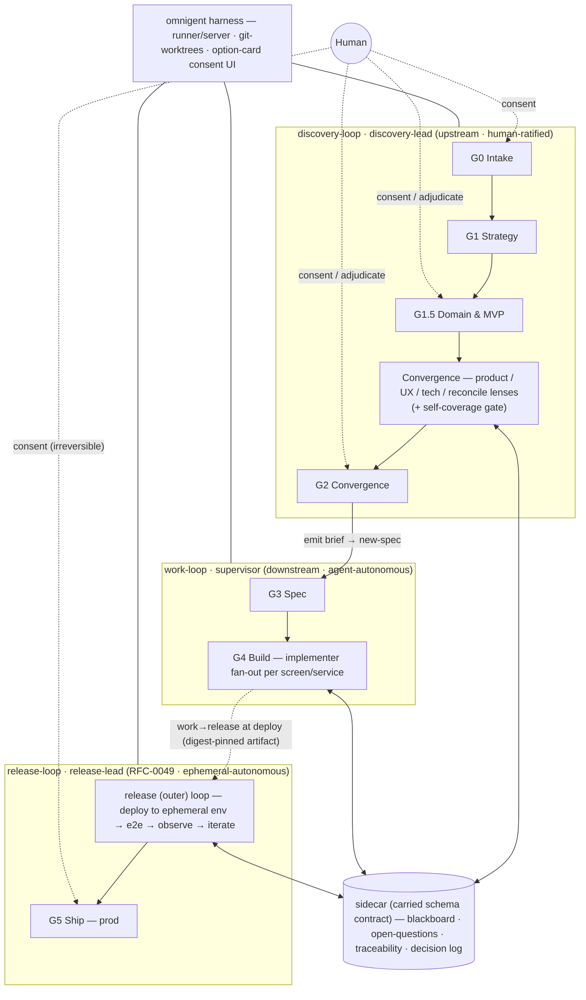

# RFC-0048: The autonomous product-team operating model — gate doctrine, the `experience` pack, and a child-effort roadmap

- **Status:** Open <!-- Draft | Open | Final Comment Period | Accepted | Rejected | Withdrawn | Experimental -->
- **Acceptance blockers** — this RFC may move Open → Accepted only after each of these lands:
  1. RFC-0053's implementing spec lands **AC0**: the carried sidecar-schema contract (DRIFT-I, at user scope).
  2. RFC-0053's implementing spec lands the `docs/discovery/<initiative>/` layout key (DRIFT-C).
  3. RFC-0053's implementing spec lands the backlog-decomposition + `loop-cohort`-ingestion ACs (DRIFT-H).
  4. The CONVENTIONS / `new-spec` follow-on lands the `Discovery:` header + discovery `type:` markers (DRIFT-G).
- **Acceptance note** — the child-set reconciliation is complete (pass dated 2026-06-26): the
  child set (experience · frame-domain · self-coverage · traceability-lint · coordinator ·
  release-loop) was **reconciled as one operating system** — a G0→G5 composed pressure test
  ([`0048-notes/10`](0048-notes/10-composed-end-to-end-walkthrough.md)) plus a
  resolve-vs-surface lens and two fresh-context adversarial passes — with every surfaced drift
  folded into § Amendments (the present contract in its *Current reconciliation state* table;
  how each was reached in the audit trail below it) and every open seam assigned to a named owner. Reconciliation and owner-assignment are the **alignment** condition for
  acceptance — *necessary but not sufficient*; the model's *success* is judged
  against the explicit pass/fail tests in the Success criteria below (§ Problem & goals). The remaining work is **prerequisite closure** (the acceptance
  blockers above), not unresolved foundation design. Drift the owed specs surface is still a bug
  to reconcile *in this RFC* (a tracked amendment), never to absorb silently downstream.
- **Author:** eugenelim
- **Approver:** eugenelim
- **Date opened:** 2026-06-25
- **Date closed:**
- **Decision weight:** heavy <!-- light | standard | heavy — sets catalogue-wide product-team doctrine, edits CONVENTIONS + work-loop, names a multi-RFC roadmap, and carries a rename + migration tail; a one-way-ish foundation, so explicit Approver sign-off and the named acceptance blockers gate it. -->
- **Related:** RFC-0043 (product rung — the `product-vision`/`product-strategy` altitudes this model's G0/G1 build on) · RFC-0030 (the `product-engineering` pack) · RFC-0041 (infra-aware `work-loop` — the *doctrine + reference-library + reuse-existing-reviewer, no new runtime* precedent this RFC mirrors) · RFC-0025 (`work-loop` light/full mode + risk triggers — the gate model this extends) · RFC-0019 (`receive-brief` — the brief→spec join, and its coverage-lint the traceability lint generalizes) · ADR-0019 (intent ontology) · `design-craft` pack (renamed by a follow-on ADR) · promoted research in [`0048-notes/`](0048-notes/)

## Reviewer brief

- **Decision:** whether to adopt an operating model that lets the catalogue act as an autonomous product team from vision → deploy-ready code, delivered as doctrine + pure-markdown skills + reference libraries (no new runtime), plus the child-effort roadmap that builds it.
- **Recommended outcome:** accept — Open → Accepted once the named acceptance blockers land.
- **Change if accepted:**
  - Adopt the two-regime gate ladder (G0–G5) + surfacing predicate + three-act human boundary as `work-loop` / CONVENTIONS doctrine.
  - Add four primitives — the `experience` pack (rename + connective UX skills), `frame-domain`, the self-coverage gate, the traceability lint — plus the `discovery-lead` agent + `discovery-loop` skill.
  - Spike (not build) the coordinator on the `omnigent` harness behind a carried sidecar-schema contract.
- **Affected surface:** CONVENTIONS (the operating model), `work-loop` doctrine, the `experience` / `product-engineering` / `core` packs, four new skills + a user-scope discovery reviewer roster; **no runtime / daemon / service**.
- **Stakes:** costly-to-reverse — it sets catalogue-wide product-team doctrine and a multi-RFC roadmap, and the rename + CONVENTIONS edits carry a migration tail; acceptance is gated by named blockers, not a single one-way door.
- **Review focus:** (1) the human-gate boundary is exactly the three irreducible acts and nothing substitutable leaks across it; (2) the no-runtime claim holds for every *delivered* artifact (the coordinator is spiked, not built).
- **Not in scope:** a new orchestration runtime / daemon / service; building the coordinator here; the G4→G5 release/deploy loop + G5 ship mechanics ([RFC-0049](0049-the-release-loop-and-company-os.md)); PMM / go-to-market seats; a 1:1 agent-per-role org chart; pixel/Figma comps; between-gate autonomy for regulated / high-assurance work.

## The ask

**Recommendation (BLUF).** Adopt an *operating model* that lets the catalogue act as
an **autonomous product team from vision → deploy-ready code** (release/ship completed
by RFC-0049's outer loop) — and deliver it the way
RFC-0041 and RFC-0043 delivered comparable cross-cutting capability: **as doctrine +
pure-markdown skills + reference libraries — no new runtime engine.** This RFC *decides the model and the roadmap*; each artifact is built
by a named child effort, not here. Concretely it adopts (a) the **two-regime principle** + a
**judgment-decomposition→equipping map** + a **risk-calibrated gate ladder and
surfacing predicate** as `work-loop`/CONVENTIONS doctrine; (b) the rename
`design-craft → experience` plus its connective UX skills; (c) three primitives
(frame-domain, self-coverage gate, traceability lint); and (d) a **coordinator
spike — not a build** — gating any orchestration RFC behind a design pass.

**Why now (SCQA).** *Situation:* the catalogue already has the product altitude
(RFC-0043), the brief→spec→`work-loop` spine (RFC-0019/0025), the architecture and
contract packs, the three reviewers, and a `design-craft` craft pack. *Complication:*
the **upstream** (vision → backlog → design) has no connective UX layer (no journey
map, service blueprint, or screen inventory), no mechanism that makes product/UX/tech
artifacts *answer each other*, and nothing that catches **domain-hallucination** and
**scope-creep** before agent errors compound and burn tokens — while the component
most at risk (an orchestrating "coordinator") is the *least* specified. *Question:*
can the catalogue become an autonomous product team without violating Principle 3
("a habit, not a tool")?

**Decisions requested.**

| ID | Question | Recommendation | Why | Decide by | Reviewer action |
| --- | --- | --- | --- | --- | --- |
| D1 | Adopt the operating model as doctrine — two regimes, the judgment→equipping map, the gate ladder G0–G5 + surfacing predicate, the three-act human boundary, and stakes-scaled gate density? | Adopt (placement + predicate + three-act boundary + stakes-density; O11/O12 resolved on paper, spike-confirmed) | It is the spine every child effort hangs from | RFC accept | Confirm the model + that the human boundary is exactly the three irreducible acts |
| D2 | Frame D1, D3–D6 as doctrine + pure-markdown skills + reference libraries (no new runtime engine), with the build loop reusing `core`'s code reviewers and discovery shipping its own distinct-named user-scope design-time reviewers? | Adopt (the coordinator's no-engine fit is excepted — it is the Decision-7 spike) | The Accepted RFC-0041/0043 precedent; leaves the CHARTER three-reviewer ceiling untouched | RFC accept | Confirm the no-runtime framing + the loop-scoped discovery reviewer roster |
| D3 | Grow the design/UX seat (`map-customer-journey`, `blueprint-service`, `inventory-screens`, `map-internal-process` + grounding/taste + voice wiring + the `experience-reviewer`) and rename `design-craft → experience`? | Adopt; rename adopted (v0.1.1 user-scope ⇒ low migration cost; `contract-acquisition` precedent — rename dirs + a governance erratum, no install-time alias) | The missing column is the design/UX seat, and `experience` names it better | RFC accept (records ADR-0038) | Confirm the seat additions + the rename + its migration path (modelled in RFC-0050) |
| D4 | Add the `frame-domain` primitive — one skill producing two typed artifacts (Domain Framing + Scope Boundary)? | Adopt (split into two artifacts — § Amendments 2026-06-26) | The single biggest correctness lever against domain-hallucination and over-scoping | RFC accept | Confirm the two-artifact split |
| D5 | Add **self-coverage** — the goal that each loop maximizes autonomy by substituting rigorous checklists for human-surfacing (**resolve-vs-surface**) — realized **per loop with loop-appropriate checklists** (design/build loops run the seven-module gate; the release loop its operational composite) and packaged as **per-loop controller doctrine** (each loop carries its own; no shared `core` library, no cross-pack coupling), non-skippable, no new reviewer? | Adopt (reframed as a cross-loop goal + packaging revised by child-3 — see § Amendments 2026-06-29) | Fixes the knowing-doing gap that lets errors compound between human gates; per-loop co-scoping keeps it present wherever each controller runs (a `core` library would be absent for the user-scope/pre-repo discovery loop) | RFC accept | Confirm the goal + the non-skippable per-loop packaging |
| D6 | Add the traceability lint — structural-orphan detection generalizing `receive-brief`'s coverage lint? | Adopt (semantic scope-creep deferred to the coordinator spike / O10; MVP stays a human call at G1.5) | Mechanizes the chain's structural integrity | RFC accept | Confirm the structural-only scope |
| D7 | Adopt `omnigent` as the (temporary) harness and run a sidecar + chief-loop validation — a spike, not a from-scratch coordinator build? | Sidecar-prototype-first (validate the typed sidecar, the chief, and consent rejection/recovery + outer cap against the worked example) | The sidecar is the connectedness verifier | RFC accept | Confirm spike-first, not build |
| D8 | Ship the chief — `discovery-lead` — as an agent + the `discovery-loop` convergence-loop skill, in `product-engineering`? | Adopt (shape confirmed by the Decision-7 prototype) | The user-facing orchestrator is content, not infra; the two-loop split keeps each loop honest | RFC accept | Confirm the agent+skill shape, the `product-engineering` home, and the G3 hand-off to `work-loop` |
| D9 | Adopt a series-execution standard — each child researches + pressure-tests + carries its full lifecycle + reconciles drift back into this RFC? | Adopt | The discipline this RFC was built with becomes the series standard; the foundation earns acceptance only by surviving its children | RFC accept | Confirm the standard + the reconcile-back-to-RFC-0048 obligation |

*(Detail for each decision cascades under § Proposal — D1, D3–D9 — and the notes it links.)*

*(The release/deploy **outer loop**, the minimum-regret deploy carve, and the
"company OS" composition are **split into the sibling [RFC-0049](0049-the-release-loop-and-company-os.md)**,
which cites this RFC as its foundation. RFC-0048 scopes the **discovery + build**
foundation — vision → spec → locally-built, deploy-ready code; the deployed e2e loop is
0049's. This split keeps each RFC reviewable.)*

## Problem & goals

**Diagnosis.** The catalogue can already *build* (downstream of a spec), but it cannot
yet *act as a product team* upstream, for four concrete reasons surfaced by tracing a
worked example (a secure personal-assistant agent) end-to-end ([`0048-notes/02`](0048-notes/02-worked-example-flow-trace.md)):

1. **No connective UX layer.** Nothing turns outcomes into a journey, a journey into a
   screen inventory, or a screen into its backing service. `voice-and-microcopy` is
   words-only; `design-craft` designs a screen but doesn't enumerate or sequence them.
2. **No reconciliation.** Today's handoffs are one-directional file drops with
   non-interpreted `Parent intent:` pointers; nothing detects that a screen has no
   backing service or that an architecture decision invalidated a product assumption.
3. **No guard against the two ways an autonomous upstream goes wrong** — hallucinating
   a domain it doesn't know, and over-scoping past the MVP — *before* those errors
   compound into wasted spec and build tokens (the myopic-greedy-commitment failure
   mode, [`0048-notes/03`](0048-notes/03-autonomy-and-gate-economics.md)).
4. **The coordinator is a noun, not a design** — every orchestration step assumes an
   engine that isn't specified, and naively specified it risks Principle 3.

**Goals.**
- Vision → deploy-ready code in this RFC (RFC-0049 owns the G4→G5 release/ship loop),
  with **autonomy maximized between gates** and the human present only at irreducible
  points (value origination; risk acceptance).
- Deliver entirely as **doctrine + pure-markdown skills + reference libraries + reuse**,
  so the capability is a *way of working*, not a runtime.
- Make each child effort **shippable and useful standalone**, so value lands even if the
  coordinator never ships.

**Non-goals** (could-have-been-goals, deliberately dropped):
- A new orchestration **runtime engine / daemon / service** (Decision 2; Principle 3).
- **Building the coordinator** in this RFC (Decision 7 — spike first).
- PMM / go-to-market / data-instrumentation **seats**; a **1:1 agent-per-role org
  chart** (MAST: fewer agents win); **pixel/Figma comps** (agents author design
  *intent specs*); **sprint ceremony / RACI** (human-coordination overhead).
- **The deploy + e2e outer loop (the G4→G5 gap) and G5's deploy mechanics** — detailed in
  [RFC-0049](0049-the-release-loop-and-company-os.md). 0048 defines the full gate arc
  (G0–G5) but *details* discovery→build (G0–G4); deploy-ready code is its hand-off.
- **Building the harness / desktop orchestration app** — it is a *tool*, not a habit
  (Principle 3); the catalogue ships the doctrine such a harness executes.
- **Between-gate autonomy for high-assurance / regulated work** — those domains
  right-size *up* (more human gates); the autonomy claim is scoped to low/moderate
  stakes.

**Success criteria.** The Goals above are directional; these are the model's
pass/fail tests. RFC-0048 succeeds when an **outside reviewer can independently
verify each row** — and each row tests the operating model's *behavior*, not
whether the child roadmap exists and has owners (that is the alignment condition
for acceptance — the Acceptance note above — which is *necessary but not
sufficient*). The acceptance blockers gate *when* these can be run end-to-end
(producers must land first — see § Rollout and backout plan), not *whether* the
model is judged by them.

| Criterion | Evidence an outside reviewer can check |
| --- | --- |
| **End-to-end path works** | A worked example reaches G0→G4 (G5 is [RFC-0049](0049-the-release-loop-and-company-os.md)) with the required discovery artifacts, a decision brief, a `Discovery:`-linked spec, and a deploy-ready component handoff — the composed walkthrough in [`0048-notes/10`](0048-notes/10-composed-end-to-end-walkthrough.md). |
| **Human gates are bounded** | Every human intervention in the worked example maps to one of the three irreducible acts — originate value · accept irreversible risk · adjudicate a genuine value conflict (Decision 1); none is a substitutable, referent-groundable judgment the surfacing predicate should have absorbed. |
| **Reconciliation is mechanical where claimed** | The [traceability lint](../specs/traceability-lint/spec.md) finds zero *structural* orphans once producers are present, and every unresolved open question is assigned to a discipline or surfaced at a gate. (*Semantic* scope-creep is not mechanizable and stays the human call at G1.5 — Decision 6 / O10.) |
| **Child efforts stand alone** | Each child artifact (D3–D6) remains useful with the coordinator never shipped, carrying its own acceptance evidence — the "shippable and useful standalone" goal above. |
| **No runtime boundary crossed** | Delivered artifacts are doctrine, pure-markdown skills, reference libraries, specs, and reviewers only; no daemon / service / orchestration runtime is introduced (Decision 2; Principle 3; Option B). |
| **Fail-closed wiring is safe** | `--strict` traceability lint, required `schema_version` checks, and automatic `loop-cohort` ingestion are enabled only after their producers/contracts land — the producers-before-consumers rule of § Rollout and backout plan. |

## Proposal

The detail cascades under each decision; the model and artifact set are specified in
full in the notes ([`03`](0048-notes/03-autonomy-and-gate-economics.md),
[`04`](0048-notes/04-artifact-inventory.md),
[`05`](0048-notes/05-judgment-decomposition-and-phases.md)) and summarized here.

**D1 — operating model (doctrine).** *Two regimes:* the generative upstream
(vision→backlog→design) has no local verifier and is **human-ratified**; the verifiable
downstream (spec→code) has tests/lint/types and is **agent-autonomous**. *Judgment
decomposition:* the seven judgment types (empirical, normative, predictive, aesthetic,
trade-off, value, accountability) each map to an equipping mechanism (research,
behavior guide, simulation, grounded referent, objective function, elicitation,
decision-packaging); only **value** and **accountability** are irreducibly human.
*Gate ladder* G0 Intake · G1 Strategy · G1.5 Domain&MVP · G2 Convergence · G3 Spec ·
G4 Build · G5 Ship, with a single **surfacing predicate**: surface iff the judgment is
value/accountability, or a substitutable judgment's referent failed. Consent gates:
G0, G1.5, G2, G5; the rest auto-advance unless a risk trigger (RFC-0025) fires.
*(0048 details G0–G4; the **G4→G5 release/deploy loop and the G5 ship gate's
mechanics are [RFC-0049](0049-the-release-loop-and-company-os.md)** — shown here for
the full arc.)*
**The seam with `work-loop`:** G3–G5 *are* the existing `work-loop`/RFC-0025 gates
(named for the ladder's continuity); only G0–G2, G1.5, and the surfacing predicate are
net-new doctrine — the ladder extends the loop, it does not duplicate it.

**D3 — the `experience` pack.** `experience` becomes the design/UX seat: the existing
four `design-craft` skills + a content cross-link to `voice-and-microcopy` + the new
connective skills (`map-customer-journey`, `blueprint-service`, `inventory-screens`) +
`map-internal-process` (RFC-0050 D9) + the `experience-reviewer` (RFC-0050 D7) +
grounding/taste enhancements. The full producer→consumer artifact inventory (8 product
+ 10 design artifacts; 4 net-new) is in [`0048-notes/04`](0048-notes/04-artifact-inventory.md).

**D4–D6 — primitives.** Domain-anchor (typed artifact + `research` wiring); self-coverage
(the cross-loop goal — autonomy via checklists that substitute for human-surfacing — realized
per loop with loop-appropriate checklists; design/build loops run the seven-module gate, the
release loop its operational composite; no new reviewer; packaging revised by child-3,
§ Amendments 2026-06-29); the traceability/scope-creep lint (a tool).

**D7 / D8 — the two loops, the `discovery-lead`, and the sidecar (design proposal).**

*Two loops, one spine* (a **third — the release/SRE outer loop — is added by
[RFC-0049](0049-the-release-loop-and-company-os.md)**). `core`'s orchestration spine
gains a second, peer loop:
- **`work-loop`** — the *build* loop: spec → plan → implement → gate → review → code.
  Downstream, verifiable, agent-autonomous. (Exists.)
- **`discovery-loop`** — the *discovery* (shaping) loop (new): vision → intents → frame-domain → blackboard
  convergence (product / UX / tech / reconcile lenses) → decision brief at consent
  gates → emits briefs/specs. Upstream, generative, human-ratified.

The names are the **dual-track** ontology a product org already speaks: `discovery-loop`
is the **discovery track** (what to build & why — Torres's continuous discovery), and
`work-loop` the **delivery track** (build it). They **hand off at G3** (`discovery-loop`
emits a brief → `new-spec` → `work-loop`) and **must not be conflated** — different
inputs, different verifier, different autonomy posture.

*The agent.* **`discovery-lead`** (proposed name) runs `discovery-loop` — the human-facing
upstream supervisor, a peer of `work-loop`'s supervisor and `implementer`, resident in
**`product-engineering`** (an opt-in product capability — `discovery-loop` is
product-discipline-specific, so it ships in the product pack, not the universal `core`).
It is a **supervisor of a discovery lens-team**, and it right-sizes between two modes:
- **Solo** (small discovery) — holds the blackboard in one context and switches lenses
  itself (cheap, no coordination cost).
- **Lens-team** (large, multi-discipline, multi-module discovery) — dispatches **parallel
  lens-agents** that each *supervise their own domain* (research/analyst · product · UX/
  design · architecture · **security/compliance**) and **bounce off each other through the
  blackboard** (the open-questions ripple), with `discovery-lead` as the **controller** —
  the proven supervisor + blackboard topology, not chat negotiation. This extends autonomy
  and parallelism: each lens runs deep and fresh-context in its domain at once. The MAST
  guardrail (arXiv:2503.13657; consolidated in
  [`0048-notes/01`](0048-notes/01-research-consolidation.md) and
  [`03`](0048-notes/03-autonomy-and-gate-economics.md)) is preserved by *how* they
  coordinate — via the blackboard + controller, never
  agent-to-agent negotiation-to-consensus.

**The discovery lens-team is loop-scoped and distinct from `work-loop`'s reviewers.** The
discovery **security/compliance** and **quality** lenses are *design-time* roles
(threat-modeling + regulated-domain compliance, and design-stage testability/reliability,
over the journey/blueprint/architecture) — shipped as discovery's **own distinct-named,
user-scope reviewer agents**, *not* `work-loop`'s code reviewers overloaded with a mode (a
user-scope and a repo-scope agent sharing a name is a resolution footgun; precedent: the
user-scope `architect` pack already ships its own `design-reviewer`). So the charter's
"three reviewers is the ceiling" is a **work-loop / code-review** constraint; the discovery
loop carries its own design-time reviewer roster — loop-scoped and user-scope, disciplined,
not a marketplace:

| Discipline / lens | Runtime primitive | Name | Pack | Scope | Required? | Degrades to |
| --- | --- | --- | --- | --- | --- | --- |
| Security / compliance (design-time) | reviewer agent — new, distinct name | `discovery-threat-reviewer` (proposed) | `product-engineering` | user-scope | required at G2 reconcile | `core`'s `security-checklists` depth when present; else its own baseline checklist |
| Quality / reliability (design-time) | reviewer agent — new, distinct name | `discovery-reliability-reviewer` (proposed) | `product-engineering` | user-scope | required at G2 reconcile | `core`'s `operational-safety` + `quality-engineer` depth when present; else its own baseline checklist |
| Architecture (design-time) | reviewer agent — reuse | `design-reviewer` | `architect` | user-scope | optional (detect-and-degrade) | absent → `discovery-lead` holds the arch lens itself |
| Research/analyst · product · UX/design | skill (+ a forked `experience-reviewer` for the UX/design lens — RFC-0050 D7) | `research`/`identify-perspectives` · `frame-intent`/`decompose-intent` · `map-customer-journey`/`map-internal-process`/`design-critique`/… | `research` · `product-engineering` · `experience` | user-scope | optional (detect-and-degrade) | product-only discovery |

None of these is `work-loop`'s code `security-reviewer` / `quality-engineer` /
`adversarial-reviewer`; the CHARTER ceiling on *those* is untouched. **This table is
authoritative for the roster** — Decision 2 and the walkthrough's reconcile row refer to it.

> **Reconciliation (child-1, 2026-06-29 — see § Amendments).** A pressure-test of child-1
> (RFC-0050, the `experience` pack) found the **UX/design row above is asymmetric**: security and
> reliability each got a forked design-time reviewer, but UX/design relied on a *skill*
> (`design-critique`) that, run in the authoring context, marks its own homework. RFC-0050 **D7
> (adopted)** admits a forked-context **`experience-reviewer`** (collision-hardened name — *not*
> `design-reviewer`) — under the generalized agent-addition policy
> ([ADR-0042](../adr/0042-agent-additions-keyed-to-loop-and-work-type.md), supersedes ADR-0023),
> on the **agent-autonomous-where-possible** posture (the design review between human-value-add
> gates runs without a human, so it cannot be a same-session skill). On RFC-0050's acceptance the
> UX/design row reads *"skill + an opt-in forked `experience-reviewer`"*; recorded as a tracked
> amendment that binds then.

**Names are collision-hardened by construction, not by dispatch.** Reviewers are dispatched
by the orchestrator *selecting a subagent matching a role* (the `work-loop` idiom), and
exact-name dispatch is **not** available on every adapter — so the names, not the harness,
must carry the distinction. Each discovery reviewer therefore takes a **discipline-word
head** (`threat`, `reliability`) that is *not* a keying token of any `core` reviewer and does
not contain a `core` reviewer's name as a substring (the trap a literal `discovery-security-reviewer`
would spring — it embeds `security-reviewer`; `discovery-quality-reviewer` would attract on the
shared `quality` token), following the `architect` pack's parallel-not-nested `design-reviewer`
precedent. As a second, name-independent guard, each discovery reviewer's `description:` **must
lead with a design-time-only cue** — *"Design-time / discovery-loop ONLY — reviews
journey/blueprint/architecture artifacts, never code diffs; for diff review use `core`'s
`security-reviewer` / `quality-engineer`."*

**Lens conflicts:** factual disagreement → `discovery-lead` arbitrates via referents on the
blackboard; *value* disagreement (security says no, product says ship) → the human at G2
(the conflict-adjudication act). **Progressive enhancement:** hard deps are
product-engineering's intent skills + the carried sidecar-schema contract + the G3 handoff
(schema home revised — § Amendments 2026-06-26) + the two `product-engineering` discovery reviewers
(`discovery-threat-reviewer`, `discovery-reliability-reviewer`), **required at G2 reconcile**
per the roster table above and degrading only in *depth* — they fall back to their own
baseline checklists when `core`'s `security-checklists` / `operational-safety` +
`quality-engineer` depth is absent, never to nothing. The `research` / `experience` /
`architect` lenses are the **optional (detect-and-degrade)** set — product-only discovery
alone, lighting up into the full lens-team as those packs install.

*The sidecar (catalogue doctrine).* The typed state the two loops share is shipped as a
**carried versioned schema contract** (harness-neutral; § Amendments 2026-06-26 revised this
from "schema in `core`" to a contract that travels with its producer pack); the *store* is
the harness's. Four slots:
- **blackboard** — the typed artifact slots (= the artifact inventory), versioned;
- **open-questions queue** — `{raised-by, target-discipline, question, status, resolution}`;
- **traceability matrix** — the outcome→…→component edge set the lint checks (orphan = defect);
- **decision log** — `{gate, decision, ratified-by, rationale, reversibility-class, ts}`
  (doubles as the audit trail the high-stakes case needs).

The sidecar is the **connectedness verifier**: omnigent's worktrees hold the artifact
*files*, but only this typed state makes "everything holds together" *checkable*.

*Data-handling boundary.* Those four slots can carry product strategy, personas, security
findings, customer/domain facts, and consent rationale — so the sidecar is a
**data-classification surface**, not only the integrity one RFC-0053 § Security & integrity
contract covers. The contract here: **regulated- or secret-bearing artifacts surface to the
human / `discovery-threat-reviewer` lens before being written to a shared repo-backed
sidecar** (`_state/`), never silently committed. The concrete rules are **owned downstream by
RFC-0053's implementing spec** — per-slot classification (`public` / `internal` / `sensitive`
/ `regulated`, or an adopter's repo-local equivalent), redaction guidance for examples and
promoted notes, and retention/export expectations for `_state/` and harness-backed stores —
the same delegate-to-the-child idiom the schema and layout keys use.

*The harness.* `omnigent` (DAIS 2026) runs all of the above now; the sidecar's
harness-neutral schema keeps a future bespoke harness open. The Decision-7 work is a
**prototype of the sidecar + `discovery-loop` on `omnigent`** against the worked example —
not a paper design.

*Artifact organization & the backlog bridge.* `discovery-loop` converges a
**decision-brief** and decomposes it into a **backlog** — the bridge artifact: ordered,
dependency-aware **work items**, each a buildable slice scoped to one (or few) distributed
component(s). `work-loop` pulls them **one at a time** in topological order (`loop-cohort`),
so a multi-module discovery slices cleanly into per-component build runs — the **service
blueprint is the slicing instrument** (each journey step's backstage → a component;
cross-component edges become `depends-on`). In a single product monorepo: discovery
artifacts under `docs/discovery/<initiative>/` (sidecar in `_state/`), the backlog at
`…/backlog.md`, briefs/specs in the existing `docs/product/briefs/` + `docs/specs/` (each
spec naming its `Component:`), and built components in `packages/<component>/`. **These
paths are defaults, never hardcoded:** skills resolve in three tiers — `agentbundle-layout.toml`
config (RFC-0040) → designed default → **discover-by-marker** (search the workspace for the
artifact's canonical filename + frontmatter `type:` if the adopter chose a different layout).
`init-project`/`adapt-to-project` seed the config; each skill creates its dir lazily on
write. Full ontology + folder layout (incl. the establish-and-resolve doctrine) in
[`0048-notes/08`](0048-notes/08-artifact-layout-and-backlog.md).

*Diagram.*

*(The **release (outer) loop** is a loop sitting in the G4→G5 gap, not a numbered gate;
**G5** is the human consent gate at its exit. The release loop + G5's mechanics are
[RFC-0049](0049-the-release-loop-and-company-os.md)'s — shown here for the full arc.)*

*End-to-end, by skill · subagent · artifact · human* (anonymized `example-assistant`):

| # | Gate / phase | Driver | Skill(s) (pack) | Artifact | Human |
| --- | --- | --- | --- | --- | --- |
| 1 | **G0 Intake** | `discovery-lead` | `frame-intent` (product-engineering) | product-vision intent | **ratifies** the vision / scale / appetite read (consent) |
| 2 | **G1 Strategy** | `discovery-lead` | `de-risk-intent`, `decompose-intent` (PE); `research` (research) subroutine; `identify-perspectives` (research) if multi-stakeholder | capability intents · outcomes · assumption test · tension map | none, unless a scope one-way-door or logged conflict |
| 3 | **G1.5 Domain & MVP** | `discovery-lead` | `frame-domain` (PE) wrapping `research` applied + (brownfield) `decision-archaeology` (research) | Domain Framing + Scope Boundary · persona | **ratifies the MVP boundary** (consent) |
| 4a | Convergence — product | `discovery-lead` | `decompose-intent` (PE) | feature intents | — |
| 4b | Convergence — UX & process | `discovery-lead` | `map-customer-journey` → `inventory-screens` (+ per-screen briefs) → `blueprint-service`; `map-internal-process` (as-is/to-be) where the initiative touches internal operations (experience) | journey · screen inventory + briefs · service blueprint · internal process flow | — |
| 4c | Convergence — design | `discovery-lead` | `aesthetic-direction`, `design-critique` (experience; both **authoring-time** — the fresh-context design review is `experience-reviewer` at row 4e, not `design-critique`); `voice-and-microcopy` (PE) | aesthetic direction · critiques · copy deck | — |
| 4d | Convergence — tech | `discovery-lead` | `architect-design`, `architect-diagram` (architect); `api`/`event-contract` (contracts) | C4 · domain model · contracts | — |
| 4e | Convergence — reconcile | `discovery-lead` | discovery reviewer roster — `discovery-threat-reviewer` + `discovery-reliability-reviewer` (user-scope), plus `experience-reviewer` if `experience` is installed (UX/design artifacts — RFC-0050 D7) and `design-reviewer` if `architect` is installed (architecture artifacts) — as **live lenses**; traceability lint; self-coverage gate (pre-mortem · taxonomy · scenario-variation · fresh-context) | resolved open-questions · coverage record · updated traceability matrix | only if an **irreducible tension / value conflict** surfaces |
| 5 | **G2 Convergence** | `discovery-lead` | (renders the blackboard) | **decision brief** (journey + screens + arch + tension/assumption ledger) | **ratifies the "what"**; **adjudicates conflicts** (consent) |
| 6 | Brief emit (per feature) | `discovery-lead` | `decompose-intent` (PE) | brief (`docs/product/briefs/`) | — |
| — | **G3 handoff** | → `work-loop` | `receive-brief` → `new-spec` (core); `security-reviewer` at spec stage | spec | none, unless a risk trigger fires |
| 7 | **G4 Build** | `work-loop` supervisor | `implementer` fan-out per screen/service (core); `contract-acquisition` + platform skill; `adversarial-reviewer` / `security-reviewer` / `quality-engineer` | code · tests | none (tests are the verifier) |
| — | **G4→G5: release loop + G5 Ship** | → **RFC-0049** | `release-lead` + deploy/e2e on ephemeral envs (detailed in RFC-0049) | deploy · e2e · prod ship | **ratifies prod ship** (consent, irreversible) |

Steps 1–6 are `discovery-loop` under `discovery-lead`; step 7 is `work-loop`; they meet at
the G3 brief→spec handoff. The G4→G5 release/deploy loop + ship is **RFC-0049**'s. The
sidecar threads all of it — every artifact is a blackboard slot, every consent a
decision-log entry.

### Deployment architecture — how the loops compose (runtime-agnostic)

The three loops are **separate deployment units**, not one process. What composes them is
**durable artifacts with stable, location-independent ids** — never shared memory or
agent-to-agent chat. This is what lets each loop run in its own environment (its own context,
container, or repo checkout) on whatever substrate the adopter runs — *we ship the loop-teams
and the handoff contract, never the runtime that schedules them* (Principle 3; an autonomous-agent
runtime, a workflow engine, or a CI matrix are all valid hosts — none is codified).

- **The loop is the unit.** Each loop = a supervisor + its agents + the skills it needs,
  installed into an environment: `discovery-loop`/`discovery-lead` (user-scope, workspace-portable
  — a PM/designer environment, possibly pre-repo); `work-loop`/supervisor + `implementer`
  (repo-scope, **per-module ≈ per-repo**, fans out in parallel); `release-loop`/`release-lead`
  (repo-scope, in the build repo). Scope + cadence dictate the environment.
- **The seams are artifacts, not calls.** discovery emits a **decision brief + backlog** (the
  bridge); `work-loop` consumes a **brief/spec** and emits **merged code + tests**; `release-loop`
  consumes merged code and emits a **deploy**. Every cross-loop edge resolves through a stable id
  (marker slug / `contract@version` / Backstage `kind:namespace/name`) — the same cross-repo
  convention the traceability lint walks (§ Amendments, 2026-06-25). An initiative entering the
  backlog triggers a discovery environment; its emitted backlog items trigger (parallel) work-loop
  environments; merges trigger the release environment. The **backlog/queue is the coupling**, not
  a daemon.
- **Humans sit at the human-value-add gates, agents run between them.** The operating model is
  **agent-autonomous where possible, human review reserved for the value/judgment calls** — G0
  (ratify vision), G1.5 (ratify MVP boundary), G2 (ratify the "what" + adjudicate conflicts), and
  any one-way-door (G5 prod ship). Everything verifiable in between — spec→code→tests, reversible
  deploys — runs without a human.
- **The reviewers are what make "autonomous between gates" safe.** Each loop's forked-context
  reviewers substitute for the human at the *non*-value-add review points: `work-loop`'s three code
  lenses; discovery's `discovery-threat-reviewer` + `discovery-reliability-reviewer` + (RFC-0050 D7)
  `experience-reviewer` + (architect) `design-reviewer`. A loop can run unattended **only because**
  its reviewers hold the quality bar a human would otherwise hold — which is exactly why each design-time
  discipline needs its own forked reviewer (the RFC-0050 D7 roster correction), decided within
  ADR-0042's loop/work-type agent-addition policy.
- **Self-coverage is the goal that pushes the autonomy boundary outward.** Reviewers hold the bar;
  *self-coverage* is each loop's own discipline for **substituting rigorous checklists for what
  would otherwise be surfaced to a human** — resolve autonomously everything a referent or checklist
  can resolve (**resolve-vs-surface**), and surface only the irreducible (value origination,
  irreversible risk, value conflict). It is realized **per loop, with loop-appropriate checklists**:
  the design/build loops (`work-loop`, `discovery-loop`) run the **seven-module gate**
  ([RFC-0051](0051-the-self-coverage-gate.md) owns the primitive — wired in `work-loop`, and for
  discovery in [RFC-0053](0053-the-discovery-loop.md)); the **release loop** realizes the same
  goal through an **operational composite** — `operational-safety` + `security-reviewer` +
  `quality-engineer` + the automated convergence policy + the minimum-regret carve as its
  resolve-vs-surface disposition ([RFC-0049](0049-the-release-loop-and-company-os.md)). The shared
  cross-loop **seam** is the goal + resolve-vs-surface + a non-skippable coverage record; each loop
  carries its own instantiation co-scoped (Decision 5; packaging revised by child-3 — § Amendments
  2026-06-29). No new runtime, no new reviewer.

So "deploy the autonomous product team" = stand up one environment per loop (per initiative for
discovery, per module for build, per build-repo for release), wire them through the backlog + the
stable-id artifacts, place humans at the four ratify gates, and let each loop's reviewer roster
hold the line in between. The catalogue makes every loop-team deployable into that shape;
the substrate is the adopter's.

## Options considered

Axis: **how much new machinery** the capability is delivered as (this exhausts the
space — every delivery sits somewhere on "nothing → prose doctrine → new tool → new
engine → monolith").

| Option | Shape | Verdict |
| --- | --- | --- |
| **A. Do nothing** | upstream stays human-heavy; agents build only downstream | Cost of delay: the connective + guard gaps recur on every product; the team re-derives them by hand each time. Rejected. |
| **B. Doctrine + pure-markdown skills + reference libraries + markdown reviewers** ★ | the RFC-0041 / RFC-0043 idiom | **Recommended.** Fits Principle 3; primitives stand alone; precedent is Accepted. |
| **C. New orchestration runtime engine** (coordinator service/daemon) | MetaGPT/ChatDev-shape | Rejected for two distinct reasons: (i) Principle 3 forbids shipping runtime infrastructure; (ii) *separately*, where such an engine coordinates multiple agents, MAST measures 41–86% failure — though our convergence loop runs as single-context skill-lenses, so the primary objection is charter, not thrash. |
| **D. Single mega-pack / monolith** | one "autonomous-team" pack | Un-reviewable; couples standalone-useful primitives; blocks the parallel child-session plan. Rejected. |

Prior art grounds the axis: RFC-0041 explicitly chose the B-shape ("no executable
tooling, no new reviewer, no new runtime") over an engine for infra `work-loop`;
MetaGPT and ChatDev are C-shape and the MAST study measures their failure cost
([`0048-notes/01`](0048-notes/01-research-consolidation.md)); the charter forbids C.

## Risks & what would make this wrong

**Pre-mortem.**
- *The coordinator doctrine proves un-followable by a single agent* → the gate ladder
  becomes ceremony. **Mitigation:** Decision 7 spikes it first; the primitives (D3–D6)
  deliver value regardless.
- *Generative-upstream autonomy is over-claimed* → either the human drowns in surfaced
  decisions, or the agent runs off-domain. **Mitigation:** the surfacing predicate
  batches consent at four gates; the frame-domain + self-coverage gate raise the floor.
- *The rename breaks adopters.* `design-craft` is `default-scope = user`, so a rename
  touches every repo an adopter opens — *wider* per-adopter surface, not narrower — and
  no pack-level rename/alias field exists today (surfaces pinned in § Evidence & prior art →
  *Source pins for current-state claims*). **Mitigation:** the
  rename mechanism is OQ1; default to the *actual* `infra-contract-acquisition →
  contract-acquisition` precedent (rename the dirs, bridge frozen governance via an RFC
  § Errata — that rename shipped **no** install-time alias), unless child-1 designs a
  pack-alias mechanism. Its early stage (v0.1.1, pre-stable) limits blast radius
  regardless; version is a recency, not an install-count, signal.
- *The primitives degrade to checkbox ceremony* (the taxonomy-gate smell,
  [`0048-notes/03`](0048-notes/03-autonomy-and-gate-economics.md)). **Mitigation:**
  require a substantive paragraph per dimension, not a yes/no.

**Key assumptions (falsifiable).**
- *Judgment decomposes into referent-grounded labor + a small irreducible core*
  (Kahneman: valid intuition needs a regular environment with feedback). If most
  upstream judgment is *not* referent-groundable, the autonomy claim collapses to "do
  nothing."
- *Coding-autonomy evidence does NOT transfer to generative design* — so we **gate**
  the upstream, we don't automate it. If it did transfer, the gates are over-cautious.
- *The doctrine framing passes Principle 3* — see the spike result below.

**Drawbacks.** More skills to maintain; the rename's migration tail; added conceptual
surface in CONVENTIONS (the operating model); risk of over-process on a tiny product —
mitigated by right-sizing the ladder the way `work-loop` right-sizes light vs full.

## Evidence & prior art

**Spike / de-risk result.** The riskiest assumption is the coordinator's **Principle-3
fit** — if the only way to orchestrate is a runtime engine, the whole initiative is
out of charter. Spike (timeboxed repo sweep): RFC-0041 delivered an end-to-end infra
loop as *doctrine + a reference library + reuse of `quality-engineer`*, explicitly "no
engine, no new runtime, no new reviewer," and was Accepted in a day; RFC-0043 added two
product altitudes "prompt-only … no engine, hook, or new skill," also Accepted.
`work-loop`'s own supervisor mode is *doctrine + the `loop-cohort` script*, not a
service. **Conclusion:** the no-engine verdict is *demonstrated* for D1–D6 (they add
only markdown skills, a reference library, a typed artifact, and a structural lint — no
runtime). For the **coordinator** it is a *hypothesis*: `loop-cohort` covers none of
O1/O2/O3/O5/O7 today, so the doctrine-not-engine fit is exactly what the Decision-7
spike must confirm (is the convergence doctrine single-agent-followable without new
runtime?). The assumption survives for D1–D6; the coordinator is spiked, not built,
precisely because its fit is unproven.

**Repo precedent.** RFC-0043, RFC-0030, RFC-0041, RFC-0025, RFC-0019, ADR-0019,
`design-craft` pack, `work-loop` supervisor-mode + `loop-cohort`,
`receive-brief`'s `lint-brief-coverage.py`. **Dependency note:** RFC-0043's product-rung
spec is **Shipped** (`docs/specs/product-rung/spec.md` status line; pinned in § Evidence & prior art →
*Source pins for current-state claims*), so the `product-vision` /
`product-strategy` altitudes that G0/G1 build on are live — a satisfied dependency, not
an open risk.

**External prior art** (fetched; full citations in [`0048-notes/01`](0048-notes/01-research-consolidation.md)
and [`03`](0048-notes/03-autonomy-and-gate-economics.md)): MAST (multi-agent failure
41–86%; arXiv:2503.13657) · TheAgentCompany (best model 30.3%, *excludes* product
ideation; arXiv:2412.14161) · MetaGPT (arXiv:2308.00352) / ChatDev (arXiv:2307.07924)
as engine-shape role pipelines · Anthropic multi-agent research system + long-running-
harness posts (orchestrator-worker; harness-as-gate) · Claude Code plan mode (the
capability-constraint gate) · Reflexion (arXiv:2303.11366) / Self-Refine
(arXiv:2303.17651) · pre-mortem/prospective hindsight · Kahneman (valid intuition needs
a referent) · SVPG / Torres OST / Patton story mapping / NN-g service blueprints /
Shape Up (the product-team artifact ontology).

**Harness prior art — Databricks `omnigent`** (open-sourced DAIS 2026;
[blog](https://www.databricks.com/blog/introducing-omnigent-meta-harness-combine-control-and-share-your-agents),
[repo](https://github.com/omnigent-ai/omnigent)). A real **meta-harness** above headless
coding-agent CLIs (Claude Code / Codex / Cursor / Kiro / Pi) that *independently
validates this RFC's doctrine/harness split*: a persistent **runner/server** control
plane; **policy gates enforced outside the prompt** (the "capability-constraint, not
instruction" principle, made structural); **git-worktrees as the shared blackboard**;
declarative **YAML agent defs**; a three-level governance stack (server/agent/session)
with human-in-the-loop pauses; and **cross-vendor review** (Claude reviews Codex —
different blind spots). Its reference orchestrator **Polly** is a planner that writes no
code and fans work out to per-worktree workers — a working instance of this RFC's "chief
= a single planning context, parallel only for disjoint work." Its documented alpha gaps
(no general blackboard beyond worktrees, no cross-run memory, no agent registry /
team-topology) map exactly onto the state-sidecar this RFC's O2/O3 + team-composition
contract would supply. **Implication for Decision 7:** the coordinator spike should
target `omnigent` (or its patterns) as the reference runtime rather than design a harness
from scratch — strong evidence the no-engine framing holds.

**Promoted research.** The nine distilled documents in [`0048-notes/`](0048-notes/) —
research consolidation, the worked-example flow trace, the autonomy/gate economics, the
artifact inventory, the judgment decomposition, the per-pack delta + orchestration, the
per-screen brief format, the artifact layout + backlog, and the gap resolutions + lens
sample-bank. (The three-loops + company-OS note moved to [RFC-0049](0049-the-release-loop-and-company-os.md).)

**Source pins for current-state claims.** Several load-bearing claims describe mutable
state — pack versions, spec status, an external repo, the child-set roster — that future
readers cannot re-derive from the prose. Each is pinned to the exact surface checked and
the date it was checked, so an outside reviewer can re-verify (or flag staleness) before
acceptance. Where a surface cannot be pinned to an immutable revision, the row says so
explicitly.

| Claim | Surface checked | As of |
| --- | --- | --- |
| No pack-level rename/alias field exists | `packages/agentbundle/agentbundle/config.py` (pack-manifest model) + `commands/install.py` (installer manifest handling — aliasing is adapter-only, e.g. `kiro`→`kiro-ide`) + `packs/design-craft/pack.toml`; ADR-0038 records the chosen no-alias rename path | 2026-06-26 |
| `design-craft` is v0.1.1 and user-scope (⇒ low migration cost) | `packs/design-craft/pack.toml` — `version = "0.1.1"`, `default-scope = "user"` | 2026-06-26 |
| Product-rung spec is Shipped | `docs/specs/product-rung/spec.md` status line — `**Status:** Shipped` | 2026-06-26 |
| `omnigent` provides runner/server, gates-outside-the-prompt, worktree blackboard, YAML agent defs, cross-vendor review (⇒ runs on omnigent now) | Databricks DAIS-2026 announcement — [blog](https://www.databricks.com/blog/introducing-omnigent-meta-harness-combine-control-and-share-your-agents) + [repo](https://github.com/omnigent-ai/omnigent); feature set as-described in the announcement — **unverified against a pinned commit/tag; an external repo moves, so confirm against the repo's then-current revision before the Decision-7 implementation/spec depends on a specific omnigent feature set (non-blocking for this RFC's acceptance — the doctrine ships harness-neutral, so omnigent is an existence proof, not a dependency)** | 2026-06-26 |
| Child set complete and reconciled | the RFC index rows + the child RFC/spec paths in § Follow-on artifacts — RFC-0050, RFC-0051, RFC-0053, and specs `frame-domain` / `traceability-lint` | 2026-06-26 |

The MAST design guardrail invoked in the body (Decision 8 / the lens-team topology) is
arXiv:2503.13657, consolidated in [`0048-notes/01`](0048-notes/01-research-consolidation.md)
and [`03`](0048-notes/03-autonomy-and-gate-economics.md).

## Open questions

*All foundation-level questions are decided (folded into the body), each carrying a
recommendation the approver ratifies at acceptance:*
- `design-craft` → **`experience`** rename — adopted (Decision 3; migration via the
  `contract-acquisition` precedent).
- the chief's name **`discovery-lead`** — adopted (Decision 8).
- **self-coverage gate packaging** — resolved (Decision 5), **packaging revised by child-3**:
  per-loop co-scoped doctrine (each loop carries the gate in its own skill at its own scope),
  non-skippable, no shared `core` library, no cross-pack coupling. See § Amendments (2026-06-29) +
  [RFC-0051](0051-the-self-coverage-gate.md).
- **build→deploy boundary** — **delegated to [RFC-0049](0049-the-release-loop-and-company-os.md)**
  (the release loop + minimum-regret deploy carve); out of 0048's scope.

**No open questions remain at the foundation level.** Remaining unknowns are *delegated to
the child efforts*. As of **2026-06-26 the child set is complete and reconciled** (the
snapshot — the RFC index rows and the child RFC/spec paths — is pinned in § Evidence & prior art →
*Source pins for current-state claims*; see also the
Acceptance note at the top and the § Amendments discharge block), and the model is aligned;
**acceptance is blocked** only by the owner-assigned follow-ons (the CONVENTIONS
`Discovery:` edit; RFC-0053's implementing spec carrying AC0 + the layout key + the backlog
ACs), at which point Open → Accepted is a one-line status change over an already-aligned
model.

## Follow-on artifacts

Filled on acceptance — the child-effort roadmap (each a fresh-session brief naming its
`0048-notes/` reading and dependencies):

- **ADR:** rename `design-craft → experience`. · **ADR:** the two-regime gate model +
  surfacing predicate.
- **RFC (child 1):** the `experience` pack (rename + 3 connective skills + grounding/
  taste enhancements + voice wiring). *Wave 1, parallel.*
  *Drafted (Open): [`0050-the-experience-pack.md`](0050-the-experience-pack.md) — records
  ADR-0038 (the `design-craft → experience` rename); its two reconciliations are folded into
  § Amendments (2026-06-26, child-1).*
- **Spec (child 2):** the frame-domain primitive. *Wave 1, parallel.*
  *Drafted: [`docs/specs/frame-domain/`](../specs/frame-domain/spec.md) — the three-component
  typed artifact wrapping `research` applied mode; surfaced the `docs/discovery/` layout-key
  drift reconciled at § Amendments DRIFT-C.*
- **RFC (child 3):** the self-coverage gate (per-loop controller doctrine + reference modules).
  *Wave 1, parallel.* *Drafted (Open): [`0051-the-self-coverage-gate.md`](0051-the-self-coverage-gate.md)
  — the non-skippable coverage gate each loop controller carries in its own skill at its own
  scope; **amends D5's packaging** (shared `core` library → per-loop co-scoped doctrine, no
  cross-pack coupling) — recorded at § Amendments (2026-06-29).*
- **Spec (child 4):** the traceability + scope-creep lint. *Wave 1, parallel.*
  *Drafted: [`docs/specs/traceability-lint/`](../specs/traceability-lint/spec.md)
  (structural orphans only; semantic scope-creep stays the human call at G1.5 per
  Decision 6 / O10).*
- **Spike → RFC (child 5):** the coordinator contract. *Wave 2; depends on 1–4.*
  *Drafted (Open): [`0053-the-discovery-loop.md`](0053-the-discovery-loop.md)
  — the spike ran (the typed sidecar + `discovery-loop` prototyped against the worked
  example; no-engine framing demonstrated on one example + a reproducible lint); the
  contract (sidecar schema · gate state machine · rejection/recovery + cascade-invalidation
  · outer cap · supervisor topology · security/integrity ACs) is specified. Spike artifacts
  in [`0053-notes/`](0053-notes/).* **Its implementing spec carries the seams the discharge
  assigned to it: AC0 — the carried sidecar-schema contract (§ Amendments DRIFT-I); the
  `docs/discovery/<initiative>/` layout key (DRIFT-C); and the backlog-decomposition +
  `loop-cohort` cross-component-ingestion ACs (DRIFT-H).**
- **[RFC-0049](0049-the-release-loop-and-company-os.md) (child — deploy):** the
  release (outer) loop + minimum-regret deploy carve + company-OS composition.
  *Already drafted; amends this RFC's gate arc / company-OS framing on landing.*
- **CONVENTIONS edit:** the operating model (two regimes, gate ladder, surfacing
  predicate). *(The minimum-regret deploy boundary — reversible ⇒ autonomous; irreversible
  ⇒ human — is RFC-0049's CONVENTIONS slice; the two land as one operating-model section.)*
  **Also carries the `new-spec` `Discovery:` up-edge header + the `type:` markers on discovery
  artifacts (§ Amendments DRIFT-G)** — the producer the traceability lint walks at G3; it must
  land before the lint is wired fail-closed (`--strict`) at a convergence gate.

## Rollout and backout plan

The Current reconciliation state table below names *what* the corrections in
force are and *who* owns each. This table names *how each lands and how to back
it out* — the operational half the design-doc rollout bar asks for. Two rules
govern the whole set:

- **Producers land before consumers; nothing is wired fail-closed until its
  contract has landed.** The `--strict` traceability lint, required
  `schema_version` checks, and automatic `loop-cohort` ingestion are each the
  *last* step for their change, never the first — so a half-migrated state is a
  warning, not a build break.
- **Backout is reversion to the convention-tolerant fallback, not a separate
  compatibility mode.** Each change degrades to the behavior that held before it
  (convention-only reads, default + marker layout, non-strict lint, manual
  work-item handoff). There is no partial-compatibility surface to maintain or
  later remove.

The owner named here is the **person/process accountable for landing and, if
needed, reverting the change** — concretely, the author/approver of the spec or
edit named in the row, which is the same artifact named in the Current
reconciliation state table's *Owner / blocker* column.

| Change | Rollout owner | Rollout shape (order) | Backout / rollback |
| --- | --- | --- | --- |
| `design-craft → experience` rename | RFC-0050 / ADR-0038 implementing-spec owner | Wave 1. Rename dirs + manifests + cross-links + layout key in one change; bridge frozen governance via ADR-0038 errata. No install-time alias. | Revert the rename patch before acceptance. No install-time alias means there is no partial-compatibility mode to maintain — the old name is either fully live or fully historical. |
| Carried sidecar schema (DRIFT-I) | RFC-0053 implementing-spec owner | Land the schema reference first as **AC0**; consumers stay convention-tolerant (read by convention + a `schema_version` stamp) until compatibility checks exist. | Keep consumers in convention-only mode; do not require `schema_version` compatibility checks until AC0 passes. |
| `docs/discovery/<initiative>/` layout key (DRIFT-C) | RFC-0053 implementing-spec owner | Add the layout key, then update producers to read it; default + marker remains the fallback until it binds. | Remove/ignore the config key; default + marker behavior stays valid. |
| `Discovery:` header + discovery `type:` markers (DRIFT-G) | CONVENTIONS / `new-spec` follow-on owner | Add producers first (`new-spec` emits the header + markers); the traceability lint reports warnings before it runs `--strict`. | Keep the lint non-strict; specs without headers remain warnings, not failures. |
| Backlog → `loop-cohort` ingestion (DRIFT-H) | RFC-0053 implementing-spec owner | Add the decomposition AC, then the ingestion AC; validate on the worked example before anything depends on it. | Keep the handoff as a manual work-item list; do not route through `loop-cohort` automatically. |

## Amendments (foundation reconciliations)

Per the Acceptance note, drift a child surfaces against this foundation is
reconciled **here**, as a tracked amendment, not absorbed silently downstream.
This section is two layers: the **Current reconciliation state** table directly
below is the authoritative present contract; the **amendment history** that
follows it (the dated entries and the *Foundation reconciliation discharge*
block) is the audit trail of how those corrections were reached. Where a
historical entry carries superseded wording, the current-state table wins.

### Current reconciliation state

The corrections in force today — read these, not the log, for the present
contract:

| Area | Current rule | Owner / blocker |
| --- | --- | --- |
| Sidecar schema | Carried in `discovery-loop` at user scope; consumers read instances by convention + a `schema_version` stamp. | RFC-0053 implementing spec **AC0** (DRIFT-I) |
| Sidecar data handling | Sidecar slots are a **data-classification surface**; regulated/secret-bearing artifacts surface to the human / `discovery-threat-reviewer` lens before shared repo-backed writes (`_state/`). | RFC-0053 implementing spec owns per-slot classification, redaction, retention/export (R10) |
| Discovery layout | The `docs/discovery/<initiative>/` config key is owned by RFC-0053's implementing spec; default + marker only until it binds. | RFC-0053 implementing spec (DRIFT-C) |
| Discovery reviewers | `discovery-threat-reviewer` + `discovery-reliability-reviewer` (user-scope, distinct-named); `core`'s depth libraries are optional detect-and-degrade enhancers. | RFC-0053 / `discovery-loop` (DRIFT-E) |
| Spec up-edge | `new-spec` produces the `Discovery:` header + discovery `type:` markers; must land before the traceability lint runs `--strict`. | CONVENTIONS / `new-spec` follow-on (DRIFT-G) |
| Backlog handoff | RFC-0053's implementing spec owns decision-brief → work-item decomposition and `loop-cohort` cross-component ingestion. | RFC-0053 implementing spec (DRIFT-H) |
| Release-loop reviewer reuse | `release-engineering` is **repo-scope**, installed in the build repo; `release-lead` therefore **reuses** `core`'s repo-scope `quality-engineer` / `security-reviewer` / `operational-safety` — sound because release runs **downstream, in the build repo** where `core` is installed. The scope-inverse of discovery's own-reviewer resolution (user-scope, pre-repo); same footgun rule, opposite scope. | RFC-0049 / [release-loop spec](../specs/release-loop/spec.md) |
| Agent-addition governance | The reviewer-ceiling reading is **generalized** into a loop/work-type-keyed agent-addition policy ([ADR-0042](../adr/0042-agent-additions-keyed-to-loop-and-work-type.md), supersedes ADR-0023): add an agent only where it clears a value test (independence / parallelism / distinct surface-cadence); the core `work-loop` code-review gate stays capped at three lenses. The discovery roster and any new design-time reviewer are decided *within* this policy. | ADR-0042 (Accepted) / RFC-0050 D7 |
| UX/design design-time reviewer | **RFC-0050 D7 adopted** (binds on RFC-0050 acceptance): the UX/design lens gains an opt-in forked `experience-reviewer` (collision-hardened, *not* `design-reviewer`) for autonomous design review between human-value-add gates; `design-critique` stays the authoring-time skill. | RFC-0050 D7 |
| Self-coverage scope + packaging | **A cross-loop goal realized per loop, packaged as per-loop co-scoped doctrine — not a shared `core` library** (reframes + revises D5). *Goal:* each loop maximizes autonomy by substituting rigorous checklists for human-surfacing (resolve-vs-surface). *Instantiation:* the design/build loops (`work-loop`, `discovery-loop`) run the **seven-module gate**; the **release loop** realizes the same goal through an **operational composite** (`operational-safety` + `security-reviewer` + `quality-engineer` + the convergence policy + the minimum-regret carve) — RFC-0049. *Packaging:* each loop carries its own copy co-scoped (`work-loop` in `core`/repo; `discovery-loop` in `product-engineering`/user when built; release in `release-engineering`/repo), no shared library, no cross-pack coupling. "Run by every loop controller" (D5) means **every loop runs the same goal** through a loop-appropriate instantiation, not that they read one file — because `core` is repo-scope but `discovery-loop` is user-scope/pre-repo, and a non-skippable gate cannot detect-and-degrade. | RFC-0051 (child 3, owns the goal + seam + design/build gate) / RFC-0049 (release-loop instantiation) / RFC-0053 (wires discovery) |

### Amendment history / audit trail

The dated entries below — and the *Foundation reconciliation discharge* block
after them — explain **how** the corrections above were discovered and assigned.
They are the audit trail, not a second source of truth; where an entry includes
superseded wording, the current-state table above wins.

- **2026-06-25 — D7 sidecar authority, refined by child-4 (traceability lint).** D7
  frames the **traceability matrix as the connectedness verifier** ("only this typed
  state makes 'everything holds together' checkable"). Child-4's spec refines this:
  the matrix is **authoritative when present**, and when the harness sidecar is
  **absent** the lint **derives the edge set from the on-disk artifacts directly** (the
  standalone, `lint-brief-coverage`-style mode) — because the sidecar is harness state
  that is not always present, yet the lint must be useful standalone (the
  shippable-without-the-coordinator goal). This *extends* D7's claim rather than
  contradicting it (the matrix stays authoritative wherever it exists); recorded so the
  coordinator spike (Decision 7) builds the sidecar knowing the lint already has a
  no-sidecar fallback. See [`docs/specs/traceability-lint/spec.md`](../specs/traceability-lint/spec.md)
  § Assumptions.
- **2026-06-25 — note 08's single-monorepo scope, generalized by child-4 (traceability
  lint).** [`0048-notes/08`](0048-notes/08-artifact-layout-and-backlog.md) scopes the
  artifact ontology + sidecar to "a single product **monorepo**" and defers the
  discovery-repo / work-repo split. Child-4 generalizes this: the loops span repos
  (`work-loop` is **per-module**, one module ≈ one repo; `discovery-loop` and the
  release loop are **same-or-cross-module/repo**), so the traceability chain
  crosses repo boundaries. The lint handles the crossing **by convention, not by
  path** — every node carries a stable, location-independent id (marker slug /
  Backstage `kind:namespace/name` / `contract@version`) in a conventional pointer
  field, and an edge endpoint resolves to one of three states (local /
  satisfied-by-reference / unresolvable). This **reuses the value-stream cross-repo
  mechanism already decided in [ADR-0022](../adr/0022-value-stream-meta-repo-cross-component-layer.md)**
  (reference-by-version + read-only courier snapshot, the rollup row schema,
  `unknown / not-yet-catalogued`) rather than inventing a parallel one, and aligns
  the discovery/build foundation with the release loop's cross-repo reach
  ([RFC-0049](0049-the-release-loop-and-company-os.md)). Note 08's single-repo
  layout remains the *minimum* case; the cross-repo model is the generalization.
  See [`docs/specs/traceability-lint/spec.md`](../specs/traceability-lint/spec.md) +
  its `notes/cross-repo-traceability-research.md`.
- **2026-06-26 — D7/D8 spike-confirmed by child-5 (the coordinator contract,
  [RFC-0053](0053-the-discovery-loop.md)).** Decision 7 authorized a *spike, not a
  build*, and Decisions 7–8 wrote the coordinator's no-engine fit as a default to be
  *confirmed empirically*. Child-5 ran that prototype — the typed sidecar +
  `discovery-loop` against the worked example ([`02`](0048-notes/02-worked-example-flow-trace.md))
  on the form omnigent stores — and the result holds: every transition (descent, the
  answer-each-other ripple, gate rejection/recovery with cascade-invalidation, saturation,
  the cap *modelled*) ran as one reasoning context editing four plain files, with a
  ~60-line lint as the only executable. **D7/D8's no-engine framing for the coordinator
  moves from hypothesis to demonstrated-on-one-example** (single operator, not replicated;
  the O12 stall path modelled not run — honest limits carried into RFC-0053's spec as a
  second-example validation run). No contradiction with D7/D8; this *confirms* them.
  See [RFC-0053](0053-the-discovery-loop.md) § Evidence + [`0053-notes/`](0053-notes/).
- **2026-06-26 — reviewer-ceiling scope clarified, by child-5.** D7/D8's body framed the
  discovery loop's design-time lens roster (~5 disciplines, incl. a security/compliance
  lens distinct from `work-loop`'s code `security-reviewer`) as carrying its own roster
  beyond the CHARTER's "three reviewers" ceiling. Recorded here as a tracked amendment so
  the scope is explicit: **the CHARTER reviewer ceiling stays a `work-loop`/code-review
  cap; the discovery loop is loop-scoped and carries its own design-time roster** — a
  loop-scoped reading, not a raise of the code-review ceiling. (Child-5 reworded its own
  citation from "RFC-0048's amendment" to this recorded entry per the
  cite-the-referent-don't-paraphrase note above.)
- **2026-06-26 — D7's sidecar/coordinator contract extended with a security/integrity
  surface, by child-5.** A spec-stage secure-design pass on RFC-0053 surfaced controls D7
  named only implicitly: verdict write-authority (no forged `ratified-by: human`), an
  append-only/attested decision-log so it is a real audit trail (not just a record),
  a non-degradable security lens on a crossed boundary, lens-write integrity against
  blackboard poisoning, a cascade-invalidation circuit-breaker, and a `reversibility-class`
  enumeration. These *extend* D7's "decision log doubles as the audit trail" and the O5
  live-lens claim rather than contradicting them, and land as acceptance criteria in
  RFC-0053's implementing spec. See [RFC-0053](0053-the-discovery-loop.md)
  § Security &amp; integrity contract.
- **2026-06-28 — D7's sidecar contract extended with a data-handling / privacy boundary (R10).**
  A review pass found the sidecar/coordinator contract covered integrity and authorization
  (the 2026-06-26 entry above) but not data **classification**, **retention**, or
  **redaction** — yet the four slots can carry product strategy, personas, security findings,
  customer/domain facts, and consent rationale. Recorded: the sidecar is a
  **data-classification surface**; regulated- or secret-bearing artifacts **surface to the
  human / `discovery-threat-reviewer` lens before being written to a shared repo-backed
  sidecar**, and RFC-0053's implementing spec **owns** per-slot classification, redaction
  guidance, and retention/export rules. This *extends* D7's sidecar doctrine and the
  2026-06-26 security/integrity surface rather than contradicting either; like those integrity
  controls it lands as an acceptance criterion in RFC-0053's implementing spec — **not** an
  RFC-0048 acceptance blocker. See [RFC-0053](0053-the-discovery-loop.md)
  § Security &amp; integrity contract.
- **2026-06-26 — the company-OS third (SRE/ops) seat specified, by RFC-0049's child spec.**
  RFC-0048's end-to-end table and diagram name the **G4→G5 release/deploy loop + ship**
  as [RFC-0049](0049-the-release-loop-and-company-os.md)'s, deferring the
  `release-lead` seat's pack home + agent shape to a child. RFC-0049's child spec
  ([`docs/specs/release-loop/`](../specs/release-loop/spec.md)) now specifies that
  seat: the **release (outer) loop** ships as a distinct **`release-lead`** agent +
  a **`release-loop`** skill in a **new opt-in `release-engineering` pack** (resolving RFC-0049's
  OQ1 + OQ2), reusing `core`'s `operational-safety` + `quality-engineer` + `security-reviewer`
  + the RFC-0053 sidecar schema — **no new engine, no new reviewer** (the same ADR-0031 idiom
  child-5 confirmed upstream). This **completes the company-OS composition** RFC-0048 framed
  (product/discovery → engineering/build → SRE-ops/release): the third loop-team is now a
  specified peer of `discovery-lead` and `work-loop`'s supervisor, with the leads handing off
  **work→release at deploy** and **release→prod at G5**. It *fills in* RFC-0048's
  deferred G4→G5 arc rather than contradicting it; the minimum-regret deploy carve (reversible
  ⇒ autonomous on ephemeral; irreversible ⇒ human) is the deploy-scoped instance of D1's
  two-regime / stakes-density principle, and an inner/outer-split + carve ADR is owed
  (the child spec's AC11b). See [RFC-0049](0049-the-release-loop-and-company-os.md)
  § Open questions (resolved) + [`docs/specs/release-loop/spec.md`](../specs/release-loop/spec.md).
- **2026-06-26 — child-1 (the `experience` pack, [RFC-0050](0050-the-experience-pack.md))
  reconciliation, recorded.** RFC-0050:193 states it reconciled two items "as the tracked
  amendment to RFC-0048" but no landing entry existed here (a reconciled-into-the-foundation
  claim with no landing site). Recorded now: **(i)** the per-screen state set **defers to the
  shared handle-all-states floor** (`design-critique`'s `quality-floor.md`, promoted to a
  pack-shared reference) — `permission/denied` is an *additional* gated-screen state, not a
  replacement list (RFC-0050 D2/D4); **(ii)** `inventory-screens` ships a **cross-brief
  consistency pass + a low-fi-prototype / text-only-steel-thread whole-journey verification
  step** *before* G4 — a promotion of [note 07](0048-notes/07-screen-brief-format.md)'s
  forward idea from forward-idea to shipped procedure, sanctioned by Decision 9's
  proactive-model-thinking expectation, extending Decision 3's enumerated skill scope. Neither
  contradicts D3; both *extend* it. See [RFC-0050](0050-the-experience-pack.md) D2/D4 + its
  Follow-on artifacts.
- **2026-06-26 — `discovery-loop` scope-decoupling: carried schema contract, own user-scope
  design lenses, monorepo anchor dropped (surfaced in review, post-discharge).** The owning
  pack `product-engineering` is `default-scope = "user"` (its `pack.toml`: "pure-markdown,
  user-scope"), yet the discharge homed its hard-dep sidecar **schema** in repo-scope `core`
  (DRIFT-B/I) and satisfied its design-time security/quality lenses by reusing `core`'s
  repo-scope `security-reviewer` + `quality-engineer` in a mode (Decision 2 / DRIFT-E). A
  user-scope, workspace-portable capability — a PM/designer running discovery against an
  Obsidian vault or any non-repo markdown workspace — cannot assume a repo-scope `core`
  install, so that dependency direction was inverted. The fix is three coupled corrections;
  none re-opens a Decision's *value* call, each corrects a *scope* mechanic the discharge
  under-weighed:
  - **(a) Schema → carried in the producing skill; consumers read instances by convention +
    a version stamp.** The schema *definition* (the four slots) is a `references/` file
    **inside the producing skill** — `discovery-loop` in `product-engineering` — exactly the
    self-contained progressive-disclosure shape `security-checklists/references/` already
    uses; it is **not** a shared cross-pack layer (the skills spec has none — the only
    library-consumed-by-another-skill pattern, `security-checklists` ↔ `work-loop`, lives
    *within* one pack, `core`). Downstream consumers (the traceability lint + `work-loop` +
    the release loop) **do not import the definition** — they read the produced `_state/`
    *instances* by convention (the slot field-names) and tolerate a `schema_version` stamp,
    which is the state DRIFT-I already names ("consume by convention"). "Versioned contract"
    therefore means the instances carry `schema_version` and consumers check compatibility —
    agreement by **convention + version stamp, not co-location and not a shared code layer**
    (in a vault there is no `core` to co-locate in, and no build system to share). This is the
    "copied/carried" model done to the skills spec, not a new mechanism. **Revises
    DRIFT-B/I.**
  - **(b) Discovery ships its own user-scope design lenses, distinct names.** The discovery
    security/quality lens is a discovery-owned, user-scope design-time reviewer set with
    **distinct names**, not `core`'s code reviewers overloaded with a mode (a user-scope and
    a repo-scope agent sharing a name is a resolution footgun). Precedent: the user-scope
    `architect` pack already ships its own `design-reviewer`. They carry a **baseline**
    checklist and **detect-and-degrade to `core`'s `security-checklists` / `operational-safety`
    depth library when `core` is present** — the detect-and-degrade pattern the optional
    lenses already use. **Revises Decision 2 / DRIFT-E** on scope grounds: the three-reviewer
    ceiling is already loop-scoped, and MAST-safety is a *topology* property (lenses bounce
    through the blackboard, never agent-to-agent) independent of where an agent is defined —
    so distinct discovery reviewers reopen neither.
  - **(c) Drop the single-monorepo anchor.** `discovery-loop` is workspace-agnostic: three-tier
    resolution + discover-by-marker + the file-based `_state/` store already make any
    markdown-with-`type:`-frontmatter workspace (Obsidian vault included) a valid home, and
    child-4 already generalized the lint to cross boundaries **by stable id, not path**. The
    only hard repo anchor that legitimately remains is the **G3 handoff into `work-loop`**
    (inherently where code lands). Note 08's "single product monorepo" framing is corrected to
    "any document workspace upstream of G3."

  Hard-dep line corrected: `discovery-loop` hard-deps = PE's intent skills + **the carried
  sidecar-schema contract** + the G3 handoff; `core`'s reviewers + depth libraries are
  **optional detect-and-degrade enhancers**, not hard deps — so the minimal install is
  `product-engineering` alone, not PE + `core`. **Owners:** RFC-0053's implementing spec —
  **AC0** lands the schema as a **versioned contract carried at user scope** (not a `core`
  doctrine file), and its design-lens deliverable ships **discovery's own user-scope reviewers**
  (not a mode-edit to `core`'s two agents); note 06's `core` ⊕ delta and note 08's layout move
  with it. DRIFT-B/E/I below carry revised pointers.
- **2026-06-28 — release-loop reviewer reuse reconciled as the scope-symmetric inverse of
  discovery's own-reviewer resolution, by RFC-0049.** The 2026-06-26 company-OS SRE-seat entry
  above recorded that `release-lead` **reuses** `core`'s `operational-safety` +
  `quality-engineer` + `security-reviewer` ("no new reviewer"); the scope-decoupling entry
  directly above established that the **user-scope** `discovery-lead` must ship its **own**
  user-scope reviewers rather than reuse `core`'s repo-scope ones (the "a user-scope and a
  repo-scope agent sharing a name is a resolution footgun" rule). A review pass surfaced that
  RFC-0049 never stated *why* release may reuse where discovery may not — leaving the two
  children apparently contradicting the same footgun rule, and leaving `release-engineering`'s
  scope undeclared. **Resolution (recorded in
  [RFC-0049](0049-the-release-loop-and-company-os.md) OQ1):** the two are the *same* rule
  applied at opposite scopes — **scope follows where the work happens**. Discovery runs
  **upstream of G3**, in non-repo document workspaces that cannot assume a `core` install →
  user-scope, own reviewers. Release runs **downstream of the build, in the build repo** that
  holds the deploy-ready component and therefore has `core` repo-installed → **`release-engineering`
  is repo-scope**, co-located with the reviewers it reuses, exactly as `work-loop`'s own
  (repo-scope `core`) supervisor reuses them. The company-OS scope boundary falls at the G3
  handoff. This **extends** the SRE-seat entry (pinning the previously-unstated scope of
  `release-engineering` and the soundness precondition of its reuse) and is **consistent with**
  DRIFT-E (same footgun rule, opposite scope), contradicting neither. The cross-repo /
  value-stream case (`release-loop` per-component-repo + cross-component e2e in a repo that
  also carries `core` + `release-engineering`) reuses the
  [ADR-0022](../adr/0022-value-stream-meta-repo-cross-component-layer.md) reference mechanism,
  per the 2026-06-25 note-08 generalization above. **Owner:** RFC-0049 / its
  [release-loop spec](../specs/release-loop/spec.md) — the spec records the resolved repo
  scope at AC2 and the co-location reuse precondition at AC9 (landed together with this
  entry). **Not** an RFC-0048 acceptance blocker.
- **2026-06-29 — agent-addition policy generalized + a UX/design design-time reviewer surfaced, by child-1 (RFC-0050).**
  A pressure-test of the `experience` pack surfaced two coupled reconciliations. **(1) Governance:**
  the reviewer-ceiling reading (ADR-0023) was framed too narrowly (core-loop lenses vs. one opt-in
  design reviewer) for the multi-loop roster this RFC already runs; it is **generalized** into a
  loop/work-type-keyed agent-addition policy —
  [ADR-0042](../adr/0042-agent-additions-keyed-to-loop-and-work-type.md) (supersedes ADR-0023):
  add an agent only where it clears a value test (forked-context independence / parallelism /
  distinct surface-cadence), never blindly; the core `work-loop` code-review gate stays capped at
  three lenses. The discovery roster (above) and any new design-time reviewer are decided *within*
  this policy — no change to the discovery reviewers themselves. **(2) Roster asymmetry:** the
  lens-team roster gave security and reliability each a forked design-time reviewer but left
  **UX/design** as a skill (`design-critique`) that, run in the authoring context, marks its own
  homework. RFC-0050 **D7 (adopted)** admits a forked-context **`experience-reviewer`**
  (collision-hardened name — *not* architect's `design-reviewer`; per this RFC's own
  names-are-collision-hardened rule), on the **agent-autonomous-where-possible** posture (human
  review reserved for the human-value-add judgment gates, so the design review *between* gates
  runs without a human and cannot be a same-session skill). Recorded as a tracked amendment to the
  roster (RFC-0048:235) and the *Current reconciliation state* table; it **binds on RFC-0050's
  acceptance**. Neither item re-opens a Decision's value call: (1) generalizes the governance
  reading, (2) corrects a roster asymmetry. See [RFC-0050](0050-the-experience-pack.md) § D7.
- **2026-06-29 — self-coverage reframed as a cross-loop goal + repackaged per-loop (revises D5),
  by child-3 ([RFC-0051](0051-the-self-coverage-gate.md)).** D5's body framed self-coverage as "a
  reference library + doctrine in `core`, loaded by both loop controllers" — both a too-narrow
  *scope* (a single design-flavored gate for two controllers) and a *packaging* that does not
  survive this RFC's scope split (the D5 row, the D4–D6 summary, and the new operating-model
  *self-coverage is the goal* bullet now carry the revised wording in-body, this RFC being Open and
  editable; this entry is the audit trail of why). **Reframe:** self-coverage is a *goal* — each
  loop maximizes autonomy by substituting rigorous checklists for what would otherwise be surfaced
  to a human (resolve-vs-surface) — realized **per loop with loop-appropriate checklists**: the
  design/build loops (`work-loop`, `discovery-loop`) run the **seven-module gate**; the **release
  loop** realizes the *same goal* through an **operational composite** (`operational-safety` +
  `security-reviewer` + `quality-engineer` + the convergence policy + the minimum-regret carve as
  its resolve-vs-surface disposition — [RFC-0049](0049-the-release-loop-and-company-os.md)). So
  self-coverage spans **all three loops**, not two. Child-3's design pass
  found the original packaging does not survive **this RFC's own scope
  split**: `work-loop` is repo-scope (it lives in `core`), but `discovery-loop` is **user-scope and
  possibly pre-repo** (the operating-model section's "PM/designer environment, possibly pre-repo").
  A repo-scope `core` library is **absent** when `discovery-loop` runs outside a `core`-installed
  workspace — and a *non-skippable* gate whose depth can be absent is a contradiction, because the
  only fallback (detect-and-degrade) is the very posture this section reserves for the discovery
  *reviewers'* optional depth and that is self-defeating for the floor-raiser itself. This is the
  **same scope-decoupling correction** the 2026-06-26 entry above already applied to the sidecar
  schema and the discovery reviewers (a user-scope, workspace-portable capability cannot assume a
  repo-scope `core` install; carry-in-the-producing-skill, don't share a cross-pack layer).
  **Resolution:** the gate is **per-loop controller doctrine** — each loop carries it in its own
  skill at its own scope (`work-loop` in `core`/repo; `discovery-loop` in `product-engineering`/user
  when built), as a named phase + progressive-disclosure reference modules + a **per-loop**
  sample-bank — with **no shared library and no `core`↔`product-engineering` coupling**, so each
  pack stands alone (the release loop's composite lives co-scoped in `release-engineering`). D5's
  "run by every loop controller" is reconciled to mean **every loop runs the same goal** through a
  loop-appropriate instantiation, not that they read one file. The shared cross-loop **seam** is the
  *goal + resolve-vs-surface + the non-skippable coverage record* (not the seven steps — those are
  the design/build instantiation, shared by `work-loop` and `discovery-loop` only). This is sound
  because, *unlike* `operational-safety` (consumed by a Skill-less subagent that needs the modules
  inlined into its brief), the gate runs in the **controller's own context** and needs no external
  shareable skill. **Revises + widens D5** on scope grounds; re-opens no value call (the gate's
  existence, non-skippability, and no-new-reviewer framing are unchanged — only its scope widens to
  three loops and its packaging goes per-loop). **Owners:** RFC-0051 (the goal + seam + the
  design/build gate + its implementing spec `docs/specs/self-coverage-gate/`, wiring `work-loop`);
  RFC-0053 (wires `discovery-loop`'s copy); RFC-0049 (the release-loop operational instantiation).
  **Not** an RFC-0048 acceptance blocker. See [RFC-0051](0051-the-self-coverage-gate.md) § The ask
  (*What self-coverage is*) + § Proposal + § Follow-on artifacts.

### Foundation reconciliation discharge — the composed-set reconciliation (2026-06-26)

The child set is **complete** (experience · frame-domain · self-coverage · traceability-lint
· coordinator · release-loop, all Open/Drafted). To complete the reconciliation, the
whole set was pressure-tested *as one operating system* — the worked example
`example-assistant` walked **G0→G5 across every landed mechanism at once**, producing the
concrete artifact at each stage ([`0048-notes/10`](0048-notes/10-composed-end-to-end-walkthrough.md)) —
and run through a **resolve-vs-surface lens + two fresh-context adversarial passes** over the
composed cross-references, the gate arc, the sidecar schema, the agent roster, and the layout
doctrine. Both passes agreed the **spine holds together** (the three loops, the four-slot
sidecar, the gate ladder, and the no-engine claim are consistent across every child); the
drift was **seam-wiring + owner-assignment**, not structural — exactly what this reconciliation
pass exists to absorb. Each item below is **referent-groundable → resolved here and the
owner assigned** (none was a value/scope/conflict call; the discharge resolves drift, it does
not re-open decisions — the note-09 child-pattern read applied to the foundation itself).
Cross-referenced as **DRIFT-x** in note 10.

- **DRIFT-A — canonical artifact chain terminus is `component`, not `code`.** The chain is the
  nine-node `outcome → opportunity → capability → screen → action → service → contract → spec
  → component`; `code` ([`0048-notes/02`](0048-notes/02-worked-example-flow-trace.md)'s
  worked-example terminus) is the **component's content, not a separate node** (the form the
  [traceability-lint spec](../specs/traceability-lint/spec.md) § Assumptions and
  [RFC-0053 D2](0053-the-discovery-loop.md) already use). Note 02's `…spec→code` line
  (and its GAP-O4 reference) is corrected to the `component` terminus so the canonical
  freeze-reading source no longer disagrees with the lint that walks the chain.
- **DRIFT-B — the sidecar *store*: `_state/` is the harness-neutral in-repo default; the
  harness worktree is the harness-supplied store when present.** D7 + RFC-0053 D2 say "the
  store is the harness's (omnigent worktree)"; [`0048-notes/08`](0048-notes/08-artifact-layout-and-backlog.md)
  homes the four slots at `docs/discovery/<initiative>/_state/`. These are *not* contradictory:
  `_state/` is the default store an adopter **not** on a sidecar-providing harness uses (the
  discover-by-marker / in-repo case); a harness that provides a store (omnigent's worktree)
  supplies it instead. The traceability lint already bridges both (matrix **authoritative
  when present**, else derived from on-disk artifacts — the child-4 amendment above). The
  **schema** travels as a carried versioned contract with its producer pack
  (`discovery-loop`, user scope) — see the current-state table; the store split
  (`_state/` vs harness worktree) stands unchanged. *(Superseded wording: an earlier draft
  single-sourced the schema in `core`; the scope-decoupling entry above corrected that.)*
- **DRIFT-C — the `docs/discovery/<initiative>/` layout config key is unbound; owner assigned
  to RFC-0053's implementing spec.** The [frame-domain spec](../specs/frame-domain/spec.md)
  § Ask first deferred "the precise adopter-file table for `docs/discovery/`" to "the
  experience-pack / layout child effort," and flagged note 08's `[experience.layout] discovery`
  sketch as drifting from the shipped **ADR-0030** contract (the `[<pack>]` adopter-file table
  is the read target, not the manifest-side `[pack.layout]`; PE's file-per-slug
  `[product-engineering]` table cannot host a per-initiative tree). But child-1 (RFC-0050)
  bound **only** `[experience] parent = "docs/design"` and never touched `docs/discovery/` — so
  the deferral target closed without binding it (a "resolved-by child X" where X did not
  resolve it). **Resolution:** the discovery-tree layout key is owned by **RFC-0053's
  implementing spec** (it owns the sidecar paths under `docs/discovery/<initiative>/_state/`,
  so it is the natural home to mint the discovery adopter-file table, on the `[experience]`
  precedent). **Until it is bound, the entire `docs/discovery/` tree resolves default + marker
  only** (tier-1 config is inert for it) — stated so no skill assumes a config key that does
  not exist.
- **DRIFT-D — experience artifacts have one home per context: the per-initiative discovery
  tree when invoked inside discovery; `docs/design/` standalone.** RFC-0050 D6 ships
  `[experience]` → `docs/design/{journeys,blueprints,screens}`; note 08 homes the same
  `journey-map` / `service-blueprint` / `screen-inventory` under
  `docs/discovery/<initiative>/`. **Resolution:** when `discovery-lead` invokes the experience
  skills *inside an initiative*, it supplies the initiative base and the artifacts are written
  under `docs/discovery/<initiative>/` (the in-initiative home note 08 + note 10 use);
  invoked **standalone** by a designer, they default to `docs/design/` (RFC-0050 D6). Same
  skill, two contexts, one default each — the three-tier resolve makes both reachable and
  discover-by-marker finds either. (Pairs with DRIFT-C: the in-initiative base is the
  still-unbound discovery key.)
- **DRIFT-E — the discovery security/compliance and quality lenses are discovery's own
  distinct-named, user-scope reviewer agents, not `core`'s code reviewers overloaded with a
  mode.** Earlier drafts variously phrased these as the existing `security-reviewer` +
  `quality-engineer` "in a design-artifact mode" *and* (in D7/D8's body and
  [RFC-0053 D5](0053-the-discovery-loop.md)) as "a different agent" — leaving a reader
  unable to tell which primitive to build. **Resolution:** because `product-engineering` is
  user-scope, the discovery security/quality lenses ship as a discovery-owned, **user-scope
  reviewer set with collision-hardened names** (`discovery-threat-reviewer` /
  `discovery-reliability-reviewer`, proposed — discipline-word heads that neither embed nor
  share a keying token with a `core` reviewer, since exact-name dispatch is not available on
  every adapter) — *not* `core`'s code reviewers in a mode (a user-scope and a repo-scope agent
  sharing a name is a resolution footgun) — degrading to `core`'s `security-checklists` /
  `operational-safety` depth library when present. The authoritative roster is the table
  under D7/D8. The CHARTER three-reviewer ceiling (a loop-scoped, code-review cap) and
  MAST-safety (a topology guarantee) both still hold.
- **DRIFT-F — persona is elicited inline by its first consumer, not a separately-produced
  typed artifact in this child set.** [`0048-notes/04`](0048-notes/04-artifact-inventory.md)
  lists persona with producer "(in Domain Framing)"; the
  [frame-domain spec](../specs/frame-domain/spec.md) fixes Domain Framing's schema at its
  grounding components and makes adding persona an *Ask first* boundary, and RFC-0050 D5 grounds
  `aesthetic-direction` in "the persona (from Domain Framing, or **elicited inline if
  absent**)." **Resolution:** no landed child produces persona as a separate typed artifact;
  its consumers (`aesthetic-direction`, `map-customer-journey`) **elicit it inline**. Note 04's
  "(in Domain Framing)" producer claim is the drift, corrected to "elicited inline by the first
  consumer; not a separate produced artifact in the current child set." Promoting persona to a
  produced artifact (a third `frame-domain` artifact, or a `frame-persona` step) is a
  named, deferred option, not a present orphan.
- **DRIFT-G — the `spec → discovery` (`Discovery:`) up-edge producer is the O8 `new-spec`
  `Discovery:` header + discovery-artifact `type:` markers, owned by a named follow-on and
  sequenced before the traceability lint runs `--strict`.** The lint
  ([traceability-lint spec](../specs/traceability-lint/spec.md)) is the mechanical backstop for
  "no spec without a discovery parent," but the `Discovery:` header it walks at G3 is authored
  by no skill in the current set (the lint degrades gracefully where absent — so the G3
  backstop is silently inert until the header lands). **Resolution:** the producer is
  [note 09 O8](0048-notes/09-gap-resolutions.md)'s `new-spec` `Discovery:` header (+ the
  `type:` markers on discovery artifacts), carried by the **CONVENTIONS-edit follow-on** in the
  list below; it is a **Wave-1 dependency of child-4's `--strict` gate** and must land before
  the lint is wired fail-closed at a convergence gate. Recorded so the backstop's strength is
  explicit, not assumed.
- **DRIFT-H — the backlog producer step (decision-brief → work items) and `loop-cohort`'s
  cross-component ingestion are owed as acceptance criteria at RFC-0053's implementing spec.**
  Note 08 specifies the backlog work-item schema and names `loop-cohort` as the scheduler, and
  note 10 produces the example backlog — but no landed spec has an AC verifying the
  decomposition transition or that `loop-cohort` ingests the **cross-component** work-item
  shape (`loop-cohort` today schedules *within-spec* tasks, not N work items each pointing at a
  separate brief→spec→component). **Resolution:** RFC-0053's implementing spec owes (a) a
  backlog-decomposition AC (work-item schema, the blueprint-as-slicing-instrument mapping,
  `depends_on` from cross-component edges) and (b) a backlog→`loop-cohort` ingestion AC (extend
  `loop-cohort`, or name a thin adapter). Assigned to that spec; flagged in the Follow-on list.
- **DRIFT-I — the carried sidecar *schema reference* (in `discovery-loop`, user scope, not
  `core`) is owed as the first acceptance criterion of RFC-0053's implementing spec; its three
  consumers sequence behind it.** Earlier D7 / RFC-0053 D2 wording had treated the schema as
  single-sourced in `core` (since revised — see the scope-decoupling dated entry above), but it exists only as
  **prose field-lists** —
  no implementing spec lands the reference file, while `discovery-loop`, the release loop
  ([release-loop spec](../specs/release-loop/spec.md) Assumptions name the dependency), and the
  traceability lint all consume it. **Resolution:** "land the carried sidecar-schema contract"
  is **AC0 of RFC-0053's implementing spec**; the three consumers are sequenced behind it (they
  name the slots and consume by convention until it lands — the state they are already in).
  Assigned; flagged in the Follow-on list. **Revised 2026-06-26 (scope-decoupling):** AC0
  lands the schema *definition* as a `references/` file **inside the producing
  `discovery-loop` skill** (`product-engineering`, user scope), not a repo-scope `core`
  doctrine file and not a shared cross-pack layer; consumers read produced instances by
  convention + a `schema_version` stamp. See the dated entry (a) above.

**Owner-assignment summary (the seams the discharge wires to a named owner so none is "owned by
nobody"):** RFC-0053's implementing spec gains AC0 (sidecar-schema contract carried at user scope,
DRIFT-I revised), the
discovery-tree layout key (DRIFT-C), and the backlog-decomposition + `loop-cohort`-ingestion
ACs (DRIFT-H); the **CONVENTIONS-edit follow-on** gains the `new-spec` `Discovery:` header +
discovery `type:` markers (DRIFT-G), sequenced before the traceability lint's `--strict` gate.
These are added to the Follow-on artifacts list. DRIFT-A/B/D/E/F are resolved in-text here (and
the note-02/note-04 freeze-reading sources corrected to match).

**Reconciliation complete; acceptance blocked pending the owed follow-ons.** With the child set
complete and every surfaced drift reconciled and assigned above, the model is **coherent and
every seam is owned** — the alignment condition for acceptance, *necessary but not
sufficient* (the model's success is judged against the Success criteria in § Problem & goals). Acceptance is, however,
**blocked** (operator's call, 2026-06-26) until the owner-assigned follow-ons land:
RFC-0053's implementing spec (AC0 the carried sidecar-schema contract; the
`docs/discovery/<initiative>/` layout key, DRIFT-C; the backlog-decomposition + `loop-cohort`
ACs, DRIFT-H/I) and the CONVENTIONS-edit `new-spec` `Discovery:` header (DRIFT-G). Once those
close the assigned seams, acceptance is a one-line status flip (Open → Accepted) over an
already-aligned model — no further reconciliation owed. Until then RFC-0048 stays **Open**
(governance, amendable), so any drift the owed specs surface is still reconciled *here*.
