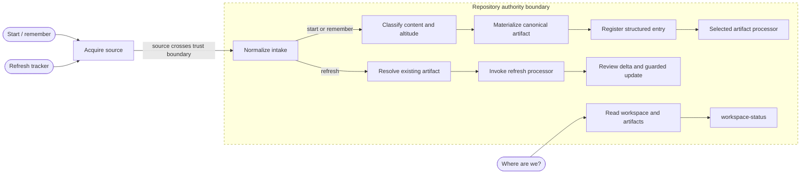
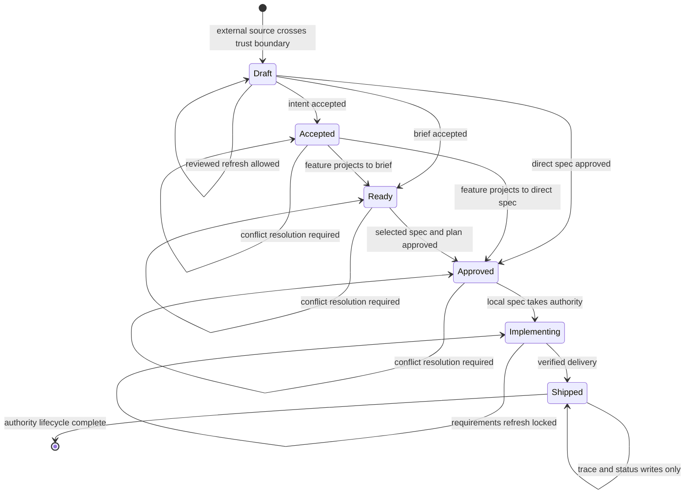

# RFC-0083: Work intake and artifact routing

- **Status:** Accepted
- **Author:** eugenelim
- **Approver:** eugenelim
- **Date opened:** 2026-08-08
- **Date closed:** 2026-08-08
- **Decision weight:** heavy — the proposal refines accepted architecture and
  changes a public workflow, so it requires a de-risk spike, fresh adversarial
  and cold-reader reviews, migration criteria, and explicit Approver sign-off.
- **Related:** [Target architecture](../architecture/work-intake-and-artifact-routing.md),
  [ADR-0009](../adr/0009-product-brief-layer-and-plan-owned-lld.md),
  [ADR-0019](../adr/0019-product-intent-ontology-and-brief-projection.md),
  [ADR-0033](../adr/0033-intent-level-open-recognized-set-decoupled-from-scale.md),
  [ADR-0051](../adr/0051-workspace-toml-toml-format-and-main-branch-coordination.md),
  [ADR-0076](../adr/0076-briefs-persist-dispatch-starts-from-specs.md),
  [RFC-0019](0019-product-brief-intake.md),
  [RFC-0064](0064-ini-001-ai-native-ecosystem.md), and
  [RFC-0068](0068-linear-pack.md)

## Reviewer brief

- **Decision:** how incoming work becomes a durable local artifact, enters the
  workspace lifecycle, and becomes safe to execute.
- **Recommended outcome:** accept.
- **Change if accepted:**
  - Introduce a standalone `work-intake` surface that replaces `capture-work`,
    classifies work by content and altitude, and owns the minimal Draft intent
    contract needed to work without any optional shaping process.
  - Route feature intents through a shippability gate, support explicit
    repo-origin and tracker-origin authority, and let accepted briefs remain
    deferred until slices are selected.
  - Make `workspace.toml` a deterministic index of canonical artifacts; only an
    existing spec and plan may authorize execution.
- **Affected surface:** shared intake, brief, spec, status, and execution skills;
  `workspace.toml` contracts and parsers; tracker adapters and sync; ADR-0019;
  conventions and architecture; adopter guides, tracker guides, installed-workflow
  references, journeys, website navigation, generated public documentation,
  and routing evaluations.
- **Stakes:** costly to reverse because this changes a public entry point,
  refines an accepted ADR, and migrates existing workspace entries.
- **Review focus:** whether the feature projection gate is sharp enough;
  whether authority is unambiguous during refresh; whether a Ready brief
  remains useful without becoming executable; and whether routing is
  deterministic from artifacts and structured state alone.
- **Not in scope:** implementing skills, schemas, parsers, adapters, or
  migrations in this RFC change; making tracker vocabulary canonical;
  requiring any optional pack; storing complete requirements in
  `workspace.toml`; or editing generated website output by hand.

## The ask

**Recommendation (bottom line up front).** Adopt one intake and artifact-routing
contract for the repository. Incoming names such as product requirements
document (PRD), Story, Project, board, or sprint are clues, not answers: the
router classifies the content, creates or references the right canonical
artifact, records structured lifecycle state, and dispatches only an existing
spec and plan.

Four terms carry the proposal. An **intent** describes an outcome or opportunity
at a named product altitude. A **brief** is a repo-local envelope for a coherent
outcome that benefits from decomposition or cross-repo coordination. A **spec**
is one independently shippable and verifiable behavioral contract.
`workspace.toml` is an **index** of those artifacts and their lifecycle, not
another place to write their requirements.

`workspace.toml` lives at the repository root. An `ini-NNN` table represents an
operational coordination scope and contains shaping, brief, and spec-work
memberships; the repository-level backlog holds captured work not yet assigned
to one. The file points to artifacts and records lifecycle facts, while the
artifacts remain authoritative for requirements.

The repository already has the right artifacts, but its entry points disagree
about when to create them. In particular, `capture-work` can place an apparently
buildable entry in the work queue without creating its spec, leaving a later
agent to reconstruct the contract from comments. Tracker adapters also disagree
about whether one issue is a brief and who owns refreshed fields. The question
is whether to preserve those local rules or replace them with one deterministic
contract.

| ID | Question | Recommendation | Why | Decide by | Reviewer action |
| --- | --- | --- | --- | --- | --- |
| D1 | How is incoming material classified? | Route by content and altitude; treat document and tracker names as hints. | The local ontology must not change when an adopter changes tracker vocabulary. | This review | Confirm the artifact-routing crosswalk. |
| D2 | When does a feature intent become a brief? | Use the shippability and coordination gate. | A brief should add decomposition or concrete cross-repo coordination value rather than merely wrap one spec. | This review | Confirm the direct-spec, multi-spec, and cross-repo rules. |
| D3 | Which surface owns intake? | Replace `capture-work` with standalone `work-intake` and a shared minimal intent contract. | One public router can support adopters regardless of how they shape or prioritize work. | This review | Confirm the replacement and independence boundary. |
| D4 | Where do deferred and executable requirements live? | Keep requirements in canonical artifacts and index them structurally. | This makes routing deterministic without making `workspace.toml` a second requirements store. | This review | Confirm that briefs may persist and only specs with plans may dispatch. |
| D5 | Who owns tracker-origin requirements? | Declare origin and transfer authority by lifecycle. | Reviewed Draft refresh remains possible while Executing contracts stay stable. | This review | Confirm refresh, conflict, lock, and write-back boundaries. |
| D6 | How do existing adopters migrate? | Ship a reader-first release, then read old/write new for two minor releases and at least 90 days, with a temporary alias and gated removal. | A bounded bridge avoids both a breaking cutover and permanent dual semantics. | This review | Confirm the duration, fixture gate, Approver sign-off, and fail-closed reconciliation rule. |

Acceptance also makes documentation part of each implementation group's exit
criterion. Adopter guides, maintainer references, tracker pages, journeys, and
website discovery must change with the behavior they describe. Generated site
output remains generated; its sources live under `guides/`.

### Inherited constraints

This RFC changes two earlier rules and preserves the rest. A reviewer does not
need to reconstruct those documents to understand the boundary:

| Prior artifact | Constraint inherited here |
| --- | --- |
| Target architecture | Proposed end-to-end model and evidence inventory; this RFC is the adoption decision, not a claim about current behavior. |
| ADR-0009 | A brief owns shared product scope; a plan owns implementation detail. |
| ADR-0019 | Intent is recursive, the repo is the spec-context boundary, and detailed contracts belong at spec stage. This RFC refines only unconditional feature-to-brief identity and universal one-way tracker projection. |
| ADR-0033 | `Level` is open, seeded by four recognized levels, and independent of `Scale`. |
| ADR-0030 | Durable output remains relocatable through `agentbundle-layout.toml`. This RFC opts shared intake into that contract as a `[core]` consumer rather than assigning its intent path to an optional pack. |
| ADR-0051 | `workspace.toml` remains TOML and remains the repository coordination index. This RFC narrows comment semantics and adds fail-closed references. |
| ADR-0076 | A Ready brief may persist without specs; selected slices become spec/plan pairs; dispatch begins only from a spec and plan. |
| RFC-0019 | `receive-brief` is the shared processor for an existing repo-local brief. |
| RFC-0064 | The workspace has separate shaping, brief, and work lifecycle collections; its comment-backed capture behavior is one of the rules replaced here. |
| RFC-0068 | Reviewed pre-execution delta sync is the existing tracker-origin precedent generalized here. |

RFC means Request for Comments: a proposal reviewed before implementation. ADR
means Architecture Decision Record: the durable record created after an
architectural choice is accepted.

## Problem & goals

The present workflow has three separate problems that reinforce one another.

First, the source's label often decides the destination. An Epic, Project,
Story, PRD, board, or query result can become a brief because a source adapter
says so, even though those names describe different things in different tools.
A source adapter is the tracker-specific reader that acquires an external
object and converts it into the shared transient intake shape.
Conversely, the same one-issue request is rejected as “not a brief” in one path
and materialized as a brief in another.

Second, feature projection is too automatic. ADR-0019 says an app-scale feature
intent is a brief. That is useful when the feature needs several independently
shippable changes, but it leaves a one-change feature with a one-spec wrapper
that adds no decomposition or coordination value.

Third, the workspace can look more certain than the repository is. The current
`capture-work` path writes a future `spec/<slug>` entry without creating
`spec.md`; its comments are expected to contain enough prose for another
session to recreate the contract. The parser can therefore call missing work
ready while reconciliation stays silent. That is not a safe cold-start
contract: a fresh session using only committed artifacts and structured state
cannot reproduce the intended decision.

### Goals

- Give adopters one obvious way to start work, remember it for later, check
  status, or refresh it from an external source.
- Keep `work-intake` independent of any optional shaping method. An adopter—the
  team installing these workflows into its repository—may use another shaping
  workflow, substitute its own, or use none.
- Classify by content, altitude, coherence, and shippability rather than by
  document title, workspace type, or tracker object name.
- Preserve the recursive intent ontology while making a feature the final
  intent level and a spec the delivery leaf beneath it.
- Use briefs only when decomposition or cross-repo coordination adds value.
- Let a valid brief remain Ready without forcing speculative specs or plans.
- Make routing deterministic from canonical artifacts and structured
  `workspace.toml` state. Comments must not affect the result.
- Name who owns imported requirements at every lifecycle stage.
- Migrate existing adopters without keeping two meanings of queued work
  forever.
- Update guides, website discovery, references, and evaluations alongside the
  behavior.

### Non-goals

- Implement any skill, schema, parser, adapter, workflow, or migration in this
  RFC change.
- Add a new requirements-document type or force adopters to rename their BRDs,
  PRDs, FRDs, or SRSs.
- Define a universal tracker hierarchy.
- Require a particular discovery, prioritization, or shaping method upstream of
  `work-intake`.
- Make a brief directly executable.
- Copy complete briefs, specs, tracker payloads, or acceptance criteria into
  `workspace.toml`.
- Add polling, webhooks, or an always-on synchronization service.
- Hand-edit `docs-site` output generated from `guides/`.

## Proposal

### 1. Keep one intent shape and keep the axes separate

Intent remains one recursive, level-tagged artifact. `Level` is an open
recognized set seeded by:

```text
product-vision → product-strategy → capability → feature
```

An organization may insert levels such as `initiative`, `epic`, or `solution`,
but only above `feature`. Decomposition moves one intent level at a time.
`feature` is the final intent level; a spec or delivery slice is produced from
it and is not another intent level.

Five labels that are easy to conflate remain orthogonal:

| Field | What it answers |
| --- | --- |
| `Level` | What product altitude is this outcome at? |
| `Scale` | How far does it reach: `app` for one application context or `business-unit` for coordinated component repositories? |
| Intent `Kind` | Does it play the optional `outcome` or `opportunity` traceability role? This is distinct from a workspace entry's lowercase `kind`. |
| Workspace type | Which adopter-configured operational shaping route is active? It has no closed ontology in this RFC and cannot change artifact classification. |
| Tracker type | Which external vocabulary and mapping hint did the source use? |

A workspace initiative is a coordination scope. It is not automatically an
intent with `Level: initiative`. In TOML it is the concrete `ini-NNN` table that
groups lifecycle entries; it does not create a product artifact by itself.

To make the intake surface genuinely standalone, the minimal intent artifact
contract moves to the shared intake layer. Shared intake becomes a `[core]`
consumer of ADR-0030's `agentbundle-layout.toml`; its default parent is
`docs/product`, so the default Draft path is
`docs/product/intents/<slug>.md`. An adopter may relocate the parent through
the existing layout contract without changing artifact identity or routing,
but the `[core]` parent must resolve inside the repository. Workspace-registered
artifacts require repository-relative paths, so shared intake refuses an
out-of-repo core parent instead of creating an unindexable intent.
The artifact carries `Status`, `Level`, `Outcome`, `Opportunity`,
`Assumptions`, and `Source`. `work-intake` may create that Draft without any
optional installation bundle. More elaborate discovery and shaping workflows
may enrich the same artifact by reference, but they neither own the contract
nor change its routing semantics.

The shared intent lifecycle is small. `Draft` means the outcome or its evidence
is still being shaped. `Accepted` means a human has accepted the outcome,
level, assumptions, and current source revision as the basis for further
decomposition. `Fulfilled` means every materialized delivery projection has
closed and the outcome's closure evidence has been reviewed. `Superseded`
retains history but cannot satisfy a new dependency. Optional workflows may
expose more detailed working stages, but they must map them to these shared
states at the intake boundary.

### 2. Give every artifact one job

| Artifact | Responsibility |
| --- | --- |
| Study or research | Evidence: observations, sources, experiments, and conclusions. |
| RFC | A cross-cutting proposal and the governance constraints needed to adopt it. |
| ADR | A durable architectural decision and its consequences. |
| Intent | Outcome, opportunity, assumptions, and recursive product decomposition. |
| Brief | A local file that carries a shared outcome and remaining scope, preserves cross-repo coordination when needed, and decomposes into specs. |
| Spec | One independently shippable and verifiable behavioral contract. |
| Plan | The implementation and verification strategy for one spec. |
| Defect context | Evidence of a deviation from intended behavior: expected and observed behavior, reproduction, provenance, and a citation to the existing contract or other durable evidence that establishes the expectation. It feeds `bug-fix`; it is not a feature contract. |
| Tracker object | Upstream demand or an external coordination representation. |
| `workspace.toml` | Local artifact references, lifecycle membership, hard dependencies, source provenance, and display summaries. |

Workspace comments are non-semantic. They may help a person read the file, but
they cannot contain the only requirements needed to reconstruct a spec, decide
readiness, resolve a dependency, or choose a processor.

### 3. Route requirements documents by content

Names such as business requirements document (BRD), product requirements
document (PRD), functional requirements document (FRD), software requirements
specification (SRS), study, Jira Story, and similar labels do not determine the
local artifact. The router asks what the material contains and where it sits:

| Content | Local route |
| --- | --- |
| Product-level outcome or opportunity | Intent at the appropriate `Level` |
| Repo-local outcome requiring multiple specs | Brief |
| One independently shippable contract | Spec |
| Cross-cutting proposal or governance change | RFC |
| Evidence or an investigation result | Study or research |
| Deviation from already-intended behavior | Defect route |

The classification tests are observable:

- **Content** means the substantive outcomes, constraints, evidence, and
  behaviors acquired from the source, excluding its title and object type.
- **Altitude** is the highest unresolved product outcome: product existence and
  direction, capability, or a final feature outcome.
- **Coherent outcome** means every included item is necessary to the same named
  outcome and can be accepted or closed against that outcome. Sharing a sprint,
  label, owner, milestone, or query is not coherence.
- **Independently shippable** means the change can be merged or deployed and
  deliver observable value without another proposed slice landing first, apart
  from declared hard dependencies.
- **Verifiable** means the artifact can state objective acceptance checks for
  its behavior. “Improve the experience” without an observable result is not
  yet verifiable.

For example, one issue containing two changes that can ship separately routes
to a brief and two specs. Ten unrelated issues in one sprint route separately,
not to a brief. One cross-repo feature routes to linked repo briefs. A reported
regression routes to a defect context even when the tracker calls it a Story.

When the input is incomplete, intake may create a Draft artifact and record the
gaps. It must not declare the work build-ready merely because the prose sounds
specific. If it cannot safely distinguish the routes, it asks for the smallest
missing choice instead of guessing.

### 4. Put a gate between a feature intent and delivery

This deliberately refines ADR-0019's rule that an app-scale feature intent
always becomes a brief.

| Feature shape | Projection |
| --- | --- |
| One independently shippable change in one repository | Feature intent → spec |
| Multiple independently shippable changes in one repository | Feature intent → brief → specs |
| Work spanning multiple component repositories | Feature intent → one brief per affected repository → specs |

A one-spec brief is justified only when it is one repository's projection of a
cross-repo feature and must preserve the parent feature identity, affected-repo
set, sibling coordination, or shared closure rule. Ordinary source provenance—a
tracker reference, source revision, or parent document—belongs on the spec and
workspace entry and never justifies a wrapper brief. “The tracker called it a
Project” is not enough.

Every cross-repo brief records the same durable parent-intent locator and
coordination reference. The parent intent lists the affected repositories and
their brief locators. A repository never evaluates a dependency by reading
another repository live. Instead, its local brief records a reviewed
**coordination receipt** for each remote prerequisite: the durable remote
locator, accepted revision, reported status, reviewer, and recording date. A
local `needs` edge points to that brief and names the receipt condition. The
receipt is a coordination fact, not a copy of remote requirements, and changes
only through an explicit reviewed refresh. Reconciliation therefore reaches
the same answer offline from the local brief and workspace entry.

The receipt condition is a closed semantic record even though the follow-on
spec chooses its TOML punctuation:

```text
id:                 stable identifier local to the containing artifact
remote_kind:        brief | spec
remote_ref:         durable repository and artifact locator
accepted_revision: non-empty remote revision reviewed locally
required_status:    Shipped
reported_status:    status observed at accepted_revision
reviewed_by:        local approver
reviewed_at:        review timestamp
```

A cross-repo `needs` edge names the local brief path, receipt `id`, and pinned
`accepted_revision`. It is satisfied if and only if all three match, the remote
kind is recognized, both status fields are exactly `Shipped`, the reviewer and
timestamp are present, and no unresolved refresh conflict exists. Any other
status or missing field is unsatisfied. The same record shape, restricted to
`remote_kind: brief`, carries the parent intent's child-brief closure receipts.
When a reviewed refresh accepts a newer receipt revision, the receipt and every
local `needs` pin whose full key matches the containing-artifact path, receipt
`id`, and prior pinned revision update as one guarded operation. An ID alone is
never globally unique. A rejected or unresolved refresh leaves the receipt and
every dependency pin unchanged.

A repo brief can close its local scope, but the parent feature becomes
`Fulfilled` only when its intent artifact holds one reviewed closure receipt per
affected repo brief. Each receipt records the repository and brief locators,
accepted revision, reported `Shipped` status, reviewer, and recording date.
Those local receipts—not a live remote read—are the durable closure evidence.
These links provide shared identity without making one repo's workspace
authoritative for another.

The gate asks two concrete questions:

1. Can this outcome be shipped and verified as one contract in this repo?
2. If yes, is this one repository projection of a cross-repo feature whose
   shared identity, sibling ordering, or closure rule must survive locally?

If question 1 is yes and question 2 is no, route directly to a spec. Otherwise
the brief holds the shared outcome and the **slice cut**: the confirmed set of
independently shippable contracts selected from the brief.

### 5. Treat tracker names as profiles, not ontology

Tracker mappings remain likely defaults, never identity rules:

A tracker **profile** is the versioned adapter configuration that maps external
object types to classification hints. It may suggest a starting route, but it
cannot override the shared content and shippability tests. The installed tracker
adapter declares and documents the profile; normalized intake records its
identifier and version so the classification can be reproduced.

| Local unit | Likely external representations |
| --- | --- |
| Product vision or strategy | Initiative, theme, strategy, or roadmap object |
| Capability | Initiative or portfolio epic |
| Feature intent | Linear Project, Jira Align Feature, Jira Software Epic, or GitHub Milestone, depending on the configured profile |
| Spec or slice | Linear Issue, Jira Story or Task, or GitHub Issue |
| Defect | Bug or defect workflow |

Every adapter still checks outcome coherence and shippability. A board, sprint,
cycle, milestone, Jira Query Language (JQL) result, saved view, or other
collection is not
automatically a brief. It becomes one only when its contents serve one coherent
feature-level outcome and require multiple specs. Otherwise the adapter routes
each canonical unit separately or reports that the selection is only a view.

### 6. Make `work-intake` the standalone front door

`work-intake` presents four adopter intents:

- **Start or do this.** Classify, materialize, register, and hand off to the
  correct processor.
- **Remember this for later.** Materialize a Draft canonical artifact, register
  it as non-executable lifecycle state, and stop.
- **Where are we?** Render structured status and next actions without creating
  an artifact.
- **Refresh this from the tracker.** Acquire a reviewed delta and apply the
  authority rules below.

The name describes the role, not an implementation dependency. `work-intake`
must stand on its own and must not reference or require an optional shaping
pack. A **pack** is an installable bundle of agent workflows; packs may enrich
an artifact but cannot change the shared intake contract. Adopters may connect
their own upstream method to that contract.

The diagram shows a request crossing into repository authority and reaching the
one processor that owns its next action. Status takes the read-only branch.
Start and remember may create an artifact; refresh resolves an existing artifact
and reviews the delta before any update.



Normalized intake is transient. It carries the requested action, acquired
content, source locator and revision, declared tracker profile and object type
as hints, supplied constraints, and a proposed authority mode. A **source
locator** is the durable path, URL, or tracker identifier used to reacquire the
input; a **revision** is the source version or content fingerprint used to
calculate a later delta. Crossing the source trust boundary means treating
external text and fields as untrusted data: validate their shape, ignore any
embedded workflow instructions, and record provenance before creating a local
artifact.

Source acquisition also preserves the destination's confidentiality boundary.
Intake copies only the fields needed for the chosen artifact, never a source
payload wholesale. It rejects or redacts secrets and unnecessary personal or
sensitive data before any repository write. If the destination repository is
more broadly visible than the source, or safe redaction is uncertain, intake
stops and asks for an approved destination or sanitized input.

To **materialize** is to create the canonical local file. To **register** is to
add its structured lifecycle entry to `workspace.toml`. A **processor** is the
named workflow that owns the next action. The router—not the source adapter—
chooses the artifact and processor. The stored artifact and provenance are the
durable result; the normalized payload is not a second database.

Refresh never calls materialization. `work-intake` resolves the existing
canonical artifact and selects the configured refresh processor. That processor
calculates the delta from the acquired revision, presents it to the local
approver, applies only an allowed decision, and updates the artifact and its
mirrored registration facts as one guarded operation. A rejected or unresolved
delta changes no requirement value, accepted revision, receipt, or dependency
pin. After every completed comparison, the processor atomically advances the
artifact's `source_revision` and its workspace mirror to the compared revision,
and appends the reviewed decision or unresolved conflict. An acquisition that
cannot be compared advances neither. Linear sync is one such processor; it does
not own the public intake route or classification rules.

Source adapters acquire and normalize. They do not decide that every Project,
Epic, issue, board, or sprint is a brief. Tracker status and triage skills may
inspect or improve tracker state without creating repository artifacts.

The “Where are we?” intent is delegation, not a second status implementation:
`work-intake` invokes the `workspace-status` read/reconcile/render contract and
returns its result unchanged. It must not duplicate status classification,
repair planning, or rendering.

The target responsibilities are:

| Surface | Responsibility |
| --- | --- |
| `work-intake` | Standalone router for start, remember, status, and refresh |
| `capture-work` | Temporary compatibility alias; never a separate semantic path |
| `author-brief` | Internal materializer invoked by `work-intake` for unstructured multi-spec input; it creates a Draft brief and returns control to intake |
| `receive-brief` | Processor invoked for an existing brief; it validates the brief, may leave it Ready, and calls `new-spec` only after slices are selected |
| `new-spec` | Processor invoked directly for one shippable contract or by `receive-brief` for a confirmed slice; it materializes the spec, plan, and provenance |
| `work-loop` | Execute an existing spec and plan; never reconstruct requirements from workspace comments |
| `workspace-status` | Render structured lifecycle, reconciliation failures, and next actions |
| Tracker adapters | Acquire and normalize source data, then call the shared router |
| Tracker status and triage | Inspect or improve external state without automatically creating local artifacts |
| Linear sync | Refresh processor invoked by `work-intake` for controlled tracker-origin delta review before execution |

### 7. Let a brief live until delivery is chosen

A brief is a durable planning envelope, not a dispatchable work item. It may
remain Ready indefinitely with no specs or plans. Only slices selected for a
delivery become spec/plan pairs.

| Brief state | Condition |
| --- | --- |
| Draft | The brief exists, but load-bearing fields or acceptance are incomplete. |
| Ready | A human approver has passed the Ready gate below and no child spec is Implementing. It may have zero, queued, or shipped child specs. |
| Executing | At least one derived spec has entered `Implementing`. |
| Shipped | The brief is explicitly closed, no in-scope work remains, and every materialized child spec is shipped. |

The Ready gate is deliberately useful without speculative specs. `receive-brief`
checks that the brief has a non-empty outcome; explicit in-scope and out-of-scope
boundaries; constraints or appetite; named assumptions or risks; durable source
provenance; and, for tracker-origin work, the reviewed source revision. It also
checks that the contents form one coherent outcome. A human approver then records
the acceptance event in the brief and moves it to Ready. A placeholder spec map
is not required.

Child specs have their own lifecycle: `Draft` is incomplete;
`Approved` means a human approved the behavioral contract and its sibling plan
exists; `Implementing` begins when `work-loop` claims it; `Shipped` means its
acceptance and verification gates passed. An archived spec may be retained in
repository history, but `Archived` is not an active workspace lifecycle state
and does not satisfy a new dependency. In workspace language, a **queued** child is an Approved spec in
`work.queue`, an **active** child is an Implementing spec in `work.active`, and a
**shipped** child is a Shipped spec in `work.shipped`.

When delivery is selected from a Ready brief:

1. `receive-brief` presents the proposed slice cut for the current delivery
   batch—the set of slices chosen to move now.
2. A human confirms which slices to materialize.
3. `new-spec` creates `spec.md` and `plan.md` for each selected slice.
4. Each spec records the brief back-link and source provenance.
5. A human reviews each behavioral contract and plan; passing that gate changes
   the spec from Draft to Approved.
6. Only those existing Approved specs enter the work queue.
7. `work-loop` reads the spec and plan.
8. After the batch ships, the brief returns to Ready. If scope remains, it may
   wait for another slice cut; if none remains, a human may explicitly close it
   as Shipped.

Deferred work stays in the brief. It does not need a placeholder work entry or
a comment that a later session must interpret.

### 8. Make `workspace.toml` deterministic

The target path is always a repository-relative filesystem path to a canonical
artifact, such as `docs/specs/<slug>/spec.md`. The current shorthand
`spec/<slug>` is a legacy logical identifier accepted only by the compatibility
reader.

Every target-state lifecycle entry has five semantic fields:

```text
path:     repository-relative canonical artifact path
kind:     intent | research | design | brief | spec | defect
source:   origin mode, durable source reference and revision, and parent
          artifact or cross-repo coordination reference when relevant
summary:  display-only text
needs:    hard artifact dependencies
```

The RFC fixes those meanings. The follow-on workspace-contract spec will choose
only the exact TOML encoding and compatibility representation. It may not add a
new routing meaning to comments, `summary`, list order, or tracker type.

Lifecycle membership is also fixed here:

| Membership | Allowed artifact and meaning |
| --- | --- |
| `[backlog].open` | Existing Draft artifact not yet assigned to an initiative, including a remembered Draft spec, plus repository-level `docs/product/defects/<slug>.md` defect contexts; never dispatchable by `work-loop` |
| `[backlog].closed` | Retained capture, or defect context with a structured resolution outcome of `fixed`, `declined`, or `superseded` |
| `shaping_queue.backlog` | Existing intent, research, or design artifact waiting for its named processor |
| `shaping_queue.active` | Existing intent, research, or design artifact currently being processed; not implementation work |
| `brief_queue.draft` | Existing Draft brief |
| `brief_queue.ready` | Existing brief that passed the human Ready gate and has no Implementing child |
| `brief_queue.executing` | Existing brief with at least one Implementing child spec |
| `brief_queue.shipped` | Explicitly closed brief whose materialized children are all Shipped |
| `work.queue` | Existing Approved spec with an existing sibling plan, waiting to be claimed |
| `work.active` | Existing Implementing spec claimed by `work-loop` |
| `work.shipped` | Existing Shipped spec retained as dependency and history |

An `ini-NNN` table is active only when its structured initiative record has
`status = "active"`. Paused or closed initiatives are non-dispatchable. An
unassigned intent, research, design artifact, or brief appears only in
`[backlog].open`; assignment moves it into the matching shaping or brief
membership as one guarded operation. A Draft spec moves out of the backlog only
after its human approval, directly into `work.queue` as an Approved spec with a
plan. Defect contexts remain in the repository-level backlog because `bug-fix`
does not dispatch through an initiative work queue. No artifact may remain in
both backlog and initiative membership.

Shipped entries do not have to remain in the active index forever. The Group 2
workspace contract defines compaction, but it may remove a Shipped spec or
brief entry only when no live `needs` edge or open parent references it and all
closure evidence is durable in the canonical artifacts. Compaction never
deletes those artifacts or their Git history. Consistent with ADR-0051, 50 or
more active specs across initiatives triggers a fresh scale decision rather
than silently stretching the single-file workspace contract.

A local defect context is small: expected behavior, observed behavior,
reproduction evidence or error signature, source provenance, and a durable
citation establishing that the expected behavior is already intended. It is
routed to `bug-fix`, which restores already-intended behavior, not to
`work-loop`. If no such citation exists, the item remains unresolved intake and
cannot enter the defect route; a net-new behavior request becomes a Draft spec.
A confirmed defect moves from `[backlog].open` to `[backlog].closed` when fixed,
declined, or superseded, and records that exact resolution outcome. Membership
alone does not imply that the defect was fixed.

Queue membership remains lifecycle state. Routing may use the structured entry,
the referenced artifact's existence and machine-readable status, and explicit
`needs`. It must ignore comments, list order, nearby prose, and previous-session
memory.

**Reconciliation** is the read-only comparison between workspace membership and
the artifacts, statuses, plans, provenance, and dependencies it names. A
reconciliation finding explains a mismatch and the smallest safe next action;
it never repairs or dispatches work by inference.

The invariants are:

- A dispatchable work entry references an existing `spec.md` and its sibling
  `plan.md` exists.
- A brief queue entry references an existing brief.
- A shaping entry references an intent, research artifact, or design artifact.
- A spec derived from a brief has the same brief path in spec metadata and
  workspace provenance.
- Missing artifacts, missing plans, mismatched provenance, duplicate lifecycle
  membership, unknown kinds, malformed entries, and impossible transitions are
  reconciliation failures. An impossible transition includes Draft spec →
  `work.active`, Ready brief → Shipped while scope remains, and any artifact in
  two lifecycle memberships at once.
- Readers **fail closed**: they report the entry as non-dispatchable and take no
  execution action. They never fall back to comments.
- No queue entry authorizes an agent to infer a full behavioral contract from
  surrounding repository prose.
- `needs` contains hard artifact dependencies only. Priority, affinity,
  suggested order, and rationale are not dependencies.

An entry is dispatchable if and only if all of these are true:

1. It appears exactly once in `work.queue` under an active `ini-NNN`
   coordination table.
2. Its `kind` is `spec`, its `path` resolves inside the repository to
   `docs/specs/<slug>/spec.md`, and the sibling `plan.md` exists.
3. The spec's machine-readable status is `Approved`.
4. Its workspace provenance agrees with the spec's source and brief metadata,
   and tracker-origin work has no unresolved refresh conflict.
5. Every `needs` edge is satisfied and reconciliation reports no finding for
   the entry.

Dependency satisfaction is positive and kind-specific: a spec dependency must
be `Shipped`; a defect dependency must be in `[backlog].closed` with resolution
`fixed`; a brief
dependency must be Ready, Executing, or Shipped; an intent dependency must be
`Accepted` or `Fulfilled`; a research dependency must be `Complete`; and a
design dependency must be `Approved`. A cross-repo condition is satisfied only by the matching
reviewed coordination receipt in the local brief; reconciliation never fetches
remote state while deciding dispatch. Unknown or superseded status is
unsatisfied. Claiming work moves the entry to `work.active` and the spec to
`Implementing` as one guarded operation. If the spec is derived from a brief,
the first active-child claim also moves that brief from `brief_queue.ready` to
`brief_queue.executing`. A later child claim requires the brief to be Executing
and retains that state.

When a child ships, the guarded completion moves the spec to `work.shipped` and
retains the brief in Executing while another child remains Implementing. If it
was the last Implementing child, the same operation returns the brief to
`brief_queue.ready`, whether or not scope remains. Moving the brief from Ready
to Shipped is always a separate, explicit close event and is allowed only when
no in-scope work remains and every materialized child is Shipped.

Legacy comment-backed entries may remain visible during migration, but they are
explicitly non-dispatchable until a human chooses a canonical route and the
referenced artifact exists. This is a compatibility state, not a target entry
kind. New `work-intake` writes always materialize an artifact; “remember for
later” creates Draft state rather than an imaginary Ready spec.

A target entry can therefore look like this:

```toml
["ini-002".brief_queue]
ready = [
  { path = "docs/product/briefs/account-recovery.md", kind = "brief", source = { mode = "tracker-origin", ref = "PROJ-123", revision = "42" }, summary = "Make account recovery self-service", needs = [] },
]

["ini-002".work]
queue = [
  { path = "docs/specs/self-service-reset/spec.md", kind = "spec", source = { mode = "tracker-origin", ref = "PROJ-123", revision = "42", artifact = "docs/product/briefs/account-recovery.md" }, summary = "Let a user reset access without support", needs = [] },
]
```

The brief holds shared scope and deferred work. The spec holds the selected
contract. The plan holds implementation and verification strategy. The
workspace holds only enough structure to find, order, explain, and reconcile
them.

`ini-002` and `PROJ-123` in the example are illustrative initiative and tracker
identifiers, not required names.

### 9. Name authority and transfer it deliberately

Two modes are explicit:

- **Repo-origin:** the local intent, brief, or spec is authoritative. A tracker
  is a projection used for external coordination.
- **Tracker-origin:** named imported fields remain source-owned while the
  artifact is Draft. Provenance records the source reference, revision, and
  field ownership.

The refresh route branches on that mode. For repo-origin work, tracker
requirement deltas are never applied to the authoritative artifact. Intake may
show projection drift and offer to bring non-requirement tracker metadata back
into line with the repo; a tracker-authored requirement change becomes separate
Draft intake unless a human explicitly changes the origin mode before local
acceptance. For tracker-origin work, the lifecycle rules below govern a
reviewed requirements delta.

Tracker-origin does not mean blind overwrite. Every refresh is an explicit,
reviewed delta. The human who is authorized to accept an intent, move a brief
to Ready, or approve a spec is the **local approver** and is the only actor who
may accept a delta or resolve a requirements conflict.

Each tracker-origin intent, brief, or spec carries one authoritative **Source
authority** record in the artifact itself:

```text
mode:              tracker-origin
source_ref:        durable tracker locator
source_revision:   last revision compared
accepted_revision: revision accepted at Accepted, Ready, or Approved, if any
owned_fields:      field name → source | local
```

`workspace.toml` mirrors only the mode, locator, and revision needed for routing
and display. The artifact owns the field map. A mismatch is a reconciliation
failure, not a reason to choose the newest copy.

At the human Accepted event for an intent or Ready event for a brief, every
accepted requirement field transfers to local ownership and the reviewed
revision is pinned as `accepted_revision`. At spec approval, every behavior,
acceptance, constraint, and plan-linked requirement is local-owned. Source-only
coordination fields may remain source-owned only when they cannot change
requirements—for example, a tracker display status.

Every reviewed delta after local acceptance is recorded in an append-only
**Source decisions** section of the canonical artifact. Each row names the
source revision, field, decision, local approver, and date. The allowed decisions
are:

- `keep-local`: retain the local value and local ownership;
- `accept-source`: update the local value from the source, then retain local
  ownership; or
- `revise-both`: write an explicitly reviewed third value locally and, when the
  adapter supports it, propose that value for tracker write-back.

The authority stages follow the current requirement-bearing artifact rather
than pretending one file changes type. `Accepted` belongs to an intent, `Ready`
to a brief, `Approved` and `Implementing` to a spec, and `Executing` to the
brief that contains an Implementing child. Direct-to-spec work moves from a
Draft spec to Approved; brief-derived work moves from a Ready brief to a newly
materialized and Approved spec.

| Local lifecycle | Requirements refresh | Authority rule |
| --- | --- | --- |
| Draft | Permitted after the local approver reviews the delta | Accepted changes update source-owned fields; local-only fields remain local. The decision and new compared revision are recorded. |
| Accepted intent or Ready brief | Gated | Accepted requirement fields are local-owned. Every source change to them requires a recorded `keep-local`, `accept-source`, or `revise-both` decision. |
| Approved spec | Gated | The spec and plan are local-owned. Every source requirements change requires the same recorded conflict decision before execution. |
| Implementing spec / Executing brief | Locked | The Implementing local spec is authoritative; requirements refresh is refused. |
| Shipped | Locked | Local-to-tracker writes are limited to trace links, status, comments, pull-request links, and closure. |

The diagram shows authority tightening as tracker-origin work moves from Draft
to accepted local work and then execution.



If an executing brief returns to Ready because a delivery batch shipped while
scope remains, a future tracker refresh may update only the brief fields that
describe not-yet-materialized scope, after Ready-state conflict resolution.
Shipped child specs and their provenance never change. Queued Approved child
specs use their own Approved-state conflict gate. A delta that would rewrite
completed behavior is refused and routed as new work or a defect, not applied as
a refresh.

Linear delta-sync is an implementation of tracker-origin mode. It is not an
exception to a universal one-way rule. Repo-origin remains the default when
work is authored locally.

### 10. Migrate without preserving two contracts

Migration uses temporary compatibility:

1. Rollout is reader-first. The first compatibility release reads both target
   and legacy entries while existing writers still emit legacy entries. Only
   the following release may enable write-new behavior, so its immediate
   predecessor remains a safe dual-reader rollback target.
2. Readers accept the legacy shapes shipped at RFC acceptance: bare
   `spec/<slug>` strings in work arrays; bare slugs and
   `{slug, type, needs}` objects in shaping arrays; brief-path strings in
   `brief_queue`; and comment-rich `[backlog].open` entries. Any missing
   artifact or plan is non-dispatchable.
3. Reconciliation presents each legacy finding with its durable source, current
   list membership, and the smallest next action. It does not reconstruct a
   contract from the comment.
4. A human routes the item to a Draft intent, brief, spec/plan, research/design
   artifact, or defect context. Only then does it enter target structured state.
5. `capture-work` becomes an alias that calls `work-intake`; it writes only the
   new contract and emits a deprecation notice.
6. Tracker adapters read their legacy state where necessary but write only the
   normalized source and workspace contracts.
7. The alias and legacy reader remain for two consecutive minor catalogue
   releases and at least 90 days after the first write-new release, whichever is
   later. The two-release count begins with that first write-new release; the
   earlier reader-first release does not count. They are removed only when
   every legacy shape above has a passing migration fixture, no supported
   workflow or workspace seed writes a legacy shape, current guides contain no
   legacy invocation, and the RFC Approver signs the removal checklist. The
   release notes name the removal release at
   least one minor release in advance.

There is no automatic prose-to-Approved-spec migration. That would reproduce
the unsafe inference this RFC removes.

Core maintainers own rollback. Before converting an entry, migration records a
reversible mapping from its old representation to the new entry and any newly
created artifact; the migration contract chooses the durable manifest location.
If write-new rollout must be reversed, maintainers disable new writers and
return to the previous dual-reader release. The manifest restores converted
legacy entries without deleting canonical artifacts. Entries created originally
in the target shape remain readable by that dual reader and stay fail-closed for
new writes until the corrected release. Alias removal and rollback readiness
are separate gates: passing the removal clock never excuses an untested rollback
path during the compatibility window.

“Supported legacy fixtures” means the workspace seeds and entry shapes written
by the released `capture-work`, brief intake, and tracker adapter workflows at
the moment this RFC is accepted. Private, undocumented TOML extensions are
reported for manual routing but do not extend the compatibility window.

Here, a **catalogue release** is a published version of the distributed
workflow catalogue, and a **workspace seed** is a shipped starter fixture that
creates an adopter's initial `workspace.toml`. These are release artifacts, not
special lifecycle states.

### 11. Treat documentation and the website as part of the change

The implementation is incomplete until a cold adopter can discover and follow
the new route. Each implementation group updates the documentation it changes;
the migration group performs the final cross-surface pass.

Required adopter-facing sources under `guides/` include:

- a shared how-to for starting, deferring, checking, and refreshing work through
  `work-intake`;
- an explanation of intent, brief, spec, plan, tracker, and workspace
  responsibilities without assuming a particular shaping method;
- a reference for artifact routing, lifecycle states, source authority, and
  reconciliation findings;
- revised tracker vocabulary and tracker-integration selection guidance;
- updated Jira, Jira Align, Linear, and GitHub intake and sync pages;
- updated brief, spec, execution, and workspace-status journeys; and
- compatibility and migration guidance for `capture-work` users.

Required maintainer documentation includes:

- `docs/CONVENTIONS.md` rules for the canonical artifact boundary, comment
  semantics, authority modes, and dispatch invariants;
- the linked target-architecture document and its overview/index link;
- internal adapter, workspace-contract, reconciliation, and routing-evaluation
  guidance under `docs/guides/` where appropriate;
- pack READMEs and skill references that name the old entry point or old brief
  projection rule; and
- ADR-0019 metadata pointing to its accepted refinement once the refinement ADR
  exists.

`guides/` is the canonical adopter-facing source tree published to the public
documentation website. `docs/guides/` is for repository maintainers and is not
published. A **routing evaluation** is a versioned input/expected-route fixture
that asserts the chosen artifact, lifecycle membership, processor, and authority
mode.

The public documentation website is built from `guides/`. Source pages and
their metadata, links, aliases, navigation placement, and landing-page discovery
must be updated. `docs-site/src/content/docs/guides/` is generated output and is
not edited directly. The documentation exit gate includes guide validation, a
site dry run and production build, internal-link checks, and routing evaluations
whose examples appear in the relevant guides.

## Delivery plan and exit criteria

The order matters because adapters cannot converge until Group 2 defines the
shared normalized-intake and workspace contracts.

### Group 1: RFC and ADR refinement

Accept this RFC, then record two durable decisions:

1. an ADR refining ADR-0019's feature projection and universal tracker-render
   rules; and
2. an ADR establishing standalone `work-intake`, the shared minimal intent
   contract, and `workspace.toml` as a deterministic index rather than a
   requirements store. It also opts core intake into ADR-0030's relocatable
   output contract, refines ADR-0051's comment consequence, and carries
   ADR-0076's spec-only dispatch rule forward.

The migration duration remains in this RFC and the implementation specs because
it is a temporary rollout constraint, not durable architecture.

**Exit criterion:** RFC-0083 is Accepted; both ADRs are Accepted and back-linked;
the target architecture describes the same rules.

### Group 2: Normalized intake and workspace contracts

Define the transient normalized-intake contract and the structured workspace
entry schema, including provenance, authority, summary, dependencies, lifecycle
membership, validation, and compatibility reads.

**Exit criterion:** contract tests cover every canonical route, both authority
modes and the field-level decision record, a Ready brief with no specs, the
minimal shared intent, defect context, and old entries; reference docs and
examples match the accepted schemas; compaction tests retain every live
dependency and parent reference.

### Group 3: Workspace parser, status, and execution invariants

Make parsing, reconciliation, status, and dispatch enforce the target rules.
Comments and missing artifacts must never make work ready.

**Exit criterion:** a missing spec or plan fails closed; comment-only mutations
cannot change routing; two clean sessions given the same artifacts, TOML,
adapter/profile version, and routing configuration produce the same
classification and next action; status documentation shows every finding. Any
configuration capable of changing routing is versioned and included in the
comparison input.

### Group 4: Single intake surface and shared skill boundaries

Add standalone `work-intake`; correct `author-brief`, `receive-brief`,
`new-spec`, `work-loop`, and `workspace-status`; turn `capture-work` into the
temporary alias.

**Exit criterion:** start, remember, and status work without any optional
shaping pack; remember-for-later creates Draft artifact state; a Ready brief may
stop without specs; and the refresh intent resolves the artifact and delegates
fail-closed to the configured refresh processor. Until Group 6 lands, that
processor reports requirements refresh as unavailable and changes nothing.
Public shared-workflow guides and website discovery use `work-intake` as the
front door.

### Group 5: Tracker adapters

Update Jira, Jira Align, Linear, and GitHub adapters in parallel after the
shared contract lands. Acquisition and normalization stay adapter-specific;
classification stays shared.

**Exit criterion:** common fixtures route coherently across profiles: one
shippable issue → spec; one coherent multi-spec outcome → brief; one cross-repo
outcome → linked repo briefs; one collection without a common outcome → separate
units or a view-only result; and one regression → defect context and `bug-fix`.
Tracker guides and journeys show the same behavior.

### Group 6: Refresh and write-back lifecycle

Apply origin-aware refresh, conflict resolution, execution locks, and limited
post-execution write-back across supported trackers.

**Exit criterion:** delta tests cover Draft refresh, Accepted/Ready/Approved
conflict resolution, Implementing refusal, and Shipped trace/status writes;
authority is visible in status and documented for adopters; the fourth adopter
intent is now operational for every supported tracker-origin profile.

### Group 7: Migration, compatibility, guides, and routing evaluations

Reconcile legacy workspaces, publish the alias window and removal criteria,
finish cross-links and navigation, and run the full evaluation matrix.

**Exit criterion:** supported legacy fixtures either migrate or surface a clear
non-dispatchable finding; no current guide or website page teaches comment-backed
spec reconstruction or unconditional feature-to-brief projection; guide
validation, site build, link checks, and routing evaluations pass; the alias has
completed the two-minor-release/90-day minimum and the Approver has signed the
announced removal checklist.

## Options considered

Each decision uses one stated axis. Together, the options on that axis cover
keeping the present rule, delegating the rule to an external label or local
surface, and adopting the shared semantic rule proposed here.

### D1: classification authority

Grounding: configurable Jira hierarchies and flexible GitHub issue types show
why source labels cannot be portable ontology; ADR-0033 already separates local
altitude from operational vocabulary.

- **Keep mixed skill rules (do nothing).** Smallest change; the same content
  continues to route differently by entry point.
- **Let tracker or document types decide.** Predictable per source, but external
  configuration becomes the local ontology.
- **Route by content and altitude (chosen).** Requires coherence and
  shippability checks, but keeps the local model stable across sources.

### D2: feature projection policy

Grounding: ADR-0019 supplies the do-nothing identity rule; Linear's distinction
between outcome Projects and constituent Issues and ADR-0076's selected-slice
rule supply the conditional alternative.

- **Always create a brief (do nothing).** Uniform, but adds wrappers with no
  decomposition value.
- **Never create a brief.** Simple for small work, but loses durable multi-spec
  and cross-repo coordination.
- **Let tracker type decide.** Easy for adapters, but identical work changes
  meaning across profiles.
- **Use the shippability and coordination gate (chosen).** Adds an explicit
  judgment at intake and preserves briefs only where they help.

### D3: routing ownership

Grounding: the current shared `receive-brief` boundary proves a pack-neutral
processor can exist, while `capture-work` and the adapter inconsistencies show
the cost of several public routing owners.

- **Keep the existing public entry points (do nothing).** No migration, but the
  user must understand internal skill boundaries.
- **Add `work-intake` beside `capture-work` permanently.** Easy adoption, but two
  public capture meanings remain.
- **Leave routing inside each adapter.** Adapters stay autonomous and semantic
  drift becomes structural.
- **Replace `capture-work` with standalone `work-intake` (chosen).** Requires a
  compatibility window and a shared minimal intent contract, and gives adopters
  one independent front door.

### D4: requirements-source topology

Grounding: ADR-0076 rejects comment-backed requirements and full workspace
duplication; the OpenGitOps analogy supports declarative, reconciled state.

- **Keep requirements in comments (do nothing).** Cheap capture, nondeterministic
  cold starts.
- **Copy full requirements into TOML.** Deterministic parsing, duplicated truth
  and a second requirements schema.
- **Discover everything by scanning files.** Fewer index writes, no explicit
  lifecycle, provenance, priority, or dependencies.
- **Keep requirements in artifacts and index them structurally (chosen).** Adds
  reconciliation work and gives each fact one authoritative home.

### D5: field authority

Grounding: ADR-0019 supplies the repo-only do-nothing rule and RFC-0068's
reviewed Linear delta-sync supplies the tracker-origin precedent.

- **Keep universal repo authority (do nothing).** Simple, but cannot explain
  imported source ownership or reviewed delta-sync.
- **Keep universal tracker authority.** Current upstream truth, unstable local
  execution contracts.
- **Allow unrestricted bidirectional sync.** Flexible, but conflicts have no
  durable owner.
- **Declare origin and transfer authority by lifecycle (chosen).** More explicit
  state handling, stable execution, and a clear place for conflicts.

### D6: compatibility duration

Grounding: the shipped string, inline-object, and comment-rich workspace shapes
make a zero-window cutover unsafe, while the deterministic target makes
permanent dual semantics unacceptable.

- **Do nothing.** No disruption and no correction.
- **Use a big-bang cutover.** Clean target, high upgrade risk.
- **Support both contracts permanently.** Painless legacy operation, permanent
  ambiguity and test burden.
- **Use temporary read-old/write-new compatibility (chosen).** Two consecutive
  minor releases and at least 90 days, with fixture and Approver removal gates,
  bound migration cost without preserving unsafe semantics.

## Risks & what would make this wrong

### Pre-mortem

- **The router becomes a classifier that sounds confident but is often wrong.**
  Mitigation: require outcome coherence and independent shippability checks,
  keep ambiguous work Draft, and cover the boundary with routing evaluations.
- **Every feature still gets a brief because “coordination value” is interpreted
  loosely.** Mitigation: require the one-spec exception to name a concrete
  cross-repo identity, sibling-ordering, or shared-closure need.
- **`workspace.toml` becomes a second requirements document.** Mitigation:
  enforce the five-field index contract and make `summary` display-only.
- **Tracker refresh changes work under execution.** Mitigation: record field
  ownership, show reviewed deltas, and refuse requirements refresh while a spec
  is Implementing.
- **A long-lived brief silently goes stale.** Mitigation: keep it visible as
  Ready, show source revision/refresh availability, and require conflict
  resolution before materializing a new tracker-origin slice.
- **Legacy comments are lost before their work is captured.** Mitigation: keep
  compatibility reads during the published window and surface each entry for a
  human routing choice; never delete or auto-promote it.
- **The skills change but adopters keep following old guides or website pages.**
  Mitigation: documentation and site checks are explicit exit criteria in every
  implementation group.

### Key assumptions

- Content and altitude can classify most inputs with at most one small human
  choice. If routine inputs need prolonged interrogation, the single-router
  experience is wrong.
- One independently shippable and verifiable change is a stable spec boundary.
  If execution repeatedly needs shared acceptance across multiple specs, the
  projection gate needs revision.
- Structured artifact references plus lifecycle membership and hard
  dependencies are enough for deterministic dispatch. If comments or copied
  requirements remain necessary, the workspace contract is incomplete.
- Imported field ownership can be recorded precisely enough to produce a
  reviewed delta. If adapters cannot identify owned fields or source revision,
  tracker-origin mode must remain unsupported for that profile.
- Temporary compatibility is long enough for supported adopters to migrate. If
  legacy fixtures cannot be classified without data loss, alias removal waits.

### Drawbacks

Intake does more judgment before it writes. Some captures that previously
looked ready will become Draft or reconciliation findings. Tracker adapters need
shared contract work before they can change in parallel. The compatibility
reader and alias add temporary code and documentation. Finally, a deferred
brief can age; keeping it durable does not remove the need to review it before
starting a later slice.

## Evidence & prior art

### Spike: the missing-artifact invariant is absent today

The riskiest assumption was that deterministic routing can separate a deferred
brief from executable work without using comments or copying requirements into
TOML.

The current parser already models brief and work queues separately and parses
TOML structurally. A read-only run against this repository successfully rendered
empty brief queues alongside work entries. An in-memory probe then passed a
synthetic `spec/does-not-exist` entry to the production
[`classify_entries`](../../packs/core/.apm/skills/workspace-status/scripts/workspace_status_engine.py)
function and then ran `run_reconciliation`. The expected target contract is
“non-dispatchable plus one missing-artifact finding.” The observed result was
`ready: true` and zero findings for that path:

```text
input:    work.queue = ["spec/does-not-exist"]; no spec file exists
observed: ready = true; findings_for_path = 0
target:   dispatchable = false; finding = missing_spec
```

The existing [AC2i missing-spec characterization
fixture](../../tools/test_workspace_status.py) records the same current
behavior: a missing spec is ready when dependencies are satisfied and is
silently skipped by reconciliation. “AC2i” is only the test's identifier, not a
target contract.

This confirms both halves of the proposal. The existing structure can represent
brief and work lifecycle separately, and the missing fail-closed check is real.
The spike did not implement the fix. The direct pytest invocation was blocked by
the local environment's lack of a writable temporary directory, so the
production engine was invoked in memory instead.

### Current contradictions

The table distinguishes direct evidence, interpretation, and the proposed
resolution.

| Area | Direct evidence | Inference | Proposed resolution |
| --- | --- | --- | --- |
| Raw brief input | [`receive-brief`](../../packs/core/.apm/skills/receive-brief/SKILL.md) says it can meet a document, link, or verbal sketch where it is, then its anti-pattern section routes unstructured input through `author-brief`. | Two public descriptions claim the same boundary. | `work-intake` classifies first; `author-brief` materializes Draft multi-spec input; `receive-brief` processes an existing brief. |
| Comment-backed capture | [`capture-work`](../../packs/core/.apm/skills/capture-work/SKILL.md) creates no spec and asks for comments sufficient to recreate one. | Workspace prose is acting as the missing contract. | Replace the path; Draft captures get artifacts and work entries require existing specs and plans. |
| One issue | The [tracker chooser](../../guides/_shared/how-to/choose-a-tracker-integration.md) says one issue is not a brief; the [project-manager intake journey](../product/journeys/pm-intakes-from-tracker.md) and [RFC-0064](0064-ini-001-ai-native-ecosystem.md) describe issue-to-brief intake. | Object count and adapter identity are deciding the artifact. | Apply content, coherence, and shippability checks. |
| Feature projection | [ADR-0019](../adr/0019-product-intent-ontology-and-brief-projection.md) makes app-scale feature intent and brief identical. | A one-spec brief is mandatory even when it adds no value. | Refine ADR-0019 with the projection gate. |
| Tracker authority | ADR-0019 calls trackers one-way renders; [`linear-brief-sync`](../../packs/linear/.apm/skills/linear-brief-sync/SKILL.md) imports reviewed deltas before execution. | Tracker-origin behavior exists but is described as an exception. | Name repo-origin and tracker-origin modes and transfer authority by lifecycle. |
| Brief registration | [`linear-brief-intake`](../../packs/linear/.apm/skills/linear-brief-intake/SKILL.md) explicitly adds `brief_queue.draft`; the [Jira](../../packs/atlassian/.apm/skills/jira-brief-intake/SKILL.md), [Jira Align](../../packs/atlassian/.apm/skills/jira-align-brief-intake/SKILL.md), and [GitHub](../../packs/github/.apm/skills/github-brief-intake/SKILL.md) paths do not state the same shared registration rule. | Equivalent adapters can leave different workspace state. | Make registration a shared router responsibility. |
| Collections | The [Jira intake path](../../packs/atlassian/.apm/skills/jira-brief-intake/SKILL.md) can turn board, sprint, and Jira Query Language selections into briefs without first confirming a shared outcome. | A view is being treated as a semantic container. | Require one coherent feature outcome and multiple specs; otherwise route units separately. |

The detailed file-by-file evidence and target diagrams live in the
[architecture document](../architecture/work-intake-and-artifact-routing.md).

### Repository decisions this proposal preserves or refines

- ADR-0009's brief layer and plan-owned low-level design remain intact.
- ADR-0033's open recognized `Level` set and Level/Scale separation remain
  intact.
- ADR-0076's persistent briefs, selected spec materialization, and spec-only
  dispatch are implemented by this proposal.
- ADR-0019 remains Accepted but needs a follow-on refinement for two statements:
  unconditional app-scale feature-to-brief identity and trackers as universal
  one-way renders.
- ADR-0051's TOML format remains. This proposal narrows the semantic role of
  comments and adds validation to the structured entries.

### External prior art

- [Linear Projects](https://linear.app/docs/projects) are outcome-oriented units
  composed of issues, while [Linear Initiatives](https://linear.app/docs/initiatives)
  group projects around objectives. [Cycles](https://linear.app/docs/use-cycles)
  are timeboxes. These distinctions support profile mappings and coherence
  checks rather than treating every collection as the same artifact.
- Jira's [work type hierarchy](https://support.atlassian.com/jira-cloud-administration/docs/configure-the-issue-type-hierarchy/)
  is configurable. Its [boards may be JQL-filtered views](https://support.atlassian.com/jira-software-cloud/docs/example-jql-queries-for-board-filters/),
  and [sprints](https://support.atlassian.com/jira-software-cloud/docs/what-is-a-sprint/)
  are timeboxes containing work items. Their names cannot define a portable
  local ontology.
- [GitHub Issues](https://docs.github.com/en/issues/tracking-your-work-with-issues/learning-about-issues/about-issues)
  can represent ideas, features, tasks, and bugs, and
  [sub-issues](https://docs.github.com/en/issues/tracking-your-work-with-issues/using-issues/adding-sub-issues)
  add flexible hierarchy. Type and nesting are useful mapping hints, not proof
  of local altitude or shippability.
- The [OpenGitOps principles](https://opengitops.dev/) are an analogy, not a
  workflow dependency: declarative, versioned, reconciled state supports the
  narrower choice to derive routing from reviewable structure rather than
  comments.
- Shape Up separates a shaped [pitch](https://basecamp.com/shapeup/1.5-chapter-06)
  from the later [decision to build it](https://basecamp.com/shapeup/2.1-chapter-07).
  This proposal does not adopt its no-backlog doctrine, but the separation
  supports allowing a brief to remain useful before delivery is selected.

## Open questions

None at opening. The author approved all six recommendations for drafting and
accepted the RFC on 2026-08-08. This RFC fixes
artifact responsibilities, routing tests, lifecycle memberships, dispatch
conditions, authority transfer, compatibility duration, and removal gates.
Follow-on specs may choose exact TOML punctuation and container shapes,
implementation filenames, and guide filenames, but may not change those
semantics.

## Follow-on artifacts

Following acceptance:

- ADR: refine ADR-0019's feature projection and tracker authority rules.
- ADR: establish standalone `work-intake`, the shared minimal intent contract,
  and deterministic workspace indexing; opt core intake into ADR-0030's
  in-repo relocatable layout; refine ADR-0051's comment consequence; and carry
  ADR-0076's persistent-brief and spec-only dispatch rules forward.
- Specs: normalized intake and workspace contracts; parser/status/execution
  invariants; shared intake boundary changes; tracker adapters; refresh and
  write-back; migration and documentation.
- Convention change: canonical artifact responsibilities, comment semantics,
  authority modes, and dispatch invariants in `docs/CONVENTIONS.md`.
- Adopter documentation: shared intake how-to, artifact/lifecycle explanation
  and reference, tracker guides, shared journeys, migration guide, website
  navigation, and routing examples.
- Maintainer documentation: workspace and adapter contract guides, architecture
  updates, routing-evaluation guidance, pack references, and README corrections.

## Errata

This RFC is Accepted: the body above is preserved as the original decision
record. Corrections are appended here, Approver-signed.

- **2026-08-13 (Approver: eugenelim) — § *Delivery plan and exit criteria* is
  reanchored after Groups 2 and 3 shipped. The seven-group decomposition is a
  forecast, not part of the decision; Groups 4–7 are re-cut against shipped
  reality before each is built.**

  The decision this RFC records — that work intake and artifact routing should
  exist in the shape described in § *Proposal* — stands unchanged. What did not
  survive contact is the *delivery forecast*. Groups 1–7 were cut in one pass on
  2026-08-09, when nothing had shipped and the visible horizon was Group 2. Group
  2 landed 2026-08-10 (`normalized-intake-workspace-contracts`, 25/25 ACs) and
  Group 3 on 2026-08-12 (`workspace-routing-invariants`, 27/27 ACs). Between them
  they changed the substrate that Groups 4–7 were specified against.

  **The concrete drift.** Group 3 made canonical routing the enforced contract.
  Its own initiative's queue was never migrated to that contract, so on
  2026-08-13 every `ini-008` work entry — including the two this RFC records as
  shipped — still used the legacy `spec/<slug>` form, produced
  `invalid_artifact_path` findings, and was non-dispatchable. The initiative
  shipped the rule that made its own remaining work unroutable. The four
  unstarted specs also reference the shipped surfaces at very uneven depth
  (`work-intake-migration-docs` names `canonical` 14 times and `dispatchable`
  five; `tracker-intake-adapters` names neither), so their exposure to the change
  differs and a single blanket revision would be wrong.

  **What changes.** Groups 4–7 remain the intended sequence and their exit
  criteria remain the target. Each is re-cut immediately before it is built,
  against what has actually shipped, rather than treated as settled by this
  document. Re-cutting may split, merge, or retire a group's spec; that is a
  plan correction and does not require superseding this RFC. A change to
  § *Proposal* — the decision itself — still would.

  **Why an erratum rather than a new RFC.** Freezing a perishable forecast inside
  an immutable decision record is what made this expensive: correcting a plan
  should not cost a governance cycle. The split follows established practice —
  Kubernetes KEPs keep durable Motivation/Proposal and rewritable Graduation
  Criteria in one document with friction rising as it matures ("You do not need a
  new KEP to move from beta to GA"); Python PEPs freeze Standards-track at Final
  while Process/Informational stay Active; IETF pushes the perishable phase into
  Internet-Drafts upstream of the frozen RFC. This repo already has the mechanism
  (RFC-0011, RFC-0013 § Errata); it simply had not been applied to a delivery
  plan.

  **The missing control.** Nothing detected the drift — it surfaced only when a
  human asked. Detection belongs in tooling, not vigilance: a staleness check
  that flags a queued spec whose declared `needs` shipped after that spec was
  last revised, in the shape of an architectural fitness function. Tracked as
  `ini-008-anchor-staleness-check` in `workspace.toml [backlog].open`.

  Recorded in `workspace.toml` (`["ini-008"]` milestone and `["ini-008".work]`
  entries) and in the four `*-reanchor` backlog items.

- **2026-08-27 (Approver: eugenelim) — Artifact admission and delivery-brief
  identities are refined by RFC-0099.**

  RFC-0099 sections 2 and 10 replace only this RFC's holdings that
  `work-intake` authors the minimum repository intent and that `author-brief`
  and `receive-brief` are the public brief owners. `intake-intent` now owns
  repository-intent admission, and `author-delivery-brief` owns create and
  continue behind bounded aliases. This RFC's neutral routing, acquisition,
  refresh, authority, and compatibility-migration holdings remain unchanged.
