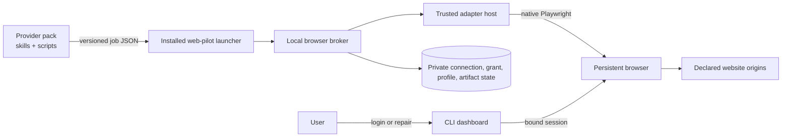

# RFC-0088: Web-pilot foundation

- **Status:** Experimental
- **Author:** eugenelim
- **Approver:** eugenelim
- **Date opened:** 2026-08-14
- **Date entered Experimental:** 2026-08-15
- **Date closed:** —
- **Decision weight:** heavy (authenticated browser state, executable adapters, a new dependency, and public contracts)
- **Related:** RFC-0017 (repo-level contracts), RFC-0031 (catalogue posture), RFC-0034 (catalogue install profiles), RFC-0084 (single sign-on destination trust), `docs/architecture/pack-layout.md`, `docs/architecture/credentials.md`
- **Research notes:**
  - [`0088-notes/playwright-contract-and-browser-landscape-survey.md`](0088-notes/playwright-contract-and-browser-landscape-survey.md)
  - [`0088-notes/plugin-contract-distribution-and-reference-adapter-survey.md`](0088-notes/plugin-contract-distribution-and-reference-adapter-survey.md)
  - [`0088-notes/cross-pack-consumer-pressure-test.md`](0088-notes/cross-pack-consumer-pressure-test.md)
  - [`0088-notes/web-connectors-and-aggregation-survey.md`](0088-notes/web-connectors-and-aggregation-survey.md)
- **Experimental evidence:**
  - [`S1 — persistent bind lifecycle`](0088-notes/spikes/s1-persistent-bind-lifecycle.md)
  - [`S2 — artifact, host, and dependency gate`](0088-notes/spikes/s2-artifact-host-and-dependency-gate.md)
  - [`S3 — safety-rail limits`](0088-notes/spikes/s3-safety-rail-limits.md)
  - [`S4 — open-source substitution check`](0088-notes/spikes/s4-oss-substitution-check.md)
  - [`S5 — cross-pack provider vertical`](0088-notes/spikes/s5-cross-pack-provider-vertical.md)
  - [`S6 — browser-session taxonomy`](0088-notes/spikes/s6-browser-session-taxonomy.md)
  - [`Synthetic fixture source archive`](0088-notes/spikes/experimental-fixture-source-archive.md)
  - [`2026-08-16 Experimental rerun`](0088-notes/spikes/2026-08-16-experimental-rerun.md)
  - [`Experimental rerun evidence archive`](0088-notes/spikes/experimental-rerun-evidence-archive.md)
  - [`2026-08-16 Experimental round 3`](0088-notes/spikes/2026-08-16-experimental-round3.md)
  - [`Round-3 Experimental evidence archive`](0088-notes/spikes/round3-evidence-archive.md)
  - [`2026-08-16 Experimental round 4`](0088-notes/spikes/2026-08-16-experimental-round4.md)
  - [`Round-4 Experimental evidence archive`](0088-notes/spikes/round4-evidence-archive.md)
  - [`Experimental rounds 5 and 6`](0088-notes/spikes/2026-08-16-experimental-round5.md)
  - [`Rounds 5 and 6 Experimental evidence archive`](0088-notes/spikes/round5-evidence-archive.md)
  - [`Experimental rounds 7, 8 and 9`](0088-notes/spikes/2026-08-17-experimental-round7.md) — **current; authoritative over every earlier round**
  - [`Round-7 Experimental evidence archive`](0088-notes/spikes/round7-evidence-archive.md)

`web-pilot` is the proposed name of an opt-in AgentBundle pack that would own
a local authenticated-browser runtime. A **provider pack** is a normal
AgentBundle pack containing skills, deterministic scripts, setup guidance, and
normally a bundled website adapter. A **website adapter** is the lower-level,
immutable executable driver loaded by the runtime. These definitions are local
to this RFC; they are not new catalogue product types.

> ## Read this before the body
>
> **Everything between here and [`## Amendments`](#amendments) is FROZEN and
> historical.** It records the 2026-08-15 Draft → Experimental decision and the
> first run's ledger. It is not the current state, and several of its clauses
> have since been withdrawn as wrong.
>
> - **Do not execute the D2 candidate list.** The body tells a reviewer that S4
>   "must also execute `agent-browser`, OpenChrome, and OpenDevBrowser against
>   the same boundary before acceptance". **Do not.** Executing two of them was
>   itself the hazard, and it caused a real credential exposure. The amended
>   rule in [S4 gate decision](#s4-gate-decision) is authoritative.
> - **The D1–D17 decisions dated "this review" were taken on 2026-08-15.**
>   Eleven of the seventeen rows say "Decide by: this review"; those are
>   historical. **Six are not:** D11 (graduation review), D16 (cross-pack spike,
>   then acceptance), D17 (S2, then first implementation spec) were always later,
>   and **D7 is explicitly still open** — Decision C below asks the approver to
>   rule on it. What is being asked now is in
>   [What the approver is being asked to decide now](#what-the-approver-is-being-asked-to-decide-now).
> - **The 2026-08-15 ledger's five "Blocked" rows are not the current
>   scorecard.** Current verdicts are six Passes — one of them, S1, qualified as
>   "Pass on the named gates; one platform row fails on BOTH platforms — round 10
>   measured on macOS what round 5 measured on Linux" — carrying **six**
>   pre-acceptance blockers, in
>   [Current Experimental state](#current-experimental-state).
> - **Item numbers written before 2026-08-17 refer to older numberings.** This
>   list has been renumbered three times (ten → nine → seven → six). The
>   enumerated list under *Current Experimental state* is the only current one;
>   references elsewhere are marked where they differ.
> - **The body is ~860 lines of history — but read two of its tables**, because
>   they are the vocabulary the amendments use and are defined nowhere else: the
>   **D1–D17 decision table** and the **S1–S6 spike table**. Skip the rest and
>   go to [`## Amendments`](#amendments).
> - **Live state, in one place:** [`## Amendments`](#amendments). Where it and
>   the body disagree, it wins. Where it and the dated audit trail below it
>   disagree, the audit trail is the record of what was believed on a date, not
>   what is true now.

## Reviewer brief

- **Decision:** Whether to validate an opt-in authenticated-browser foundation and its provider-pack/website-adapter contracts.
- **Recommended outcome:** Run only the six bounded pre-acceptance spikes while this RFC is Experimental; accept, reject, or withdraw it from the promoted evidence.
- **Change if accepted:**
  - Add a user-scope `web-pilot` accelerator pack with an embedded, unpublished Node runtime and one lockfile-pinned `playwright` dependency.
  - Add generic JSON Schema contracts for the one-shot local process protocol under the existing `contracts/jsonschema/` tree.
  - Add a provider-pack conformance profile and an opaque `auth: browser-session` credential strategy.
- **Affected surface:** pack metadata and lint, credentialed-skill conventions, user-local runtime state, browser profiles, executable adapter admission, downloads, network policy, and model-result boundaries.
- **Stakes:** Costly to reverse after third-party adapters exist; security-sensitive because admitted code controls an authenticated browser as the user.
- **Review focus:** the validation-versus-behavior authorization split, exact-digest trust, destination scope, and whether the proposed broker remains thinner than an existing browser platform.
- **Not in scope:** production implementation, implementation specs, catalogue or work-queue entries, mutation behaviors, a remote adapter catalogue, an npm SDK, background scheduling, or a vendor-specific reference adapter.

## The ask

- **Recommendation (bottom line up front):** Approve this architecture only to enter `Experimental` validation. The target is a user-scope `web-pilot` pack that installs an embedded Node runtime, owns one authenticated browser profile per connection, loads explicitly admitted immutable website adapters, and exposes a versioned local JSON process contract to provider packs. Keep executable adapters classified as trusted code, not as proven read-only sandboxes.
- **Why now (situation–complication–question):** AgentBundle integration packs can already carry skills, scripts, dependencies, and credentials, but there is no reusable contract for website-only integrations that require user handoff for sign-in and deterministic browser work afterward. Building that contract inside each provider would duplicate profile ownership, credential exposure controls, downloads, repair, and upgrade behavior. The question is whether this catalogue should validate one reusable, local-first browser foundation without moving site data into model context or creating another plugin marketplace.
- **Decisions requested:**

| ID | Question | Recommendation | Why | Decide by | Reviewer action |
| --- | --- | --- | --- | --- | --- |
| D1 | What is the product shape? | New opt-in, user-scope `web-pilot` accelerator pack with an embedded unpublished Node runtime delivered through the current skill and root-bin rails | `core` is repo-only and stack-neutral; the runtime and browser identity are user-local | This review | Confirm pack ownership, delivery, and charter fit |
| D2 | What browser substrate is admitted? | Provisionally, one exact lockfile-pinned direct production dependency: `playwright`; S4 must also execute `agent-browser`, OpenChrome, and OpenDevBrowser against the same boundary before acceptance | Current official Playwright interfaces fit the proposed native adapter ABI, while the 2026-08-15 bounded inventory found three current lifecycle candidates whose broader authority and non-native interfaces remain untested | Experimental spikes | Reopen the broker choice if a candidate removes material lifecycle code without widening authority |
| D3 | What are the extension layers? | Normal provider pack above an immutable website adapter | Keeps agent intent and deterministic domain logic in the catalogue while isolating browser-driver lifecycle | This review | Confirm the two-layer model |
| D4 | Who owns authenticated identity? | A connection owns the browser profile; resources are separately bound beneath it | One login may expose several mailboxes, projects, tenants, or accounts | This review | Confirm connection/resource separation |
| D5 | Where is authorization selected? | Per consumer activation, never globally on the connection | Consumers may migrate digests and resource scopes independently | This review | Confirm exact-grant tuple |
| D6 | How are setup and normal work separated? | Discriminated validation-only and behavior jobs | Authentication cannot become an unreviewed data-release path | This review | Confirm the split is non-negotiable |
| D7 | What is the credential primitive? | `auth: browser-session`; the browser retains authentication | Existing `sso-cookie` exports cookies and is the wrong boundary | This review, then convention amendment after acceptance | Confirm the fifth strategy |
| D8 | How are provider packs discovered? | Existing `integrations` category plus namespaced `pack.metadata.web-pilot.profile = "provider-v1"` | The destination has no `web-automation` category and no `pack.type`; open metadata is already supported | This review | Confirm the destination-specific taxonomy |
| D9 | What is the process framing and contract home? | One job JSON file in, one bounded JSON response on stdout or one bounded typed failure on stderr; cancellation uses process signals; schemas live under existing `contracts/jsonschema/` | The consumer contract is request/response, not a multiplexed service, so JSON-RPC adds an unused envelope and cancellation surface | This review | Confirm one-shot JSON and no JSON-RPC child |
| D10 | Is there an adapter catalogue? | No; provider packs and explicit local artifacts are sufficient initially | A second registry duplicates the catalogue and adds publisher/update trust prematurely | This review | Confirm the non-goal |
| D11 | Is there a public SDK? | No npm publication until a non-AgentBundle consumer or demonstrated authoring drift exists | The current process ABI supplies runtime reuse without Node linking | Graduation review | Confirm evidence-based graduation |
| D12 | What proves construction? | Synthetic `example-service` plus two synthetic provider consumers | Deterministic coverage is in scope; vendor-specific or non-SDLC references are not | Experimental spikes | Confirm the fixture boundary |
| D13 | What is the security claim? | Executable Playwright adapters are exact-digest trusted code with defense in depth | Native `Page`, context, request, and evaluation APIs can mutate or bypass in-process rails | This review | Reject any “sandboxed read-only” wording |
| D14 | What domain may use the foundation here? | Software-delivery integrations only | The charter excludes unrelated personal and business domains | This review | Confirm the scope correction |
| D15 | What does Experimental authorize? | Six throwaway evidence spikes and promotion of their notes only | Architecture acceptance must precede specs and production work | Draft → Experimental decision | Confirm the hard boundary |
| D16 | How does the pack deliver the runtime without a new projection primitive? | Carry the Node package and lockfile inside the setup skill; project a minimal Python launcher through `adapter-root-bins`; setup installs a versioned copy under user-local state | Current projection supports complete skill folders and user-scope Python root bins, but not an arbitrary Node runtime primitive | Cross-pack spike, then acceptance | Confirm the current-rail mapping |
| D17 | What blocks a vulnerable embedded runtime dependency? | S2 must prove a Node lockfile scanner and blocking policy; the first pack cannot merge until that scanner is wired into `build-check` | Current SCA covers Python dependencies, not the embedded Node lockfile | S2, then first implementation spec | Confirm the scanner gate |

### Imported-decision reconciliation

The source bundle arrived with provisional numbering, paths, metadata, and
catalogue assumptions. The following material deviations are intentional and
must remain visible during review.

| Source assumption | Destination evidence | Adaptation | Reason |
| --- | --- | --- | --- |
| RFC-0004 and `0004-notes/` | Next local ordinal is 0088 | Renumber to RFC-0088 and `0088-notes/` | RFC-0087 was assigned on `main` before this branch rebased; local RFC numbers remain unique and sequential |
| A broad browser foundation may serve finance and other personal domains | `docs/CHARTER.md` limits the catalogue to software delivery | Restrict provider and domain examples to software-delivery integrations | Charter scope is binding |
| `web-automation` is an existing category | Current soft vocabulary has `integrations`, not `web-automation` | Use `integrations` plus the namespaced conformance profile; revisit a category after a second provider | Avoid inventing taxonomy for one claimant |
| Required dependencies accept a general SemVer range and resolve by catalogue identity | `pack.schema.json` requires catalogue/pack/version, but install resolves installed packs by short name and accepts only `^X.Y` | Examples use the local catalogue name and `^1.0`; cross-catalogue providers are out of scope | Match the executable contract, not the declarative aspiration |
| A new top-level `contracts/` tree and JSON-RPC child are needed | RFC-0017 and `contracts/jsonschema/` already provide a canonical schema home; the proposed consumer exchange is one-shot | Put job/result/failure schemas under the existing JSON Schema tree and use process signals for cancellation | Avoid duplicate structure and an unnecessary RPC protocol |
| A pack can project an arbitrary embedded runtime directly | Current projection carries complete skill folders and only Python files through the shared root-bin rail | Keep the Node package and lockfile in the setup skill, project a minimal Python launcher, and install an immutable versioned runtime copy during explicit setup | Use supported delivery rails; do not invent a primitive implicitly |
| A real financial sandbox is the likely public reference | The destination charter excludes that product domain | Make `example-service` mandatory; require a separate future RFC for any real-site reference | Avoid a permanent out-of-scope maintenance obligation |
| The connector/aggregation survey promotes named out-of-scope product analogies | The charter makes those domains non-normative here | Preserve the object-model hypotheses as a source-transfer note, drop the product citations, and require S5 synthetic proof | Prevent an external analogy from becoming destination authority |
| A named existing cross-pack provider is the principal migration target | Destination implementation is intentionally not part of this RFC | Preserve the pressure test generically; require two synthetic consumers before acceptance | Keep the foundation review independent of an existing provider refactor |
| Local state used a source-repository-specific home | Existing user state is rooted at `~/.agentbundle/` | Use `~/.agentbundle/web-pilot/` in the illustrative layout | Follow destination conventions |
| Browser binding had a precise introduction-version claim | Current official release and API pages disagree on that historical detail | State the present API only; keep the combined lifecycle as a spike | Do not manufacture historical certainty |

## Problem & goals

### Diagnosis

Authenticated websites require two modes that must share one browser. A user
must sometimes complete passwords, multifactor authentication, passkeys,
CAPTCHAs, consent, or account recovery. Normal retrieval should then be
deterministic, bounded, typed, and frugal with model context. Provider-local
browser implementations tend to split those modes across profiles and duplicate
login handoff, network observation, download validation, profile locking,
repair, and redaction.

AgentBundle dependencies do not link packages at runtime. The install gate only
checks that a required pack name and compatible version are already present in
the union of user, repo, and local install state. A reusable foundation therefore
needs a stable installed launcher and process protocol; importing projected
files from another pack is not a supported composition mechanism.

### Goals

- Preserve the same live browser across user authentication and deterministic adapter work.
- Keep credentials, cookies, tokens, passkeys, authenticated headers, storage state, profiles, and raw captures outside skills and model context.
- Let provider packs remain ordinary AgentBundle products with self-contained skills and scripts.
- Admit only exact immutable adapter artifacts, with explicit upgrade and rollback per consumer.
- Separate connection identity, resource identity, and behavior authorization.
- Validate inputs and outputs against exact schemas before browser launch and before result release.
- Make drift, expiry, wrong-login, resource changes, crashes, and ambiguous profile ownership typed failures.
- Prove the contract without live credentials through a synthetic site and two provider consumers.

### Non-goals

- Website mutations: sends, submissions, configuration changes, deletes, purchases, trades, transfers, or form submission.
- A searchable adapter marketplace, remote version index, publisher service, or automatic update feed.
- Executing mutable Git branches or development directories during normal jobs.
- Treating native Playwright, Node's Permission Model, request routing, or TypeScript types as a malicious-code sandbox.
- Sending raw HTML, JSON, screenshots, traces, downloads, or authentication material to a model by default.
- Background scheduling, a remote browser backend, or a multi-user daemon in the first release.
- A public npm SDK before its graduation criteria are met.
- Domain contracts unrelated to software delivery.

## Proposal

### Product and ownership boundaries

`web-pilot` would be an opt-in, user-scope accelerator pack. It clears the
charter's accelerator exception only while it remains tied to software-delivery
integrations, declares an experimental/validated maturity state, has a named
maintainer, and carries an archive/deprecation path. It is not added to a default
profile.

The layers are deliberately separate:

| Layer | Owns | Must not own |
| --- | --- | --- |
| Provider skill | User intent, judgment, sequencing, presentation, setup and repair guidance | Browser launch, profile reads, raw credentials |
| Provider script | Deterministic provider-domain transforms that do not need a live browser | Imports from sibling skills or another pack projection |
| Website adapter | Authentication predicates, identity evidence, origins, selectors, endpoint contracts, downloads, named read behaviors | Agent prompts, user intent, global profile lifecycle |
| `web-pilot` runtime | Profile ownership, broker lifecycle, adapter admission, authorization, policy observation, schemas, redaction, artifacts, failures | Provider workflow semantics or domain normalization |
| User-local state | Connections, resources, grants, profiles, installed adapter digests, artifacts, diagnostics | Source-controlled data |

The normal path is:



The model sees only a user-authorized normalized summary or an opaque artifact
handle. Website content is untrusted data, never instructions, and is not
written to persistent agent memory automatically.

### Provider-pack conformance

The destination has no exclusive pack type and no current `web-automation`
category. A provider uses the existing soft category plus an open namespaced
metadata table:

```toml
[pack]
categories = ["integrations"]

[[pack.dependencies.required]]
catalogue = "agent-ready-repo"
pack = "web-pilot"
version = "^1.0"

[pack.metadata.web-pilot]
profile = "provider-v1"
declared-intent = "read-only"
setup-skill = "example-provider-setup"
web-skill = "example-provider-web"
adapter-delivery = "bundled"
```

Here **provider conformance profile** means a construction contract selected by
namespaced metadata. It is unrelated to a catalogue **install profile**, the
catalogue-level manifest that installs an ordered group of packs. The metadata
is a construction claim about intended behaviors, not runtime authority or a
sandbox guarantee; approval surfaces must still warn that trusted executable
code can mutate. Before acceptance, no linter understands it.
After acceptance, a follow-on spec must define static checks for the foundation
dependency, named skills, bundled candidate, read-only behavior declarations,
synthetic fixtures, and rendered-install boundaries.

The destination dependency gate ignores `catalogue` while resolving installed
state and supports only caret-minor ranges. This RFC does not extend it. A
provider from another catalogue must still arrange for an installed short-name
`web-pilot` dependency without relying on cross-catalogue resolution; improving
that resolver is a separate RFC.

### Connection, resource, and activation model

A **connection binding** owns one authenticated login, one browser-profile
namespace, a stable user alias, an adapter identity namespace, and immutable
configuration generations. A **resource binding** is a separately aliased
object visible through that login, such as a project, tenant, mailbox, or
workspace. Provider identifiers stay local.

A **consumer activation** is the authorization record for one provider
consumer. It selects:

- declared installed-consumer identity, used for confused-deputy checks among conforming callers;
- connection identity and configuration generation;
- exact admitted adapter digest;
- resource binding IDs and immutable resource-scope digest;
- behavior ID and version;
- input and output schema digests;
- sensitivity class and result policy; and
- expiry/revocation state.

The connection never has one globally active adapter digest or behavior set.
Two consumers may use the same connection with independent grants and migrate
digests separately. A newly discovered resource does not inherit an existing
grant.

Binding selectors are not capabilities. Before every behavior profile lease,
the runtime reconstructs a canonical scope object from local state, verifies an
HMAC-SHA-256 digest using an installation-local secret, checks the complete
activation tuple, and rechecks live binding identity. The secret is stored in
the user-private runtime state with current-user-only permissions. It is a
fresh, per-installation secret of at least 256 bits generated by the operating
system CSPRNG before any grant is signed; it is never deterministically
derived, reused from another installation, exported, or logged. This HMAC
detects tampering, torn writes, and accidental substitution of scope or
configuration records. Stale or replayed but validly signed records are
rejected by explicit generations, the activation tuple, expiry/revocation
state, and the live-identity check—not by the HMAC. The HMAC is not an
authorization boundary against another malicious process running as the same
operating-system user, which can replace both the secret and the grant files.
Strong consumer identity requires a later OS isolation boundary. Rotating the
secret invalidates existing grants and requires explicit re-consent; the
runtime never silently re-signs them.

V1 trusts processes already running as the same operating-system user. Each job
declares an installation-local `consumerIdentity`, and the launcher requires it
to equal the setup authorization or behavior grant before dispatch. This
prevents accidental grant substitution and catches a conforming provider using
another provider's grant ID; it does not make the grant non-transferable to a
malicious same-user process that can read or forge local invocation state. S5
tests declared-identity/tuple isolation only. Strong pack-to-pack principals or
bearer-proof claims require an OS isolation design and are not v1 guarantees.

### Validation-only versus behavior execution

The launcher is a one-shot process contract, not JSON-RPC: it accepts exactly
one confined job JSON file, emits exactly one bounded success object on stdout
or one bounded typed failure on stderr, and exits. `protocolVersion` supplies
the handshake. Cancellation and deadlines use operating-system process signals
plus the job's fixed deadline; no multiplexing, notifications, server-initiated
messages, or remote transport exist in v1. The authorization paths are
disjoint:

```ts
interface JobBaseV1 {
  protocolVersion: "1.0";
  jobId: string;
  connectionBindingId: string;
  consumerIdentity: string; // local declared pack identity; not a strong principal
  deadlineAt: string; // RFC 3339 UTC; cannot exceed the host policy maximum
}

interface ConnectionValidationJobV1 extends JobBaseV1 {
  kind: "connection-validation";
  setupAuthorizationId: string;
  operation: "authenticate" | "resolve-identity" | "health";
  resultPolicy: "local-validation-only";
}

interface BehaviorJobV1 extends JobBaseV1 {
  kind: "behavior";
  consumerGrantId: string;
  resourceBindingIds: string[];
  resourceScopeDigest: string;
  behavior: {
    id: string;
    contractVersion: string;
    inputSchemaDigest: string;
    outputSchemaDigest: string;
    sensitivityClass: "summary" | "sensitive";
    input: unknown;
  };
  resultPolicy: "agent-summary" | "local-artifact-only";
}
```

A validation job has no behavior, resource scope, consumer grant, artifact
writer, checkpoint, adapter-payload logger, or result-release operation. A
behavior job cannot name a setup authorization. Unknown or mixed fields are
rejected before browser launch. A missing, expired, malformed, or host-maximum-
exceeding deadline is rejected before a profile lease; the host timer remains
authoritative and cancels the child even if the adapter ignores its
`AbortSignal`. The host may record fixed, enum-bounded lifecycle events for
validation, but the adapter cannot supply their payload.

`resolve-identity` is also the only setup-time resource-discovery path. It
returns fixed-schema `BindingIdentityEvidence` to the host process only:
runtime-only connection/resource correlation values, ephemeral candidate keys,
an adapter-declared resource-kind enum, and an optional bounded local display
hint. The host may render those candidates in a host-owned local confirmation
UI so the user can assign aliases and choose resources. The evidence and display
hint never cross provider stdout/stderr, an artifact, a diagnostic event, or
model context; rejected/unselected candidates are discarded. Confirmation
creates the first resource generations and scope digest. This local UI is not a
behavior result-release surface.

Sensitivity and delivery are orthogonal. `sensitivityClass` classifies the
payload; `resultPolicy` selects whether any validated projection may reach the
agent or only a local artifact may be committed. Both job values must exactly
match the active grant. Any change, including a narrower delivery policy,
requires an explicit grant amendment so implementations cannot invent a
partial ordering.

Initial connection flow is:

1. Admit one exact adapter digest after non-executing artifact inspection.
2. Approve a short-lived setup authorization limited to the declared login origin and fixed authentication, identity, and health contracts.
3. Launch a dedicated persistent profile and bind the live browser for user handoff.
4. Run the adapter authentication predicate and binding-identity predicate.
5. Ask the user to confirm the connection alias and selected resources.
6. Record immutable configuration generations and keyed identity evidence.
7. Obtain a separate consumer behavior grant.
8. Only then dispatch a behavior against the same live browser.

For an existing connection, wrong identity returns
`connection-identity-mismatch` before behavior traffic or data release. If
stable identity evidence is unavailable, every new browser process or
reauthentication increments the connection generation and invalidates prior
grants.

### Browser-session credential boundary

The browser retains authentication. `web-pilot` is the opaque credentialed CLI
primitive and never returns cookies, tokens, passkeys, storage state, browser
headers, or profile paths to a skill. Existing `auth: sso-cookie` explicitly
resolves cookies, so reusing it would contradict the boundary. After acceptance,
a convention amendment may add:

```yaml
metadata:
  credentialed: true
  primitive-class: credentialed-cli
  auth: browser-session
```

The future lint must recognize only the installed launcher contract, reject
cookie-resolver imports and credential-shaped arguments, and verify that jobs
carry opaque connection, grant, behavior, resource-scope, and input values.
This RFC does not edit conventions or lint while Draft or Experimental.

### Runtime delivery and browser lifecycle

The current pack contract has no arbitrary Node-runtime projection primitive.
This RFC therefore maps delivery onto existing rails rather than assuming one:

```text
packs/web-pilot/.apm/skills/web-pilot-setup/scripts/runtime/
  package.json
  package-lock.json
  dist/                         # embedded unpublished runtime payload
packs/web-pilot/.apm/adapter-root-bins/web-pilot.py
  -> ~/.agentbundle/bin/web-pilot.py

explicit setup
  -> ~/.agentbundle/web-pilot/runtime/<pack-version>/
  -> ~/.agentbundle/web-pilot/current activation record
```

The setup skill owns the Node package, exact lockfile, and embedded payload.
The existing user-scope `adapter-root-bins` rail carries only a minimal
pure-stdlib Python launcher; it does not carry the Node runtime or contain
browser logic. Explicit setup copies and verifies the versioned payload into
user-local state, resolves the manifest-declared runtime prerequisites, and
atomically changes the current activation only after checks pass. The launcher
fails closed when the activated runtime is absent, corrupt, incompatible, or
belongs to a disabled pack. Provider packs call this stable launcher and never
locate a projected skill. S5 must prove the mapping against both source and
rendered installations; failure reopens D16 before any pack implementation.

The pack manifest's existing `runtime-dependencies` surface records the system
Node prerequisite and exactly one direct production npm dependency: an exact
`playwright` version. The setup skill's lockfile pins and scans all transitives
and is the dependency source of truth. Separately approved, exact-pinned
build-only tooling is permitted only when S2 proves it necessary; it is not
shipped in the runtime artifact and its addition is recorded as a material RFC
decision before acceptance. No other production dependency, crawler,
model-driven browser framework, standalone MCP package, stealth plugin, or
remote-browser SDK is admitted initially.

The recommended broker is on-demand and user-local. It owns process liveness,
profile leases, crash detection, idle shutdown, a private local endpoint, and
redacted lifecycle events. It launches a headed persistent context, obtains the
owning browser, binds it, and allows separately authorized CLI dashboard
attachment. One connection executes jobs serially; different profiles may run
concurrently under a global cap.

All endpoints live in a user-private run directory and prefer Unix-domain
sockets or named pipes. Any loopback WebSocket fallback requires a per-launch
unguessable credential delivered out of band, current-user access checks, and
no stable port. Every dashboard or repair attachment credential is bound to the
current user, connection, profile/identity generation, and single declared
purpose; it is short-lived and single-use for attachment establishment. It is
revoked on timeout, cancellation, browser/broker crash, disconnect, identity
change, or repair completion. Endpoint credentials never enter jobs, logs, or
model context.

Official documentation establishes the individual APIs, not the complete
persistent-profile → bind → attach → crash/reconnect behavior. Experimental
spike S1 must test the composition before it becomes a contract.

### Website-adapter artifact and runtime contract

An adapter artifact contains inert metadata separately from executable code:

```text
adapter-package/
├── web-pilot.adapter.json
├── dist/adapter.mjs
├── contracts/
├── provenance.json
└── conformance/synthetic-fixtures/
```

The installer reads and validates the manifest without importing the entry
point. It rejects absolute paths, traversal, symlinks, native add-ons, install
scripts, remote schema references, unexpected executables, and entry points
outside the artifact root. Files are staged outside the final digest path,
hashed, marked complete, and atomically finalized where the platform supports
it. Incomplete or mismatched trees are quarantined. Trust approval is stored
outside the artifact and cannot be reconstructed from bytes alone.

`provenance.json` is inert, digest-covered metadata naming the source origin
and immutable ref/archive digest, build recipe, toolchain, dependency lockfile
digest, build materials, and whether reproducibility was attempted and
achieved. Admission verifies internally referenced materials without executing
the adapter. If the source-to-artifact relationship cannot be independently
verified, the artifact is labelled `source-unverified trusted code`, requires a
distinct explicit approval, and can never activate automatically. Immutability
does not substitute for provenance or publisher trust.

The manifest declares adapter identity/version, runtime and Playwright
compatibility, exact origins by purpose, login and identity contracts,
per-connection profile strategy, configuration schemas, read behaviors,
input/output schema paths and digests, sensitivity class, method rules, Service Worker
posture, artifacts, and bounded health signals. Origin rules are structured
HTTPS scheme/ASCII host/effective-port values. Live adapters reject loopback,
private, link-local, multicast, and metadata destinations after DNS resolution
and on every redirect/connection. Synthetic fixtures may request an explicit
loopback/HTTP exception that is invalid for other environments.

Protocol and manifest versions use `MAJOR.MINOR`. Minor versions may add
optional fields or failure kinds; semantic changes require a major. Behavior
versions follow SemVer independently, and a published behavior version's schema
digests are immutable. The runtime rejects unsupported version windows before
browser launch and preserves unknown failure kinds as bounded
`unknown-runtime-failure` results.

### Native Playwright and trusted-code posture

Capable adapters receive the host's native pinned `Page` and `BrowserContext`
plus mode-specific fixtures. The adapter neither bundles nor launches
Playwright.

```ts
interface BrowserExecutionBase {
  readonly page: Page;
  readonly context: BrowserContext;
  readonly signal: AbortSignal;
}

interface ValidationExecution extends BrowserExecutionBase {
  readonly job: Readonly<ConnectionValidationJobV1>;
  readonly connection: Readonly<{ alias?: string; config: unknown }>;
  // Deliberately no local resource bindings, artifact writer, adapter logger,
  // checkpoint sink, behavior request, or result-release capability.
}

interface BehaviorExecution extends BrowserExecutionBase {
  readonly job: Readonly<BehaviorJobV1>;
  readonly connection: Readonly<{ alias: string; config: unknown }>;
  readonly resources: readonly Readonly<{
    resourceBindingId: string;
    alias: string;
    kind?: string;
    config: unknown;
  }>[];
  readonly artifacts: ArtifactWriter;
  readonly log: RedactedAdapterLogger;
  checkpoint(checkpoint: Readonly<{
    ruleId: string;
    completedPages?: number;
    completedItems?: number;
  }>): void;
}
```

A checkpoint is an internal progress observation, not a general adapter output
channel. `ruleId` must be a manifest-declared public-safe opaque identifier;
counts are non-negative bounded integers; no free-form string, cursor, URL,
provider identifier, page content, authentication material, or adapter-defined
object is accepted. The fixed schema is capped at 4 KiB, redacted and validated
before it enters quarantined job state, and is never released as a result,
artifact, diagnostic, log payload, or model-visible value. An invalid or
oversized checkpoint fails closed with `invalid-checkpoint`, cancels the job,
and prevents every result or handle release. Finalization removes its
quarantined checkpoint state; exceptional paths follow the fixed retention rule
without widening its audience.

Native Playwright exposes evaluation, clicks, form submission, route removal,
context access, downloads, WebSockets, and an authenticated request client with
mutating methods. Admitting a `trusted-playwright` artifact is approval to run
reviewed same-user code with the authenticated browser. Broker-installed routes,
event observation, method/origin rules, Service Worker blocking, sanitized
environment, child-process/native-addon denial, filesystem restrictions, and
Node permissions are safety rails against mistakes and drift. They are not a
security boundary against malicious admitted code.

A separate `declarative` execution tier may interpret a small allowlisted
operation set and make a stronger restriction claim. It must not become the ABI
for capable adapters or force the foundation to mirror Playwright.

### Network, downloads, filesystem, and result handling

Source preference is: supported customer API or export, website download,
observed same-origin internal API, then DOM extraction. Internal endpoints are
documented as unstable and never represented as supported public APIs.

The context-associated request client may be used for same-origin
cookie-authenticated reads because current Playwright documentation confirms it
shares the browser context's cookie jar. Application-held bearer tokens may be
used only inside the browser/adapter runtime through observed requests or
in-page fetch. No token, cookie, authenticated header, replayable request, or
raw response crosses the consumer protocol.

Downloads are written only through a generated-path artifact writer beneath one
canonicalized job root. The host validates declared origin, period or selector,
status, media type, magic bytes, size, safe filename properties, and hash before
commit. Adapter-supplied paths are forbidden. Retention is bounded and purge
targets only runtime-owned directories.

Results and artifacts use a two-phase commit. Job output remains quarantined
until behavior-output schema validation, artifact validation, authorization
recheck, sensitivity/result-policy checks, and finalization all succeed. A
timeout, cancellation, component crash, or schema/policy failure releases no
result, checkpoint, artifact handle, or diagnostics handle; it emits one
bounded typed failure and precisely purges or quarantines the generated job
temporary state according to the fixed retention policy.

The first release uses these falsifiable default ceilings. S2/S3 may recommend
different values, but any change before acceptance is recorded in the decision
log and retains both a byte/count bound and an age/cleanup rule.

| State | Default hard bound | Retention / cleanup trigger | Exhaustion behavior |
| --- | --- | --- | --- |
| Protocol stdout | 256 KiB serialized, one response | Process exit | Fail with `resource-limit-exceeded: result-bytes`; release no partial JSON |
| Protocol stderr | 16 KiB serialized, one failure | Process exit | Truncate only at schema-approved field boundaries and emit `resource-limit-exceeded: failure-bytes` |
| Committed artifacts | 512 MiB and 50 files per job; 20 completed jobs per connection | 30 days or explicit exact-job purge, whichever is earlier | Refuse commit with `resource-limit-exceeded: artifact-quota`; preserve prior committed jobs |
| Diagnostics | 64 MiB per job; 10 completed diagnostic jobs per connection | 7 days or explicit exact-job purge | Stop capture and return the original bounded failure plus `diagnostics-truncated: true` |
| Quarantine / staging | 1 GiB and 20 entries per installation | 7 days; cleanup at startup and before install | Refuse new install/job finalization with `storage-quota-exceeded`; never evict an active or rollback target |
| Active browser profile | One profile per connection, 5 GiB | No age purge while active; 7 days after disconnect-local unless the user purges sooner | Refuse launch with `resource-limit-exceeded: profile-bytes`; never delete browser state implicitly |

Cleanup runs under the same path jail and lock as the owning store. A cleanup
failure is a bounded `retention-cleanup-failed` event; it never broadens a
deletion target or silently discards an active profile, activation, or rollback
artifact. The runtime reports current usage and the exact user action needed to
purge a generated job, retired connection, or quarantined entry.

Stdout contains one bounded protocol response. Nonzero exits emit one bounded,
redacted typed failure on stderr. Neither channel may contain raw stacks,
environment values, URLs, headers, page text, browser errors, subprocess output,
or local paths. Detailed diagnostics remain in the confined local store behind
an opaque handle.

Lifecycle observability uses a fixed `DiagnosticEventV1`, not adapter-authored
prose. One event is at most 8 KiB and contains only: schema version; opaque
correlation/job IDs; RFC 3339 timestamp; component and phase enums; outcome;
adapter ID/version/digest; declared behavior and rule IDs; connection/resource
aliases when the user marked them safe; schema digests; bounded
page/item/byte/retry counts; typed failure kind; retryability; and a fixed
recovery-action enum. Every terminal failure includes correlation ID,
timestamp, component, phase, failure kind, retryability, and recovery action.
URLs, headers, DOM/page text, provider identifiers, values, filenames, local
paths, environment data, raw exceptions/stacks, and arbitrary adapter strings
are schema-invalid. Construction fixtures must prove both usefulness of the
minimum terminal event and rejection of every forbidden field class.

Illustrative local state:

```text
~/.agentbundle/web-pilot/
├── bin/web-pilot
├── runtime/<pack-version>/
├── registry.json
├── adapters/store/<sha256>/
├── connections/<generated-id>/
├── profiles/<generated-id>/
├── artifacts/<generated-id>/<job-id>/
├── diagnostics/<generated-id>/<job-id>/
└── run/
```

Generated IDs, never aliases, URLs, adapter metadata, or downloaded filenames,
form path components. Every resolved path must remain inside its owner root after
symlink or junction resolution.

### Domain-profile boundary

`web-pilot` owns only generic provenance, authorization, artifact, health, and
failure envelopes. A domain conformance profile may be advertised only after an
accepted RFC names its owner pack, versioned definition, exact definition and
schema digests, sensitivity floor, canonical fixtures, and behavior-role
mapping. The provider must depend on that owner pack. Catalogue conformance
verifies the inert declaration and fixtures; the browser runtime treats the
payload as opaque.

No domain profile is created by this RFC. Source-bundle domain-profile sketches
are non-normative and are not promoted as destination capabilities or
machine-discoverable claims.

### Installation, upgrade, rollback, and repair

Installation and activation are separate transitions:

```text
install provider pack
  -> inspect candidate artifact without execution
  -> show exact digest and behavior/schema/origin/method/trust diff
  -> approve constrained execution of that digest
  -> stage and finalize disabled immutable artifact
  -> run synthetic conformance
  -> authorize validation-only connection setup
  -> confirm live identity and resource aliases
  -> approve exact consumer behavior grant
  -> activate atomically; retain prior activation for rollback
```

A provider pack update may carry a new candidate but never admits or activates
it silently. Normal execution never loads a mutable checkout. Public or private
Git may host provider-pack or adapter source; Git credentials and source updates
remain outside the runtime.

Connection and resource configuration use immutable generations independent of
adapter code. A migration copies prior configuration into staging, validates the
candidate, and requires per-consumer activation. Adapter code never migrates a
browser profile.

Supervised repair attaches approved CLI/tooling to the same browser and may
capture time-bounded raw local diagnostics. It cannot package, admit, activate,
or send captures to a model automatically. A model-proposed patch remains
untrusted source requiring human review, tests, a new digest, and explicit
activation.

### No second catalogue and no npm SDK

V1 has no adapter search, publisher namespace, remote index, automatic update
feed, marketplace UI, or mutable remote loader. A future distribution RFC needs
observed independent publishers, multi-user approval/revocation needs, a
non-AgentBundle consumer, or material failure of direct immutable installation.
Its first option must be the existing AgentBundle catalogue.

The process ABI and copied/generated types are sufficient for current
AgentBundle consumers. Publish an npm SDK only when a second non-AgentBundle
consumer exists, multiple foundational packs need in-process imports, or two
independent provider implementations demonstrate schema/type drift that copied
types and contract tests cannot control.

## Experiment / validation

Moving this RFC to `Experimental` authorizes only throwaway prototypes in an
approved temporary path and promotion of evidence notes under
`0088-notes/spikes/`. It does not authorize a pack, dependency, production code,
implementation spec, catalogue entry, changelog entry, guide, or queue item.

### Experimental run ledger — 2026-08-15

| Spike | Result | Decision effect | Exit disposition |
| --- | --- | --- | --- |
| [S1](0088-notes/spikes/s1-persistent-bind-lifecycle.md) | Blocked at browser launch for bundled and system channels | No initial OS/browser support row is accepted; D2 remains operationally unproven | Rerun outside the enterprise Mach-port restriction |
| [S2](0088-notes/spikes/s2-artifact-host-and-dependency-gate.md) | Artifact/host construction passed; vulnerability-database access blocked | Self-contained ESM archive needs no demonstrated bundler, but D17 has no scanner or blocking policy | Rerun scanner clean and controlled-vulnerable cases; rerun native host after S1 |
| [S3](0088-notes/spikes/s3-safety-rail-limits.md) | Local file/data rails passed; browser/network corpus blocked | Preserve the trusted-code claim; no browser rail is promoted to enforced read-only | Rerun the complete browser/network corpus after S1 |
| [S4](0088-notes/spikes/s4-oss-substitution-check.md) | Bounded candidate inventory recorded; executable conformance blocked | Retain the thin broker provisionally; add `agent-browser`, OpenChrome, and OpenDevBrowser to the mandatory rerun because their current daemon/profile lifecycles are material candidates | Run all candidates through the same S1/S3 corpus before acceptance |
| [S5](0088-notes/spikes/s5-cross-pack-provider-vertical.md) | Pack projection, dependency, and grant isolation passed; same-browser row blocked | D16 and the exact-grant/validation split are constructible on current rails | Rerun same-browser handoff after S1 |
| [S6](0088-notes/spikes/s6-browser-session-taxonomy.md) | Prototype feasibility passed | D7 is feasible without cookie export; current production lint and conventions remain unchanged | Satisfied for Experimental evidence; convention amendment still waits for acceptance |

These results are intentionally not rewritten as positive architecture proof.
S1, S2, S3, S4, and S5 remain open Experimental gates. The S4 candidate-set
change is the only new material ecosystem deviation: the broker decision must
be reopened if any of the three newly load-bearing candidates passes the
native-adapter and authority tests.

The RFC may advance from Experimental only when all six spikes satisfy the
evidence contract below, S2 identifies a Node lockfile scanner and blocking
policy that the first implementation spec must wire into `build-check`, S1
records the accepted initial OS/browser support matrix and explicit deferrals,
and any decision-changing result has passed targeted adversarial,
security-design, and quality review. No foundation pack may merge until that
scanner runs against the frozen runtime lockfile and fails on the accepted
severity/policy threshold.

Every promoted spike note must contain:

| Evidence field | Required content |
| --- | --- |
| Reproduction identity | Exact OS/architecture, browser channel/version, Node and Playwright versions, artifact/lockfile digests, tool versions, and repository ref |
| Reproduction procedure | Copy-paste-safe commands, synthetic fixture paths relative to the repository or approved temporary root, setup/cleanup, and expected exit status |
| Scenario matrix | One row per scenario ID with precondition, stimulus, expected observable/failure kind, actual bounded observable, pass/fail, and evidence digest/path |
| Sensitive-data disposition | Confirmation that only synthetic inputs and redacted bounded outputs were promoted; raw local diagnostics remain outside the repository |
| Decision impact | Which decision/assumption the result confirms, revises, defers, or rejects; owner and required targeted re-review |

A summary assertion without the scenario rows and reproducible fixture is not
evidence and cannot satisfy Experimental exit.

| Spike | Load-bearing question | Required scenario groups | Pass bar / decision output |
| --- | --- | --- | --- |
| **S1 — Persistent bind lifecycle** | Can one owner preserve same-browser handoff and recover safely? | Persistent launch; owning-browser lookup; bind and CLI/dashboard attach; default-context visibility; disconnect/reconnect; short-lived attachment expiry; browser close; owner crash; stale/ambiguous lock; clean shutdown; bundled Chromium and one system channel | Every scenario has deterministic state/typed failure; choose the initial OS/browser matrix or explicitly defer a row |
| **S2 — Artifact, host, and Node dependency gate** | Can exact adapter/runtime artifacts be inspected, scanned, and executed without hidden dependency surfaces? | Plain ESM, package archive, bundled ESM; non-executing manifest/provenance inspection; install-script/native-addon refusal; host-supplied Playwright; sanitized environment; output validation; source-verified and source-unverified approval; throwaway lockfile scanner pass/fail; proposed frozen-lockfile CI command | Select artifact shape and any bundler; record mandatory provenance; prove the scanner catches a controlled vulnerable fixture and define blocking policy |
| **S3 — Safety-rail limits** | Which read-only controls prevent, detect, or cannot observe capable-adapter behavior? | Page-route precedence/removal; Service Workers; page and worker fetch; WebSockets; redirects; DNS rebinding; browser proxy; inherited proxy environment; raw Node egress; every request-client method; path/symlink escape; logging; downloads; each retention/quota and two-phase-commit failure | Apply exact origin/method/DNS policy wherever controllable; classify every channel and preserve the trusted-code claim for every unobservable path |
| **S4 — Substitution check** | Does an existing local-first broker remove material lifecycle code without widening authority? | Dated candidate inventory; reproducible search and inclusion criteria; official primary contract/version evidence per candidate; same profile ownership, handoff, deterministic adapter, crash recovery, attachment lifetime, local containment, dependency/update posture; responsibility-by-responsibility comparison matrix | Survey at least the pinned browser's bundled interface plus every candidate meeting the recorded criteria; adopt only when a candidate passes the same scenarios and removes named custom responsibilities, otherwise retain the thin broker with a falsifiable rejection row for each candidate |
| **S5 — Cross-pack vertical** | Does the current pack system deliver and isolate the foundation for two conforming consumers? | D16 payload/root-bin/versioned-install map; source and rendered installs; dependency absence; stable launcher only; no cross-pack imports; provenance survival; source-unverified approval; host-only identity/resource candidate display and discard; two declared consumer identities and grants with distinct behavior/schema/resource tuples; mismatched identity/grant pair; ungranted resource; sensitivity-only mismatch; result-policy-only mismatch; attempted narrower policy without grant amendment; positive cases for `agent-summary` and `local-artifact-only`; independent digest upgrade; same-browser handoff | Candidate evidence reaches only the local confirmation UI; every tuple, sensitivity, result-policy, or declared-identity mismatch fails before browser launch; both exact policy cases pass; rendered artifacts match source contracts; no claim is made against a malicious same-user caller |
| **S6 — Credentialed-skill taxonomy** | Can lint recognize an opaque browser session without creating a credential export path? | Accepted launcher form; cookie-resolver import; credential-shaped argv; cookies/tokens/storage state/auth headers on stdout, stderr, job JSON, diagnostics event, or model result | Only opaque selectors and behavior input cross the consumer boundary; every credential-shaped fixture is rejected |

Post-acceptance gates remain separate: transactional registry fault injection,
full platform support, and any real-site reference adapter. None may be smuggled
into Experimental work.

## Testing strategy after acceptance

Verification is split by artifact and test level; no single end-to-end journey is
allowed to substitute for lower-level contract or fault tests.

| Owning follow-on artifact | Test level | Required verification | Release gate |
| --- | --- | --- | --- |
| Credentialed-skill convention amendment | Static metadata/lint | Exact launcher form; exactly one npm `playwright` runtime dependency with an exact version; lockfile/scanner-input match; no additional runtime npm dependency without an accepted decision; browser-session credential-exfiltration fixtures | Amendment accepted before Spec 1 implementation |
| Spec 1 — foundation delivery and lifecycle | Contract plus construction | Manifest/job/failure handshake; malformed, expired, and host-maximum-exceeding deadlines rejected before profile lease; host timer cancels an adapter that ignores `AbortSignal`; exactly one terminal protocol object and no result/artifact/diagnostic handle after cancellation; validation fixture surface absence; D16 source/render/install mapping; persistent browser/attachment lifecycle bound to the S1 support matrix; two-provider authorization journey; scanner wired into `build-check` | Must pass before the first foundation pack can merge |
| Spec 1 — installation-state acceptance gate | Component fault injection | Interrupt artifact copy, hashing, completion marker, admit, activation, configuration staging, upgrade, rollback, repair, and registry reconstruction at every transition; prove no torn activation and no loss/change of prior grant, profile, or rollback target | Must pass before the first foundation pack can merge |
| Spec 2 — results, files, policy, and diagnostics | Contract, property, and malicious-fixture tests | Result/artifact/diagnostic schemas; two-phase commit; every quota/retention trigger; origin/DNS/method policy; downloads/path jail; S3 bypass corpus; terminal-event usefulness and forbidden-field rejection | Must pass before behavior results or downloads ship |
| Spec 3 — developer workbench | Construction and operator-recovery tests | Mutable dev-link isolation; supervised probe/repair authorization; capture retention; package/provenance diff; explicit activation and rollback | Must pass before repair tooling ships |
| Each adopting provider spec | Source/rendered conformance plus synthetic journey | Reject sibling-skill reads, projection imports, provider-owned Playwright, undeclared cross-pack imports, missing dependency, metadata mismatch, schema/grant mismatch, and resource widening | Required per provider; does not weaken foundation gates |
| Local smoke protocol | Supervised live check | Explicit supported-matrix browser/site check with raw results local only | Never a CI substitute or acceptance proof by itself |

An authorization-order fixture must prove validation can call only
authentication, identity, and bounded health. Attempts to execute a behavior,
observe existing local resource bindings, write an artifact, log adapter
payload, checkpoint, or release data must fail before dispatch. Fixture-level
type and runtime probes must show those properties and methods are absent, not
merely reject calls after data has been exposed. Only a committed consumer
grant may open the behavior surface. A paired setup fixture proves
`resolve-identity` candidate evidence is schema-bounded, rendered only by the
local host confirmation UI, discarded on rejection, and absent from provider
stdout/stderr, artifacts, diagnostic events, and model results.

## Options considered

The options are MECE along three independent axes: browser ownership, adapter
expressiveness, and distribution. Each axis includes do-nothing.

### Browser ownership axis

| Option | Benefit | Cost / failure mode | Verdict |
| --- | --- | --- | --- |
| Provider-local browser scripts (do nothing) | No new pack | Duplicated profiles, controls, downloads, and repair; no shared handoff contract | Reject |
| CLI-only owner | Strong dashboard and handoff | Function/command surfaces are not a general module loader | Reject as production loader |
| Library-only owner | Direct imports and type safety | No durable standard handoff/dashboard attachment surface | Insufficient alone |
| Library broker plus bound CLI | Same live browser, native imports, bounded lifecycle owner | Adds a small process, IPC, locks, and crash recovery | Recommend, subject to S1 |
| Remote browser service | Managed session lifecycle | Authenticated state leaves the device; adds service and cost boundaries | Defer |

### Adapter expressiveness axis

| Option | Benefit | Cost / failure mode | Verdict |
| --- | --- | --- | --- |
| Declarative only | Strongest enforceable restriction | Cannot express all site authentication, observation, and download flows | Supported tier, not sole ABI |
| Home-grown browser facade | Narrow apparent API | Mirrors and lags Playwright; still bypassable if native objects leak | Reject |
| Native Playwright trusted code | Durable ecosystem contract and capable adapters | Cannot prove read-only against malicious approved code | Recommend with honest trust |
| OS/container isolation for hostile code | Stronger containment | Platform complexity and a different product boundary | Future option |
| No adapters (do nothing) | No executable extension risk | Every provider must modify the foundation or duplicate browser code | Reject |

### Distribution axis

| Option | Benefit | Cost / failure mode | Verdict |
| --- | --- | --- | --- |
| Provider pack plus exact local artifact | Reuses the catalogue; separates product install from code trust | Explicit approval and update ceremony | Recommend |
| Mutable local folder or Git checkout | Easy development | Time-of-check/time-of-use drift | Development mode only |
| Private npm package | Native Node resolution | Registry credentials, release, install-script, and supply-chain surface | Defer |
| New adapter catalogue | Discovery and centralized updates | Duplicates catalogue infrastructure and publisher governance | Reject initially |
| Hard-code adapters in foundation (do nothing) | Simple first driver | Couples every site change to the foundation release | Reject |

## Risks & what would make this wrong

### Pre-mortem

- **The broker becomes a general browser platform.** Stop and repeat S4 if it grows beyond profile ownership, attachment, policy observation, and recovery.
- **Read-only language creates false confidence.** Keep the trusted-code label in manifests, approval prompts, docs, and failures; never call executable adapters sandboxed.
- **Authentication leaks through convenience APIs.** Contract tests treat stdout, stderr, exceptions, diagnostics, artifacts, jobs, and model summaries as independent exfiltration channels.
- **Validation becomes a behavior back door.** Keep distinct TypeScript types, schemas, host dispatch tables, and authorization records; test surface absence, not only runtime denial.
- **A provider update silently changes executable code.** Pack installation exposes a disabled candidate only; exact-digest activation stays separate and per consumer.
- **The local registry becomes a second package manager.** Search, remote credentials, automatic updates, and dependency solving require a new RFC.
- **Untrusted website text steers an agent.** Normal jobs normalize and validate results; raw repair projections are explicit, attributed, bounded, and user-reviewed.
- **Profiles or downloads escape confinement.** Generated path components, canonicalize-then-confine checks, symlink/junction fixtures, private permissions, and exact deletion roots are mandatory.
- **Dependency updates expand supply-chain risk.** Frozen lockfile installation, one direct browser dependency, SCA, inventory, side-by-side runtime rollback, and no adapter install scripts bound the change.

### Key assumptions

- The current library-owned persistent browser can be bound and attached with the required default-context behavior.
- A small broker can survive agent turns without becoming a scheduler or multi-user service.
- Self-contained ESM adapters are practical without runtime install scripts or native add-ons.
- The local launcher is sufficient cross-pack linkage under current projection rules.
- Two synthetic provider consumers are enough to expose domain leakage before acceptance.
- Users can understand exact-digest executable-adapter approval as a trusted-code act.

S1, S2, or S5 failing without a bounded alternative invalidates the recommended
architecture. S3 cannot validate a malicious-code sandbox; a result claiming it
does is itself a failed spike.

### Drawbacks

- The broker, installer, schemas, authorization store, policy observation, and conformance suite are substantial foundation work.
- User-scope installation and browser binaries increase disk and update cost.
- Explicit updates are slower than automatic updates.
- Native Playwright preserves author capability at the cost of hard isolation.
- The first release is limited to software-delivery providers and cannot claim general connector-market fit.

### Architectural tradeoffs and sensitivity points

- **Native API versus containment:** native Playwright reduces adapter and upgrade friction but widens blast radius. The design chooses capability plus explicit trust; declarative adapters remain the stronger-restriction option.
- **Local continuity versus operability:** an on-demand broker preserves memory-only sessions but creates process/lock recovery work. S1 is the sensitivity point; if recovery code grows materially, adopt an existing broker.
- **Exact approval versus update velocity:** immutable digest grants slow urgent adapter repair but prevent mutable-source drift. The design chooses reviewability and rollback.

## Evidence & prior art

### Destination repository evidence

- `packages/agentbundle/agentbundle/_data/pack.schema.json` permits open namespaced metadata, declares `runtime-dependencies`, has no `pack.type`, and requires dependency objects with catalogue, pack, and version.
- `packages/agentbundle/agentbundle/commands/install.py` enforces required dependencies before writes, resolves the union of installed scopes by pack name, and accepts only `^X.Y` ranges.
- `packages/agentbundle/agentbundle/categories.py` provides a soft category vocabulary containing `integrations` but not `web-automation`.
- RFC-0017 and the current `contracts/jsonschema/` tree establish the canonical repo-level home for the one-shot job/result/failure schemas.
- RFC-0031 rejects a hosted registry and makes `pack.toml` the rich source of truth with lossy projection.
- RFC-0034 distinguishes catalogue install profiles from dependency graphs and records deps-first composition.
- The credentialed-skill convention currently has four auth strategies; none represents an opaque live browser session.

### External contract evidence

- Current official [Playwright release notes](https://playwright.dev/docs/release-notes) document the bundled CLI/MCP entry points and browser binding interoperability.
- The [Browser API](https://playwright.dev/docs/next/api/class-browser) documents `browser.bind()` and `unbind()`.
- The [BrowserType API](https://playwright.dev/docs/api/class-browsertype) documents persistent contexts and the prohibition on concurrent owners for one user-data directory.
- The [BrowserContext API](https://playwright.dev/docs/api/class-browsercontext) documents access to the owning browser and warns that context routing does not intercept requests handled by Service Workers.
- The [CLI sessions and dashboard guide](https://playwright.dev/agent-cli/sessions) documents named sessions, persistent profiles, visual takeover, and manual interaction.
- The [API request documentation](https://playwright.dev/docs/next/api/class-apirequestcontext) confirms that the context-associated request client shares the browser context's cookie jar and exposes mutating methods.
- The official [Node Permission Model](https://nodejs.org/api/permissions.html) is a defense-in-depth control and does not protect against malicious code.

The four companion notes preserve the imported surveys while correcting the
destination schema, category, contract-path, product-scope, and Playwright
history assumptions.

## Open questions

1. **Which operating systems and browser channels enter the first supported release?** Recommended candidate: macOS with bundled Chromium; S1 must also test one system channel so the Experimental exit can either admit it or record an explicit deferral. Keep path and IPC contracts portable. Owner: RFC approver. Decide by: Experimental exit.
2. **Does adapter packaging require build-only bundler tooling?** Recommended default: accept plain self-contained ESM if S2 proves dependency isolation; add exact-pinned, scanned, non-shipped build tooling only when the spike demonstrates it is necessary and record the deviation in this RFC before acceptance. Owner: RFC owner with approver. Decide by: S2 / Experimental exit.
3. **Does the pack clear the charter's “used often enough” bar?** Recommended default: require S5 to prove two independent software-delivery provider consumers before acceptance. Owner: RFC approver. Decide by: Experimental exit.

## Follow-on artifacts

Create these only after the RFC is Accepted and the approver separately
authorizes implementation:

- ADR: library-owned broker plus bound Playwright CLI.
- ADR: immutable adapter artifacts and no remote adapter catalogue in v1.
- Convention amendment: add `auth: browser-session` and its lint contract.
- Spec 1: synthetic foundation/provider vertical, current-rail runtime delivery,
  browser lifecycle, authorization-order fixtures, and the installation-state
  fault-injection gate for install/admit/activate/upgrade/rollback/repair;
  include the user guide for install, login handoff, recovery, and disconnect.
- Spec 2: generic result/artifact, download, retention/quota, diagnostics,
  redaction, authorization, and network/filesystem policy contracts.
- Spec 3: developer workbench, supervised probes, packaging/provenance review,
  and repair workflow.
- A separate provider-adoption RFC/spec for each existing pack after the foundation is available; mutation paths remain out of scope.

No follow-on artifact is created while this RFC is Draft or Experimental.

## Amendments

### Current Experimental state

This section is the authoritative current contract where it differs from the
2026-08-15 body or ledger. The historical ledger remains as the audit trail for
the first run, and the round-2 verdicts it superseded are preserved in the
[2026-08-16 rerun note](0088-notes/spikes/2026-08-16-experimental-rerun.md).

**Safety-critical D2 supersession:** do not execute the historical decision
table's execute-all instruction. The adopted two-stage rule in
[S4 gate decision](#s4-gate-decision) is authoritative.

**Body clauses this section withdraws or supersedes.** The body above is frozen,
so it cannot carry a marker where each claim is made. A reader working top to
bottom will meet all of these as live text; every one is superseded here:

| Body claim | Where it appears | Superseded by |
| --- | --- | --- |
| "S4 must also execute `agent-browser`, OpenChrome, and OpenDevBrowser against the same boundary before acceptance" | D2, *The ask* | [S4 gate decision](#s4-gate-decision) — executing two of them was itself the hazard |
| Attachment credentials are "short-lived and single-use for attachment establishment" | *Runtime delivery and browser lifecycle* | Correction 8, refined by round 4 |
| "Live adapters reject loopback, private, link-local, multicast, and metadata destinations after DNS resolution and on every redirect/connection" | *Website-adapter artifact and runtime contract* | *Network corrections in force* — an invariant, not a capability of the route API |
| Node permissions listed among the safety rails | *Native Playwright and trusted-code posture* | Correction 7 — one coarse `net` permission gates the transport too |
| "S1, S2, S3, S4, and S5 remain open Experimental gates" | *Experimental run ledger — 2026-08-15* | The current-state table above; that sentence is dated commentary, not a live status |
| The three *Open questions* | *Open questions* | Q1 is now blocker item 1; Q2 was answered by S2 (plain self-contained ESM, no bundler); Q3 remains open and is unchanged |

The `Experimental run ledger — 2026-08-15` and the `Experiment / validation`
tables are the **first** run's record. Where they and this section disagree,
this section wins.

Current verdicts reflect the seventh, eighth and ninth Experimental runs
([rounds 7-9 note](0088-notes/spikes/2026-08-17-experimental-round7.md)), which is
authoritative over the
[rounds 5 and 6](0088-notes/spikes/2026-08-16-experimental-round5.md),
[round-4](0088-notes/spikes/2026-08-16-experimental-round4.md) and
[round-3](0088-notes/spikes/2026-08-16-experimental-round3.md) notes where they
disagree.

**Rounds 7 and 8 closed an item on measurement, and round 7's stronger headline is
withdrawn.** Round 7 claimed to be "the first round in four to close on measurement
rather than correct its predecessor"; the audit trail below records rounds 4 and 5
each closing blockers on measurement, and round 7 did correct its predecessor by
reversing round 6's profile-minimum claim. What holds is narrower: **round 7 was the
first round whose new measurements found no defect in the architecture**, and
whether its closures survive is a question only a later round can answer. Round 6 had raised the list from four items to seven
by withdrawing three round-5 claims; round 7 closes one outright, shrinks four,
and the count goes **7 → 6**. Three of round 6's residuals were phrased as "this
was never measured" rather than "this is how it behaves", and each proved
answerable in a single experiment:

- **The renderer-sandbox condition is discharged.** Correction 15 required a
  design shipping sandboxed to re-measure. Re-measured with the same drivers and
  one launch option changed, the egress rails behave **identically** on both
  platforms — so no rail figure in rounds 3 to 6 depended on the sandbox being
  off. On Linux `chrome://sandbox` reports `Layer 1 Sandbox: Namespace`.
- **The `data:` realm is measured**, and round 5's "not a vector at all" was
  accidentally right for WebTransport and **wrong for WebRTC**: the realm exposes
  two RTC bindings, constructs both, and emits STUN. The init script covers it.
- **The platform code signature is ad-hoc.** Not "does not verify for an
  undiagnosed reason" — it carries no signing identity at all, and three
  extraction methods fail identically, which exonerates extraction.

| Spike | Current verdict | Decision effect | Remaining exit gate |
| --- | --- | --- | --- |
| [S1](0088-notes/spikes/2026-08-16-experimental-round4.md#s1--per-attachment-authorization) | **Pass on the named gates (macOS and Linux); one platform row fails on BOTH platforms** | Real lifetime-based attachment expiry, forced detach at expiry, seeded dead-owner recovery, seeded live and ambiguous ownership refusal, and signature-matched typed refusals are demonstrated across 12 asserted rows, twice on bundled Chromium 151.0.7922.34 and system Chrome 151.0.7922.138, both measured rather than assumed. Broker responsiveness held at 37 ms worst-case scheduling lag against a 750 ms bound | Round 4 supplies the per-attachment authorization hook Playwright does not expose: a broker-owned relay refuses a second attachment and the real endpoint sees exactly one upstream connection. The relay bounds attachments to a broker-owned endpoint, not to Playwright's own, which stays a bearer credential for a same-uid process — the V1 posture the RFC already states. **From round 4, strengthened in round 5:** endpoint confinement fails on Linux — the bind socket has no current-user-only ancestor there, because the macOS pass rested on a `0700` per-user temp root that Linux `/tmp` does not provide. Round 5 re-measured it as an **unprivileged user**, removing one of the two caveats that made round 4's Linux evidence conditional, and the row still fails; correction 13's remedy passes there. Round 6 corrected the measurement itself — round 5 walked only four ancestors under a harness-created `TMPDIR`, so it never reached the platform temp root it was making a claim about. Uncapped and un-overridden, the chain reaches the real `/tmp` at mode `1777`, not owned by the current user, and `/` above it, with no confining ancestor: **the finding survives correction and is now about the platform, which is what the RFC needs it to be**. The second round-4 caveat — the renderer sandbox — is **discharged for the S3 egress rails only**: round 7 re-measured those with the sandbox on, on both platforms, with identical results. **This corpus was not re-run sandboxed**, nor were S4, S5 or five other S3 rail drivers, and that residual is carried in item 1. See correction 15. The approver must still accept or defer the initial OS/browser support matrix |
| [S2](0088-notes/spikes/2026-08-16-experimental-round4.md#s2--an-os-level-boundary-for-adapter-host-raw-egress) | **Pass on the named gates** | A genuinely separate child host receives native host-owned `Page`/`BrowserContext`, cannot read a parent-only sentinel, and is denied child processes, out-of-allowlist filesystem access, native addons, worker threads **and a direct read of the live browser profile**. Valid and invalid outputs return to parent-owned closed-schema validation, redaction-free two-phase finalization and release; malformed, extra-field, credential-shaped and oversized payloads all fail before release. The D17 blocking policy is met on 16 of 18 checks | Round 4 supplies what correction 7 said was missing: an OS-level boundary that keeps the Playwright transport while denying raw egress, measured with a control arm. It also verifies the download host at connection level by putting the broker proxy on the install path, which closes one of the two round-3 residuals — and that measurement immediately found an authority the installer's own `--dry-run` never names: the real chromium payload redirects from the CDN to `storage.googleapis.com`, so the round-3 approved-host set was incomplete for the payload it was about. Round 5 rebuilt the boundary in the production shape the RFC asked for — `deny default` rather than `allow default` — where both DNS paths and inbound bind are denied while the transport survives, and gave it a Linux equivalent via a network namespace. Remaining: a signed provenance attestation **is** published beside the browser payload and binds it by digest, but its DSSE signature is not verified against a trusted key here; the platform code signature the RFC relied on is **ad-hoc** — `Signature=adhoc`, `TeamIdentifier=not set`, no `Authority`, `Sealed Resources=none` — so it carries no signing identity and cannot anchor integrity under any extraction; round 7 diagnosed this and exonerated extraction by failing three methods identically; ~~the profile admits the whole `process*`, `mach*`, `ipc*` and `file-read*` classes so Node can execute~~ — **round 7 measured the minimum and this was wrong**: `mach*`, `ipc*` and `signal` are **not** required, and a child holding the Playwright transport runs with all three denied, so the delegated-egress concern dissolves rather than being bounded. `file-read*` **is** required and remains unrestricted, so an adapter host under this profile can still read the live browser profile off disk — the defeat correction 9 exists to prevent — and that composition with the Node permission model is still unmeasured. The Linux boundary is now established by an **unprivileged** parent (uid 1001, asserted rather than recorded) where round 6's row ran as **root** — but only inside a container holding `--cap-add=SYS_ADMIN`: with no added capability `unshare -rn` is unavailable, so round 6's root caveat is *replaced by a capability caveat* rather than removed in a `SYS_ADMIN` container, so it does not show an unprivileged adapter host confining itself. Windows has no measured equivalent of either boundary |
| [S3](0088-notes/spikes/2026-08-16-experimental-round4.md#s3--webrtc-and-webtransport-under-a-read-back-command-line) | **Pass on the named gates** | Round 3's proxy results stand as evidence that the control point works. Round 4 closes the four open items: WebRTC egress is prevented in every window realm tested — main document, same-origin iframe, `about:blank` iframe and cross-origin iframe — and not exposed at all in a dedicated Worker, by a context init script raising a named `SecurityError`; WebTransport needs that shim **and** the broker-owned proxy, because a dedicated Worker is a realm the init script never enters and the proxy is what closes it; method policy becomes enforceable once the broker terminates the tunnel; and the production destination-class rule is measured directly rather than inherited from the inverted one. Every flag arm now reads back the accepted command line, so a negative result is no longer confusable with an unapplied flag | Round 5 measured both remaining S3 items and round 6 narrowed each. Five of the six named realms — shared worker, service worker, `srcdoc`, `blob:` and a `window.open` popup — are driven on macOS and Linux and behave exactly as correction 11 predicted. The sixth, the `data:` iframe, is **now driven** (round 7): reached through a Playwright frame handle rather than from the parent, it runs, is not a secure context — so `WebTransport` is absent — but exposes **two** RTC bindings, constructs both, and emits STUN. It is a live WebRTC vector that the init script covers, and round 5's "not a vector at all" was wrong for that channel (correction 16). Method-policy trust establishment is answered on **both** of its surfaces without writing to any trust store, but the browser mechanism suppresses certificate errors rather than validating, and the driver anchor is issuer-wide for the process and inherited by children. **Round 7 composed trust with method enforcement in one launch** — no `ignoreHTTPSErrors` anywhere, a control without the CA failing on TLS with zero receipts, allowed methods delivered and refused methods returning 403 with the destination seeing only the allowed ones. There is still no Linux arm (correction 17). Remaining: Windows is untested; realm coverage is still not exhaustive — a worker created *by* a service worker emitted nothing even with no controls installed, and a realm present in a restored profile was never driven at all, so they are untested rather than covered; **the D7 approver disposition on method policy is unresolved (item 4)**; and every control here is a rail against site-controlled egress, not a boundary against admitted native code. Every rail in this row is now measured with the renderer sandbox both on and off, with identical results |
| [S4](0088-notes/spikes/2026-08-16-experimental-round3.md#s4--substitution-check-under-amended-d2) | **Pass** | Every exact candidate has a reviewed disposition resting on measured facts rather than a keyword screen. Two candidates fail the blocking dependency scan outright. The one candidate that cleared it executed under an explicit environment allowlist verified via a stand-in child, replacing the round-2 tainted row, and was excluded on measured grounds. Playwright is retained provisionally; D2 is not reopened | None. The [S4 gate decision](#s4-gate-decision) was amended by approver disposition on 2026-08-16 to name the precondition actually used — clearance of the blocking dependency scan — and to state that an execution-backed exclusion discharges the corpus requirement. The verdict changed because the exit condition changed; no exclusion or execution row was converted to a pass. Each candidate's falsifiable revisit trigger stands, and a fired trigger requires the full common corpus for that candidate |
| [S5](0088-notes/spikes/2026-08-16-experimental-round3.md#s5--cross-pack-vertical) | **Pass** | Host-owned candidate presentation, explicit confirmation and rejection, and immediate discard of clear identity evidence, asserted against six sinks that were actually written and two read back from disk. Validation exposes exactly `{page, context, signal, job, connection}`, and every single-field grant mismatch refuses ahead of a real browser launcher that the positive case proves reachable. Cross-consumer residue is partitioned across the eight classes verified as actually planted, of which 3 survive | None for the gate itself. **Residual carried to item 3:** three residue classes survive best-effort teardown, so acceptance requires the approval surface to disclose that every consumer sharing a connection inherits them |
| [S6](0088-notes/spikes/s6-browser-session-taxonomy.md) | **Pass, unchanged** | Opaque `browser-session` taxonomy remains feasible | Convention amendment still waits for acceptance |

S2 through S6 have closed their named gates. S1 has closed its named gates on
both platforms and additionally fails one *platform row* on Linux — endpoint
confinement — which is a residual carried into item 1, not an unmet named gate.
Earlier text calling S1 "Partial on Linux" is superseded here: the verdict
cell's "Pass on the named gates (macOS and Linux); one platform row fails on
Linux" is the authoritative form, and "Partial" was a second vocabulary for the
same fact. Four of the
six carry residual items above; S4 records none, and S6's remaining item is
post-acceptance work. No initial support matrix is accepted yet, and no implementation or
follow-on artifact is authorized.

**Remaining pre-acceptance blockers** — the union of the per-spike residuals
above, with no separate class of "residual" that escapes the list:

1. An accepted OS/browser support matrix. Evidence supports macOS 26.5.2 arm64
   with both channels, and Linux Ubuntu 24.04.4 arm64 — now measured as an
   **unprivileged user**, which is one of the two things round 4 could not
   claim. **The second is now discharged rather than outstanding.** Rounds 3 to 6
   all ran with the renderer sandbox off, because Playwright passes
   `--no-sandbox` by default; round 7 re-measured **the S3 egress rails** with it
   genuinely on — `chromiumSandbox: true`, read back from the browser, `Layer 1
   Sandbox: Namespace` on Linux — and those rails behave **identically** on both
   platforms, in both modes, on both drivers that were parameterised.

   **The scope of that is narrower than "both platforms are measured in the
   shipping configuration", and round 8 withdrew the wider form.** Two drivers
   were parameterised: the realm matrix and the opaque-realm probe. **The S1
   lifecycle corpus, S4, S5, and the five other S3 rail drivers were not re-run
   sandboxed.** So what is established is that the egress rails are
   sandbox-invariant; that no *other* figure depends on the sandbox being off is
   an inference, and this RFC has been corrected four times for exactly that kind
   of inference. **Re-measuring the remaining drivers sandboxed is a residual of
   this item**, and it is the residual the S1 spike row names. **Round 10 closed
   most of it and shrank the rest to a named list.** The S1 lifecycle corpus is
   measured sandboxed — 13 asserted, 12 passed, 1 failed, identical in both modes,
   with the mode read back from the browser — and so are both trust drivers. Four
   manifested drivers remain unmeasured sandboxed:
   `s1/r4-attachment-authorization.mjs`, `s2/r5-deny-default-boundary.mjs`,
   `s2/r5-linux-os-boundary.mjs` and `s3/r5-linux.mjs`. Earlier wordings of this
   residual named "S4, S5 and five S3 rail drivers"; S4 and S5 have **no members in
   this archive at all** — their evidence sits in the rounds 3 and 4 archives — so
   that enumeration overstated the gap in one direction and misplaced it in another.

   A second asymmetry belongs here. On Linux `chrome://sandbox` reports sandbox
   *state*. On macOS there is no such page, so the read-back infers the sandbox
   from the **absence of `--no-sandbox`** on the accepted command line — which
   rules out Playwright's default but does not observe that the renderer is
   sandboxed. The macOS figure is weaker than the Linux one and the note marks it
   so.

   What survives beyond measurement is a **design choice**: a pack that ships
   sandbox-off accepts that site content achieving renderer code execution becomes
   a same-uid actor, and sandbox-on is defence in depth over the rails rather
   than a replacement for the same-uid disposition — a renderer escape still lands
   at the broker's uid. **This item also absorbs the residual of the item round 6 numbered 5 —
   method-policy trust — which round 7 closed:** the
   trust/method composition was measured on macOS only. **Round 10 closed that:**
   both trust drivers run on Linux at 9 of 9 each, with `provenance.platform`
   asserted from each artifact rather than inferred from the runner. Two residuals
   of it remain and are narrower than the original gap — the Linux arms ran with the
   renderer sandbox **off**, because the container cannot start a sandboxed renderer
   without `SYS_ADMIN`, and no capability the arms do not use was granted. A
   round-10 assumption claimed this arm needed a new driver because both trust
   drivers were macOS-only; that was inferred from filenames rather than from the
   code and was wrong, in the direction that argues for leaving a residual open. **Linux may be admitted only together with a
   broker-owned `0700` run directory for the *relay* endpoint** — and that
   condition does not close the failing row. The row that fails is
   `S1-ATTACHMENT-ENDPOINT-CONFINEMENT` on **Playwright's own** bind endpoint,
   whose path Playwright chooses under `os.tmpdir()`; the remedy measured as
   passing puts the *relay* socket in the `0700` directory and dials the
   unconfined Playwright endpoint upstream. So the run directory adds a
   confined front door while the back door remains under a world-traversable
   chain, reachable by any same-uid process — and, given correction 15,
   potentially by site-origin code. Playwright's endpoint is not relocatable
   with the current API. The approver is accepting that residual, not its
   removal. **Windows is untested in every respect** — no egress rail, no
   OS-level boundary, no lifecycle row — and **becomes a blocker on admission**.
2. **Browser-payload integrity rests on two anchors, one newly found and one
   newly falsified.** A DSSE-signed in-toto SLSA provenance statement *is*
   published beside the download and its subject digest matches the archive
   bytes, which round 3 could not have found because it globbed only the
   installed payload. But its envelope signature is **not verified against a
   trusted key** in this evidence, and that verification needs a signer identity
   the RFC has not established. Separately, the platform code signature this RFC
   names as the second anchor is present but **does not verify** on the
   extracted payload; round 3's row used `codesign -dv`, which displays signing
   information rather than validating it. **Round 7 diagnosed it, and the answer
   is worse than "does not verify".** Three extraction methods — Playwright's own
   install, `ditto -x -k`, and `unzip` — fail *identically*, which exonerates
   extraction. And the bundle is **ad-hoc**: `Signature=adhoc`,
   `flags=0x20002(adhoc,linker-signed)`, `TeamIdentifier=not set`, no
   `Authority`, `Sealed Resources=none`. An ad-hoc signature is produced by the
   linker and carries no signing identity, so it binds the payload to nobody and
   cannot anchor integrity for anyone under any extraction. Round 3's "Signed"
   was wrong one level deeper than round 5 found: not the wrong subcommand
   against a real signature, but the right subcommand against a signature that
   asserts nothing. Integrity therefore rests on **the digest the build pins
   itself**, until the attestation's signer identity is established.

   **That digest is trust-on-first-use, and acceptance should say so.** With the
   code signature eliminated and the DSSE signer identity unestablished, the only
   surviving control is a hash the build pinned from a fetch nobody
   authenticated. It defends against silent drift in later fetches; it does not
   defend against a compromised first fetch, and no round has compared the pinned
   digest against a vendor-published or attested value. Who establishes the first
   pin, and from what channel, is unspecified. Nothing ships inside the payload
   (S2, correction 5).
3. Three of eight cross-consumer residue classes survive best-effort teardown —
   a foreign init script, origin-scoped storage, and a committed artifact — and
   five named removal APIs do not exist (S5, correction 3). Disclosed and
   accepted rather than remediable within one `BrowserContext`; acceptance
   requires the approval surface to state that every consumer sharing a
   connection inherits this residue.
4. **D7 needs an explicit approver disposition before method policy is
   adopted.** A broker that terminates TLS to enforce method policy reads every
   cookie and `Authorization` header in cleartext — it moves inside the
   credential boundary D7's opaque-credential posture exists to keep it outside
   of. Round 5 removes the *trust-store* half of the concern: trust is
   establishable without writing to any store, by an SPKI pin for the browser
   surface and a process-scoped CA for the driver surface. What remains is the
   disposition itself, which is an approver decision, not a construction note
   (S3, correction 12).
5. **The OS-level boundary's filesystem breadth has never been composed with
   the Node permission model.** Round 7 removed the other half of this item.
   The macOS profile does **not** need `mach*`, `ipc*` or `signal`: each was
   denied in turn and the runtime still started, and — the case that matters —
   the full boundary fixture passes with all three denied while a child holding
   the Playwright transport keeps native `Page` access, raw TCP egress returns
   `EPERM` with zero receipts, both DNS paths are denied and inbound bind is
   denied. So there is no admitted `mach*`/`ipc*` channel to delegate egress
   through, and round 6's delegation concern dissolves rather than being bounded.
   A production profile should deny those classes — recorded as a **binding
   construction requirement** in the carry-forward list below, because a
   recommendation in prose would leave the delegation concern retired against
   nothing.

   **What remains is broader than round 7 stated.** Three classes are required and
   all three are unrestricted: `file-read*`, `process*` and `sysctl*`.
   `file-read*` lets an adapter host confined by this profile read the live
   browser profile off disk — the defeat correction 9 exists to prevent.
   `process*` admits `process-exec` and `process-fork`. And **`sysctl*` admits
   `kern.procargs2`, i.e. reading another process's argv — which is exactly where
   correction 12's SPKI pin lives.**

   **Round 10 composed this profile with the Node permission model for the first
   time, and the two halves of this item get different answers.** The filesystem
   half is **closed by composition**: the profile-only control reads the synthetic
   browser profile, so the defeat is real rather than hypothetical, and both
   permission-model arms deny it — including the arm granting
   `--allow-child-process`, which a Playwright host cannot spawn a browser without.
   The argv half is **not confirmed**. `sysctl*` is admitted and the sysctl binary
   runs, but no arm recovered the pin: `/bin/ps` is setuid root so `sandbox-exec`
   refuses to exec it, and `kern.procargs2` cannot be addressed through the
   `sysctl(8)` CLI — which fails identically *outside* the sandbox, making it a CLI
   limitation rather than a denial the profile earned. So the profile admits the
   capability while denying both standard tools that would use it. That is a bound,
   not an all-clear: a native addon could plausibly make the call, and Node gates
   addons behind `--allow-addons`, which round 10 did not test.

   The pre-round-10 reading of this paragraph — that the profile
   still leaves a confined adapter host able to read the
   interception pin off the browser's command line: a second instance of the
   correction-9 defeat class, created by this round's own derived minimum and
   named here rather than left implicit. No arm has run this profile together with
   the Node permission model that supplies filesystem confinement, and the Linux
   boundary is a network namespace with no filesystem-confinement equivalent at
   all (S2, correction 14).
6. **Realm coverage is not exhaustive, and two realms cannot be driven by this
   harness.** Round 7 closed the `data:` gap: reached through a Playwright frame
   handle instead of from the parent, the realm runs, is not a secure context —
   so `WebTransport` is absent there — and exposes two RTC bindings which both
   construct and emit STUN. It is a live WebRTC vector, the init script covers
   it, and round 5's "not a vector at all" was wrong for that channel
   (correction 16). Two realms remain **untested rather than covered**: a worker
   created *by* a service worker, and any realm already present in a restored
   profile — **and only the first of those was driven.** The service-worker-spawned
   worker emitted nothing with no controls installed, which means either it cannot
   reach the network or the harness cannot get code into it. **Round 10 created the case and measured it, and the standing answer
   did not survive.** A service-worker registration persists in the profile
   directory and controls the **first document** of the next session, so the realm
   predates every document `addInitScript` can reach; a fresh profile reports no
   controller at that same instant, which is what makes the comparison a
   comparison. And the shim never reaches that realm on **any** profile — the
   service-worker realm emitted 4 UDP packets in the restored arm and 4 in the fresh
   arm, while the page realm emitted 0. So correction 11's requirement is necessary
   and **not sufficient**: the realm that matters here is not a document, and no
   ordering of `addInitScript` changes that. The remaining untested realm — a worker
   spawned by a service worker — sits in the same blind spot.

   Before round 10 this item recorded that **no fixture creates a
   restored-profile realm at all**, so nothing was measured about it; an earlier
   version of this item said both were driven and silent, which is the error round 6
   corrected round 5 for, repeated here and withdrawn by round 8 (R8-14). Correction 11
   already requires the runtime to register the shim before any document exists
   and to refuse to attach to a browser started without both controls, which is
   the standing answer for restored-profile realms; it is a requirement, not a
   measurement (S3, correction 16).

**How much of this evidence is machine-checked, measured rather than assumed.**
Round 9 turned the controls on themselves. Across 3959 single-field
mutations of the promoted corpus, the promotion gates and the figure verifier
between them object to **9.0%** of changes — 38 by the gate alone, 130 by the verifier alone,
189 by both. That figure is **not** "8% of the claims are
checked": most promoted detail is context a reader never cites, and a field
nothing reads is only a defect when something claims it. The actionable
intersection — claims whose value rests on an unguarded field — is
**146 unguarded artifact fields back 52 distinct claim values**, an upper bound. The two counts are
different quantities and were published as one: a version string quoted in eleven
artifacts is eleven fields and one claim, so reporting the field count as a
claim count overstated it roughly threefold. Of the claim values, the load-bearing ones
(the unprivileged-uid claim across all Linux artifacts, two of three
code-signature extraction arms, the observed browser version, the deny-default
refusal code) are now covered by facts.

What an approver should take from it: **the evidence in this RFC is largely
human-checked rather than machine-checked**, and the machine-checked fraction is now
known instead of assumed. Six rounds of instrument defects are what that ratio
predicts — which explains the rate without reducing it.

**This is an input to Decision A rather than a blocker item**, because the blocker
list is defined as the union of per-spike residuals and apparatus coverage is a
residual of no spike. Being outside the list must not mean being untracked, so it
carries the two things list items carry:

- **Closure criterion.** Not a coverage percentage — the meaningful bar is the
  intersection, not the ratio. This closes when **every figure quoted in a promoted
  note or in this section is derived by a control that can fail**, measured by the
  mutation harness reporting zero claims resting on unguarded fields. It stands at
  **146 unguarded artifact fields back 52 distinct claim values**, of which the load-bearing five are closed.
- **Owner.** The RFC owner, re-measured and reported in every subsequent
  Experimental round's note, so the figure moves or the round says why it did not.

**What "Pass on the named gates" means, and why a Pass can still carry a
blocker.** A spike's *named gates* are the pass bars written for it in
*Experiment / validation* above — the "Pass bar / decision output" column of the
spike table — as amended by this section where the two differ. A Pass says the
spike answered its own load-bearing question. It does **not** say the
architecture is ready to accept: a spike can answer its question and, in
answering it, surface a condition acceptance still needs. Items 1, 2, 5 and 6
are exactly that. Acceptance requires the numbered list above to be empty or
explicitly accepted, not merely six Passes.

**Replication.** Round 4 disclosed that every macOS arm was a single
observation. Round 5 recorded three runs per macOS driver in
`replication.json` — but round 7 found that summary recorded only
`(passed, total, verdict)`, which are identical by construction across repeats,
so it could not distinguish three executions from one result logged three times.
**Round 5's and round 6's replication claims are therefore weaker than they
read**, and are not restated here as established. Round 7's summary
(`replication-r7.json`) records a per-run nonce per execution and asserts they
are distinct, so its ten driver/mode combinations at three repeats each — thirty
executions — are provably thirty runs. The Linux S1 lifecycle corpus ran twice. **Every other Linux
arm is a single observation** — the realm driver, the egress driver and the
namespace boundary each ran once — so round 4's disclosure still stands for most
of Linux. Rounds 3 and 4 remain unreplicated and their figures are unchanged.

**Accounting, one layer per round, so that nothing is dropped silently.** Round 5
measured against the seven items this list held after round 4 and published
four. Round 6 re-derived that count and it is **seven again**. The
round-5 layer — 3 closed + 3 carried + 1 reshaped = 7:

- **Measured closed by round 5 (3):** the untested realms; method-policy trust
  establishment; and the OS-level boundary's profile shape and platform
  coverage.
- **Carried forward (3):** the OS/browser support matrix (item 1); cross-consumer
  residue (item 3); and the D7 disposition (item 4).
- **Reshaped rather than closed (1):** the vendor signature manifest (item 2).
  It is no longer "no anchor exists" — one does, and binds. It is now "one
  anchor is unverified against a trusted key, and the other does not verify at
  all", which is a different and in one respect worse position than round 4
  recorded.

The round-6 layer — 4 published + 3 restored = 7. **Item numbers in this layer
are round 6's**, before round 7 closed one and renumbered; the current numbering
is the enumerated list above. Round 6 found two of round 5's
three closures rested on defects rather than on measurement, and two residuals
present in round 5's artifacts never reached its prose:

- **Restored because the closure was not real (2):** realm coverage returns as
  item 7 — the `data:` realm was never driven, and five realms is not
  exhaustive; and the trust closure returns as item 5, narrowed rather than
  reversed — trust *is* establishable without a store, but the mechanism
  suppresses errors rather than validating, the driver anchor is issuer-wide,
  the composition with method enforcement is unmeasured, and there is no Linux
  arm.
- **Restored because the residual was unpublished (1):** item 6, the OS
  boundary's delegated-egress path and its root-measured Linux row. Round 5's
  artifacts carried both facts; its prose carried neither.
- **Amended in place (1):** item 1 absorbs the renderer-sandbox withdrawal
  (correction 15). This does not add an item — the platform gap already lived
  there — but it makes item 1 strictly larger than round 5 described.

The round-7 layer — 6 published + 1 closed = 7. **Item numbers in this layer
are round 7's**, i.e. the enumerated list above; the layer immediately preceding
uses round 6's. Round 7 is the first round in
four to close on measurement rather than to correct its predecessor, and nothing
was merged to make the count smaller: collapsing item 5 or 6 into item 1 would
shrink the number while hiding distinct open questions, which is the failure this
evidence base has been correcting since round 3.

- **Closed outright (1):** the method-policy trust item. The composition round 6
  recorded as assumed is measured, with a control arm that fails without the CA
  and a wrong-CA arm that also fails, so "it worked" cannot mean trust was never
  required. Its other three bounds — the pin suppresses name errors, the driver
  anchor is issuer-wide and child-inherited, both anchors are
  destination-unscoped — are documented properties of the mechanisms, not open
  questions. Its one remaining gap, the absence of a Linux arm, is folded into
  item 1 explicitly rather than dropped.
- **Shrunk on measurement (4):** item 1 loses the renderer-sandbox condition
  entirely; item 2 loses the undiagnosed half of the code-signature failure and
  gains a definite answer; item 5 loses the `mach*`/`ipc*` delegation concern and
  its root-measured Linux row; item 6 loses the `data:` realm.
- **Unchanged (2):** cross-consumer residue (item 3) and the D7 disposition
  (item 4). D7 is better informed rather than narrower — the composition it
  turns on is now demonstrated.

### Approver dispositions — 2026-08-18

The four decisions above were answered on 2026-08-18. **The status field stays
`Experimental` on purpose**: decision A commissioned an eleventh round rather than
accepting, so there is nothing to promote yet. The dispositions are recorded here
because they are binding on what round 11 measures and on what a later acceptance
would carry.

| # | Disposition |
| --- | --- |
| **B** | **Accepted for macOS only. Linux and Windows deferred.** macOS 26.5.2 arm64 on both channels. This accepts, on the pilot platform: Playwright's own bind endpoint remaining unconfined and reachable by any same-uid process; and the sandbox-off design choice, under which site content achieving renderer code execution becomes a same-uid actor. Deferring Linux removes the `0700` relay condition and the `SYS_ADMIN`-dependent namespace boundary from pilot scope; **it does not remove the failing endpoint-confinement row**, which round 10 measured failing on macOS too. |
| **C** | **Method policy declined. Egress constrained by destination instead.** This resolves item 4: the broker is kept *outside* the credential boundary, so no component holds the user's session in cleartext. Because there is no TLS termination there is no interception certificate and therefore no SPKI pin on any command line, which retires item 5's argv half for the pilot. Method policy remains addable later behind the mechanism round 7 demonstrated. |
| **D** | **Items 2, 3, 5 and 6 all accepted, each with a binding requirement** — see the table below. |
| **A** | **An eleventh Experimental round is commissioned.** Not because a blocker is unresolved — after B, C and D every item has a disposition — but because **four of the five binding requirements those dispositions attach are themselves unmeasured**. Round 11 measures them. |

**The five binding requirements, and which are measured.** A requirement that no arm
has exercised is a requirement, not a result, and the distinction is recorded rather
than left to the reader:

| Requirement | From | Measured? |
| --- | --- | --- |
| Compose the OS profile with the Node permission model | D / item 5 | **Yes** — round 10 task 3. Closes the correction-9 session-theft path, and stays closed in the arm granting `--allow-child-process` that a Playwright host needs |
| Deny `--allow-addons` | D / item 5 | **No.** A denial, so structurally safer than the measured configuration — but an addon bypasses the filesystem confinement above, which is why it is binding |
| One consumer per connection | D / item 3 | **No.** The residue was measured *with* sharing; restricting it is the safer direction, and it sidesteps the three surviving classes rather than disclosing them |
| Service workers disabled | D / item 6 | **No**, and it carries a live tension — see below |
| First browser-digest pin established from an independently verified channel, and that channel recorded | D / item 2 | **Not measurable.** A process requirement; no experiment closes trust-on-first-use |

> **Superseded as a status table by round 11, and left standing as the record of
> what was true on 2026-08-18.** The four rows reading "No" have since been
> measured: two of those requirements hold, and **two do not hold as written** —
> see [the round-11 layer](#approver-dispositions--2026-08-18) below and the
> [round-11 note](0088-notes/spikes/2026-08-18-experimental-round11.md). The
> `Not measurable` row is unchanged. No disposition is revised by that round.

**The tension in "service workers disabled".** Round 10 established that the shim
does not cover a service-worker realm **on any profile** — 4 UDP packets in the fresh
arm as well as the restored one — so this is not a restored-profile bug and a
fresh-profile-per-session rule would not fix it. Disabling workers closes both the
persisted realm and mid-session registration. But **some authentication and SSO flows
depend on service workers**, and the pilot's whole purpose is to hand an
interactively-authenticated session to an agent. If a target site's login path uses a
worker, this requirement breaks the use case it exists to protect. No arm has measured
that either way; it is an inference, and this RFC has been corrected four times for
inferences of exactly that shape.

**Residuals the dispositions themselves created**, named because a disposition that
creates an unmeasured dependency should not read as a closure:

1. **Destination-only enforcement was never measured as a standalone configuration.**
   Round 7 measured the *composed terminating* broker. C rests on the architectural
   fact that destination filtering does not require termination while method-level
   filtering does — sound reasoning, not a promoted arm.
2. **Two macOS drivers remain unmeasured sandboxed** —
   `s1/r4-attachment-authorization.mjs` and `s2/r5-deny-default-boundary.mjs`. The
   other two in round 10's list of four are Linux and left pilot scope with B.
3. **Windows remains untested in every respect** and is deferred with Linux rather
   than scoped out, so it becomes a blocker on any later admission.

**What round 11 is commissioned to measure.** The list is derived from the
dispositions above, not proposed independently, and it is bounded:

1. Destination-only enforcement without TLS termination, as a standalone arm, with a
   control that fails without the destination policy.
2. Service workers disabled — that the control holds, **and** whether a real
   authentication flow survives it. The second half is the one that matters.
3. `--allow-addons` denied — that the denial holds and the filesystem confinement of
   round 10 task 3 survives it.
4. One consumer per connection — that the three surviving residue classes do not
   cross a consumer boundary when the connection is not shared.
5. The two remaining macOS drivers, re-measured sandboxed.

Round 11 measures the architecture and **does not re-measure the apparatus**, on the
same stopping rule round 10 carried: round 9 established that the coverage figure
moves when controls are added, so a round that both adds facts and re-measures
coverage reports its own activity as progress.

The round-8 layer — 6 published, 6 unchanged. Round 8 corrected round 7's
*claims* rather than its closures, so no item opened or closed: it withdrew the
basis on which item 5's closure had been stated (the destination check compared a
log against the policy that produced it, and `methodVisible` was a literal),
re-measured both properly, added the Linux sandbox-off arm that item 1's
"identically on both platforms" needed, replaced item 1's Linux root caveat with a
capability caveat, and corrected item 6's factual description from "both realms
driven and silent" to "one driven, one never attempted". **A round that changes no
count can still change what the counts mean**, which is why it has a layer.

The round-9 layer — 6 published, 6 unchanged. Round 9 measured the apparatus
rather than the architecture and touched no item. Its finding is carried in
Decision A with a closure criterion and an owner, for the reason stated there.

The round-11 layer — 6 published, 6 unchanged. **No blocker item opens or closes
and no disposition is revised: round 11 measured the binding requirements the
2026-08-18 dispositions attach, and those requirements are the approver's to
restate.** Of the four measurable requirements, two hold and **two do not hold as
written**:

- **D / item 6 — "service workers disabled" is under-specified.** Playwright's
  `serviceWorkers: 'block'` is a *context* option: it refuses new registrations
  but does not reach a worker already persisted in a profile. Measured on one
  restored profile in a single run, the realm reports a controller at document
  start and emits the same 4 UDP packets under `block` as under `allow`.
  Composing the block with a purge of the profile's service-worker storage
  **does** close it — controller `false`, zero packets, zero registrations. The
  requirement therefore needs a second clause naming the storage purge; the
  control it names today governs registration only.
- **D / item 6's tension is now bounded rather than open.** Measured as a
  taxonomy, a flow with no worker and a flow that merely registers one both
  complete with workers suppressed; only a flow whose login path genuinely
  depends on a worker fails. The cost is confined to that class. **How large that
  class is among real identity providers is not measured** and remains a named
  residual, not a result.
- **D / item 3 — "one consumer per connection" covers two of the three surviving
  residue classes, not three.** Using round 3's own planting and teardown, the
  init script and origin-scoped storage do not cross an unshared connection; the
  committed download does, because it is a filesystem artifact rather than a
  browser-connection one. Clearing that class needs job-root partitioning, a
  different control from the one item 3 binds.
- **D / item 5 — "deny `--allow-addons`" holds**, and the denial is provably a
  policy denial rather than an unrelated failure: the same file yields
  `ERR_DLOPEN_DISABLED` without the flag and `ERR_DLOPEN_FAILED` with it. Round
  10 task 3's filesystem confinement survives the addon configuration, including
  the `--allow-child-process` shape a browser host needs. **Bounded, not closed:**
  whether a *compiled* addon defeats that confinement needs a toolchain in the
  evidence tree and is carried as a residual.
- **C — destination-only enforcement without termination holds**, as a standalone
  arm rather than the composed terminating broker round 7 measured, with a
  control that reaches the forbidden destination once the policy is removed. Its
  cost is measured rather than assumed: every observed chunk on an allowed tunnel
  is a TLS record and no method token appears in any of them.
- **B — the two remaining macOS drivers are sandbox-invariant**, stated per
  driver, with the mode read back by the OS-level argv instrument because both
  run headless.

**D / item 2's requirement remains not measurable** — an independently verified
channel for the first browser-digest pin is a process commitment, and no arm was
invented for it. Round 11 also recorded six instrument corrections of its own
(R11-1 to R11-6), two of them in controls this round wrote and four in apparatus
inherited from earlier rounds. Details in the
[round-11 note](0088-notes/spikes/2026-08-18-experimental-round11.md).

The list maps onto the spikes as: S1 → item 1; S2 → items 1, 2 and 5; S3 → items
1, 4 and 6; S5 → item 3. S4 and S6 contribute none, for the reasons stated
below. Every residual named in a spike row above appears in this list, and every
item here traces to at least one spike row.

**Two residuals are deliberately absent, and named here so their absence is a
decision rather than an omission.** First, S3's rail-not-boundary sentence is
D13's standing architectural position, recorded in *Native Playwright and
trusted-code posture* and unchanged by these rounds. Second, round 3's loopback
confound is **resolved** rather than deliberately omitted: round 5 measured the
same arms against an off-loopback probe on Linux and the dispositions are
unchanged, so the confound was not hiding anything.

**S4 and S6 carry no entry.** S4's row records "None" as its remaining exit
gate. S6's remaining item — the credentialed-skill convention amendment — is
post-acceptance work by design, not a pre-acceptance blocker.

### What the approver is being asked to decide now

The *Reviewer brief* and the D1–D17 table at the top of this RFC address the
**Draft → Experimental** decision, taken 2026-08-15. They are historical. This
round asks four things, and nothing else. **All four were answered on 2026-08-18 —
the dispositions are recorded in [Approver dispositions](#approver-dispositions--2026-08-18)
immediately below this table, and each row here now carries the ruling it received.
The status field is deliberately unchanged; see that section for why.**

| # | Decision | Where the evidence is |
| --- | --- | --- |
| A | **ANSWERED: an eleventh round is commissioned.** *(Accept, reject, or commission an eleventh Experimental round — the tenth has run.)* Round 10 executed the four named measurement tasks and the Linux trust arm, so **no blocker item is now waiting on an experiment** except two gaps round 10 itself opened (four drivers unmeasured sandboxed; the service-worker realm the shim does not reach). It falsified one standing answer (item 6), refined one item in the design's favour (item 5), corrected a platform misattribution (the S1 row fails on macOS too), and produced **eight further instrument corrections, five of them in fixtures written during round 10** — a rate that is not visibly converging and is itself an input to this decision. The two halves must be weighed separately, and round 9 finally quantified the second one. The **subject** is holding: rounds 7 and 8 aimed new tests at it and found no defect in the architecture, closing one blocker and shrinking four. The **apparatus** is measured for the first time: `3959` single-field mutations across the promoted corpus establish that the controls can fail on **9.0%** of artifact fields, and that **146 unguarded artifact fields back 52 distinct claim values** that no control can fail on (an upper bound, and two counts rather than the one an earlier draft reported; the load-bearing ones are now closed). A second control built from the opposite direction — claims to artifacts, rather than artifacts to claims — surfaced traceability gaps the first structurally could not see, and after its own defects were fixed its residual contains no unsupported measurement claim; it does **not** corroborate the first, because the two measure different quantities, and both share an author, which is the limitation round 9 cannot remove from inside. Round 9 also found **23** defects in its own instruments (R9-1 to R9-23) — four before trusting their output, three from its own review, and the rest from a second pass aimed at the controls themselves. Among them: round 9's evidence was not promoted at all on the first attempt; a privacy control exempted real names sharing a first letter with a placeholder; the identifier-existence check reported clean because its skip rule excluded every identifier capable of failing it; and the claim-accounting tool read its own output, so its residual moved without its input moving. That is the seventh consecutive round in which a tool carried the defect it was built to detect, and the count rose fastest once the controls rather than the evidence became the subject. **Neither half is a clean pass, and they do not net out** | This section, and the round-4, rounds-5-and-6 and rounds-7-9 notes' *Review results* |
| B | **ANSWERED: accepted for macOS only; Linux and Windows deferred.** *(Accept or defer the initial OS/browser support matrix)*, on the terms in item 1 — macOS on both channels; Linux only with a broker-owned `0700` **relay** directory and only as an unprivileged user, with Playwright's own bind endpoint still unconfined; Windows untested in every respect; ~~no Linux arm for the trust/method composition~~ **— CLOSED by round 10**, both
trust drivers 9 of 9 on Linux with `provenance.platform` asserted per artifact, though
those arms ran sandbox-off because the container cannot start a sandboxed renderer
without `SYS_ADMIN`; **the Linux namespace boundary established only inside a container holding `SYS_ADMIN`** — without it `unshare -rn` is unavailable; and — **corrected by round 10** — not "the S1 corpus, S4, S5 and five S3 rail
drivers": the S1 corpus and both trust drivers **are** now measured sandboxed, S4 and
S5 have no members in this archive at all, and the actual remaining gap is **four**
manifested drivers (`s1/r4-attachment-authorization`, `s2/r5-deny-default-boundary`,
`s2/r5-linux-os-boundary`, `s3/r5-linux`). The S3 egress rails *are* measured sandboxed on both platforms, so shipping sandbox-off is a choice — accepting that site content achieving renderer code execution becomes a same-uid actor — rather than a gap, for those rails only | Item 1; corrections 13 and 15; round-10 note tasks 1, 2 and the Linux trust arm |
| C | **ANSWERED: method policy declined; egress constrained by destination instead.** *(Give an explicit D7 disposition on method policy)* (item 4), or decline method policy. Enforcing it moves the broker inside the credential boundary and it reads every cookie and `Authorization` header in cleartext. Round 7 makes this *more* decidable rather than less needed: a terminating broker that establishes trust properly **and** refuses a method is now demonstrated in one launch, so the approver is ruling on a working mechanism rather than an assumed one | Item 4; corrections 12 and 17 |
| D | **ANSWERED: items 2, 3, 5 and 6 all accepted, each with a binding requirement.** *(Rule on the remaining items)* — 2, 3, 5 and 6 — as accepted risks, or hold them open. **Round 10 moved two of the four, in opposite directions.** Item 2 is unchanged and is decidable in a way it was not: the platform code signature is definitively not an anchor, so the choice is whether pinning the digest alone is sufficient pending the attestation's signer identity. Item 3 is unchanged. **Item 5 got better and split:** its filesystem half is *closed* by composing the profile with the Node permission model — including in the configuration a browser host needs — while its argv half is *not confirmed*, because the profile admits `sysctl*` but denies both standard tools that would use it; the residual is an untested native-addon path, so accepting item 5 sensibly carries two binding construction requirements (compose with the permission model; deny `--allow-addons`). **Item 6 got worse:** correction 11's requirement — register the shim before any document exists — was the standing answer and is now measured and found **necessary but not sufficient**, because the realm a restored profile carries is a service worker that `addInitScript` never reaches, on any profile | Items 2, 3, 5 and 6; round-10 note tasks 3 and 4 |

Acceptance is not available while any of A–D is unanswered. Nothing in this
round authorizes implementation, a specification, an ADR, a pack, a dependency,
or a catalogue entry.

Corrections 7 and 8 **withdraw** RFC clauses that this evidence showed to be
wrong as written. Correction 10 **relocates** an enforcement point without
withdrawing a clause. Corrections 11, 12 and 14 **add** controls the RFC did
not previously require — two egress controls that must be installed together, a
terminating connection point for method policy, and a named OS-level boundary
for adapter-host raw egress. Correction 13 **supersedes** correction 8's
confinement sentence: endpoint confinement is platform-specific and must not be
inherited from the platform temporary directory. No round-4 correction
withdraws a clause.

Corrections 15, 16 and 17 are round 6's, and all three **withdraw claims this
amendment section itself made after round 5** rather than clauses of the frozen
body. That is the point of recording them as corrections: a reader who saw the
round-5 text must be able to find what happened to it.

**Round 7 adds no new correction and amends five.** Corrections 5, 14, 15, 16 and
17 each already framed a question round 7 answered, so the answers belong in
them rather than in new entries — a sixth round of numbered additions would grow
the list without giving anything a better home. Each amendment is marked
*Amended by round 7* in place.

### Security and runtime corrections in force

1. **Adapter-host separation is mandatory.** A capable executable adapter runs
   in a separate child process under an explicit environment allowlist and the
   intended filesystem, process, native-addon, and network restrictions. The
   parent owns authorization, schema validation, redaction, two-phase
   finalization, and release. Importing the adapter into the broker process
   cannot support a sanitized-environment claim because it shares `process.env`,
   filesystem/process modules, and host mutation authority. S2 must compose
   this child boundary with the real host-owned native Playwright connection;
   isolated unit demonstrations do not satisfy the gate. **Satisfied in
   round 3**, with the network clause corrected by correction 7 below and the
   spawn/flush construction requirements in the *Carry into the future
   implementation spec* paragraph. Parent-owned **redaction** is not part of
   what round 3 exercised; only schema validation, two-phase finalization and
   release were.
2. **Dashboard and repair attachment is credential-equivalent.** Attachment
   authorization covers both establishment and the resulting session. The
   attached session has an idle timeout and forced detach on identity change,
   disconnect, browser/broker crash, or repair completion. Attachment stdout or
   stderr never routes to an agent or model: any supervised capture goes only
   to the confined diagnostics store behind an opaque handle. The broker event
   loop must remain responsive while handoff is possible, and attachment
   failure is detected by a bounded timeout rather than child exit status.
   Lifetime expiry and forced detach are proved in round 3; the single-use
   claim is corrected by correction 8 below.
3. **Native-adapter trust is connection-wide unless stronger isolation is
   proven.** Exact grants isolate invocation and result release; they do not
   erase routes, init scripts, patched globals, listeners, sockets, or other
   state an admitted adapter leaves in the shared Page or BrowserContext. Until
   S5 proves an isolation/teardown contract, approval must disclose that every
   consumer sharing a connection inherits residue risk from every admitted
   native adapter digest that executes there. Fresh pages and best-effort
   cleanup are safety rails, not isolation from trusted native code.
   **Confirmed by measurement in round 3, with the gap narrower than round 2
   recorded.** Of the eight residue classes verified as actually planted, three
   survive a best-effort teardown: an init script registered by another holder,
   origin-scoped storage, and an artifact already committed to the shared job
   root. Four are cleared by teardown — a context route, a context listener, an
   extra page, and a held request-client reference. One more, a patched page
   global, is not cross-page by construction and is not evidence that teardown
   cleared anything. An earlier draft of this correction claimed no API revokes
   a held request client; that was wrong. `ctx.request.dispose()` exists and
   works, but it disposes the *shared* context client, so a broker using it must
   re-establish the next consumer's client rather than treat it as targeted
   revocation. `addInitScript` returns a `Disposable` only to its registrant,
   and `removeInitScript`, `removeAllInitScripts`, `clearInitScripts`,
   `initScripts` and `revokeRequest` are all `undefined`. Per-consumer isolation
   is still not viable within one `BrowserContext`.
4. **Third-party candidate execution is itself an admission event.** Every
   candidate command runs from an exact inspected artifact only after its
   dependencies are scanned, with an explicit environment allowlist and a
   fresh synthetic profile. The 2026-08-16 S4 run inherited credential-class
   session state; no credential value was promoted, but that run does not
   satisfy sanitized execution and the affected external session state requires
   operator rotation/review. **Closed in round 3:** the operator rotated the
   three exposed session tokens and confirmed the SSH agent held no identities
   before the run, and round-3 candidate execution passed an explicitly
   constructed environment containing only `HOME`, `PATH` and `TMPDIR`. The
   broader account-level exposure from that unmonitored round-2 run — it
   executed at the operator's uid with the real `HOME` and no egress
   monitoring — is **accepted by the approver, not excluded**; "no evidence of
   misuse" is absence of evidence.
5. **Supply-chain coverage includes more than the npm lock.** The acceptance
   policy blocks on High/Critical findings, fails closed on scanner/database
   failure, disables silent ignore files, asserts database freshness and source
   integrity, emits a separate nonblocking all-severity inventory, records the
   scanned lock digest, and distinguishes findings from infrastructure failure.
   Browser installation additionally uses an approved download host and verifies
   the exact browser-revision digest or signature; a clean Node lock does not
   cover the browser payload.

   **Amended by round 5, in both directions.** The vendor *does* publish an
   integrity anchor beside the download — a DSSE-signed in-toto SLSA provenance
   statement whose subject digest matches the archive bytes — which rounds 3 and
   4 recorded as absent because they globbed only the installed payload. **What
   that is worth today is narrower than "a build should verify against it".**
   The attestation was fetched from the same CDN path as the archive it
   describes and its DSSE signature is unverified, so against an adversary able
   to serve the archive it adds nothing over the digest the build already pins.
   It becomes an independent control only once the signer identity and a trusted
   key are established — which is item 2. But the "or signature" half of this clause can no
   longer lean on the platform code signature: it is present on the extracted
   payload and **does not verify** (`codesign -v` fails, and Gatekeeper rejects
   it). Round 3's row used `codesign -dv`, which displays signing information
   rather than validating it. Until the attestation's signer identity is
   established, integrity rests on the digest the build pins itself.

   **Round 6 bounds the code-signature failure rather than interpreting it.**
   The verifier's own diagnostic is now captured: Gatekeeper rejects with "code
   has no resources but signature indicates they must be present", which is
   consistent with Playwright extracting the archive in a way that does not
   preserve the signed bundle. That is **not** evidence of a tampered payload,
   and it is **not** evidence of an intact one. Separating the two needs a
   comparison against a vendor-extracted copy, which no round has run. The
   clause above stands — integrity rests on the pinned digest — but the reason
   the second anchor is unavailable is undiagnosed, and blocker item 2 says so.

   **Amended by round 7: diagnosed, and the answer is worse than "does not
   verify".** Three extraction methods were compared on the same archive bytes —
   Playwright's own install, `ditto -x -k` (which preserves macOS bundle
   metadata) and `unzip`. All three fail **identically**, which exonerates
   extraction: round 6 was right not to assume it was the cause. The reason is
   the signature itself. `codesign -dvvv` reports `Signature=adhoc`,
   `flags=0x20002(adhoc,linker-signed)`, `TeamIdentifier=not set`, no `Authority`
   line, and `Sealed Resources=none`. An **ad-hoc** signature is produced by the
   linker and carries no signing identity: it binds the payload to nobody, and a
   build that controlled its own extraction would gain nothing from it. So the
   "or signature" half of the clause above is not merely unavailable in this
   evidence — it names something that cannot function as an anchor at all, and
   must not be read as offering a second one. Integrity rests on the pinned
   digest until the attestation's signer identity is established.
6. **Output schemas are closed.** Every object level rejects additional
   properties. Parent-owned validation rejects malformed and extra
   credential-shaped fields before any result, artifact handle, diagnostic
   handle, or checkpoint can be released. Proved in round 3; the
   credential-shaped field is rejected by schema closure, not by a denylist of
   credential names.
7. **The adapter host cannot be denied raw network access.** Node 26.4.0 has a
   single coarse `net` permission that covers Unix-domain sockets as well as
   TCP, so denying raw egress also denies the Playwright transport the adapter
   requires. The two cannot hold together, and `--allow-net` is additionally
   flagged experimental in that build. Correction 1's "network restrictions"
   wording is therefore withdrawn: raw-egress containment for a capable adapter
   host requires an OS-level boundary, which the Node Permission Model does not
   supply and which must never be described as a malicious-code sandbox. An
   environment allowlist is also not an exhaustive description of the child
   environment — macOS injects `__CF_USER_TEXT_ENCODING` regardless — so the
   policy asserts the absence of named sensitive keys, not an exact environment
   size.
8. **An attachment credential cannot be made single-use with the current API.**
   Within an open bind window, any local process holding the endpoint path
   attaches; Playwright exposes no server-side per-attachment authorization
   hook. A broker can bound the window's lifetime and force detach at expiry —
   both proved — but not the number of attachments. D7's "single-use for
   attachment establishment" is withdrawn as an achievable v1 guarantee and
   restated as a bounded-window guarantee. Endpoint confinement additionally
   rests on the `0700` per-user temporary root, not on the socket's own mode,
   which is `0755`.

   **Refined by round 4, not withdrawn.** Playwright still exposes no hook, but
   the broker can supply one by owning the endpoint the consumer attaches to: a
   relay in the broker's own `0700` run directory, holding a single-use grant,
   refuses a second attachment and lets exactly one connection reach the real
   endpoint. What stays true is the scope — the relay bounds attachments to the
   broker-owned endpoint, and a same-uid process that knows Playwright's own
   endpoint path bypasses it. That is the V1 same-user posture this RFC already
   states, and round 4 neither upgrades nor weakens it. The confinement half of
   this item is superseded by correction 13.
9. **The child read allowlist must exclude the browser profile.** An
   allowlist that encloses the profile root lets an admitted adapter read
   cookies and storage straight off disk, defeating the opaque-credential
   boundary without touching any rail. Round 3 proves the denial only once the
   profile root and the whole temporary root are outside the grant.
10. **The connection point is a broker-owned proxy, not the route API.**
    Connected-address policy and DNS pinning are enforceable only where the
    resolution and the socket are owned together: the proxy resolves the name
    and connects to the resolved address literal, leaving no gap between check
    and connection. Its reach is bounded and the bound is exact — inside a
    CONNECT tunnel only `host:port` is visible, and Playwright routes the
    context-associated request client through an HTTP proxy with CONNECT even
    for a cleartext `http` origin, so method and path policy for that client is
    a host-wrapper rail an admitted native adapter can bypass. Supply-chain
    policy additionally pins `PLAYWRIGHT_DOWNLOAD_HOST`,
    `PLAYWRIGHT_CDN_MIRROR` and `PLAYWRIGHT_DOWNLOAD_CONNECTION`, because
    naming approved hosts does not prevent redirection. Download-host
    verification is at the installer's own resolution, not at connection level.
    *(Superseded by round 4: verification is now at connection level, and it
    showed the installer's own resolution to be an incomplete description of
    the authorities it contacts — the chromium payload redirects to a third
    host the dry-run does not name. An approved-host list must be derived from
    observed connections, not from the installer's self-report.)*

11. **Site-controlled WebRTC and WebTransport egress require two controls
    together, and neither alone is sufficient.** The init script must replace
    **every binding of each interface, identified by identity rather than by
    name**. A first version of this evidence replaced only
    `window.RTCPeerConnection`; `webkitRTCPeerConnection` is a second binding of
    the identical interface, survived the shim, and emitted a real STUN packet
    while every arm still reported "prevented". Any implementation must
    enumerate the realm's own properties and replace each one whose value is the
    genuine constructor, and must assert that no binding survives — a name-based
    check cannot establish that. A context init script that
    replaces the constructor with one raising a named `SecurityError` prevents
    both channels in every *window* realm measured — main document, same-origin
    iframe, `about:blank` iframe, and a cross-origin iframe whose own page
    reported the refusal to its own origin. **Round 5 drove five of the six realms
    this clause previously listed as untested — shared workers, service workers,
    `srcdoc` and `blob:` frames, and `window.open` popups — on both macOS and
    Linux, and the division above holds for all five. The sixth, the `data:`
    frame, was never driven; see correction 16.** The init
    script covers every *window* realm, including `srcdoc`, `blob:` and the
    popup. Shared and service workers escape it exactly as the dedicated Worker
    does, and the proxy closes both; a service worker outliving its page is the
    sharpest case, and the proxy is what settles it. ~~A `data:` iframe is not a
    vector at all — its origin is opaque and `WebTransport` refuses to construct
    there with no controls installed.~~ **Withdrawn by correction 16:** that
    `SecurityError` was raised in the parent on cross-origin access to an
    opaque-origin frame; the realm never ran, and its egress capability is
    unknown. It does not reach a dedicated
    Worker. `RTCPeerConnection` is not exposed in a worker, so WebRTC has no
    worker escape; `WebTransport` is, and a worker constructs it and egresses
    exactly as it does without the shim. The broker-owned egress proxy closes
    that escape, because Chromium declines QUIC through an HTTP proxy. The
    runtime must therefore install **both** the init script and the proxy, and
    must not treat either as sufficient on its own. Falsifiable revisit
    trigger, stated broadly because the mechanism is configuration-sensitive:
    **any configuration in which the browser treats a destination as
    unproxied** removes the proxy's half and reopens the worker escape — a
    browser that tunnels QUIC through a proxy, a PAC script returning `DIRECT`,
    an enterprise proxy policy, or an explicit bypass list. That last case is
    not hypothetical: Chromium bypasses its proxy for loopback and link-local
    destinations by default, so the launcher **must** pass
    `--proxy-bypass-list=<-loopback>`. Playwright passes it today, confirmed by
    reading the accepted command line back, and an IP-literal arm confirms
    forbidden-class literals do reach the proxy — but a broker that launches the
    browser itself owns that switch and must set it.

    **Both controls are in force only for a context the broker launched
    itself.** `addInitScript` reaches documents created or navigated after
    installation, and the proxy is a launch-time argument. A page already open,
    or a service worker already registered, when the broker attaches is a realm
    neither control ever enters — the same hazard round 3 recorded when
    excluding `agent-browser`, whose containment mode refuses to run alongside a
    restored profile for exactly this reason. The runtime must therefore
    register the shim before any document exists and must not attach to a
    browser started without both controls. The shim binds the **site**,
    not the adapter: it is installed with a non-configurable, non-writable
    property so page script cannot redefine it, but an admitted native adapter
    owns the context and can open one without it. That is D13's trusted-code
    boundary restated, not a new gap. No launch flag tested removed
    either surface, and round 4 confirmed every tested switch and feature name
    reached the browser by reading back the accepted command line — so this is
    a measured negative, not an unapplied flag. Both controls are rails against
    site-controlled egress; neither is a boundary against admitted native code,
    and D13 stands unchanged.

    **Realm coverage: see correction 16.** This correction named six realms it
    had not reached. Five are now driven and behave as predicted; the sixth, the
    `data:` iframe, was never driven, and the realm list itself is not
    exhaustive.
12. **Method policy is enforceable only at a *terminating* connection point.**
    Inside a CONNECT tunnel the proxy sees `host:port` and nothing else, which
    is why round 3 recorded method policy as unenforceable there. A broker that
    terminates TLS sees the request line: all six methods became visible, the
    allowed two were delivered, and the four mutating ones were refused with
    the destination receiving nothing. Enforcement is proved; **trust
    establishment is not** — the evidence accepted the interception certificate
    rather than installing a profile-scoped CA into the browser profile, which
    a production broker must do. An admitted native adapter still bypasses the
    browser proxy with raw egress, so this remains a rail.

    **The remedy is itself a new surface, and the RFC must carry its custody
    requirements.** A terminating broker holds a private key that can mint a
    certificate for any origin the authenticated profile visits, and it sees
    every cookie and `Authorization` header in cleartext for the logged-in
    session. That places the broker inside the credential trust boundary, which
    D7's opaque-credential posture did not contemplate. A design that adopts
    method policy must therefore generate the CA per profile, keep it
    short-lived, store it `0600` inside the broker's `0700` run directory
    (correction 13), never add it to any operating-system trust store, and state
    plainly that terminating TLS moves the broker inside that boundary.

    **Round 5 removes the trust-store problem, not the boundary problem.**
    Trust for the interception certificate is establishable without writing to
    any store, and the two surfaces need different anchors because they are
    different TLS stacks: a page navigation is browser-side and takes
    `--ignore-certificate-errors-spki-list`, which scopes to exactly one public
    key for exactly one launch — though it **suppresses certificate errors** for
    connections presenting that key rather than validating them, so a wrong-name
    certificate carrying the same key is also accepted, measured in round 5, and
    a broker must not rely on name checking for pinned connections; the context request client terminates TLS in the
    **driver** process and takes `NODE_EXTRA_CA_CERTS` in the broker. Both were
    measured with a control that must fail and a wrong-key arm that must also
    fail, and the separation between them was measured directly.

    **The profile-scoped-CA requirement above therefore has a replacement, and
    the NSS caveat becomes conditional rather than moot.** A design that takes
    the measured route — an SPKI pin for the browser surface, a process
    environment variable for the driver surface — writes to no trust store on
    any platform, so the shared per-user NSS database never comes into it. The
    caveat still binds any design that instead installs a CA into an OS or NSS
    store, which is the route this correction originally assumed; it is not
    retired, it is scoped to a route the evidence now says need not be taken. An
    earlier version of this correction said the caveat was "moot" and then
    restated it two sentences later; that contradiction is withdrawn in favour
    of this paragraph.

    What is unchanged is everything after trust: the broker still reads
    decrypted request material. That material — cookies, `Authorization`
    headers, bodies — must never be logged, persisted, or surfaced to a
    provider, an artifact, a diagnostic event, or a model, which is D7's
    opaque-credential rule restated for a surface D7 did not contemplate. Any
    key material the broker does hold must be destroyed with the profile, not
    merely short-lived. **Name constraints are not available on the measured
    route** — an earlier version of this correction required the CA to be
    name-constrained to the declared origins, which contradicts the measured
    behaviour of the pin: it suppresses name mismatches rather than enforcing
    them. A broker on this route gets no name checking from the mechanism and
    must apply destination policy itself. **Adopting method policy requires an
    explicit D7 disposition from the approver, not a construction note**, and
    correction 17 records what the trust result does and does not deliver.
13. **Endpoint confinement is platform-specific and must not be inherited from
    the platform temporary directory.** The round-3 pass rested on macOS giving
    each user a `0700` temporary root. On Linux the bind socket's ancestor
    chain runs `0755, 0755, 0755, 1777, 0755` up to `/` with no
    current-user-only ancestor anywhere, so the same socket sits under
    world-traversable directories; the row fails there, reproduced twice.
    Combined with correction 8, the broker must create
    its own `0700` run directory and place any endpoint it owns inside it. This
    supersedes correction 8's confinement sentence.

    **What was measured, and what was not.** The row fails a conservative
    ancestor predicate — no ancestor is current-user-only. It does **not**
    demonstrate cross-user reachability: the same artifact records
    `socketIsWorldConnectableByMode: false`, because `connect(2)` on a Unix
    socket requires write permission and mode `0755` denies it to other users on
    both platforms. No row measured connectability from a second uid. The remedy
    is required on the conservative reading; the stronger claim is not made.

    **Round 5 removed the root caveat; round 6 corrected the measurement.**
    Round 4's Linux arm ran as **root** in a container, where "no
    current-user-only ancestor" reads differently than it would for an
    unprivileged account. Round 5 reproduced the failure as uid 1001 — but under
    a harness-created `TMPDIR` and with the ancestor walk capped at four levels,
    so it measured a directory the harness had made rather than the platform
    temporary root the correction is about. Round 6 removed both the cap and the
    override. The chain now reaches the real `/tmp` at mode `1777`, not owned by
    the current user, and `/` above it, with `confinedByAncestorDepth: null` and
    `ownedByCurrentUserThroughout: false`. **The finding survives correction and
    is stronger than round 5 recorded**: the chain is not merely unconfined, it
    is not owned by the running user at any level above the socket's own
    directory. Correction 13 stands as written, now on evidence that measures
    what it claims.
14. **An OS-level boundary for adapter-host raw egress exists, and is named.**
    Correction 7 established that the Node Permission Model cannot separate raw
    egress from the Playwright transport, because one coarse `net` permission
    gates both. macOS `sandbox-exec` expresses the separation: deny
    `network-outbound`, then re-admit exactly the bound Unix-domain socket. The
    child kept native `Page`/`BrowserContext` over the transport while raw
    egress was denied and the destination received nothing, against a control
    arm where both succeeded. Four bounds travel with it. `sandbox-exec` is
    deprecated by the vendor and is not documented as a supported security
    boundary, so this is evidence the separation is *expressible at the OS
    layer* rather than an endorsement of that tool. It is macOS-only; no Linux
    or Windows equivalent is measured. And it bounds raw network egress from
    the adapter host — it is not a malicious-code sandbox and must never be
    described as one.

    **The profile's scope is narrower than "egress denied" suggests.** It is
    `allow default` plus a targeted `deny network-outbound` and two socket
    literals, so everything other than outbound sockets stays permitted and
    `network-bind` is allowed unconditionally — an inbound channel is not
    covered by this result. Two egress paths were probed: TCP, denied with
    `EPERM`, and DNS, probed on both of Node's paths — the direct-UDP resolver
    and `getaddrinfo`. The socket literal interpolated into the profile must be
    validated or escaped where a broker generates it — an unescaped path
    containing a quote or parenthesis rewrites the policy.

    **Superseded in part by round 5.** The boundary is now measured in the
    production shape this correction asked for: `(deny default)` with only what
    the adapter host needs re-admitted, and only the bound Unix socket re-added
    to the network. Under that profile the transport survives while raw TCP
    egress, **both** DNS paths and inbound `network-bind` are denied, and
    artifact writes still work — so the `allow default` and unconditional-bind
    bounds no longer apply. ~~Daemon-proxied egress is denied rather than merely
    unmeasured.~~ **Withdrawn by the paragraph below:** that holds for the two
    DNS paths and for nothing else. Round 5 also supplies the **Linux equivalent** this
    correction said did not exist: a network namespace (`unshare -rn`) denies
    all egress to an off-loopback destination while the Unix-domain transport
    survives. Two bounds travel with the Linux mechanism: it denies every
    destination rather than a class, so it complements the broker-owned proxy
    rather than replacing it; and it needs unprivileged user namespaces, which
    some distributions restrict. Windows has no measured equivalent.

    **Two bounds round 5 measured but did not publish, recorded by round 6.**
    First, "daemon-proxied egress is denied" is proved for the two DNS paths the
    security review named and for nothing else. The measured profile is not
    "`deny default` plus two operations" — it is:

    ```
    (deny default)
    (allow process*) (allow signal) (allow sysctl*) (allow mach*) (allow ipc*)
    (allow file-read* file-read-metadata)
    ```

    `mach*` admits every Mach operation, not `mach-lookup` alone; `process*`
    admits `process-exec` and `process-fork`; and `file-read*` is unrestricted,
    which means an adapter host under this profile **can read the live browser
    profile off disk** — the exact defeat correction 9 exists to prevent — and
    no arm composes this profile with the Node permission model that supplies
    that confinement. Egress delegated over any of the admitted `mach*` or
    `ipc*` channels to an already-running system service was never probed, and
    because no arm ever narrowed the profile, the claim that these classes
    *must* be admitted for Node to execute states a minimum that was not
    measured. The general delegation question is open, not closed. Second, the Linux namespace row ran as **root** (uid 0, child uid 0)
    in a container granted `SYS_ADMIN`, and is a single observation — it shows
    the mechanism exists, not that an unprivileged adapter host can confine
    itself with it. Both are carried as blocker item 6 at the time, item 5 after
    round 7's renumber.

    **Amended by round 7: the minimum was measured, and this correction's own
    description of it was wrong.** Each operation class was denied in turn under
    a real `sandbox-exec` run. Required for the runtime to start: `process*`,
    `sysctl*`, `file-read*`. **Not required: `signal`, `mach*`, `ipc*`.** And the
    case that actually matters was measured with the full boundary fixture rather
    than a trivial child: with all three denied, a child holding the Playwright
    transport keeps native `Page` access, raw TCP egress returns `EPERM` with
    zero receipts, both DNS paths are denied, inbound bind is denied, and
    artifact writes still work. **A production profile should therefore deny
    `mach*`, `ipc*` and `signal`**, and once it does there is no admitted channel
    to delegate egress through — the delegation concern dissolves rather than
    being bounded.

    `file-read*` **is** required, and it is unrestricted. That is the part that
    stands: an adapter host confined by this profile can still read the live
    browser profile off disk, the defeat correction 9 exists to prevent, and no
    arm has composed this profile with the Node permission model that supplies
    that confinement. **The Linux row's root caveat is replaced rather than removed.** The
    network-namespace boundary is established by a parent running as an
    unprivileged user (uid 1001, `runningAsRoot: false`, now an asserted row) —
    **but only inside a container holding `--cap-add=SYS_ADMIN`.** Re-run with no
    added capability, `unshare -rn` is unavailable and the boundary cannot be
    established at all, so round 6's root caveat becomes a capability caveat
    (R8-9). An earlier version of this amendment said "removed". One field needs reading
    carefully: the confined child reports uid 0, because `unshare -r` creates a
    new *user* namespace and maps the invoking user to root inside it. That uid
    is namespace-local; the process was started by an unprivileged account.

15. **No evidence in this RFC was gathered with Chromium's renderer sandbox
    enabled, on any platform.** Round 5 asserted that its Linux arm ran with the
    sandbox on. The predicate behind that claim read an environment variable the
    fixture had set moments earlier — it could not fail — and the claim it
    supported is **false**, not merely unproven. Round 6 read the state back
    from the browser instead: on Linux `chrome://sandbox` reports `Layer 1
    Sandbox: None`, with PID namespaces, network namespaces, Seccomp-BPF and
    Yama ptrace protection all `No`; on macOS the `chrome://version` command
    line carries `--no-sandbox`. Playwright passes that switch by default, so
    this applies to **every arm in rounds 3, 4, 5 and 6**, not to Linux alone.

    **Why it matters beyond the row it broke.** The renderer sandbox is the one
    process-level boundary Chromium supplies without the design asking for it,
    and D13's rail-not-boundary posture is stated against a browser that has it.
    An egress rail measured in an unsandboxed renderer is still a valid
    measurement of the rail — the shim and the proxy did what they did — but no
    result here speaks to how those controls behave in the configuration a
    production pack would ship, and none of them inherit the sandbox's
    containment. Round 4's Linux caveat is therefore not removed by round 5; it
    is generalised to the whole evidence base and folded into blocker item 1. A
    design that intends to ship with the sandbox on must re-measure, and one
    that intends to ship with it off must say so explicitly and carry the
    consequence.

    **Amended by round 7: the re-measurement requirement is discharged.** The
    realm driver was parameterised by sandbox mode rather than reimplemented —
    the same driver, the same assertions, one launch option changed, plus a check
    that **fails** when the observed mode is not the requested one, so a run
    cannot silently report the other configuration. With `chromiumSandbox: true`
    the egress rails behave **identically** on both platforms: the same realms
    egress, the same two workers escape the init script, the pair closes
    everything, and the per-realm packet counts match the sandbox-off run
    exactly. On Linux `chrome://sandbox` confirms a real sandbox — `Layer 1
    Sandbox: Namespace`, with PID namespaces, network namespaces, Seccomp-BPF,
    TSYNC and Yama ptrace protection all `Yes`. No rail figure in rounds 3 to 6
    depended on the sandbox being off.

    **What this does not do.** It does not retroactively sandbox those rounds'
    other arms — the S1 lifecycle corpus, S4 and S5 were not re-run — and it does
    not soften the paragraph above. The same-uid consequence is a property of
    what a design *ships*, not of what a rail *measures*: a pack shipping
    sandbox-off still makes site content that achieves renderer code execution a
    same-uid actor, with the bind endpoint, the interception pin and the
    authenticated profile all reachable at that uid. What changes is that this is
    now a decision rather than an unmeasured gap.

    **The consequence, stated: an untrusted site becomes a same-uid actor.**
    With `--no-sandbox`, renderer code runs at the broker's own uid. Three
    separate corrections bound a risk by observing that the only actor in that
    class is a benign local process — correction 8's bind endpoint is a bearer
    credential for any same-uid process, correction 12's SPKI pin travels on a
    command line any same-uid process can read, and correction 9 keeps the
    adapter host away from a browser profile that is nonetheless readable at
    that uid. Each of those bounds was written against a browser whose renderer
    *is* sandboxed. Sandbox-off moves a site that achieves renderer code
    execution out of the "site-controlled egress" class D13's rails address and
    into the same-uid class those three corrections declare unprotected.
    Accepting a sandbox-off configuration therefore means accepting that the
    bind endpoint, the interception pin and the authenticated profile are
    reachable by site-origin code — which is a materially different risk from
    the one the RFC's same-uid caveats describe. Carried in item 1.
16. **Realm coverage is five realms, not six, and is not exhaustive.**
    Correction 11 named six realms it had not reached. Round 5 reported all six
    measured and recorded the `data:` iframe as "not an egress vector" on a
    `SecurityError`. That error was raised in the **parent frame**, on
    cross-origin access to an opaque-origin document — the realm never executed
    a line of probe code, so the result described the parent's access, not the
    realm's capability. The claim is withdrawn: five realms are driven, and the
    `data:` realm is untested.

    The five that are driven — shared worker, service worker, `srcdoc` iframe,
    `blob:` iframe and a `window.open` popup — behave exactly as correction 11
    predicted on both platforms, and that part of the round-5 result stands. But
    "every realm a site can reach" was never established. Sandboxed iframes,
    nested cross-origin frames, workers created by a service worker, and realms
    already present in a restored profile are untested, and an opaque-origin
    realm's egress capability specifically remains unknown. Carried as blocker
    item **7** at the time — round 6's numbering — and item 6 after round 7's
    renumber. (An earlier version of this line said "item 5 at the time", which
    collided with correction 17's genuine item-5 reference.)

    **Amended by round 7: the `data:` realm is measured, and round 5's
    conclusion was half right for the wrong reason and half simply wrong.** The
    instrument was the problem, not the realm: an opaque-origin frame cannot be
    read from its parent by design, but Playwright holds a frame handle and can
    evaluate inside it. Doing so shows the realm **runs** (a marker set inside it
    reads back), its origin is `null`, and it is **not a secure context** — so
    `WebTransport` is `undefined` there. "Not a WebTransport vector" therefore
    holds, but because the interface is absent in a non-secure context, which
    nobody had established, and not because the realm is inert.

    For WebRTC it was wrong. The realm exposes **two** RTC bindings,
    `RTCPeerConnection` and `webkitRTCPeerConnection`; both construct; and the
    UDP probe received STUN. It is a live WebRTC egress path that round 5's "not
    a vector at all" would have left uncovered on reasoning rather than
    measurement. The context init script does reach it — both bindings throw the
    named `SecurityError` and the probe receives zero — so the outcome is safe,
    but the claim was not evidence. Confirmed on Linux and with the renderer
    sandbox on, with identical results.

    **Two realms are still untested rather than covered**, and the distinction is
    the one round 5 collapsed: a worker created *by* a service worker, and any
    realm already present in a restored profile — **and only the first was
    driven.** The service-worker-spawned worker emitted nothing with no controls
    installed, which means either it cannot reach the network or the harness cannot
    get code into it, and those are not the same finding. **No fixture creates a
    restored-profile realm**, so it is untested in the stronger sense of never
    having been attempted; an earlier version of this correction said both emitted
    nothing, and round 8 withdrew that (R8-14). For
    restored profiles, correction 11 already requires the runtime to register the
    shim before any document exists and to refuse to attach to a browser started
    without both controls. That was **a requirement, not a measurement**, until
    round 10 measured it and found it insufficient: the realm a restored profile
    carries is a service worker, `addInitScript` does not reach a service-worker
    scope, and the realm controls the first document of the restored session. The
    requirement stands and is necessary; it does not close the case on its own.
17. **What the trust result delivers, stated precisely.** Correction 12 records
    that trust is establishable without a store. Three bounds on that result
    were present in round 5's artifacts and absent from its prose, and one is a
    property of the mechanism rather than of the fixture.

    The browser mechanism **suppresses certificate errors** for connections
    presenting the pinned key rather than validating them: a certificate
    carrying the pinned key but the **wrong name** is accepted, measured
    directly. The driver mechanism is **issuer-wide for the whole broker
    process** — `NODE_EXTRA_CA_CERTS` scopes to the process, not to the
    interception destination, so every connection that process makes will accept
    any certificate that CA issues. **No arm in any round composed trust
    establishment with method enforcement in a single launch**: round 4 enforced
    methods under `ignoreHTTPSErrors`, round 5 established trust with no method
    policy installed, and the combination is assumed rather than measured. And
    every trust row is **macOS-only**. Carried as blocker item 5.

    **Amended by round 7: the composition is measured, and the blocker item this
    correction was carried under — item 5 in round 6's numbering, which round 7
    retired rather than renumbered — closes.** One launch, no `ignoreHTTPSErrors` anywhere — asserted against the
    child's own source rather than a flag the fixture set, so a reintroduced
    bypass would fail the run. Trust comes from `NODE_EXTRA_CA_CERTS` in the
    process that owns the context request client, which is the surface rounds 3
    and 4 identified as the method-policy problem; method policy is enforced by
    the terminating proxy. A **control** arm runs the identical child with no CA
    and must fail on TLS: it does, with certificate errors and zero receipts, so
    the composed result cannot be consistent with trust never having been
    required. A wrong-CA arm also fails, so the anchor is matched rather than
    blanket. In the composed arm the two allowed methods are delivered `200`, the
    four refused return `403`, the destination's independent log records **only**
    the allowed methods, and the method is visible at the terminating point for
    all six.

    The three bounds above are unchanged, because they are properties of the
    mechanisms rather than gaps a further round could close: the pin suppresses
    name errors, both anchors are destination-unscoped, and
    `NODE_EXTRA_CA_CERTS` is issuer-wide and child-inherited. The remaining
    platform gap — no Linux trust arm — moved to item 1, where the rest of the
    platform coverage lives, and **round 10 closed it**: both trust drivers pass
    9 of 9 on Linux. What remains there is narrower — those arms ran sandbox-off.

**Binding construction requirements from round 8.** Unlike the non-binding list
below, these two are requirements, recorded here because the measurements that
motivate them retired concerns from the blocker list and a prose recommendation
would leave those concerns retired against nothing:

1. **The production `sandbox-exec` profile must deny `mach*`, `ipc*` and
   `signal`.** Round 7 measured that the Playwright transport survives with all
   three denied, which is the only reason correction 14's delegated-egress
   concern could leave the list. If a shipped profile admits them, the concern
   returns and must be measured. The measurement's own recorded bound applies: a
   class unnecessary for a trivial child is not thereby unnecessary for an adapter
   host, so this is a lower bound on what may be dropped, not a production
   profile.
2. **The adapter-host environment allowlist must exclude
   `NODE_EXTRA_CA_CERTS`.** It is issuer-wide for the process *and inherited by
   children*, and correction 1 requires the broker to spawn an adapter host, so
   the default construction leaks the interception CA into it. No round has
   measured that exclusion; it is the one bound of the closed method-policy item
   that is a construction requirement rather than a mechanism property.

**Carry into the future implementation spec (non-binding, not contract).**
Round 3 surfaced three construction requirements that belong in a plan rather
than in this corrections list. Round 4's own construction requirements were
load-bearing enough to become corrections 11 to 14 instead, so this list is
unchanged: spawn the adapter host asynchronously, because a
synchronous spawn stops the bound endpoint being serviced and the child's
attachment times out; flush stdout before exiting the one-shot protocol,
because `process.exit()` discards a pending write and a large payload then
reads as malformed rather than oversized; and emit a permission allowlist as
repeated flags, because a comma-joined `--allow-fs-read` value is
order-sensitive in Node 26.4.0 and silently drops later entries, while a bare
directory path grants only that entry rather than its subtree.

### Network corrections in force

The original statement that live adapters reject forbidden destination classes
after DNS resolution and on every redirect/connection is an invariant, not a
capability established by `browserContext.route()`. Current evidence shows that
the route API exposes the requested hostname rather than the connected address,
and `route.continue()` can follow a cross-origin redirect without a second route
callback. Those paths are not treated as enforced until an egress control proves
them.

- For routed HTTP, the sanctioned handler performs the request with redirects
  disabled, inspects each `Location`, reapplies origin, method, scheme, port,
  destination-class, and hop-count policy, and fulfills only after the complete
  bounded chain is allowed. Playwright documents `maxRedirects: 0` for both
  [`route.fetch()`](https://playwright.dev/docs/api/class-route) and the
  [`APIRequestContext`](https://playwright.dev/docs/api/class-apirequestcontext);
  the Experimental evidence proves only the first denied redirect, not the
  allowed chain or connected-address guarantee.
- HTTP routing does not cover WebSockets. The broker installs
  [`browserContext.routeWebSocket()`](https://playwright.dev/docs/api/class-browsercontext)
  before any page exists and compares a canonical transport tuple that maps
  `ws` to `http` and `wss` to `https`; cleartext and secure transports do not
  become interchangeable merely because host and port match. *(Superseded by
  the round-3 dispositions below: WSS interception, the canonical mapping,
  bounded redirect chains, and connected-address checks are now proved.
  Proxy interaction on Linux remains untested.)* *(Superseded again by round 4:
  Linux proxy interaction is measured — see the round-4 dispositions below.)*
- The host-provided request wrapper is the sanctioned convenience path for
  trusted adapters and enforces origin, method, redirect, deadline, and size
  policy before using the context-associated client. It is a rail, not a
  boundary: the native Page and BrowserContext necessarily expose the raw
  request client, whose methods bypass browser routing.
- Site-controlled egress is separate from malicious-adapter bypass. WebRTC,
  WebTransport, Service-Worker-handled page requests, WebSockets, redirects,
  and connected-address/DNS behavior each require a prevent, detect, disable,
  or explicit acceptance-blocker disposition. D13 does not excuse an
  uncontrolled channel initiated by untrusted website JavaScript.
- Page-route precedence, route removal, raw Node egress, and direct use of the
  raw request client remain evidence that capable admitted adapters are trusted
  code. No JavaScript-level rail is described as a sandbox.

Round-3 dispositions for the channels this section left open. **Every
proxy-based "Prevented" verdict below was measured under a deliberately
inverted, loopback-only destination rule** — the corpus allows loopback and
refuses everything else, where production does the reverse. They are evidence
that the control point works and that policy is enforceable there; they are not
yet evidence for the production destination-class policy.

| Channel | Disposition | Where the control sits |
| --- | --- | --- |
| Connected-address validation | **Prevented** | Broker-owned proxy resolves the name and connects to the resolved address literal; an unpinned control run reaches the other address, so the pinned result is not vacuous |
| DNS rebinding | **Prevented** | Same; resolve-once-and-pin, re-verified at connect |
| Allowed redirect chains, per-hop revalidation, hop bounds | **Prevented** | Host handler with `maxRedirects: 0`; a 3-hop allowed chain completes, a 4-hop chain is refused on the bound, an off-origin hop is refused before egress |
| WSS, with canonical `ws`→`http` and `wss`→`https` mapping | **Prevented** | `browserContext.routeWebSocket()` installed before any page exists; the secure transport is intercepted and a cleartext and secure tuple on one host:port never compare equal |
| Page requests handled by Service Workers | **Prevented for relayed egress** | Measured **without the proxy**, because service workers require a secure context and loopback bypasses the proxy. A worker-synthesised reply is invisible to context routing and the origin server received nothing; worker-relayed egress is routable and was aborted. The synthesised-reply conclusion rests on one origin receive log, with no packet-level observer |
| `APIRequestContext` methods | **Origin prevented; method unobservable** | The proxy refuses an undeclared origin, but the client tunnels cleartext `http` through CONNECT, so all six methods reached a declared destination while the proxy saw only `CONNECT` |
| Page-route precedence and route removal | **Not prevented in-browser; prevented at the proxy** | Confirms the trusted-code claim; the destination still received zero |
| Raw Node egress | **Unobservable** | Invisible to every browser rail. Denial is possible only in a child that does not need the Playwright transport, which the adapter host does. *(Superseded by correction 14: an OS-level boundary keeps the transport while denying raw egress.)* |
| Download confinement through real browser download APIs | **Prevented** | Host-generated paths under a canonicalized job root; every adapter-supplied path refused, zero escape files |
| WebRTC | **Not prevented — acceptance blocker** | No flag name identified here stopped it: default flags, `--force-webrtc-ip-handling-policy=disable_non_proxied_udp` with and without a proxy, and `--disable-features=WebRTC,RTCPeerConnection` each emitted a STUN binding request to an independent UDP probe. Chromium silently ignores unknown feature names and the run did not read back the accepted command line, so a disabled variant behaving like its control is also what an ignored flag looks like. S4 measured a different launcher raising `SecurityError: RTCPeerConnection blocked while domain filtering is active`, a named mechanism showing the channel is controllable |
| WebTransport | **Not prevented, not disabled — acceptance blocker** | The constructor survived `--disable-features=WebTransport,WebTransportH3` and UDP egress was observed in both variants. The same flag-recognition caveat applies |
| Linux proxy behavior | **Not tested** | No Linux host was available. If Linux enters the claimed support matrix this becomes an acceptance blocker |

**Round-4 dispositions.** These supersede the rows above where they disagree.
The round-3 proxy verdicts remain valid evidence that the control point works;
what changes is that the destination-class question is now measured under the
**production** rule rather than the inverted loopback-only one, and the four
channels round 3 left open have dispositions.

| Channel | Round-4 disposition | Where the control sits |
| --- | --- | --- |
| WebRTC | **Prevented for site-controlled egress** | A context init script raising a named `SecurityError`. Covers main document, same-origin iframe, `about:blank` iframe and a cross-origin iframe; not exposed in a worker at all. Zero STUN against a control that emitted one. No launch flag removed it, and every tested switch is confirmed present in the accepted command line |
| WebTransport | **Prevented, and only by both controls together** | The init script covers window realms; a dedicated Worker escapes it and egresses exactly as the control does; the broker-owned proxy closes the worker escape because Chromium declines QUIC through an HTTP proxy. These arms necessarily run the proxy under the **loopback-only** fixture rule, because their destinations are loopback fixtures — what they establish is that a proxy on the path stops QUIC, which is independent of which destinations the rule admits. See correction 11 for the revisit trigger |
| Method policy for the context request client | **Enforceable at a terminating connection point** | A broker that terminates TLS sees all six methods, delivers the allowed two and refuses the rest with the destination receiving nothing. Trust establishment is untested — see correction 12 |
| Destination-class policy | **Prevented under the production rule** | The rule is one classifier used both as a pure function over an address table and as the live proxy check, so a unit result and a live refusal cannot drift. Every forbidden class refused with its own class named; the public class allowed; the address pin shown operative between two public addresses. On macOS only the loopback and unspecified classes could carry a receive log, because the host firewall blocks inbound traffic to non-loopback listeners; the Linux arm supplies the private class with a real receive log |
| Linux proxy behavior | **Measured** | Same proxy, same rules, same results as macOS for the egress rails. The S1 lifecycle corpus also runs there and fails one row — endpoint confinement — which is a platform finding, not a proxy one. See correction 13 |
| Windows | **Not tested** | No Windows host was available. If Windows enters the claimed support matrix this becomes an acceptance blocker |

### S4 gate decision

The 2026-08-16 evidence corrects one rationale: a CDP-owning candidate can
supply native Playwright Page and BrowserContext objects. The provisional
Playwright choice now rests on effective authority and endpoint control, not an
assumption that every alternative lacks a native-object bridge. Credential or
storage export outside the grant boundary, persistent credential stores,
desktop capture, extension/plugin relays, self-update, a second browser-driver
copy, or a stable unauthenticated debugging endpoint are material widening.

The approver adopted the two-stage gate on 2026-08-16. This current-state rule
supersedes D2's historical execute-all wording:

1. Inspect every exact in-scope candidate for unavoidable credential,
   authority, dependency, update, and private-endpoint violations before any
   candidate process runs. The static surface screen inside this stage is a
   **triage aid, not an admission instrument**: round 3 showed it does not
   discriminate, so it never carries gate weight on its own.
2. A static exclusion must name the exact offending surface, show that the
   surface is unavoidable in the proposed constrained mode, and carry a
   falsifiable revisit trigger.
3. Only candidates that **clear the blocking dependency scan** execute the
   common S1/S3 lifecycle, handoff, native-ABI, crash-recovery, and
   containment corpus. Every such execution uses an explicit environment
   allowlist, scanned dependencies, and a fresh synthetic profile.
4. An **execution-backed exclusion discharges the corpus requirement**. A
   candidate excluded on measured grounds obtained under clause 3's conditions
   does not also have to pass the lifecycle, handoff and crash-recovery
   corpus; the corpus exists to qualify a candidate for adoption, not to
   re-prove an exclusion already established by measurement.
5. Reopen the provisional Playwright choice if a candidate passes both stages
   and removes material lifecycle responsibility without widening effective
   authority. If a candidate's recorded revisit trigger fires, that candidate
   must then run the full common corpus.

The decision changes the evaluation rule, not the evidence verdict. S4 is
Partial until every candidate has a reviewed disposition under the amended
gate and every candidate that clears the blocking dependency scan has either
passed the common corpus or been excluded on execution-backed measured
grounds. The earlier candidate execution that inherited session state cannot
satisfy a sanitized-execution requirement.

**Round-3 outcome: Playwright is retained.** All four exact artifacts were integrity-verified, installed with
`--ignore-scripts` into isolated trees, and scanned under the blocking policy.
`openchrome-mcp` 1.12.9 and `opendevbrowser` 0.0.40 fail that scan outright, so
the amended rule's execution precondition is unmet for both; each also carries a
structural disqualifier — a fixed unauthenticated debugging port and a required
native addon in the first, a second `playwright-core` copy at 1.62.1 in the
resolved lock of the second. `agent-browser` 0.34.0 cleared the scan and was
therefore executed, under an explicit environment allowlist whose construction was verified
via a `/usr/bin/env` stand-in observing exactly `HOME`, `PATH` and `TMPDIR`, with fresh generated
synthetic profiles. It supplies native `Page`/`BrowserContext` over an
unauthenticated loopback CDP endpoint carrying no per-connection token, retains a
cookie-read surface that returns a non-empty payload to its caller, and — run
with containment and an explicit profile together — **refuses with exit 1**:
*"--allowed-domains is not supported with --profile because Chrome may restore
existing pages before network containment is installed."* It cannot provide
containment and the per-connection profile D4 requires at the same time. It
widens effective authority and is excluded on measured grounds.

Round 3 left S4 **Partial** because its own gate text was not operable as then
written. The clause admitted to execution only candidates that "clear
inspection", and the exit sentence held S4 open until every such candidate had
passed the common S1/S3 corpus. Stage one's keyword screen was shown
**non-discriminating**: scanning every tree on equal footing, the retained
Playwright substrate trips five of the same surface categories, while
`agent-browser` trips none in code because its logic lives in a Mach-O binary
that was not statically inspected. The precondition actually used was clearance
of the blocking dependency scan. And the common lifecycle, handoff and
crash-recovery corpus was not run — only the native-ABI, containment,
endpoint-character, credential-surface and sanitized-execution subsets were.

**Approver disposition, 2026-08-16 (round 4): the gate text is amended.** The
clauses above now name the precondition actually used and state that an
execution-backed exclusion discharges the corpus requirement. Under the amended
rule S4's conditions are met: all four exact in-scope candidates carry a
reviewed disposition; the two that fail the blocking dependency scan never
reach execution and are excluded statically with named surfaces and revisit
triggers; and `agent-browser` 0.34.0 — the only candidate that cleared the scan
— executed under clause 3's conditions and is excluded on three measured
findings: a cookie-read surface returning a non-empty payload to its caller, an
unauthenticated loopback CDP endpoint whose only unguessable material is a path
UUID its own CLI hands out, and a hard `exit 1` refusal when containment and a
per-connection profile are requested together.

**S4 closes on this disposition.** It changes the evaluation rule, not the
evidence: no candidate exclusion or execution row has been converted to a pass,
Playwright remains the provisional substrate, and D2 is not reopened. Each
candidate's falsifiable revisit trigger stands unchanged; if one fires, that
candidate must then run the full common corpus.

One round-3 result cuts the other way and is recorded as a lead, not a
reversal: under `--allowed-domains`, `agent-browser` raises `SecurityError:
RTCPeerConnection blocked while domain filtering is active` — a named mechanism
disabling the WebRTC API that no Playwright control tested could match, verified
against an independent UDP probe with a valid control arm and a page that
reports its own outcome. The result is n=1 and unreplicated. WebRTC containment
is achievable at the browser-launch layer, and the foundation should investigate
that mechanism rather than record the channel as inherently uncontrollable.

### Amendment history / audit trail

- **2026-08-18 — eleventh Experimental run: the binding requirements measured.**
  Promoted the [round-11 note](0088-notes/spikes/2026-08-18-experimental-round11.md).
  Round 11 ran the five commissioned arms and **contradicted two of the binding
  requirements it was asked to confirm**, which is the outcome the round existed to
  make possible rather than a failure of it.

  Findings: **"service workers disabled" does not close item 6 as written** —
  Playwright's `serviceWorkers: 'block'` is a context option that refuses new
  registrations and does not reach a worker already persisted in a profile, which
  still controls the first document and still emits 4 UDP packets; composing the
  block with a purge of the profile's service-worker storage does close it, so the
  requirement needs a second clause naming the purge. The item-6 tension is now
  **bounded**: measured as a taxonomy, only a flow whose login path genuinely
  depends on a worker fails under suppression, while a flow that merely registers
  one completes — how large that class is among real identity providers is not
  measured and stays a named residual. **"One consumer per connection" covers two
  of the three surviving residue classes, not three**: the init script and
  origin-scoped storage do not cross an unshared connection, but a committed
  download does, because it is a filesystem artifact and clearing it needs job-root
  partitioning. **"Deny `--allow-addons`" holds**, with the denial provably a policy
  denial (`ERR_DLOPEN_DISABLED` versus `ERR_DLOPEN_FAILED` on the same file) and
  round 10's filesystem confinement surviving it — bounded, because a compiled addon
  is untested. **Destination-only enforcement without termination holds** as a
  standalone arm with a control that reaches the forbidden destination once the
  policy is removed, and its cost is measured: no method token appears in any
  observed tunnel chunk. **Both remaining macOS drivers are sandbox-invariant**,
  stated per driver.

  **No blocker item opens or closes, no disposition is revised, and the status field
  is unchanged.** The requirements are the approver's to restate in light of this.
  Item 2's requirement remains not measurable and no arm was invented for it. Round
  11 recorded six instrument corrections of its own (R11-1 to R11-6): a purge that
  purged nothing and would have reported the opposite of the truth; a promote cycle
  whose manifest could never match its own tree; a drifting corpus denominator whose
  round-10 remedy failed in the very next round; eighteen figures that matched their
  artifacts but not the note's line-wrapping; and — found only because round 11
  re-ran the inherited controls instead of trusting them — round 10's negative-test
  harness refusing to run its own twenty-five mutations, because round 11's facts
  are claimed in a document that harness's hard-coded corpus did not list. The
  sixth is diagnosed and deliberately left unfixed: the published archive digest
  cannot converge, because the archive contains an artifact recording the
  archive's own size, so it alternates between two values. Breaking that
  self-reference is an evidence-base design decision rather than this round's.

- **2026-08-18 — approver dispositions on A, B, C and D; eleventh round commissioned.**
  All four decisions answered. B accepted for macOS only (Linux and Windows deferred);
  C declined method policy in favour of destination-level constraint, which resolves
  item 4 and retires item 5's argv half for the pilot; D accepted items 2, 3, 5 and 6
  each with a binding requirement; A commissioned an eleventh Experimental round.

  **A was not "accept", and the reason is recorded rather than paraphrased.** After
  B, C and D every blocker has a disposition, so nothing waits on an experiment — but
  four of the five binding requirements those dispositions attach are themselves
  unmeasured, and the approver chose to measure them before accepting rather than
  accept on a structural argument. Round 11's scope is derived from the dispositions
  and is bounded to five arms.

  **The status field is unchanged.** Nothing is promoted: acceptance was not given.
  The recording agent also held a standing instruction not to move this RFC to
  `Accepted`, and surfaced that constraint rather than acting on it; the approver
  elected to leave the field alone.

  One live tension is recorded with the disposition it qualifies: "service workers
  disabled" closes item 6 on both halves, but some authentication flows depend on
  service workers, and this pilot exists to hand an interactively-authenticated
  session to an agent. No arm has measured that either way — it is an inference, and
  round 11 is asked to settle it.

- **2026-08-18 — tenth Experimental run, and a decision-text sync.** Promoted the
  [round-10 note](0088-notes/spikes/2026-08-17-experimental-round10.md). Round 10 ran
  the four named measurement tasks plus the Linux trust arm, so no blocker item is
  waiting on an experiment. Findings: the S1 lifecycle corpus and both trust drivers
  are sandbox-invariant; `S1-ATTACHMENT-ENDPOINT-CONFINEMENT` fails on **macOS too**,
  not only on Linux, because its predicate requires ownership up to `/`; item 5's
  filesystem half is closed by composing the profile with the Node permission model
  while its argv half is not confirmed; item 6's standing answer — correction 11's
  ordering requirement — is measured and found necessary but **not sufficient**,
  because the realm a restored profile carries is a service worker `addInitScript`
  never reaches; and the Linux trust arm passes 9 of 9 on both drivers.

  **This entry also records a sync of the authoritative layer, which had drifted.**
  Decisions A, B and D, the pre-body banner, the S1 spike row, and items 1, 5 and 6
  still carried pre-round-10 statements — Decision B listed a Linux residual round 10
  had closed and mis-enumerated the sandboxed-driver gap as "S4, S5 and five S3 rail
  drivers" when S4 and S5 have no members in this archive at all. Eleven sites were
  corrected. **No statement below this heading was edited**: the audit trail records
  what was believed on a date, and two pre-round-10 statements in it (the S1 row
  failing "on Linux", and item 5's argv defeat stated as established) are left
  standing as the record of that belief. One line below it *did* change — the
  archive digest, which the promote step re-syncs wherever it appears because it must
  match the rebuilt archive. That is stated rather than glossed, because the diff
  would otherwise contradict this paragraph, and an earlier draft of it claimed
  nothing below the heading changed at all.

  No disposition was recorded and the status is unchanged. Round 10 corrected eight
  further instruments (R10-1 to R10-8), **five of them in fixtures written during
  round 10 itself**.

- **2026-08-16 — second Experimental run.** Promoted the manifested rerun
  evidence, corrected its overclaimed S1/S2/S5 verdicts through destination
  adversarial and security review, recorded the network and attachment
  findings, preserved D13's trusted-code posture, completed targeted
  adversarial, security-design, quality/testability, and cold-reader review,
  and left S1 through S5 open.
- **2026-08-16 — D2 approver disposition.** Adopted the two-stage
  inspection-then-execution gate. This avoids executing candidates already
  proven to violate admission constraints while retaining an exact,
  falsifiable disposition for every candidate. Reclassified S4 from Blocked
  against the undecided D2 rule to Partial under the amended rule; no candidate
  exclusion or execution row was silently converted to a pass.
- **2026-08-16 — third Experimental run.** Promoted the
  [round-3 note](0088-notes/spikes/2026-08-16-experimental-round3.md) and its
  [manifested archive](0088-notes/spikes/round3-evidence-archive.md) (40 files, archive SHA-256 `d13ed745…e689`), reconstructed and verified independently.
  Moved S1, S2 and S5 from Partial to Pass on their named gates and left S3 and
  S4 Partial. The current-state table and the corrections in force were updated
  in place, as the two-layer convention intends; the round-2 verdicts they
  replace remain in the round-2 note, and no historical evidence row was
  rewritten.

  What the run changed beyond the verdicts. Three RFC claims were falsified by
  measurement: the adapter host cannot be denied raw network access while
  keeping the Playwright transport (correction 7, a withdrawal), an attachment
  credential cannot be single-use with the current API (correction 8, a
  withdrawal), and connected-address policy belongs at a broker-owned proxy
  rather than the route API (correction 10, a relocation). Two channels —
  WebRTC and WebTransport — were shown unprevented by every control tested and
  are named acceptance blockers, with the caveat that Chromium silently ignores
  unknown feature flags and the run did not read back the accepted command line.
  Cross-consumer residue was measured rather than assumed, confirming
  connection-wide native-adapter trust. The round-2 test-conduct incident is
  closed for agent forwarding and the three named tokens after operator
  rotation; the broader account-level exposure from that unmonitored run at the
  operator's uid is recorded as accepted, not excluded.

  **A destination review round rejected the first draft of this evidence.**
  Adversarial, security-design and quality/testability review found a privacy
  defect in the promoted archive — four scanner command strings carried the
  operator's account name and uid — together with tautological predicates and
  hard-coded literals standing in for measurements across S1, S2, S3, S4 and S5.
  Thirty defects are recorded row-by-row in the note's *Fixture defects
  corrected during this run* table. Several changed conclusions rather than merely tightening a test:
  the S4 containment-versus-profile refusal that carries the D2 and D4
  dispositions had never been executed; the S4 WebRTC result was a false
  positive whose corrected form identifies a named mechanism; the S2 child
  allowlist enclosed the live browser profile, so the restriction row could not
  have detected an adapter reading cookies off disk; and the S4 keyword screen
  was shown non-discriminating, which is why S4 is Partial rather than Pass.
  The archive builder now carries a hard privacy gate, negative-tested by
  injecting a home-directory path and confirming the build fails closed.

  Completed targeted adversarial architecture, security-design,
  quality/testability and cold-reader review. No implementation or follow-on
  artifact is authorized, and the RFC remains Experimental.

  **Review loop did not converge.** Three rounds of adversarial,
  security-design and quality/testability review ran against this evidence.
  Round 3 still returned blockers — narrower than earlier rounds, and mostly of
  the form "this predicate does not assert what the prose claims" rather than a
  wrong conclusion, but real. Thirty defects were fixed and recorded; a fourth
  round should be expected to find more. The verdicts above are stated against
  the corrected evidence, not against a clean review.

- **2026-08-16 — approver disposition after round 3.** The approver directed a
  further Experimental round rather than acceptance or rejection. RFC-0088
  therefore stays `Experimental`. The ten pre-acceptance blockers listed under
  *Current Experimental state* are the agenda for round 4, and the two genuine
  unknowns among them — unprevented WebRTC and WebTransport egress — are the
  reason acceptance was not taken now: accepting would commit to those channels
  blind. No implementation or follow-on artifact is authorized by this
  disposition.

- **2026-08-16 — S4 gate-text approver disposition.** Amended the
  [S4 gate decision](#s4-gate-decision) rather than commissioning the common
  corpus for `agent-browser`. Clause 3's precondition is now clearance of the
  blocking dependency scan — the condition round 3 actually applied — because
  the stage-one keyword screen was shown non-discriminating and can no longer
  carry gate weight; it is retained as a triage aid and labelled as one. A new
  clause records that an execution-backed exclusion discharges the corpus
  requirement, so a candidate excluded on measured grounds need not also pass
  lifecycle, handoff and crash-recovery tests. The exit sentence follows the
  amended precondition.

  This changes the evaluation rule, not the evidence. No candidate exclusion or
  execution row was converted to a pass, Playwright remains the provisional
  substrate, and D2 is not reopened. Each candidate's falsifiable revisit
  trigger stands unchanged; a fired trigger requires the full common corpus for
  that candidate.

  S4's only outstanding condition was this gate text, so S4 moves from Partial
  to **Pass** and blocker 5 leaves the pre-acceptance list, which renumbers to
  nine items. The union property was re-checked rather than assumed: S4's
  remaining-exit-gate cell now reads "None", and the one S4 evidence limitation
  that survives — `agent-browser`'s Mach-O binary was never statically
  inspected — is not a residual, because the exclusion rests on executed
  measurements rather than on that inspection. It remains recorded in the
  round-3 note. RFC-0088 stays `Experimental`; this disposition authorizes no
  implementation or follow-on artifact.

- **2026-08-16 — fourth Experimental run.** Promoted the
  [round-4 note](0088-notes/spikes/2026-08-16-experimental-round4.md) and its
  [manifested archive](0088-notes/spikes/round4-evidence-archive.md)
  (35 manifested files, archive SHA-256 `52051176…96ee`), reconstructed and
  verified independently. The round-4 builder additionally pins the gzip header
  time, so the archive digest is now reproducible across rebuilds rather than
  changing on every build. Moved S3 from Partial to Pass on its named gates. S1 holds its named gates on macOS
  and is Partial on Linux; S2 through S6 hold theirs. The pre-acceptance list
  falls from nine items to five. *(This summary count is not reconcilable with
  the list itself, which held **seven** items after this round — the figure the
  2026-08-16 round-5 entry accounts against, item by item. The enumerated list
  under* Current Experimental state *is authoritative over any summary count in
  this trail, including this one. Flagged rather than silently corrected,
  because the entry is the record of what was written on the date it was
  written.)*

  **The two channels that blocked acceptance are controllable.** WebRTC egress
  is prevented in every window realm tested — main document, same-origin iframe, `about:blank` iframe and cross-origin iframe — and not exposed at all in a dedicated Worker by a context init script raising
  a named `SecurityError` — the same mechanism round 3 observed on a different
  launcher and recorded as a lead. WebTransport needs that shim *and* the
  broker-owned proxy: a dedicated Worker is a realm the init script never
  enters, and it egresses there exactly as the control does until the proxy is
  the only egress path. Correction 11 records that neither control is
  sufficient alone. Round 4 also removed round 3's flag ambiguity by reading
  the accepted command line back from `chrome://version` on every arm, so "no
  flag removed the surface" is now a measured negative rather than a result
  indistinguishable from an unapplied flag.

  **Three further blockers closed on measurement.** Method policy is
  enforceable once the broker terminates the tunnel (correction 12), with trust
  establishment carried forward as a narrower residual. The production
  destination-class rule was measured directly instead of inheriting verdicts
  from the deliberately inverted one. An OS-level boundary for adapter-host raw
  egress is named and measured (correction 14), supplying what correction 7
  said was missing. Download-host verification moved to connection level.

  **One blocker was created by measurement.** The S1 endpoint-confinement row
  fails on Linux, reproduced twice: the macOS pass rested on a `0700` per-user
  temporary root, and Linux `/tmp` supplies no current-user-only ancestor. The
  broker must own its `0700` run directory rather than inherit confinement
  (correction 13). Linux therefore moves from untested to measured and is
  explicitly **not** a clean pass. Windows remains untested in every respect.

  34 fixture defects are recorded row-by-row in the note's *Fixture
  defects corrected during this run* table, and the figure verifier counts that
  table so the prose cannot drift from it. Six changed what a row could
  detect or what it concluded. The realm probe used `typeof`, which returns
  `'function'` for a shim as readily as for the genuine constructor, so it
  could not distinguish a patched realm from a pristine one. The worker-escape
  control never messaged its worker, so it produced no egress and the escape
  read as absent; fixing it changed the finding from "no worker escape" to a
  confirmed escape, which is why correction 11 requires two controls rather
  than one. And the shim replaced a single binding name per interface while
  every probe constructed through that same name — `webkitRTCPeerConnection`
  survived it and emitted a real STUN packet, so the first WebRTC closure was
  overclaimed and the shim is now identity-based with an enumeration assertion.
  A fourth defect was found in the classifier the destination-class closure
  rests on: it detected IPv4-mapped IPv6 from the textual prefix, so
  `0:0:0:0:0:ffff:7f00:1` classified as `public`.

  No third-party candidate artifact was executed in this round, so the
  test-conduct incident record is unchanged: the three rotated tokens stay
  closed, and the broader account-level exposure from the unmonitored round-2
  run stays **accepted, not excluded**.

  **The review loop did not converge, for the second round running.** Two full
  passes of adversarial, security-design and quality/testability review ran
  against this evidence: the first returned 58 findings across the three
  reviewers, the second 55 against the reworked evidence. The second pass was
  not a re-litigation of the first — roughly two thirds of its findings were
  new, and several were defects introduced by the first pass's own fixes.

  Six findings changed a conclusion rather than tightening a test, and all six
  were the same shape: a control or a probe that could not see its own blind
  spot.
  - The egress shim replaced one binding name per interface while every probe
    constructed through that same name. `webkitRTCPeerConnection` survived and
    emitted a real STUN packet. The WebRTC closure was overclaimed until the
    shim became identity-based.
  - The alias enumeration then ran *after* the shim, where a replaced binding is
    no longer recognisable as an alias — the same blind spot one layer up.
  - The worker-escape control never messaged its worker, so it produced no
    egress and the escape read as absent. It is real, and it is why correction
    11 requires two controls.
  - The destination classifier detected IPv4-mapped IPv6 from the textual
    prefix, so `0:0:0:0:0:ffff:7f00:1` classified as `public`; and it accepted
    non-canonical IPv4 spellings that the socket layer resolves differently, so
    `012.0.0.1` classified as `public` while glibc reaches `10.0.0.1`.
  - The connection-level download-host arm installed `ffmpeg`, a stand-in, and
    reported it as the browser payload. The real chromium install redirects to
    an authority the installer's own `--dry-run` never names.
  - The archive builder's "measured browser version" read a key that does not
    exist and swallowed the error, shipping "unavailable" while the note claimed
    the version was measured.

  Every one of those is now fixed and recorded row-by-row in the note's defect
  table, which the figure verifier counts so the prose cannot drift from it. But
  the honest reading of two non-converging rounds is that this evidence base is
  large enough that each review pass finds a fresh tranche, and **a fifth round
  should expect to find more**. The verdicts above are stated against corrected
  evidence, not against a clean review.

  RFC-0088 remains `Experimental`. No implementation or follow-on artifact is
  authorized.


- **2026-08-16 — fifth Experimental run.** *(Superseded in part by the
  2026-08-17 entry below. This entry is preserved as the record of what was
  concluded on the date it was written; the four claims round 6 withdrew are
  marked inline. Its headline — "the pre-acceptance list falls from seven items
  to four" — is the principal casualty: the list stands at seven.)* Promoted the
  [round-5 note](0088-notes/spikes/2026-08-16-experimental-round5.md) and its
  [manifested archive](0088-notes/spikes/round5-evidence-archive.md)
  (36 manifested files, round-5 archive SHA-256 `598818b0…afcb` after the round-6
  rebuild), reconstructed and
  verified independently. The pre-acceptance list falls from seven items to
  four, and every macOS disposition in this round is replicated three times.

  **Three blockers closed on measurement.** The realms correction 11 had not
  reached are measured on both platforms and behave exactly as it predicted:
  the init script covers every window realm, shared and service workers escape
  it as the dedicated Worker does, and the proxy closes them. *(Withdrawn in
  part — five realms were driven, not six; correction 16.)* Method-policy
  trust establishment is answered on both of its surfaces — and there turn out
  to *be* two, because the context request client terminates TLS in the driver
  process where no browser switch can reach it. Neither anchor writes to an
  operating-system trust store. *("Moot" is withdrawn: the NSS caveat is scoped
  to a route this evidence says need not be taken, not retired — correction 12.
  Three further bounds on this result are recorded in correction 17.)* And the OS-level boundary is rebuilt in the production `deny default`
  shape and given a Linux equivalent, closing both the profile-shape and the
  platform-coverage halves of that item.

  **One blocker changed shape rather than closing, and one round-3 pass is
  withdrawn.** A DSSE-signed SLSA provenance statement *is* published beside the
  browser download and its subject digest matches the archive bytes — rounds 3
  and 4 recorded no such anchor because they globbed only the installed payload.
  Against that, the platform code signature this RFC names as its second
  integrity anchor is present but **does not verify** on the extracted payload;
  round 3's row asked `codesign -dv`, which displays signing information rather
  than validating it. Correction 5 is amended in both directions.

  **The Linux platform row is no longer conditional on how it was measured.**
  Round 4 admitted Linux only on evidence gathered as root with Chromium's
  renderer sandbox disabled. Round 5 re-measured it as an unprivileged user.
  *(The sandbox half is **false** and is withdrawn — no arm in any round ran
  with the renderer sandbox on; correction 15.)* the endpoint-confinement row still fails, twice, which
  strengthens the finding rather than weakening it, and correction 13's remedy
  is measured to hold there. Round 3's loopback confound is also resolved — the
  same arms measured against an off-loopback probe give the same dispositions.

  Nine fixture defects were recorded row-by-row in the note's defect table at the
  time of this entry. *(The note now covers rounds 5 and 6 and its table carries
  17; the figure verifier counts the current table.)* Two changed a conclusion: the trust
  fixture resolved a synthetic hostname only the browser's resolver knows, so
  all three arms failed on DNS and the control "passed" for the wrong reason;
  and the anchor probe treated the CDN's blanket 307 as absence, which is why
  the published attestation went unfound until redirects were followed.

  No third-party candidate artifact was executed. RFC-0088 remains
  `Experimental`. No implementation or follow-on artifact is authorized.


- **2026-08-17 — sixth Experimental run (correction pass).** *(Its headline —
  "a net increase in the pre-acceptance list, from four items to seven" — is
  superseded by the entry below: round 7 closed one of those seven and shrank
  four, leaving six. Nothing else in this entry is withdrawn; its three
  withdrawals all stand, and two of the residuals it recorded as unmeasured were
  answerable and are now answered.)* Round 5's review
  returned 64 findings across three reviewers. Round 6 re-measured what they
  challenged rather than arguing with them, and the result is a **net increase**
  in the pre-acceptance list, from four items to seven. The
  [note](0088-notes/spikes/2026-08-16-experimental-round5.md) now covers rounds
  5 and 6 together, with a *Round-6 corrections* table naming every withdrawal;
  the [archive](0088-notes/spikes/round5-evidence-archive.md) is rebuilt from
  the re-measured artifacts.

  **Three round-5 conclusions are withdrawn, one of them as false.** Round 5
  claimed its Linux arm ran with Chromium's renderer sandbox enabled, on a
  predicate that re-read a variable the fixture had just set. Read back from the
  browser, `chrome://sandbox` reports `Layer 1 Sandbox: None` and the macOS
  command line carries `--no-sandbox`, which Playwright passes by default — so
  **no arm in any round of this evidence base ran with the renderer sandbox
  on**, and round 4's Linux caveat is generalised rather than removed
  (correction 15). Round 5 also reported six realms measured and the `data:`
  iframe cleared as "not an egress vector"; that `SecurityError` was raised in
  the parent on cross-origin access and the realm never ran (correction 16).
  And round 5's Linux realm artifact was byte-identical to its macOS twin — a
  promoted stand-in, found independently by all three reviewers. Every results
  file now carries a provenance block with platform, uid and a per-run nonce;
  the runner pre-deletes container-side paths; and the archive builder refuses
  two results files sharing one digest.

  **One finding survives correction and is stronger for it.** Round 5's Linux
  endpoint-confinement failure was measured with the ancestor walk capped at
  four levels under a harness-created `TMPDIR`, so it described a directory the
  harness had made. Uncapped and un-overridden, the chain reaches the platform's
  real `/tmp` at mode `1777` and `/` above it, with no confining ancestor and
  `ownedByCurrentUserThroughout: false`. Correction 13 stands, now on evidence
  that measures what it claims.

  **Two of round 5's closures were not real and one of its residuals went
  unpublished** — the partition the *Accounting* block above states, which this
  entry does not restate differently. Item 5 is a closure narrowed rather than
  reversed: method-policy trust is macOS-only, was never composed with method
  enforcement in one launch, and both anchors are destination-unscoped
  (correction 17). Item 7 is a closure that was not real at all, because a realm
  was never driven (correction 16). Item 6 is the unpublished residual: the
  profile admits far more than two operations, delegated egress over the admitted
  channels is unprobed, and the Linux row was measured as root (correction 14). Two documented
  contradictions are also resolved: correction 12 declared the NSS caveat moot
  and then restated it, and required a name-constrained CA that the measured
  mechanism cannot provide.

  20 fixture defects were recorded in the note's table as of this entry — the
  round-5 entry above says 17, which was true when it was written; the note has
  grown with each round and its own header states the current count. The figure
  verifier — extended to check the sandbox read-back, the corrected confinement
  chain, and the code-signature verdict against the artifacts — derives 32
  figures with no wrong or unclaimed claim, reporting by name the two it cannot
  re-derive from a reconstruction rather than silently checking fewer things.
  Four macOS drivers replicate three times; most Linux arms remain single
  observations, which the note and item 1 both state. The archive is
  import-closed, every promoted results file carries a provenance block naming
  the platform and uid that produced it, and all three of those build gates were
  negative-tested — each fails when its condition is violated.

  **Round 6's own corrections were reviewed, and that pass returned blockers
  too.** The same four lenses ran against the corrected text and the corrected
  harness — adversarial, security-design, quality/testability, and a cold reader
  given only the RFC and the promoted notes. All four returned blockers, and
  several findings were reached independently by two or three of them: the
  promoted archive was not import-closed, so three manifested drivers could not
  run from a reconstruction; "every results file now carries a provenance block"
  was **false**, with 4 of 10 carrying one and the three container copy-back
  artifacts — the exact path that produced the R6-3 stand-in — carrying none;
  the promoted macOS artifacts predated the fixture fixes that were shipped
  alongside them; the code-signature row asserted a type check the fixture
  guarantees; the pin-scope row that justifies deleting a normative requirement
  from correction 12 was `recorded` rather than asserted; and the archive note's
  own published reconstruction script carried a stale digest, so the procedure a
  reviewer would follow failed on the archive it shipped with. Every one is
  fixed, re-measured and re-verified in the current figures.

  **Two of those are recurrences, and they are the reason this entry does not
  claim convergence.** `NO-ALIAS-SURVIVES-THE-SHIM` — a check whose entire
  purpose is to catch a single-name shim leaking an alias — carried that very
  defect on macOS, counted in a pass total, one round after the same defect was
  found and fixed in the Linux driver. And the provenance remedy for R6-3 was
  applied to four files while leaving the three artifacts produced by the
  mechanism that caused R6-3 unstamped, including the one Decision B turns on.
  Correcting the alias check first turned it **red** — `webkitRTCPeerConnection`
  was genuinely unaccounted for on macOS — and green again only once properly
  measured.

  **The review loop has not converged across rounds 3, 4, 5 and 6.** That is
  recorded as a fact about this evidence base, not as a qualified pass: each
  round's adversarial pass has found conclusion-changing defects in the round
  before it, and twice now those have included defects in remedies written to
  catch that same class. Four rounds in, the corrections still need correcting.
  Decision A asks the approver to rule on it directly, and the honest input to
  that ruling is that a clean pass has never yet been achieved here.

  No third-party candidate artifact was executed. RFC-0088 remains
  `Experimental`. No implementation or follow-on artifact is authorized.

- **2026-08-17 — seventh Experimental run.** Promoted the
  [round-7 note](0088-notes/spikes/2026-08-17-experimental-round7.md) and its
  [manifested archive](0088-notes/spikes/round7-evidence-archive.md)
  (101 manifested files, round-7 archive SHA-256 `e4186b24…9635`), reconstructed
  and verified independently, with the note's own published procedure run
  end-to-end. **The first round in four to close a blocker on
  measurement rather than to correct its predecessor:** one item closes, four
  shrink, and the list goes from seven items to six. *(That headline is
  **withdrawn** by the 2026-08-17 round-8/9 entry below: rounds 4 and 5 each
  recorded closing blockers on measurement, and round 7 did correct its
  predecessor. What survives is that round 7's new measurements found no defect in
  the architecture.)*

  **Three of round 6's residuals were answerable, and answering them removed
  two conditions and reversed one of its own claims.** Round 6 had phrased them
  as "this was never measured" rather than "this is how it behaves", which turned
  out to be the useful distinction.

  *The renderer-sandbox condition is discharged.* Correction 15 required a design
  shipping sandboxed to re-measure. The realm driver was parameterised rather than
  reimplemented — the same driver, one launch option changed, plus a check that
  fails when the observed mode is not the requested one — and with
  `chromiumSandbox: true` the egress rails behave **identically** on both
  platforms, per realm and per arm. On Linux `chrome://sandbox` confirms `Layer 1
  Sandbox: Namespace` with PID namespaces, network namespaces, Seccomp-BPF, TSYNC
  and Yama ptrace protection all `Yes`. No rail figure in rounds 3 to 6 depended
  on the sandbox being off. The same-uid consequence correction 15 named is
  unchanged, because it is a property of what a pack ships rather than of what a
  rail measures — but it is now a decision rather than a gap.

  *The profile minimum was measured, and round 6's description of it was wrong.*
  `mach*`, `ipc*` and `signal` are **not** required. Denied all three, the full
  boundary fixture still passes: a child holding the Playwright transport keeps
  native `Page` access while raw TCP egress returns `EPERM` with zero receipts,
  both DNS paths are denied and inbound bind is denied. A production profile
  should deny those classes, and once it does there is no admitted channel to
  delegate egress through — round 6's delegation concern dissolves rather than
  being bounded. `file-read*` is required and unrestricted, so the correction-9
  composition gap stands and is what the **current** item 5 carries. The Linux
  boundary is also established by an **unprivileged** parent, removing round 6's
  root caveat.

  *Trust and method policy compose.* One launch, no `ignoreHTTPSErrors` — asserted
  against the child's own source, not a flag the fixture set. A control arm with
  no CA fails on TLS with zero receipts, so the result cannot be consistent with
  trust never having been required; a wrong-CA arm also fails. Allowed methods
  are delivered, refused methods return `403`, and the destination's independent
  log records only the allowed ones. The item round 6 numbered 5 — method-policy trust — closes; its
  Linux gap folds into item 1. (Round 7's item 5 is a different item, the OS
  boundary, and is open. The list renumbered when the old item 5 was retired.)

  **Two findings reverse earlier conclusions.** The `data:` realm is a **live
  WebRTC vector** — reached through a Playwright frame handle rather than from a
  parent that cannot read an opaque origin, it runs, exposes two RTC bindings,
  constructs both, and emits STUN. Round 5's "not a vector at all" was
  accidentally right for WebTransport, whose interface is simply absent in a
  non-secure context, and wrong for WebRTC. The init script covers it, so the
  outcome is safe; the claim was not evidence. And the platform code signature is
  **ad-hoc** — `Signature=adhoc`, `TeamIdentifier=not set`, no `Authority`,
  `Sealed Resources=none` — with three extraction methods failing identically,
  which exonerates extraction. It carries no signing identity and cannot anchor
  integrity under any extraction, so round 3's "Signed" was wrong a level deeper
  than round 5 found.

  **Every defect this round found was in its own instruments, not in the
  architecture, and that is why this entry does not claim convergence.** A helper
  discarded the stream `codesign` writes its report to, so a signature-presence
  check read an empty string and would have buried the ad-hoc finding. A composed
  child reported a field it set once and never changed — a constant dressed as a
  measurement. A realm was probed from a parent that cannot read it. And the
  figure verifier contained an `or True` that made it validate a sandbox claim
  against itself. **That is the fifth consecutive round in which a tool carried
  the defect it was built to detect.** The subject held up under every new test;
  the apparatus every conclusion rests on did not. Decision A asks the approver
  to weigh those two separately rather than as one verdict.

  Replication is also strengthened: the summary now records a per-run nonce per
  execution and asserts they are distinct, because round 6's summary recorded only
  `(passed, total, verdict)` — identical by construction across repeats — and so
  could not distinguish three executions from one result logged three times.

  No third-party candidate artifact was executed. RFC-0088 remains
  `Experimental`. No implementation or follow-on artifact is authorized.

- **2026-08-17 — eighth and ninth Experimental runs.** Promoted the
  [rounds 7-9 note](0088-notes/spikes/2026-08-17-experimental-round7.md) and its
  [manifested archive](0088-notes/spikes/round7-evidence-archive.md)
  (68 manifested files, archive SHA-256 `9776bf66…2f35`),
  reconstructed and verified independently with the note's own published procedure
  run end-to-end. **No item opened or closed. The list stays at six.**

  **Round 8 corrected round 7's claims, not its closures.** Round 7's review
  returned blockers from all four lenses, and the quality pass established its
  findings by *mutation testing* — changing an artifact and confirming the control
  still reported clean. Four controls were proven unable to fail: the figure
  verifier compared each "N of N pass" claim against `total` and never read
  `passed`; the archive gate accepted any artifact whose `recorded` key was present,
  and every fixture writes it unconditionally; `_env/versions.json` described the
  renderer sandbox as OFF on both platforms in the round headlined "measured both
  ways"; and the required/not-required operation-class *identities* were literals in
  the verifier's own pattern. Two further claims compared a log against the policy
  that produced it. All are fixed and re-mutation-tested.

  **Three round-8 measurements changed conclusions.** The Linux sandbox-off arm now
  exists, so "identical on both platforms" is measured rather than inferred. The
  unprivileged network-namespace result was **confounded by `--cap-add=SYS_ADMIN`**:
  without it `unshare -rn` is unavailable, so round 6's root caveat is replaced by a
  capability caveat rather than removed. And the `without-fileRead` arm never denied
  `file-read*`, so that residual is now measured rather than assumed. Two exposures
  are named that no round had named: `sysctl*` admits `kern.procargs2`, so a
  confined adapter host can read the interception pin off the browser's argv — a
  second instance of the correction-9 defeat class created by round 7's own derived
  minimum — and the pinned browser digest is trust-on-first-use.

  **Round 9 measured the apparatus, and it is the first quantified statement about
  how much of this RFC's evidence a machine can defend.** Six consecutive rounds had
  found the previous round's *instruments* carrying the defect they were built to
  detect, which is a pattern about the apparatus rather than the design. Across
  3959 single-field mutations of the 23-artifact architectural
  corpus, the promotion gates and the figure verifier between them object to
  **9.0%** of changes, and **146 unguarded artifact fields back 52 distinct claim values**
  no control can fail on. A second instrument built from the opposite
  direction — prose claims to artifact values — is deterministic as of this round
  (it previously read its own output, so its residual moved without its input
  moving) and its counts live in
  `s9/r9-claim-accounting-results.json` rather than here, because they are computed
  *from* this prose and a figure quoted in the text it measures changes by being
  quoted. What survives restating is the shape of the residual: **every remaining
  unaccounted claim is an extraction artifact, not an unsupported measurement** —
  figures inside corrections rows that describe the tool's own past defects, one
  literal `` `key: value` `` example, one value the artifact stores in a different
  representation, and the archive's own byte sizes, which cannot appear in the
  corpus because they describe the archive that contains it. That last class is a
  structural limit of measuring claims against artifacts, not a gap to close. It
  does **not** corroborate the forward verifier: the two measure different
  quantities, and both share an author.

  **Round 9 found 23 defects in its own instruments.** Four before trusting their
  output — the mutation harness measuring the archive digest instead of the controls,
  so an invented key nothing reads was reported as caught; the claim extractor
  comparing field *names* against artifact *values*; a number pattern that could
  start mid-number; and code spans quoting source read as claims. Three more came
  from its own review: the coverage denominator counted the harness's own output;
  **round 9's evidence was not promoted at all on the first attempt**, so the
  8.7% figure rested on artifacts no reconstruction could produce; and a helper
  script hardcoded a home directory, which the privacy gate correctly refused.

  **What an approver should take from the apparatus figure.** The evidence in this
  RFC is largely human-checked rather than machine-checked. Six rounds of instrument
  defects are what 8.7% coverage predicts — that explains the rate without reducing
  it, and it means the reviewers were doing work no control could do. It does not
  undermine the architectural findings, which rest on independent destination receive
  logs, control arms that must fail, replication with distinct per-run nonces, and
  adversarial review. It does change what acceptance relies on, and Decision A now
  asks for two verdicts rather than one.

  No third-party candidate artifact was executed. RFC-0088 remains `Experimental`.
  No implementation or follow-on artifact is authorized.
